# 今日学习任务


* [ ] 01-rem布局
  * [ ] a.rem布局原理
* [ ] 02-Less语法学习
  * [ ] 变量
  * [ ] 混合
  * [ ] 嵌套
  * [ ] 导入
* [ ] 03-案例：京东优惠卷(rem+less)

# 01-rem布局


## 1.1-高度使用百分比


```html
<!DOCTYPE html>
<html lang="en">
<head>
    <meta charset="UTF-8">
    <meta name="viewport" content="width=device-width, initial-scale=1.0">
    <meta http-equiv="X-UA-Compatible" content="ie=edge">
    <title>Document</title>

    <style>
        *{
            padding: 0;
            margin: 0;
        }

        .box{
            width: 50%;
            /* body高度是0，所以这里50%也是0 */
            height: 50%;
            background-color: red;
        }
    </style>
</head>
<body>
    <!-- 需求：（1）盒子宽度是屏幕宽度一半 （2）正方形盒子（宽高需要同时适配） -->
    <div class="box"></div>
</body>
</html>
```


### rem布局原理介绍


* 1.流式布局：宽度使用百分比，高度固定px

  * 场景：只需要适配宽度，不需要适配高度
* 2.伸缩布局：给盒子增加buff，让盒子变得更加强大

  * 场景：盒子中有较多排列规则的子元素，使用浮动和定位比较麻烦
* 3.rem布局：`一种全新的布局相对单位， 1rem = html元素字体大小`

  * 场景：需要同时适配宽度和高度，以及文字大小

* 需求：(1)盒子宽度是当前手机屏幕一半  (2)正方形盒子：宽高一样

  * 思考：使用流式布局(百分比布局)可不可以呢？
    * 不可以，因为默认body的高度为0（被内容撑开），所以高度方向无法使用百分比来适配不同机型
  * 解决方案：使用相对单位vw， 1vw = 1% 视口宽度。但是vw的兼容性不好，所以本小节我们将要学习另一个相对单位rem，它的作用和vw非常类似，但是兼容性特别好

  ```html
  <!DOCTYPE html>
  <html lang="en">
  
  <head>
      <meta charset="UTF-8">
      <meta name="viewport" content="width=device-width, initial-scale=1.0">
      <meta http-equiv="X-UA-Compatible" content="ie=edge">
      <title>Document</title>
  
      <style>
          body {
              padding: 0;
              margin: 0;
          }
  
          .box {
              width: 50%;
              /* 由于body默认的高度是0，所以这里height值为0 */
              height: 50%;
              background-color: red;
          }
      </style>
  </head>
  
  <body>
      <!-- 需求：(1)盒子宽度是当前手机屏幕一半  (2)正方形盒子：宽高一样 -->
      <div class="box"></div>
  </body>
  
  </html>
  ```

  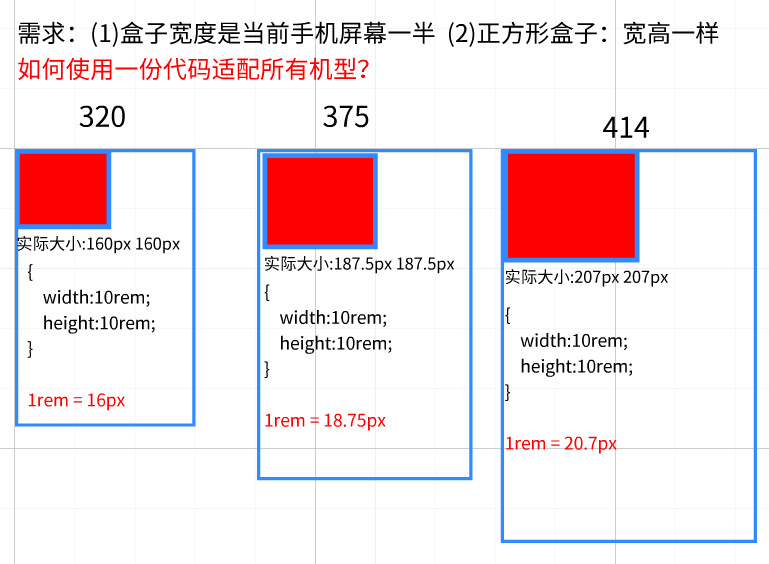


## 1.2-rem与em区别

rem与em的异同点

​            相同点：都是相对单位

​            不同点：相对的参照物不同

​                em：相对的是元素自身的字体大小

​                rem：相对于的根元素（html）的字体大小


```html
<!DOCTYPE html>
<html lang="en">
<head>
    <meta charset="UTF-8">
    <meta name="viewport" content="width=device-width, initial-scale=1.0">
    <meta http-equiv="X-UA-Compatible" content="ie=edge">
    <title>Document</title>

    <style>
        *{
            padding: 0;
            margin: 0;
        }

        /*rem与em的异同点
            相同：都是相对单位，都是相对字体大小
            不同： 相对参考不一样
                em:参考元素自身字体大小
                rem:参考html元素字体
        */

        html{
            font-size: 20px;
        }

        /* 一般开发中html的字体大小只是为了修改rem的参考值，不会对网页原有字体产生影响
            因为网页的字体一般设置body的font-size
        */

        .box{
            font-size: 20px;/* 1em = 20 */

            /* width: 5em;
            height: 5em; */

            width: 5rem;
            height: 5rem;
            background-color: red;
        }

        .box1{
           font-size: 30px;/* 1em = 30 */

           /* width: 5em;
           height: 5em; */

           width: 5rem;
           height: 5rem;
           background-color: green;
       }
    </style>
</head>
<body>
    <!-- 需求：（1）盒子宽度是屏幕宽度一半 （2）正方形盒子（宽高需要同时适配） -->
    <div class="box"></div>
    <div class="box1"></div>
</body>
</html>
```


## 1.3-rem布局流程


```html
<!DOCTYPE html>
<html lang="en">
<head>
    <meta charset="UTF-8">
    <meta name="viewport" content="width=device-width, initial-scale=1.0">
    <meta http-equiv="X-UA-Compatible" content="ie=edge">
    <title>Document</title>

    <!-- 导入js文件 -->
    <script src="rem.js"></script>

    <style>
        *{
            padding: 0;
            margin: 0;
        }

        /* rem：相对单位，相对html字体大小 
            1.如果使用rem，一般要设置html字体大小
            2.一般需要将html字体大小设置为当前屏幕的 1/10
            3.如何动态设置html字体大小是屏幕 1/10
                * js来实现
        */

        .box{
            font-size: 20px;/* 1em = 20 */

            width: 5rem;
            height: 5rem;
            background-color: red;
        }

        .box1{
           font-size: 30px;/* 1em = 30 */

           width: 5rem;
           height: 5rem;
           background-color: green;
       }
    </style>
</head>
<body>
    <!-- 需求：（1）盒子宽度是屏幕宽度一半 （2）正方形盒子（宽高需要同时适配） -->
    <div class="box"></div>
    <div class="box1"></div>
</body>
</html>
```


### 动态修改html字体大小为屏幕 1/10

* `在实际开发中，一般公司都会设置 1rem = 1/10屏幕宽度`

  * 也有的公司会设置1rem = 1/20屏幕宽度

  * 也有的公司会设置1rem = 1/100 屏幕宽度

  * 这个rem的值无论是多少，都不影响它本身的作用：同时适配宽度和高度。所以还是那句话，怎么舒服怎么来

    * 这里是淘宝内部解释为什么淘宝的开发团队将rem设置为 1/10 屏幕宽度(其实是为了以后能够兼容vw和vh)

      * https://www.w3cplus.com/mobile/lib-flexible-for-html5-layout.html

      

* rem布局注意点
  * a.一般使用rem布局，都需要设置html字体大小
  * b.实际开发中，一般设置  html字体大小 = 1/10 屏幕宽度

  ​            也就是说，通过动态设置html字体大小，实现  1rem = 1/10 屏幕宽度
  * c.动态设置html字体大小为手机当前屏幕 1/10的两种方式
    * 1.使用js代码（推荐）
    * 2.使用css媒体查询
      * 由于实际开发中一般使用js代码来动态设置html字体大小，实现1rem = 1/10 屏幕宽度，
        * 由于暂时未接触js语言，所以这里老师提前写好一个js文件，我们开发时只需要导入即可


## ==1.4-vscode开发神器cssrem使用介绍==


```html
<!DOCTYPE html>
<html lang="en">
<head>
    <meta charset="UTF-8">
    <meta name="viewport" content="width=device-width, initial-scale=1.0">
    <meta http-equiv="X-UA-Compatible" content="ie=edge">
    <title>Document</title>

    <!-- 1.导入rem.js 动态修改rem为屏幕1/10 -->
    <script src="rem.js"></script>

    <style>
        .box{
            width: 100%;/* 能用百分比就用百分比 */
            /* 2.计算当前设计图稿对应的rem值
                a.手动用计算器计算
                b.使用cssrem自动计算(充当计算器作用，如果你的设计稿是750，设置37.5)
                    * 修改设置后重启才生效
            */
            height: 4.666667rem;
            background-color: red;
        }
    </style>
</head>
<body>
    <!-- 京东导航栏750设计稿： 高度是175px，如何实现高度适配 -->
    <div class="box"></div>
</body>
</html>
```


* cssrem：不需要我们来计算rem，会自动帮我们计算。


1.安装插件


2.将插件的html字体大小设置为你当前获取的设计图稿的 1/10 

​	`注意二倍图，如果你的设计图稿是640，表示屏幕尺寸是320，那么你的1rem = 32`

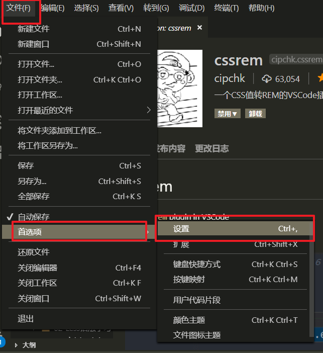


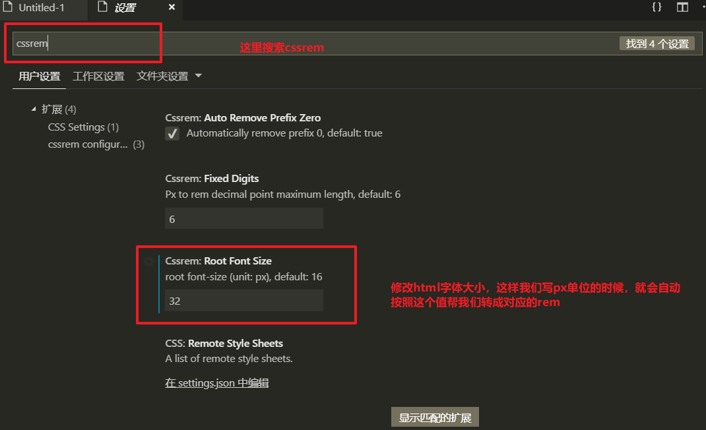


`养成习惯：修改之后重启生效`

3.按照真实的设计图稿写px，让cssrem自动帮你转成rem单位


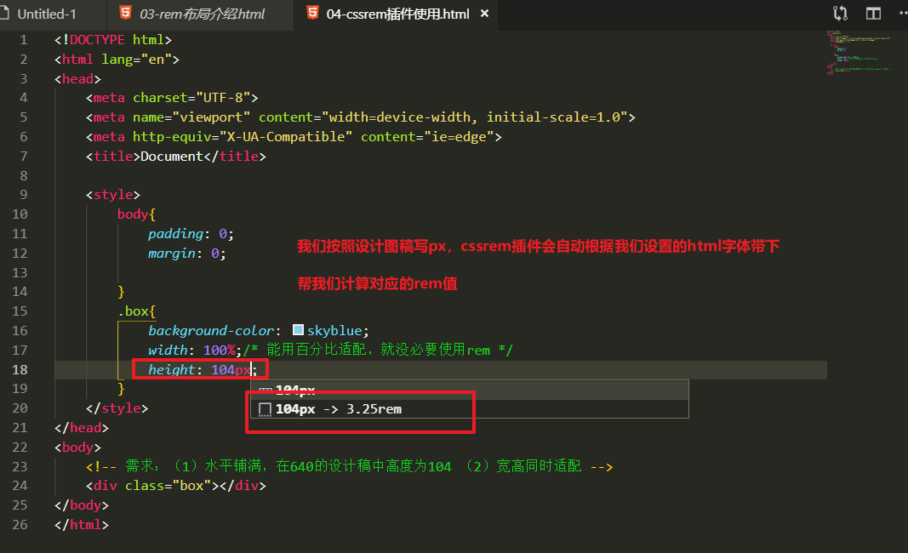


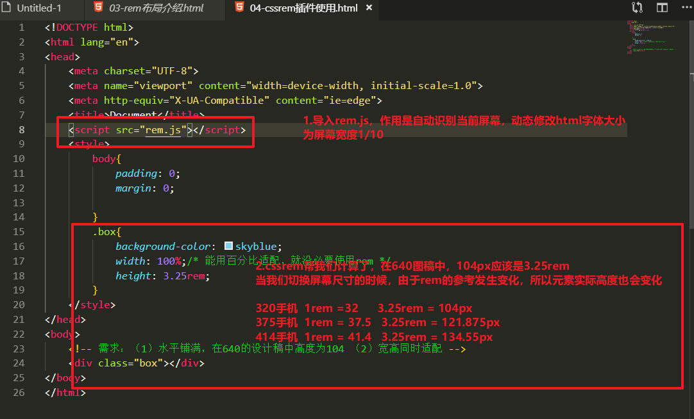

## 1.5 课后了解(真实项目中的设计图稿)

* 以下是本人以前负责的一个项目的完整架构


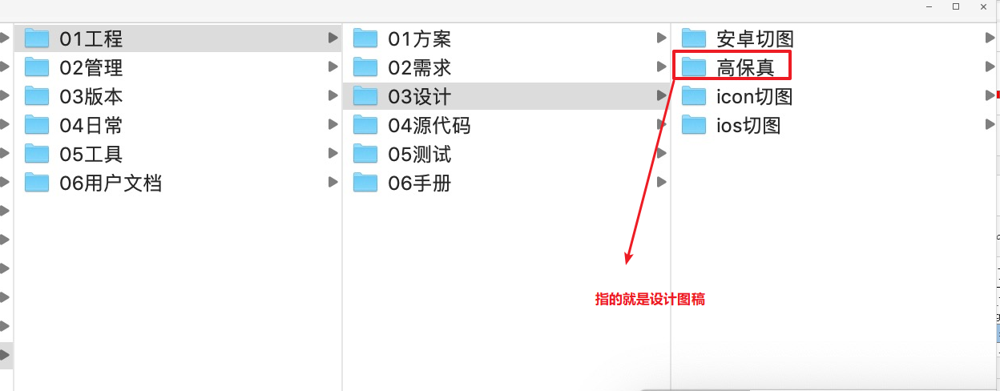

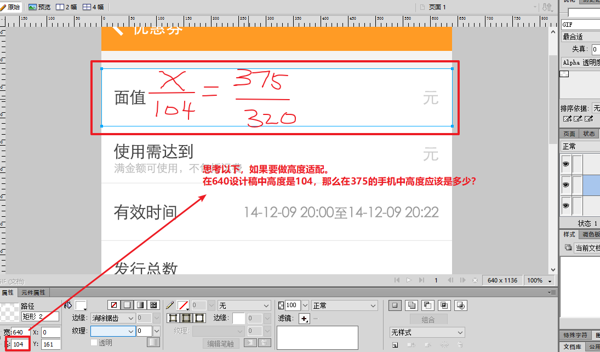


# 02-Less语法(CSS预处理语言)


## 1.1-Less介绍及开发环境搭建

* 1.什么是`Less`：一种全新的css预处理语言。
  * 可以理解为，对原有的CSS语法进行了拓展，让我们的CSS代码变得更灵活，更好维护。
  * 给css代码加buff，让css代码写起来更牛逼
* 2.什么是`预处理(预编译)`
  * 预处理的意思就是使用Less语法写出来的代码不能直接被浏览器解析识别，还需要借助工具转成css代码，`这种不能被浏览器直接解析，而需要预先转换的语言，就叫做预处理语言`
  * 目前使用的css，它的语法实际上是效率不高的，定义样式时，我们会写很多重复的代码，而且修改起来很麻烦，为此，科学家又开发了新的写css的语法，可以让我们更有效率的写css，开发这个的目的是为了适应前端开发日益复杂化和工程化的需要，这些新的语法写出来的代码，浏览器是不能解析的，所以这些代码写完之后，还需要用工具转化成正常的css代码，才能使用，这样去编写css代码就叫做css预编译。这个新的语法有三种，除了有less，还有sass和stylus，它们的语法类似，在这里说的是less。
* 3.Less开发环境搭建(两种方式)
  * (1)v==scode：安装插件`Easy==Less`
    * 使用：创建一个后缀为less的文件，写less语法，文件保存之后会自动生成css文件
  * (2)其他方式：
    * webstorm：自带less编译功能,实时编译
      * 文件  - > 设置 - > 工具 -> file watchers  -> 选择less文件点击编辑 -> 取消实时编译选项
    * Sublime安装插件: LESS2CSS
      * ctral+shift+P  ---> 在搜索栏中输入   LESS2CSS 
    * Node环境(适用于任何开发工具，但是安装比较麻烦，需要联网)
      * （1）安装node环境<http://nodejs.cn/download/>
        * 运行cmd，输入指令:`node -v`，可以检查是否安装成功
      * （2）安装less:运行cmd，输入指令:`npm  install  less  -g`
        * `lessc -v`这个指令用于检查less是否安装
      * （3）将你写好的后缀为less的文件预编译成css文件
        * a.首先在cmd中进入你的文件夹:`cd 你的less文件所在文件夹`
        * b.开始编译：`lessc  要被编译的less文件  要编译为自定义CSS文件`
          * 例如：`lessc   index.less   index.css`
    * 考拉软件
      * <http://koala-app.com/index-zh.html>

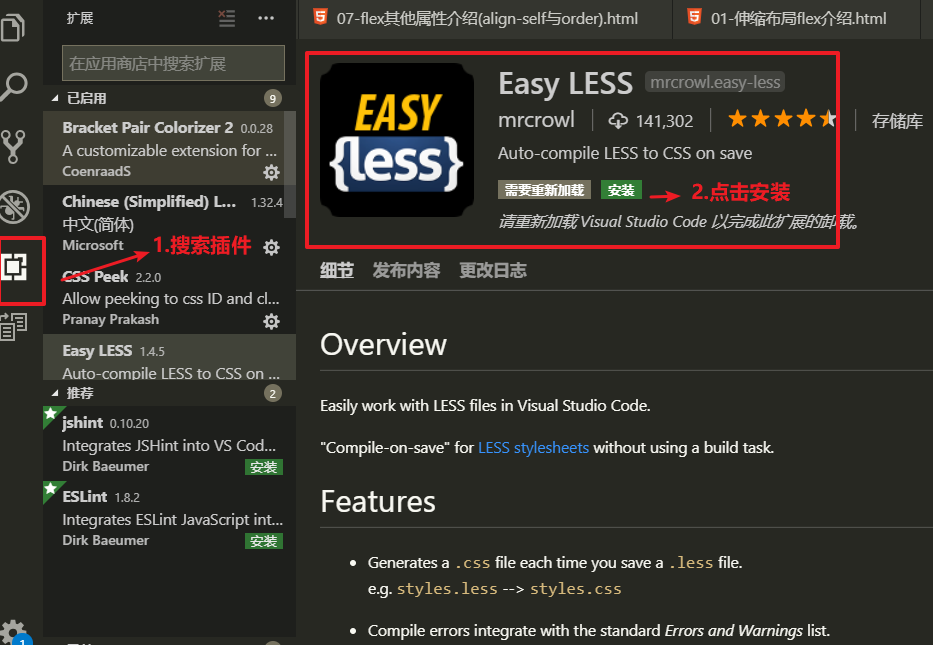


* 4.less使用流程
  * a.新建一个后缀为less的文件，使用less语法写代码
    * less语法只是对css做了一个拓展，也就是说在less中可以使用所有的css语法
  * b.将less文件预编译成css文件
    * 这一步Easy Less插件已经帮我们做好了，只要你保存less文件，就会自动帮我们对应的css文件
    * 因为less语法不能直接被浏览器识别，可以需要预处理成css语法
  * c.在html中导入css文件
    * `注意：是导入css而不是less`
      * 原因已经介绍过，浏览器只能识别css语法


## 1.2-Less语法学习

`less的基本语法和css是一样的，只是有很多语法css是没有的，在这里主要讲的是css里面没有的语法`

* 课外学习传送门：<https://less.bootcss.com/#>


### less语法-变量

* 1.变量(variable)作用：存储数据
  * 类似于数学中的字母，例如 a = 10,  ax5 = 50.这个a就代表10，好处就是便于维护css代码
* 2.语法：`@变量名 : 值`
  * `@w:100px`,定义一个变量w，存储宽度100px
  * `@bgc:hotpink`,定义一个变量bgc，存储颜色hotpink
* 3.注意点：`less中的变量可以使用 + - * / 进行数学计算`
  * 加：+
  * 减：-
  * 乘：*
  * 除：/


```less
/* 这种注释相当于css注释，会在css文件显示 */
// 这种注释相当于less注释，只会在less文件显示，css文件不显示


//定义一个保存宽度px的变量
@w : 100px;
//定义一个保存颜色的变量
@bgc : pink;

//less中的变量可以使用 +  -  *  / 进行数学计算,运算规则与小学数学算术运算一致

.one{
    width: (@w + 20)*2; //240
    height: @w + 30*2; //160
    background-color: @bgc;
}

.two{
    width: @w/2;//50
    height: @w - 10;//90
    background-color: pink;
    border: @w/10 solid green;
}
```

* 上面的less语法会被编译成以下css代码


```css
/* 这种注释相当于css注释，会在css文件显示 */
.one {
  width: 240px;
  height: 160px;
  background-color: pink;
}
.two {
  width: 50px;
  height: 90px;
  background-color: pink;
  border: 10px solid green;
}


```

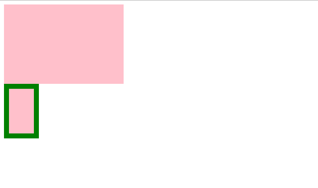


### less语法-混合


* 1.less混合语法作用：在一段css代码中通过类名插入另一端css代码
* 2.语法: `.类名()`


* less代码如下

```less
.myborder{
    border-top: 5px solid pink;
    border-bottom: 10px solid green;
}

.box{
    width: 200px;
    height: 200px;
    background-color: yellowgreen;

    //使用混合语法插入上面一段css代码:  .类名()
    .myborder();
}
```

* 预处理之后的css代码

```css
.myborder {
  border-top: 5px solid pink;
  border-bottom: 10px solid green;
}
.box {
  width: 200px;
  height: 200px;
  background-color: yellowgreen;
  border-top: 5px solid pink;
  border-bottom: 10px solid green;
}

```


### ==less语法-嵌套==


* `less嵌套语法作用`：将后代选择器写在一个大括号中，提高代码阅读性

* less代码如下

```less
.box{
    width: 200px;
    height: 200px;
    border: 2px solid red;
    
    span{//相当于css的后代选择器: .box span
        color: green;
    }

    >span{//相当于css子代选择器： .box>span
        color: purple;
    }

    a{//相当于css后代选择器： .box a
        color: blue;
        &:hover{//less支持多层嵌套，注意伪类前面需要加上&,相当于css： .box a:hover
            color: black;
        }
    }
}
```


* 预处理之后的css代码

```css
.box {
  width: 200px;
  height: 200px;
  border: 2px solid red;
}
.box span {
  color: green;
}
.box > span {
  color: purple;
}
.box a {
  color: blue;
}
.box a:hover {
  color: black;
}

```


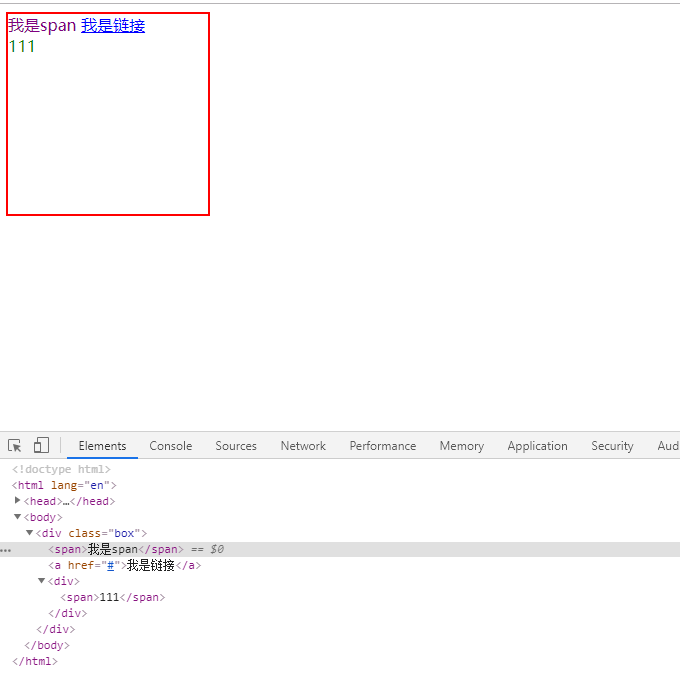


### less语法-导入


* 1.less导入语法作用：在一个文件中导入多个css文件，可以减少html文件中link标签数量(提高代码简洁性)
  * `其实就是将多个css文件代码合并到一个css文件中	`
  * 项目一般是会有多个css文件，那么现在我们使用less的方式来写css，相对来讲，文件数目会翻倍。
    如果每个css文件我都导入，那相对来讲是一件非常麻烦的事情,所以我们可以利用LESS中的导入语法
* 2.导入语法: `@imports "需要导入的less文件名;"`
  * 注意点
    * a.注意less文件名需要使用双引号引起来
    * b.最后面那个分号不能省略
    * c.后缀名less可以省略


```css
//导入：相当于把多个文件css代码合并到一个css文件中

//将base和index两个文件css代码合并到total文件中

@import "base.less";//后缀名less也可以省略， @import "base"

@import "index.less";
```


# 03-案例：京东优惠卷(rem+less)

特点：宽度/高度/字体大小  根据屏幕大小等比例缩放

准备工作：根据设计图稿设置cssrem的html字体大小

 * 例如：设计稿是640px，那么应该设置1rem = 32px
    * 当我们代码写32px的时候，此时cssrem会帮我们转成1rem
    * 切换手机之后，由于`rem.js`文件动态修改了rem的值，所以元素高度会自动根据屏幕变化


* ==实际开发rem+less布局流程==

  * 1.导入rem.js，动态设置rem相对单位为屏幕宽度 1/10

  * 2.根据UI的设计稿设置cssrem的配置（让插件自动帮我们计算设计稿中的px是多少rem）

  * 3.使用less语法来写样式（提高效率）

  * 4.按照设计稿的px来写代码，用cssrem自动转换成rem单位

    

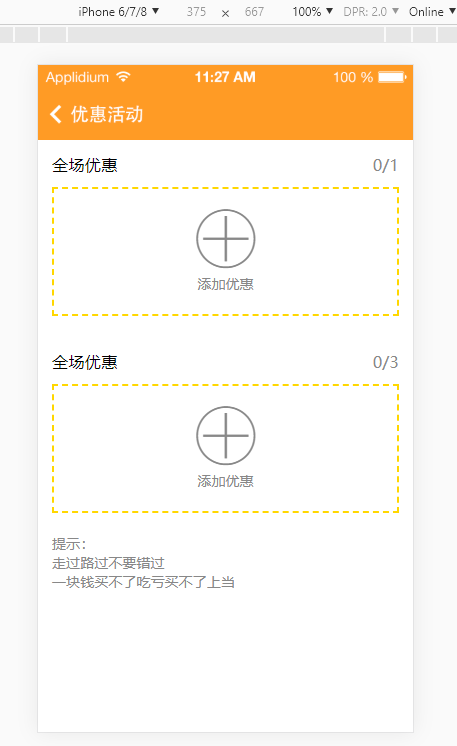


### 完整HTML代码


```html
<!DOCTYPE html>
<html lang="en">

<head>
    <meta charset="UTF-8">
    <meta name="viewport" content="width=device-width, initial-scale=1.0">
    <meta http-equiv="X-UA-Compatible" content="ie=edge">
    <title>Document</title>

    <link rel="stylesheet" href="css/index.css">
    <link rel="stylesheet" href="css/style.css">

    <!-- 导入rem.js -->
    <script src="js/rem.js"></script>
</head>

<body>
    <div class="container">
        <!--  -->
        <div class="top_bar">
            
        </div>

        <div class="content_list">
            <div class="item">
                <div class="item_title">
                    <span>全场优惠</span>
                    <span>0/1</span>
                </div>
                <div class="item_add">
                    <i class="icon-add"></i>
                    <span>添加优惠</span>
                </div>
            </div>
            <div class="item">
                <div class="item_title">
                    <span>全场优惠</span>
                    <span>0/3</span>
                </div>
                <div class="item_add">
                    <i class="icon-add"></i>
                    <span>添加优惠</span>
                </div>
            </div>
        </div>

        <div class="tips">
            <span>提示：</span>
            <span>走过路过不要错过</span>
            <span>一块钱买不了吃亏买不了上当</span>
        </div>
    </div>
</body>

</html>
```


### 完整less代码


```less
@import "base";

/* 版心 */
.container{
    width: 100%;
    min-width: 320px;
    max-width: 750px;
    margin: 0 auto;
    /* 1.顶部栏 */
    .top_bar img{
        width: 100%;
    }

    /* 2.优惠卷列表 */
    .content_list{
        width: 100%;
        .item{
            width: 100%;
            height: 5.25rem;
            padding: .375rem;
            .item_title{
                height: .875rem;
                position: relative;
            }
            .item_title span{
                font-size: .4375rem;
                position: absolute;
                display: block;
                &:nth-child(1){
                    left: 0;
                }
                &:nth-child(2){
                    right: 0;
                    color: #888;
                }
            }
            .item_add{
                width: 100%;
                border: .0625rem dashed gold;
                height: 3.4375rem;
                text-align: center;
                color: #888;
                padding: .5625rem;
                i{
                    font-size: 1.5625rem;
                }
                span{
                    display: block;
                    margin-top: .15625rem;
                }
            }
        }
    }
    /* 3.提示信息 */
    .tips span{
        display: block;
        text-align: left;
        font-size: .375rem;
        color: #888;
        padding-left: .375rem;
    }
}
```

