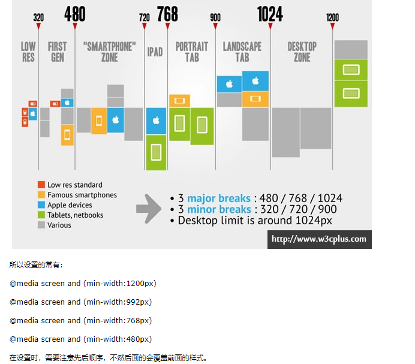

今日学习任务

* [ ] 01-响应式布局
  * [ ] 响应式布局原理
  * [ ] 媒体查询
  * [ ] 练习：媒体查询实现响应式布局
* [ ] 02-案例：Bootstrap官网
  * [ ] 响应式布局思路


# 01-响应式布局与媒体查询

## 1.1-响应式布局与媒体查询


* 1.响应式布局：一个页面适配多个不同终端（pc、移动端、平板端）

* 2.响应式布局核心原理：`根据不同的屏幕尺寸加载不同的样式`
  * 25个经典的响应式布局网站:<http://www.daqianduan.com/4614.html?tdsourcetag=s_pcqq_aiomsg>
  * 国内最经典的响应式布局网站：<http://www.bootcss.com/>
    * bootstrap是国内一流的响应式布局框架，也是本阶段的一个核心知识点

* 3.响应式布局的优缺点及适用场景
  * 优缺点
    * 优点：`全适配`:可以制作全适配的网页，就是一个网页可以同时适配PC端和移动端，而不同写两套页面。
    * 缺点：`不便于维护`:需要写大量的css代码，相当于把PC端和移动端的css代码写到一个文件中，然后根据屏幕尺寸加载对应的代码。
  * 适用场景
    * 适合：`网页结构简单`:通常是专题类网站，例如一些播客专题类<https://www.csdn.net/>，技术专题类<http://www.bootcss.com/>
    * 不适合：`网页结构复杂`:比如电商类(京东、淘宝、天猫)，这些网站由于结构很复杂，使用响应式开发维护起来特别麻烦，反而是做两套页面分别适配PC端与移动端更方便
  * 如何区分一个网站是否使用了响应式布局：`谷歌控制台切换到移动端，然后刷新网页`
    * 如果PC端和移动端网址一样：说明使用了响应式布局
    * 如果PC端和移动端网址不一样：说明没有使用响应式布局，而是做两套页面匹配PC端和移动端

* ## 媒体查询

  * 1.`作用`：媒体查询`@media`是css3中新增的功能，它的作用是可以针对不同的媒体类型定义不同的样式
    * 课外学习传送门：<http://www.runoob.com/cssref/css3-pr-mediaquery.html>
  * 2.语法： `@media 媒体类型 and (媒体特征){ css样式代码 }`
    * 例如： `@media screen and (width:700px){ css样式代码}`
      * 意思： 如果屏幕的宽度是700px，就加载大括号里面的css样式
    * 例如：`@media screen and (max-width:700px){ css样式代码}`
      * 意思：如果屏幕的最大宽度不超过700px（言外之意就是屏幕宽度 <= 700px）,就加载大括号里面的css样式
    * 例如：`@media screen and (min-width:1000px) and (max-width:1200px){ css样式代码}`
      * 意思：如果屏幕宽度范围 在[1000到1200]之间，就加载大括号里面的样式
  * 3.语法注意点:==and左右两边的空格不能省略==
    * 媒体类型：具体可查询w3c文档，实际开发最最最常用的就是screen，表示屏幕
      * all：所有设备
      * print：打印设备，用于打印机以及打印预览
      * screen：用于电脑，平板电脑，手机的屏幕
    * 媒体特征：非常的多，但是常用的就下面这2个
      * `max-width:宽度值`
        * 意思：屏幕的宽度不超过设置的宽度值，也就是说 屏幕宽度 <= 宽度值
      * `min-width:宽度值`
        * 意思：屏幕的宽度不小于设置的宽度值，也就是说 屏幕宽度 >= 宽度值
    * 如果不设置媒体类型，则默认为screen，所以上面的语法可以简写成
      * `@media(max-width:700px){ css样式代码 }`

```html
<!DOCTYPE html>
<html lang="en">
<head>
    <meta charset="UTF-8">
    <meta name="viewport" content="width=device-width, initial-scale=1.0">
    <meta http-equiv="X-UA-Compatible" content="ie=edge">
    <title>Document</title>

    <style>
        /* 
        1.响应式布局：一个html页面可以同时适配PC端和移动端
            好处：全适配（一个文件适配多个不同的pc和移动），总代码量不变
            坏处：css代码过多不好维护
                应用场景：网页结构简单（技术专题类）
                不适合：网页结构复杂（电商）
        
        2.响应式布局核心原理： 根据媒体查询不同的设备加载不同的样式
        */

        
        /* 媒体查询 */

        /* 1.标准语法 */
        @media screen and (width:1000px){
            /* 如果屏幕宽度是1000就会加载大括号中的样式 */
            body{
                background-color: red;
            }
        }

        /* 2.简洁语法 */
        @media(width:1000px){
            body{
                background-color: orange;
            }
        }

        /* 3.区间查询
        min-width : 1200px. 电脑最小宽度不能小于1200px，言外之意： 屏幕宽度 >= 1200px
        max-width : 1200px. 电脑最大宽度不能超过1200px。 屏幕宽度 <= 1200px
        */

        @media(min-width:1200px){
            /* 屏幕宽度 >= 1200px 样式生效 */
            body{
                background-color: yellow;
            }
        }

        @media(max-width:1200px){
            /* 屏幕宽度 <=  1200px 样式生效 */
            body{
                background-color: green;
            }
        }

        /* 需求：  屏幕宽度范围   992 - 1200 */
        @media(min-width:992px) and (max-width:1200px){
            body{
                background-color: skyblue;
            }
        }
    </style>
</head>
<body>
    
</body>
</html>
```

## 1.2-媒体查询练习

* 常见的媒体尺寸见下图(了解即可):实际开发以产品需求为准



```html
<!DOCTYPE html>
<html lang="en">
<head>
    <meta charset="UTF-8">
    <meta name="viewport" content="width=device-width, initial-scale=1.0">
    <meta http-equiv="X-UA-Compatible" content="ie=edge">
    <title>Document</title>

    <style>
        /* 实体开发中媒体查询的区别分别对应的是四种设备
        
        设备                   屏幕范围            媒体查询语法              需求
        大pc（台式机）           >= 1200px                                   红色
        小pc(笔记本，ipadPro)    992px-1200px                                橙色
        平板(ipad)              768px-992px                                  黄色
        手机(ihone)              <=768px                                      绿色
        */

        /* >= 1200px */
        @media(min-width:1200px){
            body{
                background-color: red;
            }
        }

        /* 992-1200 */
        @media(min-width:992px) and (max-width:1200px){
            body{
                background-color: orange;
            }
        }

        /* 768-992 */
        @media(min-width:768px) and (max-width:992px){
            body{
                background-color: yellow;
            }
        }

        /* <= 768 */
        @media(max-width:768px){
            body{
                background-color: green;
            }
        }
    </style>
</head>
<body>
    
</body>
</html>
```


## 1.3-媒体查询实现响应式布局


```html

<!DOCTYPE html>
<html lang="en">
<head>
    <meta charset="UTF-8">
    <meta name="viewport" content="width=device-width, initial-scale=1.0">
    <meta http-equiv="X-UA-Compatible" content="ie=edge">
    <title>Document</title>

    <style>
         /* 实体开发中媒体查询的区别分别对应的是四种设备
        
        设备                   屏幕范围            媒体查询语法              需求
        大pc（台式机）           >= 1200px                                   4
        小pc(笔记本，ipadPro)    992px-1200px                                3
        平板(ipad)              768px-992px                                  2
        手机(ihone)              <=768px                                     1
        */

        /* 实际开发中媒体查询的流程
        1.先写pc端公共样式(>=1200px样式)
        2.使用媒体查询覆盖样式(容易出错点：选择器权重)
            992-1200
            768-992
            <=768
        */

        *{
            padding: 0;
            margin: 0;
        }
        .con>div{
            float: left;
            background-color: green;
            text-align: center;
            line-height: 200px;
        }

        .box{
            width: 23%;
            margin: 50px 1%;
        }


        @media(min-width:992px) and (max-width:1200px){
            .box{
                width:31.33%;
                margin: 50px 1%;
            }
        }

        @media(min-width:768px) and (max-width:992px){
            .box{
                width:48%;
                margin: 50px 1%;
            }
        }

        @media(max-width:768px){
            .box{
                width: 50%;
                margin: 50px 25%;
            }
        }
    </style>
</head>
<body>
    <div class="con">
        <div class="box">1</div>
        <div class="box">2</div>
        <div class="box">3</div>
        <div class="box">4</div>
    </div>
</body>
</html>
```


# 02-案例：Bootstrap官网


* 1.小技巧:
  * 背景与与渐变颜色共存:注意两个属性之间用逗号隔开
    * `*background*:url(../imgs/bs.png) repeat center,linear-gradient(45deg, #100a34, #5d2b4c) ;`
  * 解决margin塌陷的三种方式
    * 1.border
    *  2.overflow: hidden
    * 3.padding

* 2.实际开发中响应式布局思路

  ​	1.先写 1200px pc端的公共样式(不使用媒体查询，在任何尺寸屏幕下样式生效)

  ​	2.使用媒体查询@metia来适配其他的三个样式

  ​    	992 <= 大平板/小屏电脑 < 1200

  ​    	768 <= 平板 < 992

  ​    	手机 < 768


## 1-先写1200px的样式

## 2-通过媒体查询适配992<=屏幕<1200样式

1.版心宽度变成970px

2.顶部top_bar的ul列表中隐藏第二个li元素

3.底部商品列表宽高变成300*350

​	由于使用了伸缩盒子且允许换行，所以当父盒子宽度变小之后，子盒子会自动换行(970/300 取整得到3)

```less
/* 媒体查询实现响应式布局 */
 @media(min-width: 992px) and (max-width:1200px){
    .container{
        width: 970px;
        margin: 0 auto;
    }

    .top-bar ul li:nth-child(2){
        display: none;
    }

    .project-list .item a{
        width: 300px;
        height: 350px;
    }
}
```


## 3-通过媒体查询适配768<=屏幕<992样式

* 1.版心宽度变成750px

  2.顶部top_bar的ul列表中隐藏第一个li元素和第二个li元素

  3.顶部top_bar隐藏右边的关于按钮

  4.底部商品列表宽高变成300*350

  ​	由于使用了伸缩盒子且允许换行，所以当父盒子宽度变小之后，子盒子会自动换行(750px/300 取整得到2)

```less
@media(min-width: 768px) and (max-width:992px){
    .container{
        width: 750px;
        margin: 0 auto;
    }

    .top-bar ul li:nth-child(1){
        display: none;
    }

    .top-bar ul li:nth-child(2){
        display: none;
    }

    .top-bar ul .about{
        display: none;
    }

    .project-list .item a{
        width: 300px;
        height: 350px;
    }
}
```


## 4-通过媒体查询适配  屏幕<768样式

1.版心宽度变成100%(手机端水平铺满)

2.顶部top_bar

​	只显示ul列表第一个li，其他隐藏

​	关于按钮隐藏，显示menu菜单图标

​	`注意：默认menu使用行内属性设置隐藏display：none`

​	`如果在css中想要覆盖行内属性，则可以使用顶级权重 !`

```less
@media(max-width:768px){
    .container{
        width: 100%;
        margin: 0 auto;
        padding: 0px 5px;
    }

    .top-bar ul li:nth-child(n+2){
        display: none;
    }

    .top-bar ul .menu{
        display: block !important;
        float: right;
        margin-right: 0px;
    }

    .project-list .item a{
        width: 300px;
        height: 350px;
    }
}
```


## 完整HTML代码


```html
<!DOCTYPE html>
<html lang="en">

<head>
    <meta charset="UTF-8">
    <meta name="viewport" content="width=device-width, initial-scale=1.0">
    <meta http-equiv="X-UA-Compatible" content="ie=edge">
    <title>Document</title>
    <link rel="stylesheet" href="css/index.css">
</head>

<body>
    <!-- 1-头部栏 -->
    <div class="top-bar">
        <div class="container">
            <ul class="clearfix">
                <li><a href="">Bootstrap中文网</a></li>
                <li><a href="">Bootstrap2中文文档</a></li>
                <li><a href="">Bootstrap3中文文档</a></li>
                <li><a href="">Bootstrap4中文文档</a></li>
                <li><a href="">Less 教程</a></li>
                <li><a href="">jQuery API</a></li>
                <li><a href="">网站实例</a></li>
                <li class="about"><a href="">关于</a></li>
                <li class="menu" style="display:none"><a href=""></a></li>
            </ul>
        </div>
    </div>
    <!-- 2.banner栏 -->
    <div class="banner">
        <div class="container">
            <h1>Bootstrap</h1>
            <h2>简洁、直观、强悍的前端开发框架，让web开发更迅速、简单</h2>
            <a href="#">Bootstrap3中文文档</a>
        </div>
    </div>
    <!-- 3.项目列表 -->
    <div class="project-list">
        <div class="container">
            <div class="item">
                <a href="">
                    
                    <span>Node.js 是一个基于 Chrome V8 引擎的 JavaScript 运行环境。Node.js 使用了一个事件驱动、非阻塞式 I/O 的模型，使其轻量又高效。</span>
                </a>
                <a href="">
                    
                    <span>Node.js 是一个基于 Chrome V8 引擎的 JavaScript 运行环境。Node.js 使用了一个事件驱动、非阻塞式 I/O 的模型，使其轻量又高效。</span>
                </a>
                <a href="">
                    
                    <span>Node.js 是一个基于 Chrome V8 引擎的 JavaScript 运行环境。Node.js 使用了一个事件驱动、非阻塞式 I/O 的模型，使其轻量又高效。</span>
                </a>
                <a href="">
                    
                    <span>Node.js 是一个基于 Chrome V8 引擎的 JavaScript 运行环境。Node.js 使用了一个事件驱动、非阻塞式 I/O 的模型，使其轻量又高效。</span>
                </a>
                <a href="">
                    
                    <span>Node.js 是一个基于 Chrome V8 引擎的 JavaScript 运行环境。Node.js 使用了一个事件驱动、非阻塞式 I/O 的模型，使其轻量又高效。</span>
                </a>
                <a href="">
                    
                    <span>Node.js 是一个基于 Chrome V8 引擎的 JavaScript 运行环境。Node.js 使用了一个事件驱动、非阻塞式 I/O 的模型，使其轻量又高效。</span>
                </a>
                <a href="">
                    
                    <span>Node.js 是一个基于 Chrome V8 引擎的 JavaScript 运行环境。Node.js 使用了一个事件驱动、非阻塞式 I/O 的模型，使其轻量又高效。</span>
                </a>
                <a href="">
                    
                    <span>Node.js 是一个基于 Chrome V8 引擎的 JavaScript 运行环境。Node.js 使用了一个事件驱动、非阻塞式 I/O 的模型，使其轻量又高效。</span>
                </a>
                <a href="">
                    
                    <span>Node.js 是一个基于 Chrome V8 引擎的 JavaScript 运行环境。Node.js 使用了一个事件驱动、非阻塞式 I/O 的模型，使其轻量又高效。</span>
                </a>
                <a href="">
                    
                    <span>Node.js 是一个基于 Chrome V8 引擎的 JavaScript 运行环境。Node.js 使用了一个事件驱动、非阻塞式 I/O 的模型，使其轻量又高效。</span>
                </a>
                <a href="">
                    
                    <span>Node.js 是一个基于 Chrome V8 引擎的 JavaScript 运行环境。Node.js 使用了一个事件驱动、非阻塞式 I/O 的模型，使其轻量又高效。</span>
                </a>
                <a href="">
                    
                    <span>Node.js 是一个基于 Chrome V8 引擎的 JavaScript 运行环境。Node.js 使用了一个事件驱动、非阻塞式 I/O 的模型，使其轻量又高效。</span>
                </a>
            </div>
        </div>
    </div>
</body>

</html>
```


## 完整less代码


```less
@import "base";

/*实际开发中响应式布局思路
1.先写 1200px pc端的公共样式(不使用媒体查询，在任何尺寸屏幕下样式生效)
2.使用媒体查询@metia来适配其他的三个样式
    992 <= 大平板/小屏电脑 < 1200
    768 <= 平板 < 992
    手机 < 768
 */

/* 响应式布局版心宽度
    width: 1170px;     >1200px 
    width: 970px;      992-1200 
    width: 750px;      768-992 
    width: 100%;       768-992 
*/
.container{
    width: 1170px;
    margin: 0 auto;
}

/* 1.头部栏 */
.top-bar{
    width: 100%;
    height: 44px;
    background-color: #222;
    border-bottom: 2px solid black;

    ul{
        width: 100%;
        li{
            float: left;
            margin-right: 30px;
            a{
                display: block;
                text-align: center;
                line-height: 44px;
                color: #9D9D96;
            }

            &:nth-child(1){
                font-size: 18px;
            }
        }

        .about{
            float: right;
        }

    }
}

/* 2.banner栏 */
.banner{
    width: 100%;
    height: 470px;
    /* 背景图与渐变颜色共存： 两个属性之间用逗号隔开 */
    background:url(../imgs/bs.png) repeat center,linear-gradient(45deg, #100a34, #5d2b4c) ;
    text-align: center;
    position: relative;
    /* 解决子元素margin塌陷三种方案
    1.border
    2.overflow: hidden
    3.padding
    */
    overflow: hidden;
    h1{
        color: #fff;
        font-size: 70px;
        margin-top: 100px;
    }

    h2{
        color: #fff;
        font-size: 30px;
        margin-top: 30px;
    }

    a{
        display: block;
        width: 290px;
        height: 55px;
        background-color: #337AB7;
        color: #fff;
        margin: 30px auto;
        line-height: 55px;
    }
}

/* 3.项目列表 */

.project-list{
    width: 100%;

    .item{
        width: 100%;
        display: flex;
        flex-wrap: wrap;
        justify-content: space-between;

        a{
            display: block;
            width: 260px;
            height: 330px;
            text-align: center;
            border: 1px solid red;
            padding: 5px;
            margin: 10px auto;

            img{
                width: 100%;
                margin-bottom: 10px;
            }
        }
    }
}


/* 使用媒体查询实现响应式布局 */

@media(min-width: 992px) and (max-width:1200px){
    .container{
        width: 970px;
        margin: 0 auto;
    }

    .top-bar ul li:nth-child(2){
        display: none;
    }

    .project-list .item a{
        width: 300px;
        height: 350px;
    }
}


@media(min-width: 768px) and (max-width:992px){
    .container{
        width: 750px;
        margin: 0 auto;
    }

    .top-bar ul li:nth-child(1){
        display: none;
    }

    .top-bar ul li:nth-child(2){
        display: none;
    }

    .top-bar ul .about{
        display: none;
    }

    .project-list .item a{
        width: 300px;
        height: 350px;
    }
}

@media(max-width:768px){
    .container{
        width: 100%;
        margin: 0 auto;
        padding: 0px 5px;
    }

    .top-bar ul li:nth-child(n+2){
        display: none;
    }

    .top-bar ul .menu{
        display: block !important;
        float: right;
        margin-right: 0px;
    }

    .project-list .item a{
        width: 300px;
        height: 350px;
    }
}
```

