# 今日学习任务

* [ ] 01-bootstrap第三方框架学习
  * [ ] 1.bootstrap介绍
  * [ ] 2.bootstrap初始化模板
  * [ ] ==3.bootstrap全局CSS样式==
  * [ ] ==4.bootstrap组件==
  * [ ] ==5.bootstrap栅格系统==
* [ ] 02-bootstrap案例：boostrap官网制作


# 01-bootstrap响应式布局框架学习

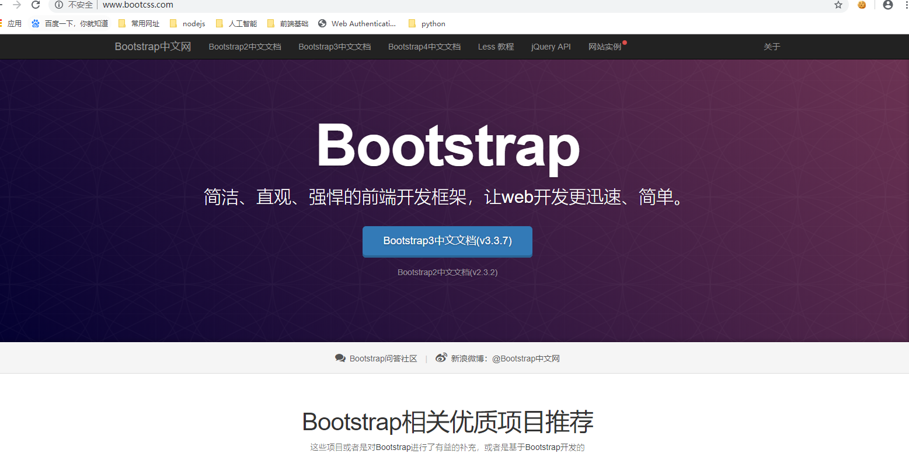

## 1.1-bootstrap介绍

* 1.什么是Bootstrap：Bootstrap是一个响应式布局的框架
  * Bootstrap作用场景：做响应式布局网页
  * 框架：就是别人提前写好的css和js文件。
    * 框架作用：提高开发人员的工作效率（ctrl + c/v  复制粘贴即可）


* 2.如何使用Bootstrap框架（该流程适用于所有的第三方框架）
  * a.进官网:<http://www.bootcss.com/>
    * `下载别人写好的代码，然后在我们自己的文件导入`
  * b.查文档(三大核心技术)：
    * bootstrap全局css样式:<https://v3.bootcss.com/css/>
    * bootstrap组件:<https://v3.bootcss.com/components/>
      * 组件：由多个html元素组成的一个独立的小功能
        * 例如：下拉菜单组件 由  div + button + ul + li元素组成
        * 例如：进度条组件 由 div + span元素组成
    * bootstrap栅格系统：<https://v3.bootcss.com/css/#grid>
      * boostrap的核心技术（实现响应式布局的核心技术）
        * 将屏幕以表格的形式划分为不同的区域(行row+列column)，在不同的屏幕下显示不同的区域
  * c.复制粘贴
  * ==本阶段所有代码均来自官网复制粘贴，所以千万不要死记硬背==
    * `课堂上老师只会介绍我们以后常用的一些功能，剩下的功能有个印象即可，以后用到了来官网复制粘贴即可(授人以鱼不如授人以渔)`


* 3.bootstrap环境配置
  * 目前bootstrap有三个版本，分别是 2.x、3.x、4.x，2.x是旧的版本，3.x是新的稳定版本，4.x还在完善中，所以我们**目前使用的是3.x版本**。 这个框架就是别人已经写好的css和JavaScript，我们要使用它，首先需要把这些样式和javascript相关文件下载下来，然后在我们的页面中引用这些文件就可以使用这个框架了，直接在这个网站下载，下载地址为：<https://v3.bootcss.com/getting-started/#download。> 
  * 下载之后，会得到一个安装包，我们只需要将安装包中的`css` `font` `js` 这三个文件夹放到项目目录即可
  * `下载jquery`:由于bootstrap这个框架里面的js代码使用的是一个js框架叫做jquery，所以我们还需要单独下载jquery，它的下载地址是：<https://code.jquery.com/jquery-1.12.4.min.js>

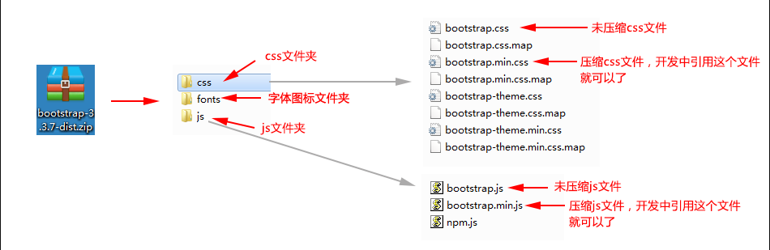


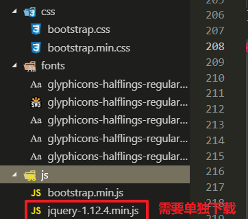


## 1.2-bootstrap初始化html模板

* 所有的第三方框架在使用时都需要导入依赖包
  * 类似于字体图标一样，使用时需要导入`style.css`
* bootstrap需要导入三个依赖包
  * `<script src="js/jquery-1.12.4.min.js"></script>`
  * `<script src="js/bootstrap.min.js"></script>`
  * `<link rel="stylesheet" href="css/bootstrap.min.css">`
* 初始化模板：就是官网里面教你在创建html的时候需要导入哪些依赖包
  * `bootstrao官方模板`：不推荐使用，太过于冗余，有些用不上的也写上了
  * `自定义bootstrap模板`：推荐使用，简洁明了


* 官方模板

```html
<!DOCTYPE html>
<html lang="zh-CN">
  <head>
    <meta charset="utf-8">
    <meta http-equiv="X-UA-Compatible" content="IE=edge">
    <meta name="viewport" content="width=device-width, initial-scale=1">
    <!-- 上述3个meta标签*必须*放在最前面，任何其他内容都*必须*跟随其后！ -->
    <title>Bootstrap 101 Template</title>

    <!-- Bootstrap -->
    <link href="https://cdn.jsdelivr.net/npm/bootstrap@3.3.7/dist/css/bootstrap.min.css" rel="stylesheet">

    <!-- HTML5 shim 和 Respond.js 是为了让 IE8 支持 HTML5 元素和媒体查询（media queries）功能 -->
    <!-- 警告：通过 file:// 协议（就是直接将 html 页面拖拽到浏览器中）访问页面时 Respond.js 不起作用 -->
    <!--[if lt IE 9]>
      <script src="https://cdn.jsdelivr.net/npm/html5shiv@3.7.3/dist/html5shiv.min.js"></script>
      <script src="https://cdn.jsdelivr.net/npm/respond.js@1.4.2/dest/respond.min.js"></script>
    <![endif]-->
  </head>
  <body>
    <h1>你好，世界！</h1>

    <!-- jQuery (Bootstrap 的所有 JavaScript 插件都依赖 jQuery，所以必须放在前边) -->
    <script src="https://cdn.jsdelivr.net/npm/jquery@1.12.4/dist/jquery.min.js"></script>
    <!-- 加载 Bootstrap 的所有 JavaScript 插件。你也可以根据需要只加载单个插件。 -->
    <script src="https://cdn.jsdelivr.net/npm/bootstrap@3.3.7/dist/js/bootstrap.min.js"></script>
  </body>
</html>
```


* 自定义模板

```html
<!DOCTYPE html>
<html lang="en">

<head>
  <meta charset="UTF-8">
  <meta name="viewport" content="width=device-width, initial-scale=1.0">
  <meta http-equiv="X-UA-Compatible" content="ie=edge">
  <title>Document</title>
  <!-- 要使用bootstrap，需要导入三个文件 -->
  <script src="js/jquery-1.12.4.min.js"></script>
  <script src="js/bootstrap.min.js"></script>
  <link rel="stylesheet" href="css/bootstrap.min.css">
</head>

<body>
    <!-- 官网复制粘贴一段代码测试一下模板是否生效 -->
  <div class="h1">你好，世界</div>
  <div class="progress">
    <div class="progress-bar progress-bar-striped active" role="progressbar" aria-valuenow="45" aria-valuemin="0"
      aria-valuemax="100" style="width: 45%">
      <span class="sr-only">45% Complete</span>
    </div>
  </div>
</body>

</html>
```


```json
{
	"Bootstrap template": {
	  "prefix": "boot",
	  "body": [
		"<!DOCTYPE html>",
		"<html lang=\"zh-CN\">",
		"<head>",
		"\t<meta charset=\"UTF-8\">",
		"\t<meta name=\"viewport\" content=\"width=device-width, initial-scale=1.0, user-scalable=0\">",
		"\t<meta http-equiv=\"X-UA-Compatible\" content=\"ie=edge\">",
		"\t<title>Bootstrap Template</title>",
		"\t<!-- 使用bootstrap需要导入三个文件 -->",
		"\t<script src=\"js/jquery-1.12.4.min.js\"></script>",
		"\t<script src=\"js/bootstrap.min.js\"></script>", 
		"\t<link href=\"css/bootstrap.min.css\" rel=\"stylesheet\">", 
		"</head>",
		"<body>",
		"\t$1\n",
		"</body>",
		"</html>"
		],
	  "description": "Bootstrap template"
	}
}
```


## ==1.3-bootstrap全局CSS样式==

* 记住bootstrap中几个经典的类名后缀对应的颜色
  * `default`:默认  纯白色
  * `link`:链接  a标签默认颜色
  * `success`: 淡绿色(成功/确定) #dff0d8
  * `info`:天蓝色(信息) #5bc0de  
  * `warning`:橘橙色(提示/警告) #f0ad4e 
  * `danger`:酒红色(失败/错误) #d9534f 
  * `primary`:青色(重要) #337ab7 


* 记住bootstrap中几个经典的尺寸类名后缀
* `lg`: 大尺寸，对应大屏pc ,在栅格系统响应式布局中对应的屏幕是 >= 1200px
* `md`：中尺寸，对应大屏平板ipadPro和小屏pc,在栅格系统响应式布局中对应的屏幕是 [992,1200)
* `sm`:小尺寸，对应平板ipad,在栅格系统响应式布局中对应的屏幕是 [768,992)
* `xs`:超小尺寸,对应手机移动端，在栅格系统响应式布局中对应的屏幕是<= 768

### 1-按钮button

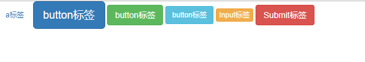

```html
<!DOCTYPE html>
<html lang="en">

<head>
    <meta charset="UTF-8">
    <meta name="viewport" content="width=device-width, initial-scale=1.0">
    <meta http-equiv="X-UA-Compatible" content="ie=edge">
    <title>Document</title>
    <!-- 要使用bootstrap，需要导入三个文件 -->
    <script src="js/jquery-1.12.4.min.js"></script>
    <script src="js/bootstrap.min.js"></script>
    <link rel="stylesheet" href="css/bootstrap.min.css">

    <!-- 这个是未压缩版的bootstrap源码，学习的时候建议导入这个可以查看源码 -->
    <link rel="stylesheet" href="css/bootstrap.css">

</head>

<body>

    <a class="btn btn-default btn-sm" href="#" role="button">a标签</a>
    <button class="btn btn-default btn-lg btn-primary" type="submit">button标签</button>
    <button class="btn btn-default btn-lg btn-success" type="submit">button标签</button>
    <button class="btn btn-default btn-lg btn-info" type="submit">button标签</button>
    <input class="btn btn-default btn-xs btn-warning" type="button" value="Input标签">
    <input class="btn btn-default btn-danger" type="submit" value="Submit标签">

</body>

</html>
```


### 2-表格table

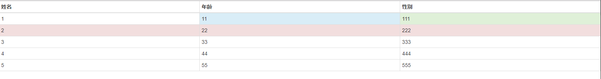


```html
<!DOCTYPE html>
<html lang="en">

<head>
    <meta charset="UTF-8">
    <meta name="viewport" content="width=device-width, initial-scale=1.0">
    <meta http-equiv="X-UA-Compatible" content="ie=edge">
    <title>Document</title>
    <!-- 要使用bootstrap，需要导入三个文件 -->
    <script src="js/jquery-1.12.4.min.js"></script>
    <script src="js/bootstrap.min.js"></script>
    <link rel="stylesheet" href="css/bootstrap.min.css">
</head>

<body>
    <table class="table table-bordered table-condensed table-hover">
        <thead>
            <tr>
                <th >姓名</th>
                <th>年龄</th>
                <th>性别</th>
            </tr>
        </thead>
        <tbody>
            <tr>
                <td class="primary">1</td>
                <td class="info">11</td>
                <td class="success">111</td>
            </tr>
            <tr class="danger">
                <td>2</td>
                <td>22</td>
                <td>222</td>
            </tr>
            <tr>
                <td>3</td>
                <td>33</td>
                <td>333</td>
            </tr>
            <tr>
                <td>4</td>
                <td>44</td>
                <td>444</td>
            </tr>
            <tr>
                <td>5</td>
                <td>55</td>
                <td>555</td>
            </tr>
        </tbody>

    </table>

</body>

</html>
```


### 3-表单form/input

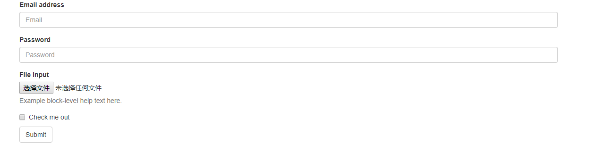

```html
<!DOCTYPE html>
<html lang="en">

<head>
    <meta charset="UTF-8">
    <meta name="viewport" content="width=device-width, initial-scale=1.0">
    <meta http-equiv="X-UA-Compatible" content="ie=edge">
    <title>Document</title>
    <!-- 要使用bootstrap，需要导入三个文件 -->
    <script src="js/jquery-1.12.4.min.js"></script>
    <script src="js/bootstrap.min.js"></script>
    <link rel="stylesheet" href="css/bootstrap.min.css">
</head>

<body>
    <form>
        <div class="container">
            <div class="form-group">
                <label for="exampleInputEmail1">Email address</label>
                <input type="email" class="form-control" id="exampleInputEmail1" placeholder="Email">
            </div>
            <div class="form-group">
                <label for="exampleInputPassword1">Password</label>
                <input type="password" class="form-control" id="exampleInputPassword1" placeholder="Password">
            </div>
            <div class="form-group">
                <label for="exampleInputFile">File input</label>
                <input type="file" id="exampleInputFile">
                <p class="help-block">Example block-level help text here.</p>
            </div>
            <div class="checkbox">
                <label>
                    <input type="checkbox"> Check me out
                </label>
            </div>
            <button type="submit" class="btn btn-default">Submit</button>
    </form>
    </div>
</body>

</html>
```


## ==1.4-bootstrap组件==

### 1.字体图标

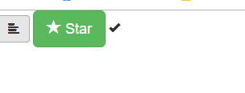


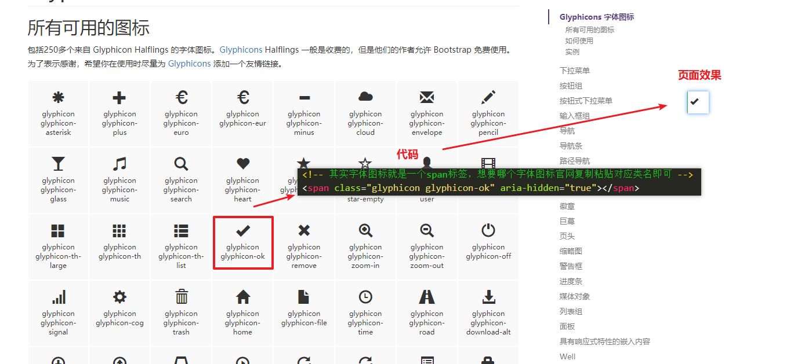

```html
<!DOCTYPE html>
<html lang="zh-CN">

<head>
    <meta charset="UTF-8">
    <meta name="viewport" content="width=device-width, initial-scale=1.0, user-scalable=0">
    <meta http-equiv="X-UA-Compatible" content="ie=edge">
    <title>Bootstrap Template</title>
    <!-- 使用bootstrap需要导入三个文件 -->
    <script src="js/jquery-1.12.4.min.js"></script>
    <script src="js/bootstrap.min.js"></script>
    <link href="css/bootstrap.min.css" rel="stylesheet">
</head>

<body>
    <!-- 官网代码  -->
    <button type="button" class="btn btn-default" aria-label="Left Align">
        <span class="glyphicon glyphicon-align-left" aria-hidden="true"></span>
    </button>

    <button type="button" class="btn btn-success btn-lg">
        <span class="glyphicon glyphicon-star" aria-hidden="true"></span> Star
    </button>

    <!-- 其实字体图标就是一个span标签，想要哪个字体图标官网复制粘贴对应类名即可 -->
    <span class="glyphicon glyphicon-ok" aria-hidden="true"></span>
</body>

</html>
```


### 2-按钮组件


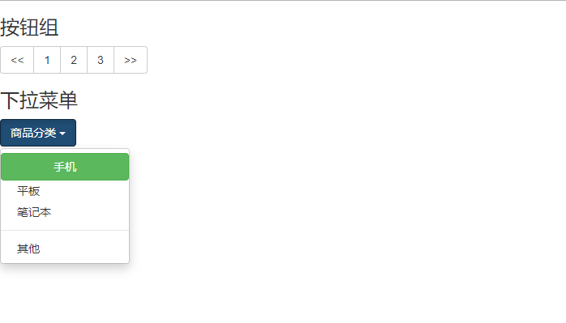

```html
<!DOCTYPE html>
<html lang="en">

<head>
    <meta charset="UTF-8">
    <meta name="viewport" content="width=device-width, initial-scale=1.0">
    <meta http-equiv="X-UA-Compatible" content="ie=edge">
    <title>Document</title>
    <!-- 要使用bootstrap，需要导入三个文件 -->
    <script src="js/jquery-1.12.4.min.js"></script>
    <script src="js/bootstrap.min.js"></script>
    <link rel="stylesheet" href="css/bootstrap.min.css">

</head>

<body>
    <!-- 按钮组 -->
    <h3>按钮组</h3>
    <div class="btn-group" role="group" aria-label="...">
        <button type="button" class="btn btn-default">&lt;&lt;</button>
        <button type="button" class="btn btn-default">1</button>
        <button type="button" class="btn btn-default">2</button>
        <button type="button" class="btn btn-default">3</button>
        <button type="button" class="btn btn-default">&gt;&gt;</button>
    </div>
    <!-- 下拉菜单 -->
    <h3>下拉菜单</h3>
    <div class="btn-group">
        <button type="button" class="btn btn-primary dropdown-toggle" data-toggle="dropdown" aria-haspopup="true"
            aria-expanded="false">
            商品分类 <span class="caret"></span>
        </button>
        <ul class="dropdown-menu">
            <a href="#"><button type="button" class="btn btn-success btn-block">手机</button></a>
            <li><a href="#">平板</a></li>
            <li><a href="#">笔记本</a></li>
            <li role="separator" class="divider"></li>
            <li><a href="#">其他</a></li>
        </ul>
    </div>

</body>

</html>
```


### 3-进度条

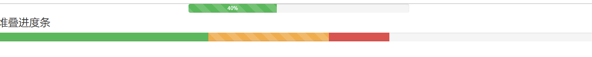

```html
<!DOCTYPE html>
<html lang="zh-CN">

<head>
    <meta charset="UTF-8">
    <meta name="viewport" content="width=device-width, initial-scale=1.0, user-scalable=0">
    <meta http-equiv="X-UA-Compatible" content="ie=edge">
    <title>Bootstrap Template</title>
    <!-- 使用bootstrap需要导入三个文件 -->
    <script src="js/jquery-1.12.4.min.js"></script>
    <script src="js/bootstrap.min.js"></script>
    <link href="css/bootstrap.min.css" rel="stylesheet">

    <style>
        .box{
            width: 500px;
            height: 10px;
            margin: 0 auto;
        }
    </style>
</head>

<body>
    <!-- bootstrap所有的样式都是通过类名来实现 -->
    <div class="box">
        <div class="progress">
            <div class="progress-bar progress-bar-success progress-bar-striped progress-bar-striped active"
                role="progressbar" aria-valuenow="40" aria-valuemin="0" aria-valuemax="100" style="width: 40%;">
                40%
            </div>
        </div>
    </div>


    <h3>堆叠进度条</h3>
    <div class="progress">
        <div class="progress-bar progress-bar-success" style="width: 35%">
            <span class="sr-only">35% Complete (success)</span>
        </div>
        <div class="progress-bar progress-bar-warning progress-bar-striped" style="width: 20%">
            <span class="sr-only">20% Complete (warning)</span>
        </div>
        <div class="progress-bar progress-bar-danger" style="width: 10%">
            <span class="sr-only">10% Complete (danger)</span>
        </div>
    </div>
</body>

</html>
```


## ==1.5-bootstrap栅格系统(响应式布局)==


### 1-版心容器container


* bootstrap中有两种版心容器可供使用者选择
  * container：`响应式版心容器`
    * 默认样式：
      * 没有高度、边框、颜色
      * 左右15px的padding
    * 宽度是响应式
      * 屏幕宽度 < 768            宽度100%
      * 768 <= 屏幕宽度 < 992      宽度750
      * 992 <= 屏幕宽度 < 1200      宽度970
      * 1200 <= 屏幕宽度 < 1200      宽度1170
  * container-fluid：`流式版心容器`
    * 默认样式：
      * 没有高度、边框、颜色
      * 左右15px的padding
      * 宽度100%

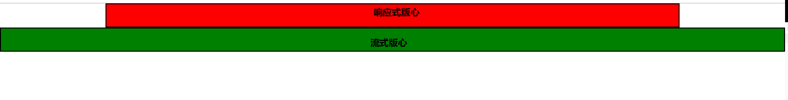

```html
<!DOCTYPE html>
<html lang="zh-CN">
<head>
    <meta charset="UTF-8">
    <meta name="viewport" content="width=device-width, initial-scale=1.0, user-scalable=0">
    <meta http-equiv="X-UA-Compatible" content="ie=edge">
    <title>Bootstrap Template</title>
    <!-- 使用bootstrap需要导入三个文件 -->
    <script src="js/jquery-1.12.4.min.js"></script>
    <script src="js/bootstrap.min.js"></script>
    <link href="css/bootstrap.min.css" rel="stylesheet">

    <style>
        /* 1.container：响应式版心容器
            默认样式：没有高度、边框、颜色，左右15px的padding
            宽度是响应式
                屏幕宽度 < 768            宽度100%
                768 <= 屏幕宽度 < 992      宽度750
                992 <= 屏幕宽度 < 1200      宽度970
                1200 <= 屏幕宽度 < 1200      宽度1170
        */
        .container{
            height: 50px;
            background-color: red;
            border: 2px solid #000;
        }
        
        /* 可以使用媒体查询覆盖默认版心宽度 */
        @media(min-width:992px) and (max-width:1200px){
            .container{
                width: 1000px;
            }
        }

        /* 也可以根据实际需求自定义一个媒体查询范围 */
        @media(min-width:480px) and (max-width:768px){
            .container{
                width: 500px;
            }
        }

        /* 2.container-fluid：流式版心容器
            默认样式：没有高度、边框、颜色，左右15px的padding
            宽度100%
        */
        .container-fluid{
            height: 50px;
            background-color: green;
            border: 2px solid #000;
        }
    </style>
</head>
<body>
    <!-- 1.响应式版心容器 -->
    <div class="container"></div>
    <!-- 1.流式版心容器 -->
    <div class="container-fluid"></div>

</body>
</html>
```


### 2-栅格系统介绍

* 1.什么叫什么系统：以table表格的形式划分页面空间，从而实现布局。
* 2.栅格的组成部分：
  * a.`版心容器container`（相当于html页面的container版心，相当于table表格）
    * b.`row`(相当于html页面的父盒子模型,相当于table中的tr)
      * c.`col`(相当于html页面的子盒子模型，相当于table中的tr)

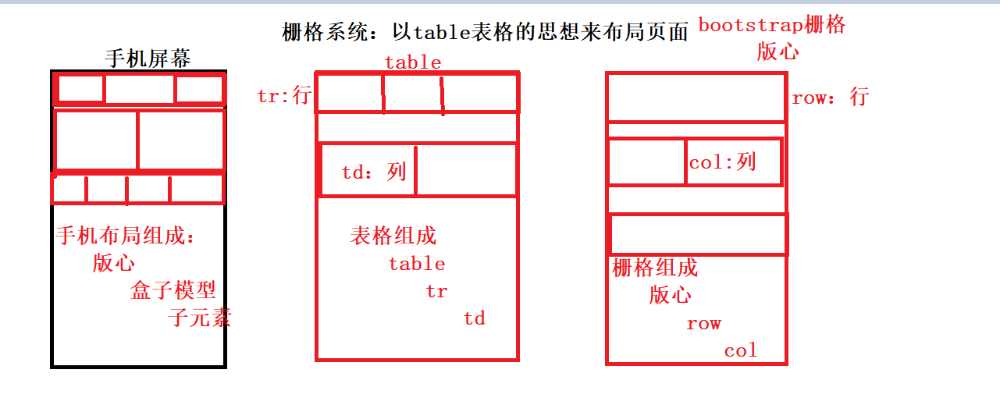

* 3.栅格样式的核心原理
  * a.版心容器（container是响应式版心，container-fluid是流式版心）
    * 他们两者唯一的区别是
      * container尺寸是固定的（1170,970,750,100%）
      * container-fluid的尺寸是铺满全屏: 100%
  * b.row:行
    * 默认没有高度，背景色、边框
    * 默认宽度为100%
      * `继承版心的宽度`
    * 默认左右margin为 -15px  （作用是抵消container左右的padding）
  * c.列col： 类名遵循固定的格式 `col-s-x`
    * s(screen):表示屏幕尺寸，他们有四个可选值
      * `lg`:大栅格，这种栅格在屏幕宽度大于等于`1200`时可以排成一行，小于1200时每个栅格独占一行
      * `md`:中栅格,这种栅格在屏幕宽度大于等于`992`时可以排成一行，小于992时每个栅格独占一行
      * `sm`:小栅格,这种栅格在屏幕宽度大于等于`768`时可以排成一行，小于768时每个栅格独占一行
      * `xs`:超小栅格,这种栅格所有屏幕宽度下都会排成一行
    * x(1-12之间的数字，尺寸比例)：bootstrap将水平方向分为12份，每一份表示row宽度的 1/12
      * ==col列需要写在行row标签中，每一行的栅格整体宽度占据12份，大于12份就会换行==
  * 示例：（详细效果请参考下图与真实代码演示）
    * `col-设备类型-数字（宽度比例 1 = 屏幕 1/12）`
    * `col-lg-6`:表示该栅格在屏幕宽度大于等于`1200`时，占的宽度比例是6份( 6/12 = 0.5 相当于width:50%)。一旦屏幕宽度小于1200，单独一行(x的尺寸直接失效)
    * `col-lg-3`:表示该栅格在屏幕宽度大于等于`1200`时，占的宽度比例是3份( 3/12 = 0.25 相当于width:25%)。一旦屏幕宽度小于1200，单独一行(x的尺寸直接失效)
    * `col-md-4`:表示该栅格在屏幕宽度大于等于`992`时，占的宽度比例是4份( 4/12 = 0.33 相当于width:33.3%  三分之一)。一旦屏幕宽度小于992，单独一行(x的尺寸直接失效)
    * `col-sm-2`:表示该栅格在屏幕宽度大于等于`768`时，占的宽度比例是2份( 2/12 = 0.167 相当于width:16.7%，六分之一)。一旦屏幕宽度小于768，单独一行(x的尺寸直接失效)
    * `col-xs-8`:表示该栅格在任何屏幕下，占的宽度比例是8份( 8/12 = 0.667 相当于width:66.7%，三分之二)。
    * `col-lg-3 col-md-4`:(1)表示该栅格在屏幕宽度 >= 1200时，占3份(宽度四分之一)，(2)在992<=屏幕宽度<1200时，占4份(宽度三分之一),(3) <=992 直接显示一行
    * `col-lg-3 col-md-4 col-sm-6`:(1)表示该栅格在屏幕宽度 >= 1200时，(2)占3份(宽度四分之一)，(3)在992<=屏幕宽度<1200时，占4份(宽度三分之一), <=992,(4)在 768<= 屏幕宽度 < 992时，占6份(二分之一),(5) <768,直接显示一行

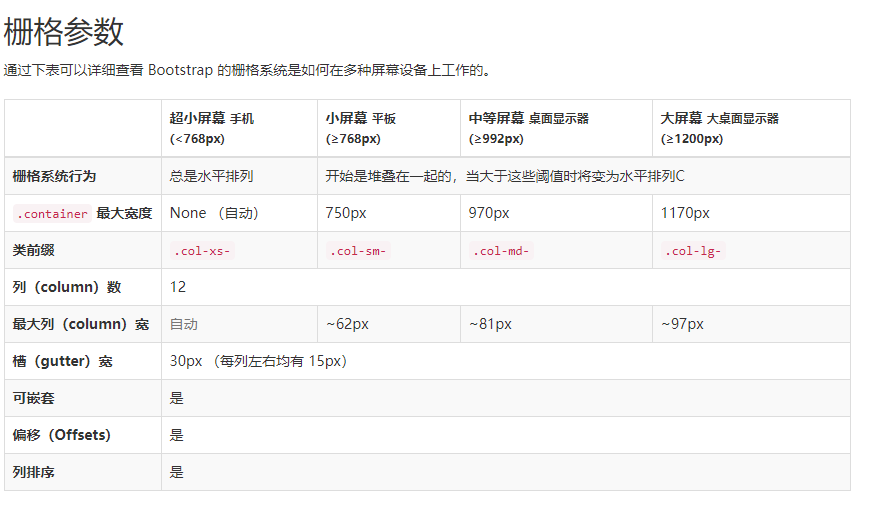

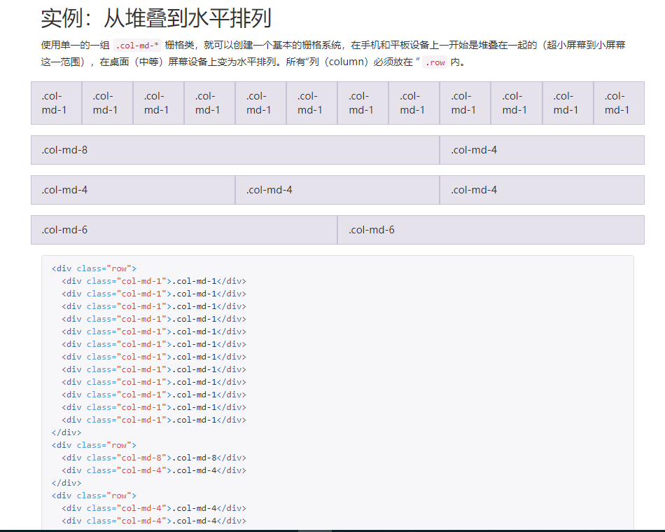

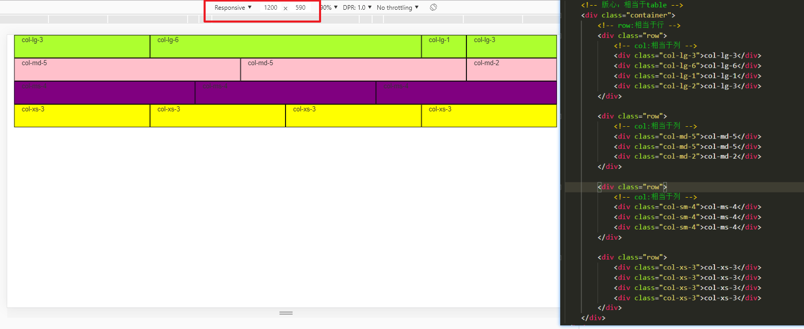


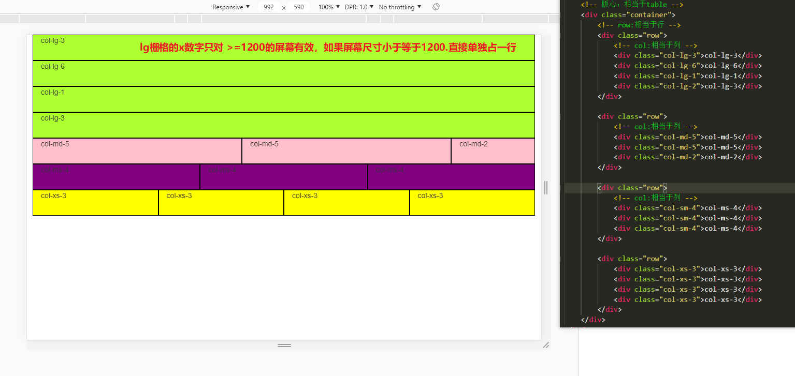

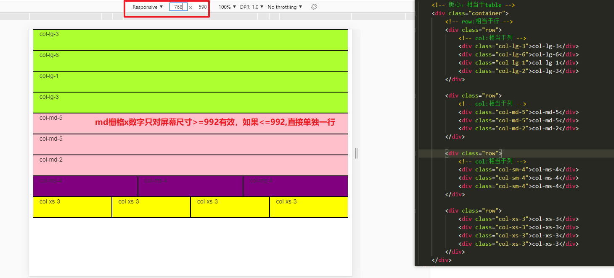


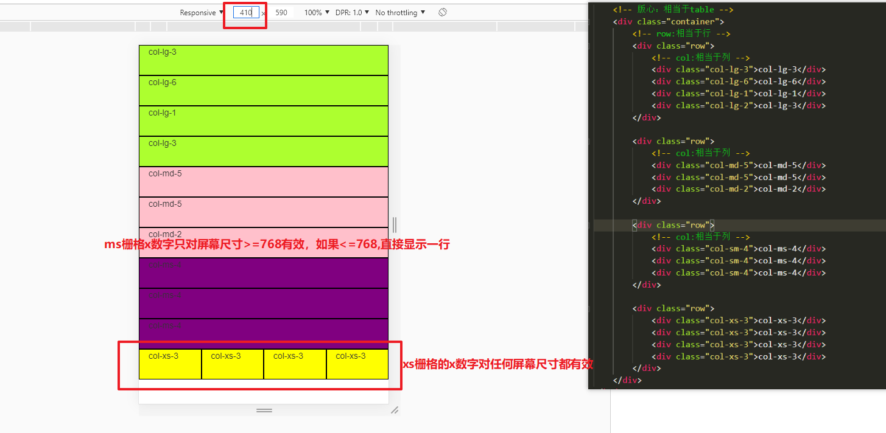

```html
<!DOCTYPE html>
<html lang="zh-CN">

<head>
    <meta charset="UTF-8">
    <meta name="viewport" content="width=device-width, initial-scale=1.0, user-scalable=0">
    <meta http-equiv="X-UA-Compatible" content="ie=edge">
    <title>Bootstrap Template</title>
    <!-- 使用bootstrap需要导入三个文件 -->
    <script src="js/jquery-1.12.4.min.js"></script>
    <script src="js/bootstrap.min.js"></script>
    <link href="css/bootstrap.min.css" rel="stylesheet">

    <style>
        /* 栅格系统中的行：row
                默认没有高度，背景色、边框
                默认宽度为100%
                默认左右padding为 -15px  （作用是抵消container左右的padding）
        */
        .row {
            /* height: 50px; */
            background: skyblue;
        }

        /* 选中所有类名包含 "col-"的div标签 */
        div[class*="col-"] {
            height: 50px;
            border: 1px solid #000;
            background-color: greenyellow;
        }

        div[class*="col-md"] {
            height: 50px;
            border: 1px solid #000;
            background-color: pink;
        }

        div[class*="col-sm"] {
            height: 50px;
            border: 1px solid #000;
            background-color: purple;
        }

        div[class*="col-xs"] {
            height: 50px;
            border: 1px solid #000;
            background-color: yellow;
        }
    </style>
</head>

<body>
    <!-- 版心：相当于table -->
    <div class="container">
        <!-- row:相当于行 -->
        <div class="row">
            <!-- col:相当于列 -->
            <div class="col-lg-3">col-lg-3</div>
            <div class="col-lg-6">col-lg-6</div>
            <div class="col-lg-1">col-lg-1</div>
            <div class="col-lg-2">col-lg-3</div>
        </div>

        <div class="row">
            <!-- col:相当于列 -->
            <div class="col-md-5">col-md-5</div>
            <div class="col-md-5">col-md-5</div>
            <div class="col-md-2">col-md-2</div>
        </div>

        <div class="row">
            <!-- col:相当于列 -->
            <div class="col-sm-4">col-sm-4</div>
            <div class="col-sm-4">col-sm-4</div>
            <div class="col-sm-4">col-sm-4</div>
        </div>
        
        <div class="row">
            <div class="col-xs-3">col-xs-3</div>
            <div class="col-xs-3">col-xs-3</div>
            <div class="col-xs-3">col-xs-3</div>
            <div class="col-xs-3">col-xs-3</div>
        </div>
    </div>
</body>
</html>
```


### 3-栅格系统练习

需求：

​        1.pc端，屏幕尺寸>=1200,一行显示四个盒子

​        2.大屏平板： 屏幕尺寸 992-1200，一行显示三个盒子

​        3.平板： 屏幕尺寸768-992，一行显示两个盒子

​        4.手机： 屏幕尺寸<768,一行显示一个盒子


```html
<!DOCTYPE html>
<html lang="zh-CN">
<head>
    <meta charset="UTF-8">
    <meta name="viewport" content="width=device-width, initial-scale=1.0, user-scalable=0">
    <meta http-equiv="X-UA-Compatible" content="ie=edge">
    <title>Bootstrap Template</title>
    <!-- 使用bootstrap需要导入三个文件 -->
    <script src="js/jquery-1.12.4.min.js"></script>
    <script src="js/bootstrap.min.js"></script>
    <link href="css/bootstrap.min.css" rel="stylesheet">

    <style>
        div[class*="col-"]{
            height: 100px;
            border: 1px solid #000;
            background-color: skyblue;
        }

    </style>
</head>
<body>
    <!-- 需求：
        1.pc端，屏幕尺寸>=1200,一行显示四个盒子
        2.大屏平板： 屏幕尺寸 992-1200，一行显示三个盒子
        3.平板： 屏幕尺寸768-992，一行显示两个盒子
        4.手机： 屏幕尺寸<768,一行显示一个盒子
    -->
    <div class="container">
        <div class="row">
            <div class="col-lg-3 col-md-4 col-sm-6">内容1</div>
            <div class="col-lg-3 col-md-4 col-sm-6">内容2</div>
            <div class="col-lg-3 col-md-4 col-sm-6">内容3</div>
            <div class="col-lg-3 col-md-4 col-sm-6">内容4</div>
        </div>
    </div>

</body>
</html>
```

### 4-栅格偏移


* 栅格默认是左浮动的，所有栅格默认是靠左对齐的，但是栅格在排列时也可以往右偏移一段距离，通过偏移的样式类就可以了，偏移的样式类和栅格一样，也分为四种

  1、`.col-lg-offset-x` x代表1~12的数字，它表示栅格偏移的宽度份数，在屏幕宽度大于等于1200起作用
  2、`.col-md-offset-x` 在屏幕宽度大于等于992起作用
  3、`.col-sm-offset-x` 在屏幕宽度大于等于768起作用
  4、`.col-xs-offset-x` 在屏幕宽度小于768起作用

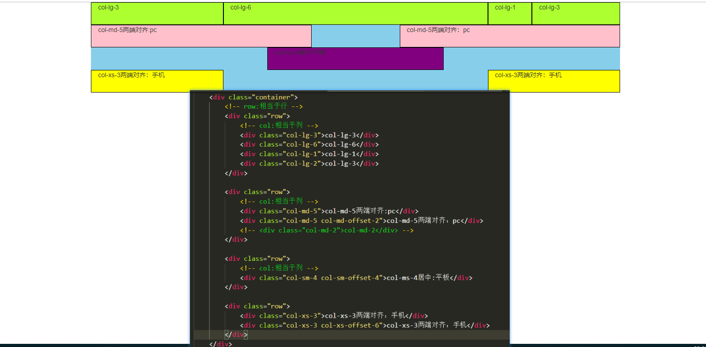

```html
<!DOCTYPE html>
<html lang="zh-CN">

<head>
    <meta charset="UTF-8">
    <meta name="viewport" content="width=device-width, initial-scale=1.0, user-scalable=0">
    <meta http-equiv="X-UA-Compatible" content="ie=edge">
    <title>Bootstrap Template</title>
    <!-- 使用bootstrap需要导入三个文件 -->
    <script src="js/jquery-1.12.4.min.js"></script>
    <script src="js/bootstrap.min.js"></script>
    <link href="css/bootstrap.min.css" rel="stylesheet">

    <style>
        /* 栅格系统中的行：row
                默认没有高度，背景色、边框
                默认宽度为100%
                默认左右padding为 -15px  （作用是抵消container左右的padding）
        */
        .row {
            /* height: 50px; */
            background: skyblue;
        }

        /* 选中所有类名包含 "col-"的div标签 */
        div[class*="col-"] {
            height: 50px;
            border: 1px solid #000;
            background-color: greenyellow;
        }

        div[class*="col-md"] {
            height: 50px;
            border: 1px solid #000;
            background-color: pink;
        }

        div[class*="col-sm"] {
            height: 50px;
            border: 1px solid #000;
            background-color: purple;
        }

        div[class*="col-xs"] {
            height: 50px;
            border: 1px solid #000;
            background-color: yellow;
        }
    </style>
</head>

<body>
    <!-- 版心：相当于table -->
    <div class="container">
        <!-- row:相当于行 -->
        <div class="row">
            <!-- col:相当于列 -->
            <div class="col-lg-3">col-lg-3</div>
            <div class="col-lg-6">col-lg-6</div>
            <div class="col-lg-1">col-lg-1</div>
            <div class="col-lg-2">col-lg-3</div>
        </div>

        <div class="row">
            <!-- col:相当于列 -->
            <div class="col-md-5">col-md-5两端对齐:pc</div>
            <div class="col-md-5 col-md-offset-2">col-md-5两端对齐：pc</div>
            <!-- <div class="col-md-2">col-md-2</div> -->
        </div>

        <div class="row">
            <!-- col:相当于列 -->
            <div class="col-sm-4 col-sm-offset-4">col-ms-4居中:平板</div>
        </div>

        <div class="row">
            <div class="col-xs-3">col-xs-3两端对齐：手机</div>
            <div class="col-xs-3 col-xs-offset-6">col-xs-3两端对齐：手机</div>
        </div>

    </div>

</body>

</html>
```


### 5-栅格隐藏


在某个查询区间，将栅格隐藏，可以用隐藏的样式，这个样式包括四个：
	1、.hidden-xs 在屏幕小于768时将栅格隐藏
	2、.hidden-sm 在屏幕大于等于768小于992时将栅格隐藏
	3、.hidden-md 在屏幕大于等于992小于1200时将栅格隐藏
	4、.hidden-lg 在屏幕大于等于1200时将栅格隐藏


`注意点`

​	a：如果设置一个栅格隐藏样式为`hidden-md`:表示该栅格只会在 768 <=  屏幕尺寸 <992区间隐藏，如果屏幕尺寸 <= 768，则又会显示

​	b.如果希望一个栅格在屏幕尺寸 <= 992时隐藏，可以设置栅格隐藏样式为:`hidden-sm hidden-xs`


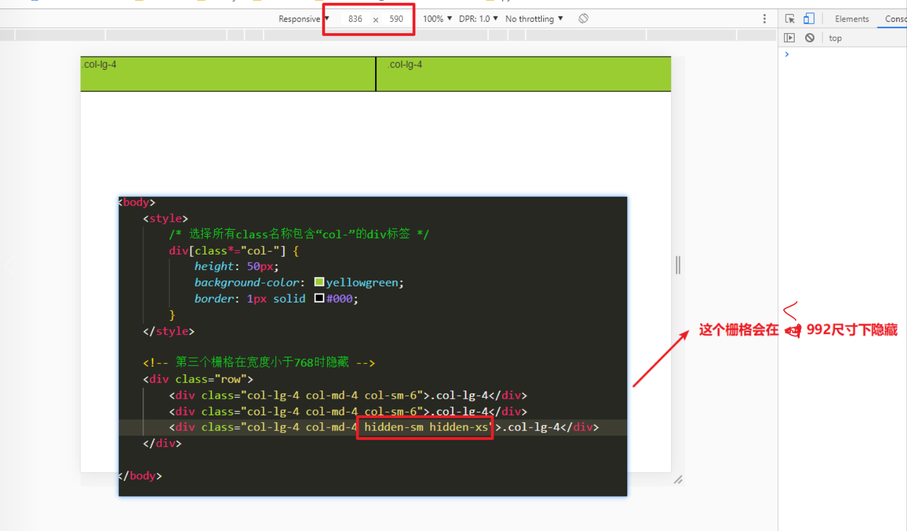


```html
<!DOCTYPE html>
<html lang="zh-CN">

<head>
    <meta charset="UTF-8">
    <meta name="viewport" content="width=device-width, initial-scale=1.0, user-scalable=0">
    <meta http-equiv="X-UA-Compatible" content="ie=edge">
    <title>Bootstrap Template</title>
    <!-- 使用bootstrap需要导入三个文件 -->
    <script src="js/jquery-1.12.4.min.js"></script>
    <script src="js/bootstrap.min.js"></script>
    <link href="css/bootstrap.min.css" rel="stylesheet">
</head>

<body>
    <style>
        /* 选择所有class名称包含“col-”的div标签 */
        div[class*="col-"] {
            height: 50px;
            background-color: yellowgreen;
            border: 1px solid #000;
        }
    </style>
    
    <!-- 第三个栅格在宽度小于768时隐藏 -->
    <div class="row">
        <div class="col-lg-4 col-md-4 col-sm-6">.col-lg-4</div>
        <div class="col-lg-4 col-md-4 col-sm-6">.col-lg-4</div>
        <div class="col-lg-4 col-md-4 hidden-sm hidden-xs">.col-lg-4</div>
    </div>

</body>

</html>
```


# 02-bootstrap实战案例：bootstrap官网制作


* `框架只能让你的开发变得简洁，但绝对不是完全替代`
  * 例如我们第五天学习的bootstrap官网制作，如果我们想用boostrap来重构。并不是说所有的代码都要使用bootstrap的栅格系统，而是需要使用bootstrap栅格布局的地方才使用。


==1. 将第五天的bootstrap项目代码中项目列表由`flex布局`改为`栅格布局`==

* 2.去掉第五天的container类样式（因为bootstrap中的container版心默认响应式已经给我们写好了）
  * 实际开发以产品经理为准，如果需求和bootstrap默认样式不一致，也可以自己修改

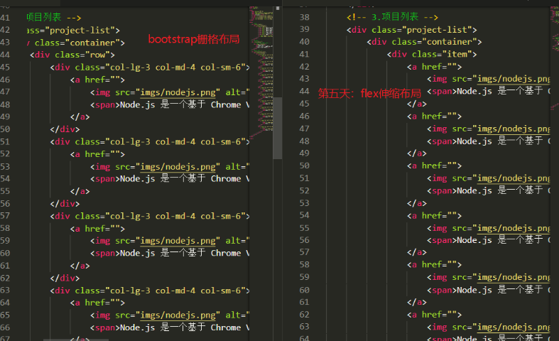

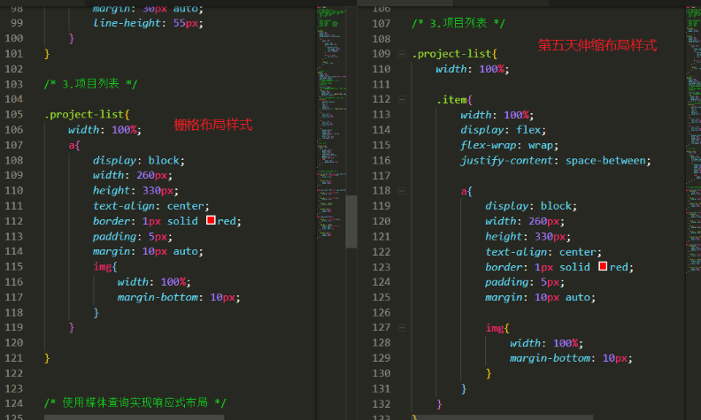