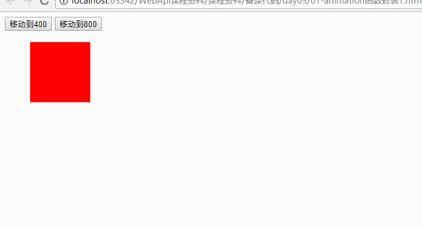
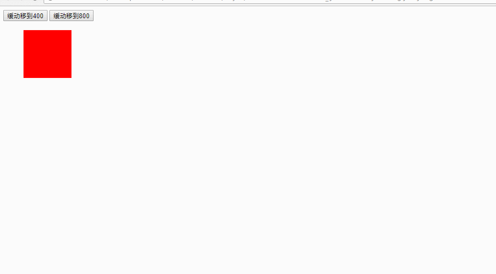
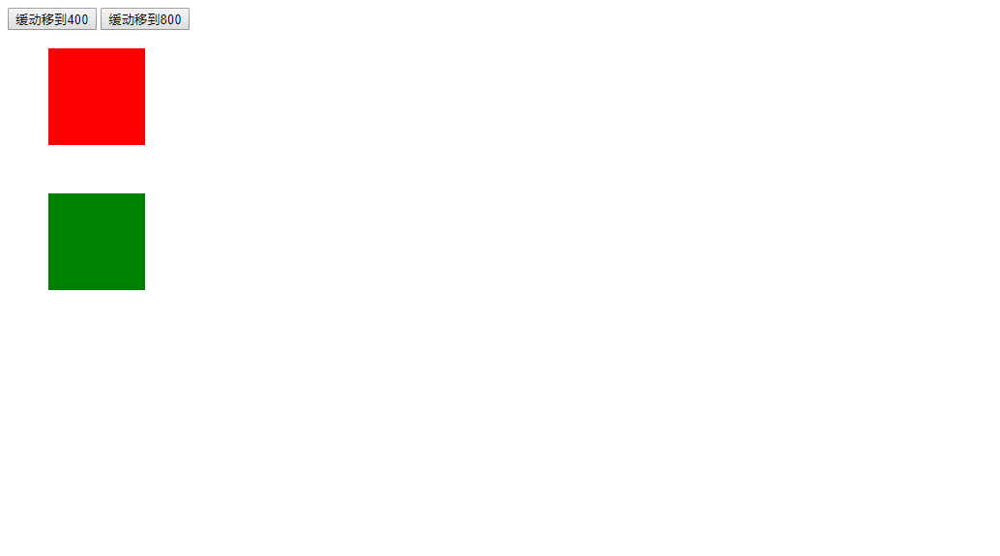

# 今日学习任务

* [ ] ==1.案例：轮播图==

  a.获取元素

  b.注册事件

  c.处理事件

  ​	(1)鼠标移入移出事件

  ​	(2)上一页下一页点击事件

  ​        (3)无限轮播

  ​        (4)页码点击事件

    d.自动轮播

* [ ] ==2.缓动动画==

  * [ ] 代码冗余-函数
  * [ ] (1).移动距离不限-函数参数
  * [ ] (2).移动元素不限
  * [ ] (3).移动方向不限

# 01-轮播图


[效果预览](file:///C:/Users/%E5%BC%A0%E6%99%93%E5%9D%A4/Desktop/%E5%BC%A0%E6%99%93%E5%9D%A4%E5%89%8D%E7%AB%AF%E5%A4%87%E8%AF%BE%E8%B5%84%E6%96%99/%E5%85%A8%E5%A4%A9%E6%A8%A1%E5%BC%8F/02-WebApi/%E8%AF%BE%E7%A8%8B%E8%B5%84%E6%96%99/%E5%A4%87%E8%AF%BE%E4%BB%A3%E7%A0%81/day05/11-%E8%BD%AE%E6%92%AD%E5%9B%BE%E5%AE%8C%E6%88%90%E7%82%B9%E5%87%BB%E9%A1%B5%E7%A0%81%E8%B7%B3%E8%BD%AC/08-%E8%BD%AE%E6%92%AD%E5%9B%BE%E5%AE%8C%E6%88%90%E7%82%B9%E5%87%BB%E9%A1%B5%E7%A0%81%E8%B7%B3%E8%BD%AC.html)


## 1.1-完整思路介绍


* 第一步：完成轮播图事件的添加 ：用一个全局遍历index记录当前需要展示的图片的索引
  * （1）鼠标移入移出事件：当鼠标移入轮播图时显示左右两边上一页下一页按钮，移出时隐藏
  * （2）上一页下一页按钮点击事件
    * 点击下一页:index++
    * 点击上一页:index--
  * （3）页码点击事件
* 第二步：完成上一页和下一页
  * （1）点击移动之前给ul添加边界检测：否则点击下一页会无限往右滚动
  * （2）修改当前索引（自增/自减），索引表示的是当前ul应该展示第几张图片
  * （3）移动ul（目标距离 = -index * screen的宽度）
  * （4）页码保持同步（当前显示的是第几张图片，下方页码对应索引高亮）
* 第三步：完成无限轮播 核心思想：n+1
  * （1）常规思路：图片滚动时，当滚动到最后一张时，我们偷偷的快速改变ul的位置到第一张（不要动画，瞬间改变）
    * ul.style.left = '0px';//ul回到初始位置
    * index = 0;//index恢复到0
  * （2）问题发现：这种方式可以实现无限轮播，但是在下一轮无限的时候第一张会被跳过去
    * 原因：我们手动改变了index为0，而动画又需要index+1，所以会错过index为0的那一张
  * （3）解决方案：我们在最后一张图片的后面加上第一张图片（第6张）可以让用户看到滚动效果，然后滚动到第六张时，再改变ul回到初始位置。
    * 好处：（1）用户可以看到滚动效果，不影响体验 （2）刚好第6张与第一张是同一张图片，快速改变位置不会造成动画的闪现
  * (4)当图片index为最后一张的的时候，页码应该显示第一个
    * 因为最后一张图片第一张是同一张图片
* 第四步：完成点击页码跳转
  * 思路：
    * (1)点击的是第几个页码，移动动画的目标距离 = -index * screen.offsetWidth
    * (2)排他思想改变页码样式
    * (3)页码的下标需要与图片下标index保持一致，否则会产生冲突
      * 点击页码的时候，要让图片下标index与页码下标一致
* 第五步：自动无限轮播
  * 功能原理介绍：相当于每隔一段时间自动点击下一页按钮，代码逻辑完全不变
  * 思路分析：
    * （1）将轮播代码封装成一个函数
    * （2）开启定时器，每隔一段时间执行这个函数
    * （3）鼠标移入时清除定时器，移出时开启定时器


## 1.2-第一步：获取页面元素、注册事件

第一步：完成轮播图事件的添加 ：用一个全局变量index记录当前需要展示的图片的索引

* （1）鼠标移入移出事件：当鼠标移入轮播图时显示左右两边上一页下一页按钮，移出时隐藏
* （2）上一页下一页按钮点击事件
  * 点击下一页:index++
  * 点击上一页:index--
* （3）页码点击事件

```html
<!DOCTYPE html>
<html lang="en">
<head>
    <meta charset="UTF-8">
    <title></title>
    <style type="text/css">
        * {
            padding: 0;
            margin: 0;
            list-style: none;
            border: 0;
        }

        .all {
            width: 500px;
            height: 200px;
            padding: 7px;
            border: 1px solid #ccc;
            margin: 100px auto;
            position: relative;
        }

        .screen {
            width: 500px;
            height: 200px;
            /*overflow: hidden;*/
            position: relative;
        }

        .screen li {
            width: 500px;
            height: 200px;
            overflow: hidden;
            float: left;
        }

        .screen ul {
            position: absolute;
            left: 0;
            top: 0px;
            width: 3000px;
        }

        .all ol {
            position: absolute;
            right: 10px;
            bottom: 10px;
            line-height: 20px;
            text-align: center;
        }

        .all ol li {
            float: left;
            width: 20px;
            height: 20px;
            background: #fff;
            border: 1px solid #ccc;
            margin-left: 10px;
            cursor: pointer;
        }

        .all ol li.current {
            background: yellow;
        }

        #arr {
            display: none;
        }

        #arr span {
            width: 40px;
            height: 40px;
            position: absolute;
            left: 5px;
            top: 50%;
            margin-top: -20px;
            background: #000;
            cursor: pointer;
            line-height: 40px;
            text-align: center;
            font-weight: bold;
            font-family: '黑体';
            font-size: 30px;
            color: #fff;
            opacity: 0.3;
            border: 1px solid #fff;
        }

        #arr #right {
            right: 5px;
            left: auto;
        }
    </style>
</head>
<body>
<div class="all" id='box'>
    <div class="screen">
        <ul>
            <li></li>
            <li></li>
            <li></li>
            <li></li>
            <li></li>
        </ul>
        <ol>
            <li class="current">1</li>
            <li>2</li>
            <li>3</li>
            <li>4</li>
            <li>5</li>
        </ol>

    </div>
    <div id="arr"><span id="left">&lt;</span><span id="right">&gt;</span></div>
</div>

<script src="animation.js"></script>

<script>
    /*
    第二步：完成上一页下一页
     */

    //1.获取页面元素
    var box = document.getElementById ( "box" )//最外面大盒子 （有边框）
    var screen = document.getElementsByClassName ( "screen" )[ 0 ]//轮播图可视区域盒子
    var ul = screen.children[0];//轮播图列表ul
    var ol = screen.children[1];//页码ol
    console.log ( screen.children );
    var arr = document.getElementById('arr');//上一页下一页盒子
    var left = document.getElementById('left');//上一页
    var right = document.getElementById('right');//下一页

    //2.注册事件

    //2.1 鼠标移入box
    box.onmouseover = function (  ) {
        //3.事件处理 : 显示上一页下一页
        arr.style.display = 'block';
    };

    //2.2 鼠标移出box
    box.onmouseout = function (  ) {
        //3.事件处理：隐藏上一页下一页
        arr.style.display = 'none';
    };

    var index = 0;//声明变量记录当前显示图片的下标

    //2.3 下一页
    right.onclick = function (  ) {
        //3.事件处理 ：
        index++;//下一页


        console.log ( index );
    };


    //2.4 上一页
    left.onclick = function (  ) {
        //3.事件处理 :
        index--;//上一页
        console.log ( index );
    };

    //2.5 页码点击事件
    for(var i = 0;i<ol.children.length;i++){
        ol.children[i].onclick = function (  ) {
            //3.事件处理
            alert(1111);
        }
    }
</script>

</body>
</html>
```

## 1.3-第二步：完成上一页下一页点击事件


```html
<!DOCTYPE html>
<html lang="en">
<head>
    <meta charset="UTF-8">
    <title></title>
    <style type="text/css">
        * {
            padding: 0;
            margin: 0;
            list-style: none;
            border: 0;
        }

        .all {
            width: 500px;
            height: 200px;
            padding: 7px;
            border: 1px solid #ccc;
            margin: 100px auto;
            position: relative;
        }

        .screen {
            width: 500px;
            height: 200px;
            /*overflow: hidden;*/
            position: relative;
        }

        .screen li {
            width: 500px;
            height: 200px;
            overflow: hidden;
            float: left;
        }

        .screen ul {
            position: absolute;
            left: 0;
            top: 0px;
            width: 3000px;
        }

        .all ol {
            position: absolute;
            right: 10px;
            bottom: 10px;
            line-height: 20px;
            text-align: center;
        }

        .all ol li {
            float: left;
            width: 20px;
            height: 20px;
            background: #fff;
            border: 1px solid #ccc;
            margin-left: 10px;
            cursor: pointer;
        }

        .all ol li.current {
            background: yellow;
        }

        #arr {
            display: none;
        }

        #arr span {
            width: 40px;
            height: 40px;
            position: absolute;
            left: 5px;
            top: 50%;
            margin-top: -20px;
            background: #000;
            cursor: pointer;
            line-height: 40px;
            text-align: center;
            font-weight: bold;
            font-family: '黑体';
            font-size: 30px;
            color: #fff;
            opacity: 0.3;
            border: 1px solid #fff;
        }

        #arr #right {
            right: 5px;
            left: auto;
        }
    </style>
</head>
<body>
<div class="all" id='box'>
    <div class="screen">
        <ul>
            <li></li>
            <li></li>
            <li></li>
            <li></li>
            <li></li>
        </ul>
        <ol>
            <li class="current">1</li>
            <li>2</li>
            <li>3</li>
            <li>4</li>
            <li>5</li>
        </ol>

    </div>
    <div id="arr"><span id="left">&lt;</span><span id="right">&gt;</span></div>
</div>


</body>

<script src="animation.js"></script>

<script>
    /*
    第一步：获取页面元素，注册事件
     */

    //1.获取页面元素
    var box = document.getElementById ( "box" )//最外面大盒子 （有边框）
    var screen = document.getElementsByClassName ( "screen" )[ 0 ]//轮播图可视区域盒子
    var ul = screen.children[0];//轮播图列表ul
    var ol = screen.children[1];//页码ol
    console.log ( screen.children );
    var arr = document.getElementById('arr');//上一页下一页盒子
    var left = document.getElementById('left');//上一页
    var right = document.getElementById('right');//下一页

    //2.注册事件

    //2.1 鼠标移入box
    box.onmouseover = function (  ) {
        //3.事件处理 : 显示上一页下一页
        arr.style.display = 'block';
    };

    //2.2 鼠标移出box
    box.onmouseout = function (  ) {
        //3.事件处理：隐藏上一页下一页
        arr.style.display = 'none';
    };

    var index = 0;//声明变量记录当前显示图片的下标

    //2.3 下一页
    right.onclick = function (  ) {
        //3.事件处理 ：

        //3.1 如果是最后一页，则不滚动
        if (index == ul.children.length -1){
            return;
        };
        //3.2 下一页
        index++;//下一页
        //3.3 开始滚动
        animationMove(ul, - index*screen.offsetWidth);


        console.log ( index );
    };


    //2.4 上一页
    left.onclick = function (  ) {
        //3.事件处理 :

        //3.1 如果是第一页，则不滚动
        if (index == 0){
            return;
        };
        //3.2 上一页
        index--;//上一页
        //3.3 开始滚动
        animationMove(ul, -index*screen.offsetWidth );
        console.log ( index );
    };

    //2.5 页码点击事件
    for(var i = 0;i<ol.children.length;i++){
        ol.children[i].onclick = function (  ) {
            //3.事件处理
            alert(1111);
        }
    }
</script>
</html>
```


## 1.4-第三步：完成无限轮播


```html
<!DOCTYPE html>
<html lang="en">
<head>
    <meta charset="UTF-8">
    <title></title>
    <style type="text/css">
        * {
            padding: 0;
            margin: 0;
            list-style: none;
            border: 0;
        }

        .all {
            width: 500px;
            height: 200px;
            padding: 7px;
            border: 1px solid #ccc;
            margin: 100px auto;
            position: relative;
        }

        .screen {
            width: 500px;
            height: 200px;
            overflow: hidden;
            position: relative;
        }

        .screen li {
            width: 500px;
            height: 200px;
            overflow: hidden;
            float: left;
        }

        .screen ul {
            position: absolute;
            left: 0;
            top: 0px;
            width: 3000px;
        }

        .all ol {
            position: absolute;
            right: 10px;
            bottom: 10px;
            line-height: 20px;
            text-align: center;
        }

        .all ol li {
            float: left;
            width: 20px;
            height: 20px;
            background: #fff;
            border: 1px solid #ccc;
            margin-left: 10px;
            cursor: pointer;
        }

        .all ol li.current {
            background: yellow;
        }

        #arr {
            display: none;
        }

        #arr span {
            width: 40px;
            height: 40px;
            position: absolute;
            left: 5px;
            top: 50%;
            margin-top: -20px;
            background: #000;
            cursor: pointer;
            line-height: 40px;
            text-align: center;
            font-weight: bold;
            font-family: '黑体';
            font-size: 30px;
            color: #fff;
            opacity: 0.3;
            border: 1px solid #fff;
        }

        #arr #right {
            right: 5px;
            left: auto;
        }
    </style>
</head>
<body>
<div class="all" id='box'>
    <div class="screen">
        <ul>
            <li></li>
            <li></li>
            <li></li>
            <li></li>
            <li></li>
            <li></li>
        </ul>
        <ol>
            <li class="current">1</li>
            <li>2</li>
            <li>3</li>
            <li>4</li>
            <li>5</li>
        </ol>

    </div>
    <div id="arr"><span id="left">&lt;</span><span id="right">&gt;</span></div>
</div>


</body>

<script src="animation.js"></script>

<script>
    /*
    第三步：完成无限轮播
        1.提出假设：  当图片是最后一页的时候： （1）瞬间将ul的位置修改为第一张  （2）index变成0
        发现问题： 没有第五张滚动到第一张的动画，并且会从第一张滚动到第二张
        分析问题： 直接修改ul位置从第五张到第六张，是一个瞬间的过程，没有动画
        解决问题： 将第一张图片li放到ul的最后一张去。
            （1）当从第五张滚动到第六张的时候，由于此时index并不是最后一张。所以有动画
            （2）当从第六张（最后一张）直接修改ul为第一张的时候，两张是同一张，实现无缝对接
     */

    //1.获取页面元素
    var box = document.getElementById ( "box" )//最外面大盒子 （有边框）
    var screen = document.getElementsByClassName ( "screen" )[ 0 ]//轮播图可视区域盒子
    var ul = screen.children[0];//轮播图列表ul
    var ol = screen.children[1];//页码ol
    console.log ( screen.children );
    var arr = document.getElementById('arr');//上一页下一页盒子
    var left = document.getElementById('left');//上一页
    var right = document.getElementById('right');//下一页

    //2.注册事件
    //2.1 鼠标移入box
    box.onmouseover = function (  ) {
        //3.事件处理 : 显示上一页下一页
        arr.style.display = 'block';
    };

    //2.2 鼠标移出box
    box.onmouseout = function (  ) {
        //3.事件处理：隐藏上一页下一页
        arr.style.display = 'none';
    };

    var index = 0;//声明变量记录当前显示图片的下标

    //2.3 下一页
    right.onclick = function (  ) {
        //3.事件处理 ：
        //3.1 如果是最后一页，(1)修改ul位置为第一张  （2）index = 0
        if (index == ul.children.length -1){
            ul.style.left = '0px';
            index = 0;//修改index从0开始无限滚动
        };
        //3.2 下一页
        index++;//下一页
        //3.3 开始滚动
        animationMove(ul, - index*screen.offsetWidth);

        console.log ( index );
    };


    //2.4 上一页
    left.onclick = function (  ) {
        //3.事件处理 :

        //3.1 如果是第一页，（1）修改ul位置为最后一张  （2）index = 最后一张下标
        if (index == 0){
            ul.style.left = -(ul.children.length-1)*screen.offsetWidth + 'px';
            index = ul.children.length-1;
        };
        //3.2 上一页
        index--;//上一页
        //3.3 开始滚动
        animationMove(ul, -index*screen.offsetWidth );
        console.log ( index );
    };

    //2.5 页码点击事件
    for(var i = 0;i<ol.children.length;i++){
        ol.children[i].onclick = function (  ) {
            //3.事件处理
            alert(1111);
        }
    }
</script>
</html>
```


## 1.5-第四步：完成点击页面事件


```html
<!DOCTYPE html>
<html lang="en">
<head>
    <meta charset="UTF-8">
    <title></title>
    <style type="text/css">
        * {
            padding: 0;
            margin: 0;
            list-style: none;
            border: 0;
        }

        .all {
            width: 500px;
            height: 200px;
            padding: 7px;
            border: 1px solid #ccc;
            margin: 100px auto;
            position: relative;
        }

        .screen {
            width: 500px;
            height: 200px;
            overflow: hidden;
            position: relative;
        }

        .screen li {
            width: 500px;
            height: 200px;
            overflow: hidden;
            float: left;
        }

        .screen ul {
            position: absolute;
            left: 0;
            top: 0px;
            width: 3000px;
        }

        .all ol {
            position: absolute;
            right: 10px;
            bottom: 10px;
            line-height: 20px;
            text-align: center;
        }

        .all ol li {
            float: left;
            width: 20px;
            height: 20px;
            background: #fff;
            border: 1px solid #ccc;
            margin-left: 10px;
            cursor: pointer;
        }

        .all ol li.current {
            background: yellow;
        }

        #arr {
            display: none;
        }

        #arr span {
            width: 40px;
            height: 40px;
            position: absolute;
            left: 5px;
            top: 50%;
            margin-top: -20px;
            background: #000;
            cursor: pointer;
            line-height: 40px;
            text-align: center;
            font-weight: bold;
            font-family: '黑体';
            font-size: 30px;
            color: #fff;
            opacity: 0.3;
            border: 1px solid #fff;
        }

        #arr #right {
            right: 5px;
            left: auto;
        }
    </style>
</head>
<body>
<div class="all" id='box'>
    <div class="screen">
        <ul>
            <li></li>
            <li></li>
            <li></li>
            <li></li>
            <li></li>
            <li></li>
        </ul>
        <ol>
            <li class="current">1</li>
            <li>2</li>
            <li>3</li>
            <li>4</li>
            <li>5</li>
        </ol>

    </div>
    <div id="arr"><span id="left">&lt;</span><span id="right">&gt;</span></div>
</div>


</body>

<script src="animation.js"></script>

<script>
    /*
    第三步：完成无限轮播
        1.提出假设：  当图片是最后一页的时候： （1）瞬间将ul的位置修改为第一张  （2）index变成0
        发现问题： 没有第五张滚动到第一张的动画，并且会从第一张滚动到第二张
        分析问题： 直接修改ul位置从第五张到第六张，是一个瞬间的过程，没有动画
        解决问题： 将第一张图片li放到ul的最后一张去。
            （1）当从第五张滚动到第六张的时候，由于此时index并不是最后一张。所以有动画
            （2）当从第六张（最后一张）直接修改ul为第一张的时候，两张是同一张，实现无缝对接
     */

    //1.获取页面元素
    var box = document.getElementById ( "box" )//最外面大盒子 （有边框）
    var screen = document.getElementsByClassName ( "screen" )[ 0 ]//轮播图可视区域盒子
    var ul = screen.children[0];//轮播图列表ul
    var ol = screen.children[1];//页码ol
    console.log ( screen.children );
    var arr = document.getElementById('arr');//上一页下一页盒子
    var left = document.getElementById('left');//上一页
    var right = document.getElementById('right');//下一页

    //2.注册事件
    //2.1 鼠标移入box
    box.onmouseover = function (  ) {
        //3.事件处理 : 显示上一页下一页
        arr.style.display = 'block';
    };

    //2.2 鼠标移出box
    box.onmouseout = function (  ) {
        //3.事件处理：隐藏上一页下一页
        arr.style.display = 'none';
    };

    var index = 0;//声明变量记录当前显示图片的下标

    //2.3 下一页
    right.onclick = function (  ) {
        //3.事件处理 ：
        //3.1 如果是最后一页，(1)修改ul位置为第一张  （2）index = 0
        if (index == ul.children.length -1){
            ul.style.left = '0px';
            index = 0;//修改index从0开始无限滚动
        };
        //3.2 下一页
        index++;//下一页
        //3.3 开始滚动
        animationMove(ul, - index*screen.offsetWidth);

        //3.4 排他思想修改页码样式
        for(var i = 0;i<ol.children.length;i++){
            if (i == index){
                ol.children[i].className = 'current';
            }else{
                ol.children[i].className = '';
            }
        };

        //3.5 如果是第六张，手动修改第一个页码高亮
        if (index == ul.children.length -1){
            ol.children[0].className = 'current';
        };

        console.log ( index );
    };


    //2.4 上一页
    left.onclick = function (  ) {
        //3.事件处理 :

        //3.1 如果是第一页，（1）修改ul位置为最后一张  （2）index = 最后一张下标
        if (index == 0){
            ul.style.left = -(ul.children.length-1)*screen.offsetWidth + 'px';
            index = ul.children.length-1;
        };
        //3.2 上一页
        index--;//上一页
        //3.3 开始滚动
        animationMove(ul, -index*screen.offsetWidth );

        //3.4 排他思想修改页码样式
        for(var i = 0;i<ol.children.length;i++){
            if (i == index){
                ol.children[i].className = 'current';
            }else{
                ol.children[i].className = '';
            }
        };

        //3.5 如果是第六张，手动修改第一个页码高亮
        if (index == ul.children.length -1){
            ol.children[0].className = 'current';
        };
        console.log ( index );
    };

    //2.5 页码点击事件
    for(var i = 0;i<ol.children.length;i++){

        //1.给每一个按钮添加自定义索引属性
        ol.children[i].setAttribute('yemaIndex',i);
        //2.注册点击事件
        ol.children[i].onclick = function (  ) {
            //3.事件处理

            //3.1 获取当前点击按钮的下标
            var yemaIndex = this.getAttribute('yemaIndex');
            //3.2 修改index为页码index
            index = yemaIndex;
            //3.3 开始滚动
            animationMove(ul, -index*screen.offsetWidth);
            //3.4 排他思想修改样式
            for(var j = 0;j<ol.children.length;j++){
                if (j == yemaIndex){
                    ol.children[j].className = 'current';
                }else{
                    ol.children[j].className = '';
                };
            };
            console.log ( yemaIndex );
        };
    };
</script>
</html>
```


## 1.6-第五步：完成自动轮播


```html
<!DOCTYPE html>
<html lang="en">
<head>
    <meta charset="UTF-8">
    <title></title>
    <style type="text/css">
        * {
            padding: 0;
            margin: 0;
            list-style: none;
            border: 0;
        }

        .all {
            width: 500px;
            height: 200px;
            padding: 7px;
            border: 1px solid #ccc;
            margin: 100px auto;
            position: relative;
        }

        .screen {
            width: 500px;
            height: 200px;
            overflow: hidden;
            position: relative;
        }

        .screen li {
            width: 500px;
            height: 200px;
            overflow: hidden;
            float: left;
        }

        .screen ul {
            position: absolute;
            left: 0;
            top: 0px;
            width: 3000px;
        }

        .all ol {
            position: absolute;
            right: 10px;
            bottom: 10px;
            line-height: 20px;
            text-align: center;
        }

        .all ol li {
            float: left;
            width: 20px;
            height: 20px;
            background: #fff;
            border: 1px solid #ccc;
            margin-left: 10px;
            cursor: pointer;
        }

        .all ol li.current {
            background: yellow;
        }

        #arr {
            display: none;
        }

        #arr span {
            width: 40px;
            height: 40px;
            position: absolute;
            left: 5px;
            top: 50%;
            margin-top: -20px;
            background: #000;
            cursor: pointer;
            line-height: 40px;
            text-align: center;
            font-weight: bold;
            font-family: '黑体';
            font-size: 30px;
            color: #fff;
            opacity: 0.3;
            border: 1px solid #fff;
        }

        #arr #right {
            right: 5px;
            left: auto;
        }
    </style>
</head>
<body>
<div class="all" id='box'>
    <div class="screen">
        <ul>
            <li></li>
            <li></li>
            <li></li>
            <li></li>
            <li></li>
            <li></li>
        </ul>
        <ol>
            <li class="current">1</li>
            <li>2</li>
            <li>3</li>
            <li>4</li>
            <li>5</li>
        </ol>

    </div>
    <div id="arr"><span id="left">&lt;</span><span id="right">&gt;</span></div>
</div>


</body>

<script src="animation.js"></script>

<script>
    /*
    本小节：自动轮播
    1.页面一加载：开启自动模式 （定时器每隔3s,自动执行下一页代码）
     */

    //1.获取页面元素
    var box = document.getElementById ( "box" )//最外面大盒子 （有边框）
    var screen = document.getElementsByClassName ( "screen" )[ 0 ]//轮播图可视区域盒子
    var ul = screen.children[0];//轮播图列表ul
    var ol = screen.children[1];//页码ol
    console.log ( screen.children );
    var arr = document.getElementById('arr');//上一页下一页盒子
    var left = document.getElementById('left');//上一页
    var right = document.getElementById('right');//下一页

    //一：自动轮播：开启自动模式 （定时器每隔3s,自动执行下一页代码）
    var timeID = setInterval(function (  ) {
       nextPage();
    },3000);

    //2.注册事件
    //2.1 鼠标移入box
    box.onmouseover = function (  ) {
        //3.事件处理 : 显示上一页下一页
        arr.style.display = 'block';
        //二：自动轮播：鼠标移入box，切换手动模式
        clearInterval(timeID);
    };

    //2.2 鼠标移出box
    box.onmouseout = function (  ) {
        //3.事件处理：隐藏上一页下一页
        arr.style.display = 'none';
        //三：自动轮播： 鼠标移出box，切换自动模式
        timeID = setInterval(function (  ) {
            nextPage();
        },3000);
    };

    var index = 0;//声明变量记录当前显示图片的下标

    //2.3 下一页
    right.onclick = function (  ) {
        //3.事件处理 ：
        nextPage();
    };

    function nextPage (  ) {
        //3.1 如果是最后一页，(1)修改ul位置为第一张  （2）index = 0
        if (index == ul.children.length -1){
            ul.style.left = '0px';
            index = 0;//修改index从0开始无限滚动
        };
        //3.2 下一页
        index++;//下一页
        //3.3 开始滚动
        animationMove(ul, - index*screen.offsetWidth);

        //3.4 排他思想修改页码样式
        for(var i = 0;i<ol.children.length;i++){
            if (i == index){
                ol.children[i].className = 'current';
            }else{
                ol.children[i].className = '';
            }
        };

        //3.5 如果是第六张，手动修改第一个页码高亮
        if (index == ul.children.length -1){
            ol.children[0].className = 'current';
        };

        console.log ( index );
    }


    //2.4 上一页
    left.onclick = function (  ) {
        //3.事件处理 :

        //3.1 如果是第一页，（1）修改ul位置为最后一张  （2）index = 最后一张下标
        if (index == 0){
            ul.style.left = -(ul.children.length-1)*screen.offsetWidth + 'px';
            index = ul.children.length-1;
        };
        //3.2 上一页
        index--;//上一页
        //3.3 开始滚动
        animationMove(ul, -index*screen.offsetWidth );

        //3.4 排他思想修改页码样式
        for(var i = 0;i<ol.children.length;i++){
            if (i == index){
                ol.children[i].className = 'current';
            }else{
                ol.children[i].className = '';
            }
        };

        //3.5 如果是第六张，手动修改第一个页码高亮
        if (index == ul.children.length -1){
            ol.children[0].className = 'current';
        };
        console.log ( index );
    };

    //2.5 页码点击事件
    for(var i = 0;i<ol.children.length;i++){

        //1.给每一个按钮添加自定义索引属性
        ol.children[i].setAttribute('yemaIndex',i);
        //2.注册点击事件
        ol.children[i].onclick = function (  ) {
            //3.事件处理

            //3.1 获取当前点击按钮的下标
            var yemaIndex = this.getAttribute('yemaIndex');

            if (index == 5){
                ul.style.left = '0px';
            }
            //3.2 修改index为页码index
            index = yemaIndex;
            //3.3 开始滚动
            animationMove(ul, -index*screen.offsetWidth);
            //3.4 排他思想修改样式
            for(var j = 0;j<ol.children.length;j++){
                if (j == yemaIndex){
                    ol.children[j].className = 'current';
                }else{
                    ol.children[j].className = '';
                };
            };
            console.log ( yemaIndex );
        };
    };
</script>
</html>
```


# 01-缓动动画封装123(移动距离、元素、方向不限)


## 1.1-缓动动画介绍

[效果预览](<file:///C:/Users/%E5%BC%A0%E6%99%93%E5%9D%A4/Desktop/%E5%BC%A0%E6%99%93%E5%9D%A4%E5%89%8D%E7%AB%AF%E5%A4%87%E8%AF%BE%E8%B5%84%E6%96%99/AB%E6%A8%A1%E5%BC%8F/03-WebApi/%E8%AF%BE%E7%A8%8B%E8%B5%84%E6%96%99/%E5%A4%87%E8%AF%BE%E4%BB%A3%E7%A0%81/day06/2-%E7%BC%93%E5%8A%A8%E5%8A%A8%E7%94%BB/01-%E7%BC%93%E5%8A%A8%E5%8A%A8%E7%94%BB%E4%BB%8B%E7%BB%8D.html>)

* ***缓动动画核心计算公式： `本次需要移动距离 = (目标距离 - 当前距离)/10`***






```html
<!DOCTYPE html>
<html>
<head lang="en">
    <meta charset="UTF-8">
    <title></title>

    <style>
        #box {
            width: 100px;
            height: 100px;
            background-color: red;
            position: absolute;
            left: 50px;
            top: 50px;
        }
    </style>
</head>
<body>

<input type="button" value="匀速移到400" id="move400"/>
<input type="button" value="缓动移到400" id="move800"/>

<div id="box"></div>

</body>

<script>
    /*1.介绍现实世界物体运动两种方式
        * 匀速运动：我们今天上午封装的动画，每一步移动的距离一样，相当于物体匀速运动
        * 加速运动：移动越来越快/原来越慢，每一步移动的距离不一样，相当于物体的加速度运动

     2.缓动动画：指的是元素的移动速度越来越慢的动画（用户体验优于匀速动画）
            * 匀速动画在到达终点时会突然停止，不符合现实世界物体的运动规律

      3.缓动动画核心原理公式：  本次移动距离 = (目前距离 - 当前距离)/10
                移动次数         目标位置          缓动基数      当前位置   本次移动距离
                    1                   400                10                0               （400-0）/10 = 40
                    2                   400                10                40               （400-40）/10 = 36
                    3                   400                10                76               （400-76）/10 = 32.4（向上取整得到33）
                    4                   400                10                109               （400-109）/10 = 29.1（向上取整得到30）
                    ...............
                    n                   400                   10                397                 (400-397)/10 = 0.3(向上取整得到1)
                    n+1                400                   10                398                 (400-398)/10 = 0.2(向上取整得到1)
                    n+2                400                   10                399                 (400-399)/10 = 0.1(向上取整得到1)

        4.缓动动画特点
            * （1）每次移动距离不同，如果为小数，一般需要取整（因为一般开发中像素单位都给整数）
            * （2）不需要边界检测，因为到了最后面移动距离都是1个像素，但是需要判断是否达到终点来清除定时器
     */

    var box = document.getElementById('box');

    var timeID;
    /*缓动动画*/
    document.getElementById('move800').onclick = function (  ) {
        //先清除以前的定时器
        clearInterval(timeID);
        //开始缓动
        timeID = setInterval(function (  ) {
            //(1）获取用户当前位置
            var currentLeft = box.offsetLeft;
            //(2) 计算本次需要运动的距离
            var step = (400 - currentLeft)/10;
            //由于除法可能会得到小数，而一般像素的最小单位是1px，所以我们做一个向上取整
            step = Math.ceil(step);
            //(3)移动
            currentLeft += step;
            box.style.left = currentLeft + 'px';
            //缓动动画无需边界检测，因为到了最后面移动的距离都是1px，直到到达重点
            //（4）到达终点清除定时器
            if(currentLeft == 400){
                clearInterval(timeID);
            }
        },50)
    }


    //1.复习匀速动画的特点
    document.getElementById('move400').onclick = function (  ) {
        //先清除以前的定时器
        clearInterval(timeID);
        //开始动画
        timeID = setInterval(function (  ) {
            //(1)获取用户当前的位置
            var currentLeft = box.offsetLeft;
            //(2)定义一个匀速移动的距离
            var speed = 10;
            //(3)每一次运动的距固定
            currentLeft += speed;
            box.style.left = currentLeft + 'px';
            //(4)边界检测
            // 为什么要有边界检测：因为每一次移动的距离是固定的，无论当前位置距离目标位置有多远（1px），本次运动距离固定（10px）
            if(currentLeft >= 400){
                box.style.left = '400px';
                //到达终点，清除定时器
                clearInterval(timeID);
            }
        },50);

    }
</script>
</html>
```


## 1.2-移动距离不限01


```html
<!DOCTYPE html>
<html>
<head lang="en">
    <meta charset="UTF-8">
    <title></title>

    <style>
        #box {
            width: 100px;
            height: 100px;
            background-color: red;
            position: absolute;
            left: 50px;
            top: 50px;
        }
    </style>
</head>
<body>

<input type="button" value="缓动移到400" id="move400"/>
<input type="button" value="缓动移到800" id="move800"/>

<div id="box"></div>

</body>

<script>
    /*本小节封装实现需求：（1）移动距离不限

     */

    var box = document.getElementById('box');

    document.getElementById('move400').onclick = function (  ) {
        animationSlow(400);
    }

    document.getElementById('move800').onclick = function (  ) {
        animationSlow(800);
    }

    var timeID;
    function animationSlow ( target ) {
        //1.清除之前的定时器
        clearInterval(timeID);
        //2.开始移动
        timeID = setInterval(function (  ) {
            //2.1 获取元素当前位置
            var currentLeft = box.offsetLeft;
            //2.2 计算本次需要运动距离
            var step = (target - currentLeft)/10;
            //2.3 移动
            currentLeft += step;
            box.style.left = currentLeft + 'px';
            //2.4 终点检测：到达终点清除定时器
            if(currentLeft == target){
                clearInterval(timeID);
            }
        },50);

    }
</script>
</html>
```

## 1.3-移动元素不限02



```html
<!DOCTYPE html>
<html>
<head lang="en">
    <meta charset="UTF-8">
    <title></title>

    <style>
        #box {
            width: 100px;
            height: 100px;
            background-color: red;
            position: absolute;
            left: 0px;
            top: 50px;
        }

        #box1 {
            width: 100px;
            height: 100px;
            background-color: green;
            position: absolute;
            left: 0px;
            top: 200px;
        }
    </style>
</head>
<body>

<input type="button" value="缓动移到400" id="move400"/>
<input type="button" value="缓动移到800" id="move800"/>

<div id="box"></div>
<div id="box1"></div>

<script>
    /*本小节解决问题：移动元素不限  --函数参数

     */
    var box = document.getElementById('box');
    var box1 = document.getElementById('box1');
    //缓动移到400
    document.getElementById('move400').onclick = function(){
        animationSlow(box, 400);
    };

    //缓动移到800
    document.getElementById('move800').onclick = function (  ) {
        animationSlow(box1,800);
    };


    /**
     * 缓动动画
     * @param ele 要移动的元素
     * @param target 要移动的目标距离
     */
    function animationSlow (ele,target  ) {
        //1.先清除之前的定时器，以本次移动为准
        clearInterval(ele.timeID);
        //2.开始本次移动
        ele.timeID = setInterval(function (  ) {
            //2.1 先获取当前位置
            var currentLeft = ele.offsetLeft;
            //2.2 计算本次移动距离 = (目标位置 - 当前位置)/10
            var step = (target - currentLeft)/10;
            //取整:
            step = Math.ceil(step);
            //2.3 开始移动
            currentLeft += step;
            ele.style.left  = currentLeft + 'px';
            //2.4 终点检测
            if (currentLeft == target){
                clearInterval(ele.timeID);
            }
        },50);
    };
</script>
</body>
</html>
```


## 1.4-移动方向不限03


```html
<!DOCTYPE html>
<html>
<head lang="en">
    <meta charset="UTF-8">
    <title></title>

    <style>
        #box {
            width: 100px;
            height: 100px;
            background-color: red;
            position: absolute;
            left: 0px;
            top: 50px;
        }

    </style>
</head>
<body>

<input type="button" value="缓动移到400" id="move400"/>
<input type="button" value="缓动移到800" id="move800"/>

<div id="box"></div>


<script>
    /*本小节解决问题：移动方向不限
        思考题（发现问题）： 1.为什么缓动动画可以自动的实现从左往右与从右往左
                                         2.为什么从左往右没有误差，而从右往左有误差
        分析问题：
            从左往右： 目标位置  > 当前位置   （1）step = (目标位置 - 当前位置)/10  是正数  （2）Math.ceil(0.3) = 1
            从右往左： 目标位置   <  当前位置   （1）step = (目标位置 - 当前位置)/10  是负数  (2)Math.ceil(-0.9) = 0  Math.floor(-0.9) = -1
        解决问题 ： 如果step是正数：则向上取整
                            如果step是负数：则向下取整

     */
    var box = document.getElementById('box');

    //缓动移到400
    document.getElementById('move400').onclick = function(){
        animationSlow(box, 400);
    };

    //缓动移到800
    document.getElementById('move800').onclick = function (  ) {
        animationSlow(box,800);
    };


    /**
     * 缓动动画
     * @param ele 要移动的元素
     * @param target 要移动的目标距离
     */
    function animationSlow (ele,target  ) {
        //1.先清除之前的定时器，以本次移动为准
        clearInterval(ele.timeID);
        //2.开始本次移动
        ele.timeID = setInterval(function (  ) {
            //2.1 先获取当前位置
            var currentLeft = ele.offsetLeft;
            //2.2 计算本次移动距离 = (目标位置 - 当前位置)/10
            var step = (target - currentLeft)/10;
            //取整:
            step = step>0?Math.ceil(step):Math.floor(step)
            // if (step>0){
            //     step = Math.ceil(step);
            // }else{
            //     step = Math.floor(step);
            // }
            //2.3 开始移动
            currentLeft += step;
            ele.style.left  = currentLeft + 'px';
            //2.4 终点检测
            if (currentLeft == target){
                clearInterval(ele.timeID);
            }
        },50);
    };
</script>
</body>
</html>
```