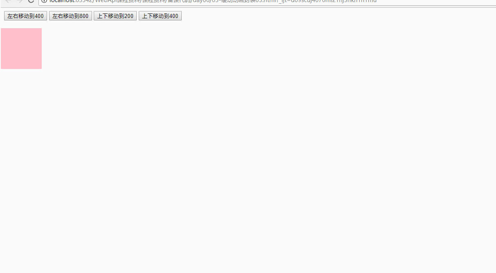
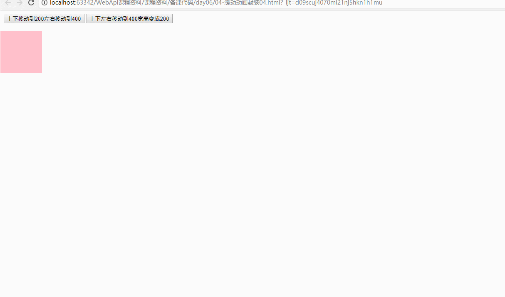
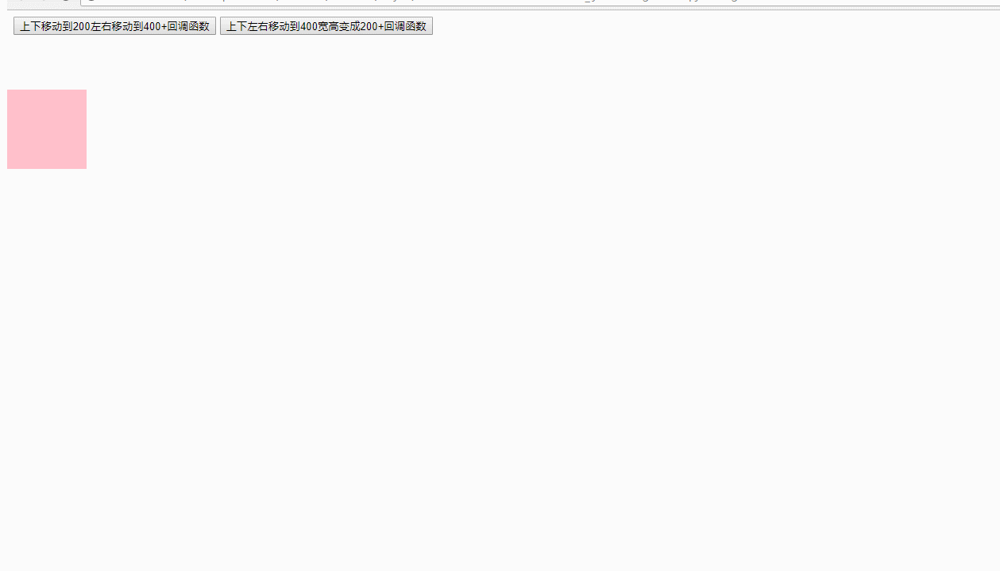
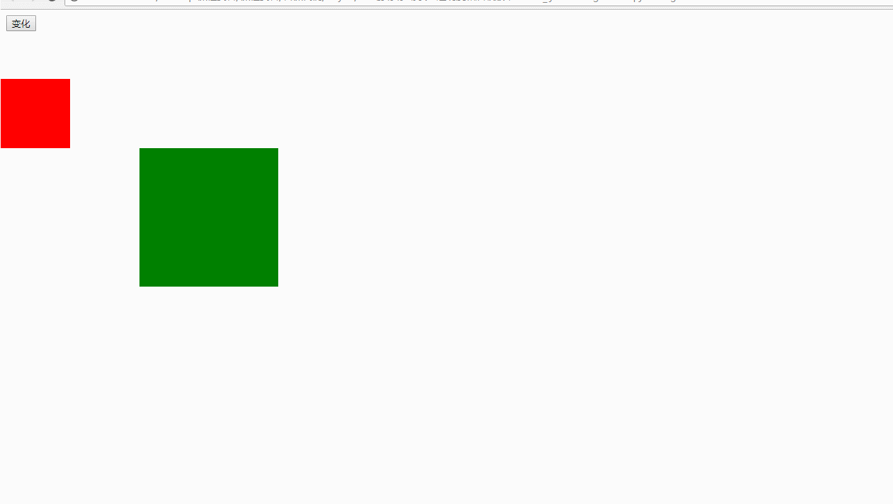
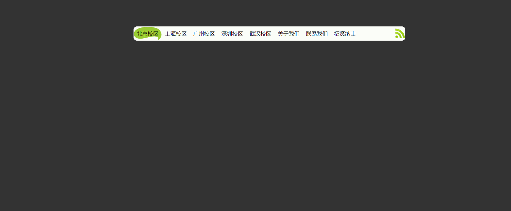

* * * *

# 今日学习任务

* [ ] 1.window.getComputedStyle()获取元素一切样式属性
* [ ] 2.缓动动画封装
  * [ ] (4).移动属性不限
  * [ ] (5).移动属性数量不限
* [ ] 3.缓动动画经典案例
  * [ ] (1)筋斗云
  * [ ] (2)360开机动画
  * [ ] (3)旋转木马(课外拓展加强)


# 01-getComputedStyle()获取元素一切样式属性


* 语法： `window.getComputedStyle(元素,伪元素)`
  * 返回值：对象类型（存储元素一切样式属性）

```html
<!DOCTYPE html>
<html>
<head lang="en">
    <meta charset="UTF-8">
    <title>标题</title>
    <style>
        .one {
            width: 100px;
            background-color: pink;
            border: 10px solid green;
            padding: 10px;
            margin: 0 auto;
            position: relative;
            left: 0px;
            top: 50px;
        }
        .one::after {
            content: "哈哈哈";
            background-color: blue;
        }
    </style>
</head>
<body>
<input type="button" value="按钮" id="btn"/>
<div class="one" id="box" style="height: 100px"></div>

<script>
    var box = document.getElementById('box');

   //  /*1.点语法操作元素属性特点
   //      a.只能获取行内，无法获取行外
   //      b.获取的是string，带单位
   //      c.既可以获取，也可以修改
   //  */
   //  console.log ( box.style.height );//100px
   //  console.log ( box.style.backgroundColor );//空字符串
   //
   //  box.style.width = '200px';
   //
   //
   //
   //
   //  /*window.getComputedStyle ：获取元素一切样式属性
   //      a. 既可以获取行内，也可以获取行外
   //      b.获取的是string，带单位
   //      c.只能获取无法修改
   //  */
   //
   //  /**2
   //   * @param ele:要获取的元素
   //   * @param pseudoElt:伪元素   使用不多，一般为null
   //   * @return CSSStyleDeclaration  是一个对象：包含这个元素一切的样式属性
   //   */
   //  var style = window.getComputedStyle(box,null);
   //  console.log ( style );
   //
   //  console.log ( style.width );
   //  console.log ( style.height );
   //  console.log ( style.backgroundColor );
   //
   //  // style.width = '500px';//程序报错，无法修改
   //
   //  //3.获取伪元素的样式属性
   // var weiStyle =  window.getComputedStyle(box,'::after' );
   //  console.log ( weiStyle );
   //  console.log ( weiStyle.content );
   //  console.log ( weiStyle.backgroundColor );
   //
   //  //4.IE8浏览器
   //
   //  //IE8浏览器： 元素.currentSyle
   //
   //  console.log ( box.currentStyle );


    console.log ( getSyle ( box, 'height' ) );

    /**
     * 获取元素属性值
     * @param ele 元素
     * @param attribute 属性名字符串
     */
    function getSyle (  ele,attribute) {
        //能力检测
        if (window.getComputedStyle){//谷歌火狐
            /*注意：这里不能使用点语法。这个语法含义：取style对象的一个叫做attribute的属性值，得到undefined*/
            // return style.attribute;
            /*含义：字符串语法取attribute变量中存储的字符串对应的属性的值 */
            return window.getComputedStyle(ele, null)[attribute];
        }else{//IE8
            return ele.currentStyle[attribute];
        };
    };

</script>

</body>
</html>
```


# 02-缓动动画封装4567(移动属性、属性数量)不限

## 1.1-移动属性不限04



```html
<!DOCTYPE html>
<html>
<head lang="en">
    <meta charset="UTF-8">
    <title></title>

    <style>
        #box {
            width: 100px;
            height: 100px;
            background-color: red;
            position: absolute;
            left: 0px;
            top: 50px;
        }

    </style>
</head>
<body>

<input type="button" value="左右移动到800" id="move400"/>
<input type="button" value="上下移动到400" id="move800"/>

<div id="box"></div>


<script>
    /*本小节解决问题：移动属性不限
     */
    var box = document.getElementById('box');

    //缓动移到400
    document.getElementById('move400').onclick = function(){
        animationSlow(box, 800,'height');
    };

    //缓动移到800
    document.getElementById('move800').onclick = function (  ) {
        animationSlow(box,400,'top');
    };


    /**
     * 缓动动画
     * @param ele 要移动的元素
     * @param target 要移动的目标距离
     * @param attr:要移动的属性
     */
    function animationSlow (ele,target,attr  ) {
        //1.清除之前的定时器，以本次为准
        clearInterval(ele.timeID);
        //2.开始本次移动
        ele.timeID = setInterval(function (  ) {
            //2.1 先获取当前位置
            /* 注意点： getStyle函数返回的是一个字符串类型，需要转成整数 */
            var current = parseInt(getSyle(ele, attr));
            //2.2 计算本次移动距离 = (目标位置 - 当前位置)/10
            var step = (target - current)/10;
            //取整： 从左往右step>0 : 向上取整   从右往左step<0 : 向下取整
            step = step>0?Math.ceil(step):Math.floor(step);
            //2.3 开始移动
            current += step;
            ele.style[attr] = current + 'px';
            //2.4 终点检测
            if (current == target){
                clearInterval(ele.timeID);
            };
        },50);
    };

    /**
     * 获取元素属性值
     * @param ele 元素
     * @param attribute 属性名字符串
     */
    function getSyle (  ele,attribute) {
        //能力检测
        if (window.getComputedStyle){//谷歌火狐
            /*注意：这里不能使用点语法。这个语法含义：取style对象的一个叫做attribute的属性值，得到undefined*/
            // return style.attribute;
            /*含义：字符串语法取attribute变量中存储的字符串对应的属性的值 */
            return window.getComputedStyle(ele, null)[attribute];
        }else{//IE8
            return ele.currentStyle[attribute];
        };
    };
</script>
</body>
</html>
```


## 1.2-移动属性数量不限05

* 本小节解决问题：移动属性数量不限
  * 将函数的参数变成对象类型
    * a.减少参数的数量
    * b.一个变量存储多个数据

​       1.发现问题：对象只有一个属性，动画没有误差。但是有多个属性，动画产生误差

​       2.分析问题：对象有多个属性的时候，只要有任何一个属性到达终点。定时就被清除

​       3.解决问题：开关思想

​            清除定时器条件：保证所有的属性都到达终点




```html
<!DOCTYPE html>
<html>
<head lang="en">
    <meta charset="UTF-8">
    <title></title>

    <style>
        #box {
            width: 100px;
            height: 100px;
            background-color: red;
            position: absolute;
            left: 0px;
            top: 50px;
        }

    </style>
</head>
<body>

<input type="button" value="左右移动到800" id="move400"/>
<input type="button" value="上下移动到400" id="move800"/>

<div id="box"></div>


<script>
    /*本小节解决问题：移动属性数量不限
        * 将函数的参数变成对象类型
            * a.减少参数的数量
            * b.一个变量存储多个数据
            *
       1.发现问题：对象只有一个属性，动画没有误差。但是有多个属性，动画产生误差
       2.分析问题：对象有多个属性的时候，只要有任何一个属性到达终点。定时就被清除
       3.解决问题：
            清除定时器条件：保证所有的属性都到达终点
     */
    var box = document.getElementById('box');

    //缓动移到400
    document.getElementById('move400').onclick = function(){
        animationSlow(box, {
            left:400,
            top:300,
            width:500,
            height:500
        });
    };

    //缓动移到800
    document.getElementById('move800').onclick = function (  ) {
        animationSlow(box,400,'top');
    };


    /**
     * 缓动动画
     * @param ele 要移动的元素
     * @param attrs:要移动的属性对象
     */
    function animationSlow (ele,attrs  ) {
        //1.清除之前的定时器，以本次为准
        clearInterval(ele.timeID);
        //2.开始本次移动
        ele.timeID = setInterval(function (  ) {
            /*开关思想：如果一个操作的结果只有两种情况。可以使用布尔类型表示这两种情况 isAllOk
            1.提出假设：var isAllOk = true
            2.验证假设:
            3.根据开关状态实现需求
            */
            //一：提出假设
            var isAllOk = true;
            //二：验证假设
            for(var key in attrs){//遍历对象属性
                /*这里声明两个变量：主要是因为修改了形参之后，原先的attr与target不能使用，声明两个变量
               刚好也叫attr与target，那后面的代码就可以不用修改
               */
                var attr = key;
                var target = attrs[key];
                //2.1 先获取当前位置
                /* 注意点： getStyle函数返回的是一个字符串类型，需要转成整数 */
                var current = parseInt(getSyle(ele, attr));
                //2.2 计算本次移动距离 = (目标位置 - 当前位置)/10
                var step = (target - current)/10;
                //取整： 从左往右step>0 : 向上取整   从右往左step<0 : 向下取整
                step = step>0?Math.ceil(step):Math.floor(step);
                //2.3 开始移动
                current += step;
                ele.style[attr] = current + 'px';
                //2.4 终点检测
               //二：验证假设：只要有任何属性没有到达终点，假设被推翻
                if (current != target){
                    isAllOk = false;
                }
            };
            //三：根据开关状态实现需求
            if (isAllOk){
                clearInterval(ele.timeID);
            }
        },50);
    };


    /**
     * 获取元素属性值
     * @param ele 元素
     * @param attribute 属性名字符串
     */
    function getSyle (  ele,attribute) {
        //能力检测
        if (window.getComputedStyle){//谷歌火狐
            /*注意：这里不能使用点语法。这个语法含义：取style对象的一个叫做attribute的属性值，得到undefined*/
            // return style.attribute;
            /*含义：字符串语法取attribute变量中存储的字符串对应的属性的值 */
            return window.getComputedStyle(ele, null)[attribute];
        }else{//IE8
            return ele.currentStyle[attribute];
        };
    };

    // function fn ( a  ) {
    //     //打印实参的值
    //    for(var key in a){
    //        console.log ( a[ key ] );
    //    };
    // };
    //
    // fn({name:'张三',age:18});
</script>
</body>
</html>
```


## 1.3-添加回调函数06




```html
<!DOCTYPE html>
<html>
<head lang="en">
    <meta charset="UTF-8">
    <title></title>

    <style>
        #box {
            width: 100px;
            height: 100px;
            background-color: red;
            position: absolute;
            left: 0px;
            top: 50px;
        }

    </style>
</head>
<body>

<input type="button" value="左右移动到800" id="move400"/>
<input type="button" value="上下移动到400" id="move800"/>

<div id="box"></div>


<script>
    /*本小节解决问题：移动属性数量不限
        * 将函数的参数变成对象类型
            * a.减少参数的数量
            * b.一个变量存储多个数据
            *
       1.发现问题：对象只有一个属性，动画没有误差。但是有多个属性，动画产生误差
       2.分析问题：对象有多个属性的时候，只要有任何一个属性到达终点。定时就被清除
       3.解决问题：
            清除定时器条件：保证所有的属性都到达终点
     */
    var box = document.getElementById('box');

    //缓动移到400
    document.getElementById('move400').onclick = function(){
        animationSlow(box, {
            left:400,
            top:300,
            width:500,
            height:500
        },function (  ) {
            animationSlow(box, {
                left:50,
                top:50,
                height:50,
                width:50
            },function (  ) {
                animationSlow(box, {
                    left:300,
                    top:300,
                    width:0,
                    height:0
                })
            });
        });
    };

    //缓动移到800
    document.getElementById('move800').onclick = function (  ) {
        animationSlow(box,{
            top:50
        });
    };


    /**
     * 缓动动画
     * @param ele 要移动的元素
     * @param attrs:要移动的属性对象
     * * @param fn:接收一段代码(回调函数)   如果传了，动画结束之后就执行这段代码。如果不传就不执行
     */
    function animationSlow (ele,attrs ,fn ) {
        //1.清除之前的定时器，以本次为准
        clearInterval(ele.timeID);
        //2.开始本次移动
        ele.timeID = setInterval(function (  ) {
            /*开关思想：如果一个操作的结果只有两种情况。可以使用布尔类型表示这两种情况 isAllOk
            1.提出假设：var isAllOk = true
            2.验证假设:
            3.根据开关状态实现需求
            */
            //一：提出假设
            var isAllOk = true;
            //二：验证假设
            for(var key in attrs){//遍历对象属性
                /*这里声明两个变量：主要是因为修改了形参之后，原先的attr与target不能使用，声明两个变量
               刚好也叫attr与target，那后面的代码就可以不用修改
               */
                var attr = key;
                var target = attrs[key];
                //2.1 先获取当前位置
                /* 注意点： getStyle函数返回的是一个字符串类型，需要转成整数 */
                var current = parseInt(getSyle(ele, attr));
                //2.2 计算本次移动距离 = (目标位置 - 当前位置)/10
                var step = (target - current)/10;
                //取整： 从左往右step>0 : 向上取整   从右往左step<0 : 向下取整
                step = step>0?Math.ceil(step):Math.floor(step);
                //2.3 开始移动
                current += step;
                ele.style[attr] = current + 'px';
                //2.4 终点检测
                //二：验证假设：只要有任何属性没有到达终点，假设被推翻
                if (current != target){
                    isAllOk = false;
                }
            };
            //三：根据开关状态实现需求
            if (isAllOk){
                clearInterval(ele.timeID);
                //如果用户传了第三个参数，就执行这段代码。 如果没有传就不执行
                if (typeof fn == 'function'){
                    fn();
                }
            }
        },50);
    };


    /**
     * 获取元素属性值
     * @param ele 元素
     * @param attribute 属性名字符串

     */
    function getSyle (  ele,attribute) {
        //能力检测
        if (window.getComputedStyle){//谷歌火狐
            /*注意：这里不能使用点语法。这个语法含义：取style对象的一个叫做attribute的属性值，得到undefined*/
            // return style.attribute;
            /*含义：字符串语法取attribute变量中存储的字符串对应的属性的值 */
            return window.getComputedStyle(ele, null)[attribute];
        }else{//IE8
            return ele.currentStyle[attribute];
        };
    };

    // function fn ( a  ) {
    //     //打印实参的值
    //    for(var key in a){
    //        console.log ( a[ key ] );
    //    };
    // };
    //
    // fn({name:'张三',age:18});

</script>
</body>
</html>
```


## 1.4-透明度与层级07


本小节解决问题：层级与透明度

​        1.层级：层级是一个瞬变的过程，没有动画

​        2.透明度： 范围0-1的小数   （1）需要使用parseFloat转换小数   （2）透明度没有px单位 (3)透明度是小数点

​        计算不方便。  先乘以100变成整数计算，赋值的时候除以100

​        3.背景颜色：不给动画，直接修改




```html
<!DOCTYPE html>
<html>
<head lang="en">
    <meta charset="UTF-8">
    <title></title>

    <style>
        #box {
            width: 100px;
            height: 100px;
            background-color: red;
            position: absolute;
            left: 0px;
            top: 50px;
            opacity: 1;
        }

        #box1 {
            width: 100px;
            height: 100px;
            background-color: green;
            position: absolute;
            left: 300px;
            top: 300px;
        }

    </style>
</head>
<body>

<input type="button" value="左右移动到800" id="move400"/>
<input type="button" value="上下移动到400" id="move800"/>

<div id="box"></div>

<div id="box1"></div>


<script>
    /*本小节解决问题：层级与透明度
        1.层级：层级是一个瞬变的过程，没有动画
        2.透明度： 范围0-1的小数   （1）需要使用parseFloat转换小数   （2）透明度没有px单位 (3)透明度是小数点
        计算不方便。  先乘以100变成整数计算，赋值的时候除以100
        3.背景颜色：不给动画，直接修改


     */
    var box = document.getElementById('box');


    //缓动移到400
    document.getElementById('move400').onclick = function(){
        animationSlow(box, {
            left:300,
            top:300,
            width:500,
            height:500,
            zIndex:1,
            opacity:0.7
        },function (  ) {
            animationSlow(box, {
                backgroundColor:'hotpink',
                opacity:0.9
            },animationSlow(box, {
                backgroundColor:'pink',
                opacity:1
            }))
        });
    };

    //缓动移到800
    document.getElementById('move800').onclick = function (  ) {
        animationSlow(box,{
            top:50
        });
    };


    /**
     * 缓动动画
     * @param ele 要移动的元素
     * @param attrs:要移动的属性对象
     * * @param fn:接收一段代码(回调函数)   如果传了，动画结束之后就执行这段代码。如果不传就不执行
     */
    function animationSlow (ele,attrs ,fn ) {
        //1.清除之前的定时器，以本次为准
        clearInterval(ele.timeID);
        //2.开始本次移动
        ele.timeID = setInterval(function (  ) {
            /*开关思想：如果一个操作的结果只有两种情况。可以使用布尔类型表示这两种情况 isAllOk
            1.提出假设：var isAllOk = true
            2.验证假设:
            3.根据开关状态实现需求
            */
            //一：提出假设
            var isAllOk = true;
            //二：验证假设
            for(var key in attrs){//遍历对象属性
                if (key == 'zIndex'){
                    ele.style.zIndex = attrs[key];
                }else if (key == 'backgroundColor'){
                    ele.style.backgroundColor = attrs[key];
                }else if (key == 'opacity'){
                    var attr = key;
                    var target = attrs[key] * 100;
                    //2.1 先获取当前位置
                    /* 注意点：透明度是0-1小数，应该使用parseFloat */
                    var current = parseFloat(getSyle(ele, attr)) * 100;
                    //2.2 计算本次移动距离 = (目标位置 - 当前位置)/10
                    var step = (target - current)/10;
                    //取整： 从左往右step>0 : 向上取整   从右往左step<0 : 向下取整
                    step = step>0?Math.ceil(step):Math.floor(step);
                    //2.3 开始移动
                    current += step;
                    box.style[attr] = current / 100;
                    //2.4 终点检测
                    //二：验证假设：只要有任何属性没有到达终点，假设被推翻
                    if (current != target){
                        isAllOk = false;
                    }
                }else{
                    var attr = key;
                    var target = attrs[key];
                    //2.1 先获取当前位置
                    /* 注意点： getStyle函数返回的是一个字符串类型，需要转成整数 */
                    var current = parseInt(getSyle(ele, attr));
                    //2.2 计算本次移动距离 = (目标位置 - 当前位置)/10
                    var step = (target - current)/10;
                    //取整： 从左往右step>0 : 向上取整   从右往左step<0 : 向下取整
                    step = step>0?Math.ceil(step):Math.floor(step);
                    //2.3 开始移动
                    current += step;
                    ele.style[attr] = current + 'px';
                    //2.4 终点检测
                    //二：验证假设：只要有任何属性没有到达终点，假设被推翻
                    if (current != target){
                        isAllOk = false;
                    }
                }
            };
            //三：根据开关状态实现需求
            if (isAllOk){
                clearInterval(ele.timeID);
                //如果用户传了第三个参数，就执行这段代码。 如果没有传就不执行
                if (typeof fn == 'function'){
                    fn();
                }
            }
        },50);
    };


    /**
     * 获取元素属性值
     * @param ele 元素
     * @param attribute 属性名字符串

     */
    function getSyle (  ele,attribute) {
        //能力检测
        if (window.getComputedStyle){//谷歌火狐
            /*注意：这里不能使用点语法。这个语法含义：取style对象的一个叫做attribute的属性值，得到undefined*/
            // return style.attribute;
            /*含义：字符串语法取attribute变量中存储的字符串对应的属性的值 */
            return window.getComputedStyle(ele, null)[attribute];
        }else{//IE8
            return ele.currentStyle[attribute];
        };
    };

    // function fn ( a  ) {
    //     //打印实参的值
    //    for(var key in a){
    //        console.log ( a[ key ] );
    //    };
    // };
    //
    // fn({name:'张三',age:18});

</script>
</body>
</html>
```


# 03-缓动动画经典案例


## 1.1-筋斗云

需求分析：

​        1.鼠标移入li元素：筋斗云缓动到移入的li元素

​        2.鼠标移出li元素：筋斗云缓动到主人身边

​        3.鼠标点击li元素：筋斗云主人变成当前点击的li元素

思路分析：事件三要素

​             1 获取元素：

​             2 注册事件：

​             3 事件处理：

[效果预览](file:///C:/Users/%E5%BC%A0%E6%99%93%E5%9D%A4/Desktop/%E5%BC%A0%E6%99%93%E5%9D%A4%E5%89%8D%E7%AB%AF%E5%A4%87%E8%AF%BE%E8%B5%84%E6%96%99/%E5%85%A8%E5%A4%A9%E6%A8%A1%E5%BC%8F/02-WebApi/%E8%AF%BE%E7%A8%8B%E8%B5%84%E6%96%99/%E5%A4%87%E8%AF%BE%E4%BB%A3%E7%A0%81/day06/06-%E6%A1%88%E4%BE%8B%EF%BC%9A%E7%AD%8B%E6%96%97%E4%BA%91/01-%E6%A1%88%E4%BE%8B%EF%BC%9A%E7%AD%8B%E6%96%97%E4%BA%91.html)




```html
<!DOCTYPE html>
<html>

<head lang="en">
    <meta charset="UTF-8">
    <title>筋斗云动态效果</title>
    <style>
        * {
            margin: 0;
            padding: 0;
        }

        ul {
            list-style: none;
        }

        body {
            background-color: #333;
        }

        .nav {
            width: 800px;
            height: 42px;
            margin: 100px auto;
            /*background-color: red;*/
            background: #fff url(images/rss.png) no-repeat right center;
            border-radius: 10px;
            position: relative;
        }

        .nav li {
            width: 83px;
            height: 42px;
            /*background-color: red;*/
            text-align: center;
            line-height: 42px;
            float: left;
            cursor: pointer;
        }

        ul {
            position: relative;
        }

        .nav span {
            position: absolute;
            top: 0;
            left: 0;
            width: 83px;
            height: 42px;
            background: url(images/cloud.gif) no-repeat;
        }
    </style>

</head>

<body>

<div class="nav">

    <span id="cloud"></span>
    <ul id="navBar">
        <li>北京校区</li>
        <li>上海校区</li>
        <li>广州校区</li>
        <li>深圳校区</li>
        <li>武汉校区</li>
        <li>关于我们</li>
        <li>联系我们</li>
        <li>招贤纳士</li>
    </ul>
</div>

</body>

</html>

<script src="animation.js"></script>
<script>

  /* 需求分析：
        1.鼠标移入li元素：筋斗云缓动到移入的li元素
        2.鼠标移出li元素：筋斗云缓动到主人身边
        3.鼠标点击li元素：筋斗云主人变成当前点击的li元素
       思路分析：事件三要素
             1 获取元素：
             2 注册事件：
             3 事件处理：
   */

  //1. 获取元素：
  var cloud = document.getElementById('cloud');//筋斗云
  var navBar = document.getElementById('navBar');//导航栏ul

  //声明变量存储筋斗云的主人：默认是第一个li元素
  var owner = navBar.children[0];
  //2.注册事件：
   for(var i = 0;i<navBar.children.length;i++){

       //2.1  鼠标移入
        navBar.children[i].onmouseover = function (  ) {
            //3.事件处理   : 筋斗云缓动到移入的li元素
            animationSlow(cloud,this.offsetLeft);
        };

        //2.2 鼠标移出
       navBar.children[i].onmouseout = function (  ) {
           //3.事件处理:筋斗云缓动到主人身边
           animationSlow(cloud,owner.offsetLeft);
       };

       //2.3 鼠标单击
       navBar.children[i].onclick = function (  ) {
           //3事件处理:筋斗云主人变成点击的li元素
           owner = this;
       }
   }

</script>
```


## 1.2-360开机动画


需求分析：点击关闭按钮

​          （1）下半部分往下缓动（从屏幕消失）

​          （2）整个盒子往右混动（从屏幕消失），需要等上一个动画结束之后执行

思路分析：事件三要素

​               1 获取元素：

​               2 注册事件：

​               3 事件处理：

[效果预览](file:///C:/Users/张晓坤/Desktop/张晓坤前端备课资料/全天模式/02-WebApi/课程资料/备课代码/day06/12-案例：360开机动画/12-360开机动画.html)


```html
<!DOCTYPE html>
<html>
<head lang="en">
  <meta charset="UTF-8">
  <title>静态文件</title>
  <style>
    .box {
      /*width: 322px;*/
      position: fixed;
      bottom: 0;
      right: 0;
      overflow: hidden;
    }
    
    span {
      position: absolute;
      top: 0;
      right: 0;
      width: 30px;
      height: 20px;
      /*background-color: red;*/
      cursor: pointer;
    }
  </style>

</head>
<body>
<div class="box" id="box">
  <span id="closeButton"></span>
  <div class="hd" id="headPart">
    
  </div>
  <div id="bottomPart" class="bd">
    
  </div>
</div>

<script src="animation.js"></script>
<script>


    /* 需求分析：点击关闭按钮
          （1）下半部分往下缓动（从屏幕消失）
          （2）整个盒子往右混动（从屏幕消失），需要等上一个动画结束之后执行
         思路分析：事件三要素
               1 获取元素：
               2 注册事件：
               3 事件处理：
     */

    //1. 获取元素：
    var closeButton = document.getElementById('closeButton');
    var box = document.getElementById('box');//整个盒子
    var bottomPart = document.getElementById('bottomPart');//下半部分
    //2.注册事件：
    closeButton.onclick = function (  ) {
        //3.事件处理：
        animationSlow(bottomPart,{
            height:0
        },function (  ) {
            animationSlow(box, {
                width:0
            })
        });
    }
</script>
</body>
</html>
```


## 1.3-旋转木马


* ***旋转木马核心思路：li元素样式互换***

1.需求分析：

  	鼠标移入移出wrap：显示和隐藏上一页下一页arrow

  	鼠标点击上一页下一页：元素样式互换

​      	上一页：将config数组第一个元素移动到最后面

​      	下一页：将config数组最后一个元素移动到最前面

[效果预览](<file:///C:/Users/%E5%BC%A0%E6%99%93%E5%9D%A4/Desktop/%E5%BC%A0%E6%99%93%E5%9D%A4%E5%89%8D%E7%AB%AF%E5%A4%87%E8%AF%BE%E8%B5%84%E6%96%99/AB%E6%A8%A1%E5%BC%8F/03-WebApi/%E8%AF%BE%E7%A8%8B%E8%B5%84%E6%96%99/%E5%A4%87%E8%AF%BE%E4%BB%A3%E7%A0%81/day07/08-%E6%A1%88%E4%BE%8B%EF%BC%9A%E6%97%8B%E8%BD%AC%E6%9C%A8%E9%A9%AC/03-%E6%A1%88%E4%BE%8B%EF%BC%9A%E6%97%8B%E8%BD%AC%E6%9C%A8%E9%A9%AC.html>)


```html
<!DOCTYPE html>
<html>
<head lang="en">
  <meta charset="UTF-8">
  <title>旋转木马轮播图</title>
  <style>
    /*初始化  reset*/
    blockquote,body,button,dd,dl,dt,fieldset,form,h1,h2,h3,h4,h5,h6,hr,input,legend,li,ol,p,pre,td,textarea,th,ul{margin:0;padding:0}
    body,button,input,select,textarea{font:12px/1.5 "Microsoft YaHei", "微软雅黑", SimSun, "宋体", sans-serif;color: #666;}
    ol,ul{list-style:none}
    a{text-decoration:none}
    fieldset,img{border:0;vertical-align:top;}
    a,input,button,select,textarea{outline:none;}
    a,button{cursor:pointer;}
    .wrap {
      width: 1200px;
      margin: 100px auto;
      border: 1px solid red;
    }
    .slide {
      height: 500px;
      position: relative;
    }
    .slide li {
      position: absolute;
      left: 200px;
      top: 0;
    }
    .slide li img {
      width: 100%;  /*让图片的大小和父盒子一样的大，要不然会出问题，会撑出父盒子*/
    }
    .arrow {
      display: none;
    }
    .prev,.next {
      width: 76px;
      height: 112px;
      position: absolute;
      top: 50%;
      margin-top: -56px;
      /*background-color: red;*/
      background: url(images/prev.png) no-repeat;
      z-index: 99;
    }
    .next {
      right: 0;
      background-image: url(images/next.png);
    }


    .slide .one {
      width:400px;
      top: 20px;
      left: 50px;
      opacity: 0.2;
      z-index: 2
    }
    .slide .two {
      width: 600px;
      top: 70px;
      left: 0px;
      opacity: 0.8;
      z-index: 3
    }
    .slide .three {
      width: 800px;
      top: 100px;
      left: 200px;
      opacity: 1;
      z-index: 4
    }
    .slide .four {
      width: 600px;
      top: 70px;
      left: 600px;
      opacity: 0.8;
      z-index: 3

    }
    .slide .five {
      width:400px;
      top: 20px;
      left: 750px;
      opacity: 0.2;
      z-index: 2

    }

  </style>
</head>
<body>
<div class="wrap" id="wrap">
  <div class="slide" id="slide">
      <ul>
        <li class="one"><a href="#"></a></li>
        <li class="two"><a href="#"></a></li>
        <li class="three"><a href="#"></a></li>
        <li class="four"><a href="#"></a></li>
        <li class="five"><a href="#"></a></li>
    </ul>
    <div class="arrow" id="arrow">
      <a href="javascript:;" class="prev" id="arrLeft"></a>
      <a href="javascript:;" class="next" id="arrRight"></a>
    </div>
  </div>
</div>

<script src="animation.js"></script>
<script>
/*旋转木马核心思路：li元素样式互换
1.需求分析：
  鼠标移入移出wrap：显示和隐藏上一页下一页arrow
  鼠标点击上一页下一页：元素样式互换
      上一页：将config数组第一个元素移动到最后面
      下一页：将config数组最后一个元素移动到最前面
 */

  //0.将每一个元素样式放入数组中
  var config = [
    {
      "width": 400,
      "top": 20,
      "left": 50,
      "opacity": 0.2,
      "zIndex": 2
    },//0
    {
      "width": 600,
      "top": 70,
      "left": 0,
      "opacity": 0.8,
      "zIndex": 3
    },//1
    {
      "width": 800,
      "top": 100,
      "left": 200,
      "opacity": 1,
      "zIndex": 4
    },//2
    {
      "width": 600,
      "top": 70,
      "left": 600,
      "opacity": 0.8,
      "zIndex": 3
    },//3
    {
      "width": 400,
      "top": 20,
      "left": 750,
      "opacity": 0.2,
      "zIndex": 2
    }//4
  ];

console.log ( config );

//1. 获取元素：
var wrap = document.getElementById('wrap');//最外面盒子
var arrow = document.getElementById('arrow');//上一页下一个按钮
var arrLeft = document.getElementById('arrLeft');//上一页
var arrRight = document.getElementById('arrRight');//下一页
var ul = document.getElementById('slide').children[0];//旋转木马ul

//一：页面加载：自动轮播
var timeID = setInterval(function (  ) {
    //3.1 将config数组最后一个元素移动到最前面
    config.unshift(config.pop());
    console.log ( config );
    //3.2 每一个li元素依次缓动
    for(var i = 0;i<ul.children.length;i++){
        animationSlow(ul.children[i],config[i]);
    };
},3000);


//2.注册事件：

//2.1 鼠标移入wrap
wrap.onmouseover = function (  ) {
    //3.事件处理:显示arrow
    arrow.style.display = 'block';

    //二：切换手动模式
    clearInterval(timeID);
};

//2.2 鼠标移出wrap
wrap.onmouseout = function (  ) {
    //3.事件处理:隐藏arrow
    arrow.style.display = 'none';

    //三：开启自动模式
    timeID = setInterval(function (  ) {
        //3.1 将config数组最后一个元素移动到最前面
        config.unshift(config.pop());
        console.log ( config );
        //3.2 每一个li元素依次缓动
        for(var i = 0;i<ul.children.length;i++){
            animationSlow(ul.children[i],config[i]);
        };
    },3000);
};

//2.3 下一页
  arrRight.onclick = function (  ) {
      //3事件处理：

      //3.1 将config数组最后一个元素移动到最前面
      config.unshift(config.pop());
      console.log ( config );
     //3.2 每一个li元素依次缓动
      for(var i = 0;i<ul.children.length;i++){
        animationSlow(ul.children[i],config[i]);
      };
  };

  //2.4 上一页
  arrLeft.onclick = function (  ) {
      //3.事件处理
      //3.1 将config数组第一个元素移动到最后面
      config.push(config.shift());
      //3.2 每一个li元素依次缓动
      for(var i = 0;i<ul.children.length;i++){
          animationSlow(ul.children[i],config[i]);
      };
  }

</script>
</body>
</html>
```

