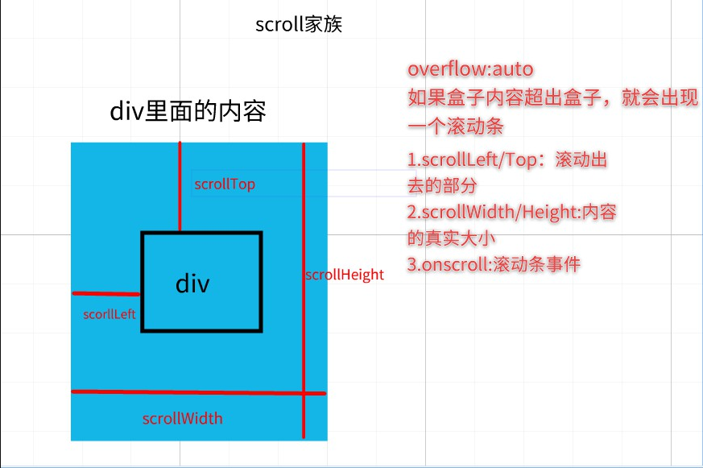
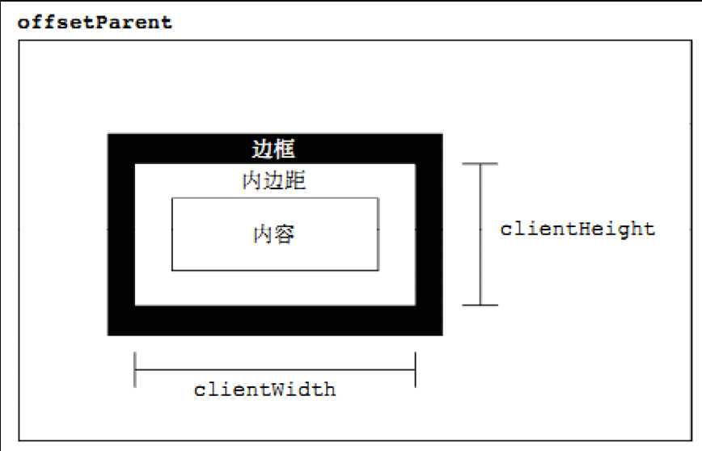
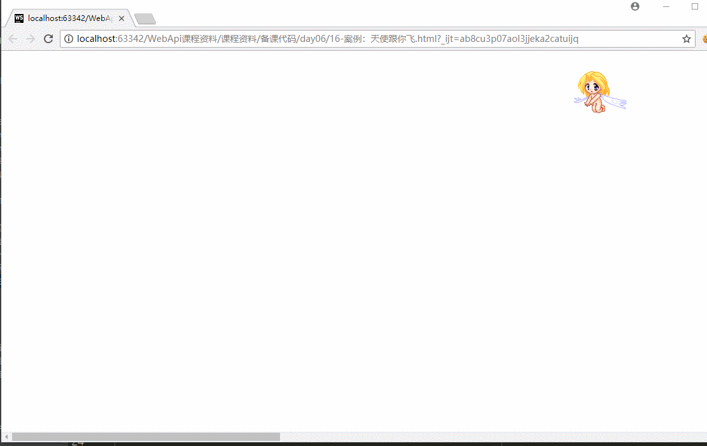
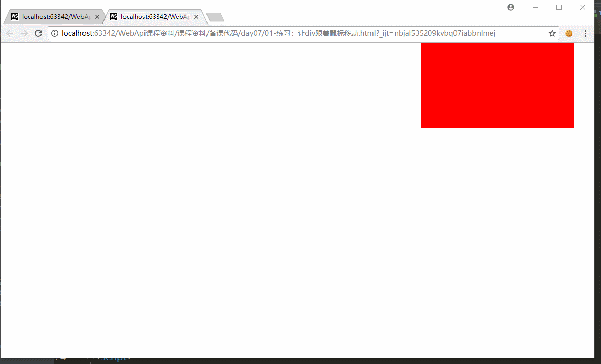
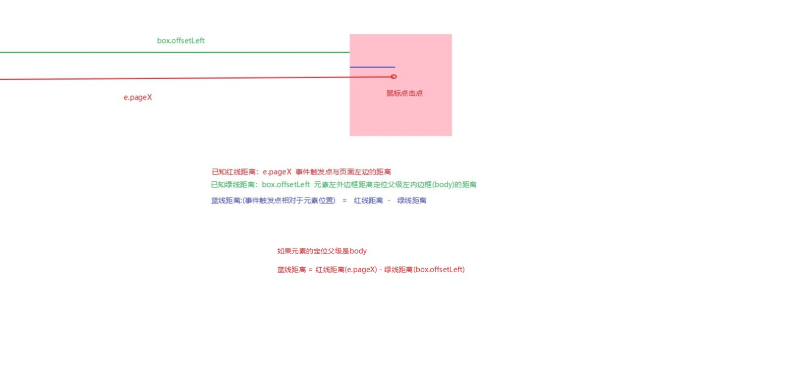
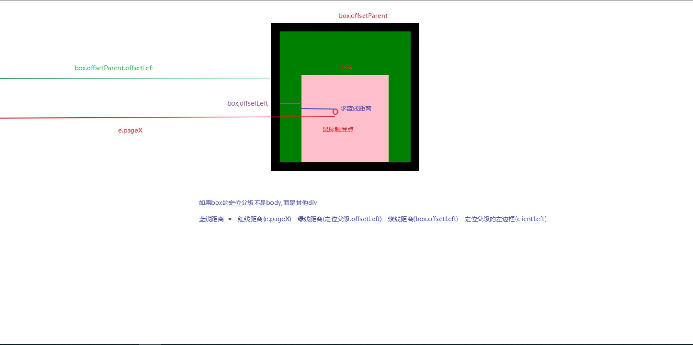
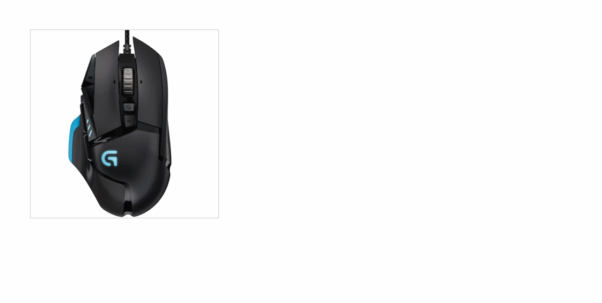

# 今日学习任务


* [ ] 1.三大家族及经典应用场景
  * [ ] (1)offset家族：获取元素自身真实宽高与位置
  * [ ] (2)scroll家族：获取元素内容真实宽高与位置
    * [ ] 经典场景：获取网页滚动距离(实现固定导航)
  * [ ] (3)client家族 :  获取元素可视区域大小
    * [ ] 经典场景：获取网页可视区域大小(实现响应式布局) 
* [ ] 2.事件对象
  * [ ] (1)事件对象三大坐标系
  * [ ] (2)案例：div跟随鼠标移动
  * [ ] (3)获取事件触发点相对于元素自身位置
* [ ] ==3.经典案例:放大镜==

  


# 01-三大家族(offset、scroll、client)

## 1.0-offset家族(元素自身大小)


## 1.1-scroll家族（元素内容大小）

* 1.offset家族：
  * offsetWidth、offsetHeight:获取元素自身的真实宽高(width+padding+border),不带单位，是number类型
  * offsetParent：获取一个元素的定位父级
  * offsetLeft、offsetTop:获取元素的外边框到定位父级的内边框的（左/上）距离
* 2.scroll家族：（与offset家族类似，不带单位，number类型）
  * scrollWidth和scrollHeight：元素内容真实的宽高
  * scrollLeft和scrollTop：元素在滚动时超出内容区域的部分
  * onscroll:元素的滚动条事件，只要滚动就会触发


)


```html
<!DOCTYPE html>
<html>
<head lang="en">
    <meta charset="UTF-8">
    <title>标题</title>
    <style>
        .one {
            width: 200px;
            height: 200px;
            border: 1px solid #000;
            /*设置auto可以添加滚动条，如果此时div没有设置宽高，就会变成和内容一样大小*/
            overflow: auto;
        }

        img {
            vertical-align: top;
            /*width: 400px;*/
            /*height: 400px;*/

        }
    </style>
</head>
<body>

<div class="one" id="box">
    
</div>

</body>

<script>
    /**1.offset家族：
            * offsetWidth、offsetHeight:获取元素自身的真实宽高(width+padding+border),不带单位，是number类型
            * offsetParent：获取一个元素的定位父级
            * offsetLeft、offsetTop:获取元素的外边框到定位父级的内边框的（左/上）距离
     * 2.scroll家族：（与offset家族类似，不带单位，number类型）
            * scrollWidth和scrollHeight：元素内容真实的宽高
            * scrollLeft和scrollTop：元素在滚动时超出内容区域的部分
            * onscroll:元素的滚动条事件，只要滚动就会触发
     *
     */

    var box = document.getElementById('box');

    console.log ( box.offsetWidth ,box.offsetHeight);//200,200  box自身的宽高


    //给box添加滚动条事件
    box.onscroll = function (  ) {
        console.log ( box.scrollWidth ,box.scrollHeight);//box内容的真实宽高
        // 内容区域 = 元素宽高 - 滚动条的宽度（17px）
        console.log (box.scrollLeft,box.scrollTop  );//内容区域超出部分
    }
</script>
</html>
```


## 1.2-获取网页滚动距离

本小节知识点

* 1.如何获取页面的HTML元素和body元素
  * HTML:document.documentElement;
  * body: document.body;
* 2.获取整个页面的滚动事件：window.onscroll
  * 没有兼容性
* 3.获取页面的scrollTop和scrollLeft:存在浏览器兼容性
  * 谷歌/火狐 ： window.pageXOffset （左） window. pageYOffset（上）
  * IE浏览器： document.documentElement.scrollLeft/Top
  * 某些浏览器:document.body.scrollLeft/Top
* 4.封装一个获取页面滚出去距离的浏览器兼容性函数：利用逻辑或的短路


```html
<!DOCTYPE html>
<html lang="en">
<head>
    <meta charset="UTF-8">
    <title>Title</title>

    <style>
        body{
            width: 2000px;
            height: 2000px;
        }
    </style>
</head>
<body>

</body>

<script>
    /*本小节知识点
    1.如果获取页面的HTML元素和body元素
        * HTML:document.documentElement;
        * body: document.body;
    2.获取整个页面的滚动事件：window.onscroll
        * 没有兼容性
    3.获取页面的scrollTop和scrollLeft:存在浏览器兼容性
        * 谷歌/火狐 ： window.pageXOffset （左）    window. pageYOffset（上）
        * IE浏览器： document.documentElement.scrollLeft/Top
        * 某些情况下(把<!DOCTYPE html>删掉):document.body.scrollLeft/Top
    4.封装一个获取页面滚出去距离的浏览器兼容性函数：利用逻辑或的短路
     */

    //1.获取界面的HTML和body及docuemnt
    var html = document.documentElement;
    var body = document.body;

    //2.页面滚动事件
    window.onscroll = function (  ) {
        console.log ( getScroll ().scrollLeft, getScroll ().scrollTop );
    }

    //3.获取界面滚出去距离的兼容性封装（这个函数放到common.js文件名中以后会用到）
    function getPageScroll (  ) {
        var scrollLeft = window.pageXOffset || document.documentElement.scrollLeft || document.body.scrollLeft || 0;
        var scrollTop = window.pageYOffset || document.documentElement.scrollTop || document.body.scrollTop || 0;
        return {
            scrollLeft : scrollLeft,//左边是对象属性名，右边是属性值
            scrollTop : scrollTop
        }
    }


</script>
</html>
```


## ==1.3-案例：固定导航==

* 需求分析：当页面的顶部区域滚动出去之后，页面的导航栏不再滚动，而是固定在顶部
* 思路分析：监听页面的滚动，当滚动距离超出顶部区域高度时，设置导航栏为fixed固定定位
  * 通过改变类名即可改变样式

[效果预览](file:///C:/Users/%E5%BC%A0%E6%99%93%E5%9D%A4/Desktop/%E5%BC%A0%E6%99%93%E5%9D%A4%E5%89%8D%E7%AB%AF%E5%A4%87%E8%AF%BE%E8%B5%84%E6%96%99/%E5%85%A8%E5%A4%A9%E6%A8%A1%E5%BC%8F/02-WebApi/%E8%AF%BE%E7%A8%8B%E8%B5%84%E6%96%99/%E5%A4%87%E8%AF%BE%E4%BB%A3%E7%A0%81/day07/03-%E6%A1%88%E4%BE%8B%EF%BC%9A%E5%9B%BA%E5%AE%9A%E5%AF%BC%E8%88%AA/03-%E5%9B%BA%E5%AE%9A%E5%AF%BC%E8%88%AA.html)


```html
<!DOCTYPE html>
<html>
<head lang="en">
    <meta charset="UTF-8">
    <title></title>
    <style>
        * {
            margin: 0;
            padding: 0
        }

        img {
            vertical-align: top;
        }

        .main {
            margin: 0 auto;
            width: 1000px;
            margin-top: 10px;
        }

        .fixed {
            position: fixed;
            top: 0;
            left: 0;
        }
    </style>
</head>

<body>

<div class="top" id="topPart">
    
</div>

<div class="nav" id="navBar">
    
</div>

<div class="main" id="mainPart">
    
</div>
</body>

<script src="../common.js"></script>

<script>
    /*需求分析：当页面的顶部区域滚动出去之后，页面的导航栏不再滚动，而是固定在顶部
    * 思路分析：监听页面的滚动，当滚动距离超出顶部区域高度时，设置导航栏为fixed固定定位
            * 通过改变类名即可改变样式
     */
    //1.获取元素
    var topPart = document.getElementById("topPart");
    var navBar = document.getElementById("navBar");
    var mainPart = document.getElementById("mainPart");

    //获取上面那部分的高度。
    var topPartHeight = topPart.offsetHeight;

    //2.给页面一个滚动事件
    window.onscroll = function () {
        //2.1 先获取页面滚动的scrollTop
        var top1 = getPageScroll().scrollTop;
        //2.2 如果滚出去 的高度大于第一部分的高，就应该把中间的导航条给固定住。
        if(top1 >= topPartHeight){
            navBar.setAttribute("class","fixed");
            //导航部分设置为固定定位后不占据标准流，会把main顶上去
            //为了防止main突然顶上去造成顿闪，可以给main的margin-top加上导航栏的高度
            mainPart.style.marginTop = navBar.offsetHeight + 10 + "px";
        }else {
            //如果滚回去了，就修改导航部分为之前的样式
            navBar.setAttribute("class","nav");
            //导航部分取消了固定定位,需要将main部分的margin-top修改为原来的高度
           mainPart.style.marginTop =  10 + "px";
        }
    }

    //获取页面的scrollTop的值封装函数
    function getPageScroll(){
        return {
            scrollTop : window.pageYOffset || document.documentElement.scrollTop || document.body.scrollTop || 0,
            scrollLeft :  window.pageXOffset || document.documentElement.scrollLeft || document.body.scrollLeft || 0
        };
    }
</script>
</html>

```


## 1.4-client家族（元素可视区域大小）

client家族：

* clientWidth/clientHeight：获取可视区域的宽高
* clientTop/clientLeft:不常用，其实就是左边框border-left和上边框border-top


)


```html
<!DOCTYPE html>
<html lang="en">
<head>
    <meta charset="UTF-8">
    <title>Title</title>
</head>
<style>
    #box{
        width: 200px;
        height: 200px;
        border: 5px solid black;
        padding: 5px;
        background-color: red;
        border-left: 10px solid black;
        border-top: 20px solid blue;
        /*overflow: auto;*/
    }
</style>

<body>

<div id="box">
    <!---->
</div>

</body>

<script>

/*client家族：
    * clientWidth/clientHeight：获取可视区域的宽高(可视内容的宽高 + padding)
    * clientTop/clientLeft:不常用，其实就是左边框border-left和上边框border-top

 */

var box = document.getElementById('box');

console.log ( box.clientWidth, box.clientHeight );//
console.log ( box.clientLeft, box.clientTop );//

box.onscroll = function (  ) {
    console.log ( box.clientWidth, box.clientHeight );//
    console.log ( box.clientLeft, box.clientTop );//
}

</script>

</html>
```

## 1.5-获取网页可视区域大小

本小节知识点

* 1.监听浏览器窗口变化的事件: window.onresize()
* 2.获取页面的可视区域
  * 存在浏览器兼容问题，兼容情况与scroll家族基本类似
  * 谷歌/火狐 ： window.innerWidth window. innerHeight
  * IE浏览器： document.documentElement.clientWidth/Height
  * 某些情况下(把<!DOCTYPE html>删掉):document.body.clientWidth/Height
* 3.封装一个获取页面的可视区域大小


```html
<!DOCTYPE html>
<html lang="en">
<head>
    <meta charset="UTF-8">
    <title>Title</title>
</head>
<body>

</body>

<script>
    /**本小节知识点
     * 1.监听浏览器窗口变化的事件: window.onresize()

     * 2.获取页面的可视区域
            *存在浏览器兼容问题，兼容情况与scroll家族基本类似
            * 谷歌/火狐 ： window.innerWidth     window. innerHeight
            * IE浏览器： document.documentElement.clientWidth/Height
            * 某些情况下(把<!DOCTYPE html>删掉):document.body.clientWidth/Height
     * 3.封装一个获取页面的可视区域大小
     *
     */

    //1.监听浏览器窗口发生变化
    window.onresize = function (  ) {
        console.log ( getClientSize().clientWidth,getClientSize().clientHeight );//
    }

    //2.封装浏览器兼容函数获取界面可视区域
    getClientSize = function (  ) {
        return {
            clientWidth : window.innerWidth || document.documentElement.clientWidth || document.body.clientWidth || 0,
            clientHeight : window.innerHeight || document.documentElement.clientHeight || document.body.clientHeight || 0,
    }
    }
</script>
</html>
```


## 1.6-响应式布局原理介绍


```html
<!DOCTYPE html>
<html lang="en">
<head>
    <meta charset="UTF-8">
    <title>Title</title>
</head>

<style>
    body{
        background-color: red;
    }

</style>
<body>

</body>

<script src="common.js"></script>
<script>
    /*1.响应式布局：一个网站可以兼容多个终端
     2.响应式布局原理：监听浏览器窗口的变化，根据窗口的大小变化来改变我们界面的布局
     */

    
    window.onresize = function (  ) {
        //PC端监听窗口变化
        var width = getClientSize().clientWidth;
        if(width >= 1000){
            document.body.style.backgroundColor = 'red';
        }else if(width >= 600){
            document.body.style.backgroundColor = 'green';
        }else {
            document.body.style.backgroundColor = 'hotpink';
        };

        //移动端监听横竖屏切换
        var orientation = getClientSize().clientWidth > getClientSize().clientHeight?'横屏':'竖屏';
        console.log(orientation);
        
    };

</script>
</html>
```


# 02-事件对象

## 1.1-事件对象介绍（获取事件对象）


* 1.什么是事件对象event:当某一个事件被触发时（例如点击事件），此时浏览器会记录触发时的某些信息， 例如你是在哪个位置点击的，你在点击的时候是直接鼠标左键点击的，还是鼠标左右键一起点击（骚操作）的等等 浏览器把这些所有的信息放到一个变量中存储，这个变量的数据类型是对象，所以称之为事件对象
* 2.如何获取事件对象：只需要在事件函数中添加一个参数即可
  * 我们在注册事件的时候会写一个函数告诉浏览器这个事件被触发就调用这个函数，浏览器调用这个函数的时候 会传递一个参数给你，这个参数就是事件对象
  * 事件对象的获取存在浏览器兼容性问题
    * 谷歌、火狐：随便写一个形参即可（通常要么是event要么是e）
    * IE8及之前：只能用window.event获取
    * 解决方案： e = e || window.event

```html
<!DOCTYPE html>
<html lang="en">
<head>
    <meta charset="UTF-8">
    <title>Title</title>
</head>

<style>
    #box{
        width: 200px;
        height: 200px;
        background:red;
    }
</style>
<body>

<button id="box"></button>
</body>

<script>
    /*1.什么是事件对象event:当某一个事件被触发时（例如点击事件），此时浏览器会记录触发时的某些信息，
    例如你是在哪个位置点击的，你在点击的时候是直接鼠标左键点击的，还是鼠标左右键一起点击（骚操作）的等等
    浏览器把这些所有的信息放到一个变量中存储，这个变量的数据类型是对象，所以称之为事件对象

    2.如何获取事件对象：只需要在事件函数中添加一个参数即可
        * 我们在注册事件的时候会写一个函数告诉浏览器这个事件被触发就调用这个函数，浏览器调用这个函数的时候
     会传递一个参数给你，这个参数就是事件对象
        * 事件对象的获取存在浏览器兼容性问题
            * 谷歌、火狐：随便写一个形参即可（通常要么是event要么是e）
            * IE8及之前：只能用window.event获取
            * 解决方案：  e = e || window.event
     */

    //我们在注册事件的时候，给我们的函数添加一个参数即可
    //触发事件时，浏览器会调用我们的函数，此时会把事件对象传递给我们，我们只需要写一个形参接收即可
    //原则上，函数的形参可以随便乱写，一般这个形参我们习惯上用event或者e
    document.getElementById('box').onclick = function ( e ) {
        //IE8及之前用window.event获取，可以用逻辑或的短路运算解决浏览器兼容性问题
        e = e || window.event;
        console.log ( e );
        console.log ( e.altKey );//点击的时候有没有按住alert键

    }
</script>
</html>
```


## 1.2-事件对象三大坐标系


```html
<!DOCTYPE html>
<html>
<head lang="en">
    <meta charset="UTF-8">
    <title>标题</title>
    <style>
        * {
            padding:  0;
            margin:  0;
        }
        body {
            width: 2000px;
            height: 2000px;
        }
        .one {
            width: 200px;
            height: 200px;
            background-color: pink;
            position: absolute;
            top: 100px;
            left: 100px;
        }
    </style>
</head>
<body>
<div class="one" id="box"></div>

<script src="common.js"></script>
<script>
    //offset家族  offsetLeft  offsetTop  offsetHeight  offsetWidth
    //scroll家族  scrollTop scrollLeft  scrollWidth  scrollHeight
    //client家族  clientWidth  clientHeight


    //事件对象里面的常用的三个坐标
    var box = document.getElementById("box");
    box.onclick = function (e) {
        e = e || window.event;
        //1.电脑屏幕的左上角，距离你触发事件的那一点的x值和y值。
        console.log("e.screenX:"+e.screenX+"---e.screenY:"+ e.screenY);
        //2.浏览器可视区域，距离触发事件的那一点的x值和y值
        console.log("e.clientX:"+e.clientX+"---e.clientY:"+ e.clientY);
        //3.页面的左上角（哪怕页面滚走了，还是页面左上角），距离触发事件的那一点的x值和y值。
        //浏览器兼容问题：IE8及之前不支持
        console.log("e.pageX:"+e.pageX+"---e.pageY:"+ e.pageY);

        console.log ( getPagePoint ( e ).pageX, getPagePoint ( e ).pageY );
    }

    //pageX和pageY的兼容
    //pageX/Y坐标系相对于页面左上角，实际上就是界面滚定出去的距离 + 可视区域的距离
    function getPagePoint ( e ) {
        e = e || window.event;//事件对象兼容
        return {
            pageX : e.pageX || getPageScroll().scrollLeft + e.clientX,
            pageY : e.pageY || getPageScroll().scrollTop + e.clientY,
        };
    };
</script>
</body>
</html>
```


## 1.3-案例：天使跟你飞

[效果预览](file:///C:/Users/%E5%BC%A0%E6%99%93%E5%9D%A4/Desktop/%E5%BC%A0%E6%99%93%E5%9D%A4%E5%89%8D%E7%AB%AF%E5%A4%87%E8%AF%BE%E8%B5%84%E6%96%99/%E5%85%A8%E5%A4%A9%E6%A8%A1%E5%BC%8F/02-WebApi/%E8%AF%BE%E7%A8%8B%E8%B5%84%E6%96%99/%E5%A4%87%E8%AF%BE%E4%BB%A3%E7%A0%81/day07/09-%E6%A1%88%E4%BE%8B%EF%BC%9A%E5%A4%A9%E4%BD%BF%E8%B7%9F%E4%BD%A0%E9%A3%9E.html)




* 需求分析：移动鼠标，改变图片的位置
* 思路分析：
  * 1.监听鼠标在网页的移动事件 网页：window 鼠标移动：onmousemove
  * 2.让图片的位置与事件对象的触发点位置一直 界面元素定位 相对于 页面的左上角距离

```html
<!DOCTYPE html>
<html>
<head lang="en">
    <meta charset="UTF-8">
    <title></title>

    <style>
        body {
            width: 3000px;
            height: 3000px;
        }

        img {
            position: absolute;
        }
    </style>
</head>
<body>


</body>
</html>

<script src="common.js"></script>

<script>
    /*需求分析：移动鼠标，改变图片的位置
    思路分析：1.监听鼠标在网页的移动事件     网页：window   鼠标移动：onmousemove
    2.让图片的位置与事件对象的触发点位置一直    界面元素定位 相对于 页面的左上角距离

     */

    //获取图片
    var img = document.getElementById("img");

    //1.在网页里移动，2.onmousemove

    window.onmousemove = function (e) {

        e = e || window.event;//事件对象兼容

        //获取鼠标移动的位置
        img.style.left = getPagePoint(e).pageX + "px";
        img.style.top = getPagePoint(e).pageY + "px";

    }
</script>
```


## 1.4-案例：div跟随鼠标移动(鼠标在div中心)


[效果预览](file:///C:/Users/%E5%BC%A0%E6%99%93%E5%9D%A4/Desktop/%E5%BC%A0%E6%99%93%E5%9D%A4%E5%89%8D%E7%AB%AF%E5%A4%87%E8%AF%BE%E8%B5%84%E6%96%99/%E5%85%A8%E5%A4%A9%E6%A8%A1%E5%BC%8F/02-WebApi/%E8%AF%BE%E7%A8%8B%E8%B5%84%E6%96%99/%E5%A4%87%E8%AF%BE%E4%BB%A3%E7%A0%81/day07/10-%E7%BB%83%E4%B9%A0%EF%BC%9Adiv%E8%B7%9F%E9%9A%8F%E9%BC%A0%E6%A0%87%E7%A7%BB%E5%8A%A8.html)




* 本小节知识点：监听页面鼠标移动
  * 1.window.onmousemove():IE8及以下不支持
  * 2.document.onmousemove():所有浏览器通用
* 监听浏览器窗口变化：window.onresize() 所有浏览器通用的
* 默认定位是以元素左上角，如果希望鼠标在元素中心，则应该往左和上分别偏移宽度和高度的一半


```html
<!DOCTYPE html>
<html>
<head lang="en">
    <meta charset="UTF-8">
    <title></title>

    <style>
        #box {
            width: 200px;
            height: 200px;
            background-color: red;
            position: absolute;
            left: 0;
            top: 0;
            padding: 50px;
        }
    </style>
</head>
<body>
<div id="box"></div>
</body>

<script src="common.js"></script>
<script>

/*本小节知识点：监听页面鼠标移动
1.window.onmousemove():IE8及以下不支持
2.document.onmousemove():所有浏览器通用

监听浏览器窗口变化：window.onresize() 所有浏览器通用的
 */

    var box = document.getElementById("box");

    //IE8不支持的
    //    window.onmousemove = function(){
    //
    //        console.log("....");
    //    }

    //所有浏览器通用的
    document.onmousemove = function (e) {

        e = e || window.event;

        //IE8不支持
//        console.log(e.pageX, e.pageY);

        //如果要让鼠标居中，那么还要往左边走宽度一半以及往上边走高度一半
        box.style.left = getPagePoint(e).pageX - box.offsetWidth / 2 + "px";
        box.style.top = getPagePoint(e).pageY - box.offsetHeight / 2 + "px";

    }

</script>

</html>


```


## 1.5-获取事件触发点相对于元素位置01


)

```html
<!DOCTYPE html>
<html>
<head lang="en">
    <meta charset="UTF-8">
    <title></title>

    <style>

        #box {
            width: 200px;
            height: 200px;
            background-color: pink;
            margin: 100px auto;
        }
    </style>
</head>
<body>


<div id="box"></div>

</body>

<script>
    var box = document.getElementById('box');

    box.onclick = function(e){
        e = e || window.event;
        //蓝线 = 红线(e.pageX) - 绿线(this.offsetLeft)
        var x = e.pageX - this.offsetLeft;
        var y = e.pageY - this.offsetTop;

        box.innerText = 'x:' + x + 'y:' + y;
    };
</script>
</html>
```


## 1.6-获取事件触发点相对于元素位置02





```html
<!DOCTYPE html>
<html>
<head lang="en">
    <meta charset="UTF-8">
    <title>标题</title>
    <style>
        .father {
            width: 300px;
            height: 300px;
            border: 20px solid #000;
            background-color: green;
            margin: 50px auto;
            overflow: hidden;
            position: relative;
            left: 0px;
            top: 0px;
        }
        .one {
            width: 200px;
            height: 200px;
            background-color: pink;
            margin: 100px auto;
        }
    </style>
</head>
<body>
<div class="father" id="father">
    <div class="one" id="box"></div>
</div>

<script>
    var box = document.getElementById('box');

    box.onclick = function(e){
        e = e || window.event;
        //蓝线 = 红线(e.apgeX) -绿线（this.parentNode.offsetLeft） - 白线(this.parentNode.clientLeft) - 黄线(this.offsetLeft)
        var x = e.pageX - this.parentNode.offsetLeft - this.parentNode.clientLeft - this.offsetLeft; 
        var y = e.pageY - this.parentNode.offsetTop - this.parentNode.clientTop - this.offsetTop; 
        box.innerText = 'x' + x + 'y' + y;
    };
</script>
</body>
</html>
```


# !--==03-经典案例:放大镜==--


[效果预览](file:///C:/Users/%E5%BC%A0%E6%99%93%E5%9D%A4/Desktop/%E5%BC%A0%E6%99%93%E5%9D%A4%E5%89%8D%E7%AB%AF%E5%A4%87%E8%AF%BE%E8%B5%84%E6%96%99/%E5%85%A8%E5%A4%A9%E6%A8%A1%E5%BC%8F/02-WebApi/%E8%AF%BE%E7%A8%8B%E8%B5%84%E6%96%99/%E5%A4%87%E8%AF%BE%E4%BB%A3%E7%A0%81/day08/01-%E6%94%BE%E5%A4%A7%E9%95%9C%E6%A1%88%E4%BE%8B/01-%E6%94%BE%E5%A4%A7%E9%95%9C%E6%A1%88%E4%BE%8B.html)




需求分析

* 1.小图片鼠标移入时:出现遮罩层，并将遮罩部分放大在右边显示
* 2.小图片鼠标移动时：遮罩层与大图片相应移动
  * 2.1：鼠标在遮罩层中心位置
  * 2.2：遮罩层边界检测，遮罩层不能超出图片范围
  * 2.3：遮罩层与大图片相应移动 假如 遮罩层大小50px *50px 大图片100px* 100px,那么每当遮罩层鼠标移动1px，大图片应该移动2px。（100/50）
* 3.小图片鼠标移出时：遮罩层与大图片隐藏


```html
<!DOCTYPE html>
<html>

<head lang="en">
  <meta charset="UTF-8">
  <title></title>
  <style>
    * {
      margin: 0;
      padding: 0;
    }

    .box {
      width: 350px;
      height: 350px;
      margin: 100px;
      border: 1px solid #ccc;
      position: relative;
    }

    .big {
      width: 400px;
      height: 400px;
      position: absolute;
      top: 0;
      left: 360px;
      border: 1px solid #ccc;
      overflow: hidden;
      display: none;
    }

    .mask {
      width: 175px;
      height: 175px;
      background: rgba(255, 255, 0, 0.4);
      position: absolute;
      top: 0;
      left: 0;
      cursor: move;
      display: none;
    }

    .small {
      position: relative;
    }

    .box img {
      vertical-align: top;
    }

    #bigBox>img {
      /*是让里面的图片脱标，为的就是让里面的图片进行一个移动*/
      position: absolute;
    }
  </style>

</head>

<body>
  <div class="box" id="box">
    <div class="small" id="smallBox">
      

      <div class="mask" id="mask"></div>
    </div>
    <div class="big" id="bigBox">
      
    </div>
  </div>

  <script>
    /*
    1.分析需求(交互)：
      (1)small盒子  鼠标移入/移出：  显示/隐藏 遮罩层mask和大盒子big
      (2)small盒子  移动
        * 1.mask跟随鼠标移动
        * 2.鼠标再mask中心
        * 3.mask只能在small盒子中移动（边界检测）
        * 4.big盒子中的图片相应移动
          * 假如mask大小100*100，big大小事200*200，鼠标每移动1px，图片移动 1px * 200/100 = 2px
    2.思路分析（事件三要素）
      获取元素：事件源：
      注册事件：事件类型
      事件处理：
    */

    //1.获取元素
    var smallBox = document.getElementById('smallBox');//小盒子
    var bigBox = document.getElementById('bigBox');//大盒子
    var mask = document.getElementById('mask');//遮罩
    var bigImg = document.getElementById('bigImg');//大盒子图片
    var box = document.getElementById('box');//最外面大盒子 （box.offsetLeft到body的距离）
    //2.注册事件


    //2.1 small盒子  鼠标移入
    smallBox.onmouseover = function () {
      //3.事件处理
      bigBox.style.display = 'block';
      mask.style.display = 'block';
    };

    //2.2 small盒子  鼠标移出
    smallBox.onmouseout = function () {
      //3.事件处理
      bigBox.style.display = 'none';
      mask.style.display = 'none';
    };

    //2.3 small盒子  鼠标移动
    smallBox.onmousemove = function (e) {
      e = e || window.event;
      //* 1.mask跟随鼠标移动
      //蓝线 = 红线(e.pageX)-绿线(box.offsetLeft)
      var x = e.pageX - box.offsetLeft;
      var y = e.pageY - box.offsetTop;
      //* 2.鼠标再mask中心
      x -= mask.offsetWidth / 2;
      y -= mask.offsetHeight / 2;
      //* 3.mask只能在small盒子中移动（边界检测）
      /* 
        0 <= x <= small盒子宽度350 - mask宽度175 = 175
        0 <= y <= 350-175 = 175
      */
      x = x <= 0 ? 0 : x;
      x = x >= 175?175:x;
      y = y <= 0 ? 0 : y;
      y = y >= 175?175:y;
      mask.style.left = x + 'px';
      mask.style.top = y + 'px';
      //* 4.big盒子中的图片相应移动
      bigImg.style.left = -x * bigBox.offsetWidth/mask.offsetWidth + 'px';
      bigImg.style.top = -y * bigBox.offsetHeight/mask.offsetHeight+ 'px';
    };
  </script>
</body>


</html>
```


# 第八天学习总结


## 1.1-scroll家族

* scroll家族
  * 特点与offset家族一直
  * scrollLeft、scrollTop
    * 元素在滚动时超出内容区域的部分
  * scrollWidth、scrollHeight
    * 元素内容真实的宽高

## 1.2-client家族

* client家族
  * clientWidth/clientHeight
    * 获取可视区域的宽高(可视内容的宽高 + padding)
  * clientTop/clientLeft
    * 不常用，其实就是左边框border-left和上边框border-top
  * 特点与offset家族一直

## 1.3-事件对象及三大坐标系

* 1.事件对象
  * 1.什么是事件对象event:当某一个事件被触发时（例如点击事件），此时浏览器会记录触发时的某些信息， 例如你是在哪个位置点击的，你在点击的时候是直接鼠标左键点击的，还是鼠标左右键一起点击（骚操作）的等等，浏览器把这些所有的信息放到一个变量中存储，这个变量的数据类型是对象，所以称之为事件对象
  * 2.如何获取事件对象：只需要在事件函数中添加一个参数即可
    * 我们在注册事件的时候会写一个函数告诉浏览器这个事件被触发就调用这个函数，浏览器调用这个函数的时候，会传递一个参数给你，这个参数就是事件对象
  * 3.事件对象的获取存在浏览器兼容性问题
    * 谷歌、火狐：随便写一个形参即可（通常要么是event要么是e）
    * IE8及之前：只能用window.event获取
    * 解决方案： `e = e || window.event`
* 2.事件对象三大坐标系
  * 1.电脑屏幕的左上角，距离你触发事件的那一点的x值和y值
    * e.screenY
    * e.screenX
  * 2.浏览器可视区域，距离触发事件的那一点的x值和y值
    * e.clientY
    * e.clientX
  * 3.页面的左上角（哪怕页面滚走了，还是页面左上角），距离触发事件的那一点的x值和y值
    * e.pageX
    * e.pageY
      * 浏览器兼容问题：IE8及之前不支持