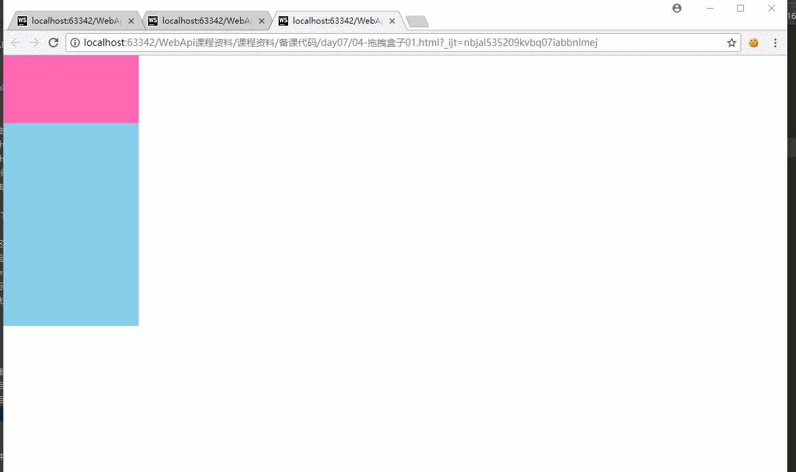
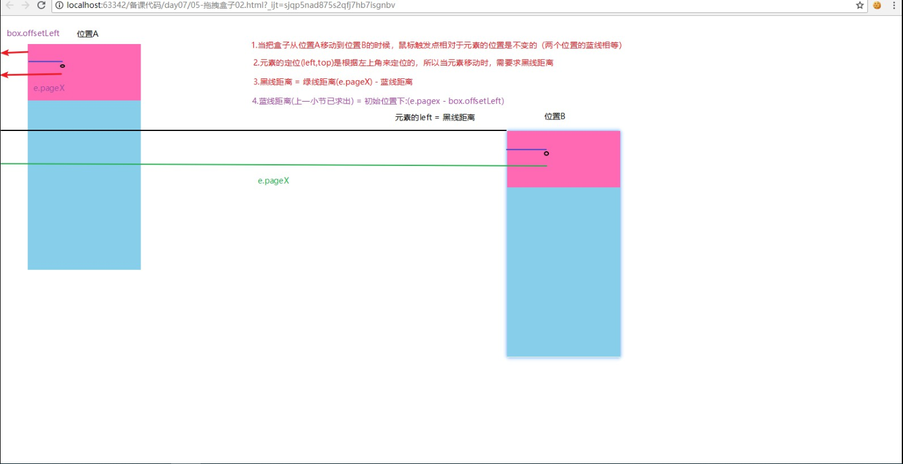
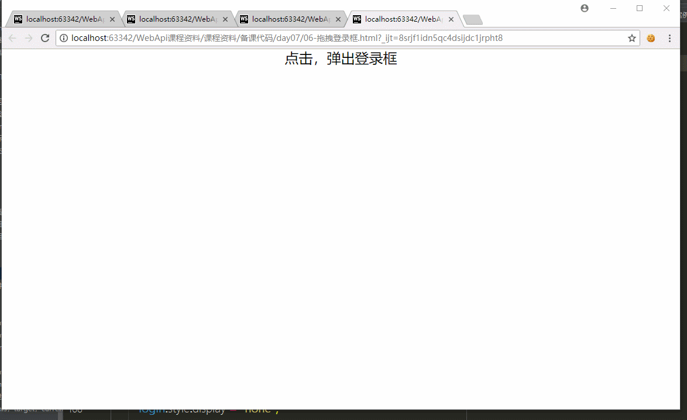
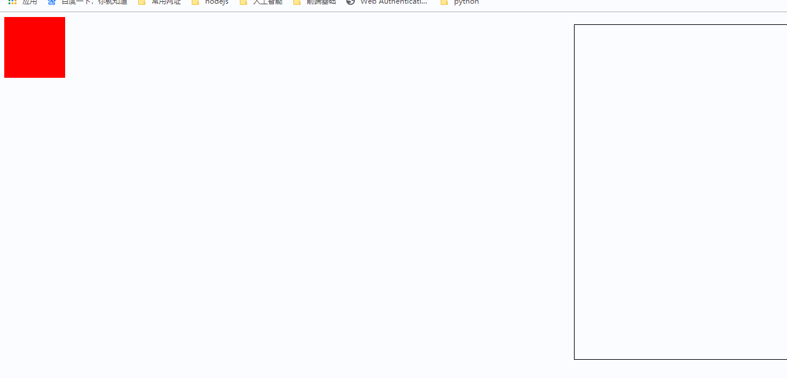
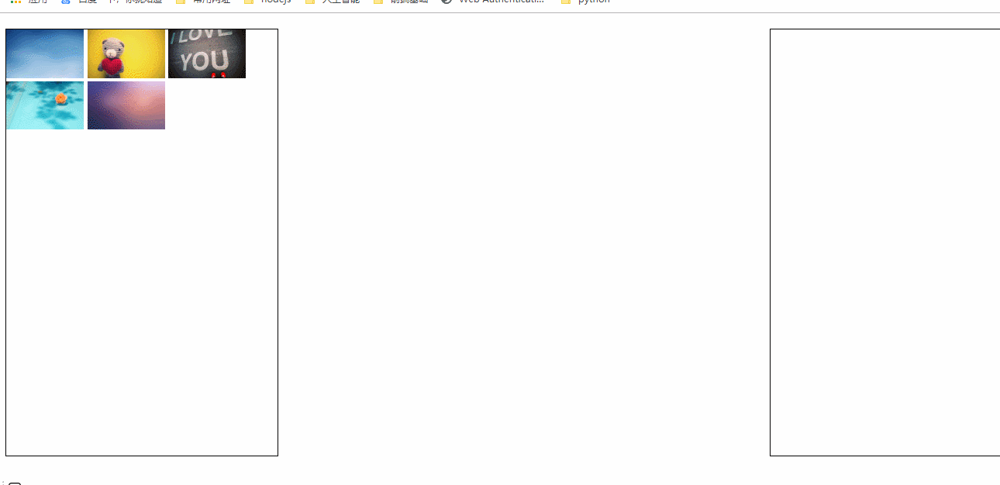

* * * *

# 今日学习任务


* [ ] 1.案例拖拽盒子
  * [ ] (1)拖拽事件流程
  * [ ] (2)拖拽盒子原理
  * [ ] (3)案例：拖拽登陆框
* [ ] 2.h5新增拖拽
  * [ ] (1)新增拖拽属性draggable
  * [ ] (2)拖拽事件
  * [ ] (3)拖拽到盒子中
  * [ ] (4)案例：拖拽图片
  * [ ] (5)案例：拖拽图片预览

# 01-案例：拖拽盒子

## 1.1-拖拽盒子01

 [效果预览](file:///C:/Users/%E5%BC%A0%E6%99%93%E5%9D%A4/Desktop/%E5%BC%A0%E6%99%93%E5%9D%A4%E5%89%8D%E7%AB%AF%E5%A4%87%E8%AF%BE%E8%B5%84%E6%96%99/%E5%85%A8%E5%A4%A9%E6%A8%A1%E5%BC%8F/02-WebApi/%E8%AF%BE%E7%A8%8B%E8%B5%84%E6%96%99/%E5%A4%87%E8%AF%BE%E4%BB%A3%E7%A0%81/day07/13-%E6%8B%96%E6%8B%BD%E7%9B%92%E5%AD%9001.html)




***思路分析***




本小节知识点：鼠标拖拽

* 复习鼠标事件：
  * onclick：鼠标点下去并且弹起来触发（单击一次）
  * ondblclick:鼠标连续点击两次（双击）
  * onmousedown：鼠标按下就触发
  * onmouseup： 鼠标弹起触发
  * onmouseover：鼠标移入
  * onmouseout：鼠标移出
  * onmousemove：鼠标移动
* 鼠标拖拽：（1）先按下 （2）然后移动 （3）最后松开

```html
<!DOCTYPE html>
<html>

<head lang="en">
    <meta charset="UTF-8">
    <title></title>


    <style>
        #father {
            width: 200px;
            height: 400px;
            background-color: skyblue;
            position: absolute;
            top: 0px;
            left: 0px;
        }

        #son {
            width: 200px;
            height: 100px;
            background-color: hotpink;
            cursor: move;
        }
    </style>
</head>

<body>

    <div id="father">
        <div id="son"></div>
    </div>

    <script>

        /* 
        复习鼠标事件
            鼠标单击：onclick  按下+松开 = 单击一次
            鼠标双击：ondblclick
            鼠标移入：onmouseover
            鼠标移出：onmouseout
            鼠标移动：onmousemove
            鼠标按下： onmousedown
            鼠标松开： onmouseup
    
        拖拽事件
            1.鼠标按下 ： 给元素注册
            2.鼠标移动 ： （1）给页面注册  （2）需要在按下的事件处理中注册
            3.鼠标松开 ： 在按下事件处理中注册
        */
        var son = document.getElementById('son');// 与父元素对其 offsetLeft:0
        var father = document.getElementById('father');// 父元素 offsetLeft:到body的距离

        // son.onclick = function(){
        //     console.log('鼠标单击');

        // };

        //1.鼠标按下
        son.onmousedown = function (e) {
            //1级链
            console.log('鼠标按下了');
            //1.鼠标按下：求蓝线 = 红线(e.pageX) - 绿线（father.offsetLeft）
            var x = e.pageX - father.offsetLeft;
            var y = e.pageY - father.offsetTop;
            //2.鼠标移动
            document.onmousemove = function (e) {
                //2级链
                //2.求黑线 = 红线(e.pageX) - 蓝线
                father.style.left = e.pageX - x + 'px';
                father.style.top = e.pageY - y + 'px';
                // console.log('鼠标移动');
                // console.log(e);
            };
            //3.鼠标松开
            //鼠标松开也可以在按下之后注册：因为如果鼠标没有按下，不可能触发松开事件
            son.onmouseup = function () {
                console.log('鼠标松开');
                //移除鼠标移动事件
                document.onmousemove = null;
            };
        };


    </script>
</body>

</html>
```


## 1.2-拖拽盒子02(元素有margin)


```html
<!DOCTYPE html>
<html>

<head lang="en">
    <meta charset="UTF-8">
    <title></title>


    <style>
        #father {
            width: 200px;
            height: 400px;
            background-color: skyblue;
            position: absolute;
            top: 0px;
            left: 0px;
            margin: 50px;
        }

        #son {
            width: 200px;
            height: 100px;
            background-color: hotpink;
            cursor: move;
        }
    </style>
</head>

<body>

    <div id="father">
        <div id="son"></div>
    </div>

    <script>

        /* 
        复习鼠标事件
            鼠标单击：onclick  按下+松开 = 单击一次
            鼠标双击：ondblclick
            鼠标移入：onmouseover
            鼠标移出：onmouseout
            鼠标移动：onmousemove
            鼠标按下： onmousedown
            鼠标松开： onmouseup
    
        拖拽事件
            1.鼠标按下 ： 给元素注册
            2.鼠标移动 ： （1）给页面注册  （2）需要在按下的事件处理中注册
            3.鼠标松开 ： 在按下事件处理中注册
        */
        var son = document.getElementById('son');// 与父元素对其 offsetLeft:0
        var father = document.getElementById('father');// 父元素 offsetLeft:到body的距离

        // son.onclick = function(){
        //     console.log('鼠标单击');

        // };

        /*发现问题：为什么元素添加margin之后，拖拽会有顿闪效果
        分析问题： 元素定位是按照margin左上角来定位
        解决问题： 如果元素有margin，则应该减去margin
        
        */

        //1.鼠标按下
        son.onmousedown = function (e) {
            //1级链
            console.log('鼠标按下了');
            //1.鼠标按下：求蓝线 = 红线(e.pageX) - 绿线（father.offsetLeft）
            var x = e.pageX - father.offsetLeft;
            var y = e.pageY - father.offsetTop;
            //2.鼠标移动
            document.onmousemove = function (e) {
                //2级链
                //2.求黑线 = 红线(e.pageX) - 蓝线
                father.style.left = e.pageX - x - 50 + 'px';
                father.style.top = e.pageY - y -50 + 'px';
                // console.log('鼠标移动');
                // console.log(e);
            };
            //3.鼠标松开
            //鼠标松开也可以在按下之后注册：因为如果鼠标没有按下，不可能触发松开事件
            son.onmouseup = function () {
                console.log('鼠标松开');
                //移除鼠标移动事件
                document.onmousemove = null;
            };
        };


    </script>
</body>

</html>
```

## 1.3-案例：拖拽登陆框


[效果预览](file:///C:/Users/%E5%BC%A0%E6%99%93%E5%9D%A4/Desktop/%E5%BC%A0%E6%99%93%E5%9D%A4%E5%89%8D%E7%AB%AF%E5%A4%87%E8%AF%BE%E8%B5%84%E6%96%99/%E5%85%A8%E5%A4%A9%E6%A8%A1%E5%BC%8F/02-WebApi/%E8%AF%BE%E7%A8%8B%E8%B5%84%E6%96%99/%E5%A4%87%E8%AF%BE%E4%BB%A3%E7%A0%81/day07/15-%E6%A1%88%E4%BE%8B%EF%BC%9A%E6%8B%96%E6%8B%BD%E7%99%BB%E5%BD%95%E6%A1%86.html)====




```html
<!DOCTYPE html>
<html>
<head lang="en">
    <meta charset="UTF-8">
    <title></title>
    <style>
        .login-header {
            width: 100%;
            text-align: center;
            height: 30px;
            font-size: 24px;
            line-height: 30px;
        }

        html, body, ul, li, ol, dl, dt, dd, div, p, span, h1, h2, h3, h4, h5, h6, a {
            padding: 0px;
            margin: 0px;
        }

        .login {
            width: 512px;
            position: absolute;
            border: #ebebeb solid 1px;
            height: 280px;
            left: 50%;
            right: 50%;
            background: #ffffff;
            box-shadow: 0px 0px 20px #ddd;
            z-index: 9999;
            margin-left: -256px;
            margin-top: 140px;
            display: none;
        }

        .login-title {
            width: 100%;
            margin: 10px 0px 0px 0px;
            text-align: center;
            line-height: 40px;
            height: 40px;
            font-size: 18px;
            position: relative;
            cursor: move;
        }

        .login-input-content {
            margin-top: 20px;
        }

        .login-button {
            width: 50%;
            margin: 30px auto 0px auto;
            line-height: 40px;
            font-size: 14px;
            border: #ebebeb 1px solid;
            text-align: center;
        }

        .login-bg {
            width: 100%;
            height: 100%;
            position: fixed;
            top: 0px;
            left: 0px;
            background: #000000;
            opacity: 0.3;
            display: none;
        }

        a {
            text-decoration: none;
            color: #000000;
        }

        .login-button a {
            display: block;
        }

        .login-input input.list-input {
            float: left;
            line-height: 35px;
            height: 35px;
            width: 350px;
            border: #ebebeb 1px solid;
            text-indent: 5px;
        }

        .login-input {
            overflow: hidden;
            margin: 0px 0px 20px 0px;
        }

        .login-input label {
            float: left;
            width: 90px;
            padding-right: 10px;
            text-align: right;
            line-height: 35px;
            height: 35px;
            font-size: 14px;
        }

        .login-title span {
            position: absolute;
            font-size: 12px;
            right: -20px;
            top: -30px;
            background: #ffffff;
            border: #ebebeb solid 1px;
            width: 40px;
            height: 40px;
            border-radius: 20px;
        }
    </style>
</head>
<body>


<div class="login-header">
    <a id="link" href="javascript:void(0);">点击，弹出登录框</a>
</div>

<div id="login" class="login">
    <div id="title" class="login-title">登录会员
        <span>
            <a id="closeBtn" href="javascript:void(0);" class="close-login"> 关闭</a>
        </span>
    </div>

    <div class="login-input-content">
        <div class="login-input">
            <label>用户名：</label>
            <input type="text" placeholder="请输入用户名" name="info[username]" id="username" class="list-input">
        </div>
        <div class="login-input">
            <label>登录密码：</label>
            <input type="password" placeholder="请输入登录密码" name="info[password]" id="password" class="list-input">
        </div>
    </div>
    <div id="loginBtn" class="login-button"><a href="javascript:void(0);" id="login-button-submit">登录会员</a></div>
</div>

<div id="bg" class="login-bg"></div>
<script src="common.js"></script>

<script>

    //找到弹出窗口的a标签
    var open = document.getElementById("link");//点击弹出登录窗口
    //找到整个登录窗口
    var login = document.getElementById("login");//需要移动
    //找到背景阴影
    var bg = document.getElementById("bg");//弹出登录窗后需要修改颜色
    //找到登录的标题部分
    var title = document.getElementById("title");//需要拖拽


    //a标签点击事件
    open.onclick = function () {

        login.style.display = "block";
        bg.style.display = "block";
    }

    //关闭按钮点击事件
    document.getElementById("closeBtn").onclick = function () {

        login.style.display = "none";
        bg.style.display = "none";
    };

    //title按下事件
    title.onmousedown = function (e) {

        e = e || window.event;

        var x = e.pageX - login.offsetLeft;
        var y = e.pageY - login.offsetTop;

        //页面添加鼠标移动事件
        document.onmousemove = function (event) {

            event = event || window.event;

            //login大盒子的margin-left: -256px，    margin-top: 140px
            //1 - -256 = 257  减去负数就相当于加这个数 (负负得正)
            login.style.left = getPagePoint(event).pageX - x + 256 + "px";
            login.style.top = getPagePoint(event).pageY - y - 140 + "px";
        }
    }

    title.onmouseup = function () {

        document.onmousemove = null;
    }

</script>

</body>
</html>
```


# 02-h5新增拖拽


## 1.1-h5新增拖拽

* 注意点
  * 设置`draggable="true"`即可实现元素拖拽
  * img标签的draggable默认值就是true，无需设置

```html
<!DOCTYPE html>
<html lang="en">
<head>
    <meta charset="UTF-8">
    <meta name="viewport" content="width=device-width, initial-scale=1.0">
    <meta http-equiv="X-UA-Compatible" content="ie=edge">
    <title>Document</title>
    <style>
        #box{
             width: 100px;
             height: 100px;
             background-color: #f00;
             /* position: absolute; */
         }
    </style>
</head>
<body>
    <div id="box" draggable="true"></div>
    <!-- img标签默认的draggable就是true，可以不用设置 -->
    
</body>
</html>
```


## 1.2-拖拽事件

​	1.ondragstart   ：拖拽开始
​        2.ondrag        ：拖拽中(不断触发)
​        3.ondragend     ：拖拽结束

```html
<!DOCTYPE html>
<html lang="en">

<head>
    <meta charset="UTF-8">
    <meta name="viewport" content="width=device-width, initial-scale=1.0">
    <meta http-equiv="X-UA-Compatible" content="ie=edge">
    <title>Document</title>
    <style>
        #box {
            width: 100px;
            height: 100px;
            background-color: #f00;
            position: absolute;
        }
    </style>
</head>

<body>
    <div id="box" draggable="true"></div>

    <script>
        /* h5新增拖拽事件
        1.ondragstart   ：拖拽开始
        2.ondrag        ：拖拽中(不断触发)
        3.ondragend     ：拖拽结束
        */
        var box = document.getElementById('box');

        //1.拖拽开始
        box.ondragstart = function () {
            console.log('鼠标按下并第一次移动，开始拖拽');

        };

        //鼠标按下：求出蓝线距离 = 红线 - 绿线
        var x = 0;
        var y = 0;
        box.onmousedown = function (e) {
            x = e.pageX - box.offsetLeft;
            y = e.pageY - box.offsetTop;
        }

        //2.正在拖拽
        box.ondrag = function (e) {
            console.log(e.pageX, e.pageY);

            console.log('拖拽中');


        };

        //3.拖拽结束
        box.ondragend = function (e) {
            console.log('鼠标松开，拖拽结束');
            box.style.left = e.pageX - x + "px";
            box.style.top = e.pageY - y + "px";
        }
    </script>
</body>

</html>
```


## 1.3-容器盒子事件

跟容器相关的拖拽事件

​            ondragenter：有元素被  拖拽到   元素范围内就触发

​            ondragleave：有元素被  拖离    元素范围内就触发

​            ondragover：鼠标移动时，元素在我的范围内就会触发（非常频繁）

​            ondrop: 鼠标松开时，元素还在我的范围内就会触发

​                \* 注意点：这个事件默认不会触发，需要配合ondragover使用

```html
<!DOCTYPE html>
<html lang="en">
<head>
    <meta charset="UTF-8">
    <meta name="viewport" content="width=device-width, initial-scale=1.0">
    <meta http-equiv="X-UA-Compatible" content="ie=edge">
    <title>Document</title>

    <style>
        .box{
            width: 100px;
            height: 100px;
            background-color: #f00;
        }

        .container{
            width: 400px;
            height: 550px;
            border: 1px solid #000;
            position: absolute;
            right:20px;
            top:20px;
        }
    </style>
</head>
<body>
    <div class="box" draggable="true"></div>
    <div class="container"></div>

    <script>

        /*跟容器相关的拖拽事件
            ondragenter：有元素被  拖拽到   元素范围内就触发
            ondragleave：有元素被  拖离    元素范围内就触发
            ondragover：鼠标移动时，元素在我的范围内就会触发（非常频繁）
            ondrop: 鼠标松开时，元素还在我的范围内就会触发
                * 注意点：这个事件默认不会触发，需要配合ondragover使用
        
         */
        //1.获取元素
        //找到box
        var box = document.querySelector('.box');
        //找container
        var container = document.querySelector('.container');


        //1.ondragenter
        container.ondragenter = function(){
            console.log('有元素被拖拽进来了');
            
        };
        
        //2.ondragleave
        container.ondragleave = function(){
            console.log('元素离开了');
            
        };

        //3.ondragover
        //由于这个事件触发非常的频繁，影响性能。所以需要阻止默认事件
        container.ondragover = function(e){
            e.preventDefault();
            // console.log('鼠标移动时，元素在我的范围内');
            
        };

        //4.ondrop
        //这个事件默认不会触发，需要配合ondragover使用
        // 给容器盒子注册ondragover事件，然后阻止这个事件的默认行为 e.preventDefault()
        container.ondrop = function(){
            console.log('11111');
            console.log('鼠标松开时，元素还在我的范围内');
            
        };
    </script>
</body>
</html>
```

## 1.4-拖拽到盒子两种实现方式

[效果预览](file:///C:/Users/张晓坤/Desktop/张晓坤前端备课资料/AB模式/03-WebApi/课程资料/备课代码/day09/02-h5新增的拖拽/04-拖拽盒子两种方式.html)


* 第一种开关思想+三个事件（ondragenter + ondragleave + ondragend）
  * 1.声明开关表示元素是否被拖入到容器盒子中
  * 2.验证假设：如果触发容器盒子ondragenter就是true,触发ondragleave就是false
  * 3.拖拽结束后ondragend:根据开关结果实现需求
  * ·`注意点：需要给容器盒子注册ondragover并阻止默认事件`
* 第二种方式：ondrop



```html
<!DOCTYPE html>
<html lang="en">
<head>
    <meta charset="UTF-8">
    <meta name="viewport" content="width=device-width, initial-scale=1.0">
    <meta http-equiv="X-UA-Compatible" content="ie=edge">
    <title>Document</title>

    <style>
        .box{
            width: 100px;
            height: 100px;
            background-color: #f00;
        }

        .container{
            width: 400px;
            height: 550px;
            border: 1px solid #000;
            position: absolute;
            right:20px;
            top:20px;
        }
    </style>
</head>
<body>
    <div class="box" draggable="true"></div>
    <div class="container"></div>

    <script>

        /*跟容器相关的拖拽事件
            ondragenter：
            ondragleave：
            ondragover：
            ondrop: 
        
         */
        //获取元素
        //找到box
        var box = document.querySelector('.box');
        //找container
        var container = document.querySelector('.container');

        //第一种方式：  开关思想+三个事件（ondragenter + ondragleave + ondragend）

       /*  //1.声明开关表示元素是否被拖入到容器盒子钟
        var isOk = false;
        //2.验证假设：如果触发ondragenter就是true,触发ondragleave就是false
        container.ondragenter = function(){
            isOk = true;
            console.log('进来了');
            
        };
        container.ondragleave = function(){
            isOk = false;
            console.log('离开了');
            
        };
        //3.拖拽结束后ondragend:根据开关结果实现需求
        box.ondragend = function(){
            if(isOk){
                container.appendChild(box);
            };
        }; */

        /* 
        注意点：一般容器拖拽事件需要注册ondragover并且阻止事件默认行为
            例如：一旦鼠标松开，默认会先触发ondragleave事件，阻止了ondragover默认事件就可以解决。
         */
        container.ondragover = function(e){
            e.preventDefault();
        };

        /*第二种方式：ondrop
            注意点：默认ondrop不会触发，需要注册ondragover并且阻止事件默认行为
        
         */
         container.ondrop = function(){
             container.appendChild(box);
         };


    </script>
</body>
</html>
```


## ==1.5-案例：拖拽图片==

[效果预览](file:///C:/Users/%E5%BC%A0%E6%99%93%E5%9D%A4/Desktop/%E5%BC%A0%E6%99%93%E5%9D%A4%E5%89%8D%E7%AB%AF%E5%A4%87%E8%AF%BE%E8%B5%84%E6%96%99/AB%E6%A8%A1%E5%BC%8F/03-WebApi/%E8%AF%BE%E7%A8%8B%E8%B5%84%E6%96%99/%E5%A4%87%E8%AF%BE%E4%BB%A3%E7%A0%81/day09/02-h5%E6%96%B0%E5%A2%9E%E7%9A%84%E6%8B%96%E6%8B%BD/05-%E6%A1%88%E4%BE%8B%EF%BC%9A%E6%8B%96%E6%8B%BD%E5%9B%BE%E7%89%87.html)




```html
<!DOCTYPE html>
<html lang="en">
<head>
    <meta charset="UTF-8">
    <meta name="viewport" content="width=device-width, initial-scale=1.0">
    <meta http-equiv="X-UA-Compatible" content="ie=edge">
    <title>Document</title>
    <style>
        div{
            width: 350px;
            height: 550px;
            border: 1px solid #000;
            position: absolute;
            top:20px;
        }

        .right{
            right:20px;
        }

        img{
            width: 100px;
        }
    </style>
</head>
<body>
    <div class="left">
        
        
        
        
        
    </div>
    <div class="right"></div>

    <script>
        //1.获取元素
        
        var right = document.querySelector('.right');//右边容器
        var left = document.querySelector('.left');//左边容器
        var imgList = document.querySelectorAll('img');//图片列表

        //2.注册事件
        // 声明变量保存当前正在拖拽的图片
        var currentImg = null;

        //2.1 图片拖拽事件
        // 遍历所有的img，给它们加开始拖拽事件
        for(var i = 0; i < imgList.length; i++){
            imgList[i].ondragstart = function(){
                //谁开始拖拽，就把谁存到变量里
                currentImg = this;
            };
        };

        //2.2 右边容器拖拽事件
        right.ondragover = function(e){
            e.preventDefault();
        };

        right.ondrop = function(){
            // console.log('...');
            // 变量里存的是谁，就把谁放进来
            right.appendChild(currentImg);
        };

        //2.3 左边容器拖拽事件
        left.ondragover = function(e){
            e.preventDefault();
        };
        
        left.ondrop = function(){
            //变量里存的是谁，那么就把谁放进来
            left.appendChild(currentImg);
        }
    </script>
</body>
</html>
```


## 1.6-案例：拖拽图片预览

[效果预览](file:///C:/Users/张晓坤/Desktop/张晓坤前端备课资料/AB模式/03-WebApi/课程资料/备课代码/day09/02-h5新增的拖拽/06-案例：文件拖拽预览.html)


```html
<!DOCTYPE html>
<html lang="en">
<head>
    <meta charset="UTF-8">
    <meta name="viewport" content="width=device-width, initial-scale=1.0">
    <meta http-equiv="X-UA-Compatible" content="ie=edge">
    <title>Document</title>
    <style>

        /* body默认高度为0，设置宽度100%和页面(document)一样高 */
        html,body{
            height: 100%;
            overflow: hidden;
        }

        body{
            border:5px dashed black;
        }
    </style>
</head>
<body>
    <h1>拖拽图片到虚线内</h1>

    <script>

        //1.给body注册拖拽结束事件

        document.body.ondragover = function(e){
            // 这里的阻止只是为了让ondrop能够得到触发
            e.preventDefault();
        };
        document.body.ondrop = function(e){
            // console.log('....');
            /*注意点：默认情况下，浏览器会自动打开新页面来加载拖入的文件
              解决方案：使用 e.preventDefault(); 阻止默认行为
             */
            //1.阻止浏览器默认打开我们拖进来的文件的行为
            e.preventDefault();
            //2.通过事件对象  e.dataTransfer.files[0] 获取文件
            //e.dataTransfer.files ： 是一个数组，存储本次拖入的所有文件
             console.log(e.dataTransfer.files);
            //3.将拖入文件生成临时url路径，赋值给页面元素显示
            var url = URL.createObjectURL(e.dataTransfer.files[0]);
            console.log(url);
            document.body.style.background= "url(" + url + ")";
        };
    </script>
</body>
</html
```

