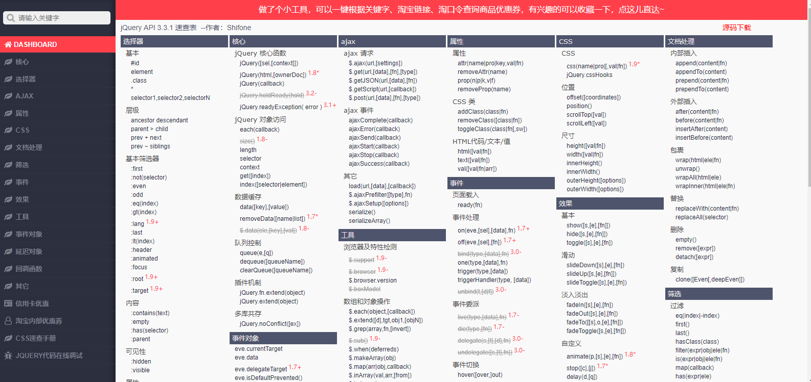

#  今日学习任务


* [ ] ==1.课程介绍：jQuery入门==
* [ ] 2.语法：查询操作
  * [ ] a.查元素：选择器
  * [ ] b.查属性
    * [ ] css样式属性
    * [ ] html属性
    * [ ] 表单元素属性
* [ ] 3.案例
  * [ ] 开关灯
  * [ ] 隔行变色(熟悉juqery选择器)
  * [ ] 页面换肤(html熟悉操作)
  * [ ] 点餐选择框(表单元素属性操作)


# 1-课程介绍:jQuery入门


## 1.1-jQuery介绍


* 1.jQuery是什么？
  * jQuery是一个第三方框架(库/包)
    * 框架：别人写好的js代码文件（其实就是以前的common.js加强版）
    * 框架好处：复制粘贴提高代码效率

* 2.jQuery是干啥的？
  * DOM操作（主要）
  * 其他功能

* 3.如何学习jQuery
  * 官网传送门:<https://jquery.com/>
  * jQuery文件下载:<https://code.jquery.com/jquery-1.12.4.min.js>
  * 官方文档传送门：<http://jquery.cuishifeng.cn/index.html>
  * 对比法学习（同样的功能，原生与jQuery对比）
    * a.先复习DOM原生语法
    * b.介绍jQuery语法

* 官网一些介绍

  * jQuery是什么?

    ​       1.官方网站:<https://jquery.com/>

    ​            jQuery是一个快速、小巧且功能丰富的JavaScript库。

    ​           它使HTML文档遍历和操作、事件处理、动画和Ajax等操作变得更加简单，

    ​            并具有易于使用的API，可以在多种浏览器中工作。结合了多功能性和可扩展性，

    ​            jQuery改变了数百万人编写JavaScript的方式。

    ​       2.其实就是一个加强版的common.js

    ​            jQuery其实就是一个js文件，里面封装了一大堆的方法方便我们的开发，

    ​            因此我们学习jQuery，其实就是学习jQuery这个js文件中封装的一大堆方法。

    ​      3.jQuery设计的宗旨是'Write Less，Do More'，即倡导写更少的代码，做更多的事情。

    ​         它封装JavaScript常用的功能代码，提供一种简便的操作，

    ​         优化HTML文档操作、事件处理、动画设计和Ajax交互。

    ​         jQuery的核心特性可以总结为：具有独特的链式语法和短小清晰的多功能接口；

    ​         具有高效灵活的css选择器，并且可对CSS选择器进行扩展；

    ​         拥有便捷的插件扩展机制和丰富的插件。jQuery兼容各种主流浏览器。

    ​      4.极大地简化了 JavaScript 编程。


* jQuery的方法特别多，课堂上不可能每一个介绍。老师主要教大家jQuery实际开发中常用的方法，并且通过大量案例熟悉这些api的应用场景
  * 其他的都是不常用的，感兴趣的可以课后自己学习




* 4.jQuery优点
  * a.入口函数可以写多个
  * b.代码简洁(隐式迭代)
  * c.api简单好记
  * d.浏览器兼容性好
  * e.容错率高(前面代码有问题，也不影响后面代码执行)：只是部分1

```html
<!DOCTYPE html>
<html lang="en">
<head>
    <meta charset="UTF-8">
    <title>Title</title>
    <style>
        div {
            height: 100px;
            margin-top: 10px;
            background-color: #ccc;
        }
    </style>

    <script src="jquery-1.12.4.js"></script>
    <script>
        /*1.原生js的优缺点
            优点：
                a.性能好：浏览器直接执行，没有中间环节
                b.便于维护
            缺点：
                a.入口函数只能一个：如果多个则后者覆盖前者
                b.代码冗余
                c.api名字过长：不便记忆
                d.存在兼容性问题：有的api某些浏览器不支持，开发中的硬伤
                e.容错率低：前面代码有问题，影响后面代码执行

         2.jQuery的优点
                a.入口函数可以多个：依次执行
                b.代码简洁：jQuery有一个隐式迭代的特点（偷偷的遍历数组）
                c.api简洁好记
                d.兼容浏览器：jQuery已经帮我们处理好了浏览器兼容问题，我们只管使用不用考虑浏览器兼容性问题
                e.容错率高：如果前面代码有问题，也不影响后面代码执行
         */

        
        //需求：（1）点击设置边框：给每一个div设置border  （2）点击设置文本，给每一个div设置文本
        //1.以前的做法
        //dom入口函数：页面所有内容（包含外部资源路径）加载完成
        window.onload = function (  ) {
            //(1)获取元素
            var divList = document.getElementsByTagName('div');
            var btn1 = document.getElementById('btn1');
            var btn2 = document.getElementById('btn2');
            //(2)设置边框事件
            btn1.onclick = function (  ) {
                for(var i = 0;i<divList.length;i++){
                    divList[i].style.border = '1px solid red';
                };
            };

            //(3)设置文本事件
            btn2.onclick = function (  ) {
                for(var i = 0;i<divList.length;i++){
                    divList[i].textContent = '我是设置的文本';
                };
            }
        };

        //原生js入口函数只能一个。后者覆盖前者
        // window.onload = function (  ) {
        //     console.log ( 1111 );
        // };

        //2.使用jQuery
        //jQuery入口函数
        $(document).ready(function (  ) {
            //(1)设置边框事件
            $('#btn1').click(function (  ) {
                $('div').ccs('border','1px solid red');
            });
            //(2)设置文本事件
            $('#btn2').click(function (  ) {
                $('div').text('我是设置的文本');
            });
            console.log ( 111111 );
        });

        //jQuery入口函数可以多个，依次执行
        $(document).ready(function (  ) {
            console.log ( 2222 );
        });
    </script>
</head>
<body>

<input type="button" value="设置边框" id="btn1"/>
<input type="button" value="设置文本" id="btn2"/>
<div></div>
<div></div>
<div></div>

</body>
</html>
```


## 1.2-jQuery入门


* 1.如何使用jQuery
  * a.引入jQuery文件.
    * `<script src="jquery-1.12.4.js"></script>`
  * b.写一个入口函数.
  * c.利用选择器(id选择器/标签选择器....)选到你想要操作的元素.
  * d.找到元素后,就使用jQuery中提供的那些方法来操作他(设置样式/设置文本/设置事件...);


```html
<!DOCTYPE html>
<html lang="en">
<head>
    <meta charset="UTF-8">
    <title>Title</title>

</head>
<body>

<div></div>
<div></div>
<div></div>

<!--1.引入jquery-->
<script src="jquery-1.12.4.js"></script>
<script>
    /*使用jQuery的步骤.
    1.引入jQuery文件.
    2.写一个入口函数.
    3.利用选择器(id选择器/标签选择器....)选到你想要操作的元素.
    4.找到元素后,就使用jQuery中提供的那些方法来操作他(设置样式/设置文本/设置事件...);
   */

    //2.入口函数
    $(document).ready(function (  ) {
       //3.利用选择器获取元素
        console.log ( $ ( "div" ) );//标签选择器，得到一个伪数组
        //4.操作元素
        $('div').css('width','100px');//隐式迭代给数组中每个元素设置宽度
        $('div').css('height','100px');
        $('div').css('backgroundColor','green');//  background-color和backgroundColor都可以
        $('div').css('border','10px solid pink');
    });
</script>
</body>
</html>
```


## 1.3-jQuery不同版本的区别介绍(了解)

```html
<!DOCTYPE html>
<html lang="en">
<head>
    <meta charset="UTF-8">
    <title>Title</title>
</head>
<body>

<script>
    /*jquery官网下载jquery文件：<https://jquery.com/>

    1.jQuery版本有很多，分为1.x 2.x 3
        1.x版本：能够兼容IE678浏览器  不更新
        2.x版本：不兼容IE678浏览器    不更新
        3.x版本：不兼容IE678，更加的精简（在国内不流行，因为国内使用jQuery的主要目的就是兼容IE678）  更新中
        国内多数网站还在使用1.x的版本

    2.每一个版本的jquery文件,都有压缩和未压缩版的.
        压缩版推荐实际开发/生产环境中使用:代码经过压缩，文件体积小
        未压缩版平时开发学习环境中使用：代码没有压缩，方便查阅源代码
</script>
</body>
</html>
```


## ==1.4-jQuery的入口函数==


```html
<!DOCTYPE html>
<html lang="en">
<head>
    <meta charset="UTF-8">
    <title>Title</title>
</head>
<body>

<script src="jquery-1.12.4.js"></script>
<script>
    //1.jQuery的入口函数：两种写法
        //第一种写法:
        $(document).ready(function () {
            console.log ( 11111 );
        });
        //第二种写法:和第一种写法作用完全一致
        $(function () {
            console.log ( 2222 );
        });


    /*2.jQuery的入口函数和原生js的入口函数有什么不同点:
        a.原生js的window.onload入口函数不能写多个; 但是jQuery的入口函数可以写多个.
        b.执行时机不同:
            jQuery的入口函数等待dom树加载完毕后执行 ;
            原生js的入口函数要等待页面上所有的资源(dom树,外部连接的js/css文件/外部连接的图片)加载完毕后执行.
    */

    $(function () {
        alert('我是jQuery的入口函数');
    });

    window.onload = function () {
        alert('我是原生js的入口函数');
    };

</script>
</body>
</html>
```


## ==1.5-DOM对象与jQuery对象区别(非常重要)==


```html
<!DOCTYPE html>
<html lang="en">
<head>
    <meta charset="UTF-8">
    <title>Title</title>
    <style>
        .one {
            width: 100px;
            height: 100px;
            background-color: green;
        }
    </style>
</head>
<body>

    <div class="one" id="box"></div>
    <div class="one" ></div>

<script src="jquery-1.12.4.js"></script>
<script>
    /*1.DOM对象：使用js原生的api获取的元素对象
      2.jQuery对象：使用jquery的方法   $('选择器')   获取的对象
            *** jquery对象本质：是一个伪数组（伪数组是一个对象，只有数组三要素，没有数组api） ***
      3.两者区别：jQuery对象不能使用DOM对象的成员，DOM对象不能使用jQuery对象的成员

      4.jQuery对象与DOM对象之间的转换
            jQuery对象转DOM对象：两种方式
                a.利用伪数组的下标取值 :  jquery对象[下标]
                b.使用jquery自己的api:  jquery对象.get(下标)
           DOM对象转jQuery对象：一种方式
                a.语法：$(dom对象)
     */
    //1.dom对象：使用js原生的api获取的元素对象

    //1.1 getElementById:获取的单个元素对象 | null
    var box = document.getElementById('box');
    console.log ( box );
    //1.2 getElementsByClassName:获取的是一个伪数组
    var oneList = document.getElementsByClassName('one');
    console.log ( oneList );

    //1.3 dom对象只能使用dom中的api操作，不能使用jquery中的api
    box.innerText = '传智播客';//正确

   // box.text('传智播客');//程序报错  box.text is not a function

    //2.jquery对象：使用jquery的方法   $('选择器')   获取的对象
    /*细节： 开发中为了区分dom对象与jquery对象，一般jquery对象名前面会加上一个$ */
    var $box = $('#box');
    console.log ( $box );

    var $oneList = $('.one');
    console.log ( $oneList );

   // $oneList.push(10);//报错  伪数组不能调用数组方法
    $box.innerText = '黑马程序员';// 无效，jquery对象不能使用dom中的api
    $box.text('黑马程序员');// 有效，jquery对象只能使用jquery中的api

    //3.jquery对象与dom对象之间的转换

    //3.1 jquery对象转dom对象：两种方式

    //a.利用伪数组的下标取值
    //语法： jquery对象[下标]
    var box1 = $box[0];
    console.log ( box1 );

    //b.使用jquery自己的api
    //语法：jquery对象.get(下标)
    var one1 = $oneList.get(1);
    console.log ( one1 );

    //3.2 dom对象转jquery对象 : 唯一的方式
    // 语法：     $(dom对象)
    var $box1 = $(box);
    console.log ( $box1 );


</script>
</body>
</html>
```


## 1.5-$函数介绍


```html
<!DOCTYPE html>
<html lang="en">
<head>
    <meta charset="UTF-8">
    <title>Title</title>
</head>
<body>

<div id="box">黑马程序员</div>
<script src="jquery-1.12.4.js"></script>
<script>
    /*
    1. $本质是一个函数对象:$与jQuery完全等价
    2. $函数在使用时，参数不同功能也不同
     */

    //1.$本质是一个函数对象:与jQuery完全等价
    console.log ( $ === jQuery );//true
   //入口函数
    $(function (  ) {
        console.log ( 111 );
    });

    jQuery(function (  ) {
        console.log ( 222 );
    });

    //2.$函数在使用时参数不同作用也不同

    //2.1 参数是匿名函数（回调函数）：相当于入口函数
    $(function (  ) {
        console.log ( "document加载完毕" );
    });

    //2.2 参数是字符串:就是一个选择器获取元素
    console.log ( $ ( "#box" ) );

    //2.3 参数是dom对象：作用是将dom对象转成jquery对象
    // $(dom对象)
</script>
</body>
</html>
```


# 2-语法：查询操作

## 2.1-基本选择器

| 名称       | 用法               | 描述                                 |
| ---------- | ------------------ | :----------------------------------- |
| ID选择器   | $('#id');          | 获取指定ID的元素                     |
| 类选择器   | $('.class');       | 获取同一类class的元素                |
| 标签选择器 | $('div');          | 获取同一类标签的所有元素             |
| 并集选择器 | $('div,p,li');     | 使用逗号分隔，只要符合条件之一就可。 |
| 交集选择器 | $('div.redClass'); | 获取class为redClass的div元素         |

* 总结：跟css的选择器用法一模一样。

```html
<!DOCTYPE html>
<html lang="en">

<head>
    <meta charset="UTF-8">
    <title>Title</title>
</head>

<body>
    <div>
        <ul>
            <li id="slg">国共联合司令官</li>
        </ul>
        <!-- 独立团 -->
        <ul id="dlt">
            <li class="tz">独立团团长-李云龙</li>
            <li>狙击手</li>
            <li>士兵</li>
            <li>士兵</li>
            <li>士兵</li>
            <li class="hf">伙夫</li>
            <li class="wsy">卫生员</li>
        </ul>
        <!-- 358团 -->
        <ul id="t358">
            <li class="tz">358团团长-楚云飞</li>
            <li>狙击手</li>
            <li class="nj">士兵</li>
            <li>士兵</li>
            <li>士兵</li>
            <li class="hf">伙夫</li>
            <li class="wsy">卫生员</li>
        </ul>
    </div>
    <div>
        <p class="nj">老百姓</p>

        <p class="nj">老百姓</p>

        <p>老百姓</p>

        <p>老百姓</p>

        <p>老百姓</p>

        <p>老百姓</p>

        <p>老百姓</p>
    </div>

    <script src="jquery-1.12.4.js"></script>
    <script>
        //入口函数：DOM树加载完毕
        $(function(){
            /* 基本选择器 ：与css中的选择器一样

            id选择器：     $('#id')
            类选择器：     $('.类名')
            标签选择器：   $('标签名')
            并集选择器：   $('.box1,.box2')
            交集选择器：   $('li.current')

             */

            //1.国共抗战开始，司令官讲话（最大的官，字体40px）
            //id选择器：  $('#id')
            $('#slg').css('fontSize','40px');

            //2.司令讲完了，团长开始讲话（团长比司令小，字体36px）
            //类选择器：  $('.类名')
            //jQuery会自动对伪数组进行隐式迭代(偷偷遍历)
            $('.tz').css('fontSize','36px');

            //3.团长打完鸡血，开始全军出击!!
            //标签选择器: $('标签名')
            $('li').css('backgroundColor','red');

            //4.上完战场后，有些士兵背着锅（伙夫），有些士兵背着药箱（卫生员），没有战斗力要退到后方
            //但是伙夫和卫生员也想着帮忙为抗日做贡献，颜色改成蓝色
            //并集选择器： $('选择器1,选择器2')
            $('.wsy,.hf').css('backgroundColor','skyblue');

            //5.打了几场之后没赢过，为什么呢？ 因为国共联合军中出现了汉奸。
            //现在要把汉奸找出来，并且不能打扰老百姓
            //交集选择器: $(选择器1选择器2)  注意：两个选择器中间没有空格
            $('li.nj').css('backgroundColor','green');
        });
        
    </script>
</body>

</html>
```


## 2.2-层次选择器

| 名称       | 用法          | 描述                                                        |
| ---------- | ------------- | :---------------------------------------------------------- |
| 子代选择器 | $('ul > li'); | 使用-号，获取儿子层级的元素，注意，并不会获取孙子层级的元素 |
| 后代选择器 | $('ul li');   | 使用空格，代表后代选择器，获取ul下的所有li元素，包括孙子等  |

* 跟CSS的选择器一模一样。

```html
<!DOCTYPE html>
<html lang="en">

<head>
    <meta charset="UTF-8">
    <title>Title</title>
</head>

<body>
    <div id="father">爷爷
        <div class="son">
            <p>大表哥</p>
            <p>二表哥</p>
            <p>三表哥</p>
        </div>
        <div class="son">
            <p>我</p>
        </div>
        <p>小姑</p>
    </div>

    <script src="jquery-1.12.4.js"></script>
    <script>
        //入口函数：DOM树加载完毕
        $(function(){
            /* 层次选择器： 与css一样

            子代选择器： $(div>p)    选中id为father的这个div所有的子代p(第一代)
            后代选择器： $(div>p)    选中id为father的这个div所有的后代p
             */

             //需求1：找到小姑
             console.log($('#father>p'));
             //需求2：找到所有的子女
             console.log($('#father p')); 
        });
        
    </script>
</body>

</html>
```


## 2.3-过滤选择器

* 这类选择器都带冒号:

| 名称         | 用法                               | 描述                                                        |
| ------------ | ---------------------------------- | :---------------------------------------------------------- |
| :eq（index） | $('li:eq(2)').css('color', 'red'); | 获取到的li元素中，选择索引号为2的元素，索引号index从0开始。 |
| :odd         | $('li:odd').css('color', 'red');   | 获取到的li元素中，选择索引号为奇数的元素                    |
| :even        | $('li:even').css('color', 'red');  | 获取到的li元素中，选择索引号为偶数的元素                    |

```html
<!DOCTYPE html>
<html lang="en">
<head>
    <meta charset="UTF-8">
    <title>Title</title>
</head>
<body>
    <ul>
        <li>我是第1个li元素</li>
        <li>我是第2个li元素</li>
        <li>我是第3个li元素</li>
        <li>我是第4个li元素</li>
        <li>我是第5个li元素</li>
        <li>我是第6个li元素</li>
        <li>我是第7个li元素</li>
        <li>我是第8个li元素</li>
        <li>我是第9个li元素</li>
        <li>我是第10个li元素</li>
    </ul>

    <script src="./jquery-1.12.4.js"></script>
    <script>
        /*
        1.过滤选择器：jQuery中独有的选择器
        2.语法规则：  $('选择器:过滤规则')
        3.示例
            odd：下标为奇数
            even:下标为偶数
            eq(num):下标 = num
            gt(num):下标 > num
            lt(num):下标 < num
        */

        //1.选中下标为奇数行 li元素
        $('li:odd').css('backgroundColor','green');
        

        //2.选中下标为偶数行 li元素
        $('li:even').css('backgroundColor','yellow');

        //3.选中第一行和第二行
        $('li:eq(0)').css('backgroundColor','pink');
        $('li:eq(1)').css('backgroundColor','pink');
        //上面代码也可以这样写.  好处：可以取出变量中存储的下标值
        var idx = 1;
        console.log($('li').eq(idx));
        

        //4.选中最后一行
        // $('li:eq(9)').css('backgroundColor','pink');
        $('li:last').css('backgroundColor','hotpink'); 
    </script>
</body>
</html>
```


## 2.4-css属性操作


```html
<!DOCTYPE html>
<html lang="en">
<head>
    <meta charset="UTF-8">
    <title>Title</title>
    <style>
        .one{
            height: 200px;
            background-color: pink;
            margin-top: 10px;
        }

        #box {
            border: 1px solid red;
        }

    </style>
    <script src="jquery-1.12.4.js"></script>
</head>
<body>
<button id="btn1">获取样式属性</button>
<button id="btn2">设置样式属性</button>
<div id="box" class="one" style="width: 100px"></div>
<div class="one" style="width: 200px"></div>
<div class="one" style="width: 300px"></div>

<script>
    /*本小节知识点：样式操作 css()方法
        1.获取css样式：  jq对象.css('属性名')
        2.设置css样式
            a.设置一个属性 ： jq对象.css('属性名',属性值)
            b.设置多个属性 ： jq对象.css({属性名:属性值})  以对象的形式传参

       3.总结
            a.获取操作：多个元素，只会返回第一个元素的值
            b.设置操作：多个元素，会给所有元素设置相同值（隐式迭代）
     */

    //1.获取css样式
    $('#btn1').click(function (  ) {
        //1.1 无论是行内行外都可以获取（类似于window.getComputedStyle兼容性封装）
        console.log ( $ ( "#box" ).css ( "background-color" ) );//rgb(255, 192, 203)
        console.log ( $ ( "#box" ).css ( "backgroundColor" ) );//rgb(255, 192, 203)
        console.log ( $ ( "#box" ).css ( "width" ) );//100px
        console.log ( $ ( "#box" ).css ( "height" ) );//100px
        console.log ( $ ( "#box" ).css ( "border" ) );// IE中需要写全具体的样式，否则获取的undefined
        console.log ( $ ( "#box" ).css ( "border-top-width" ) );

        //1.2 如果jq对象有多个元素，则默认获取的是第一个元素的css样式
        console.log ( $ ( ".one" ).css ( "width" ) );//100px

    });


    //2.设置css样式
    $('#btn2').click(function (  ) {
        //2.1 设置一个属性
        $('#box').css('backgroundColor','red');
        //2.2 设置多个属性
        $('#box').css({
            border:'10px solid pink',
            height:'100px',
            backgroundColor:'yellow'
        });

        //2.3 如果是多个元素，则会全部设置（隐式迭代）
        $('.one').css({
            border:'10px solid purple'
        });
    });

</script>
</body>
</html>
```


## 2.5-html属性操作


```html
<!DOCTYPE html>
<html lang="en">
<head>
    <meta charset="UTF-8">
    <title>Title</title>
    <script src="jquery-1.12.4.js"></script>

</head>
<body>

<div id="box" aaa="啊啊啊">我是班长
    <p>我是坤哥</p>
</div>
<a href="http://www.baidu.com">我是链接</a>


<script>
    /*本小节知识点：html属性操作
        1.复习webapi操作元素属性
            a.文本内容
                innerText:获取文本（包含子元素文本）
                innerHTML:获取内容（文本和标签）
            b.html标准属性
                href : a标签名链接
                src： img标签链接
            c.html自定义属性
                元素.getAttribute('属性名')
                元素.setAttribute('属性名',属性值)
                元素.removeAttribute('属性名')
        
        2.jquery中的元素属性操作
            a.文本内容
                $().text()
                $().html()
            b.标准属性+自定义属性
                获取/设置 ： $().attr()
                移除：   $().removeAttr()
    */

    //1.文本内容

    //1.1 获取
    //text():获取元素的文本（包含子元素）
    console.log($('#box').text());
    //html():获取元素的内容（文本和标签）
    console.log($('#box').html());

    //1.2 设置
    //text() : 无法解析标签
    $('#box').text('<a href="#">我是班长的粉丝</a>');
    //html():  可以解析标签
    $('#box').html('<a href="#">我是班长的粉丝</a>');

    //2.html属性

    //2.1 获取
    console.log($('#box').attr('aaa'));
    console.log($('a').attr('href'));
    console.log($('img').attr('src'));

    //2.2 设置
    $('#box').attr('aaa','我爱班长');//行内自定义属性 存在就是修改
    $('#box').attr('bbb','我爱坤哥');//行内自定义属性 不存在就是动态添加

    $('a').attr('href','http://www.itheima.com');
    $('img').attr('src','./images/0002.jpg');

    //2.3 移除
    $('a').removeAttr('href');
    $('#box').removeAttr('aaa');

</script>
</body>
</html>

```


## 2.6-表单元素属性操作


```html
<!DOCTYPE html>
<html lang="en">

<head>
    <meta charset="UTF-8">
    <meta name="viewport" content="width=device-width, initial-scale=1.0">
    <meta http-equiv="X-UA-Compatible" content="ie=edge">
    <title>Document</title>
</head>

<body>
    <input type="text" value="请输入内容">
    <div>
        <input type="radio" name="gender">男
        <input type="radio" name="gender">女
    </div>
    <div>
        <input type="checkbox" name="good">商品1
        <input type="checkbox" name="good">商品2
    </div>
    <select name="job" id="">
        <option value="">前端</option>
        <option value="">安卓</option>
        <option value="">ios</option>
    </select>


    <script src="./jquery-1.12.4.js"></script>
    <script>
        $(function(){
            /* 
            1.复习原生dom操作表单元素属性
                a.获取文本：  value属性
                b.布尔类型属性： disabled checked selected

            2.jquery语法
                a.获取文本： $().val()
                b.布尔类型属性： $().drop()
            */

            //1.表单文本操作
            //1.1 获取
            console.log($('input:eq(0)').val());
            //1.2 设置
            $('input:eq(0)').val('黑马程序员');

            //2.布尔类型属性操作

            //2.1 获取
            console.log($('input:eq(0)').prop('disabled'));
            //2.2 设置
            console.log($('input:eq(0)').prop('disabled',true));
            
            
        });
    </script>
</body>

</html>
```


# 3.案例


## 3.1-开关灯

[效果预览](file:///C:/Users/%E5%BC%A0%E6%99%93%E5%9D%A4/Desktop/%E5%BC%A0%E6%99%93%E5%9D%A4%E5%89%8D%E7%AB%AF%E5%A4%87%E8%AF%BE%E8%B5%84%E6%96%99/AB%E6%A8%A1%E5%BC%8F/05-jQuery/%E8%AF%BE%E7%A8%8B%E8%B5%84%E6%96%99/%E5%A4%87%E8%AF%BE%E4%BB%A3%E7%A0%81/day01/03-%E6%A1%88%E4%BE%8B/01-%E6%A1%88%E4%BE%8B%EF%BC%9A%E5%BC%80%E5%85%B3%E7%81%AF(DOM%E5%AF%B9%E8%B1%A1%E4%B8%8Ejquery%E5%AF%B9%E8%B1%A1%E5%8C%BA%E5%88%AB).html)

* 一定要记住
  * dom对象不能用jquery对象的语法 

  * jquery对象不能用dom对象的语法 

```html
<!DOCTYPE html>
<html lang="en">

<head>
    <meta charset="UTF-8">
    <title>Title</title>
</head>

<body>
    <button id="btn">关灯</button>

    <script src="./jquery-1.12.4.js"></script>
    <script>

        /* 一定要记住
            *  dom对象不能用jquery对象的语法 
            *  jquery对象不能用dom对象的语法 
        */

        /* 1.dom对象注册事件：     dom对象.事件类型 = 事件处理函数
                * document.getElementById('box').onclick = function(){};
                * 本质是赋值，事件类型前面需要加on
           2.jquery对象注册事件：  $().事件类型(事件处理函数)    
                * $('#box').click(function(){})
                * 本质是函数传参，事件类型前面不要加on
        */
       
        $(function () {
            $('#btn').click(function () {
                if ($('#btn').text() == '关灯') {
                    $('body').css('backgroundColor', 'black');
                    $('#btn').text('开灯');
                } else {
                    // $('body')[0] : 将jquery对象转成dom对象
                    
                    $('body')[0].style.backgroundColor = 'white';
                    $('#btn')[0].innerText = '关灯';
                }
            });
        });
    </script>
</body>

</html>
```


## 3.2-隔行变色

[效果预览](file:///C:/Users/张晓坤/Desktop/张晓坤前端备课资料/AB模式/05-jQuery/课程资料/备课代码/day01/03-案例/02-案例：隔行变色(DOM对象与jQuery对象区别).html)

```html
<!DOCTYPE html>
<html>

<head lang="en">
    <meta charset="UTF-8">
    <title>标题</title>

</head>

<body>
    <ul id="ul1">
        <li>我是第1个li标签</li>
        <li>我是第2个li标签</li>
        <li>我是第3个li标签</li>
        <li>我是第4个li标签</li>
        <li>我是第5个li标签</li>
        <li>我是第6个li标签</li>
        <li>我是第7个li标签</li>
        <li>我是第8个li标签</li>
        <li>我是第9个li标签</li>
        <li>我是第10个li标签</li>
    </ul>
    <script src="jquery-1.12.4.js"></script>
    <script>
        $(function () {
            //1.获取到li元素
            var $lis = $('li');
            console.log($lis);
            //2.遍历,拿到每一个li标签
            for (var i = 0; i < $lis.length; i++) {
                //jQuery对象转换成dom对象.
                var li1 = $lis[i];
                if (i % 2 == 0) {
                    //DOM对象只能用DOM对象的原生语法
                    li1.style.backgroundColor = 'skyblue';
                } else {
                    //jQuery对象只能用jQuery对象的语法
                    $(li1).css('backgroundColor', 'yellow');
                }
            }
        });
    </script>
</body>

</html>
```


## 3.3-页面换肤

[效果预览](file:///C:/Users/张晓坤/Desktop/张晓坤前端备课资料/AB模式/05-jQuery/课程资料/备课代码/day01/03-案例/03-案例：页面换肤(html属性操作).html)

```html


<!DOCTYPE html>
<html>
<head lang="en">
    <meta charset="UTF-8">
    <title></title>
    <style>

        .small {
            width: 180px;
        }

        li {
            float: left;
            list-style: none;
            margin-right: 20px;
        }
        ul {
            width: 1000px;
            margin: 0 auto;

            height: 160px;

        }
        .father {
            width: 1000px;
            margin: 0 auto;
        }
        .father #bigPic {
            width: 1000px;
        }

        p{
            text-align: center;
        }
    </style>
</head>
<body>
<ul id="ul1">
    <li><a href="images/01.jpg" title="美女A"></a></li>
    <li><a href="images/02.jpg" title="美女B"></a></li>
    <li><a href="images/03.jpg" title="美女C"></a></li>
    <li><a href="images/04.jpg" title="美女D"></a></li>
    <li><a href="images/05.jpg" title="美女E"></a></li>
</ul>
<p>美女A</p>
<div class="father">
    
</div>

<script src="./jquery-1.12.4.js"></script>
<script>
    //获取a标签并注册点击事件
    $('li a').click(function(){
        //this:这是DOM对象。 当前点击的a标签，不支持jquery的语法
        //$(this) : 这是jquery对象。当前单击的a标签，支持jquery的语法

        //(1)取出当前点击的a标签的href属性值，赋值给大图的src属性
        $('#bigPic').attr('src',$(this).attr('href'));
        //(2)取出当前点击的a标签的title属性值，赋值给p元素的文本
        $('p').text($(this).attr('title'));

        //阻止a标签默认跳转
        return false;
    });
</script>
</body>

</html>
```


## 3.4-点餐选择框

[效果预览](file:///C:/Users/张晓坤/Desktop/张晓坤前端备课资料/AB模式/05-jQuery/课程资料/备课代码/day01/03-案例/04-案例：点餐选择框(表单元素属性操作).html)

```html

<!DOCTYPE html>
<html>
<head lang="en">
    <meta charset="UTF-8">
    <title></title>
    <style>
        * {
            margin: 0;
            padding: 0;
        }

        table {
            border-collapse: collapse;
            border: 1px solid #c0c0c0;
            width: 500px;
            margin: 100px auto;
            text-align: center;
        }

        th {
            background-color: #09c;
            font: bold 16px "微软雅黑";
            color: #fff;
            height: 24px;
        }

        td {
            border: 1px solid #d0d0d0;
            color: #404060;
            padding: 10px;
        }
    </style>
</head>
<body>
<table>
    <tr>
        <th>
            <input type="checkbox" name="" id="checkAll"/>全选/全不选
        </th>
        <th>菜名</th>
        <th>商家</th>
        <th>价格</th>
    </tr>
    <tr>
        <td>
            <input type="checkbox" class="check"/>
        </td>
        <td>红烧肉</td>
        <td>隆江猪脚饭</td>
        <td>￥200</td>
    </tr>
    <tr>
        <td>
            <input type="checkbox" class="check"/>
        </td>
        <td>香酥排骨</td>
        <td>隆江猪脚饭</td>
        <td>￥998</td>
    </tr>
    <tr>
        <td>
            <input type="checkbox" class="check"/>
        </td>
        <td>北京烤鸭</td>
        <td>隆江猪脚饭</td>
        <td>￥88</td>
    </tr>
</table>

<script src="./jquery-1.12.4.js"></script>
<script>
    //需求1：点击上方选择框checkAll，下方选择框列表的checked属性值与checkAll一致

    $('#checkAll').click(function(){
        $('.check').prop('checked',$(this).prop('checked'));
    });

    //需求2：点击下方选择框，检查checkAll的选中状态
    $('.check').click(function(){

        //（1）获取类名为check的所有元素:伪数组
        var allNum =  $('.check').length;

        //（2）获取类名为check，并且被选中的所有元素
        //过滤选择器： $('选择器:checked')  获取选择器选中状态checked为true的所有元素
        var selNum = $('.check:checked').length;

        //（3）如果 allNum == selNum 表示全部选中

        //简写成一行
        $('#checkAll').prop('checked',allNum == selNum);

        // if(allNum == selNum){
        //     $('#checkAll').prop('checked',true);
        // }else{
        //     $('#checkAll').prop('checked',false);
        // };

        
    });
</script>
</body>
</html>
```

