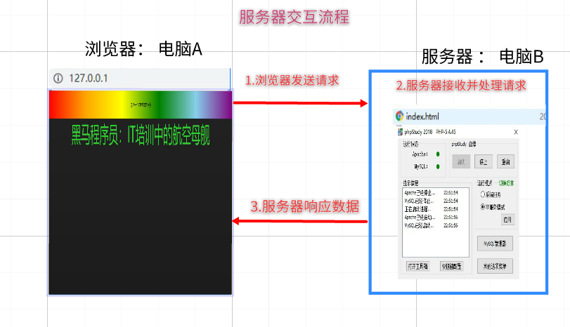
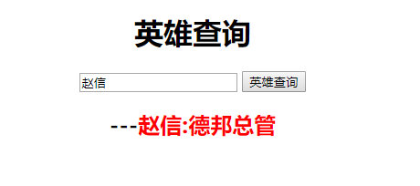
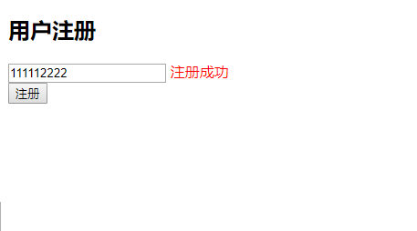
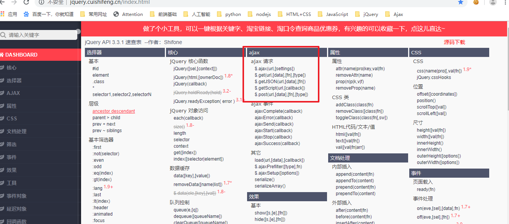

# 今日学习任务

* [ ] 1.了解什么是服务器
* [ ] 2.了解ajax工作流程
* [ ] 3.能够使用ajax发送get请求
* [ ] 4.能够使用ajax发送post请求
* [ ] 5.了解json格式数据的解析方法
* [ ] 5.jq使用ajax

# 01-课程大纲介绍

* 自我介绍
  * 张晓坤：来自湖北黄冈
  * 有人叫我：    黑马李宗盛
  * 也有人叫我：黑马保健坤
  * 还有人叫我：黑马颜值担当

## 1.1-Ajax是什么？

* Ajax就`是`让浏览器跟服务器交互的一套`API`。 它的作用就是可以让浏览器和服务器进行交互。

## 1.2-学习Ajax的目标是什么？

* 学会使用ajax 根据 `接口文档` 和 服务器 `交互`
  * 目前，我们网页所有的数据都是写死的。实际开发中，网页的数据需要从服务器获取。而ajax技术就是来实现这一功能的。

## 1.3-如何学习Ajax


* 1.服务器了解
  * a. 什么是服务器
  * b.服务器的交互流程
* 2.ajax工作流程
* 3.get请求与post请求
* 4.模板引擎
* 5.项目实战


# 02-服务器介绍


## 1.1-什么是服务器?

* 1.`服务器` 就`是`提供某种服务的 `电脑`(机器)
* 2.如何让电脑提供某种服务呢？`安装软件`
  * 想让你的电脑提供 `听歌` 服务，需要装什么软件呢？
    * 网易云、qq音乐
  * 想让你的电脑提供 `视频` 服务，需要装什么软件呢？
    * 爱奇艺，优酷
  * 想让你的电脑提供 `聊天` 服务，需要装什么软件呢？
    * qq，微信
* 3.综上所述，服务器就是某些安装了特殊软件，可以提供某些服务的电脑。常见的服务器有以下几种
  * 数据库服务
  * 文件服务
  * 多媒体服务(音视频)
  * 邮件服务
  * Web服务
* 4.要想让你的电脑成为一台Web服务器，我们只需要安装对应的软件即可。
  * 由于这些软件涉及的专业知识属于后台开发领域，我们的重点是了解什么是服务器，并且我们是前端开发，所以我们主要学习如何使用前端中的软件来和服务器进行交互。那么我们前端主要使用什么软件来和服务器进行交互呢？（Chrome）
* 


## 1.2-使用phpstudy软件搭建Web服务器(了解即可)

* web服务器就是提供web服务的电脑
  * 通俗来说：就是让你可以访问在其内部的资源(比如网页)。之前咱们自己写好的网页如果让别人访问要怎么做呢？
* 1.安装软件
  * 要想让你的电脑成为一台web服务器，首先需要安装对应的软件。这里我推荐一个简单并且容易上手的软件phpstudy:http://phpstudy.php.cn/
    * 老师已经提前下载好了软件安装包放在今天的课程资料中
* 2.安装安装
  * 点击安装，一直下一步即可
* 3.启动
  * 
* 4.设置服务器的web文件路径
  * 注意：文件路径绝对不能出现中文哟！


* 5.搭建好web服务器之后，接下来只需要打开浏览器输入网址即可
  * 输入这台计算机的ip地址 + /index.html (**比如:192.168.23.16/index.html**)

## 1.3-服务器交互流程

* 为什么刚刚我们只需要在浏览器输入一个网址点击回车之后就可以看到网页呢？
* 为什么我们修改了网页之后，需要在浏览器刷新以下才能看到最新的内容呢？
* 为什么在浏览器输入 <http://www.baidu.com>就可以看到百度网页呢？
* 为什么在浏览器输入 <http://www.jd.com>就可以看到京东网页呢？
* 其实，浏览器和服务器之间的每一次交互，都是由三个部分组成
  * 请求(浏览器发起请求，服务器接收)
  * 处理（服务器处理这个请求）
  * 响应（服务器响应数据给浏览器）




## 1.4-浏览器访问服务器的几种方式（代码01）

```html
<!DOCTYPE html>
<html lang="en">
<head>
    <meta charset="UTF-8">
    <meta name="viewport" content="width=device-width, initial-scale=1.0">
    <meta http-equiv="X-UA-Compatible" content="ie=edge">
    <title>Document</title>
    <style>
        
    </style>
</head>

<a href="http://192.168.137.1">点我跳转</a>
<button id="btn">点我也可以跳转哟</button>

<body>
    <script>
        /*几种访问服务器的方式
        1.直接在浏览器地址栏输入网址
        2.使用a标签的href属性
        3.使用window.location.href 
         */

        document.getElementById('btn').onclick = function(){
            window.location.href = 'http://192.168.137.1';
        };
    </script>
</body>
</html>
```


# ==03-ajax工作流程==

## 1.1-什么是ajax？

* ==ajax（阿贾克斯）：在不刷新页面的情况下向服务器请求数据==
  * [ajax技术真实网站介绍](https://www.smzdm.com/)
  * [ajax效果预览](file:///C:/Users/%E5%BC%A0%E6%99%93%E5%9D%A4/Desktop/%E5%BC%A0%E6%99%93%E5%9D%A4%E5%89%8D%E7%AB%AF%E5%A4%87%E8%AF%BE%E8%B5%84%E6%96%99/AB%E6%A8%A1%E5%BC%8F/06-Ajax/%E8%AF%BE%E7%A8%8B%E8%B5%84%E6%96%99/%E5%A4%87%E8%AF%BE%E4%BB%A3%E7%A0%81/day01/09-%E6%A1%88%E4%BE%8B%EF%BC%9A%E8%8B%B1%E9%9B%84%E6%9F%A5%E8%AF%A2.html)

## 1.2-为什么需要ajax？

* 1.以前我的写的页面全部都是固定的假数据，其实网页的数据都是从服务器获取的，一旦服务器数据变化，网页上的内容也会发生变化
* 2.虽然可以通过在浏览器地址栏直接输入网址（url）的方式向服务器获取数据，但是我们的网页会刷新
* 3.学会ajax：就可以做到在不刷新网页的情况下向服务器请求数据，让网站数据内容动态变化。


## ==1.3-ajax的工作流程(代码02)==

* 1.创建XMLHttpRequest对象（俗称小黄人）
  * `var xhr = new XMLHttpRequest();`
* 2.设置请求
  * `xhr.open('get', 'https://autumnfish.cn/api/joke');`
* 3.发送请求
  * `xhr.send();`
* 4.注册回调函数
  * * 这个函数不是立即执行的，而是等服务器把数据响应返回才会执行（PS：什么时候执行取决于你的网速快慢）
    * `xhr.onload = function () {console.log(xhr.responseText);}`


```html
<!DOCTYPE html>
<html lang="en">

<head>
    <meta charset="UTF-8">
    <meta name="viewport" content="width=device-width, initial-scale=1.0">
    <meta http-equiv="X-UA-Compatible" content="ie=edge">
    <title>Document</title>

    <script src="./jquery-1.12.4.min.js"></script>
</head>

<body>
    <script>
      
        /* 1.ajax： 在页面不刷新的情况下向服务器请求数据
           2.XMLHttpRequest ： http请求对象，负责实现ajax技术（小黄人）
                （1）创建XMLHttpRequest对象
                        * 小黄人，相当于黄袍加身的跑腿外卖小哥哥
                （2）设置请求
                        * 告诉小黄人服务器地址
                （3）发送请求
                        * 小黄人出发去指定地址取外卖（数据）
                            * 2G网速：走路去的
                            * 3G网速：骑膜拜去的
                            * WIFI : 骑电动车去的
                            * 4G   ： 骑小牛牌电动车去的
                （4）注册回调函数
                        * 小黄人把取回的外卖送到你家门口
        
         */

        //1.创建小黄人对象XMLHTTPRequest
        var xhr = new XMLHttpRequest();
        //2.设置请求
        xhr.open('get', 'https://autumnfish.cn/api/joke');
        //3.发送请求
        xhr.send();
        //4.注册回调函数
        /* 这个函数不是立即执行的，而是等服务器把数据响应返回才会执行（PS：什么时候执行取决于你的网速快慢） */
        xhr.onload = function () {
            console.log(xhr.responseText);
            document.body.innerText = xhr.responseText;
        };
    </script>
</body>

</html>
```


### 名词解释（课后了解）

* Ajax 即“**Asynchronous Javascript And XML**”（异步 JavaScript 和 XML），是指一种创建交互式网页应用的网页开发技术。                
* **说人话**：ajax就是一套可以让网站跟服务器交互的一种技术，能在我们需要时，不用再刷新网页就能去服务器要一些数据回来
* 例：http://www.smzdm.com 里只要网站往下滚动，就能不用刷新页面跟服务器要数据

# ==04-Ajax接口文档调用(get请求与post请求)==


## 1.1-什么是接口文档

* 1.接口：Web服务器提供的，让ajax请求的网络地址称之为接口，简称API
* 2.接口文档 ：为了方便开发人员使用，我们的后台小伙伴会提供一种专门的文档，称之为接口文档
  * 接口文档，又称为API文档，可以理解为接口的`使用说明书`
    * 接口文档的本质 ：其实就是后台开发（如php）他们写的函数注释。后台在处理请求的时候一般都会写一些函数
* 3.一个标准的接口文档至少要包含以下三种信息（`只能多，不能少`）
  * a.请求的地址 （url）
  * b.请求的方法 （get或者post）
  * c.请求的参数
* 4.以下是我们这个阶段可能会用到的接口文档，实际开发中为了避免你的`url地址`，`方法`,`参数`写错，一般强烈建议直接`复制粘贴`


## 1.2-接口文档示例


### 1.随机获取笑话的接口

* 请求地址：<https://autumnfish.cn/api/joke>
* 请求方法：get
* 请求参数：无
* 响应内容：随机笑话


### 2.demo-英雄外号查询

* 请求地址：https://autumnfish.cn/api/hero/simple

* 请求方法：get

* 请求参数：name


### 3.用户注册

* 请求地址：<https://autumnfish.cn/api/user/register>
* 请求方法：post
* 请求参数：username


### 4.用户验证


* 请求地址：<https://autumnfish.cn/api/user/check>
* 请求方法：post
* 请求参数：username


### 5.其他免费接口资源

> 这里搜集了一些网络上免费可用的接口，因为实现者不同接口文档的风格也不尽相同，大伙可以尝试调用看看

[testApi](https://github.com/AutumnFish/testApi)都是可用的接口

[随机获取acg图片](http://acg.bakayun.cn/) 可以获取精美的acg图片

[开源社区接口](https://www.apiopen.top/api.html)可以获取很多的测试用数据，服务器偶尔会失联，隔一段时间再使用即可

[网易云音乐接口](https://autumnfish.cn/)基本上实现了网易云的所有功能


## 1.3-get请求

### 01-案例：看笑话(代码03)

[效果预览](file:///C:/Users/%E5%BC%A0%E6%99%93%E5%9D%A4/Desktop/%E5%BC%A0%E6%99%93%E5%9D%A4%E5%89%8D%E7%AB%AF%E5%A4%87%E8%AF%BE%E8%B5%84%E6%96%99/AB%E6%A8%A1%E5%BC%8F/06-Ajax/%E8%AF%BE%E7%A8%8B%E8%B5%84%E6%96%99/%E5%A4%87%E8%AF%BE%E4%BB%A3%E7%A0%81/day01/03-%E6%A1%88%E4%BE%8B%EF%BC%9A%E7%9C%8B%E7%AC%91%E8%AF%9D.html)


```html
<!DOCTYPE html>
<html lang="en">

<head>
    <meta charset="UTF-8" />
    <meta name="viewport" content="width=device-width, initial-scale=1.0" />
    <meta http-equiv="X-UA-Compatible" content="ie=edge" />
    <title>Document</title>
    <style>
        body {
            text-align: center;
        }

        input {
            border: 4px solid gray;
            padding: 10px;
            font-size: 25px;
            background-color: skyblue;
            color: white;
            border-radius: 10px;
            cursor: pointer;
            outline: none;
        }

        .joke-container {
            width: 500px;
            height: 500px;
            border: 1px solid gray;
            border-radius: 10px;
            padding-left: 10px;
            margin: 10px auto;
            font-size: 30px;
            text-align: left;
            text-indent: 60px;
        }
    </style>
</head>

<body>
    <input type="button" value="点我看笑话" class="getJoke" />
    <div class="joke-container"></div>

    <script src="./libs/jquery-1.12.4.min.js"></script>
    <script>
        /*
          随机获取笑话的接口
      
          - 请求地址：https://autumnfish.cn/api/joke
          - 请求方法：get
          - 请求参数：无
          - 响应内容：随机笑话
      
          思路步骤
      
          1. 给按钮注册点击事件 onclick
          2. 通过ajax调用 笑话接口
          3. 数据返回之后 显示到div中
       */
        $('.getJoke').on('click', function () {
            // 1.创建小黄人对象
            var xhr = new XMLHttpRequest();
            // 2.设置请求的方法和地址
            xhr.open('get', 'https://autumnfish.cn/api/joke');
            // 3.发送请求
            xhr.send();
            // 4.注册回调函数
            xhr.onload = function () {
                // console.log(xhr.responseText)
                // 显示到div中
                $('.joke-container').text(xhr.responseText);
            };
        });
    </script>
</body>

</html>
```


### 02-get请求提交参数(代码04)

* 接口文档：查询英雄外号
  * 请求地址：https://autumnfish.cn/api/hero/simple
  * 请求方法：get
  * 请求参数：name
* 1.get传参格式：` url?key=value`
* 2.示例： https://autumnfish.cn/api/hero/simple?name=亚索

```html
<!DOCTYPE html>
<html lang="en">

<head>
    <meta charset="UTF-8" />
    <meta name="viewport" content="width=device-width, initial-scale=1.0" />
    <meta http-equiv="X-UA-Compatible" content="ie=edge" />
    <title>Document</title>
</head>

<body></body>

</html>
<script>
    /*
      接口文档：根据英雄 姓名 查询英雄的 外号
      请求地址：https://autumnfish.cn/api/hero/simple
      请求方法：get
      请求参数：name
      响应内容：英雄外号
  
      1.get传参格式： url?key=value
      2.示例： https://autumnfish.cn/api/hero/simple?name=亚索
    */

    // 1.实例化ajax对象
    var xhr = new XMLHttpRequest();
    // 2.设置请求方法和地址
    // get请求的数据直接添加在url的后面 格式是 url?key=value
    xhr.open('get', 'https://autumnfish.cn/api/hero/simple?name=亚索');
    // 3.发送请求
    xhr.send();
    // 4.注册回调函数
    xhr.onload = function () {
        alert(xhr.responseText)
    };
    
</script>
```


### 03-案例：get实现英雄查询(代码05)


[效果预览](file:///C:/Users/%E5%BC%A0%E6%99%93%E5%9D%A4/Desktop/%E5%BC%A0%E6%99%93%E5%9D%A4%E5%89%8D%E7%AB%AF%E5%A4%87%E8%AF%BE%E8%B5%84%E6%96%99/AB%E6%A8%A1%E5%BC%8F/06-Ajax/%E8%AF%BE%E7%A8%8B%E8%B5%84%E6%96%99/%E5%A4%87%E8%AF%BE%E4%BB%A3%E7%A0%81/day01/05-%E6%A1%88%E4%BE%8B%EF%BC%9Aget%E5%AE%9E%E7%8E%B0%E8%8B%B1%E9%9B%84%E6%9F%A5%E8%AF%A2.html)



```html
<!DOCTYPE html>
<html lang="en">

<head>
    <meta charset="UTF-8" />
    <meta name="viewport" content="width=device-width, initial-scale=1.0" />
    <meta http-equiv="X-UA-Compatible" content="ie=edge" />
    <title>Document</title>
    <style>
        body {
            text-align: center;
        }

        .name {
            color: deepskyblue;
        }

        .title {
            color: red;
        }
    </style>
</head>

<body>
    <h1>英雄查询</h1>
    <input type="text" placeholder="请输入查询的名字" class="hero" />
    <input type="button" value="英雄查询" class="search" />
    <h2><span class="name"></span>---<span class="title"></span></h2>
</body>

</html>
<script src="./libs/jquery-1.12.4.min.js"></script>
<script>
    /*
      - 请求地址：https://autumnfish.cn/api/hero/simple
      - 请求方法：get
      - 请求参数：name
      - 响应内容：英雄外号
    */

    /*思路分析
     1.给search按钮注册点击事件
     2.获取hero输入框文本
     3.通过ajax调用接口：参数为输入框文本
     4.数据返回之后显示到title标签中
     */

    //1.注册点击事件
    $('.search').on('click', function () {
        //2.获取输入框文本
        var heroName = $('.hero').val();
        //3.ajax请求数据

        //(1).实例化ajax对象
        var xhr = new XMLHttpRequest();
        //(2).设置请求方法和地址
        //get请求的数据直接添加在url的后面 格式是 url?key=value
        xhr.open('get', 'https://autumnfish.cn/api/hero/simple?name=' + heroName);
        //(3).发送请求
        xhr.send();
        //(4).注册回调函数
        xhr.onload = function() {
            $('.title').text(heroName + ':' + xhr.responseText);
        };
    });

</script>
```

## 1.4-post请求


### 01-案例：post实现用户注册01（代码06）

[效果预览](file:///C:/Users/张晓坤/Desktop/张晓坤前端备课资料/AB模式/06-Ajax/课程资料/备课代码/day01/06-案例：post实现用户注册01.html)



​	用户注册

* 请求地址：https://autumnfish.cn/api/user/register

* 请求方法：post

* 请求参数：username

  

* post请求与get请求区别
  * 1.传参方式不同
    * get请求参数直接在url后面拼接 ： `url?key=value`
    * post请求参数不能写在url，需要在send方法中传参
      * `xhr.send('key=value')`
  * 2.post请求需要设置请求头（post请求才需要设置,这是固定格式语法，强烈建议大家复制粘贴）
    * `xhr.setRequestHeader('Content-type','application/x-www-form-urlencoded');`

```html
<!DOCTYPE html>
<html lang="en">

<head>
    <meta charset="UTF-8" />
    <meta name="viewport" content="width=device-width, initial-scale=1.0" />
    <meta http-equiv="X-UA-Compatible" content="ie=edge" />
    <title>Document</title>
    <style>
        .info {
            color: red;
        }
    </style>
</head>

<body>
    <h2>用户注册</h2>
    <input type="text" placeholder="请输入注册的用户名" class="username" />
    <span class="info"></span>
    <br />
    <input type="button" value="注册" class="submit" />
</body>

</html>
<script src="./libs/jquery-1.12.4.min.js"></script>
<script>

    /* 
    请求方法get和post区别： 传参方式不同
        get请求： 直接在url后面拼接参数
            * 参数在url中，安全性不高
        post请求：
            1.需要设置请求头（固定语法）：xhr.setRequestHeader('Content-type','application/x-www-form-urlencoded')
                * 注意：这是固定格式，错一个字母都不行，强烈建议复制粘贴
            2.使用xhr的send方法发送参数： xhr.send('参数名=参数值');
                * 注意：不要加前面的? 
    */

    /*
  用户注册
  - 请求地址：https://autumnfish.cn/api/user/register
  - 请求方法：post
  - 请求参数：username
  
  1. 注册点击事件  : submit
  2. 获取输入框文本：username
  3. 通过ajax调用接口：参数为输入框文本
  4. 数据返回之后显示到info中
  */

    $(function () {
        //1.注册点击事件
        $('.submit').on('click', function () {
            //2.获取输入框文本
            var username = $('.username').val();
            //3.ajax发送请求
            //(1).实例化ajax对象
            var xhr = new XMLHttpRequest();
            //(2).设置请求方法和地址
            xhr.open('post', 'https://autumnfish.cn/api/user/register');
            //(3).设置请求头（post请求才需要设置）
            xhr.setRequestHeader('Content-type','application/x-www-form-urlencoded');
            //(4).发送请求 ： 参数格式  'key=value'
            xhr.send('username=' + username);
            //(5).注册回调函数
            xhr.onload = function () {
                $('.info').text(xhr.responseText);
            };
        });
    });

</script>
```

### 02-案例：post实现用户注册02(代码07)

[效果预览](file:///C:/Users/张晓坤/Desktop/张晓坤前端备课资料/AB模式/06-Ajax/课程资料/备课代码/day01/07-案例：post实现用户注册02.html)

​	用户验证（先验证该用户是否已注册）

  \- 请求地址：https://autumnfish.cn/api/user/check

  \- 请求方法：post

  \- 请求参数：username


用户注册

  \- 请求地址：https://autumnfish.cn/api/user/register

  \- 请求方法：post

  \- 请求参数：username


```html
<!DOCTYPE html>
<html lang="en">

<head>
    <meta charset="UTF-8" />
    <meta name="viewport" content="width=device-width, initial-scale=1.0" />
    <meta http-equiv="X-UA-Compatible" content="ie=edge" />
    <title>Document</title>
    <style>
        .info {
            color: red;
        }
    </style>
</head>

<body>
    <h2>用户注册</h2>
    <input type="text" placeholder="请输入注册的用户名" class="username" />
    <span class="info"></span>
    <br />
    <input type="button" value="注册" class="submit" />
</body>

</html>
<script src="./libs/jquery-1.12.4.min.js"></script>
<script>

    /* 
    请求方法get和post区别： 传参方式不同
        get请求： 直接在url后面拼接参数
            * 参数在url中，安全性不高
        post请求：
            1.需要设置请求头（固定语法）：xhr.setRequestHeader('Content-type','application/x-www-form-urlencoded')
                * 注意：这是固定格式，错一个字母都不行，强烈建议复制粘贴
            2.使用xhr的send方法发送参数： xhr.send('参数名=参数值');
                * 注意：不要加前面的? 
    */

    /*
  用户注册
  - 请求地址：https://autumnfish.cn/api/user/register
  - 请求方法：post
  - 请求参数：username
  
  1. 注册点击事件  : submit
  2. 获取输入框文本：username
  3. 通过ajax调用接口：参数为输入框文本
  4. 数据返回之后显示到info中

  用户验证（先验证该用户是否已注册）
  - 请求地址：https://autumnfish.cn/api/user/check
  - 请求方法：post
  - 请求参数：username

  1.注册失去焦点onblur事件：username输入框
  2.获取当前输入框文本
  3.info提示验证中
  4.调用ajax接口：参数为输入框文本
  5.数据返回之后显示到info中
  */

    //用户验证
    $(function () {
        //1.注册失去焦点事件
        $('.username').on('blur', function () {
            //2.获取输入框文本
            var username = $('.username').val();
            //3.提示验证中
            $('.info').text('验证中……');

            //4.ajax发送请求
            //(1).实例化ajax对象
            var xhr = new XMLHttpRequest();
            //(2).设置请求方法和地址
            xhr.open('post', 'https://autumnfish.cn/api/user/check');
            //(3).设置请求头（post请求才需要设置）
            xhr.setRequestHeader('Content-type', 'application/x-www-form-urlencoded');
            //(4).发送请求 ： 参数格式  'key=value' 
            xhr.send('username=' + username);
            //(5).注册回调函数
            xhr.onload = function () {
                console.log(xhr.responseText);
                $('.info').text(xhr.responseText);
            };
        });
    });

    //用户注册
    $(function () {
        //1.注册点击事件
        $('.submit').on('click', function () {
            //2.获取输入框文本
            var username = $('.username').val();
            $('.info').text('注册中……');
            //3.ajax发送请求
            //(1).实例化ajax对象
            var xhr = new XMLHttpRequest();
            //(2).设置请求方法和地址
            xhr.open('post', 'https://autumnfish.cn/api/user/register');
            //(3).设置请求头（post请求才需要设置）
            xhr.setRequestHeader('Content-type', 'application/x-www-form-urlencoded');
            //(4).发送请求 ： 参数格式  'key=value'
            xhr.send('username=' + username);
            //(5).注册回调函数
            xhr.onload = function () {
                $('.info').text(xhr.responseText);
            };
        });
    });

</script>
```


# 05-JSON数据格式解析

## 1.1-服务器响应数据格式介绍

* 1.为了方便数据的保存以及传递，就有了一些通用的数据格式（前端js和后端php、java等都支持的数据格式），常用的曾经有JSON和XML，但是现在基本上都是用JSON，XML已经退出了历史的舞台，基本看不到了，

* `2.JSON格式：重点`
  * 通用的数据格式，很多语言都支持，不同语言中解析他的方式不同
  * js中对应JSON的使用 2个方法

```javascript
/*
1. JSON是一种数据格式，本质是字符串

        作用： 解决跨平台的问题，一般服务器返回的数据都是json格式

2. JSON格式特点

        a. 属性名和属性值都是字符串(需要使用双引号包括)

        b. 如果属性值是布尔类型和数字类型，则可以省略字符串

    3.JSON格式与JS对象互转

        JSON->JS : JSON.parse(json数据)

        JS->JSON ：JSON.stringify(js对象)
*/
```


```json
var jsonArr ='{"name":"jack","friend":"肉丝"}'
```

* 3.XML格式（了解即可）

  

## 1.2-JSON数据格式解析(代码08)

* 在线检测json格式数据是否正确：<http://www.bejson.com/>

1. JSON是一种数据格式，本质是字符串

​        作用： 解决跨平台的问题，一般服务器返回的数据都是json格式

2. JSON格式特点

​        a. 属性名和属性值都是字符串(需要使用双引号包括)

​        b. 如果属性值是布尔类型和数字类型，则可以省略字符串

​    3.JSON格式与JS对象互转

​        JSON->JS : JSON.parse(json数据)

​        JS->JSON ：JSON.stringify(js对象)


```html
<!DOCTYPE html>
<html lang="en">
<head>
    <meta charset="UTF-8">
    <meta name="viewport" content="width=device-width, initial-scale=1.0">
    <meta http-equiv="X-UA-Compatible" content="ie=edge">
    <title>Document</title>
</head>
<body>
    <script>
    /* 
    1. JSON是一种数据格式，本质是字符串
        作用： 解决跨平台的问题，一般服务器返回的数据都是json格式
    2. JSON格式特点
        a. 属性名和属性值都是字符串(需要使用双引号包括)
        b. 如果属性值是布尔类型和数字类型，则可以省略字符串
    
    3.JSON格式与JS对象互转
        JSON->JS : JSON.parse(json数据)
        JS->JSON ：JSON.stringify(js对象)
    */    
    
    //1.对象必须使用 {} 包裹
    // 属性名和属性值必须使用双引号
    var jsonObjc = '{"name":"1111"}';
    console.log(jsonObjc);
    console.log(JSON.parse(jsonObjc));

    //2. 数组必须使用 []包裹
    var jsonArr = '["张三","李四","王五"]';
    console.log(jsonArr);
    console.log(JSON.parse(jsonArr));

    //3. 复杂的json： 对象和数组互相嵌套
    var json1 = '{"title":"德玛西亚之力","name":"盖伦","firend":["赵信","亚索"],"bgf":{"name":"女警","age":"18"}}';
    console.log(json1);
    console.log(JSON.parse(json1));

    var json2 = '{"heros":[{"name":"盖伦","age":20},{"name":"赵信","age":18},{"name":"亚索","age":21}]}';
    console.log(json2);
    console.log(JSON.parse(json2));

    //4.js对象转JSON
    var hero = {
        name:'盖伦',
        age:20,
        friend:['赵信','亚索'],
        bgf:{
            name:'女警',
            age:22
        }
    };
    console.log(hero);
    console.log(JSON.stringify(hero));

    </script>
</body>
</html>
```


## 1.3-综合案例：英雄查询(代码09)

[效果预览](file:///C:/Users/张晓坤/Desktop/张晓坤前端备课资料/AB模式/06-Ajax/课程资料/备课代码/day01/09-案例：英雄查询.html)


​	英雄信息查询接口文档

​    	 * 请求地址：https://autumnfish.cn/api/hero/info

​    	* 请求方法：get

​    	* 请求参数：name

​      开发思路：

​    \1. 给输入框注册键盘按下事件，监听enter按键 ： keyCode = 13

​    \2. 获取输入的内容

​    \3. 调用英雄详情接口

​    \4. 数据数据返回之后显示到页面

```html
<!DOCTYPE html>
<html lang="en">
  <head>
    <meta charset="UTF-8" />
    <meta name="viewport" content="width=device-width, initial-scale=1.0" />
    <meta http-equiv="X-UA-Compatible" content="ie=edge" />
    <title>Document</title>
    <style>
      body {
        background-color: black;
        text-align: center;
      }
      .hero {
        padding: 10px;
        font-size: 25px;
        border-radius: 10px;
        outline: none;
      }
      .bg {
        width: 1000px;
        height: 590px;
        margin: 10px auto;
        background-image: url(http://img1.dwstatic.com/lol/1512/315320556654/1451366974753.jpg);
        background-repeat: no-repeat;
        background-size: 1000px 590px;
      }
      .bg .left {
        height: 590px;
        width: 300px;
        background-color: rgba(0, 0, 0, 0.5);
        padding-left: 20px;
        padding-top: 30px;
        box-sizing: border-box;
        overflow-y: auto;
      }
      .left span {
        color: white;
      }
      .left .name {
        margin-top: 30px;
        font-size: 30px;
      }
      .left .icon {
        width: 120px;
        height: 120px;
      }
      .left .title {
        margin-top: 20px;
        font-size: 50px;
        display: block;
        font-weight: 900;
      }
      .left .story {
        font-weight: 700;
        color: skyblue;
        text-align: left;
      }
    </style>
  </head>
  <body>
    <input type="text" class="hero" placeholder="输入英雄按下回车查询" />
    <div class="bg">
      <div class="left">
        <div>
          <span class="name">提莫 </span>
          
        </div>
        <span class="title">迅捷斥候</span>
        <p class="story">团战可以输，大龙可以丢，高地可以破，提莫必须死</p>
      </div>
    </div>
  </body>
</html>
<script src="./libs/jquery-1.12.4.min.js"></script>
<script>
  /*英雄信息查询接口文档

    请求地址：https://autumnfish.cn/api/hero/info
    请求方法：get
    请求参数：name

    开发思路：
    1. 给输入框注册键盘按下事件，监听enter按键 ： keyCode = 13
    2. 获取输入的内容
    3. 调用英雄详情接口
    4. 数据数据返回之后显示到页面
  */
  $(function() {
    //1.注册键盘按下事件
    $('.hero').on('keydown',function(e){
        //判断是不是安乐enter键
        console.log(e.keyCode);
        if(e.keyCode == 13){
            //2.获取输入框文本
            var heroName = $('.hero').val();
            //3.调用英雄详情查询接口

            //(1).实例化ajax对象
            var xhr = new XMLHttpRequest();
            //(2).设置请求方法和地址
            //get请求的数据直接添加在url的后面 格式是 url?key=value
            xhr.open('get', 'https://autumnfish.cn/api/hero/info?name=' + heroName);
            //(3).发送请求
            xhr.send();
            //(4).注册回调函数
            xhr.onload = function() {
                //4.将返回的数据显示到页面 （解析渲染）
                console.log(xhr.responseText)
                //4.1 将服务器返回的json数据转为js对象
                var heroObjc = JSON.parse(xhr.responseText);
                console.log(heroObjc);
                //姓名
                $('.name').text(heroObjc.name);
                //标题
                $('.title').text(heroObjc.title);
                //图标
                $('.icon').attr('src',heroObjc.icon);
                //故事
                $('.story').text(heroObjc.story);
                //背景图
                $('.bg').css('background-image','url(' + heroObjc.bg + ')');      
            };
        };
    });
    
  });
</script>

```

# 06-ajax请求函数封装(重点掌握jq使用ajax)


## 1.1-ajax多参数传递

* 1.多参数传递格式 : `key1=valu1&key2=value2`
  * a. 多个参数之间用 `$`符号隔开
  * b.参数之间不能有空格
* 2.post多参数传递格式与get是一致的，只是参数要放到send()方法中而已


* 接口文档1
  * 请求地址:http://acg.bakayun.cn/randbg.php
  * 请求方法：get
  * 请求参数：Type,t,https
* 接口文档2
  * 请求地址：http://www.tuling123.com/openapi/api
  * 请求方法：post
  * 请求参数：key,info
    * key的备选值
      * 2162602fd87240a8b7bba7431ffd379b
      * a618e456f0744066840ceafb6a249d9d
      * 7b1cf467c0394dd5b3e49f32663f8b29
      * 9fbb98effab142c9bb324f804be542ba
      * d7c82ebd8b304abeacc73b366e42b9ed  (氪金了)

```html
<!DOCTYPE html>
<html lang="en">

<head>
    <meta charset="UTF-8">
    <meta name="viewport" content="width=device-width, initial-scale=1.0">
    <meta http-equiv="X-UA-Compatible" content="ie=edge">
    <title>Document</title>
</head>

<body>
    <button id="get">get发送多参数</button>
    <button id="post">post发送多参数</button>

    <script src="./hm.js"></script>
    <script>
        /*接口文档1
            请求地址:http://acg.bakayun.cn/randbg.php
            请求方法：get
            请求参数：Type,t,https

          接口文档2
            请求地址：http://www.tuling123.com/openapi/api
            请求方法：post
            请求参数：key,info
                key的备选值
                    2162602fd87240a8b7bba7431ffd379b
                    a618e456f0744066840ceafb6a249d9d
                    d7c82ebd8b304abeacc73b366e42b9ed 氪金了
                    7b1cf467c0394dd5b3e49f32663f8b29
                    9fbb98effab142c9bb324f804be542ba
        */

        document.getElementById('get').onclick = function () {
            /*多参数传递格式： key1=valu1&key2=value2
            a. 多个参数之间用 $ 隔开
            b. 参数之间不能有空格
            */
            hm.ajax({
                url: 'http://acg.bakayun.cn/randbg.php',
                method: 'get',
                data: 'Type=json&t=dfproject',
                success: function (data) {
                    console.log(data);
                }
            });
        };

        document.getElementById('post').onclick = function () {
            // post多参数传递格式与get是一致的，只是参数要放到send()方法中而已
            hm.ajax({
                url: 'http://www.tuling123.com/openapi/api',
                method: 'post',
                data: 'key=2162602fd87240a8b7bba7431ffd379b&info=你吃饭了吗',
                success: function (data) {
                    console.log(data);
                }
            });
        };


    </script>
</body>

</html>
```

## 1.1-ajax请求函数封装

[效果预览](file:///C:/Users/%E5%BC%A0%E6%99%93%E5%9D%A4/Desktop/%E5%BC%A0%E6%99%93%E5%9D%A4%E5%89%8D%E7%AB%AF%E5%A4%87%E8%AF%BE%E8%B5%84%E6%96%99/AB%E6%A8%A1%E5%BC%8F/06-Ajax/%E8%AF%BE%E7%A8%8B%E8%B5%84%E6%96%99/%E5%A4%87%E8%AF%BE%E4%BB%A3%E7%A0%81/day02/09-ajax%E8%AF%B7%E6%B1%82%E5%87%BD%E6%95%B0%E5%B0%81%E8%A3%85/text.html)

* 1.为什么需要封装ajax?  (什么样的情况需要将一段代码放入函数中)
  * a.需要在很多个地方使用
  * b.一个独立的小功能(代码步骤固定)
* 2.封装思路 (ajax请求有几种方式?)
  * (1)get请求
  * (2)post请求


```html
<!DOCTYPE html>
<html lang="en">

<head>
    <meta charset="UTF-8">
    <meta name="viewport" content="width=device-width, initial-scale=1.0">
    <meta http-equiv="X-UA-Compatible" content="ie=edge">
    <title>Document</title>
</head>

<body>
    <button id="get">get请求测试</button>
    <button id="post">post请求测试</button>
    <button id="ajax">ajax请求测试</button>

    <script>
        /* 
        1.get测试接口：
            - 请求地址：https://autumnfish.cn/api/cq
            - 请求方法：get
            - 请求参数：query
        
        2.post测试接口
            - 请求地址：https://autumnfish.cn/api/user/register
            - 请求方法：post
            - 请求参数：username
        */

        /* 闭包实现沙箱模式 */
        (function (w) {
            /**
             * @description: 1.get请求
             * @param {type} url ：请求地址
             * @param {type} data ：请求参数
             * @param {type} success ：请求回调   function(data){ data:服务器返回的数据 }
             * @return: 
             */
            function get(url, data, success) {
                //(1).实例化ajax对象
                var xhr = new XMLHttpRequest();
                //(2).设置请求方法和地址
                //get请求的数据直接添加在url的后面 格式是 url?key=value
                xhr.open('get', url + '?' + data);
                //(3).发送请求
                xhr.send();
                //(4).注册回调函数
                xhr.onload = function () {
                    //获取到数据之后，执行回调函数,将获取的数据通过参数传递给这个回调函数
                    success(xhr.responseText);
                };
            };

            /**
             * @description: 2.post请求
             * @param {type} url ：请求地址
             * @param {type} data ：请求参数
             * @param {type} success ：请求回调   function(data){ data:服务器返回的数据 }
             * @return: 
             */
            function post(url, data, success) {
                //(1).实例化ajax对象
                var xhr = new XMLHttpRequest();
                //(2).设置请求方法和地址
                xhr.open('post', url);
                //(3).设置请求头（post请求才需要设置）
                xhr.setRequestHeader('Content-type', 'application/x-www-form-urlencoded');
                //(4).发送请求 ： 参数格式  'key=value' 
                xhr.send(data);
                //(5).注册回调函数
                xhr.onload = function () {
                    //获取到数据之后，执行回调函数,将获取的数据通过参数传递给这个回调函数
                    success(xhr.responseText);
                };
            };

            /**
             * @description: 3.ajax请求
             * @param {type} 对象的方式传参
                {
                    url:请求地址
                    method:请求方法
                    data:请求参数
                    success：请求回调  function(data){ data:服务器返回的数据 }
                }
             */
            function ajax(obj) {
                //(1).实例化ajax对象
                var xhr = new XMLHttpRequest();
                if (obj.method == 'get') {
                    //(2).设置请求方法和地址
                    xhr.open(obj.method,obj.url + '?' + obj.data);
                    xhr.send();
                } else {
                    //(2).设置请求方法和地址
                    xhr.open(obj.method,obj.url);
                    //(3).设置请求头（post请求才需要设置）
                    xhr.setRequestHeader('Content-type', 'application/x-www-form-urlencoded');
                    //(4).发送请求 ： 参数格式  'key=value' 
                    xhr.send(obj.data);
                };
                //(5).注册回调函数
                xhr.onload = function () {
                    //获取到数据之后，执行回调函数,将获取的数据通过参数传递给这个回调函数
                    obj.success(xhr.responseText);
                };
            };

            //暴露接口
            w.hm = {
                get: get, //左边属性名，右边属性值
                post: post,
                ajax: ajax
            };
        })(window);

        document.getElementById('get').onclick = function () {
            hm.get('https://autumnfish.cn/api/cq', 'query=剑士', function (data) {
                console.log(data);
            });
        };

        document.getElementById('post').onclick = function () {
            hm.post('https://autumnfish.cn/api/user/register', 'username=666', function (data) {
                console.log(data);
            });
        };

        document.getElementById('ajax').onclick = function () {
            /* hm.ajax({
                url:'https://autumnfish.cn/api/cq',
                method:'get',
                data:'query=',
                success:function(data){
                    console.log(data);
                    
                }
            }); */

            hm.ajax({
                url:'https://autumnfish.cn/api/user/register',
                method:'post',
                data:'username=66666',
                success:function(data){
                    console.log(data);  
                }
            });
        };


    </script>
</body>

</html>
```


## ==1.3-jQuery使用ajax==

[效果预览](file:///C:/Users/张晓坤/Desktop/张晓坤前端备课资料/AB模式/06-Ajax/课程资料/备课代码/day03/02-jQuery使用ajax/01-jq使用ajax.html)

* 1.jQuery使用ajax : <http://jquery.cuishifeng.cn/index.html>

  * 最常用的是 :`$.ajax()`这个方法

  


* 2.由于jquery使用ajax的语法是固定的,我们可以将代码片段设置到vscode中,以后只需要按`ajax`这段代码就会自动出来(把下面这个代码片段复制粘贴到你的vscode代码片段即可:文件->首选项->用户代码片段->javascript.json )

  ```javascript
  "jquery to ajax": {
  		"prefix": "ajax",
  		"body": [
  			"$.ajax({",
  			"url:'',",
  			"type:'get',",
  			"dataType:'json',",
  			"data:'',",
  			"success: function(data){",
  			"}",
  			"});"
  		],
  		"description": "ajax请求"
  	},
  ```

  ```html
  <!DOCTYPE html>
  <html lang="en">
  
  <head>
    <meta charset="UTF-8" />
    <meta name="viewport" content="width=device-width, initial-scale=1.0" />
    <meta http-equiv="X-UA-Compatible" content="ie=edge" />
    <title>Document</title>
  </head>
  
  <body>
    <input type="button" value="get方法" class="get" />
    <input type="button" value="post方法" class="post" />
    <input type="button" value="ajax方法" class="ajax" />
  </body>
  
  </html>
  <script src="./libs/jquery-1.12.4.min.js"></script>
  <script>
    $(function () {
      /*
        请求地址:http://acg.bakayun.cn/randbg.php
        请求方法：get
        请求参数：Type,t,https
      */
      $('.get').click(function () {
        $.get(
          'http://acg.bakayun.cn/randbg.php',
          'Type=json&t=dfproject',
          function (backData) {
            //json数据
            // console.log(backData)
            //转成js对象
            console.log(JSON.parse(backData));
          }
        );
        //参数也可以写到对象中，jq会自动帮我们处理
        // $.get(
        //   'http://acg.bakayun.cn/randbg.php',
        //   {
        //     Type: 'json',
        //     t: 'dfproject'
        //   },
        //   function(backData) {
        //     // console.log(backData)
        //     console.log(JSON.parse(backData))
        //   }
        // )
      })
  
      // post方法
      /*
          请求地址：http://www.tuling123.com/openapi/api
          请求方法：post
          请求参数：key,info
          key的备选值
          2162602fd87240a8b7bba7431ffd379b
          a618e456f0744066840ceafb6a249d9d
          d7c82ebd8b304abeacc73b366e42b9ed 氪金了
          7b1cf467c0394dd5b3e49f32663f8b29
          9fbb98effab142c9bb324f804be542ba
    */
      $('.post').click(function () {
        $.post(
          'http://www.tuling123.com/openapi/api',
          { key: '2162602fd87240a8b7bba7431ffd379b', info: '你今天吃饭了吗？' },
          function (backData) {
            console.log(backData)
          }
        )
      })
  
      // ajax方法 : 最常用
      $('.ajax').click(function () {
        $.ajax({
          url: 'http://acg.bakayun.cn/randbg.php',
          type: 'get',
          data: {
            Type: 'json',
            t: 'dfproject'
          },
          success: function (backData) {
            // console.log(backData)
            console.log(JSON.parse(backData))
          }
        });
  
        // Post请求
        $.ajax({
          url: 'http://www.tuling123.com/openapi/api',
          type: 'post',
          data: {
            key: '2162602fd87240a8b7bba7431ffd379b',
            info: '我还可以调用你几次？'
          },
          success: function (backData) {
            console.log(backData)
          }
        })
      });
    });
  </script>
  ```


# 第一天学习总结

* 1.什么是服务器？
* 2.什么是ajax？
* 3.ajax的使用步骤
  * get请求4个步骤
  * post请求5个步骤
* 4.get请求与post请求的区别
* 5.JSON数据格式解析
  * JSON数据转js对象
  * js对象转JSON数据
* 6.jq使用ajax
  * $.ajax()