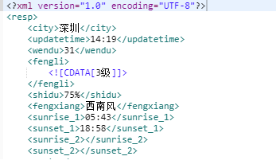
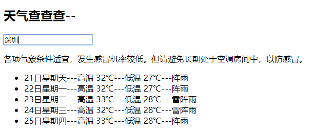
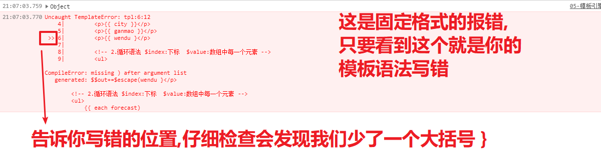
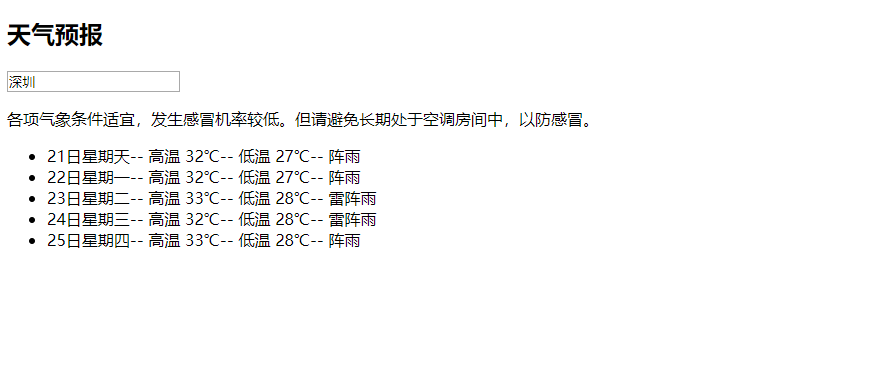
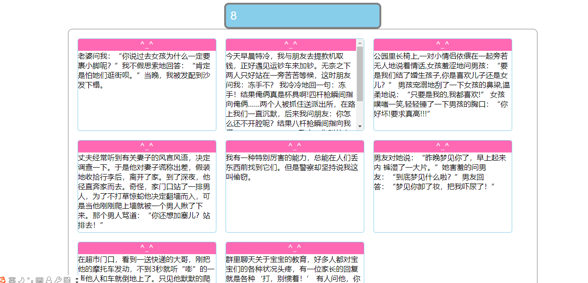
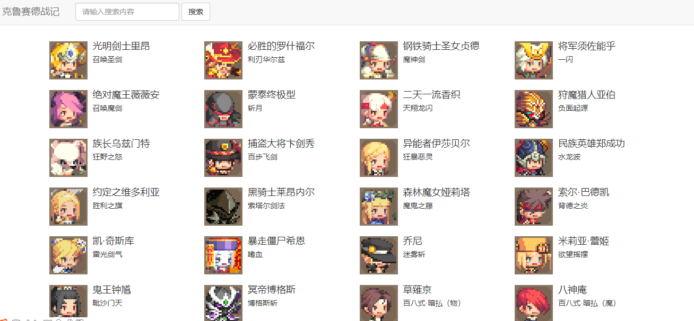
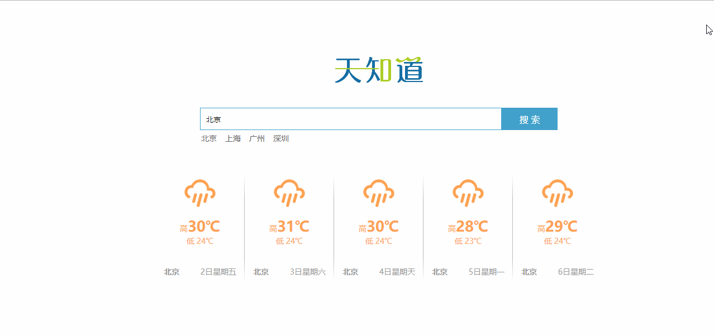
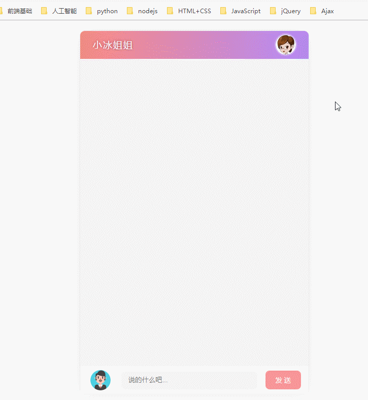
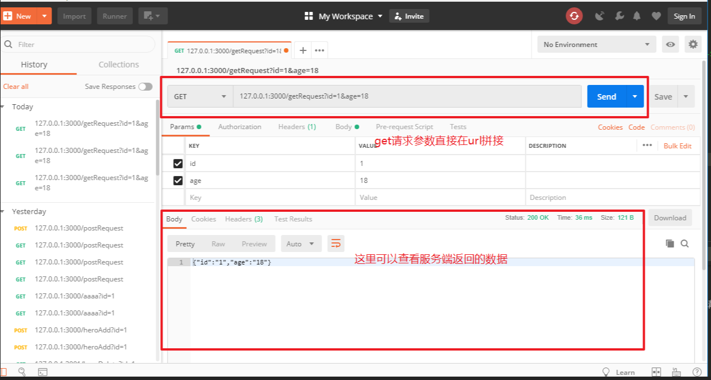
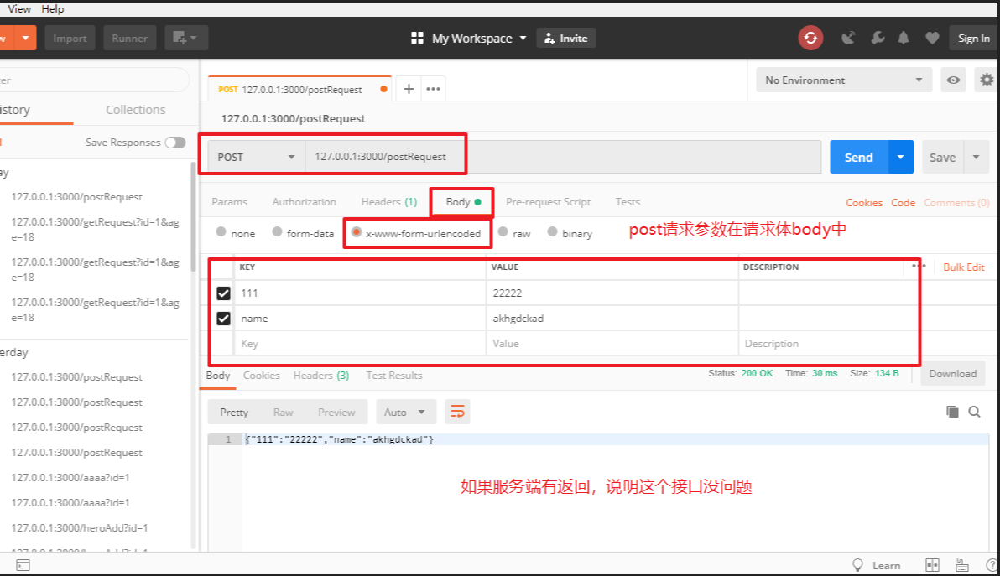

# 今日学习任务


* [ ] 1.XML数据格式解析
  * [ ] a.XML格式接口解析数据
  * [ ] b.案例:天气预报
* [ ] 2.模板引擎art-template
  * [ ] a.模板引擎art-template使用流程
  * [ ] b.模板引擎语法介绍
  * [ ] c.模板引擎易错点总结
  * [ ] d.案例:天气预报
  * [ ] e.案例:笑话plus版本
* [ ] 3.综合案例:英雄查询
* [ ] 4.综合案例-天知道
* [ ] 5.综合案例-聊天机器人


# 01-XML数据格式解析


## 1.1-JSON格式数据复习

* 1.JSON作用: 解决数据跨平台问题
  * 由于后台开发语言并不一定使用JavaScript,有可能是PHP或者Python或者Java等,其他语言中的数据类型和JS语言的数据类型不一样,无法直接返回一个js对象. 后来人们为了解决这个问题,就发明了JSON数据,并且几乎所有的编程语言都支持JSON格式,这样就解决了编程语言跨平台的问题
* 2.JSON格式特点
  * 属性名和属性值都是字符串 `{"name":"张三"}`
  * `JSON.parse(JSON)`  ->JSON转JS
  * `JSON.stringify(js对象|数组)`->JS转JSON
* 3.ajax结合JSON
  * 1.实例化小黄人对象
    * `var xhr = new XMLHttpRequest();`
  * 2.设置请求方法和地址
    * `xhr.open('get', '接口文档中的url?value=key');`
  * 3.发送请求
    * `xhr.send()`
  * 4.注册回调函数
    * `JSON.parse( xhr.responseText)`

## 1.2-XML格式数据介绍

* 1.曾经流行的数据格式



* 2.XML格式特点
  * (1)XML数据声明格式固定
    * `<?xml version="1.0" encode="UTF-8"?>`
  * (2)XML的标签可以自定义
    * `<city>城市</city>`
  * (3)必须都是双标签
  * (4)除了顶部的声明之外,所有的内容必须包裹在一个根标签内部
    * 类似于HTML中所有的网页内容都必须包裹在Body标签中一样
* 3.XML格式弊端
  * (1)数据传输量比较大:冗余
  * (2)解析繁琐
    * jq解析XML格式数据:`$('选择器',xml格式的数据).text()`

```html
<!DOCTYPE html>
<html lang="en">

<head>
    <meta charset="UTF-8">
    <meta name="viewport" content="width=device-width, initial-scale=1.0">
    <meta http-equiv="X-UA-Compatible" content="ie=edge">
    <title>Document</title>
</head>

<body>
    <script src="./libs/jquery-1.12.4.min.js"></script>
    <script>
        /* 接口文档
        请求地址：http://wthrcdn.etouch.cn/WeatherApi
        请求方法：get
        请求参数：city
        示例： http://wthrcdn.etouch.cn/WeatherApi?city=深圳
        */

        /* 
            1.XML格式的数据不能使用 JSON.parse() 解析
            2.jQuery解析XML ： $('选择器',xml格式数据).text()
        */

        //(1).实例化ajax对象
        var xhr = new XMLHttpRequest();
        //(2).设置请求方法和地址
        //get请求的数据直接添加在url的后面 格式是 url?key=value
        xhr.open('get', 'http://wthrcdn.etouch.cn/WeatherApi?city=深圳');
        //(3).发送请求
        xhr.send();
        //(4).注册回调函数
        xhr.onload = function () {
            console.log(xhr.responseText);
            console.log($('city',xhr.responseText).text());//解析城市
            console.log($('shidu',xhr.responseText).text());//解析湿度
        };    
    </script>
</body>

</html>
```


## 1.2-案例:天气预报

* 1.随着JSON格式数据越来越普及,现在XML格式数据的接口已经越来越少
* 2.一般以前是XML格式数据的接口,为了适应市场的发展,现在也基本都提供了对应的JSON格式的接口.例如国家气象台公布的天气预报接口

[效果预览](file:///C:/Users/%E5%BC%A0%E6%99%93%E5%9D%A4/Desktop/%E5%BC%A0%E6%99%93%E5%9D%A4%E5%89%8D%E7%AB%AF%E5%A4%87%E8%AF%BE%E8%B5%84%E6%96%99/AB%E6%A8%A1%E5%BC%8F/06-Ajax/%E8%AF%BE%E7%A8%8B%E8%B5%84%E6%96%99/%E5%A4%87%E8%AF%BE%E4%BB%A3%E7%A0%81/day02/02-%E6%A1%88%E4%BE%8B%EF%BC%9A%E5%A4%A9%E6%B0%94%E9%A2%84%E6%8A%A5.html)



* XML格式天气预报接口文档
  * 请求地址：http://wthrcdn.etouch.cn/WeatherApi
  * 请求方法：get
  * 请求参数：city
  * 示例： http://wthrcdn.etouch.cn/WeatherApi?city=深圳

* JSON格式天气预报接口文档
  * 请求地址：http://wthrcdn.etouch.cn/weather_mini
  * 请求方法：get
  * 请求参数：city
  * 示例： http://wthrcdn.etouch.cn/weather_mini?city=深圳

```html
<!DOCTYPE html>
<html lang="en">

<head>
    <meta charset="UTF-8" />
    <meta name="viewport" content="width=device-width, initial-scale=1.0" />
    <meta http-equiv="X-UA-Compatible" content="ie=edge" />
    <title>Document</title>
</head>

<body>
    <h2>天气查查查--</h2>
    <input type="text" placeholder="请输入查询的城市" class="search" />
    <p class="suggest"></p>
    <ul class="weather"></ul>
</body>

</html>
<script src="./libs/jquery-1.12.4.min.js"></script>
<script>
    /*
      请求地址：http://wthrcdn.etouch.cn/weather_mini
      请求方法：get
      请求参数：city
      示例： http://wthrcdn.etouch.cn/weather_mini?city=深圳
  
      步骤：
      1. 文本框按下事件： enter键 keyCode=13
      2. 获取文本框的内容
      3. ajax获取数据
      4. 数据返回之后渲染到页面  
    */

    $(function () {
        //1.注册键盘按下事件
        $('.search').on('keyup', function (e) {
            if (e.keyCode == 13) {
                //2.获取输入框文本
                var city = $('.search').val();

                //3.ajax获取数据
                //(1).实例化ajax对象
                var xhr = new XMLHttpRequest();
                //(2).设置请求方法和地址
                //get请求的数据直接添加在url的后面 格式是 url?key=value
                xhr.open('get', 'http://wthrcdn.etouch.cn/weather_mini?city=' + city);
                //(3).发送请求
                xhr.send();
                //(4).注册回调函数
                xhr.onload = function () {
                    console.log(xhr.responseText);
                    //4. 返回数据之后渲染到页面
                    //4.1 将json数据转为js对象
                    var obj = JSON.parse(xhr.responseText);
                    console.log(obj);
                    //4.2 渲染提示信息
                    $('.suggest').text(obj.data.ganmao);
                    //4.2 渲染本周天气列表
                    for (var i = 0; i < obj.data.forecast.length; i++) {
                        var weather = obj.data.forecast[i];
                        console.log(weather);

                        $('<li>' +
                            '<span>' + weather.date + '</span>---' +
                            '<span>' + weather.high + '</span>---' +
                            '<span>' + weather.low + '</span>---' +
                            '<span>' + weather.type + '</span>' +
                            '</li>').appendTo($('.weather'));
                    };


                };
            };
        });
    });
</script>
```


# ==02-模板引擎art-template==


## 1.1-模板引擎art-template使用流程

* 学习传送门:<https://aui.github.io/art-template/zh-cn/index.html>

* 1.导入模板引擎`art-template.js`文件
  * `<script src="./libs/template-web.js"></script>`
* 2.写HTML模板
  * `<script id='tpl' type="text/html"></script>`
    * 模板写到script标签中
    * 必须要设置id
    * 必须要设置type(一般为 type="text/html")
* 3.调用art-template的官方API开始解析模板
  * `var htmlStr =  template('tpl', jsonObjc.data);`
    * 第一个参数:你的模板id名
    * 第二个参数:你想要解析的js对象
    * 返回值:解析数据之后的HTML字符串
* 4.将解析好的模板显示到页面
  * `document.body.innerHTML = htmlStr;`

```html
<!DOCTYPE html>
<html lang="en">
<head>
    <meta charset="UTF-8">
    <meta name="viewport" content="width=device-width, initial-scale=1.0">
    <meta http-equiv="X-UA-Compatible" content="ie=edge">
    <title>Document</title>
    <!-- 1.导入art-template.js文件 -->
    <script src="./libs/template-web.js"></script>
</head>
<body>
    <!-- 2.写html模板
    a. id必须设置（后面需要用到）
    b.type属性必须设置（一般为text/html,标签会高亮）
    -->
    <script id='tpl' type="text/html">
        <p>{{ city }}</p>
        <p>{{ ganmao }}</p>
        <p>{{ wendu }}</p>
    </script>
    <script>
        //需求：使用模板引擎解析渲染数据
        var jsonStr = '{"data":{"yesterday":{"date":"2日星期二","high":"高温 32℃","fx":"东南风","low":"低温 26℃","fl":"<![CDATA[3-4级]]>","type":"小雨"},"city":"深圳","forecast":[{"date":"3日星期三","high":"高温 32℃","fengli":"<![CDATA[3-4级]]>","low":"低温 26℃","fengxiang":"东南风","type":"小雨"},{"date":"4日星期四","high":"高温 29℃","fengli":"<![CDATA[3-4级]]>","low":"低温 24℃","fengxiang":"东南风","type":"暴雨"},{"date":"5日星期五","high":"高温 29℃","fengli":"<![CDATA[3-4级]]>","low":"低温 26℃","fengxiang":"南风","type":"大雨"},{"date":"6日星期六","high":"高温 30℃","fengli":"<![CDATA[<3级]]>","low":"低温 27℃","fengxiang":"无持续风向","type":"雷阵雨"},{"date":"7日星期天","high":"高温 31℃","fengli":"<![CDATA[<3级]]>","low":"低温 27℃","fengxiang":"无持续风向","type":"多云"}],"ganmao":"天气转凉，空气湿度较大，较易发生感冒，体质较弱的朋友请注意适当防护。","wendu":"25"},"status":1000,"desc":"OK"}';
        var jsonObjc = JSON.parse(jsonStr);
        console.log(jsonObjc);
        /* 3.调用art-template的官方API
        第一个参数： html模板的id名
        第二个参数： 要渲染的数据
        返回值： 渲染数据之后的html字符串
        */
        var htmlStr =  template('tpl', jsonObjc.data);
        console.log(htmlStr);
        //4. 显示到页面
        document.body.innerHTML = htmlStr;
        
    </script>
</body>
</html>

```


## 1.2-模板引擎语法介绍


```html
<!DOCTYPE html>
<html lang="en">

<head>
    <meta charset="UTF-8">
    <meta name="viewport" content="width=device-width, initial-scale=1.0">
    <meta http-equiv="X-UA-Compatible" content="ie=edge">
    <title>Document</title>
    <!-- 1.导入art-template.js文件 -->
    <script src="./libs/template-web.js"></script>
</head>

<body>
    <!-- 2.写html模板
    a. id必须设置（后面需要用到）
    b.type属性必须设置（一般为text/html,标签会高亮）
    -->
    <script id='tpl' type="text/html">
        <!-- 语法不用刻意的死记硬背，忘记了随时查阅官方文档 -->
        <!-- 1.标准语法：对象的取值操作 -->
        <p>{{ city }}</p>
        <p>{{ ganmao }}</p>
        <p>{{ wendu }}</p>
        
        <!-- 2.循环语法 $index:下标  $value:数组中每一个元素 -->
        <ul>
            {{ each forecast }}
                <li>
                    <span>{{ $index }}</span>--
                    <span>{{ $value.date }}</span>--
                    <span>{{ $value.high }}</span>--
                    <span>{{ $value.low }}</span>--
                    <span>{{ $value.type }}</span>
                </li>
            {{ /each}}
        </ul>
        <!-- 3.分支语法:满足条件就渲染 -->
        {{ if wendu >= 25 }}
        <p>今天好热啊,才{{ wendu }}度</p>
        {{ else }}
        <p>今天好凉快啊,才{{ wendu }}度</p>
        {{ /if }}
       

    </script>
    <script>
        //需求：使用模板引擎解析渲染数据
        var jsonStr = '{"data":{"yesterday":{"date":"2日星期二","high":"高温 32℃","fx":"东南风","low":"低温 26℃","fl":"<![CDATA[3-4级]]>","type":"小雨"},"city":"深圳","forecast":[{"date":"3日星期三","high":"高温 32℃","fengli":"<![CDATA[3-4级]]>","low":"低温 26℃","fengxiang":"东南风","type":"小雨"},{"date":"4日星期四","high":"高温 29℃","fengli":"<![CDATA[3-4级]]>","low":"低温 24℃","fengxiang":"东南风","type":"暴雨"},{"date":"5日星期五","high":"高温 29℃","fengli":"<![CDATA[3-4级]]>","low":"低温 26℃","fengxiang":"南风","type":"大雨"},{"date":"6日星期六","high":"高温 30℃","fengli":"<![CDATA[<3级]]>","low":"低温 27℃","fengxiang":"无持续风向","type":"雷阵雨"},{"date":"7日星期天","high":"高温 31℃","fengli":"<![CDATA[<3级]]>","low":"低温 27℃","fengxiang":"无持续风向","type":"多云"}],"ganmao":"天气转凉，空气湿度较大，较易发生感冒，体质较弱的朋友请注意适当防护。","wendu":"25"},"status":1000,"desc":"OK"}';
        var jsonObjc = JSON.parse(jsonStr);
        console.log(jsonObjc);
        /* 3.调用art-template的官方API
        第一个参数： html模板的id名
        第二个参数： 要渲染的数据
        返回值： 渲染数据之后的html字符串
        */
        var htmlStr = template('tpl', jsonObjc.data);
        console.log(htmlStr);
        //4. 显示到页面
        document.body.innerHTML = htmlStr;

    </script>
</body>

</html>
```


## 1.3-模板引擎易错点总结

```html
!--模板引擎易错点总结
        1.导入js文件
            * a.文件路径写错
        2.写模板
            * a. script标签的id没有设置
            * b. script标签的type属性写错
                * 一般设置为 text/html
                * 不能不写，也不能是 text/javascript，否则浏览器会以为这是js代码来解析
            * c. 模板语法写错
                * 只要模板语法写错，浏览器就会报错（这是一个固定格式的报错提示,会告诉你出错的位置）
            * d. 模板中对象属性名写错，浏览器不会报错但是数据无法渲染
        3.调用api解析渲染模板
            * 参数传错（第一个是模板script标签的id，第二个是要解析的数据js对象）
        4.将解析好的模板显示到页面 

     -->
```



```html
<!DOCTYPE html>
<html lang="en">

<head>
    <meta charset="UTF-8">
    <meta name="viewport" content="width=device-width, initial-scale=1.0">
    <meta http-equiv="X-UA-Compatible" content="ie=edge">
    <title>Document</title>
    <!--模板引擎易错点总结
        1.导入js文件
            * a.文件路径写错
        2.写模板
            * a. script标签的id没有设置
            * b. script标签的type属性写错
                * 一般设置为 text/html
                * 不能不写，也不能是 text/javascript，否则浏览器会以为这是js代码来解析
            * c. 模板语法写错
                * 只要模板语法写错，浏览器就会报错（这是一个固定格式的报错提示,会告诉你出错的位置）
            * d. 模板中对象属性名写错，浏览器不会报错但是数据无法渲染
        3.调用api解析渲染模板
            * 参数传错（第一个是模板script标签的id，第二个是要解析的数据js对象）
        4.将解析好的模板显示到页面 

     -->


    <!-- 1.导入art-template.js文件 -->
    <script src="./libs/template-web.js"></script>
</head>

<body>
    <!-- 2.写html模板
    a. id必须设置（后面需要用到）
    b.type属性必须设置（一般为text/html,标签会高亮）
        * 不能为空，也不能是 text/javascript，否则浏览器会以为这是js代码来解析
    -->
    <script id='tpl' type="text/html">
        <!-- 语法不用刻意的死记硬背，忘记了随时查阅官方文档 -->
        <!-- 1.标准语法：对象的取值操作 -->
        <p>{{ city }}</p>
        <p>{{ ganmao }}</p>
        <p>{{ wendu }}</p>
        
        <!-- 2.循环语法 $index:下标  $value:数组中每一个元素 -->
        <ul>
            {{ each forecast }}
                <li>
                    <span>{{ $index }}</span>--
                    <span>{{ $value.date }}</span>--
                    <span>{{ $value.high }}</span>--
                    <span>{{ $value.low }}</span>--
                    <span>{{ $value.type }}</span>
                </li>
            {{ /each}}
        </ul>
        <!-- 3.分支语法:满足条件就渲染 -->
        {{ if wendu >= 25 }}
        <p>今天好热啊,才{{ wendu }}度</p>
        {{ else }}
        <p>今天好凉快啊,才{{ wendu }}度</p>
        {{ /if }}
       

    </script>
    <script>
        //需求：使用模板引擎解析渲染数据
        var jsonStr = '{"data":{"yesterday":{"date":"2日星期二","high":"高温 32℃","fx":"东南风","low":"低温 26℃","fl":"<![CDATA[3-4级]]>","type":"小雨"},"city":"深圳","forecast":[{"date":"3日星期三","high":"高温 32℃","fengli":"<![CDATA[3-4级]]>","low":"低温 26℃","fengxiang":"东南风","type":"小雨"},{"date":"4日星期四","high":"高温 29℃","fengli":"<![CDATA[3-4级]]>","low":"低温 24℃","fengxiang":"东南风","type":"暴雨"},{"date":"5日星期五","high":"高温 29℃","fengli":"<![CDATA[3-4级]]>","low":"低温 26℃","fengxiang":"南风","type":"大雨"},{"date":"6日星期六","high":"高温 30℃","fengli":"<![CDATA[<3级]]>","low":"低温 27℃","fengxiang":"无持续风向","type":"雷阵雨"},{"date":"7日星期天","high":"高温 31℃","fengli":"<![CDATA[<3级]]>","low":"低温 27℃","fengxiang":"无持续风向","type":"多云"}],"ganmao":"天气转凉，空气湿度较大，较易发生感冒，体质较弱的朋友请注意适当防护。","wendu":"25"},"status":1000,"desc":"OK"}';
        var jsonObjc = JSON.parse(jsonStr);
        console.log(jsonObjc);
        /* 3.调用art-template的官方API
        第一个参数： html模板的id名
        第二个参数： 要渲染的数据
        返回值： 渲染数据之后的html字符串
        */
        var htmlStr = template('tpl', jsonObjc.data);
        console.log(htmlStr);
        //4. 显示到页面
        document.body.innerHTML = htmlStr;

    </script>
</body>

</html>
```


## 1.4-案例:天气预报(模板引擎实现)

[效果预览](file:///C:/Users/%E5%BC%A0%E6%99%93%E5%9D%A4/Desktop/%E5%BC%A0%E6%99%93%E5%9D%A4%E5%89%8D%E7%AB%AF%E5%A4%87%E8%AF%BE%E8%B5%84%E6%96%99/AB%E6%A8%A1%E5%BC%8F/06-Ajax/%E8%AF%BE%E7%A8%8B%E8%B5%84%E6%96%99/%E5%A4%87%E8%AF%BE%E4%BB%A3%E7%A0%81/day02/06-%E6%A1%88%E4%BE%8B%EF%BC%9A%E5%A4%A9%E6%B0%94%E9%A2%84%E6%8A%A5.html)



```javascript
/*
        请求地址：http://wthrcdn.etouch.cn/weather_mini
        请求方法：get
        请求参数：city
        示例： http://wthrcdn.etouch.cn/weather_mini?city=深圳

        思路分析 
        1.页面交互 ： 输入框键盘按下enter键
        2.获取数据 ： 输入框文本
        3.ajax发送请求:http://wthrcdn.etouch.cn/weather_mini?city=深圳
        4.数据返回之后，渲染到页面，模板引擎
            a.导包
            b.写模板
            c.调用api解析渲染数据
            d.将解析后的html字符串显示到页面
        */
```


```html
<!DOCTYPE html>
<html lang="en">

<head>
    <meta charset="UTF-8">
    <meta name="viewport" content="width=device-width, initial-scale=1.0">
    <meta http-equiv="X-UA-Compatible" content="ie=edge">
    <title>Document</title>
    <!-- 导包 -->
    <script src="./libs/jquery-1.12.4.min.js"></script>
    <script src="./libs/template-web.js"></script>
</head>

<body>
    <h2>天气预报</h2>
    <input type="text" placeholder="请输入查询的城市" class="search">
    <p class="suggest"></p>
    <ul class="weather">
        <!-- 写模板 -->
        <script id="tianqi" type="text/html">
            {{ each data.forecast }}
                <li>
                    <span>{{ $value.date }}</span>--
                    <span>{{ $value.high }}</span>--
                    <span>{{ $value.low }}</span>--
                    <span>{{ $value.type }}</span>
                </li>
            {{ /each}}
        </script>
    </ul>

    <script>
        /*
        请求地址：http://wthrcdn.etouch.cn/weather_mini
        请求方法：get
        请求参数：city
        示例： http://wthrcdn.etouch.cn/weather_mini?city=深圳

        思路分析 
        1.页面交互 ： 输入框键盘按下enter键
        2.获取数据 ： 输入框文本
        3.ajax发送请求:http://wthrcdn.etouch.cn/weather_mini?city=深圳
        4.数据返回之后，渲染到页面，模板引擎
            a.导包
            b.写模板
            c.调用api解析渲染数据
            d.将解析后的html字符串显示到页面
        */

        $(function () {
            //1.输入框键盘按下enter键
            $('.search').on('keydown', function (e) {
                if (e.keyCode == 13) {
                    //2.获取文本
                    var city = $(this).val();
                    //3.ajax发送请求
                    //(1).实例化ajax对象
                    var xhr = new XMLHttpRequest();
                    //(2).设置请求方法和地址
                    //get请求的数据直接添加在url的后面 格式是 url?key=value
                    xhr.open('get', 'http://wthrcdn.etouch.cn/weather_mini?city=' + city);
                    //(3).发送请求
                    xhr.send();
                    //(4).注册回调函数
                    xhr.onload = function () {
                        console.log(xhr.responseText);
                        //4.渲染数据
                        var obj = JSON.parse(xhr.responseText);
                        //提示信息
                        $('.suggest').text(obj.data.ganmao);
                        //天气列表
                        var htmlStr = template('tianqi', obj);
                        console.log(htmlStr);
                        $('.weather').html(htmlStr);
                    };
                };
            });
        });
    </script>
</body>

</html>
```


## 1.5-案例:笑话plus(模板引擎实现)

[效果预览](file:///C:/Users/%E5%BC%A0%E6%99%93%E5%9D%A4/Desktop/%E5%BC%A0%E6%99%93%E5%9D%A4%E5%89%8D%E7%AB%AF%E5%A4%87%E8%AF%BE%E8%B5%84%E6%96%99/AB%E6%A8%A1%E5%BC%8F/06-Ajax/%E8%AF%BE%E7%A8%8B%E8%B5%84%E6%96%99/%E5%A4%87%E8%AF%BE%E4%BB%A3%E7%A0%81/day02/07-%E6%A1%88%E4%BE%8B%EF%BC%9A%E7%AC%91%E8%AF%9Dplus.html)




```javascript
		  - 请求地址：https://autumnfish.cn/api/joke/list
          - 请求方法：get
          - 请求参数：num
      
          思路分析
      
          1. 页面交互：文本框键盘按下enter键
          2. 获取输入框文本
          3. ajax请求
          4. 数据回来之后渲染到页面上
              a.导包
              b.写模板
              c.调用api解析渲染数据
              d.将解析后的html字符串显示到页面
```


```html
<!DOCTYPE html>
<html lang="en">

<head>
    <meta charset="UTF-8" />
    <meta name="viewport" content="width=device-width, initial-scale=1.0" />
    <meta http-equiv="X-UA-Compatible" content="ie=edge" />
    <title>Document</title>
    <style>
        body {
            text-align: center;
        }

        input {
            border: 4px solid gray;
            padding: 10px;
            font-size: 25px;
            background-color: skyblue;
            color: white;
            border-radius: 10px;
            cursor: pointer;
            outline: none;
        }

        .items {
            width: 1000px;
            border: 1px solid gray;
            border-radius: 10px;
            display: flex;
            flex-wrap: wrap;
            margin: 0 auto;
            padding: 10px;
        }

        .title {
            background-color: hotpink;
            text-align: center;
            color: white;
            padding-bottom: 5px;
        }

        .item {
            width: 300px;
            height: 200px;
            border: 1px solid skyblue;
            border-radius: 5px;
            text-align: left;
            margin: 10px;
            overflow: auto;
        }
    </style>
</head>

<body>
    <input type="text" placeholder="要看几条笑话呀" class="getJoke" />
    <div class="items">
        <div class="item">
            <div class="title">^_^</div>
            哥们问我：娶老婆最重要看什么？
            我：看她爸藏了多少私房钱！
            哥们：多又如何，少又如何？
            我：很少或者没有，意味着她妈找私房钱有绝技，肯定会传给女儿。所以不能娶！
            哥们：有道理！
        </div>

        <script id="jokeList" type="text/html">
            {{ each jokes }}
                <div class="item">
                    <div class="title">^_^</div>
                    {{ $value }}
                </div>
            {{ /each }}
        </script>
    </div>

    <script src="./libs/jquery-1.12.4.min.js"></script>
    <script src="./libs/template-web.js"></script>
    <script>
        /*
          - 请求地址：https://autumnfish.cn/api/joke/list
          - 请求方法：get
          - 请求参数：num
      
          思路分析
      
          1. 页面交互：文本框键盘按下enter键
          2. 获取输入框文本
          3. ajax请求
          4. 数据回来之后渲染到页面上
              a.导包
              b.写模板
              c.调用api解析渲染数据
              d.将解析后的html字符串显示到页面
        */
        $(function () {
            //1.页面交互：键盘按下enter
            $('.getJoke').keydown(function (e) {
                if (e.keyCode == 13) {
                    //2.获取输入框文本
                    var num = $(this).val();
                    //3.ajax发送请求
                    //(1).实例化ajax对象
                    var xhr = new XMLHttpRequest();
                    //(2).设置请求方法和地址
                    //get请求的数据直接添加在url的后面 格式是 url?key=value
                    xhr.open('get', 'https://autumnfish.cn/api/joke/list?num=' + num);
                    //(3).发送请求
                    xhr.send();
                    //(4).注册回调函数
                    xhr.onload = function () {
                        console.log(xhr.responseText);
                        //4.渲染数据
                        //json字符串转成js对象
                        var obj = JSON.parse(xhr.responseText);
                        console.log(obj);
                        var htmlStr = template('jokeList',obj);
                        $('.items').html(htmlStr);
                    };
                };
            });
        });
    </script>
</body>

</html>
```


# 03-案例:英雄查询

[效果预览](file:///C:/Users/%E5%BC%A0%E6%99%93%E5%9D%A4/Desktop/%E5%BC%A0%E6%99%93%E5%9D%A4%E5%89%8D%E7%AB%AF%E5%A4%87%E8%AF%BE%E8%B5%84%E6%96%99/AB%E6%A8%A1%E5%BC%8F/06-Ajax/%E8%AF%BE%E7%A8%8B%E8%B5%84%E6%96%99/%E5%A4%87%E8%AF%BE%E4%BB%A3%E7%A0%81/day02/08-%E6%A1%88%E4%BE%8B%EF%BC%9A%E8%8B%B1%E9%9B%84%E6%9F%A5%E8%AF%A2/index.html)




* 接口文档
  * 请求地址：https://autumnfish.cn/api/cq
  * 请求方法：get
  * 请求参数：query
* 思路分析
  * 1.页面交互： 点击搜索按钮
  * 2.获取输入框文本
  * 3.ajax发送请求
  * 4.数据返回之后渲染到页面--模板引擎 

```html
<!DOCTYPE html>
<html lang="zh-cn">

<head>
  <meta charset="utf-8" />
  <meta http-equiv="X-UA-Compatible" content="IE=edge" />
  <meta name="viewport" content="width=device-width, initial-scale=1" />
  <title>Bootstrap 101 Template</title>

  <!-- 导包 -->
  <script src="./libs/js/jquery-1.12.4.js"></script>
  <script src="./libs/js/bootstrap.min.js"></script>
  <link rel="stylesheet" href="./libs/css/bootstrap.min.css">
  <script src="./libs/js/template-web.js"></script>

  <style>
    /* 如果想要覆盖bootstrap默认样式，只需要自己添加类名覆盖即可 */
    .col-margin{
      margin: 10px auto;
    }
  </style>
</head>

<body>
  <!-- 1.导航条 -->
  <nav class="navbar navbar-default">
    <div class="container-fluid">
      <!-- Brand and toggle get grouped for better mobile display -->
      <div class="navbar-header">
        <button type="button" class="navbar-toggle collapsed" data-toggle="collapse"
          data-target="#bs-example-navbar-collapse-1" aria-expanded="false">
          <span class="sr-only">Toggle navigation</span>
          <span class="icon-bar"></span>
          <span class="icon-bar"></span>
          <span class="icon-bar"></span>
        </button>
        <a class="navbar-brand" href="#">克鲁赛德战记</a>
      </div>
      <!-- Collect the nav links, forms, and other content for toggling -->
      <div class="collapse navbar-collapse" id="bs-example-navbar-collapse-1">
        <form class="navbar-form navbar-left">
          <div class="form-group">
            <input type="text" class="form-control" placeholder="请输入搜索内容">
          </div>
          <button type="submit" class="btn btn-default search">搜索</button>
        </form>
      </div><!-- /.navbar-collapse -->
    </div><!-- /.container-fluid -->
  </nav>
  <!-- 2.内容容器 -->
  <div class="container heroList">
    <!-- 内容 -->
    <div class="row">
      <div class="col-xs-3">
        <div class="media">
          <div class="media-left">
            <a href="#">
              
            </a>
          </div>
          <div class="media-body">
            <h4 class="media-heading">专职打劫犯</h4>
            黑暗制裁
          </div>
        </div>
        <!-- 写模板 -->
        <script id="heroTpl" type="text/html">
        {{each list}}
          <div class="col-xs-3 col-margin ">
            <div class="media">
              <div class="media-left">
              <a href="#">
                
              </a>
              </div>
              <div class="media-body">
                <h4 class="media-heading">{{$value.name}}</h4>
                {{$value.skill}}
              </div>
            </div>
          </div>
        {{/each}}
        </script>
      </div>
    </div>
  </div>
  <script>
    /*
      - 请求地址：https://autumnfish.cn/api/cq
      - 请求方法：get
      - 请求参数：query
      步骤
  
      1. 页面交互： 点击搜索按钮
      2. 获取输入框文本
      3. ajax发送请求
      4. 数据返回之后渲染到页面--模板引擎 
    */

    $(function () {
      //1.页面交互：搜索框点击事件
      $('.search').click(function(e){
        //阻止表单默认提交submit事件
        e.preventDefault();
        //2.获取搜索框文本
        var text = $('.form-group>input').val();
        //3.ajax发送请求
        //(1).实例化ajax对象
        var xhr = new XMLHttpRequest();
        //(2).设置请求方法和地址
        //get请求的数据直接添加在url的后面 格式是 url?key=value
        xhr.open('get', 'https://autumnfish.cn/api/cq?query=' + text);
        //(3).发送请求
        xhr.send();
        //(4).注册回调函数
        xhr.onload = function() {
          console.log(xhr.responseText);
          //4.渲染到页面
          var obj = JSON.parse(xhr.responseText);
          console.log(obj);
          var htmlStr = template('heroTpl',obj);
          $('.row').html(htmlStr);
        };
      });
    });
  </script>
</body>

</html>
```


# 04-综合案例-天知道

[效果预览](file:///C:/Users/%E5%BC%A0%E6%99%93%E5%9D%A4/Desktop/%E5%BC%A0%E6%99%93%E5%9D%A4%E5%89%8D%E7%AB%AF%E5%A4%87%E8%AF%BE%E8%B5%84%E6%96%99/AB%E6%A8%A1%E5%BC%8F/06-Ajax/%E8%AF%BE%E7%A8%8B%E8%B5%84%E6%96%99/%E5%A4%87%E8%AF%BE%E4%BB%A3%E7%A0%81/day03/03-%E6%A1%88%E4%BE%8B%EF%BC%9A%E5%A4%A9%E7%9F%A5%E9%81%93/%E5%A4%A9%E7%9F%A5%E9%81%93.html)

## 1.1-项目分析



* 布局分析

  * wrap盒子模型

    * search_form上面搜索盒子

      * logo
      * 搜索框 + 搜索按钮
      * 热门城市列表

    * weather_list天气列表

      * 天气图片

      * 温度

      * 城市和日期

        

* 需求分析

  * 1.点击搜索按钮，加载用户输入的城市天气
  * 2.点击热门城市列表，加载对应列表城市的天气
  * 3.loading加载效果
  * 4.页面一加载默认请求第一个热门城市

* 接口文档

  * 获取 json 格式的天气

        请求地址：http://wthrcdn.etouch.cn/weather_mini
    
        示例：http://wthrcdn.etouch.cn/weather_mini?city=深圳
    
        请求方法：get
    
        请求参数：city
    
        参数名 参数说明  备注
    
        City  查询的城市名  不能为空，不能写错

## 1.2-搜索城市

* 思路分析
  * 搜索按钮注册点击事件
  * 1.获取输入框文本
  * 2.ajax请求数据
  * 3.响应数据之后，使用模板引擎渲染到页面

```javascript
$('.input_sub').on('click', function () {
      //1.获取输入文本
      var city = $('.input_txt').val();
      //2.ajax请求数据
      $.ajax({
        url: 'http://wthrcdn.etouch.cn/weather_mini',
        type: 'get',
        dataType: 'json',
        data: {
          city: city
        },
        success: function (data) {
          	console.log(data);
            //3.模板引擎渲染数据
            var htmlStr = template('weather', data);
            $('.weather_list').html(htmlStr);
        }
      });
    });
```


* 天气列表模板引擎

```javascript
<script type="text/html" id="weather">
      {{each data.forecast}}
      <li>
          <div class="info_type">
            <!-- 小雨 -->
            {{ if $value.type.indexOf('小雨') != -1 }}
            <span class="iconfont">&#xe932;</span>
            <!-- 雨 -->
            {{ else if $value.type.indexOf('雨') != -1 }}
            <span class="iconfont">&#xe931;</span>
            <!-- 晴 -->
            {{ else if $value.type.indexOf('晴') != -1 }}
            <span class="iconfont">&#xe933;</span>
            <!-- 雨夹雪 -->
            {{ else if $value.type.indexOf('雨夹雪') != -1 }}
            <span class="iconfont">&#xe934;</span>
            <!-- 阴 -->
            {{ else if $value.type.indexOf('阴') != -1 }}
            <span class="iconfont">&#xe92d;</span>
            <!-- 风 -->
            {{ else if $value.type.indexOf('风') != -1 }}
            <span class="iconfont">&#xeb8c;</span>
            <!-- 雪 -->
            {{ else if $value.type.indexOf('雪') != -1 }}
            <span class="iconfont">&#xeb87;</span>
            <!-- 多云 -->
            {{ else if $value.type.indexOf('多云') != -1 }}
            <span class="iconfont">&#xeb79;</span>
            <!-- 雷 -->
            {{ else if $value.type.indexOf('雷') != -1 }}
            <span class="iconfont">&#xeb77;</span>
            <!-- 冰雹 -->
            {{ else if $value.type.indexOf('冰雹') != -1 }}
            <span class="iconfont">&#xeb76;</span>
            <!-- 雾霾 -->
            {{ else if $value.type.indexOf('雾霾') != -1 }}
            <span class="iconfont">&#xeb75;</span>
            {{ /if}}
          </div>
          <div class="info_temp">高<b>{{ $value.high.split(' ')[1] }}</b><br>低 {{ $value.low.split(' ')[1] }}</div>
          <div class="info_date"><b>{{ data.city }}</b><span>{{ $value.date }}</span></div>
        </li>
      {{/each}}
      </script>
```


## 1.3-热门城市列表


* 常规思路
  * 给a标签列表注册点击事件
  * 1.设置输入框文本为当前点击的a标签文本
  * 2.ajax发送请求
  * 3.数据响应之后，使用模板引擎渲染到页面

```javascript
$('.hotkey').children().on('click', function () {
      //1.设置输入文本为当前点击的a标签文本
      var city = $(this).text();
      $('.input_txt').val(city);
      //2.ajax请求数据
      $.ajax({
        url: 'http://wthrcdn.etouch.cn/weather_mini',
        type: 'get',
        dataType: 'json',
        data: {
          city: city
        },
        success: function (data) {
          console.log(data);
          var htmlStr = template('weather', data);
          $('.weather_list').html(htmlStr);
        }
      });
    });
```


* 另一种思路
  *  1.设置输入框的文本 为 当前点击的a标签文本
  * 2.手动触发搜索按钮事件 （逻辑已经写好，就是获取输入框文本请求数据）

```javascript
/* 2.点击热门城市列表
         2.1 设置输入框的文本 为 当前点击的a标签文本
         2.2 手动触发搜索按钮事件 （逻辑已经写好，就是获取输入框文本请求数据） 
     */
    $('.hotkey').children().on('click', function () {
      //1. 设置输入框文本
      $('.input_txt').val($(this).text());
      //2. 手动触发
      $('.input_sub').trigger('click');
    });
```


## 1.4-loading加载效果

* 思路分析
  * （1） ajax发送请求之前 ： 显示loading动画（一般使用gif动图实现，或者无限重复的动画，一般用css3的animation实现）
  * （2）ajax数据响应之后 ： 开启setTimeout定时器延迟1s，移除动画并渲染数据


```javascript
$('.input_sub').on('click', function () {
      //一：点击按钮：显示loading效果
      $('.input_sub').addClass('loading');
      //二：移除天气列表
      $('.weather_list>li').remove();

      //1.获取输入文本
      var city = $('.input_txt').val();
      //2.ajax请求数据
      $.ajax({
        url: 'http://wthrcdn.etouch.cn/weather_mini',
        type: 'get',
        dataType: 'json',
        data: {
          city: city
        },
        success: function (data) {
          console.log(data);
          //二：数据返回之后取消loading效果(开一个定时器让用户等一会儿)
          setTimeout(function () {
            $('.input_sub').removeClass('loading');
            //3.模板引擎渲染数据
            var htmlStr = template('weather', data);
            $('.weather_list').html(htmlStr);
          }, 1000);
        }
      });
    });
```


* 补充功能：页面一加载就默认请求第一个热门城市
  * 思路：页面一加载就`主动`触发第一个热门城市a标签的点击事件

```javascript
/*3.页面一加载就默认请求第一个热门城市 */
    $('.hotkey a:eq(0)').trigger('click');
```


* 完整代码

```html
<!DOCTYPE html>
<html lang="en">

<head>
  <meta charset="UTF-8" />
  <meta name="viewport" content="width=device-width, initial-scale=1.0" />
  <meta http-equiv="X-UA-Compatible" content="ie=edge" />
  <title>天知道</title>
  <link rel="stylesheet" href="css/reset.css" />
  <link rel="stylesheet" href="css/iconfont.css" />
  <link rel="stylesheet" href="css/main2.css" />
  <script type="text/javascript" src="js/jquery-1.12.4.min.js"></script>
  <style>
    .tem .iconfont {
      font-size: 50px;
    }
  </style>
</head>

<body>
  <div class="wrap">
    <div class="search_form">
      <div class="logo"></div>
      <div class="form_group">
        <input type="text" class="input_txt" placeholder="请输入查询的天气" />
        <button class="input_sub">搜 索</button>
      </div>
      <div class="hotkey">
        <a href="javascript:;">北京</a><a href="javascript:;">上海</a><a href="javascript:;">广州</a><a
          href="javascript:;">深圳</a>
      </div>
    </div>
    <ul class="weather_list">
      <script type="text/html" id="weather">
      {{each data.forecast}}
      <li>
          <div class="info_type">
            <!-- 小雨 -->
            {{ if $value.type.indexOf('小雨') != -1 }}
            <span class="iconfont">&#xe932;</span>
            <!-- 雨 -->
            {{ else if $value.type.indexOf('雨') != -1 }}
            <span class="iconfont">&#xe931;</span>
            <!-- 晴 -->
            {{ else if $value.type.indexOf('晴') != -1 }}
            <span class="iconfont">&#xe933;</span>
            <!-- 雨夹雪 -->
            {{ else if $value.type.indexOf('雨夹雪') != -1 }}
            <span class="iconfont">&#xe934;</span>
            <!-- 阴 -->
            {{ else if $value.type.indexOf('阴') != -1 }}
            <span class="iconfont">&#xe92d;</span>
            <!-- 风 -->
            {{ else if $value.type.indexOf('风') != -1 }}
            <span class="iconfont">&#xeb8c;</span>
            <!-- 雪 -->
            {{ else if $value.type.indexOf('雪') != -1 }}
            <span class="iconfont">&#xeb87;</span>
            <!-- 多云 -->
            {{ else if $value.type.indexOf('多云') != -1 }}
            <span class="iconfont">&#xeb79;</span>
            <!-- 雷 -->
            {{ else if $value.type.indexOf('雷') != -1 }}
            <span class="iconfont">&#xeb77;</span>
            <!-- 冰雹 -->
            {{ else if $value.type.indexOf('冰雹') != -1 }}
            <span class="iconfont">&#xeb76;</span>
            <!-- 雾霾 -->
            {{ else if $value.type.indexOf('雾霾') != -1 }}
            <span class="iconfont">&#xeb75;</span>
            {{ /if}}
          </div>
          <div class="info_temp">高<b>{{ $value.high.split(' ')[1] }}</b><br>低 {{ $value.low.split(' ')[1] }}</div>
          <div class="info_date"><b>{{ data.city }}</b><span>{{ $value.date }}</span></div>
        </li>
      {{/each}}
      </script>
    </ul>
  </div>

  <script src="./js/jquery-1.12.4.min.js"></script>
  <script src="./js/template-web.js"></script>
  <script>

    /* 
    获取 json 格式的天气
    请求地址：http://wthrcdn.etouch.cn/weather_mini
    示例：http://wthrcdn.etouch.cn/weather_mini?city=深圳
    请求方法：get
    请求参数：city
    参数名	参数说明	备注
    City	查询的城市名	不能为空，不能写错

    1.搜索按钮点击事件
      1.1 获取输入框文本
      1.2 ajax请求数据 
      1.3 响应数据之后，使用模板引擎渲染到页面
     */
    $('.input_sub').on('click', function () {
      //一：点击按钮：显示loading效果
      $('.input_sub').addClass('loading');
      //二：移除天气列表
      $('.weather_list>li').remove();

      //1.获取输入文本
      var city = $('.input_txt').val();
      //2.ajax请求数据
      $.ajax({
        url: 'http://wthrcdn.etouch.cn/weather_mini',
        type: 'get',
        dataType: 'json',
        data: {
          city: city
        },
        success: function (data) {
          console.log(data);
          //二：数据返回之后取消loading效果(开一个定时器让用户等一会儿)
          setTimeout(function () {
            $('.input_sub').removeClass('loading');
            //3.模板引擎渲染数据
            var htmlStr = template('weather', data);
            $('.weather_list').html(htmlStr);
          }, 1000);
        }
      });
    });

    /* 2.点击热门城市列表
         2.1 设置输入框的文本 为 当前点击的a标签文本
         2.2 手动触发搜索按钮事件 （逻辑已经写好，就是获取输入框文本请求数据） 
     */
    $('.hotkey').children().on('click', function () {
      //1. 设置输入框文本
      $('.input_txt').val($(this).text());
      //2. 手动触发
      $('.input_sub').trigger('click');
    });

    /*3.页面一加载就默认请求第一个热门城市 */
    $('.hotkey a:eq(0)').trigger('click');
  </script>
</body>
</html>
```


## ==1.5-项目总结==

* 1.模板引擎可以写js的方法。 `str.indexOf` `str.split()` 只要语法没有写错就可以解析
* 2.天气图标需要根据天气的type来生成。（熟悉模板引擎常用语法：数组遍历，分支结构）
* 3.当两个事件的代码冗余（重复代码很多），可以考虑如何优化
  * a. 将重复代码放到函数中
  * b. 在一个事件处理函数中主动触发另一个事件处理函数 
* 4.网络请求中的loading效果思路
  * （1） ajax发送请求之前 ： 显示loading动画（无限重复的动画，一般用css3的animation实现）
  * （2）ajax数据响应之后 ： 开启setTimeout定时器延迟1s，移除动画并渲染数据


# 05-综合案例-机器人

[效果预览](file:///C:/Users/%E5%BC%A0%E6%99%93%E5%9D%A4/Desktop/%E5%BC%A0%E6%99%93%E5%9D%A4%E5%89%8D%E7%AB%AF%E5%A4%87%E8%AF%BE%E8%B5%84%E6%96%99/AB%E6%A8%A1%E5%BC%8F/06-Ajax/%E8%AF%BE%E7%A8%8B%E8%B5%84%E6%96%99/%E5%A4%87%E8%AF%BE%E4%BB%A3%E7%A0%81/day03/04-%E6%A1%88%E4%BE%8B%EF%BC%9A%E8%81%8A%E5%A4%A9%E6%9C%BA%E5%99%A8%E4%BA%BA/%E8%81%8A%E5%A4%A9%E6%9C%BA%E5%99%A8%E4%BA%BA.html)

## 1.1-项目分析




* 1.布局分析

  * 顶部栏
    * span+img
    * 背景渐变
  * 中间内容（盒子模型）
    * ul
      * li：用户自己的
      * li:  机器人的
  * 底部栏
    * img图片
    * input文本框
    * 发送按钮

* 2.思路分析

  * 1.点击发送按钮：生成自己的聊天框
  * 2.ajax请求数据，根据响应返回的数据生成机器人的聊天框
  * 3.项目优化：数据清空与非空判断

* 3.接口文档

  > 智能机器人接口，使用需要注册，官网地址是 <http://www.turingapi.com/>

  * 请求地址：<http://www.tuling123.com/openapi/api>
  * 请求方法：post
  * 请求参数：key,info
    * 小冰姐姐：5d1b3e9b697f49f892e846b800fe9383
    * 大猪蹄子：61b8e625aec94ef292ca009040354b32
    * 黑马保健坤：8b2116b8ddb94b6681fbbef3ee9bbbce
    * 卿卿：98a98939340e41dc9d569e19c3995633

  | 参数名 | 参数说明           | 备注     |
  | ------ | ------------------ | -------- |
  | key    | 申请的机器人 key   | 不能为空 |
  | info   | 要跟机器人聊的内容 |          |

  * 响应内容：聊天的信息

  ```javascript
  { "code": 100000, "text": "你好吗" }
  ```

* ***完整代码***

```html
<!DOCTYPE html>
<html lang="en">

<head>
  <meta charset="UTF-8" />
  <meta name="viewport" content="width=device-width, initial-scale=1.0" />
  <meta http-equiv="X-UA-Compatible" content="ie=edge" />
  <link rel="stylesheet" href="css/reset.css" />
  <link rel="stylesheet" href="css/main.css" />
  <script type="text/javascript" src="js/jquery-1.12.4.min.js"></script>
  <script type="text/javascript" src="js/jquery.mousewheel.js"></script>
  <script type="text/javascript" src="js/scroll.js"></script>
  <script type="text/javascript" src="js/jquery-ui.min.js"></script>
  <!-- 导入模板引擎 -->
  <script src="./js/template-web.js"></script>

  <title>聊天机器人</title>
  <style>
    img {
      width: 40px;
      height: 40px;
    }
  </style>
</head>

<body>
  <div class="wrap">
    <div class="header">
      <h3>小冰姐姐</h3>
      
    </div>
    <div class="main">
      <ul class="talk_list" style="top: 0px;"></ul>
      <div class="drag_bar" style="display: none;">
        <div class="drager ui-draggable ui-draggable-handle" style="display: none; height: 412.628px;"></div>
      </div>
    </div>
    <div class="footer">
      
      <input type="text" placeholder="说的什么吧..." class="input_txt" />
      <input type="button" value="发 送" class="input_sub" />
    </div>
  </div>

  <!-- 定义模板 -->
  <script type="text/html" id="self">
      <li class="right_word">
        <span> {{text}} </span>
      </li>
    </script>

  <script type="text/html" id="sister">
      <li class="left_word">
        <span> {{text}} </span>
      </li>
    </script>


  <script>
    /* 
    * 请求地址：http://www.tuling123.com/openapi/api
    * 请求方法：post
    * 请求参数：key,info
      * 5d1b3e9b697f49f892e846b800fe9383
      * 61b8e625aec94ef292ca009040354b32
      * 8b2116b8ddb94b6681fbbef3ee9bbbce
      * d7c82ebd8b304abeacc73b366e42b9ed
    */

    /*1.点击生成自己的聊天框 
    1.1 获取输入框文字
    1.2 模板引擎渲染到页面
    1.3 调用 resetui()  滚到最底部

    2.ajax请求加载姐姐的聊天框
    */
    $('.input_sub').on('click', function () {
      //1.1 获取输入框文字
      var message = $('.input_txt').val();
      //一：非空判断 ： 事件处理开始之前
      if (message.length == 0) {
        alert('说点什么吧');
        return;
      };
      //1.2 模板引擎渲染到页面
      var htmlStr = template('self', { text: message });
      $('.talk_list').append($(htmlStr));
      //1.3 滚到最底部
      resetui();

      //2.ajax请求加载姐姐的聊天框
      $.ajax({
        url: 'http://www.tuling123.com/openapi/api',
        type: 'post',
        dataType: 'json',
        data: {
          key: '8b2116b8ddb94b6681fbbef3ee9bbbce',
          info: message
        },
        success: function (data) {
          console.log(data);
          //模板引擎渲染到页面
          var htmlStr = template('sister', data);
          $('.talk_list').append($(htmlStr));
          //滚到最底部
          resetui();
          //二。数据清空： 事件处理结束之后
          $('.input_txt').val('');
        }
      });
    });
  </script>
</body>

</html>
```


## 1.2-生成自己的聊天框

* 模板

```html
 <!-- 定义模板 -->
  <script type="text/html" id="self">
      <li class="right_word">
        <span> {{text}} </span>
      </li>
    </script>
```


```javascript
/*1.点击生成自己的聊天框 
    1.1 获取输入框文字
    1.2 模板引擎渲染到页面
    1.3 调用 resetui()  滚到最底部
    */
    $('.input_sub').on('click', function () {
      //1.1 获取输入框文字
      var message = $('.input_txt').val();
      //一：非空判断 ： 事件处理开始之前
      if (message.length == 0) {
        alert('说点什么吧');
        return;
      };
      //1.2 模板引擎渲染到页面
      var htmlStr = template('self', { text: message });
      $('.talk_list').append($(htmlStr));
      //1.3 滚到最底部
      resetui();
    });
```


## 1.3-生成机器人聊天框

* 模板

```html
<script type="text/html" id="sister">
      <li class="left_word">
        <span> {{text}} </span>
      </li>
    </script>
```


```javascript
/*1.点击生成自己的聊天框 
    1.1 获取输入框文字
    1.2 模板引擎渲染到页面
    1.3 调用 resetui()  滚到最底部

    2.ajax请求加载姐姐的聊天框
    */
    $('.input_sub').on('click', function () {
      //1.1 获取输入框文字
      var message = $('.input_txt').val();
      //一：非空判断 ： 事件处理开始之前
      if (message.length == 0) {
        alert('说点什么吧');
        return;
      };
      //1.2 模板引擎渲染到页面
      var htmlStr = template('self', { text: message });
      $('.talk_list').append($(htmlStr));
      //1.3 滚到最底部
      resetui();

      //2.ajax请求加载姐姐的聊天框
      $.ajax({
        url: 'http://www.tuling123.com/openapi/api',
        type: 'post',
        dataType: 'json',
        data: {
          key: '8b2116b8ddb94b6681fbbef3ee9bbbce',
          info: message
        },
        success: function (data) {
          console.log(data);
          //模板引擎渲染到页面
          var htmlStr = template('sister', data);
          $('.talk_list').append($(htmlStr));
          //滚到最底部
          resetui();
          //二。数据清空： 事件处理结束之后
          $('.input_txt').val('');
        }
      });
    });
```

## 1.4-项目优化-数据清空与非空判断

* 非空判断
  * 用户输入数据之后：如果为空，则 `return`,后面代码不执行，可以减轻服务器压力提高性能
* 数据清空
  * 事件处理之后：清空输入框文本，方便下一次输入

```javascript
 /*1.点击生成自己的聊天框 
    1.1 获取输入框文字
    1.2 模板引擎渲染到页面
    1.3 调用 resetui()  滚到最底部

    2.ajax请求加载姐姐的聊天框
    */
    $('.input_sub').on('click', function () {
      //1.1 获取输入框文字
      var message = $('.input_txt').val();
      //一：非空判断 ： 事件处理开始之前
      if (message.length == 0) {
        alert('说点什么吧');
        return;
      };
      //1.2 模板引擎渲染到页面
      var htmlStr = template('self', { text: message });
      $('.talk_list').append($(htmlStr));
      //1.3 滚到最底部
      resetui();

      //2.ajax请求加载姐姐的聊天框
      $.ajax({
        url: 'http://www.tuling123.com/openapi/api',
        type: 'post',
        dataType: 'json',
        data: {
          key: '8b2116b8ddb94b6681fbbef3ee9bbbce',
          info: message
        },
        success: function (data) {
          console.log(data);
          //模板引擎渲染到页面
          var htmlStr = template('sister', data);
          $('.talk_list').append($(htmlStr));
          //滚到最底部
          resetui();
          //二。数据清空： 事件处理结束之后
          $('.input_txt').val('');
        }
      });
    });
```


## ==1.5-项目总结==


* 1.模板引擎渲染的数据对象既可以是服务器返回，也可以自己写
  * 模板引擎的本质是字符串替换

* 2.模板引擎渲染之后，并不是所有的功能都需要替换，也可以是添加
* 3.一般输入框都需要做非空判断与数据清空

# 06-[课后拓展]接口调试工具Postman介绍


* Postman是一款不需要写任何代码就可以模拟客户端发送get请求与post请求的软件，它是以后工作中一款接口调试的必备软件
  * 传送门:https://www.getpostman.com/


* get请求调试




* post请求调试



# 第二天学习总结

1.模板引擎使用四个流程

​	a.导包

​	b,写模板

​	c.调用官方api

​	d.渲染数据