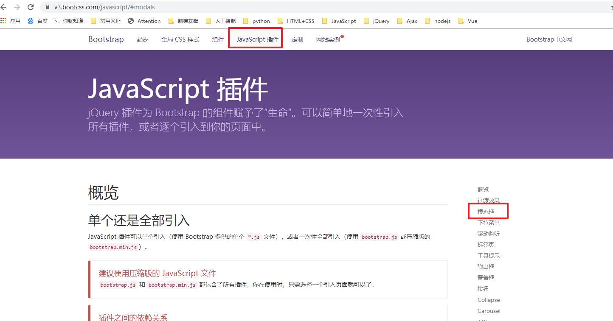
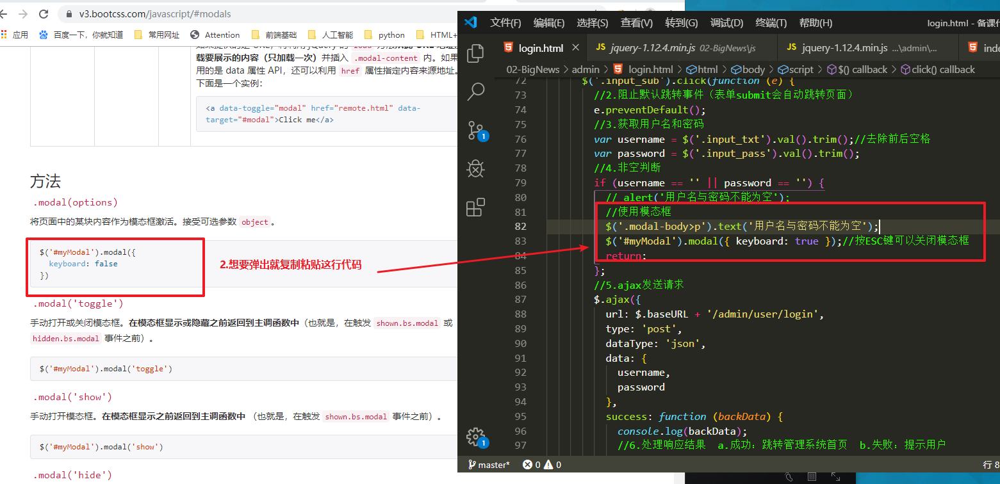
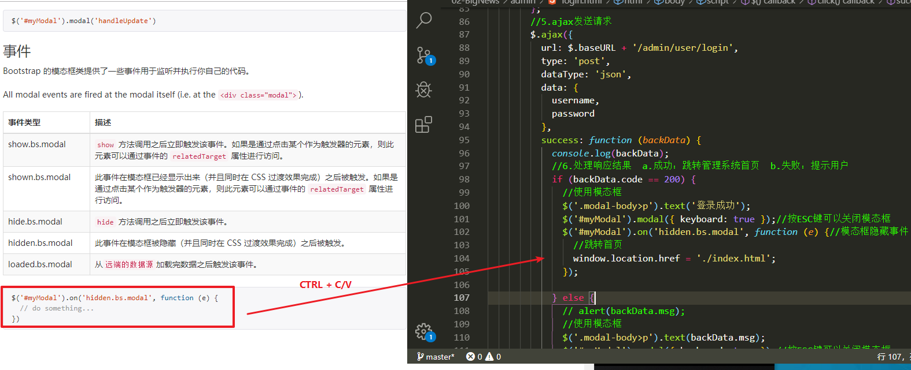

# 01-项目介绍


# 02-登录功能


## 1.1-登录功能业务逻辑

```html
<script>
    //入口函数
    $(function () {
      /* 登录功能思路
      1.给登录按钮注册点击事件
      2.阻止默认跳转事件（表单submit会自动跳转页面）
      3.获取用户名和密码
      4.非空判断
      5.ajax发送请求
      6.处理响应结果   a.成功：跳转管理系统首页    b.失败：提示用户
       */
      //1.给登录按钮注册点击事件
      $('.input_sub').click(function (e) {
        //2.阻止默认跳转事件（表单submit会自动跳转页面）
        e.preventDefault();
        //3.获取用户名和密码
        var username = $('.input_txt').val().trim();//去除前后空格
        var password = $('.input_pass').val().trim();
        //4.非空判断
        if (username == '' || password == '') {
          alert('用户名与密码不能为空');
          return;
        };
        //5.ajax发送请求
        $.ajax({
          url: $.baseURL + '/admin/user/login',
          type: 'post',
          dataType: 'json',
          data: {
            username:username,
            password:password
          },
          success: function (backData) {
            console.log(backData);
            //6.处理响应结果  a.成功：跳转管理系统首页  b.失败：提示用户
            if(backData.code == 200){
               alert('登录成功');
              //跳转首页
              window.location.href = './index.html';
            }else{
              alert(backData.msg);
            }
          }
        });  
      });
    });
  </script>
```

## 1.2-bootstrap模态弹出框使用

* 传送门：https://v3.bootcss.com/javascript/#modals




* 1.选择你想要的模态框，将HTML代码复制粘贴到你的项目HTML中（可以直接放到最后面）


* 2.弹出模态框



* 3.登录成功，模态框消失之后跳转首页



```html
<!-- 模态框 -->
  <div id="myModal" class="modal fade" tabindex="-1" role="dialog">
    <div class="modal-dialog" role="document">
      <div class="modal-content">
        <div class="modal-header">
          <button type="button" class="close" data-dismiss="modal" aria-label="Close"><span
              aria-hidden="true">&times;</span></button>
          <h4 class="modal-title">友情提示</h4>
        </div>
        <div class="modal-body">
          <p></p>
        </div>
        <div class="modal-footer">
          <button type="button" class="btn btn-primary" data-dismiss="modal">确认</button>
        </div>
      </div><!-- /.modal-content -->
    </div><!-- /.modal-dialog -->
  </div><!-- /.modal -->
```

# 04-退出登录功能

