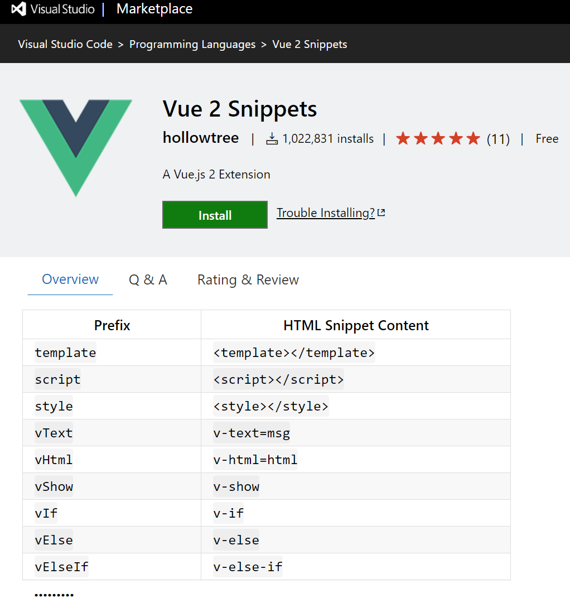
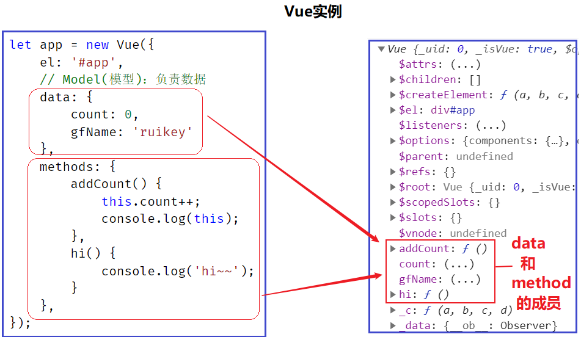
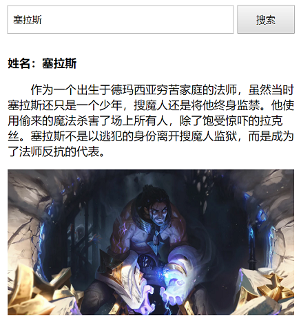
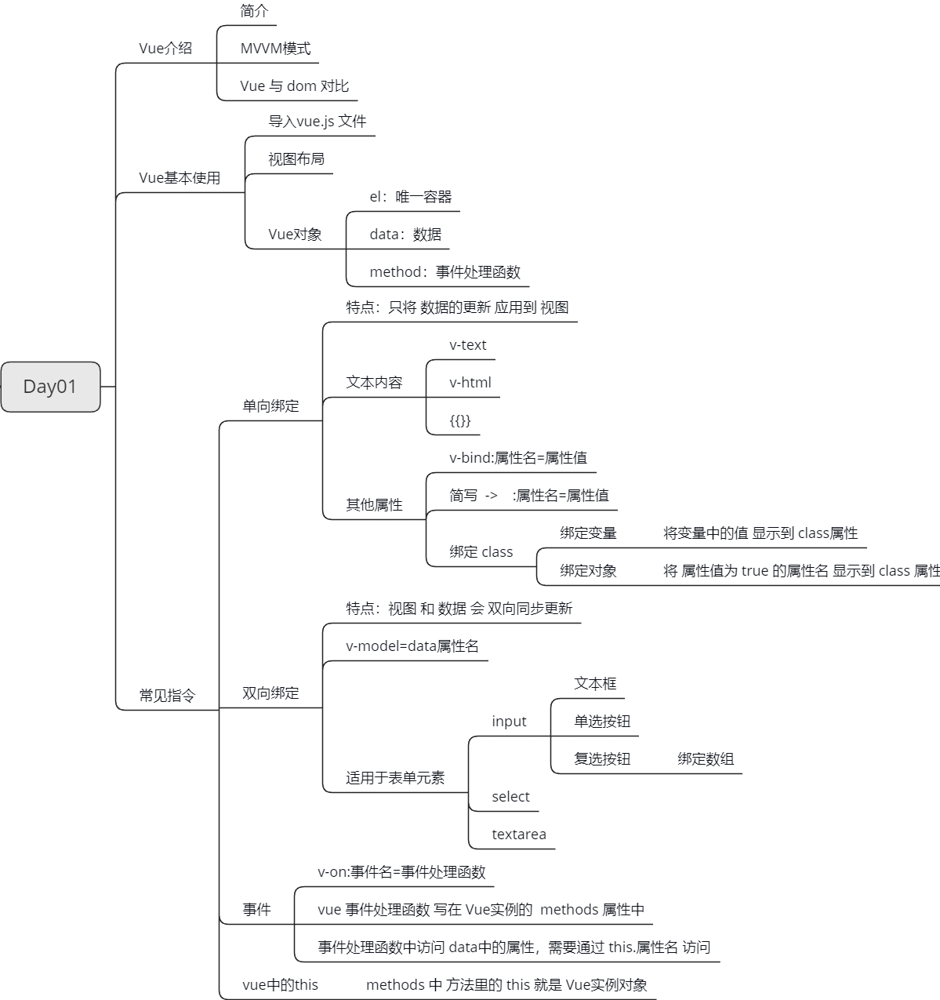
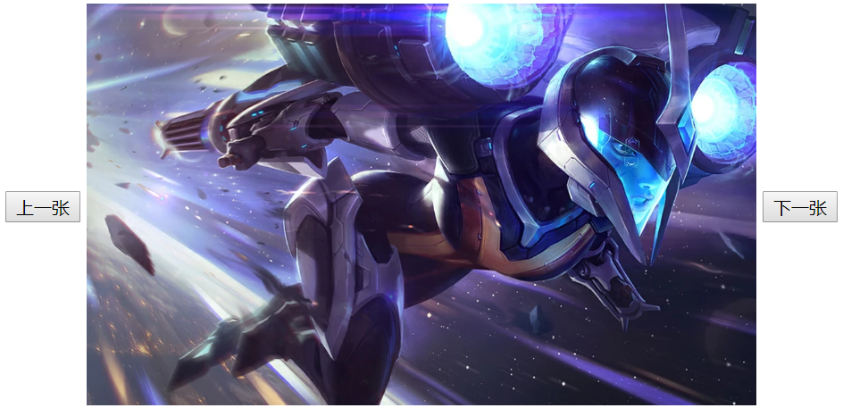

## 一.核心内容

### 1.推荐插件安装

+ vscode有二个常用插件：vetur，Vue 2 Snippets
  + vetur:让一些vue的关键字能高亮显示，还能进行一些语法的检测。
    + 语法错误检查，包括 CSS/SCSS/LESS/Javascript/TypeScript等
    + 语法高亮，包括 html/css/sass/scss/less/js/ts等

+ Vue 2 Snippets：能在平时写代码过程中提示功能更强大,对vue的语法有提示
  + 官网地址(里面列出了相关提示快捷词)： [https://marketplace.visualstudio.com/items?itemName=hollowtree.vue-snippets](https://marketplace.visualstudio.com/items?itemName=hollowtree.vue-snippets) 

    


### 2.vue.js是啥

#### 2.1 简介

+ 官网：https://cn.vuejs.org/v2/guide/

+ 概念：不是一个新的语言，而是一个 比 webapi 更方便的 js框架，目的就是让开发者更多关心业务和数据，而不是 dom操作本身。

+ 特点：
  + 轻量级、高性能、组件化的 MVVM 框架，轻松易上手
  + 双向数据绑定(数据驱动的 Web界面框架)
  + 指令
  + 插件化
  
  
  
#### 2.2 MVVM 模式

+ MVVM 模式
    + MVVM是Model-View-ViewModel的简写：模型 - 视图 - 视图模型 

  

    + **模型** 指的是 数据
    + **视图** 指的是 页面
    + **视图模型** View 和 Model 的桥梁，是 mvvm模式 的核心
      + 负责两个工作：
      + 工作1：将 **模型** 转化成 **视图**：将后端传递的数据转化成所看到的页面
      + 工作2：将 **视图** 转化成 **模型**：将所看到的页面转化成后端的数据
      + 如果 两个工作 都做，就是 **双向数据绑定**
      + 如果 只做 工作1，就是 **单向数据绑定**


#### 2.2 vue 与 dom 对比

> 我们通过 vue 和 dom 对比 来看看 声明是 MVVM 模式

+ webapi 获取和操作

```html
<input type="text" id="usrtName"/>
<p id="content">您输入了:</p>

<script>
    // 1.获取 dom 对象
    let txtName = document.getElementById("usrtName");
    let pCont = document.getElementById("content");
    
    // 2.实时显示数据 到 p 标签
    txtName.oninput = function () {
        pCont.innerText = "您输入了:" + txtName.value
    }
 </script>
```

+ vue 获取和操作

``` html
<!-- View(视图)：html代码，负责显示 -->
<div id="app">
    <input type="text" v-model="msg">
    <p>您输入了:{{msg}}</p>
</div>


<script src="https://cdn.jsdelivr.net/npm/vue/dist/vue.js"></script>

<script>
// ViewModel(视图模型)：Vue对象，负责双向数据绑定， 而 Vue框架已经帮我们实现
 new Vue({
    el: "#app",
    // Model(模型)：负责数据
    data: {
        msg: "hello"
    }
});
</script>
```

> **小结：** 
>
> 数据一旦发生改变，页面上显示也会发生改变
> 这个过程 由 Vue 来自动完成，不需专门编写修改页面显示的代码了~~~


### 3.vue 基本使用

> 三步：1.导vue.js    2.视图布局    3. Vue对象

#### 3.1 导入 Vue js文件

+ 开发版：包含 完整的 警告和调试模式 [下载地址](https://cn.vuejs.org/js/vue.js)
+ 生产版：删除了警告，压缩了内容 [下载地址](https://cn.vuejs.org/js/vue.min.js)
+ CDN(内容分发网络)：可以理解成 共享服务器，可用在自己网站中使用 它的 文件地址
  + 开发学习，最新版本：【https://cdn.jsdelivr.net/npm/vue/dist/vue.js】
  + 生产环境，明确版本号：【https://cdn.jsdelivr.net/npm/vue@2.6.11】

```html
<script src="https://cdn.jsdelivr.net/npm/vue/dist/vue.js"></script>
```


#### 3.2 视图布局

+ 页面上 必须 有一个 vue 视图容器

```html
<!-- 布局 -->
<div id="app">
    {{ message }} <!--插值表达式-->
</div>
```


#### 3.3 Vue对象

+ 在页面中创建的 就是 Vue 对象，扮演着 视图 与 模型 的桥梁角色

+ 两个属性：

  + **el 属性**：视图 选择器，作为 vue 视图显示的容器，确定 vue 的范围

    ​                 可以是任意 选择器 (id/类/元素......)，但**不能**是 **html 和 body**

  + **data 属性**：存放数据的地方，本质上就是一个对象，对象里的成员都可以在视图中使用

```html
<script>
let app = new Vue({
    el: '#app', 
    data: {
        message: '讨厌，死鬼~~~',
        dog:{
            name:'ruikey',
            age:2,
            gender:false
        }
    }
});
</script>
```

+ Vue程序 关系图


#### 小结： 三步法

+ 导包  - 将 vue.js 引入到 html页面

+ 布局 - 写好页面标签

+ Vue实例化 - 创建 vue 实例对象，与页面元素绑定


```html
<!DOCTYPE html>
<html lang="en">

<head>
    <meta charset="UTF-8">
    <meta name="viewport" content="width=device-width, initial-scale=1.0">
    <meta http-equiv="X-UA-Compatible" content="ie=edge">
    <title>Document</title>
</head>

<body>
    <!-- 基本使用分为三步： 1：导包；2：布局；3：实例化-->

    <!-- 2.布局 -->
    <div id="app">
        <!-- vue的一个插值语法，相当于挖个坑，用下面的就是值来填上 -->
        {{ message }}
    </div>

    <!-- 1.导包(开发环境的包) -->
    <script src="https://cdn.jsdelivr.net/npm/vue/dist/vue.js"></script>
    <script>
        //3.实例化
        // ViewModel(视图模型)：Vue对象，负责双向数据绑定， 而 Vue框架已经帮我们实现
        let app = new Vue({
            el: '#app',
            // Model(模型)：负责数据
            data: {
                message: 'Hello Vue!'
            }
        });
    </script>
</body>

</html>
```

### 4.常见指令1文本与单双向绑定

+ **Vue指令**：就是标签上的一个自定义属性，只不过这个属性是vue定义的

> 如何改变一个标签里的内容呢？下面为大家介绍几个 常见 显示用的 指令

#### 4.1 v-text(单向绑)

+ **文本内容设置：**相当于 **innerText**，用来将数据 显示到 所在标签中

+ 语法：

  + 标签指令  `<span v-text="msg"></span>`，用 msg **替换掉** 所在标签的内容
  + 插值语法  `<span>hi,{{msg}},天气不错~！</span>` ，将 msg **插入到** 所在标签 指定位置

  ```html
  <div id="app" >
      <div v-text='msg1'>汪汪汪</div>
      <div> hi,{{ msg2 }},天气不错~！</div>
  </div>
  
  <script src="https://cdn.jsdelivr.net/npm/vue/dist/vue.js"></script>
  <script>
      let app = new Vue({
          el: '#app',
          data: {
              msg1: '<h1>讨厌~</h1>',
              msg2: '<h1>死鬼~</h1>'
          }
      });
  </script>
  ```

+ 特点：

  + 两者都不解析 html
  + 跟随数据发生改变(通过 控制台 console 直接修改 `app._data.message = 新值` 可以观察)
  + 单向绑定：只从 model 拿数据显示，自己如果被修改，不会影响 model 中的数据

+ 补充：

  + 标签指令 和 插值语法 其实 就是 在 html标签中 写 js 代码
  + 也就意味着，不仅仅只能写  data 中的 属性，只要最终结果是一个数据，就可以显示

  ```html
  <div id="app">
      <!-- 1.加法运算表达式 -->
      <div v-text="age + 123"></div>
      <!-- 2.变量用法 -->
      <div>我女朋友就是：{{gfName}}</div>
      <!-- 3.对象用法 -->
      <div>宠物：{{dog.name}}</div>
      <!-- 4.三元表达式用法 -->
      <div>性别：{{dog.gender?"公":"母"}}</div>
      <!-- 5.函数返回值 -->
      <div v-text="hi()"></div>
  </div>
  
  <script>
   let app = new Vue({
       el: '#app',
       // Model(模型)：负责数据
       data: {
           age: 10,
           msg: '讨厌，死鬼~',
           gfName:'你',
           dog:{
               name:'ruikey',
               age:2,
               gender:false
       	},
           hi(){
               return 'hi~';
           }
       }
  });
  </script>
  ```


#### * 课堂小彩蛋

> 问题：如果 一个标签 同时用了 两种 语法呢，最终 在 div 中显示哪一个呢？
>
> 选项：1.'讨厌~'   2.'死鬼~'    3.都不显示

```html
<div id="app" v-text='msg1'>
    {{ msg2 }} 
</div>

<script src="https://cdn.jsdelivr.net/npm/vue/dist/vue.js"></script>
<script>
    let app = new Vue({
        el: '#app',
        data: {
            msg1: '讨厌~',
            msg2: '死鬼~'
        }
    });
</script>
```

+ 结论：**指令内容** 覆盖 **插值语法内容**


####　4.2 v-html(单向绑)

+ 相当于 **innerHTML**

+ 语法：
  + 标签指令  `<span v-html="msg"></span>`，用 msg **替换掉** 所在标签的内容

```html
<div id="app" >
    <div v-html='msg1'>汪汪汪</div>
</div>

<script src="https://cdn.jsdelivr.net/npm/vue/dist/vue.js"></script>
<script>
    let app = new Vue({
        el: '#app',
        data: {
            msg1: '<h1>讨厌~</h1>'
        }
    });
</script>
```

####　4.3 v-model(双向绑)

##### 4.3.1 双向绑定与文本框

> 如果想将 视图上的内容，设置给 Model呢？比如，将 文本框的内容 设置给 Model。

+ 语法：
  + 标签指令  `<input type="text" v-model="msg"/>`，监听 标签的 内容，以更新数据
  + 适用元素：**input / textarea / select** 等
  + data中的初始值会设置给元素

```html
<script src="https://cdn.jsdelivr.net/npm/vue/dist/vue.js"></script>

<div id="app">
    <input type="text" v-model="msg"/> <!-- 与 msg 属性值 双向绑定-->
    <div v-text="msg"></div> <!--获取 msg 属性的值显示-->
</div>

<script>
    let app = new Vue({
        el: '#app',
        data: {
            msg: '讨厌，死鬼~'
        }
    });
</script>
```

+ 执行过程：
  + a.当页面刚打开时，vue 把 data.msg 中的值 设置给了 input 和 div
  + b.当我们修改 input 中的值时:
    + 会立即更新到 data.msg 中，修改了数据
    + 数据一旦改变，就会立即更新到关联的 div 中


######　* 课堂小彩蛋

> 问题：如果 直接 修改 data.msg 的值， input 和 div 中的值 哪个会改变？
> 选项：1.input   2.div   3.input 和 div


##### 4.3.2 单选框

```html
<h5>你愿意嫁给我吗？（单选按钮）</h5>
<input type="radio" name="radio" value="1" v-model="will">Yes,I do
<input type="radio" name="radio" value="2" v-model="will">No, fx off~
<h5>回答：{{will}}</h5>

<script src='./vue.js'></script>
<script>
    new Vue({
        el: '#app',
        data: {
            will: 1 // 设置默认值
        }
    })
</script>
```


##### 4.3.3 下拉框

+ 默认值：设置 某个 选项的 value 值 在 绑定的属性中

```html
<h5>你祖籍哪的呢？（下拉框）</h5>
<div id='app'>
    <select v-model="provs">
        <option value="湖北省id">湖北省</option>
        <option value="湖南省id">湖南省</option>
        <option value="广东省id">广东省</option>
    </select>
	<h1>你的选择：{{provs}}</h1>
</div>

<script src='./vue.js'></script>
<script>
    new Vue({
        el: '#app',
        data: {
            provs: "湖南省id" // 设置默认值
        }
    })
</script>
```

##### 4.3.4 复选框

+ 注意：复选框由于 可以多选，有多个值，所以 需要用 **数组** 来做绑定
+ 默认值：设置多个 复选框value值 在数组中

```html
<div id='app'>
    <h5>你看中我什么了？（复选按钮） - {{ans}}</h5>
    <input type="checkbox" name="chk" value="1" v-model="ans">帅气
    <input type="checkbox" name="chk" value="2" v-model="ans">海拔
    <input type="checkbox" name="chk" value="3" v-model="ans">单手开法拉第的才能

</div>

<script src='./vue.js'></script>
<script>
    new Vue({
        el: '#app',
        data: {
            ans:[1,2]
        }
    })
</script>
```


### 5.常见指令2事件绑定

####　5.1 v-on(事件绑定)

> vue 也有一套类似dom的事件监听机制，事件名差不多，但有点差别

+ 语法：
  + 绑定事件：
    + 标签指令：`<标签名 v-on:事件名="事件方法名或js代码"></标签名>`
    + 简        写：`<标签名 @事件名="事件方法名或js代码"></标签名>` ，**推荐**
  + 编写 Vue 方法
    + Vue 中的方法，写在 methods 属性中，注意：vue 方法中 需要通过 this  访问 data 数据

```html
<script src="https://cdn.jsdelivr.net/npm/vue/dist/vue.js"></script>

<div id="app">
    <div id='showCount' v-text='count'></div>
    
    <!-- v-on:事件名="一句话简短js" -->
    <button v-on:click="addCount">点我</button>
    <button v-on:dblclick="addCount">双击我</button>
    <button v-on:mouseover="addCount">鼠标移入我</button>

    <!-- 简写@,推荐后面都用简写 -->
    <button @click="addCount2">点我</button>
    <button @dblclick="addCount2">双击我</button>
    <button @mouseover="addCount2">鼠标移入我</button>
</div>

<script>
    let app = new Vue({
        el: '#app',
        data: {
            count: 0,
        },
        // 事件绑定的方法，都放在 methods 属性中
        methods: {
            addCount() {
                console.log('addCount');
                // vue 方法中 访问 data 里的值，需要 加 this。(html标签中访问data 不需要)
                this.count++;
            }
        },
    });
</script>
```

##### 5.2.1 绑定 带参数的 方法

+ 语法：
  + `<标签名 v-on:事件名="事件方法名(实参)"></标签名>`
  + `<标签名 @事件名="事件方法名(实参)"></标签名>` 

```html
<script src="https://cdn.jsdelivr.net/npm/vue/dist/vue.js"></script>

<div id="app">
    <div id='showCount' v-text='count'></div>

    <!-- 简写@,推荐后面都用简写 -->
    <button @click="addCount(2)">点我</button>
</div>

<script>
    let app = new Vue({
        el: '#app',
        data: {
            count: 0,
        },
        // 事件绑定的方法，都放在 methods 属性中
        methods: {
            addCount(num) {
                this.count+=num;
            }
        },
    });
</script>
```


##### * 练习 商品数量

> 要求：点击 加号，数字 +1 ，点击 减号，数字 -1（不能小于0）


+ 代码
  + 加号按钮： 点击事件中 直接 将 变量 +1
  + 减号按钮：点击事件中 绑定 方法，在方法中 判断后 将变量 -1

```html
<div id='app'>
    <button @click="num++">+</button>
    <input style="width: 30px;text-align: center;" type="text" v-model="num"/>
    <button @click="jian">-</button>
</div>
<script src='./vue.js'></script>
<script>
    new Vue({
        el: '#app',
        data: {
            num: 0
        },
        methods: {
            jian() {
                if (this.num > 0) {
                    this.num--
                }
            }
        }
    })
</script>
```


#### 5.2 vue中的this

> 在 vue 的方法中 ，为什么要通过 this才能访问 data中的数据呢？这个 this 到底是谁？

+ 概念：
  + **methods 中 方法里的 this 就是 Vue实例对象**
+ 两个用法：
  + methods里的方法中 访问 data ：this.data
  + methods中的 A方法 调用  methods 中的 B方法 ： this.B()
  + 注意：html 标签中 访问 data数据，不需要通过 this 访问

```html
<script src="https://cdn.jsdelivr.net/npm/vue/dist/vue.js"></script>
<div id="app">
    <!-- 注意：html标签中 不需要 加 this 就可以 访问 data 和 method -->
    <div id='showCount' v-text='count'></div>
    <button @click="addCount">点我啊</button>
</div>

<script>
    let app = new Vue({
        el: '#app',
        // Model(模型)：负责数据
        data: {
            count: 0,
            gfName: 'ruikey'
        },
        methods: {
            addCount() {
                this.count++;
                console.log(this);
            },
            hi() {
                console.log('hi~~');
                this.addCount();// 访问 method 中的 另1个方法，也要加 this
            }
        },
    });
</script>
```

+ 原理：
  + 在 Vue 实例 data 和 method 的 成员 其实 都直接添加到 了 Vue实例中




##### * 课堂小彩蛋

> 问题：关于vue 中 this 描述，错误的是：

+ a. Vue 实例 data 和 method 的 成员 其实 都直接添加到 了 Vue实例中
+ b. method 中 要访问 data数据，需要通过 this 访问
+ c. html 标签中 访问 data数据，不需要通过 this 访问
+ d. html 标签中 访问 data数据，需要通过 this 访问


#### 5.3 v-on常用修饰符

> 如何控制事件只在某些特别条件下触发呢？
> 在 Vue 中，可以 为 事件进行 “修饰”

+ 三种常见修饰符：
  + @事件名.stop = "事件处理函数"         阻止冒泡
  + @事件名.prevent="事件处理函数"      阻止默认事件
  + @keyup.enter="事件处理函数"            按键盘回车触发

##### 5.3.1 阻止冒泡

> webapi 中，通过 事件参数 event.stopPropagation() 来阻止冒泡，而 vue 中 有更简单语法

+ 语法：` @事件名.stop = "事件处理函数"  `

```html
<div id="app">
	<div class="box1" @click.stop="box1Click">box1</div>
</div>
<script src="./vue.js"></script>
<script>
    new Vue({
        el: "#app",
        methods: {
            box1Click() {
                alert("这是box1");
            }
        }
    })
</script>
```


##### 5.3.2 阻止默认事件

> webapi 中，通过 事件参数 event.preventDefault() 来阻止默认行为，而 vue 中 有更简单语法

+ 语法：` @事件名.prevent= "事件处理函数"  `      

```html
<div id="app">
    <!--超链接 不会跳转了-->
	<a href="http://www.baidu.com" @click.prevent="aClick">讨厌，死鬼~~</a>
</div>

<script src="./vue.js"></script>
<script>
    new Vue({
        el: "#app",
        methods: {
            aClick() {
               alter('要死啊~~~');
            }
        }
    })
</script>
```


##### 5.3.3 串联修饰符

> Vue中，如果同时要阻止事件冒泡 和 默认行为，可以用 串联修饰符 语法，同时阻止冒泡和默认。

+ 语法：` @事件名.stop.prevent= "事件处理函数"  `      

```html
<div id="app">
    <div id="box1" @click="box1Click">
    	<!--超链接 不会跳转了，也不会事件冒泡了-->
		<a href="http://www.baidu.com" @click.stop.prevent="aClick">讨厌，死鬼~~</a>
    </div>
</div>

<script src="./vue.js"></script>
<script>
    new Vue({
        el: "#app",
        methods: {
            box1Click(){
                alter('点我孩子 就是点我~~！');
            },
            aClick() {
               alter('要死啊~~~');
            }
        }
    })
</script>
```


##### 5.3.4 回车键事件

> 业务中，经常出现输入后按回车键触发事件函数，在Vue中相当简单


+ 语法：` @keyup.enter= "事件处理函数"  ` 

```html
<div id="app">
    <!-- 键盘监听事件修饰符.enter 只有回车时才响应 -->
	<input type="text" @keyup.enter="inputData" v-model="inputStr">
</div>

<script src="./vue.js"></script>
<script>
    new Vue({
        el: "#app",
        data:{
            inputStr:'',
        },
        methods: {
            inputData() {
               alert('你输入了：' + this.inputStr)
            }
        }
    })
</script>
```


### 6.常见指令3-其他

#### 6.1 v-bind(其他属性)

> 在前面我们知道 如何 设置 标签的 text文本 或 html文本，但如果要修改 标签的其他属性呢？

+ 语法： `v-bind:属性名=msg` 
+ 简写： `:属性名=msg`
+ 注意：是单向绑定

```html
<style>
    .active {
        color: red
    }
</style>

<div id="app">
    <h1>请输入图片地址</h1>
    <input type="text" v-model="imgsrc" />
    <h1>请输入图片标题</h1>
    <input type="text" v-model="imgtit" />
    
    <hr />
    <!--绑定 图片路径 和 title-->
     <!--【v-bind】-->
     <!--【简写】-->
</div>

<script src="./vue.js"></script>
<script>
    let app = new Vue({
        el: "#app",
        data: {
            imgsrc: './imgs/1.jpg',
            imgtit:'优秀死鬼'
        }
    });
</script>
```

+ PS：v-bind 指令 中的写法
  + 变量
  + 基本运算
  + 三元表达式


##### * 案例 搜索英雄人物

> 要求：输入英雄名字，在数组中找出英雄信息，并 显示 介绍和图片



+ 代码

```html
<div id="app">
    <div class="search">
        <!-- 键盘修饰符   .键码  只有当按下该键才执行 -->
        <input type="text" placeholder="请输入王者名称" v-model="inputValue" @keyup.enter="search">
        <button @click="search">搜索</button>
    </div>
    
    <div class="info">
        <h4>姓名：{{heroList[heroIndex].name}}</h4>
        <div class="story" v-text="heroList[heroIndex].story">英雄故事</div>
        
    </div>
</div>

<script src="./vue.js"></script>
<script>
    new Vue({
        el: "#app",
        data: {
            inputValue: "塞拉斯", // 默认英雄
            heroIndex: 0, // 英雄下标
            //英雄数据
            heroList: [{
                "name": "塞拉斯",
                "story": "作为一个出生于德玛西亚穷苦家庭的法师...",
                "img": "http://ossweb-img.qq.com/images/lol/web201310/skin/big517000.jpg",
            }, {
                "name": "派克",
                "story": "在比尔吉沃特的屠宰码头...",
                "img": "http://ossweb-img.qq.com/images/lol/web201310/skin/big555000.jpg",
            }, {
                "name": "卡莎",
                "story": "在孩童时期就被虚空夺走的卡莎...",
                "img": "http://ossweb-img.qq.com/images/lol/web201310/skin/big145000.jpg",
            }],
        },
        methods: {
            search() {
                // 遍历数组，找出 同名英雄 下标，并设置给 this.heroIndex
                for (let i = 0; i < this.heroList.length; i++) {
                    // 找出 第1个 包含 关键字 的元素
                    if (this.heroList[i].name.indexOf(this.inputValue) != -1) {
                        // 保存 当前元素 下标
                        this.heroIndex = i
                        return;
                    }

                }
            }
        }
    })
</script>
```


#### 6.2 v-bind(class绑定)

##### 6.2.1 绑定变量

> class 属性中可能有 一个 或 多个 选择器名，可以用一个变量保存 并 绑定 到 class属性

+ 语法：`v-bind:class="变量名"`  简写：` :class="变量名"`

+ 代码：

```html
<style>
    .error{
        color:red;
        padding:15px;
    }
    .bigFont{
        font-size:50px;
    }
</style>

<!--注意：此处绑定的是 【变量】-->
<div :class="red">hi~~!</div>

<script src="./vue.js"></script>
<script>
    new Vue({
        el: "#app",
        data: {
            red: 'error bigFont'
        }
    })
</script>
```


##### 6.2.2 绑定对象

> class 属性中可能有 一个 或 多个 选择器名，但要根据条件显示，此时，可以用 **绑定对象** 来解决

+ 语法： `v-bind:class={类选择器名1:布尔值变量,类选择名2:布尔值变量 ....}`

+ 简写：`:class={类选择器名1:布尔值变量,类选择名2:布尔值变量 ....}`

  ​             如果 对应 类选择器名 后的 bool值是t rue，就会显示选择器；是false，则不会显示在 class属性中

```html
<style>
    .error{
        color:red;
        padding:15px;
    }
    .bigFont{
        font-size:50px;
    }
</style>
<div id="app">
    <!--注意：此处绑定的是 【类选择器名称】，由bool变量决定这个 选择器是否 添加到 class 属性中-->
    <div :class="{ error: isOk, bigFont: hasError }"></div>
</div>
<script src="./vue.js"></script>
<script>
    let app = new Vue({
        el: "#app",
        data: {
            isOk: true,
            hasError: false
        }
    });
</script>
```

+ 实际开发时，我们通常直接 把对象 添加到 data 中

```html
<style>
    .error{
        color:red;
        padding:15px;
    }
    .bigFont{
        font-size:50px;
    }
</style>

<div id="app">
    <!--2.为 class设置 对象{类名1:布尔值变量，类名2:布尔值变量}-->
    <!--注意：此处绑定的是 【类选择器名称】，由bool变量决定这个 选择器是否 添加到 class 属性中-->
    <div :class="divClass">hi~~!</div>
</div>
<script src="./vue.js"></script>
<script>
    new Vue({
        el: "#app",
        data: {
            divClass: {
                error: true,
                bigFont: true
            }
        }
    })
</script>
```


##### * 练习 切换显示

> 要求：点击按钮，字体变红放大；再次点击，则还原。


```html
<style>
    .error {
        color: red
    }

    .bigFont {
        font-size: 28px;
    }
</style>

<body>
    <div id="app">
        <button @click="changeClass">点我变色 </button>
        <div v-bind:class="{error:isShow,bigFont:isShow}">讨厌，死鬼~~~</div>
    </div>
    
    <script src="./vue.js"></script>
    <script>
        new Vue({
            el: "#app",
            data: {
                isShow: false
            },
            methods: {
                changeClass() {
                    this.isShow = !this.isShow
                }
            }
        })
    </script>
</body>
```


### 7.今日总结



### 二.核心案例

#### 1.图片轮播

> 要求：点击 按钮 切换 图片显示



```html
<div id="app">
    <button @click="prev">上一张</button>
    
    <button @click="next">下一张</button>
</div>


<script src="./vue.js"></script>
<script>
    new Vue({
        el: "#app",
        data: {
            arr: ["http://ossweb-img.qq.com/images/lol/web201310/skin/big145000.jpg",
                "http://ossweb-img.qq.com/images/lol/web201310/skin/big145001.jpg",
                "http://ossweb-img.qq.com/images/lol/web201310/skin/big145014.jpg",
                "http://ossweb-img.qq.com/images/lol/web201310/skin/big145015.jpg",
                "http://ossweb-img.qq.com/images/lol/web201310/skin/big145016.jpg",
                "http://ossweb-img.qq.com/images/lol/web201310/skin/big145017.jpg"
            ],
            curIndex: 0
        },
        methods: {
            prev() {
                this.curIndex > 0 ? this.curIndex-- : alert('已经是第一张啦~~~');
            },
            next(){
                this.curIndex < this.arr.length-1 ? this.curIndex++ : alert('已经最后一张啦~~~');
            }
        }
    })
</script>
```


### 三.扩展内容

#### 1. v-on事件修饰符

- `.stop` - 调用 `event.stopPropagation()`。
- `.prevent` - 调用 `event.preventDefault()`。
- `.capture` - 添加事件侦听器时使用 capture 模式。
- `.self` - 只当事件是从侦听器绑定的元素本身触发时才触发回调。
- `.{keyCode | keyAlias}` - 只当事件是从特定键触发时才触发回调。
- `.native` - 监听组件根元素的原生事件。
- `.once` - 只触发一次回调。
- `.left` - (2.2.0) 只当点击鼠标左键时触发。
- `.right` - (2.2.0) 只当点击鼠标右键时触发。
- `.middle` - (2.2.0) 只当点击鼠标中键时触发。
- `.passive` - (2.3.0) 以 `{ passive: true }` 模式添加侦听器

+ 示例

```html
<!-- 方法处理器 -->
<button v-on:click="doThis"></button>

<!-- 动态事件 (2.6.0+) -->
<button v-on:[event]="doThis"></button>

<!-- 内联语句 -->
<button v-on:click="doThat('hello', $event)"></button>

<!-- 缩写 -->
<button @click="doThis"></button>

<!-- 动态事件缩写 (2.6.0+) -->
<button @[event]="doThis"></button>

<!-- 停止冒泡 -->
<button @click.stop="doThis"></button>

<!-- 阻止默认行为 -->
<button @click.prevent="doThis"></button>

<!-- 阻止默认行为，没有表达式 -->
<form @submit.prevent></form>

<!--  串联修饰符 -->
<button @click.stop.prevent="doThis"></button>

<!-- 键修饰符，键别名 -->
<input @keyup.enter="onEnter">

<!-- 键修饰符，键代码 -->
<input @keyup.13="onEnter">

<!-- 点击回调只会触发一次 -->
<button v-on:click.once="doThis"></button>

<!-- 对象语法 (2.4.0+) -->
<button v-on="{ mousedown: doThis, mouseup: doThat }"></button>
```


