## 一.核心内容

### 1.条件与循环指令

#### 1.1 v-for(循环)

> 可以用 v-for 遍历 数据，并循环 生成 所在的标签

##### 1.1.1 遍历数组

+ 语法：`v-for="(item,index) in array`
+ 参数：可选
  + item - 数组的元素
  + index - 元素的下标
+ 注意：参数名可自己取

```vue
<div id="app">
    <ul>
        <li>遍历数组：</li>
        <li v-for="(item,index) in myArry">下标：{{index}} -> 值：{{item}}</li>
    </ul>
</div>

<script src="./vue.js"></script>
<script>
    let vm = new Vue({
        el: "#app",
        data: {
            myArry: ['P城', 'Y城', '军事基地', '研究所', 'G港']
        }
    });
</script>
```

+ 详解：v-for 会 根据数组 中的 元素 生成 自己所在的标签，添加到dom数中，在页面上显示

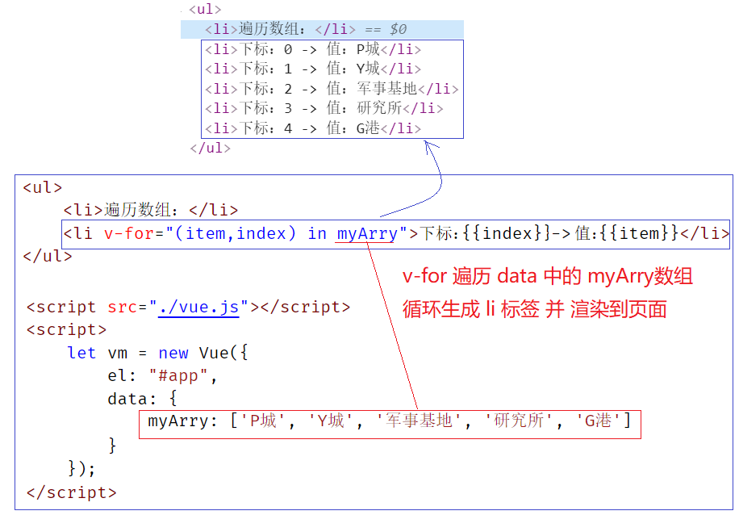

##### 1.1.2 遍历对象

+ 语法： `v-for="(value，key，index in object)`
+ 参数：可选
  + value - 对象属性值
  + key - 对象属性名
  + index - 对象属性序号(从0开始)

```vue
<div id="app">
    <ul>
        <li>遍历对象：</li>
        <li v-for="(value,key,index) in dogObj">{{value}} -> {{key}} -> {{index}}</li>
    </ul>
</div>

<script src="./vue.js"></script>
<script>
    let vm = new Vue({
        el: "#app",
        data: {
            dogObj: {
                name: "Ruiky",
                age: 2,
                gender: true
            }
        }
    });
</script>
```

##### 1.1.3 遍历字符串

+ 语法:`v-for="(item,index) in array`
+ 参数：可选
  + item - 数组的元素
  + index - 元素的下标

```html
<div id="app">
    <ul>
        <li>遍历字符串：</li>
        <li v-for="(str,index) in heroName">{{str}} ->{{index}}</li>
    </ul>
</div>

<script src="./vue.js"></script>
<script>
    let vm = new Vue({
        el: "#app",
        data: {
            heroName:'RuikyPuppy'
        }
    });
</script>
```


##### * 练习 英雄列表

> 要求：根据数组，生成列表，并实现 点击切换背景色

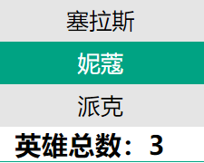

+ 难点：
  + 1.遍历时，将 元素下标 保存到 点击事件代码中，设置给 data 中的 下标变量
  + 2.class属性中，根据 下标变量 是否 等于 元素下标 来决定是否 添加 **active 类选择器**

```html
<style>
    /*完整样式表 ... */
</style>
<style>
    .active{
        color: #fff;
        background: #00a383 !important;
    }
</style>

<div id="app">
    <div class="content">
        <ul class="list">
                <li class="item" v-for="(item,index) in hero" @click="currIndex=index" :class="{active:currIndex==index}">
                    {{item.name}}
                </li>
                <li>
                    <h3>英雄总数：{{hero.length}}</h3>
                </li>
        </ul>
    </div>
</div>
<script src="vue.js"></script>
<script>
    new Vue({
        el: "#app",
        data: {
            currIndex: 0,
            hero: [{
                "id": "2",
                "name": "塞拉斯"
            }, {
                "id": "3",
                "name": "妮蔻"
            }, {
                "id": "1",
                "name": "派克"
            }]
        }
    })
</script>
```


#### 1.2 条件判断

> 有条件的渲染某些元素内容

##### 1.2.1 v-if 指令

+ 语法：`v-if="bool值 或 表达式"`，如果 是 true，则显示 **当前标签**，否则不显示
+ 需求：输入年龄 >= 18 就 显示 "正规盲人按摩"；否则隐藏。

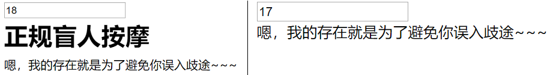

```html
<div id="app">
    <input type="text" placeholder="请输入年龄：" v-model="age">
    
    <div v-if="age>=18">正规盲人按摩</div>
    <div>嗯，我的存在就是为了避免你误入歧途~~~</div>
</div>
<script src="./vue.js"></script>
<script>
    new Vue({
        el: "#app",
        data: {
            age: 18
        }
    })
</script>
```

##### 1.2.2 v-else 指令

+ 语法：`v-else`

+ 注意：上一个兄弟元素 必须 使用了 `v-if` 或 `v-else-if`
+ 效果：当 `v-if` 或 `v-else-if` 不成立时，则 显示 `v-else` 所在的标签

+ 需求：输入年龄 >= 18 就 显示 "正规盲人按摩"；否则显示 "提示"

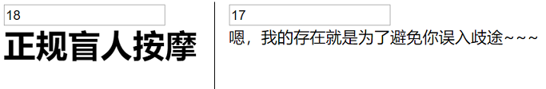

```html
<div id="app">
    <input type="text" placeholder="请输入年龄：" v-model="age">
    
    <div v-if="age>=18"><h1>正规盲人按摩</h1></div>
    <div v-else>嗯，我的存在就是为了避免你误入歧途~~~</div>
</div>
<script src="./vue.js"></script>
<script>
    new Vue({
        el: "#app",
        data: {
            age: 18
        }
    })
</script>
```

##### 1.2.3 v-else-if 指令

+ 语法：`v-else-if="bool值 或 表达式"`，如果 是 true，则显示 **当前标签**，否则不显示
+ 注意：上一个兄弟元素 必须 使用了 `v-if` 或 `v-else-if`
+ 需求：输入成绩，>=90 ,  >=70 , < 70 显示不同文字

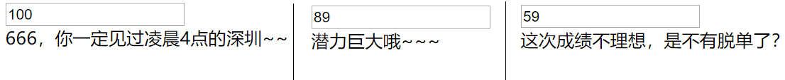

```html
<div id="app">
    <input type="text" placeholder="请输入相应成绩" v-model="score">
    
    <div v-if="score>90">666，你一定见过凌晨4点的深圳~~</div>
    <div v-else-if="score>70">潜力巨大哦~~~</div>
    <div v-else>这次成绩不理想，是不有脱单了？</div>
</div>
<script src="./vue.js"></script>
<script>
    new Vue({
        el: "#app",
        data: {
            score: 100
        }
    })
</script>
```

### 2.其他指令

#### 2.1  v-show 指令(了解)

+ 作用：根据条件 控制 标签是否显示 (display:none)

```html
<div id="app">
    <button @click="isShow=!isShow">隐藏或显示</button>
    <h1 v-show="isShow">我眼睛比你好看，因为，我的眼里有你~~</h1>
</div>

<script src="./vue.js"></script>
<script>
    new Vue({
        el: "#app",
        data: {
            isShow: true
        }
    })
</script>
```

+ 图解：

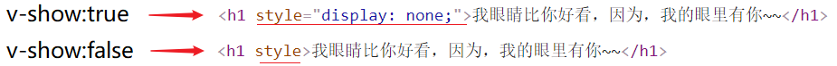


#### 2.2 v-show 和 v-if 区别

+ 特点：
  + v-show：在页面加载时 就创建 dom ，只是 通过 display 控制显示与否
  + v-if ：只有遇到 true 时，才 创建 dom ；变成 false 后，又 会移出 dom
+ 优劣
  + v-if  会 销毁 和 重建，开销比较大
  + v-show 只会创建一次，且 不会真的被销毁，开销比较小

##### * 课堂小彩蛋

> 当需要频繁切换 显示 和 异常 一个 div 时，我们用 哪个比较好呢？
>
> a.v-show
>
> b.v-if 

+ 经验：当需要频繁显示隐藏时，使用 v-show 比较好。


#### 2.3  v-cloak 指令(了解)

> 浏览器 加载 vue.js 执行 的过程 有可能 花较长时间，这时 页面上的 {{胡子语法}} 就会被普通用户看到。
> 我们可以通过 **v-cloak** 先把 包含胡子语法的标签隐藏起来。等 Vue.js 加载并执行完后，会再显示。

+ 问题：网络延迟，页面会显示 {{loverName}} 出来~~！
+ 效果：

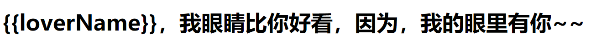

```html
<div id="app">
    <h1>{{loverName}}，我眼睛比你好看，因为，我的眼里有你~~</h1>
</div>

<script src="https://cdn.jsdelivr.net/npm/vue/dist/vue.js"></script>
<script>
    new Vue({
        el: "#app",
        data: {
            loverName: 'Lucy'
        }
    })
</script>
```

+ 解决
  + 添加 v-cloak 属性选择器
  + 为 包含 {{}} 的标签 添加 v-cloak 属性
  + 效果：

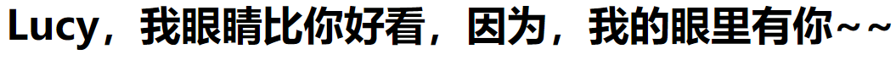

```html
<style>
    [v-cloak] {
        display: none;
    }
</style>

<div id="app">
    <h1 v-cloak>{{loverName}}，我眼睛比你好看，因为，我的眼里有你~~</h1>
</div>

<script src="https://cdn.jsdelivr.net/npm/vue/dist/vue.js"></script>
<script>
    new Vue({
        el: "#app",
        data: {
            loverName: 'Lucy'
        }
    })
</script>
```

+ 原理：vue.js 加载完毕后，会在处理完数据后，移除 所有 元素中 的 v-cloak 属性，此时，胡子语法已经变成数据了。

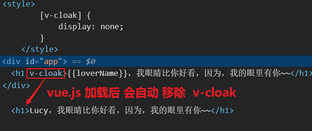


#### 2.4  v-once 指令(了解)

> vue 的特点是双向绑定，但偶尔有时候，某个元素的内容，只要在第一次 根据 data 数据生成；
> 之后 不管 data数据怎么改，都不要更新到 元素中。

+ 语法：`v-once` 为标签添加后，该标签只会被 vue 根据 data 渲染一次，之后 脱离 vue 管理

```html
<div id="app">
    <input type="text" v-model="loverName" />
    
    <!-- 只在 vue 第一次加载时，从 data 中取出数据，之后，不管怎么改data，此标签内容都不会变-->
    <h1 v-once>{{loverName}}，我眼睛比你好看，因为，我的眼里有你~~</h1>
    
    <!-- 改data，此标签内容会变-->
    <h1>{{loverName}}，我眼睛比你好看，因为，我的眼里有你~~</h1>
</div>

<script src="./vue.js"></script>
<script>
    new Vue({
        el: "#app",
        data: {
            loverName: 'Lucy'
        }
    });
</script>
```


#### 2.5  v-pre 指令(了解)

> 直接 跳过 标签中的 胡子语法

+ 语法： `v-pre`

```html
<div id="app">
    <!--跳过 胡子语法-->
    <h1 v-pre>{{loverName}}，我眼睛比你好看，因为，我的眼里有你~~</h1>
    <!--解析 胡子语法-->
    <h1>{{loverName}}，我眼睛比你好看，因为，我的眼里有你~~</h1>
</div>

<script src="./vue.js"></script>
<script>
    new Vue({
        el: "#app",
        data: {
            loverName: 'Lucy'
        }
    })
</script>
```

+ 结果：

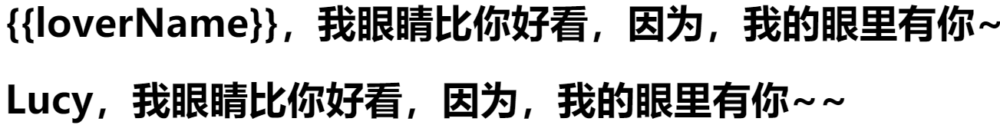


### 3.axios 基本使用

> 小巧易用的 http 请求 框架，它的 ajax 封装的 比 jquery 更优秀~~~

+ 官网：http://www.axios-js.com/zh-cn/docs/
+ 库地址：https://unpkg.com/axios/dist/axios.min.js

+ 特点：
  + 原生 ajax 太麻烦
  + jquery 功能太丰富（渣男），axios 只做 请求，无dom/bom操作（纯男）
  + axios 功能少，文件体积小，网络加载快；
  + axios 专注请求，关于请求的功能丰富（请求拦截、数据返回拦截等，以后讲）
  + axios 支持 promise
  + axios 支持 浏览器端 和 nodejs服务端

#### 3.1 get请求

+ 测试地址：https://autumnfish.cn/api/joke/list?num=10
+ 语法：
  + 不带参数 ` axios.get(url).then( ).catch( )`
  + 带参数
    + ` axios.get(url?参数).then( ).catch( )` 
    + `axios.get(url,{ 参数对象 }).then( ).catch( )`

```js
//get请求
axios.get('请求接口路径', 
         {
    		params: { ID: 12345 }
		 })
    .then(res=>{
    	console.log(res.data);
	})  
    .catch(err=>{
    	console.log(err.message);
	});
```

+ 注意：如果不用 箭头函数，那么 函数中的 this 将 得不到 Vue实例对象

#### 3.2 post请求

+ 测试地址：https://autumnfish.cn/api/user/reg       参数:   username 
+ 语法：
  + 不带参数 `axios.post(url).then( ).catch( )`
  + 带参数 `axios.get(url,{ 参数对象 }).then( ).catch( )`

```js
//post请求
axios.post('请求接口路径',          
           {
            firstName: 'James',
            lastName: 'Zou'
           })
    .then(res=>{
    	console.log("成功");
	})  
    .catch(err=>{
    	console.log("失败：" + err.message);});
```


#### 3.3 config配置模式

+ 语法：`axios({配置信息对象}).then( ).catch( )`
+ 配置信息对象：
  + method : 请求方式 get/post/...
  + url: 请求路径
  + data: post 参数
  + params：get 参数

```js
//axios(config)模式  
axios({
    	method: '请求方法如:post.get',
        url: '请求接口路径',
        data: {}, // post 数据
        params: {}  // get 数据
}).then(response=>{
    console.log("成功的处理");
})  
  .catch(error=>{
    console.log("错误的处理");
});
```

> 建议 以后开发时 使用 配置模式，企业多用此方式，比较灵活


### 4.Vue生命周期

#### 4.1 生命周期图

> 每个 **Vue 实例** 都有自己的生命 - 诞生到销毁，这个过程 就叫做 生命周期

+ Vue 实例 生命周期图：大家可以先看一下，必须要 马上理解和记忆，一步步学


#### 4.2 生命周期中的钩子

> “每个 **Vue 实例** 的生命中，都要要经过一系列的初始化过程——例如，需要设置数据监听、编译模板、将实例挂载到 DOM 并在数据变化时更新 DOM 等”
>
> “同时在这个过程中也会运行一些叫做**生命周期钩子**的函数，这给了开发者在不同阶段添加自己的代码的机会。”

+ Vue生命周期 8 大钩子，今天先学 第1个 和 第2个

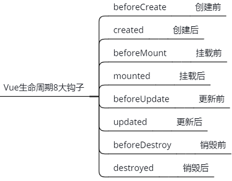

+ 语法：直接 将钩子函数 添加到 Vue 对象中

```html
<script src="./vue.js"></script>
<script>
    new Vue({
        el: "#app",
        data: {},
        beforeCreated(){
            // ....
        },
        created(){
            // ....
        }
        // 其他钩子函数....
    })
</script>
```


##### 4.2.1 beforeCreate

+ **Vue实例** 创建前调用
+ 特点：此时 el,data,methods... 都是undefined，所以还不能访问
+ 执行次数：只执行 1 次

```html
<div id="app">
    <ul>
        <li>遍历数组：</li>
        <li v-for="(item,index) in myArry">下标：{{index}} -> 值：{{item}}</li>
    </ul>
</div>

<script src="./vue.js"></script>
<script>
    let vm = new Vue({
        el: "#app",
        data: {
            myArry: ['P城', 'Y城', '军事基地', '研究所', 'G港']
        },
        beforeCreate() {
            console.log('---beforeCreate------');
            console.log(this.myArry); // undefined
        }
    });
</script>
```

##### 4.2.2 created(重要)

+ **Vue实例** 创建后调用
+ 特点：此时 el,data,methods... 都以创建赋值完毕，可以访问
+ 执行次数：只执行 1 次

```html
<div id="app">
    <ul>
        <li>遍历数组：</li>
        <li v-for="(item,index) in myArry">下标：{{index}} -> 值：{{item}}</li>
    </ul>
</div>

<script src="./vue.js"></script>
<script>
    let vm = new Vue({
        el: "#app",
        data: {
            myArry: ['P城', 'Y城', '军事基地', '研究所', 'G港']
        },
        beforeCreate() {
            console.log('---beforeCreate------');
            console.log(this.myArry); // undefined
        },
        created() {
            console.log('---create------');
            console.log(this.myArry); // Array
        }
    });
</script>
```

##### 4.2.3 二者功能场景

+ beforeCreate：一般用在 加载子组件 时 的 loading... 效果

+ created：等vue准备好后，可以用于取数据，比如 url 上参数，接口取值等

  ​                 相当于 window.onload ，**目前进入页面接口在这调用最合适**


## 二.核心案例

### 1.记事本

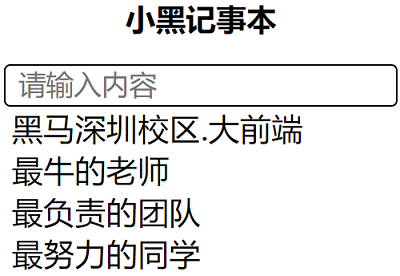

+ 参考代码

```html
<!-- 模板 -->
<div id="app">
    <h2>小黑记事本</h2>
    <input type="text" v-model="content"  placeholder="请输入内容" @keyup.enter="add" />
    <ul class='items'>
        <li class='item' v-for="(item, index) in list">{{item}}</l>
    </ul>
</div>


<!-- 开发环境版本，包含了有帮助的命令行警告 -->
<script src="https://cdn.jsdelivr.net/npm/vue/dist/vue.js"></script>
<!-- 编码 -->
<script>
  // 创建Vue实例
  var app = new Vue({
    el:"#app",
    data:{
        content:'', // 文本框内容
        list:[]     // 笔记数组
    },
    methods: {
        add(){ // 新增方法
            if(!this.content.trim()){ // 为空检查
                alert('不能为空~~~');
                return;
            }
            this.list.push(this.content); // 添加笔记到数组
            this.content = ''; // 文本框清空
        }
    },
  })
</script>
```


### 2.英雄列表与查询

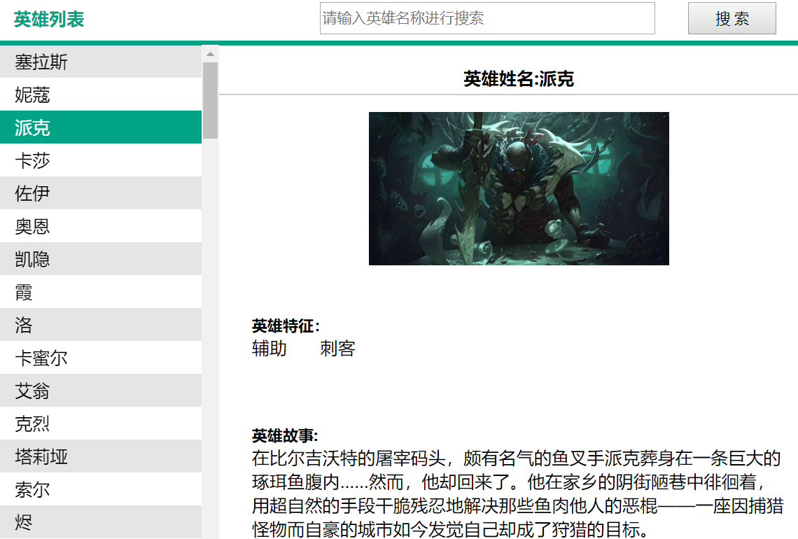


+ 参考代码

```html
  <div id="app">
    <!--页头-->
    <div class="nav">
      <span>英雄列表</span>
      <button class="btn" @click="search">搜 索</button>
      <input class="search" type="text" placeholder="请输入英雄名称" v-model="searchVal" @keyup.enter="search">
    </div>

    <div class="content" v-if="hasData">
      <!-- 左侧：人物列表 -->
      <ul class="list">
        <li class="item " :class="{active:currIndex==index}" @click="currIndex=index" v-for="(item,index) in hero">
          {{item.name}}
        </li>
      </ul>

      <!-- 右侧：人物详情 -->
      <div class="info">
        <div class="name">英雄姓名:{{hero[currIndex].name}}</div>
        <div class='img'>
          
        </div>
        <div class="tags">
          <h5>英雄特征：</h5>
          <span v-for="item in hero[currIndex].roles">{{item}}</span>
        </div>
        <div class="story" v-html="hero[currIndex].story">英雄故事</div>
      </div>
    </div>
    <div class="noData" v-else>暂无数据</div>
  </div>
  <script src="vue.js"></script>
  <script>
    new Vue({
      el: "#app",
      data: {
        // 搜索框英雄名称
        searchVal: "",
        // 搜索是否有数据
        hasData: true,
        // 当前选中英雄的下标
        currIndex: 0,
        hero: [{
          "id": "Sylas",
          "tags": "melee_tag mage_tag charge_tag charge_tag boy_tag ",
          "title": "塞拉斯",
          "name": "塞拉斯",
          "iconUrl": "https://ossweb-img.qq.com/images/lol/img/champion/Sylas.png",
          "story": "<h5>英雄故事:</h5>作为一个出生于德玛西亚穷苦家庭的法师，虽然当时塞拉斯还只是一个少年，搜魔人还是将他终身监禁。他使用偷来的魔法杀害了场上所有人，除了饱受惊吓的拉克丝。塞拉斯不是以逃犯的身份离开搜魔人监狱，而是成为了法师反抗的代表。",
          "img": "http://ossweb-img.qq.com/images/lol/web201310/skin/big517000.jpg",
          "roles": ["法师", "刺客"]
        }, {
          "id": "Neeko",
          "tags": "ranged_tag girl_tag mage_tag charge_tag jungle_tag support_tag",
          "title": "妮蔻",
          "name": "妮蔻",
          "iconUrl": "https://ossweb-img.qq.com/images/lol/img/champion/Neeko.png",
          "story": "<h5>英雄故事:</h5>妮蔻来自一个早已迷失的瓦斯塔亚部落。她可以借用别人的外表来伪装自己，融入人群，甚至通过影响别人的情绪状态，一瞬间就能化敌为友。没人知道妮蔻到底在哪儿——或者到底是谁，但是想要为难她的人会立刻见识到她的本色，感受原始的精神魔法倾泻在自己身上的痛苦。",
          "img": "http://ossweb-img.qq.com/images/lol/web201310/skin/big518000.jpg",
          "roles": ["法师", "辅助"]
        }, {
          "id": "Pyke",
          "tags": "melee_tag boy_tag mage_tag charge_tag jungle_tag support_tag",
          "title": "派克",
          "name": "派克",
          "iconUrl": "https://ossweb-img.qq.com/images/lol/img/champion/Pyke.png",
          "story": "<h5>英雄故事:</h5>在比尔吉沃特的屠宰码头，颇有名气的鱼叉手派克葬身在一条巨大的琢珥鱼腹内……然而，他却回来了。他在家乡的阴街陋巷中徘徊着，用超自然的手段干脆残忍地解决那些鱼肉他人的恶棍——一座因捕猎怪物而自豪的城市如今发觉自己却成了狩猎的目标。",
          "img": "http://ossweb-img.qq.com/images/lol/web201310/skin/big555000.jpg",
          "roles": ["辅助", "刺客"]
        }]
      },
      methods: {
        search() {
          // 搜索时一进来就给它一个false,如果后面没找到，它就是false,找到了，下面就改成true
          this.hasData = false;

		  // 遍历 英雄数组，找出 包含 搜索框内容 的 元素 下标，保存到 currIndex 中
          for (let i = 0; i < this.hero.length; i++) {
            if (this.hero[i].name.includes(this.searchVal)) {
              this.hasData = true;
              this.currIndex = i;
              return;
            }
          }
        }
      }

    })
  </script>
```


### 3.英雄列表与查询 网络版

+ 接口：
  + 根据英雄名查询 接口 https://autumnfish.cn/api/lol/search   
    + 请求方式： get
    + 请求参数：q = 英雄名(可选)
    + 不传参可以获取全部英雄列表数据，不包括详情
  + 根据英雄id查询英雄接口 https://autumnfish.cn/api/lol/info
    + 请求方式：get
    + 请求参数：id=英雄id

```html
<div id="app">
  <div class="nav">
    <span>英雄列表</span>
    <button class="btn" @click="search">搜 索</button>
    <input class="search" type="text" placeholder="请输入英雄名称进行搜索" v-model="inputValue" @keyup.enter="search">
  </div>

  <div class="content" v-if="heroIndex!=-1">
    <!-- 人物列表 -->
    <ul class="list">
      <li class="item " :class="{active:heroIndex==index}" @click="liClick(index)" v-for="(item, index) in herolist"
        :key="index">
        {{item.name}}</li>
    </ul>
    <!-- 人物详情 -->
    <div class="info">
      <div class="name">英雄姓名:{{heroInfo.name}}</div>
      <div class='img'>
        
      </div>
      <div class="tags">
        <h5>英雄特征：</h5>
        <span v-for="(item, index) in heroInfo.roles" :key="index">{{item}}</span>
      </div>
      <div class="story" v-html="heroInfo.story">英雄故事</div>
    </div>
  </div>

  <div class="noData" v-else>暂无数据</div>
</div>

<script src="vue.js"></script>
<script src="./axios.js"></script>
<script>
  new Vue({
    el: "#app",
    data: {
      // input框的值
      inputValue: "",
      // 所有英雄人物数据
      herolist: [],
      //当前点击项下标
      heroIndex: 0,
      // 英雄详情
      heroInfo: ""
    },
    methods: {
      // 1.根据 下标 请求 对应 英雄详情信息
      requestInfo() {
        axios({
          url: "https://autumnfish.cn/api/lol/info",
          method: "get",
          params: {
            id: this.herolist[this.heroIndex].id
          }
        }).then(res => {
          this.heroInfo = res.data.data
          window.console.log(res)
        })
      },
      // 2.列表点击
      liClick(index) {
        this.heroIndex = index; // 将被点击英雄的下标 设置给 当前英雄下标
        this.requestInfo(); // 请求 刚点击的英雄 对应信息
      },
      // 3.搜索
      search() {
        // 3.1 查找 符合 关键字 的 英雄元素的下标
        this.heroIndex = this.herolist.findIndex((item, index) => {
          return item.name.includes(this.inputValue)
        });
        // 3.2 如果 找到了，则立即 请求 选中 英雄数据
        if (this.heroIndex != -1) {
          this.requestInfo();
        }

      }
    },
    created() {
      // 请求 英雄列表
      axios({
        url: "https://autumnfish.cn/api/lol/search",
        method: "get"
      }).then(res => {
        this.herolist = res.data.data; // 将返回的英雄列表数组 设置给 data.heroList
        this.requestInfo(); // 立即请求 列表中 第一个 英雄的信息
      })
    },

  })
</script>
```


## 三.扩展内容

### 1.includes 方法

> 用于判断 **数组** 或者 **字符串** 中是否包含 **某个值**，包含 返回 true，不包含 返回 false

- 用于数组   
  - `let res = arr.includes('元素');   `
  - arr 包含 '元素'，res 为 true
  - arr 不包含 '元素'，res 为 false
- 用于字符串与数组一样
  - `let resStr = str.includes('子字符串');`
  - str 包含 '子字符串'，resStr 为true
  - str 不包含 '子字符串'，resStr 为false

### 2.filter和map方法

#### 2.1 filter筛选方法

+ 作用： 
  + 根据条件**筛选** 出 **原数组** 中的元素，并添加到一个 **新数组** 中返回
  +  不会改变原始数组，只是把符合条件的元素 添加到一个新数组中
+ 语法：`array.filter(回调函数( currentValue,index,arr ))`
  + 参数
    + value - 当前元素值
    + index - 当前元素下标
  + arr - 当前数组
  +  返回值：
    + 返回包含符合条件的元素的数组
    + 没有符合条件的元素，则返回 空数组。
+ 本质：内部其实就是 对 数组做循环，并把原数组中符合条件的元素添加到新数组中返回
+ 例子：筛选 常量数组

```js
//1.返回 list 数组中 大于2的元素
let list = [1, 2, 3, 4];

let list2 = list.filter((v, i) => {
    return v > 2;
});

console.log(list2); // 输出: [ 3, 4 ]
```

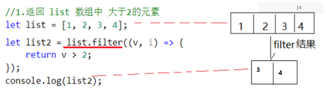


+ 例子：筛选 对象数组：

```js
//2.返回 list3 中 age >22 的 对象
let list3 = [
    { name: 'j', age: 12 },
    { name: 'a', age: 22 },
    { name: 'm', age: 32 },
    { name: 'e', age: 42 },
    { name: 's', age: 52 }
];

let list4 = list3.filter((v, i) => {
    return v.age > 22;
});
console.log(list4);
/* 输出:
[
  { name: 'm', age: 32 },
  { name: 'e', age: 42 },
  { name: 's', age: 52 }
]
*/
```


#### 2.2 map 方法

+ 作用： 返回一个新数组，数组中的元素为原始数组元素调用函数处理后的值 
  + 遍历 **原数组** 中的元素并调用回调函数，将回调函数返回值添加到一个 **新数组** 中返回
  + 不会改变原始数组，只是 把回调函数返回值 添加到新数组
+ 语法：`array.map(回调函数( currentValue,index,arr ))`
  + 参数
    + value - 当前元素值
    + index - 当前元素下标
    + arr - 当前数组
  +  返回值：
    + 将遍历数组 时每次调用 回调函数 的返回值 添加到新数组 返回
+ 本质：对数组做循环，并取出元素传入回调函数，将回调函数返回值添加到新数组返回
+ 例子：遍历对象，将每个对象的 age 添加到新数组 返回

```js
let list5 = [
    { name: 'j', age: 12 },
    { name: 'a', age: 22 },
    { name: 'm', age: 32 },
    { name: 'e', age: 42 },
    { name: 's', age: 52 }
];

let list6 = list5.map((v, i) => {
    return v.age;
});
console.log(list6); // [ 12, 22, 32, 42, 52 ]
```

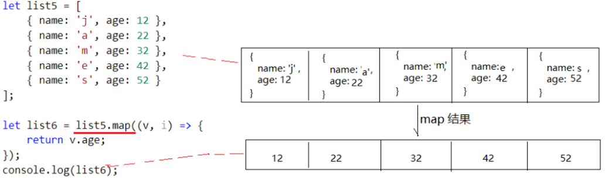


### 3.v-key指令

> Vue为了能提高性能，都尽可能重用 dom 对象，但有时候，开发者 不希望它重用 dom对象。

+ 语法：`v-key="id值"`  简写  `:key="id值"`
+ 如：
  + 两个 文本框，如果 不加 v-key 指令，则 Vue 内部 只会产生 一个 dom对象，复用。
  + PS：输入文字后，不管怎么切换，都会显示相同的文字，因为 Vue 在 重用 **同一个文本框**

```html
<div id="app">
    <button @click="isShow=!isShow">切换</button>
        <input v-if="isShow" type="text" placeholder="请输入姓名">
        <input v-else type="text" placeholder="请输入密码" >
</div>
<script src="./vue.js"></script>
<script>
    new Vue({
        el: "#app",
        data: {
            isShow: true
        },
        methods: {

        }
    })
</script>
```

+ 两个 文本框，如果 加 v-key 指令，则 Vue 内部会产生 两个 dom对象。
+ PS：输入文字后，切换后 会显示另一个 文本框，因为 Vue 创建了 **两个 文本框**。

```html
<div id="app">
    <button @click="isShow=!isShow">点我切换</button>
        <input  v-if="isShow" type="text" placeholder="请输入姓名" key="1">
        <input v-else type="text" placeholder="请输入密码"  key="2">
</div>
<script src="./vue.js"></script>
<script>
    new Vue({
        el: "#app",
        data: {
            isShow: true
        }
    })
</script>
```


### 4.v-if 和 v-for 一起使用

+ 不推荐 在同一个标签上 同时使用他们俩
+ 但如果一起使用， v-for 比 v-if 优先级 更高！


### 5.自己实现 filter和map *

#### 5.1 myfilter

+ *思考扩展：自己模仿一个数组的 filter 方法，返回符合条件的元素组成的新数组

```js
// 为数组 原型 添加一个 myfilter 方法
Array.prototype.myfilter = function (fn) {
    let newArr = [];
    // 遍历当前数组
    for (let i = 0; i < this.length; i++) {
        // 调用回调函数，传入 当前元素，下标，原数组本身，获取 bool返回值
        if (fn(this[i], i, this)) {
            // 将 元素 添加到 新数组
            newArr.push(this[i]);
        }
    }
    return newArr;
}
// 调用测试：
let list9 = [
    { name: 'j', age: 12 },
    { name: 'a', age: 22 },
    { name: 'm', age: 32 },
    { name: 'e', age: 42 },
    { name: 's', age: 52 }
];

let list10 = list9.myfilter((v, i) => {
    return v.age > 22;
});

console.log(list10);
```


#### 5.2 mymap

+ *思考扩展：自己模仿一个数组的 map 方法，返回 由 回调函数 return元素 组成的新数组

```js
// 为数组 原型 添加一个 mymap 方法
Array.prototype.mymap = function (fn) {
    let newArr = [];
    // 遍历当前数组
    for (let i = 0; i < this.length; i++) {
        // 调用回调函数，传入 当前元素，下标，原数组本身
        let newEle = fn(this[i], i, this);
        // 将 返回值 添加到 新数组
        newArr.push(newEle);
    }
    return newArr;
}
// 调用测试：
let list7 = [
    { name: 'j', age: 12 },
    { name: 'a', age: 22 },
    { name: 'm', age: 32 },
    { name: 'e', age: 42 },
    { name: 's', age: 52 }
];

let list8 = list7.mymap((v, i) => {
    return v.age;
});

console.log(list8);
```


