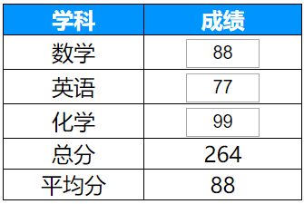
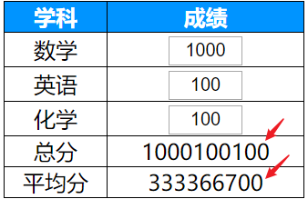
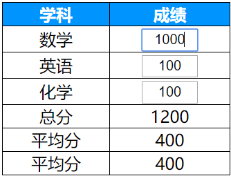
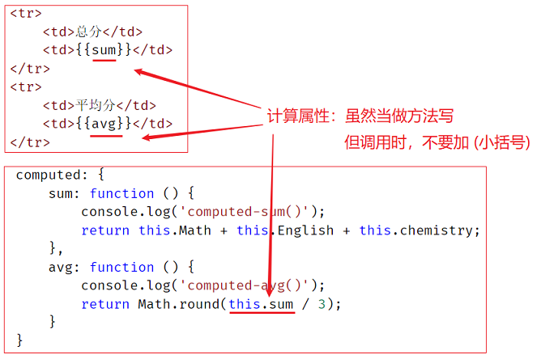
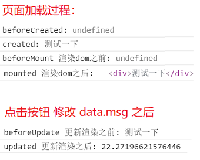
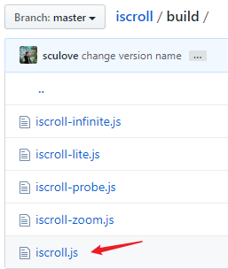
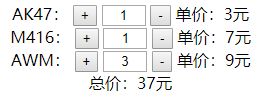
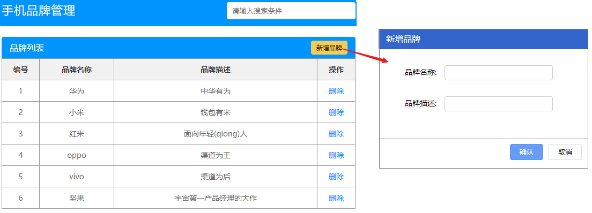

## 一.核心内容

### *任务1 计算成绩

> 如图，根据 三门学科输入的成绩，自动显示 总分 和 平均分



+ 代码实现

```html
<div id="app">
    <table border="1">
        <tr>
            <th>学科</th> <th>成绩</th>
        </tr>
        <tr>
            <td>数学</td>
            <td><input type="text" v-model="Math"></td>
        </tr>
        <tr>
            <td>英语</td>
            <td><input type="text" v-model="English"></td>
        </tr>
        <tr>
            <td>化学</td>
            <td><input type="text" v-model="Chemistry"></td>
        </tr>
        <tr>
            <td>总分</td>
            <td>{{Math + English + Chemistry}}</td> <!--不友好，维护不便-->
        </tr>
        <tr>
            <td>平均分</td>
            <td>{{(Math + English + Chemistry)/3}}</td>
        </tr>
    </table>
</div>

<script src="./vue.js"></script>
<script>
    let vm = new Vue({
        el: '#app',
        data: {
            Math: 100,
            English: 100,
            Chemistry: 100,
        }
    });
</script>
```

+ 问题：一旦修改，会出现 字符串 拼接 效果



### 1.v-model修饰符

+ 语法：(两个常用修饰符)
  + **v-model.number**  - 输入字符串转成数字
  + **v-model.trim** - 去掉输入字符串的首位空格
+ 代码

```html
<div id="app">
    <table border="1">
        <tr>
            <th>学科</th> <th>成绩</th>
        </tr>
        <tr>
            <td>数学</td>
            <td><input type="text" v-model.number="Math"></td>
        </tr>
        <tr>
            <td>英语</td>
            <td><input type="text" v-model.number="English"></td>
        </tr>
        <tr>
            <td>化学</td>
            <td><input type="text" v-model.number="Chemistry"></td>
        </tr>
        <tr>
            <td>总分</td>
            <td>{{Math + English + Chemistry}}</td> <!--不友好，维护不便-->
        </tr>
        <tr>
            <td>平均分</td>
            <td>{{(Math + English + Chemistry)/3}}</td>
        </tr>
    </table>
</div>

<script src="./vue.js"></script>
<script>
    let vm = new Vue({
        el: '#app',
        data: {
            Math: 100,
            English: 100,
            Chemistry: 100,
        }
    });
</script>
```

+ 效果




### 2.计算属性computed

> 任务1 中 在标签里 直接写了 总分和平均分的 运算逻辑。逻辑比较简单，但如果遇到逻辑比较复杂的，就不方便维护了。
> 我们最好把逻辑 写在标签外面，比如：method 中

#### 2.1 使用method方法

+ 在 method 中 声明 sum() 和 avg()方法，根据 data中的 三个分数 进行计算

```html
<div id="app">
    <table border="1">
        <tr>
            <th>学科</th>
            <th>成绩</th>
        </tr>
        <tr>
            <td>数学</td>
            <td><input type="text" v-model.number="Math"></td>
        </tr>
        <tr>
            <td>英语</td>
            <td><input type="text" v-model.number="English"></td>
        </tr>
        <tr>
            <td>化学</td>
            <td><input type="text" v-model.number="chemistry"></td>
        </tr>
        <tr>
            <td>总分</td>
            <td>{{sum()}}</td> <!-- 调用 method 中的业务方法-->
        </tr>
        <tr>
            <td>平均分</td>
            <td>{{avg()}}</td> <!-- 调用 method 中的业务方法-->
        </tr>
    </table>
</div>

<script src="./vue.js"></script>
<script>
    let vm = new Vue({
        el: '#app',
        data: {
            Math: 88,
            English: 77,
            chemistry: 99,
        },
        methods: {
            sum: function () {
                console.log('methods-sum()');
                return this.Math + this.English + this.chemistry; // 调用 data 中的数据
            },
            avg: function () {
                console.log('methods-avg()');
                return Math.round(this.sum() / 3); // 调用 methods 中的 方法
            }
        }
    });
</script>
```

+ 问题：功能虽然能实现，但 其实有隐藏的性能问题，在视图中每次 调用 `sum()` 方法，都会执行方法代码

  其实：只要 三个学科成绩 没有发生变化，那么 **总成绩** 与 **平均成绩** 都是 **不需要重新计算** 的！

  

#### 2.2 使用computed属性

> 除了把逻辑写在 methods 中之外，我们还可以 将逻辑写在 computed 属性中

+ 概念：计算属性，类似于 methods，在运行时基于 data 数据 计算返回结果的属性。
+ 语法：
  + 1.在 Vue实例对象的 computed 中 声明 "方法"
  + 2.在其它地方 当做 "属性" 调用

```html
<div id="app">
    总分:{{sum}} <!-- 访问computed 中的 "属性" -->
</div>

<script>
let vm = new Vue({
    el: '#app',
    data: {
        Math: 100,
        English: 100,
        chemistry: 100,
    },
    computed: {
        sum: function () {
            return this.Math + this.English + this.chemistry;
        }
    }
});
</script>
```

+ 在 computed 中 声明 sum() 和 avg()方法，根据 data中的 三个分数 进行计算

```html
<div id="app">
    <table border="1">
        <tr>
            <th>学科</th>
            <th>成绩</th>
        </tr>
        <tr>
            <td>数学</td>
            <td><input type="text" v-model.number="Math"></td>
        </tr>
        <tr>
            <td>英语</td>
            <td><input type="text" v-model.number="English"></td>
        </tr>
        <tr>
            <td>化学</td>
            <td><input type="text" v-model.number="chemistry"></td>
        </tr>
        <tr>
            <td>总分</td>
            <td>{{sum}}</td> <!-- 调用 computed 中的业务方法，不加小括号-->
        </tr>
        <tr>
            <td>平均分</td>
            <td>{{avg}}</td> <!-- 调用 computed 中的业务方法，不加小括号-->
        </tr>
        <tr>
            <td>平均分</td>
            <td>{{avg}}</td> <!-- 使用第25行，第1次调用时缓存的结果 -->
        </tr>
    </table>
</div>

<script src="./vue.js"></script>
<script>
    let vm = new Vue({
        el: '#app',
        data: {
            Math: 100,
            English: 100,
            chemistry: 100,
        },
        computed: {
            sum: function () {
                console.log('computed-sum()');
                return this.Math + this.English + this.chemistry; // 调用 data 中的 数据
            },
            avg: function () {
                console.log('computed-avg()');
                return Math.round(this.sum / 3); //调用 computed 中的 属性 注意：不要加括号
            }
        }
    });
</script>
```

+ 特点：
  + 调用时不加小括号
  + data 中 被 computed 用到的数据 只要发生改变，就会 重新执行 computed 中对应的 计算属性
  + 缓存数据：**computed 属性** 会缓存运行结果，从而减少运算量 ( methods中的方法没有这个特点 )
    + 比如 我们在页面上多次 执行 ` {{sum}}` ，但 都不会 触发 sum属性函数，因为 data 没被修改



### 3.Vue获取dom(ref 指令)

> 在 Vue 中 可以 访问到 dom对象吗？--可以

+ ref 是一个特殊的标签属性，一旦为标签添加了 `ref='id名称'`，就可以在vue中访问了
+ 语法：
  + 在标签中 添加 `ref='id名称'` 指令
  + 在vue方法中 访问 `app.$refs.id名称` ，返回 dom对象

```html
<div id="app">
    <!-- 添加 ref 指令-->
    <span ref="mySpan" @click="clickMe">月黑风高夜</span>
</div>

<script src="./lib/vue.js"></script>
<script>
    let vm = new Vue({
        el: '#app',
        methods: {
            clickMe() {
                // 通过 vue实例.$refs.ref值 获取 dom对象
                console.log(vm.$refs.mySpan); // span 对象
            }
        }
    });
</script>
```

### 4.生命周期2

> 昨天我们学习了 beforeCreated 和 created 钩子，今天再来学几个

+ 昨天
  + beforeCreate **(一次性执行)**
  + created **(一次性执行)**
+ 今天
  + beforeMount - 渲染dom之前，无法通过 ref指定 获取dom，胡子语法也都没替换 **(一次性执行)**
  + mounted - 渲染dom之后，可以通过 ref指定 获取dom，胡子语法替换完成  **(一次性执行)**
  + beforeUpdate - 一旦 data 数据发生修改，在 更新渲染 dom 之前 **(多次执行)**
  + updated - 更新渲染 dom 之后  **(多次执行)**

```html
<div id="app">
    <button @click="clickMe">测试声明周期</button>
    <div ref="dom">{{test}}</div>
</div>

<script src="./lib/vue.js"></script>
<script>
    new Vue({
        el: "#app",
        data: {
            test: "测试一下"
        },
        methods: {
            clickMe() {
                this.test = Math.random() * 100
            }
        },

        beforeCreate() {
            console.log(this.test)
            //不能访问data,methods
        },
        created() {
            console.log("created:", this.test)
            //能访问data与methods

        },
        beforeMount() {
            //还不能访问dom
            console.log("beforeMount 渲染dom之前:", this.$refs.dom)

        },
        mounted() {
            console.log("mounted 渲染dom之后:", this.$refs.dom)
        },
        beforeUpdate() {
            // 数据 data.test 已经改完了，但 还没有 把 数据 渲染到 dom中
            console.log("beforeUpdate 更新渲染之前:", this.$refs.dom.innerHTML)
        },
        updated() {
            // 数据 data.test 已经改完了，数据 也已经渲染到 dom中
            console.log("updated 更新渲染之后:", this.$refs.dom.innerHTML)

        }
    })
</script>
```

+ 执行结果




### 5.iScroll基本用法

> 容器标签(如：div) 自带的 overflow 滚动条 有点审美疲劳，且不支持 内容滑动 等效果

+ 介绍：iScrol l是一个高性能，资源占用少，无依赖，多平台的javascript滚动插件(4kb)

+ 特点：

  + 可以在PC，移动设备和智能电视平台上工作
  + iScroll 可以处理任何需要与用户进行移动交互的元素：滚动，缩放，平移，无限滚动，视差滚动，旋转功能

+ 官方：

  + **iScroll 访问不了 ([iscrolljs.com](http://iscrolljs.com/))**  

  + **iScroll github** (https://github.com/cubiq/iscroll)  -> `build 文件夹` 包含各个版本

    

  + **中文文档** (http://caibaojian.com/iscroll-5/versions.html)

+ 使用方法：

  + 必须使用 三层结构 （滚动列表容器 -> 数据容器 -> 数据项 ），比如：
    + div -> ul -> li
    + div -> div ->div
  + 至少设置 滚动列表容器 样式表 两个样式
    + overflow:hidden;  - 隐藏默认滚动条
    + position:relative; - 必须为 滚动条 父容器设置定位
  + 导入` iscroll.js` 文件
  + 初始化 IScroll对象
    + 传入 滚动列表容器 的 **选择器名称**  or **dom对象**
    + 传入 参数对象
      + mouseWheel: true - 鼠标滚轮控制 
      + scrollbars: true  - 滚动条的显示

```html
<style>
    * {
        margin: 0;
    }

    .wrapper {
        width: 300px;
        height: 200px;  /*限制高度，才有必要出现滚动条*/
        overflow: hidden; /* 隐藏默认滚动条 */
        border: 1px solid #0094ff;
        margin: 0 auto;
        position: relative; /* 必须为 滚动条 父容器设置定位 */
    }
</style>

<!--1.三层结构-->
<div id="wrapper">
    <ul>
        <li>...</li>
        <li>...</li>
        ...
    </ul>
</div>

<!--2.初始化-->
<script type="text/javascript" src="iscroll.js"></script>

<script type="text/javascript">
	new IScroll('#wrapper', {
        mouseWheel: true, // 鼠标滚轮控制 
        scrollbars: true //滚动条的显示
    })
</script>
```

### 6.iScroll刷新

+ 当列表中数据项 新增时，需要刷新一下 iScroll，它会重新计算滚动范围（将新增项包含进去）

```html
<style>
    * {
        margin: 0;
    }

    .wrapper {
        width: 300px;
        height: 200px; /*限制高度*/
        overflow: hidden; /* 隐藏默认滚动条 */
        border: 1px solid #0094ff;
        margin: 0 auto;
        position: relative; /* 必须为 滚动条 父容器设置定位 */
    }
</style>

<!-- 2布局 -->
<button id="btn">增加li</button>

<div class="wrapper" id="wrapper">
    <ul id="list">
        <li>...</li>
        <li>...</li>
        ...
    </ul>
</div>
<!-- 1导包 -->
<script src="./lib/iscroll.js"></script>

<!-- 3实例化 -->
<script>
    let wrapper = document.getElementById('wrapper');

    let iscrObj = new IScroll(wrapper, {
        mouseWheel: true, // 鼠标滚轮控制 
        scrollbars: true //滚动条的显示
    });

    let btn = document.getElementById("btn")
    btn.onclick = function () {
        let _li = document.createElement("li")
        _li.innerHTML = "黑马程序员深圳校区.大前端";
        let _ul = document.getElementById("list");
        _ul.appendChild(_li);
        // 刷新iscroll，让它重新计算高度，因为dom已改变，iscroll要重新计算滚动范围那些
        iscrObj.refresh();
    }
</script>
```

### 7.在Vue中使用 iScroll

#### 7.1 基本使用

+ 用 v-for 循环生成数据项 （滚动列表容器 -> 数据容器 -> 数据项 ），比如：
  + div -> ul -> li(数据项) 
+ 至少设置 滚动列表容器 样式表 两个样式
  + overflow:hidden;  - 隐藏默认滚动条
  + position:relative; - 必须为 滚动条 父容器设置定位
+ 导入` iscroll.js` 文件
+ mounted 钩子函数中，初始化 IScroll对象
  + 传入 滚动列表容器 的 **选择器名称** or **dom对象**
  + 传入 参数对象
    + mouseWheel: true - 鼠标滚轮控制 
    + scrollbars: true  - 滚动条的显示

```html
<style>
    * {
        margin: 0
    }
    .wrapper {
        width: 300px;
        height: 150px;
        border: 1px solid red;
        overflow: hidden;
        position: relative;
        margin: 0 auto;
    }
</style>

<div id='app'>
    <p>{{msg}}</p>
    <button @click="add">添加</button>
    <div class="wrapper" ref="wrapper">
        <ul>
            <li v-for="(item, index) in list" :key="index">{{item}} -> index}}</li>
        </ul>
    </div>
</div>
<script src='./lib/vue.js'></script>
<script src="./lib/iscroll.js"></script>
<script>
    new Vue({
        el: '#app',
        data: {
            list: ["深圳黑马大前端", "P城小王子", "Y城伏地魔", "德玛西亚", "每天都要么么哒", "Ruiky就是一只泰迪","世界之大","无限之美","肖邦与曹操彻夜长谈"]
        },
        methods: {
        },
        mounted() {
            new IScroll(this.$refs.wrapper, {
                mouseWheel: true, //滚轮控制 
                scrollbars: true  //滚动条显示 
            })
        }
    })
</script>
```

#### 7.2 新增元素 与 $nextTick

+ 为列表新增元素后，要 **刷新iScroll**，而在 vue 中怎么刷新呢？
  + 先在 data 中保存 iScroll 对象
  + 新增数据后，vue 会渲染dom，渲染结束后再刷新
    + 新增按钮点击事件函数中刷新 - 注意：需要等vue渲染dom结束
      + `setTimeout(()=>{ this.myScroll.refresh() },1);` - 1毫秒后 调用
      + `this.$nextTick(()=>{ this.myScroll.refresh() })` - vue特有,渲染结束后自动调用
    + updated 钩子函数中刷新 - 不推荐，因为 修改data 中 任意 数据 都会 触发 updated 钩子

```html
<style>
    * {
        margin: 0
    }
    .wrapper {
        width: 300px;
        height: 150px;
        border: 1px solid red;
        overflow: hidden;
        position: relative;
        margin: 0 auto;
    }
</style>

<div id='app'>
    <p>{{msg}}</p>
    <button @click="add">添加</button>
    <button @click="btnClick">修改data.msg</button>
    <div class="wrapper" ref="wrapper">
        <ul>
            <li v-for="(item, index) in list" :key="index">{{item}}-----{{index}}</li>
        </ul>
    </div>
</div>
<script src='./lib/vue.js'></script>
<script src="./lib/iscroll.js"></script>

<script>
    new Vue({
        el: '#app',
        data: {
            msg: "繁华的都市，愈发衬托出树影的独孤",
            myScroll: "", // 保存 iScorll 对象
            list: ["深圳黑马大前端", "P城小王子", "Y城伏地魔", "德玛西亚", "每天都要么么哒", "Ruiky就是一只泰迪","世界之大","无限之美","肖邦与曹操彻夜长谈"]
        },
        methods: {
            add() {
                this.list.push("我是新加入数据");
                // 新增data数据，会触发beforeUpdate和updated 两个钩子函数
                
                // 1.加setTimeout是保证页面已修改数据完成渲染
                // setTimeout(() => {
                //     this.myScroll.refresh()
                // }, 0);
                
                // 2.setTimeout高级版本，只适用于vue,它就是帮我们算好了数据渲染完成所需要时间
                this.$nextTick(() => {
                    this.myScroll.refresh()
                })
            },
            btnClick() {
                // 修改 data中的数据，会触发 beforeUpdate 和 updated 函数
                this.msg = Math.random()
            }
        },
        updated() {
            // 数据已修改，且页面已完成渲染，平时项目不是说基本不用
            // window.console.log("我执行了刷新")
            // this.myScroll.refresh()
        },
        mounted() {
            // 进行一个高度计算
            this.myScroll = new IScroll(this.$refs.wrapper, {
                mouseWheel: true,   //滚轮控制 
                scrollbars: true    //滚动条显示 
            })
        }
    })
</script>
```

#### * 在线案例 优化 英雄列表


### 8.过渡与动画

> Vue 在插入、更新或者移除 DOM 时，提供多种不同方式的应用过渡效果。

#### 8.1 单个元素过渡

+ Vue提供了 `transition 标签` 封装需要**过渡效果**的元素
  + 其中 **name 属性** 要和 **过渡选择器前缀** 一致
+ 使用条件：条件渲染 ( `v-if / v-show` )
+ 体验：

```html
<style>
    /* 过渡动画类选择器 */
    .niubi-enter-active,
    .niubi-leave-active {
    	transition: opacity 0.5s;
    }
    .niubi-enter, .niubi-leave-to /* .fade-leave-active below version 2.1.8 */ {
    	opacity: 0;
    }
</style>

<div id="app">
    <input type="button" value="切换显示" @click="isShow=!isShow" />
    <br />
    <!-- transition 标签的 name 属性 要和 过度动画类选择器名前缀 一致 -->
    <transition name="niubi">
        <!--需要 过渡效果 的元素，根据变量 显示 或 隐藏-->
        <span v-show="isShow">讨厌了~死鬼~~~</span>
    </transition>
</div>

<!-- 开发环境版本，包含了有帮助的命令行警告 -->
<script src="https://cdn.jsdelivr.net/npm/vue/dist/vue.js"></script>
<script>
    let app = new Vue({
        el: '#app',
        data: {
            isShow: false
        }
    })
</script>
```


#### 8.2 过渡类选择器

> 过渡动画 分两个阶段： 动画 进入 到完成    ， 和  ，   动画 离开 到 结束。

+ 过渡样式类名：分 进入 和 离开 两类

  

+ **进入过渡**

  1. `v-enter`：定义进入过渡的开始状态。在元素显示之前生效，在元素显示完成后移除
  2. `v-enter-active`：过渡动画执行阶段样式，在元素显示之前生效，在过渡/动画完成后移除
  3. `v-enter-to`: **2.1.8版及以上** 定义动画的结束状态（就是最终要显示成什么样子）。在元素显示之后下一帧生效 (与此同时 `v-enter` 被移除)，在过渡/动画完成之后移除

+ **退出过渡**

  1. `v-leave`: 定义离开过渡的开始状态。在离开过渡被触发时立刻生效，下一帧被移除。
  2. `v-leave-active`：定义离开过渡生效时的状态。在整个离开过渡的阶段中应用，在离开过渡被触发时立刻生效，在过渡/动画完成之后移除。
  3. `v-leave-to`: **2.1.8版及以上** 定义离开过渡的结束状态。在离开过渡被触发之后下一帧生效 (与此同时 `v-leave` 被删除)，在过渡/动画完成之后移除。


#### 8.3 过渡+动画

> 如果 想要更丰富的 过渡效果，可以 使用 keyframes 相关动画库

+ 动画库 的 基本使用，当然也可以去 配合使用第三方 CSS 动画库，如 [【Animate.css】](https://daneden.github.io/animate.css/) 的 [【文件下载】](https://github.com/daneden/animate.css)

```html
<style>
    .bounce-enter-active {
        animation: bounce-in .5s;
    }
    .bounce-leave-active {
        animation: bounce-in .5s reverse;
    }
    @keyframes bounce-in {
        0% {
            transform: scale(0);
        }
        20% {
            transform: scale(2.0);
        }
        50% {
            transform: scale(1.5);
        }
        75% {
            transform: scale(2.0);
        }
        100% {
            transform: scale(1);
        }
    }
    body {
        text-align: center;
        font-size: 28px;
    }
</style>

<div id="app">
    <input type="button" value="切换显示" @click="isShow=!isShow" />
    <br />
    <transition name="bounce">
        <p v-if="isShow">讨厌了~~</p>
    </transition>
</div>

<script src="https://cdn.jsdelivr.net/npm/vue/dist/vue.js"></script>
<script>
    const app = new Vue({
        el: '#app',
        data: {
            isShow: false
        }
    })
</script>
```

#### 8.4 多元素过渡

+ Vue提供了 `transition-group 标签` 封装多个需要过渡效果的元素
  + 属性：
    + **name 属性** 要和 **过渡效果类选择器前缀** 一致
    + tag 属性 ，指定 `transition-group` 最终 被转成 的 标签名
  + 标签内部的内容项标签，必须 指定 **:key特性**
  + 使用条件：条件渲染 ( `v-if / v-show` )
  + 体验：

```html
<style>
    ul {
        width: 220px;
        margin: 0 auto;
        list-style-type: none;
    }

    .bounce-enter-active,
    .bounce-leave-active {
        transition: all 1s;
    }

    .bounce-enter,
    .bounce-leave-to {
        opacity: 0;
        transform: translateY(50px);
    }

    body {
        text-align: center;
        font-size: 28px;
    }
</style>

<div id="app">
    <input type="button" value="切换显示" @click="isShow=!isShow" />
    <br />
    <transition-group name="bounce" tag="ul">
        <li v-if="isShow" :key="1">讨厌了~~1</li>
        <li v-if="isShow" :key="2">讨厌了~2~</li>
        <li v-if="isShow" :key="3">讨厌了3~~</li>
    </transition-group>
</div>

<script src="https://cdn.jsdelivr.net/npm/vue/dist/vue.js"></script>
<script>
    const app = new Vue({
        el: '#app',
        data: {
            isShow: false
        }
    })
</script>
```

#### 8.5 过渡延迟显示

+ 我们想实现 元素 按顺序 逐个显示 咋办？- **【过渡延迟】**
+ 语法： `:style=":style="{transitionDelay:'1000ms'}""`

```html
<transition-group name="bounce" tag="ul">
    <li v-if="isShow" :key="1" :style="{transitionDelay:'0ms'}">讨厌了~~1</li>
    <li v-if="isShow" :key="2" :style="{transitionDelay:'1000ms'}">讨厌了~2~</li>
    <li v-if="isShow" :key="3" :style="{transitionDelay:'2000ms'}">讨厌了3~~</li>
</transition-group>
```


#### 8.6 列表过渡效果

+ vue 中 当 列表 依赖 数据生成时，那么 说句的 删减 都会 直接 触发 列表项的 改变，而触发过渡效果

```html
<style>
  .list-item {
    display: inline-block;
    margin-right: 10px;
  }
  .list-enter-active,
  .list-leave-active {
    transition: all 1s;
  }
  .list-enter, .list-leave-to{
    opacity: 0;
    transform: translateY(30px);
  }
</style>

<div id="app">
  <input type="button" value="添加" @click="add" />
  <input type="button" value="移除" @click="remove" />
  <!-- 列表过渡 -->
  <transition-group name="list" tag="ul">
    <div class="list-item" v-for="(item,index) in arr" v-bind:key="item">
      {{ item }}
    </div>
  </transition-group>
</div>

<script src="https://cdn.jsdelivr.net/npm/vue/dist/vue.js"></script>
<script>
  const app = new Vue({
    el: '#app',
    data: {
      arr: []
    },
    methods: {
      add() {
        this.arr.push(parseInt(Math.random() * 1000));
      },
      remove() {
        this.arr.pop();
      }
    }
  })
</script>
```


## 二.核心案例

### 1.购物车



+ 思路：
  + 数据结构 分析
  + 列表生成
  + 按钮事件
  + 总价计算

```html
<style>
    ul {
        list-style: none;
        text-align: center;
    }

    input {
        width: 40px;
        text-align: center;
    }
</style>

<div id='app'>
    <ul>
        <li v-for="(item, index) in list" :key="index">
            <span>{{item.name}}：</span>
            <button @click="add(index)">+</button>
            <input type="text" v-model="item.num">
            <button @click="reduce(index)">-</button>
            <span>单价：{{item.price}}元</span>
        </li>
        <li>总价：{{getTotalMoney}}元</li>
    </ul>
</div>
<script src='./lib/vue.js'></script>
<script>
    new Vue({
        el: '#app',
        data: {
            list: [{
                    name: "AK47",
                    price: 3,
                    num: 1
                },
                {
                    name: "M416",
                    price: 7,
                    num: 1
                },
                {
                    name: "AWM",
                    price: 9,
                    num: 1
                }
            ]
        },
        computed: {
            // 计算总价：数组一旦有变化，会自动触发
            getTotalMoney() {
                let _total = 0;
                // 遍历 数组，计算总价
                this.list.forEach(item => {
                    _total += item.num * item.price;
                });
                return _total;
            }
        },
        methods: {
            // 加号按钮事件
            add(index) {
                this.list[index].num++
            },
            // 减号按钮事件
            reduce(index) {
                this.list[index].num--
                if (this.list[index].num < 0) {
                    this.list[index].num = 0
                }
            }
        }
    })
</script>
```


### 2.品牌列表管理



+ 思路：
  + 数据结构 分析
  + 表格数据行 生成
  + 新增
    + 显示/隐藏 新增面板 - `v-show`
    + 确认按钮：向数组中 push  { 品牌名称 和 品牌描述 }
  + 删除
    + 根据id找出 要删除 数据对象在数组中的 下标
    + 调用splice方法 删除 对应 下标元素 - vue会自动更新视图
  + 搜索
    + 每次搜索 都 根据 条件 从数组中筛选出 一个新数组 给 表格 显示 - 计算属性
    + 重点：表格数据源 绑定到 计算属性 newList，不要修改原数组


```html
<div id="app">

    <!-- 页头 -->
    <div class="header_con">
      <div class="header">
        <h1>手机品牌管理</h1>
        <input type="text" v-model="search" placeholder="请输入搜索条件">
      </div>
    </div>

    <div class="tb_title">
      <h3>品牌列表</h3>
      <a href="javascript:;" @click="isShow=true">新增品牌</a>
    </div>

    <!-- 数据表格 -->
    <table class="tb">
      <tr>
        <th>编号</th>
        <th>品牌名称</th>
        <th>品牌描述</th>
        <th>操作</th>
      </tr>
      <tr v-for="(item, index) in newList">
        <td>{{ index + 1 }}</td>
        <td>{{ item.name }}</td>
        <td>{{ item.remark }}</td>
        <td>
          <a href="#" @click.prevent="del(item.id)" class="del">删除</a>
        </td>
      </tr>
      <tr v-show="newList.length == 0">
        <td colspan="4">没有品牌数据</td>
      </tr>
    </table>

    <!-- 新增弹框 -->
    <div class="add_con" v-show="isShow">
      <div class="add">
        <h3>新增品牌</h3>
        <div class="add_form">
          <label>品牌名称:</label>
          <input type="text" v-model="addName">
        </div>
        <div class="add_form">
          <label>品牌描述:</label>
          <input type="text" v-model="addRemark">
        </div>
        <div class="btns">
          <input type="button" value="取消" @click="isShow=false">
          <input type="button" @click="add" value="确认">
        </div>
      </div>
      <div class="mask"></div>
    </div>
  </div>

<script src="./lib/vue.js"></script>
<script>
//  创建一个 vm 对象
let vm = new Vue({
  el: '#app',
  data: {
    // 准备 M 层数据
    list: [{
        id: 1,
        name: '华为',
        remark: '中华有为'
      },
      {
        id: 2,
        name: '小米',
        remark: '钱包有米'
      },
      {
        id: 3,
        name: '红米',
        remark: '面向年轻(qiong)人'
      },
      {
        id: 4,
        name: 'oppo',
        remark: '渠道为王'
      },
      {
        id: 5,
        name: 'vivo',
        remark: '渠道为后'
      },
      {
        id: 6,
        name: '坚果',
        remark: '宇宙第一产品经理的大作'
      }
    ],
    addName: '', // 新增-品牌名称输入框 内容
    addRemark: '', // 新增-品牌描述输入框 内容
    search: '', // 搜索框 内容
    isShow: false // 设置弹框的显示和隐藏
  },
  methods: {
    add() {
      // 判断输入框是否为空
      if (this.addName == '') {
        return;
      }
      // 1.0 得到新增框中的数据
      // 2.0 添加数据到 list 中
      this.list.push({
        id: this.list.length > 0 ? this.list[this.list.length - 1].id + 1 : 1,
        name: this.addName,
        remark: this.addRemark
      })
      // 3.0　清空新增框中的内容
      this.addName = '';
      this.addRemark = '';
      this.isShow = false;
    },
    del(delId) {
      if (confirm('您确定删除吗')) {
        // 根据 要删除品牌的 id，找出对应 对象 在数组中的 下标
        let delIndex = this.list.findIndex((ele, index) => {
          if (ele.id == delId) {
            return index;
          }
        });

        // 删除 index 对应的数据
        if (delIndex > -1) {
          this.list.splice(delIndex, 1);
        }
      }
    }
  },

  computed: {
    // 添加一个计算属性，用来保存包含搜索内容的数据源
    newList: function () {
      // 只要 search 改变，就要重新生成 newList
      var listarr = this.list.filter(item => {
        // 判断当前项中的 name 属性是否包含 search
        return item.name.includes(this.search)
      })
      console.log(listarr)
      return listarr
    }
  }
})
```


## 三.扩展内容

