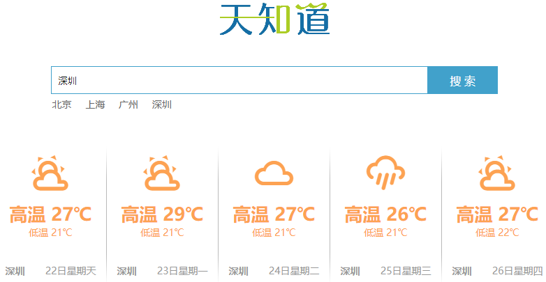
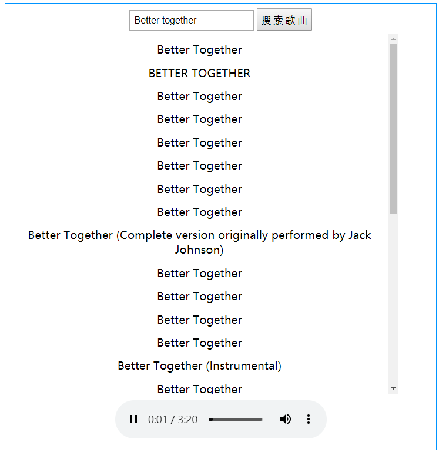

## 一.核心内容

### 1.任务1：天知道




### 2.什么叫组件

> 把某个界面或者说某个小功能，封装起来就叫组件（就是对html css js的一个综合封装），组件也是Vue的实例，所以它也有自己的data和methods以及生命周期钩子等

**组件开发特点：**可复用，同时会简化代码结构，易于维护，同时利于多人协同开发等。


### 3.安装单文件组件所需要依赖

[直通车](https://cli.vuejs.org/zh/guide/prototyping.html)

#### 3.1 安装脚手架

+ **安装`vue-cli`**  脚手架
  + 在cmd命令窗口输入（在任意的路径都可以）

  ```html
  npm install -g @vue/cli
  ```

  

  + 安装成功检测在cmd命令窗口输入：  

  ```html
  vue  -V    // 注意 是大写的 V 。如果安装成功会返回：@vue/cli 4.0.5类似这样的版本信息
  ```

  

#### 3.2 安装常见错误

> 如果 vue -V无法显示版本信息，说明安装失败

- 解决方案:

  + **方案1：更换网络环境：有线，换无线，无线换4G**

  + **方案2：更换安装的工具**

  1. `cnpm安装` ：

     - 先安装淘宝镜像

       ```html
       npm install -g cnpm --registry=https://registry.npm.taobao.org
       ```

     -  cnpm安装vue-cli：

        ```html
         cnpm install -g @vue/cli
        ```

  2.  `yarn安装` :

      - 先安装yarn    

        ```html
         npm install -g yarn 
        ```

      -  yarn安装vue-cli

         ```html
          yarn global add @vue/cli
         ```

            

  + **方案3：清除npm缓存，重新安装**

  1. ```html
     npm cache clean -f      //清除npm缓存
     ```

  2. 重新执行安装的命令

  3. 在用脚手架搭建vue项目时，提示：无法加载文件 C:\Users\电脑用户名\AppData\Roaming\npm\vue.ps1,因为在此系统禁止运行脚本

     这是你笔记本禁止运行脚本，解决办法

     命令： `set-ExecutionPolicy RemoteSigned  `

     

#### 3.3 安装单文件组件.依赖包

**安装单文件组件依赖包**（安装完成vue-cli后进行这一步）

- npm安装的用：

```cmd
npm install @vue/cli-service-global -g
```

- cnpm安装的用：


```cmd
cnpm install @vue/cli-service-global -g
```

- yarn安装的用：


```cmd
yarn global add @vue/cli-service-global
```

> **注意：**如果 前面用yarn的人就一直用yarn,不要用yarn装完vue-cli,又用npm装其它插件，这样有可能 会出问题，尽量都是同步一个安装，就是以前用npm,后面就一直用npm,以前用yarn 后面就一直用yarn

### 4.单文件组件使用

#### 4.1 单文件组件结构

- 把每个组件都放到一个独立的 `vue文件.vue` 里

- 文件三大部分： `template` 、 `script`  、 `style` ，快捷键快速生成： `<vue>`

  ```html
  <template>
      1. 写html结构的
      2. 注意这里的html部分【必须有一个根标签，用作 vue挂载】
  </template>
  
  <script>
      Vue实例(VueModel + Model)
      1. 写逻辑的，data、methods、生命周期钩子、计算属性等等代码都写在这个部分
  	2. 注意这里的data不再是一个对象，在组件里，data将会是一个函数,return一个对象
  </script>
  
  <style>
      1. 写样式的
  	2. 在css中的导入外部css(主体使用)：`@import url(./babel.css);`
  </style>
  ```

#### 4.2 单文件组件的运行

+ 在cmd窗口该vue文件根目录下输入`vue serve 文件名.vue`

+ **注意点**
  + template 里 html 必须用一个标签全包住
  + 组件里没有el，组件是无需挂载到哪的，里面已经有template是它的使用的html了
  + data在组件里面是一个function,return 一个对象

```vue
<template>
  <div>
    <button @click="msg='讨厌，死鬼~~'">按钮</button>
    <button @click="showLove('你好呀~')">{{msg}}</button>
  </div>
</template>

<script>
export default {
  // 1.组件 不需要指定 el，直接 挂载 template 的根节点
  // el:'',

  // 2.组件 中 data 写作函数，并 返回 参数对象
  data() {
    return {
      msg: "hello"
    };
  },

  // 3.组件 中 methods 和 钩子函数 语法和 普通vue中相同
  methods: {
    showLove(value) {
      alert(value);
    }
  },
  created() {
    // this.alertEvent(123); // 报错 ：TypeError: this.alertEvent is not a function
    // 组件中 钩子函数 访问 window成员，不能省略 window.
    window.console.log(this);
  }
};
</script>

<style>
@import "./main.css";

button {
  width: 100px;
}
</style>

<style>
/* 引入 外部css 
   在css中的导入：
          @import url(./babel.css);
   在js中的导入
          import "./babel.css"
*/
@import "./babel.css";
button {
  width: 100px;
}
</style>
```


### 5.组件中使用其它组件

>如何在一个组件中引入其它组件,实现一个组装。

#### 5.1 三步法

> 如：在 组件 `Father.vue` 中 导入 组件 `Son.vue`

```html
<template>
  <div>
    <!--3.使用组件-->
    <组件别名></组件别名>
  </div>
</template>

<script>
//1.导入其它组件 
`import 组件别名 from "Son.vue"`

//2.注册组件
export default {
  components: {
    组件别名,     //注册的组件都写在components对象下。
  }
}
</script>
```


### 6.组件中使用插件

> **以 axios 为例**

#### 6.1 三步法

1. 装包（安装外部插件）

   ```html
   npm i axios //到相应目录下执行该命令    
   ```

2. 导包（在单文件组件中导入外部插件）

   ```
   import axios from "axios" // 注意 可以不加后缀
   ```

3. 用包（在相应代码位置使用）

   使用和以前一样，该怎么用还是怎么用

   ```javascript
   axios({
   	url:"xxx"
   }).then(res=>{
   })
   ```

   **DEMO**

   ```vue
   <template>
     <div>
       <input type="text" v-model="searchValue" />
       <button @click="getMusic">点我</button>
       <ul>
         <li v-for="(item, index) in songs" :key="index">{{item.name}}</li>
       </ul>
     </div>
   </template>
   <script>
   // 导包
   import axios from "axios";
   export default {
     data() {
       return {
         searchValue: "", //input框的值
         songs: []
       };
     },
     methods: {
       getMusic() {
         // 使用，以前怎么用，现在还怎么用
         axios({
           url: "https://autumnfish.cn/search?keywords=" + this.searchValue,
           method: "get"
         }).then(res => {
           this.songs = res.data.result.songs;
           window.console.log(this.songs);
         });
       }
     }
   };
   </script>
   <style>
   </style>
   ```


### 7.组件间的传值

>如果A组件中引入了B组件 ，这样我们称A组件为父组件，B为子组件

#### 7.1 父组件传值给子组件

- 在子组件标签上定义一个ref属性

  ```html
    <组件名 ref="xxx"></组件名> 
  ```

- 在需要给子组件传值的地方写入：

  ```javascript
  this.$refs.xxx   //这就代表了子组件xxx的vue实例
  //这里xxx代码标签中定义的ref属性名这里就可访问到子组件里面的data属性与methods方法
  //如要修改子组件里面data里的某个值：          this.$refs.xxx.子组件里data属性名
  //如果需要调用子组件里面methods里某个方法：   this.$refs.xxx.子组件里面methods里方法名   
  ```

#### 7.2 子组件传值给父组件

```javascript
    this.$parent    //这就代表父组件的vue实例
    //如要修改父组件里面data里的某个值：         this.$parent.父组件里data属性名
    //如果需要调用父组件里面methods里某个方法：   this.$parent.父组件里面methods里方法名   
```

注意：`ref`获取到的dom信息在这里与`document.getElementById`是有本质 区别的

```html
//两个组件，这个是father.vue
<template>
  <div>
    <button @click="btnClick">点我获取数据</button>
    <div>你选中的当前歌曲:{{localSong}}</div>
    <son ref="son" id="son"></son>
  </div>
</template>
<script>
// 组件使用，导包，注册，使用
//1：导包
import axios from "axios";
import son from "./son.vue";
export default {
  data() {
    return {
      songs: [],
      localSong: ""
    };
  },
    //2：注册
  components: {
    son
  },
  methods: {
    btnClick() {
      window.console.log("ref访问：", this.$refs.son.$el);
      window.console.log("原生访问:", document.getElementById("son"));
      //要调接口，是不是要使用axios
      //装包，导包，用包
      axios({
        url:
          "https://autumnfish.cn/search?keywords=神话&_t=" + Math.random() * 100
      }).then(res => {
        //   父组件传递子组件值，在子组件上定义一个ref,通过this.$refs.名字，我们就能访问子组件的实例，也就是可访问子组件data属性与methods方法
        this.$refs.son.songs = res.data.result.songs;
        this.$refs.son.alertEvent();
        window.console.log(res.data.result.songs);
      });
    }
  }
};
</script>
<style>
</style>
```

```vue
//son.vue
<template>
  <ul>
    <li v-for="(item, index) in songs" :key="index" @click="liCLick(item.name)">{{item.name}}</li>
  </ul>
</template>
<script>
// 子组件访问父组件里的data与methods更简单，只需要this.$parent就够了
export default {
  data() {
    return {
      songs: []
    };
  },
  methods: {
    liCLick(name) {
      this.$parent.localSong = name;
      window.console.log("访问父组件：", name, this.$parent);
    },
    alertEvent() {
      alert(123);
    }
  }
};
</script>
<style>
</style>
```


## 二.核心案例

### 1.播放器-simple



+ 接口：

http://183.237.67.218:3000/ 

 http://183.237.67.218:3000/search?keywords= 神话    搜索歌曲时接口获取音乐列表

http://183.237.67.218:3000/song/url?id=310574  获取音乐url  id来自于上一接口详情       

+ 分析

1. 搜索功能
   1. input框：v-model   @keyup.enter="搜索事件"
   2. 搜索按钮   @click  ="搜索事件"
   3. 搜索事件
      1. 使用axios
         1. npm  i axios  安装 axios
         2. 导入axios   import axios from 'axios'
         3. 使用axios
      2. 使用axios调用接口获取歌曲列表数据
      3. 将获取到的数据渲染出来
         1. v-for
      4. 点击歌曲列表
         1. 在li上绑定点击事件
            1. @click="播放功能（传递歌曲id）"
         2. 通过点击事件查找歌曲的url
            1. axios调用接口获取歌曲url
      5. 播放歌曲
         1. 将获取到的歌曲url绑定到相应audio的src上  ：src

+ 源码：

```html
<template>
  <div class="main">
    <input type="text" v-model="inputValue" @keyup.enter="btnClick" />
    <button @click="btnClick">搜 索 歌 曲</button>
    <ul class="list">
      <li v-for="(item, index) in list" :key="index" @click="getsrc(item.id)">{{item.name}}</li>
    </ul>
    <audio :src="musicSrc" controls autoplay></audio>
  </div>
</template>
<script>
// i
import axios from "axios";
export default {
  data() {
    return {
      inputValue: "",
      list: [],
      musicSrc: ""
    };
  },
  methods: {
    btnClick() {
      axios({
        url:
          "https://autumnfish.cn/search?keywords=" +
          this.inputValue +
          "&t=" +
          Math.random() * 999
      }).then(res => {
        this.list = res.data.result.songs;
        //   打印的时候注意了，语法严格一些了，console.log前面一定要加上window
        window.console.log(res);
      });
    },
    getsrc(id) {
      window.console.log(id);
      axios({
        url: "https://autumnfish.cn/song/url?id=" + id
      }).then(res => {
        this.musicSrc = res.data.data[0].url;
        window.console.log("歌曲url", res);
      });
    }
  }
};
</script>
<style>
* {
  padding: 5px;
  margin: 2px;
  list-style: none;
}
.main {
  width: 600px;
  margin: 0 auto;
  border: 1px solid #0094ff;
  text-align: center;
}
.list {
  width: 90%;
  height: 500px;
  overflow: auto;
}
</style>
```


## 二.扩展内容

### 1.关于事件中的$event

每个点击事件里面都有一个事件对象，在vue中如何去使用该事件对象呢？

```
        <!-- <button @click="btnClick">点我啊</button> -->
        <!-- btnClick($event)这才是完整写法 
        $event：事件对象，也就是事件驱动源
        如果事件后面带括号，需要使用事件对象，就一定要在括号里面传入实参$event
        如果事件后面没有括号，vue帮我们默认传递了实参$event
        -->
```

