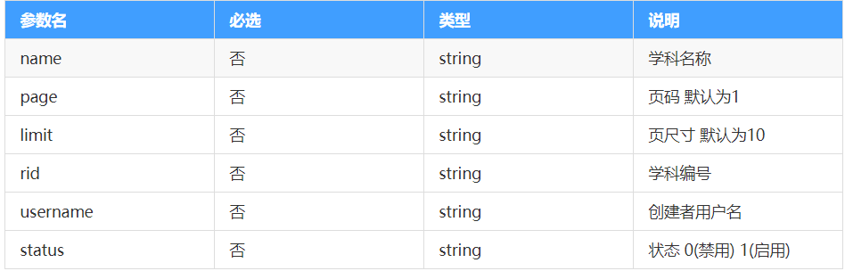

# day06 - 黑马面面

## 反馈

 今天还挺好的，坐等视频看飞飞老师发量 

主体就学习的是element  axios(api)

全家桶：vue-cli   vue-router   axios （api）  vuex    element   (pc端 项目)  

## 回顾


1. 弹窗组件

   1. confirm

   2. ~~~js
      this.$confirm("内容","标题",{
      confirmButtonText:"确定的文本内容"，
      cancelButtonText:"取消的文本",
      type:"error / success/warning"
      }).then(()=>{
      //点击确定后的回调函数
      }).catch(()=>{
      //点击 取消后的回调函数
      })
      ~~~

2. 导航菜单

   ~~~
   el-menu
      default-active  默认选中的项 ，它的值就对应下面子项的index的值
      collapse 控制 是否折叠    需要设置相应css
      router 控制导航菜单点击有切换路由功能（实际就是控制它的点击项时能改变路由地址为index的值）
      el-menu-item   index="当前项的值"
         i	图标
         slot=title   重写子项的标题部分
        
   ~~~

3. 路由嵌套

   1. 在需要嵌套的组件身上加一个router-view
   2. 配制该组件的路由子项   在该组件身上加一个children:[{ 子项配制    path:"" ,component}]

4. 导航守卫

   1. 进入前守卫 

      1. ~~~
         router.beforeEach((to,from,next)=>{
         to,将要去到的路由的$route信息
         from  从什么地方过来的$route信息
         next()   正常通过
         next("path")  不给正常通过，将你甩到其它地方，注意点，如果没有next()它会形成一个死循环，  
         next()它才不会再进入beforeEach  
         next(有path)它就又会跑到before里面来
         })
         ~~~

   2. 进入后的导航守卫

      1. ~~~
         router.afterEach((to,from)=>{
         to:它已在的路由的$route
         from :从哪个路由过来的$route
         })
         ~~~

5. nprogress  进度条组件

   1. 安装   npm i nprogress
   2. 导入  （注意导入它的相应css）
   3.  使用   
      1. .start()  开始
      2. .done()  结束


## Vue-router - 路由元信息

> 路由元信息可以理解为是保存在路由上的一些额外的信息，可以保存任意的内容，至于如何使用，就看自己了哦

1. 定义
   1. 在相应路由下面加一个meta对象，可以在该对象里加入一些自己想要使用的信息
2. 调用
   1. 在相应路由组件里this.$route.meta就可以获取到自定义的一些路由信息

```javascript
const router = new VueRouter({
  routes: [
    {
      path: '/index',
      component: index,
      // 元信息
      meta:{
        info:"我是一个华丽的首页",
        secret:"vip都是骗人的",
        message:"哎呀，你冲了vip呀，不退钱哦"
      },
      // 嵌套的路由规则
      children: [
        {
          // 地址不需要写/
          // 最终解析的是 /index/vip
          path: 'vip',
          component: vip,
          meta:{
            info:"尊贵的VIP"
          }
        },
        {
          // 地址不需要写/
          // 最终解析的是 /index/greenVip
          path: 'greenVip',
          component: greenVip,
          meta:{
            info:"原谅色的VIP"
          }
        },
        {
          // 地址不需要写/
          // 最终解析的是 /index/blackVip
          path: 'blackVip',
          component: blackVip,
          meta:{
            info:"黑钻的VIP"
          }
        }
      ]
    },
    {
      path: '/login',
      component: login
    }
  ]
});
```

注意:

1. 元信息的字段名叫做`meta`
2. 类型是对象，内部可以添加任意的键值对
3. 组件内部通过`this.$route.meta.xx`获取数据
4. 在导航守卫中，可以通过`to.meta.xxx`或者`from.meta.xx`来获取


## 登录校验模块 - 网页Title修改

> 在我们切换左侧路由的时候，顶部的标题也一起更改吧，逻辑写哪里呢

需求:

路由切换，标题更改

步骤：

1. 在路由中添加元信息，保存当前这个组件的标题`title`
2. 在路由切换完毕的时候切换顶部的标题
   1. afterEach
      1. document.title

~~~js
/*
步骤：
1：安装路由插件  npm i vue-router
2:导入路由   import VueRouter from 'vue-router'
3:注册路由   Vue.use(VueRouter)
4:路由实例化
    const router=new VueRouter({
        routes:[]
    })
    输出出去   export default router
5:注入到vue实例
6：给路由来个出口  router-view
*/


// 1：安装路由插件  npm i vue-router
// 2:导入路由  
import VueRouter from 'vue-router'
// 3:注册路由   
import Vue from "vue"
import login from "@/view/login/login.vue"
import layout from "@/view/home/layout.vue"
import chart from '@/view/home/chart/chart.vue'
import userList from '@/view/home/userList/userList.vue'
import question from '@/view/home/question/question.vue'
import business from '@/view/home/business/business.vue'
import subject from '@/view/home/subject/subject.vue'
Vue.use(VueRouter)
// 4:路由实例化
const router = new VueRouter({
    routes: [
        {
            path: "/",
            component: login,
            meta: {
                title: "登陆"
            }
        },
        {
            path: "/layout",
            component: layout,
            children: [
                {
                    path: "chart",
                    component: chart,
                    meta: {
                        title: "数据概览"
                    }
                },
                {
                    path: "userList",
                    component: userList,
                    meta: {
                        title: "用户列表"
                    }
                },
                {
                    path: "question",
                    component: question,
                    meta: {
                        title: "题库列表"
                    }
                },
                {
                    path: "business",
                    component: business,
                    meta: {
                        title: "企业列表"
                    }
                },
                {
                    path: "subject",
                    component: subject,
                    meta: {
                        title: "学科列表"
                    }
                },
            ]
        },
    ]
})
import Nprogress from 'nprogress'
import 'nprogress/nprogress.css'
router.beforeEach((to, from, next) => {
    Nprogress.start()
    next()

})
router.afterEach((to) => {
    Nprogress.done()
    document.title = to.meta.title
})
//     输出出去   
export default router 
~~~


注意：

to.meta是固定写法，meta之后的是根据定义的进行获取


## Vuex基本使用

官网地址： **https://vuex.vuejs.org/zh/** 

**什么是vuex**

> Vuex 是一个专为 Vue.js 应用程序开发的**状态管理模式** ，实际就是实现数据的共享数据管理。

**基本使用步骤**

1. 安装vuex      npm i vuex

2. 在main中导入      import Vuex from 'vuex'

3. 注册       Vue.use(Vuex)

4. 实例化  

   1. ```javascript
      const store = new Vuex.Store({
        // ...
        state: {
          msg: "我是共享数据"
        }
      })
      ```

5. 注入到Vue实例

   1. ```javascript
      new Vue({
      store
      })
      ```

**如何访问共享数据呢？**

this.$store.state.xxx      //通过this.$store.saate可以访问在vuex的state中定义的数据

**应用场景**

>同用数据的存储，如网站个人用户信息在某个接口调用后，共享存储，其它任意地方都可使用，
>
>兄弟组件或者其它关系更复杂的一些组件间的传值


## vuex的提取

通过export default store

然后在main.js中导入   import store from '路径'

- 步骤
  - 安装vuex     npm i  vuex
  - 在src下建立 一个store文件夹，再在store文件夹下建立 一个index.js
  - 在index.js中写上vuex实例化
    - 导入vuex     import Vuex from 'vuex'
    - 注册vuex    Vue.use(Vuex)
    - 实例化vuex     new Vuex.Store({state:{}})
    - 输出 store    export default store
    - 再到main.js中导入store/index.js     import store from './store/index.js'
    - 挂载到new Vue上       new Vue({store})

~~~js
/*vuex基本步骤
1：安装vuex
2:导入vuex
3:注册vuex
4:实例化vuex
5:注入到vue实例
*/
// 1：安装vuex
// 2:导入vuex
import Vuex from 'vuex'
// 3:注册vuex
import Vue from 'vue'
Vue.use(Vuex)
// 4:实例化vuex
const store = new Vuex.Store({
    //state就是共享的数据
    state: {}
})
export default store
// 5:注入到vue实例
~~~

注入到vue实例，就是像router一样的处理，在main.js中

~~~js
import Vue from 'vue'
import App from './App.vue'
// 导入router实例
import router from "@/router/router.js"
// 导入vuex实例
import store from "@/store/index.js"
import ElementUI from 'element-ui';
import 'element-ui/lib/theme-chalk/index.css';


Vue.use(ElementUI);
Vue.config.productionTip = false

new Vue({
  router,
  store,
  render: h => h(App),
}).$mount('#app')

~~~


## 登录校验模块 - Vuex整合

> 通过Vuex可以非常方便的实现多组件的数据共享，这里我们把Vuex整合到项目中

就是ctrl+c与ctrl+v的事情

需要共同使用的一些数据放到vuex里面以便其它地方使用，

比如：用户信息一般都是使用vuex,只要谁去修改了它，任何使用它的地方都会更新过来


## 登录校验模块 - 用户信息保存和渲染

> Vuex整合完毕之后，上一步数据获取的时候，把数据保存进去，并且渲染出来哦

1. 在用户获取完用户信息后，将用户信息保存到vuex中去

   1. 在vuex的state中定义一个userInfo对象用于存储用户信息

   ~~~js
       state: {
           userInfo: {},//用户信息
       }
   ~~~

   2.在获取到用户信息后，也就是在`layout.vue`中存储用户信息，将整个用户信息存储起来

   ~~~js
       getUserInfo().then(res => {
         this.userInfo = res.data;
         this.userInfo.avatar = process.env.VUE_APP_URL + "/" + res.data.avatar;
            this.$store.state.userInfo=this.userInfo
         window.console.log("用户信息:", res);
       });
   ~~~

2. 将页面上的头部的用户信息使用vuex的写法

   ~~~html
         <div class="right">
           
           <span class="name">{{$store.state.userInfo.username}},您好</span>
           <el-button type="primary" size="mini" @click="exit">退出</el-button>
         </div>
   ~~~

   


## 学科模块 - 分支切换

> 登录校验模块搞定了，学科模块分支切换来一波

1. 切换到主分支
2. 合并 校验分支到主分支
3. 删除校验分支
4. 创建学科分支`subject`

~~~
//提交内容
git add .
git commit -m"登陆vuex处理"
git push
//切换到master分支进行合并
git checkout master
git merge check
git push
git branch subject
git checkout subject

~~~


## Element-ui 卡片

> 通过卡片可以十分方便的实现四周的阴影

[传送门](https://element.eleme.cn/#/zh-CN/component/card#card-qia-pian)

```html
<el-card class="box-card">
    尊贵的 VIP黄金黑钻限量卡
  </el-card>
```

## Element - ui select选择框

> 选择框如何使用呢？

[传送门](https://element.eleme.cn/#/zh-CN/component/select)

```html
      <!-- value的值 会设置给 v-model绑定内容 -->
        <el-select v-model="value" placeholder="请选择你喜欢的食物">
            <!-- value 每一个选项的值 -->
            <!-- label 用户看到的文本 -->
            <el-option value="1" label="西兰花炒蛋"></el-option>
            <el-option value="2" label="西兰花炒肉"></el-option>
            <el-option value="3" label="西兰花炒花菜"></el-option>
        </el-select>
```


## Element - ui 行内表单

> 元素在一行显示，使用行内表单即可

[传送门](https://element.eleme.cn/#/zh-CN/component/form#xing-nei-biao-dan)

[图标按钮](https://element.eleme.cn/#/zh-CN/component/button#tu-biao-an-niu)

```html
<body>
    <!-- 挂载的元素 -->
    <div id="app">
        <el-form :inline="true" :model="formInline" class="demo-form-inline">
            <el-form-item label="学科编号">
                <el-input v-model="formInline.user" placeholder="审批人"></el-input>
            </el-form-item>
            <el-form-item label="学科名称">
                <el-input v-model="formInline.user" placeholder="审批人"></el-input>
            </el-form-item>
            <el-form-item label="创建者">
                <el-input v-model="formInline.user" placeholder="审批人"></el-input>
            </el-form-item>
            <el-form-item label="状态">
                <el-select v-model="formInline.region" placeholder="活动区域">
                    <el-option label="区域一" value="shanghai"></el-option>
                    <el-option label="区域二" value="beijing"></el-option>
                </el-select>
            </el-form-item>
            <el-form-item>
                <el-button type="primary" @click="onSubmit">查询</el-button>
                <el-button  @click="onSubmit">清除</el-button>
                <el-button  icon="el-icon-plus" type="primary" @click="onSubmit">新增学科</el-button>
            </el-form-item>
        </el-form>
    </div>
    <!-- 开发环境版本，包含了有帮助的命令行警告 -->
    <script src="https://cdn.jsdelivr.net/npm/vue/dist/vue.js"></script>
    <!-- 引入组件库 -->
    <script src="https://unpkg.com/element-ui/lib/index.js"></script>
    <script>
        const app = new Vue({
            el: "#app",
            data: {
                formInline: {
                    user: '',
                    region: ''
                }
            }
        })
    </script>

</body>
```


## 学科模块 - 顶部布局

> 需要掌握的基本组件已经演示完毕，我们来把布局整出来

步骤：

1. 顶部用`el-card`
2. 内部用`行内表单`
3. 调整样式
4. 结合接口数据把相应的值都绑定起来



~~~js
<template>
  <div class="subject">
    <el-card>
      <el-form :inline="true" :model="form">
        <el-form-item label="学科编号">
          <el-input class="inputW" v-model="form.rid"></el-input>
        </el-form-item>
        <el-form-item label="学科名称">
          <el-input class="inputW" v-model="form.name"></el-input>
        </el-form-item>
        <el-form-item label="创建者">
          <el-input class="inputW" v-model="form.username"></el-input>
        </el-form-item>
        <el-form-item label="状态">
          <el-select v-model="form.status" class="inputW">
            <el-option label="启用" value="1"></el-option>
            <el-option label="禁用" value="0"></el-option>
          </el-select>
        </el-form-item>
        <el-form-item>
          <el-button type="primary">搜索</el-button>
          <el-button>清除</el-button>
          <el-button type="primary">+新增学科</el-button>
        </el-form-item>
      </el-form>
    </el-card>
  </div>
</template>
<script>
export default {
  data() {
    return {
      form: {
        name: "", //学科名字
        rid: "", //学科编号
        username: "", //创建者
        status: "" //状态
      }
    };
  }
};
</script>
<style lang="less">
.subject {
  .inputW {
    width: 140px;
  }
}
</style>
~~~


## 学科模块-进入页面获取列表数据

>进入学科模块，正常就会有一个数据获取

1. 定义学科模块相应api方法

   1. 创建`api/subject.js`文件

   2. 在相应文件写入列表数据获取相应方法

      ~~~js
      import instance from '@/utils/request.js'
      function getSubjectData(params) {
          return instance({
              url: "/subject/list",
              method: "get",
              params
          })
      }
      
      export { getSubjectData }
      ~~~

2. 进入学科模块就调用接口

   1. 导入定义的获取数据方法

      ~~~js
      import { getSubjectData } from "@/api/subject.js";
      ~~~

   2. 在created中调用该接口，同时将获取到的数据保存起来

   ~~~js
   <script>
   import { getSubjectData } from "@/api/subject.js";
   export default {
     data() {
       return {
         form: {
           name: "", //学科名字
           rid: "", //学科编号
           username: "", //创建者
           status: "" //状态
         },
         tableData: [] //列表数据
       };
     },
     created() {
       getSubjectData({}).then(res => {
         this.tableData = res.data.items;
         window.console.log(res);
       });
     }
   };
   </script>
   ~~~

   

## Element - ui 表格

> 非常常用的一个组件，用来展示数据特别好用

[传送门](https://element.eleme.cn/#/zh-CN/component/table#ji-chu-biao-ge)

```html
<body>
    <!-- 挂载的元素 -->
    <div id="app">
        <input type="button" value="数据添加" @click="addData">
        <el-table :data="tableData" style="width: 100%">
            <el-table-column prop="date" label="日了个期">
            </el-table-column>
            <el-table-column prop="name" label="姓了个名">
            </el-table-column>
            <el-table-column prop="address" label="地址">
            </el-table-column>
            <el-table-column prop="habbit" label="爱好">
            </el-table-column>
        </el-table>
    </div>
    <!-- 开发环境版本，包含了有帮助的命令行警告 -->
    <script src="https://cdn.jsdelivr.net/npm/vue/dist/vue.js"></script>
    <!-- 引入组件库 -->
    <script src="https://unpkg.com/element-ui/lib/index.js"></script>
    <script>
        const app = new Vue({
            el: "#app",
            methods: {
                addData() {
                    this.tableData.push({
                        date: '2020-2-13',
                        name: '小花',
                        address: '深圳市宝安区石岩街道，创维创新谷黑马程序员',
                        habbit: "写代码"
                    })
                }
            },
            data: {
                tableData: [{
                    date: '2016-05-02',
                    name: '王小虎',
                    address: '上海市普陀区金沙江路 1518 弄',
                    habbit: "吃饭"
                }, {
                    date: '2016-05-04',
                    name: '王小虎',
                    address: '上海市普陀区金沙江路 1517 弄',
                    habbit: "睡觉"
                }, {
                    date: '2016-05-01',
                    name: '王小虎',
                    address: '上海市普陀区金沙江路 1519 弄',
                    habbit: "打豆豆"
                }, {
                    date: '2016-05-03',
                    name: '王小虎',
                    address: '上海市普陀区金沙江路 1516 弄',
                    habbit: "豆豆是谁"
                }]
            }
        })
    </script>

</body>
```

注意:

1. 绑定数据之后，数据改变，页面会联动
2. 表头
   1. label
3. 数据属性
   1. prop
4. 最外层容器 el-table
   1. :data来绑定数据


## Element - ui table自定义列

> table的自定义内容玩法很多，核心是能够在template中获取到数据，至于数据如何使用就看自己了?

```html
<body>
    <!-- 挂载的元素 -->
    <div id="app">
        <el-table :data="tableData" style="width: 100%">
            <el-table-column prop="date" label="日期" width="180">
            </el-table-column>
            <el-table-column prop="name" label="姓名" width="180">
            </el-table-column>
            <el-table-column prop="address" label="地址">

            </el-table-column>
            <el-table-column prop="male" label="性别">
                <!-- 自己获取数据，并编写渲染的逻辑 -->
                <template slot-scope="scope">
                    {{ scope.row.male==true?'男':'女' }}
                </template>
            </el-table-column>
            <el-table-column label="操作">
                <!-- 定义一个局部变量 -->
                <template slot-scope="scope">
                    <el-button @click="handleDelete(scope.$index,scope.row)" type="success">删除</el-button>
                </template>
            </el-table-column>
        </el-table>
    </div>
    <!-- 开发环境版本，包含了有帮助的命令行警告 -->
    <script src="https://cdn.jsdelivr.net/npm/vue/dist/vue.js"></script>
    <!-- 引入组件库 -->
    <script src="https://unpkg.com/element-ui/lib/index.js"></script>
    <script>
        const app = new Vue({
            el: "#app",
            methods: {
                handleDelete(index, row) {
                    window.console.log('删除')
                    window.console.log(index, row)
                }
            },
            data: {
                tableData: [{
                    date: '2016-05-02',
                    name: '王小虎',
                    address: '上海市普陀区金沙江路 1518 弄',
                    // 男 true 女 false
                    male: true
                }, {
                    date: '2016-05-04',
                    name: '王小妞',
                    address: '上海市普陀区金沙江路 1517 弄',
                    male: false
                }, {
                    date: '2016-05-01',
                    name: '王大妞',
                    address: '上海市普陀区金沙江路 1519 弄',
                    male: false
                }, {
                    date: '2016-05-03',
                    name: '王虎东',
                    address: '上海市普陀区金沙江路 1516 弄',
                    male: true
                }]
            }
        })  
    </script>

</body>
```


## Element - ui 表格 自定义内容

>表格默认只能够渲染数据，如果要显示按钮等一些东西就需要自定义了，原理涉及到一个还没讲到的知识点，先学会使用

[自定义结构](https://element.eleme.cn/#/zh-CN/component/quickstart#an-xu-yin-ru)

```html
<body>
    <!-- 挂载的元素 -->
    <div id="app">
        <input type="button" value="数据添加" @click="addData">
        <el-table :data="tableData" style="width: 100%">
            <el-table-column type="index" width="50" label="索引">
            </el-table-column>
            <el-table-column prop="date" label="日期">
            </el-table-column>
            <el-table-column prop="name" label="姓名">
            </el-table-column>
            <el-table-column prop="address" label="地址">
            </el-table-column>
            <el-table-column label="操作">
                <template slot-scope="niubi">
                    <el-button type="text" size="mini" @click="handleEdit(niubi.$index, niubi.row)">编辑</el-button>
                    <el-button type="text" @click="handleNotAllow(niubi.$index, niubi.row)">禁用</el-button>
                    <el-button size="mini" type="text" @click="handleDelete(niubi.$index, niubi.row)">删除</el-button>
                </template>
            </el-table-column>
        </el-table>
    </div>
    <!-- 开发环境版本，包含了有帮助的命令行警告 -->
    <script src="https://cdn.jsdelivr.net/npm/vue/dist/vue.js"></script>
    <!-- 引入组件库 -->
    <script src="https://unpkg.com/element-ui/lib/index.js"></script>
    <script>
        const app = new Vue({
            el: "#app",
            methods: {
                addData() {
                    this.tableData.push({
                        date: '2020-2-13',
                        name: '小花',
                        address: '深圳市宝安区石岩街道，创维创新谷黑马程序员',
                    })
                },
                handleEdit(index, row) {
                    console.log(index, row);
                    row.name='王二花'
                },
                handleDelete(index, row) {
                    console.log(index, row);
                },
                handleNotAllow(index,row){
                    console.log(index, row);
                }
            },
            data: {
                tableData: [{
                    date: '2016-05-02',
                    name: '王小虎',
                    address: '上海市普陀区金沙江路 1518 弄',
                }, {
                    date: '2016-05-04',
                    name: '王小虎',
                    address: '上海市普陀区金沙江路 1517 弄',
                }, {
                    date: '2016-05-01',
                    name: '王小虎',
                    address: '上海市普陀区金沙江路 1519 弄',
                }, {
                    date: '2016-05-03',
                    name: '王小虎',
                    address: '上海市普陀区金沙江路 1516 弄',
                }]
            }
        })
    </script>

</body>
```

 ## Element - ui 分页器

> 分页的效果也帮我们整合好了哈

[传送门](https://element.eleme.cn/#/zh-CN/component/pagination)

```html
<body>
    <!-- 挂载的元素 -->
    <div id="app">
        <el-pagination background @size-change="sizeChange" @current-change="currentChange"
            :current-page="index" :page-sizes="[2, 4, 5, 10]" :page-size="size"
            layout="total, sizes, prev, pager, next, jumper" :total="25">
        </el-pagination>
    </div>
    <!-- 开发环境版本，包含了有帮助的命令行警告 -->
    <script src="https://cdn.jsdelivr.net/npm/vue/dist/vue.js"></script>
    <!-- 引入组件库 -->
    <script src="https://unpkg.com/element-ui/lib/index.js"></script>
    <script>
        // current-page 默认的页码
        // page-sizes:数组 页码选项
        // page-size 默认的页容量
        // total 总条数
        // @size-change 页容量改变
        // @current-change 页码改变
        const app = new Vue({
            el: "#app",
            data: {
                index: 4,
                size: 5
            },
            methods: {
                sizeChange(val) {
                    console.log(`每页 ${val} 条`);
                },
                currentChange(val) {
                    console.log(`当前页: ${val}`);
                }
            }

        })
    </script>

</body>
```


## 学科模块 - 表格整合

> 中间用到的是表格，我们也整合进来

步骤:

1. 套一个<el-card
2. 将 table整合到 页面底部
3. table绑定的数据,前面已获取了相应数据的
4. 序号，操作，状态 需要用到自定义

~~~html
    <el-card>
      <el-table :data="tableData">
        <el-table-column label="序号" width="50px">
          <template slot-scope="scope">{{scope.$index+1}}</template>
        </el-table-column>
        <el-table-column label="学科编号" prop="rid"></el-table-column>
        <el-table-column label="学科名称" prop="name"></el-table-column>
        <el-table-column label="简称" prop="short_name"></el-table-column>
        <el-table-column label="创建者" prop="username"></el-table-column>
        <el-table-column label="创建日期" prop="create_time"></el-table-column>
        <el-table-column label="状态" width="50px">
          <template slot-scope="scope">{{scope.row.status==0?'禁用':"启用"}}</template>
        </el-table-column>
        <el-table-column label="操作" width="300px">
          <template slot-scope="scope">
            <el-button>编辑</el-button>
            <el-button>{{scope.row.status==1?'禁用':"启用"}}</el-button>
            <el-button>删除</el-button>
          </template>
        </el-table-column>
      </el-table>
    </el-card>
~~~


## 学科模块 - 分页器整合

> 底部用到的是，分页器我们也整合进来

从element复制全功能分页器,并定义相应数据与方法

`html`

~~~html
    <el-pagination
        @size-change="handleSizeChange"
        @current-change="handleCurrentChange"
        :current-page="pagination.currentPage"
        :page-sizes="[10, 20, 30, 40]"
        :page-size="pagination.pageSize"
        layout="total, sizes, prev, pager, next, jumper"
        :total="pagination.total"
      ></el-pagination>
~~~

`js`

~~~js
<script>
import { getSubjectData } from "@/api/subject.js";
export default {
  data() {
    return {
      form: {
        name: "", //学科名字
        rid: "", //学科编号
        username: "", //创建者
        status: "" //状态
      },
      tableData: [], //列表数据
      pagination: {
        currentPage: 1, // 当前 页
        pageSize: 1, //每页条数
        total: 2 //总数
      }
    };
  },
  created() {
    getSubjectData({}).then(res => {
      this.tableData = res.data.items;
      window.console.log(res);
    });
  },
  methods: {
    handleSizeChange(size) {
      //每页条数改变时回调
      window.console.log("每页条数:", size);
    },
    handleCurrentChange(page) {
      //当前页码改变时的回调
      window.console.log("当前页面：", page);
    }
  }
};
</script>
<style lang="less">
.subject {
  .inputW {
    width: 140px;
  }
}
</style>
~~~


