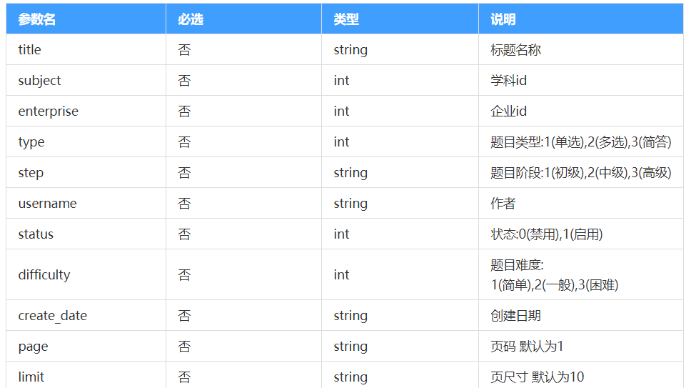
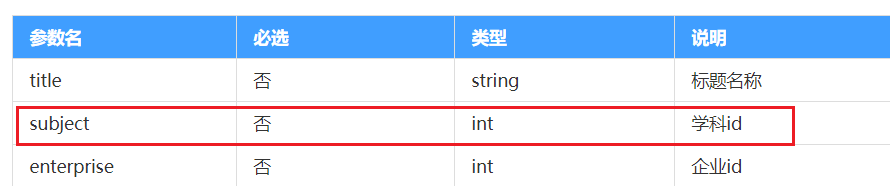
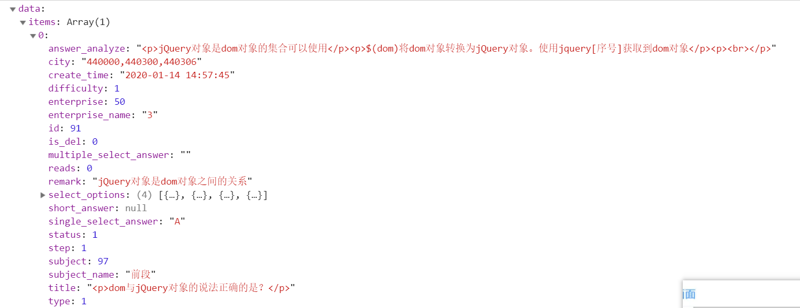

# day10 - 黑马面面

## 反馈

1.  权限管理真的难顶，好多要注意的小点。。。 
2.  愿天堂没有秃头 


## 回顾

导航守卫 

进入前导航守卫

~~~
router.beforeEach((to,from ,next)=>{
to:要去的路由信息
from :从哪来的路由信息
next  
    next() 正常进入下一步
    next(path) 甩到相应path的路由去
})
router.afterEach((to,from)=>{
to:当前所在路由的信息
from :从哪来的路由信息
})
~~~

props与emit

~~~
父传子数据
  1：在子组件标签上定义相应属性   属性名=“值”
  2：子组件接收该值   
       props:['值']，
       props:{
          值:{
          type:类型
          default:默认值
          }
       }
 子调用父方法
 1：在标签上定义相应方法与父组件方法对应   @子组件方法名=“父组件方法名”
 2：在子组件里触发该方法  this.$emit("子组件方法名",参数)
 
 注意点：如果父传子数据是基本数据类型  number string boolean之类的，子组件是不能修改该数据的，如果该值是引用型数据，我们是可以更改的  Object Array 
 
~~~


## 题库模块 - 分支切换

> 权限模块的逻辑已经搞定了，我们来合并一下

1. 切换到主分支
2. 合并权限分支到主分支
3. 删除权限分支
4. 创建题库分支`question`

~~~
git add .
git commit -m"用户模块已完成"
git push
git checkout master
git merge user
git push
git branch question
git checkout question
~~~


## 题库模块 - 顶部布局

> 顶部的布局和之前的类似，咱们将他弄出来

步骤:

1. 使用`el-card`作为容器

2. 使用`el-row`与`el-col`进行栅栏布局 

3. 结合设计图设置文本标记

4. 表单元素参数绑定结合接口传参命名

   

```vue
<template>
  <div class="question">
    <el-card>
      <el-form label-width="60px" :model="form">
        <el-row>
          <el-col :span="5">
            <el-form-item label="学科">
              <el-select v-model="form.subject" placeholder="请选择学科">
                <el-option label="学科1"></el-option>
                <el-option label="学科2"></el-option>
              </el-select>
            </el-form-item>
          </el-col>
          <el-col :span="5">
            <el-form-item label="阶段">
              <el-select v-model="form.step" placeholder="请选择阶段">
                <el-option :value="1" label="初级"></el-option>
                <el-option :value="2" label="中级"></el-option>
                <el-option :value="3" label="高级"></el-option>
              </el-select>
            </el-form-item>
          </el-col>
          <el-col :span="5">
            <el-form-item label="企业">
              <el-select v-model="form.enterprise" placeholder="请选择企业">
                <el-option label="企业1"></el-option>
                <el-option label="企业2"></el-option>
              </el-select>
            </el-form-item>
          </el-col>
          <el-col :span="5">
            <el-form-item label="题型">
              <el-select v-model="form.type" placeholder="请选择题型">
                <el-option :value="1" label="单选"></el-option>
                <el-option :value="2" label="多选"></el-option>
                <el-option :value="3" label="简答"></el-option>
              </el-select>
            </el-form-item>
          </el-col>
        </el-row>
        <el-row>
          <el-col :span="5">
            <el-form-item label="难度">
              <el-select v-model="form.diffculty" placeholder="请选择难度">
                <el-option label="简单" :value="1"></el-option>
                <el-option label="一般" :value="2"></el-option>
                <el-option label="困难" :value="3"></el-option>
              </el-select>
            </el-form-item>
          </el-col>
          <el-col :span="5">
            <el-form-item label="作者">
              <el-input v-model="form.username"></el-input>
            </el-form-item>
          </el-col>
          <el-col :span="5">
            <el-form-item label="状态">
              <el-select v-model="form.status" placeholder="请选择状态">
                <el-option label="禁用" :value="0"></el-option>
                <el-option label="启用" :value="1"></el-option>
              </el-select>
            </el-form-item>
          </el-col>
          <el-col :span="5">
            <el-form-item label="日期">
              <el-input v-model="form.create_date" placeholder="请选择日期"></el-input>
            </el-form-item>
          </el-col>
        </el-row>
        <el-row>
          <el-col :span="10">
            <el-form-item label="标题">
              <el-input v-model="form.title"></el-input>
            </el-form-item>
          </el-col>
          <el-col :span="10">
            <el-form-item label-width="0px">
              <el-button class="btn" type="primary">搜索</el-button>
              <el-button>清除</el-button>
              <el-button type="primary">+新增试题</el-button>
            </el-form-item>
          </el-col>
        </el-row>
      </el-form>
    </el-card>
  </div>
</template>
<script>
export default {
  data() {
    return {
      form: {
        subject: "", //学科
        step: "", //阶段
        enterprise: "", //企业
        type: "", //题型
        diffculty: "", //难度
        username: "", //作者
        status: "", //状态,
        create_date: "", //日期
        title: "" //标题
      }
    };
  }
};
</script>
<style lang="less">
.question {
  .btn {
    margin-left: 20px;
  }
}
</style>

```


## Element - ui - 日期选择器

>日期的选择不是下拉框了，使用的是日期选择器，如何使用呢，我们来研究一下

[传送门](https://element.eleme.cn/#/zh-CN/component/date-picker)

```html

<body>
    <!-- 挂载的元素 -->
    <div id="app">
        <el-date-picker v-model="value1" type="date" placeholder="选择日期">
        </el-date-picker>
    </div>
    <!-- 开发环境版本，包含了有帮助的命令行警告 -->
    <script src="https://cdn.jsdelivr.net/npm/vue/dist/vue.js"></script>
    <!-- 引入组件库 -->
    <script src="https://unpkg.com/element-ui/lib/index.js"></script>
    <script>
        const app = new Vue({
            el: "#app",
            data:{
                value1:""
            }
        })
    </script>

</body>
```


## 题库模块 - 日期选择器整合

> 将刚刚的日期选择器整合到页面的顶部

步骤:

1. 整合日期选择器，设置日期选择器相关联的数据属性即可

~~~html
           <el-form-item label="日期">
              <el-date-picker v-model="form.create_date" placeholder="请选择日期"></el-date-picker>
            </el-form-item>
~~~


## 题库模块 - 学科数据整合

> 顶部筛选区域的学科部分内容是和之前页面联动的哦

步骤：

1. 导入学科接口

    ~~~js
   import { getSubjectData } from "@/api/subject.js";
   ~~~

   

2. 调用 学科列表接口,并将获取到的数据保存到页面上

   ~~~js
     data() {
       return {
         form: {
           subject: "", //学科
           step: "", //阶段
           enterprise: "", //企业
           type: "", //题型
           diffculty: "", //难度
           username: "", //作者
           status: "", //状态,
           create_date: "", //日期
           title: "" //标题
         },
         subjectList: [] //学科列表
       };
     },
     created() {
       // 获取学科列表数据
       getSubjectData({}).then(res => {
         this.subjectList = res.data.items;
         window.console.log("学科:", res.data.items);
       });
     }
   ~~~

   

3. 把获取到的数据 渲染到页面上

   注意下拉 选择中的value对应的是数据里的id，那是因为接口上已注明是需要使用企业id

   

   ~~~html
               <el-form-item label="学科">
                 <el-select v-model="form.subject" placeholder="请选择学科">
                   <el-option
                     v-for="(item, index) in subjectList"
                     :key="index"
                     :value="item.id"
                     :label="item.name"
                   ></el-option>
                 </el-select>
               </el-form-item>
   ~~~

   

## 题库模块 - 企业数据整合

> 顶部筛选区域的企业部分内容也是和之前的页面联动哦

步骤:

1. 导入企业数据接口

   ~~~
   import { getBusinessDate } from "@/api/business.js";
   ~~~

   

2. 调用企业数据接口，并将列表数据保存

   ~~~js
   import { getSubjectData } from "@/api/subject.js";
   import { getBusinessDate } from "@/api/business.js";
   export default {
     data() {
       return {
         form: {
           subject: "", //学科
           step: "", //阶段
           enterprise: "", //企业
           type: "", //题型
           diffculty: "", //难度
           username: "", //作者
           status: "", //状态,
           create_date: "", //日期
           title: "" //标题
         },
         subjectList: [], //学科列表
         businessList: [] //企业列表
       };
     },
     created() {
       // 获取学科列表数据
       getSubjectData({}).then(res => {
         this.subjectList = res.data.items;
         window.console.log("学科:", res.data.items);
       });
       // 获取企业列表
       getBusinessDate({ limit: 1000 }).then(res => {
         this.businessList = res.data.items;
         window.console.log("企业列表:", res);
       });
     }
   };
   ~~~

   

3. 把获取到的数据渲染页面上

    ~~~html
          <el-form-item label="企业">
                 <el-select v-model="form.enterprise" placeholder="请选择企业">
                   <el-option
                     v-for="(item, index) in businessList"
                     :key="index"
                     :label="item.name"
                     :value="item.id"
                   ></el-option>
                 </el-select>
               </el-form-item>
    ~~~

   

## 题库模块-题库列表数据获取

>进入页面就要有题库列表数据

1. 先创建题库列表api对应的js文件，并写出相应获取题库列表的api方法

   1. 先在api下创建一个名为question.js的文件

   2. 再写入获取题库列表api方法

      ~~~js
      import instance from '@/utils/request.js'
      function getQuestionData(params) {
          return instance({
              url: "/question/list",
              method: "get",
              params      
          })
      }
      export { getQuestionData }
      ~~~

      

2. 进入题库列表在created该用该方法获取数据

   1. 导入获取题库列表的api方法

      ~~~
      import { getQuestionData } from "@/api/question.js";
      ~~~

      

   2. 在created里调用获取相应数据，由于后面搜索功能也会用到，所以我们提取成单独方法

   ~~~js
     data() {
       return {
         form: {
           subject: "", //学科
           step: "", //阶段
           enterprise: "", //企业
           type: "", //题型
           diffculty: "", //难度
           username: "", //作者
           status: "", //状态,
           create_date: "", //日期
           title: "" //标题
         },
         tableData: [],//题库列表数据
         subjectList: [], //学科列表
         businessList: [] //企业列表
       };
     },
     created() {
       // 获取学科列表数据
       searchSubject({}).then(res => {
         this.subjectList = res.data.items;
       });
       // 获取企业列表
       getBusinessData({ limit: 1000 }).then(res => {
         this.businessList = res.data.items;
       });
       // 进入页面获取默认题库列表数据
       this.getData();
     },
     methods: {
       // 获取题库列表数据
       getData() {
         getQuestionData({}).then(res => {
           this.tableData = res.data.items;
           window.console.log("题库列表数据", res);
         });
       }
     }
   ~~~

   

## 题库模块 - 底部布局

> 底部的布局和之前一样，我们来实现一下,需要注意的是`table`的外面多了边框

[带边框的table](https://element.eleme.cn/#/zh-CN/component/table#dai-bian-kuang-biao-ge)

[完整功能分页器](https://element.eleme.cn/#/zh-CN/component/pagination#fu-jia-gong-neng)

步骤:

1. 带边框的table,

2. 分页器

3. 根据获取的题库列表数据完成相应数据绑定

    

   ~~~html
   <template>
     <div class="question">
       <el-card>
         <!-- 
   栅栏   24栏
   行  el-row
   栏  el-col   多少栏  :span="5"  offset偏移
         -->
         <el-form :model="form" label-width="80px">
           <el-row>
             <el-col :span="5">
               <el-form-item label="学科" prop="subject">
                 <el-select placeholder="请选择学科" v-model="form.subject">
                   <el-option
                     v-for="(item, index) in subjectData"
                     :key="index"
                     :label="item.name"
                     :value="item.id"
                     v-show="item.status==1"
                   ></el-option>
                 </el-select>
               </el-form-item>
             </el-col>
             <el-col :span="5">
               <el-form-item label="阶段" prop="step">
                 <el-select placeholder="请选择阶段" v-model="form.step">
                   <el-option
                     v-for="(value,key,index) in stepObj"
                  :key="index"
                     :label="value"
                     :value="key"
                   ></el-option>
                   <!-- <el-option label="初级" value="1"></el-option>
                   <el-option label="中级" value="2"></el-option>
                   <el-option label="高级" value="3"></el-option>-->
                 </el-select>
               </el-form-item>
             </el-col>
             <el-col :span="5">
               <el-form-item label="企业" prop="enterprise">
                 <el-select placeholder="请选择企业" v-model="form.enterprise">
                   <el-option
                     v-for="(item, index) in businessData"
                     :key="index"
                     :label="item.name"
                     :value="item.id"
                     v-show="item.status==1"
                   ></el-option>
                 </el-select>
               </el-form-item>
             </el-col>
             <el-col :span="5">
               <el-form-item label="题型" prop="type">
                 <el-select placeholder="请选择题型" v-model="form.type">
                   <el-option
                     v-for="(value,key,index) in typeObj"
                     :key="index"
                     :label="value"
                     :value="+key"
                   ></el-option>
                   <!-- <el-option label="单选" :value="1"></el-option>
                   <el-option label="多选" :value="2"></el-option>
                   <el-option label="简答" :value="3"></el-option>-->
                 </el-select>
               </el-form-item>
             </el-col>
           </el-row>
           <el-row>
             <el-col :span="5">
               <el-form-item label="难度" prop="difficulty">
                 <el-select placeholder="请选择难度" v-model="form.difficulty">
                   <el-option label="简单" :value="1"></el-option>
                   <el-option label="一般" :value="2"></el-option>
                   <el-option label="困难" :value="3"></el-option>
                 </el-select>
               </el-form-item>
             </el-col>
             <el-col :span="5">
               <el-form-item label="作者" prop="username">
                 <el-input v-model="form.username"></el-input>
               </el-form-item>
             </el-col>
             <el-col :span="5">
               <el-form-item label="状态" prop="status">
                 <el-select placeholder="请选择状态" v-model="form.status">
                   <!-- 值是什么？ -->
                   <el-option :value="0" label="禁用"></el-option>
                   <el-option :value="1" label="启用"></el-option>
                 </el-select>
               </el-form-item>
             </el-col>
             <el-col :span="5">
               <el-form-item label="日期" prop="create_date">
                 <el-date-picker v-model="form.create_date" type="date" placeholder="选择日期"></el-date-picker>
               </el-form-item>
             </el-col>
           </el-row>
           <el-row>
             <el-col :span="10">
               <el-form-item label="标题" prop="title">
                 <el-input v-model="form.title"></el-input>
               </el-form-item>
             </el-col>
             <el-col :span="10">
               <!-- label-width 设置el-form-item上的标题宽度（当自己身上有label-width是优先听从自己的） -->
               <el-form-item label-width="10px">
                 <el-button type="primary" @click="search">搜索</el-button>
                 <el-button>清除</el-button>
                 <el-button type="primary">+新增试题</el-button>
               </el-form-item>
             </el-col>
           </el-row>
         </el-form>
       </el-card>
       <el-card>
         <!-- 
       el-table   data绑定整个表格的数据   border边框，它是一个boolean值   width 宽度
          el-table-column  栏   label标题  width设置宽度   prop绑定该栏对应的字段名
              自定义栏使用  1：在需要自定义的栏里加入一个template
                           2:通过slot-scope="局部变量"获取该行所有数据
     
         -->
         <el-table :data="tableData" :border="true">
           <el-table-column label="序号">
             <template slot-scope="scope">{{scope.$index+1}}</template>
           </el-table-column>
           <el-table-column label="题目">
             <template slot-scope="scope">
               <div v-html="scope.row.title"></div>
             </template>
           </el-table-column>
           <el-table-column label="学科.阶段">
             <template slot-scope="scope">{{scope.row.subject_name}}.{{stepObj[scope.row.step]}}</template>
             <!-- 对象.值   。语法有一个规定，后面的值要符合变量命名  不能数字 开头，不能是中文等
             有什么解决方法  对象[]语法 它没有变量命名的限制 规则
             -->
           </el-table-column>
           <el-table-column label="题型">
             <template slot-scope="scope">{{typeObj[scope.row.type]}}</template>
           </el-table-column>
           <el-table-column label="企业" prop="enterprise_name"></el-table-column>
           <el-table-column label="创建者" prop="username"></el-table-column>
           <el-table-column label="状态">
             <template slot-scope="scope">{{scope.row.status==0?'禁用':'启用'}}</template>
           </el-table-column>
           <el-table-column label="访问量" prop="reads"></el-table-column>
           <el-table-column label="操作" width="280px">
             <template slot-scope="scope">
               <!-- 编辑编辑的是整行数据 -->
               <el-button>编辑</el-button>
               <el-button
                 :type="scope.row.status==1?'info':'success'"
               >{{scope.row.status==0?'启用':'禁用'}}</el-button>
               <el-button>删除</el-button>
             </template>
           </el-table-column>
         </el-table>
       </el-card>
     </div>
   </template>
   <script>
   import { getSubjectData } from "@/api/subject.js";
   import { getBusinessDate } from "@/api/business.js";
   import { getQuestionData } from "@/api/question.js";
   export default {
     data() {
       return {
         form: {
           title: "",
           subject: "",
           enterprise: "",
           type: "",
           step: "",
           username: "",
           status: "",
           difficulty: "",
           create_date: ""
         },
         stepObj: { 1: "初级", 2: "中级", 3: "高级" },
         typeObj: { 1: "单选", 2: "多选", 3: "简答" },
         subjectData: [], //学科列表数据
         businessData: [], //企业列表数据
         tableData: [] //题库列表数据
       };
     },
     created() {
       getSubjectData({ limit: 1000 }).then(res => {
         this.subjectData = res.data.items;
       });
       getBusinessDate({ limit: 1000 }).then(res => {
         this.businessData = res.data.items;
       });
       this.getData();
     },
     methods: {
       // 获取题库列表
       getData() {
         getQuestionData().then(res => {
           window.console.log("题库列表数据:", res);
           this.tableData = res.data.items;
         });
       },
       search() {
         window.console.log("所有数据:", this.form);
       }
     }
   };
   </script>
   <style>
   </style>
   ~~~
   
   


## 题库模块-分页基本功能

> 题库列表加入分页

1. 加入完整分页

   ~~~js
         <div>
           <el-pagination
             v-if="pagination.total>0"
             @size-change="handleSizeChange"
             @current-change="handleCurrentChange"
             :current-page="pagination.currentPage"
             :page-sizes="[1, 20, 30, 40]"
             :page-size="pagination.pageSize"
             layout="total, sizes, prev, pager, next, jumper"
             :total="pagination.total"
           ></el-pagination>
         </div>
   ~~~

2. 定义分页参数与分页点击事件处理

   ~~~js
   <script>
   import { searchSubject } from "@/api/subject.js";
   import { getBusinessData } from "@/api/business.js";
   import { getQuestionData } from "@/api/quesition.js";
   export default {
     data() {
       return {
         form: {
           subject: "", //学科
           step: "", //阶段
           enterprise: "", //企业
           type: "", //题型
           diffculty: "", //难度
           username: "", //作者
           status: "", //状态,
           create_date: "", //日期
           title: "" //标题
         },
         table: [],
         pagination: {
           currentPage: 1,
           pageSize: 1,
           total: 2
         },
         subjectList: [], //学科列表
         businessList: [] //企业列表
       };
     },
     created() {
       // 获取学科列表数据
       searchSubject({}).then(res => {
         this.subjectList = res.data.items;
       });
       // 获取企业列表
       getBusinessData({ limit: 1000 }).then(res => {
         this.businessList = res.data.items;
       });
       // 进入页面获取默认题库列表数据
       this.getData();
     },
     methods: {
       // 获取题库列表数据
       getData() {
         getQuestionData({}).then(res => {
           this.table = res.data.items;
           window.console.log("题库列表数据", res);
         });
       },
       handleSizeChange(size) {
         //每页条数改变时回调
         this.pagination.pageSize = size;
   
       },
       handleCurrentChange(page) {
         //当前页码改变时的回调
         this.pagination.currentPage = page;  
       }
     }
   };
   ~~~


## 题库模块-搜索功能完善

>完成搜索时展示相应数据，并结合分页功能

1. 默认搜索传入相应数据,前面题库列表数据是没有结合分页的

   ~~~js
       // 获取题库列表数据
       getData() {
         let _params = {
           ...this.form,
           page: this.pagination.currentPage,
           limit: this.pagination.pageSize 
         };
         getQuestionData(_params).then(res => {
           this.table = res.data.items;
           window.console.log("题库列表数据", res);
         });
       },
   ~~~

2. 处理分页数据的总数

   ~~~js
       // 获取题库列表数据
       getData() {
         let _params = {
           ...this.form,
           ...{ page: this.pagination.currentPage, limit: this.pagination.total }
         };
         getQuestionData(_params).then(res => {
           this.table = res.data.items;
           // 处理分页总数
           this.pagination.total = res.data.pagination.total;
           window.console.log("题库列表数据", res);
         });
       },
   ~~~

3. 处理点击搜索按钮功能

   1. 搜索按钮绑定点击 事件

      ~~~js
           <el-form-item label-width="0px">
                    <el-button class="btn" type="primary" @click="search">搜索</el-button>
                    <el-button>清除</el-button>
                    <el-button type="primary">+新增试题</el-button>
                  </el-form-item>
      ~~~

   2. 定义搜索事件，搜索时需要还原页码为第一页，同时调用搜索方法

      ~~~js
          search() {
            this.pagination.currentPage = 1;
            this.getData();
          }
      ~~~

   3. 完成分页组件点击时的搜索功能

      ~~~js
          handleSizeChange(size) {
            //每页条数改变时回调
            this.pagination.pageSize = size;
            // 条数改变执行搜索时，currentPage回到第一页
            this.search();
          },
          handleCurrentChange(page) {
            //当前页码改变时的回调
            this.pagination.currentPage = page;
            this.getData();
          },
      ~~~

## 题库模块-清除功能

> 清空筛选条件，同时执行搜索

1. 先在清空按钮上绑定相应方法

   ~~~html
       <el-form-item label-width="0px">
         <el-button class="btn" type="primary" @click="search">搜索</el-button>
                 <el-button @click="clear">清除</el-button>
                 <el-button type="primary">+新增试题</el-button>
               </el-form-item>
   ~~~

2. 处理清除事件，还原搜索条件，同时执行搜索

   ~~~js
       // 清除
       clear() {
         this.form = {
           subject: "", //学科
           step: "", //阶段
           enterprise: "", //企业
           type: "", //题型
           diffculty: "", //难度
           username: "", //作者
           status: "", //状态,
           create_date: "", //日期
           title: "" //标题
         };
         this.search();
       }
   ~~~

   

## Element - ui 全屏对话框

> 试题的新增，那个对话框特别大，不需要修改样式，只需要一个属性，即可实现这个功能

[传送门](https://element.eleme.cn/#/zh-CN/component/dialog#attributes)

为`el-dialog`设置`fullscreen`即可实现全屏对话框

## 题库模块-新增组件

> 结合el-dialog完成题库新增组件

1. 先创建一个最基本的新增组件，在`question.vue`同目录下创建一个`addQuestion.vue`,写入最基本的`el-dialog`

   ~~~vue
   <template>
     <el-dialog class="addSubject" :visible.sync="dialogVisible" :fullscreen="true">
       
       </el-dialog>
   </template>
   <script>
   export default {
     data() {
       return {
         dialogVisible: false
       };
     }
   };
   </script>
   <style>
   </style>
   ~~~

2. 在题库模块中引入 该组件

   1. 导入    `import addQuestion from "./addQuestion";`

   2. 注册    

      ~~~js
        components: {
          addQuestion
        },
      ~~~

      

   3. 使用

      ~~~
      <addQuestion></addQuestion>
      ~~~

3. 点击题库列表弹出新增组件

   1. 在按钮上定义相应方法

      ~~~html
      <el-button type="primary" @click="add">+新增试题</el-button>
      ~~~

   2. 定义相应方法，通过ref访问弹出组件的显示隐藏参数进行控制

      在弹出组件标签上定义ref

      ~~~html
         <addQuestion ref="addQuestion"></addQuestion>
      ~~~

      定义add方法

      ~~~js
          // 新增
          add() {
              //dialogVisible为新增组件中显示与隐藏的控制参数
            this.$refs.addQuestion.dialogVisible = true;
          }
      ~~~

## 题库模块-新增组件-学科

>学科数据是下拉选项，它的选择是可通过父子组件传值传过来的

1. 通过props父子组件传值将学科数据传递给子组件

   在新增组件上定义一个属性传递学科数据

   ~~~js
       <addQuestion ref="addQuestion" :subjectList="subjectList"></addQuestion>
   ~~~

   在新增组件中接收并使用该值，同时对照新增接口参数加上相应的校验

   ~~~vue
   <template>
     <el-dialog class="addQuestion" :visible.sync="dialogVisible" :fullscreen="true">
       <div slot="title" class="title">新增题库</div>
       <el-form  class="form" label-width="80px" :model="form">
         <el-form-item label="学科">
           <el-select v-model="form.subject">
             <el-option
               v-for="(item, index) in subjectList"
               :key="index"
               :value="item.id"
               :label="item.name"
             ></el-option>
           </el-select>
         </el-form-item>
       </el-form>
      <div slot="footer" class="btnCenter">
         <el-button @click="dialogVisible=false">取消</el-button>
         <el-button>确定</el-button>
       </div>
     </el-dialog>
   </template>
   <script>
   export default {
       //接收父组件传递过来的学科数据
     props: ["subjectList"],
     data() {
       return {
         dialogVisible: false,
         form: {
           subject: ""
         },
       };
     }
   };
   </script>
   <style lang="less">
   .addQuestion {
     .el-dialog__header {
       padding: 0;
     }
     .title {
       text-align: left;
       color: #fff;
       height: 53px;
       background-color: rgb(14, 156, 250);
       font-size: 18px;
       line-height: 53px;
     }
     .form {
       width: 800px;
       margin: 0 auto;
     }
     .inputW {
       width: 364px;
     }
         .btnCenter {
       text-align: center;
     }
   }
   </style>
   ~~~

## 题库模块-阶段-企业

>完成阶段与企业的基本html

~~~vue
<template>
  <el-dialog class="addQuestion" :visible.sync="dialogVisible" :fullscreen="true">
    <div slot="title" class="title">新增题库</div>
   <el-form class="form" label-width="80px" :model="form">
      <el-form-item label="学科">
        <el-select v-model="form.subject">
          <el-option
            v-for="(item, index) in subjectList"
            :key="index"
            :value="item.id"
            :label="item.name"
          ></el-option>
        </el-select>
      </el-form-item>
      <el-form-item label="阶段">
        <el-select placeholder="请选择阶段" v-model="form.step">
          <el-option :value="1" label="初级"></el-option>
          <el-option :value="2" label="中级"></el-option>
          <el-option :value="3" label="高级"></el-option>
        </el-select>
      </el-form-item>
      <el-form-item label="企业">
        <el-select placeholder="请选择企业" v-model="form.enterprise">
          <el-option
            v-for="(item, index) in businessList"
            :key="index"
            :label="item.name"
            :value="item.id"
          ></el-option>
        </el-select>
      </el-form-item>
    </el-form>
         <div slot="footer" class="btnCenter">
      <el-button @click="dialogVisible=false">取消</el-button>
      <el-button>确定</el-button>
    </div>
  </el-dialog>
</template>
<script>
export default {
  props: ["subjectList", "businessList"],
  data() {
    return {
      dialogVisible: false,
      form: {
        subject: "", //学科
        step: "", //阶段
        enterprise:""  //企业
      },
    };
  }
};
</script>
<style lang="less">
.addQuestion {
  .el-dialog__header {
    padding: 0;
  }
  .el-dialog__headerbtn .el-dialog__close {
    color: #fff;
  }
  .title {
    text-align: left;
    color: #fff;
    height: 53px;
    background-color: rgb(14, 156, 250);
    font-size: 18px;
    line-height: 53px;
  }
  .form {
    width: 800px;
    margin: 0 auto;
  }
  .inputW {
    width: 364px;
  }
          .btnCenter {
    text-align: center;
  }
}
</style>
~~~

注意：企业列表businessList数据也得像学科列表一样，在题库模块定义后传递过来


## Element - ui 级联选择器

> 多级选择可以使用Element-ui的级联选择器来做哦，有个prop属性需要好好注意一下哦

[传送门](https://element.eleme.cn/#/zh-CN/component/cascader)

```html
<body>
    <!-- 挂载的元素 -->
    <div id="app">
        <!-- 
            数据中默认
                label:看到的文本
                value:选中的文本的值
            props:{value:'label'}
                选中的时候，value值通过 label属性去获取
         -->
        <el-cascader v-model="value"  :props="{value:'label',expandTrigger:'hover'}" :options="options" @change="handleChange"></el-cascader>
    </div>
    <!-- 开发环境版本，包含了有帮助的命令行警告 -->
    <script src="https://cdn.jsdelivr.net/npm/vue/dist/vue.js"></script>
    <!-- 引入组件库 -->
    <script src="https://unpkg.com/element-ui/lib/index.js"></script>
    <script>
        const app = new Vue({
            el: "#app",
            data: {
                value: [],
                options: [{
                    value: 'zhinan',
                    label: '指南',
                    children: [{
                        value: 'shejiyuanze',
                        label: '设计原则',
                        children: [{
                            value: 'yizhi',
                            label: '一致'
                        }, {
                            value: 'fankui',
                            label: '反馈'
                        }, {
                            value: 'xiaolv',
                            label: '效率'
                        }, {
                            value: 'kekong',
                            label: '可控'
                        }]
                    }, {
                        value: 'daohang',
                        label: '导航',
                        children: [{
                            value: 'cexiangdaohang',
                            label: '侧向导航'
                        }, {
                            value: 'dingbudaohang',
                            label: '顶部导航'
                        }]
                    }]
                }, {
                    value: 'zujian',
                    label: '组件',
                    children: [{
                        value: 'basic',
                        label: 'Basic',
                        children: [{
                            value: 'layout',
                            label: 'Layout 布局'
                        }, {
                            value: 'color',
                            label: 'Color 色彩'
                        }, {
                            value: 'typography',
                            label: 'Typography 字体'
                        }, {
                            value: 'icon',
                            label: 'Icon 图标'
                        }, {
                            value: 'button',
                            label: 'Button 按钮'
                        }]
                    }, {
                        value: 'form',
                        label: 'Form',
                        children: [{
                            value: 'radio',
                            label: 'Radio 单选框'
                        }, {
                            value: 'checkbox',
                            label: 'Checkbox 多选框'
                        }, {
                            value: 'input',
                            label: 'Input 输入框'
                        }, {
                            value: 'input-number',
                            label: 'InputNumber 计数器'
                        }, {
                            value: 'select',
                            label: 'Select 选择器'
                        }, {
                            value: 'cascader',
                            label: 'Cascader 级联选择器'
                        }, {
                            value: 'switch',
                            label: 'Switch 开关'
                        }, {
                            value: 'slider',
                            label: 'Slider 滑块'
                        }, {
                            value: 'time-picker',
                            label: 'TimePicker 时间选择器'
                        }, {
                            value: 'date-picker',
                            label: 'DatePicker 日期选择器'
                        }, {
                            value: 'datetime-picker',
                            label: 'DateTimePicker 日期时间选择器'
                        }, {
                            value: 'upload',
                            label: 'Upload 上传'
                        }, {
                            value: 'rate',
                            label: 'Rate 评分'
                        }, {
                            value: 'form',
                            label: 'Form 表单'
                        }]
                    }, {
                        value: 'data',
                        label: 'Data',
                        children: [{
                            value: 'table',
                            label: 'Table 表格'
                        }, {
                            value: 'tag',
                            label: 'Tag 标签'
                        }, {
                            value: 'progress',
                            label: 'Progress 进度条'
                        }, {
                            value: 'tree',
                            label: 'Tree 树形控件'
                        }, {
                            value: 'pagination',
                            label: 'Pagination 分页'
                        }, {
                            value: 'badge',
                            label: 'Badge 标记'
                        }]
                    }, {
                        value: 'notice',
                        label: 'Notice',
                        children: [{
                            value: 'alert',
                            label: 'Alert 警告'
                        }, {
                            value: 'loading',
                            label: 'Loading 加载'
                        }, {
                            value: 'message',
                            label: 'Message 消息提示'
                        }, {
                            value: 'message-box',
                            label: 'MessageBox 弹框'
                        }, {
                            value: 'notification',
                            label: 'Notification 通知'
                        }]
                    }, {
                        value: 'navigation',
                        label: 'Navigation',
                        children: [{
                            value: 'menu',
                            label: 'NavMenu 导航菜单'
                        }, {
                            value: 'tabs',
                            label: 'Tabs 标签页'
                        }, {
                            value: 'breadcrumb',
                            label: 'Breadcrumb 面包屑'
                        }, {
                            value: 'dropdown',
                            label: 'Dropdown 下拉菜单'
                        }, {
                            value: 'steps',
                            label: 'Steps 步骤条'
                        }]
                    }, {
                        value: 'others',
                        label: 'Others',
                        children: [{
                            value: 'dialog',
                            label: 'Dialog 对话框'
                        }, {
                            value: 'tooltip',
                            label: 'Tooltip 文字提示'
                        }, {
                            value: 'popover',
                            label: 'Popover 弹出框'
                        }, {
                            value: 'card',
                            label: 'Card 卡片'
                        }, {
                            value: 'carousel',
                            label: 'Carousel 走马灯'
                        }, {
                            value: 'collapse',
                            label: 'Collapse 折叠面板'
                        }]
                    }]
                }, {
                    value: 'ziyuan',
                    label: '资源',
                    children: [{
                        value: 'axure',
                        label: 'Axure Components'
                    }, {
                        value: 'sketch',
                        label: 'Sketch Templates'
                    }, {
                        value: 'jiaohu',
                        label: '组件交互文档'
                    }]
                }]
            }
            , methods: {
                handleChange(value) {
                    console.log(value);
                }
            },
        })
    </script>

</body>

```


## npm 省市区数据

> 省市区的数据怎么获取呢

[传送门](https://www.npmjs.com/package/element-china-area-data)

步骤:

1. 下包 `npm i element-china-area-data`

2. 导包 `

   ```javascript
   import { provinceAndCityData, regionData, provinceAndCityDataPlus, regionDataPlus, CodeToText, TextToCode } from 'element-china-area-data'
   ```

    `

3. 用包

4. `provinceAndCityData`是省市二级联动数据（不带“全部”选项）

5. `regionData`是省市区三级联动数据（不带“全部”选项）

6. `provinceAndCityDataPlus`是省市二级联动数据（带“全部”选项）

7. `regionDataPlus`是省市区三级联动数据（带“全部”选项）

8. "全部"选项绑定的value是空字符串`""`

9. `CodeToText`是个大对象，属性是区域码，属性值是汉字 用法例如：`CodeToText['110000']`输出`北京市`

10. `TextToCode`是个大对象，属性是汉字，属性值是区域码 用法例如：`TextToCode['北京市'].code`输出`110000`,`TextToCode['北京市']['市辖区'].code`输出`110100`,`TextToCode['北京市']['市辖区']['朝阳区'].code`输出`110105`

```html
<template>
  <div id="app">
    <el-cascader
      size="large"
      :options="options"
      v-model="selectedOptions"
      @change="handleChange">
    </el-cascader>
  </div>
</template>
 
<script>
  import { provinceAndCityData } from 'element-china-area-data'
  export default {
    data () {
      return {
        options: provinceAndCityData,
        selectedOptions: []
      }
    },
 
    methods: {
      handleChange (value) {
        console.log(value)
      }
    }
  }
</script>
```

## 题库模块-新增组件省市区选择

>使用省市区联动选择

1. 下包 `npm i element-china-area-data`

2. 导包 `import { regionData } from "element-china-area-data"`;

3. 用包

   html

   ~~~html
         <el-form-item label="城市">
           <el-cascader
             size="large"
             :props="{value:'label'}"
             :options="options"
             @change="handleChange"
           ></el-cascader>
         </el-form-item>
   ~~~

   js

   ~~~vue
   <script>
   import { regionData } from "element-china-area-data";
   export default {
     props: ["subjectList", "businessList"],
     data() {
       return {
         dialogVisible: false,
         //   省市区数据
         options: regionData
       };
     },
     methods: {
       handleChange(val) {
         window.console.log(val);
       }
     }
   };
   </script>
   ~~~

   


## Element - ui 单选框组

> 多个互斥的选项，我们可以使用单选框组来实现

[传送门](https://element.eleme.cn/#/zh-CN/component/radio#dan-xuan-kuang-zu)

```html
<body>
    <!-- 挂载的元素 -->
    <div id="app">
        <el-radio-group v-model="radio">
            <!-- label 相当于是value   -->
            <!-- 双标签内部的值 看到的文本 -->
            <el-radio :label="1">西兰花</el-radio>
            <el-radio :label="2">花菜</el-radio>
            <el-radio :label="3">鸡蛋</el-radio>
        </el-radio-group>
    </div>
    <!-- 开发环境版本，包含了有帮助的命令行警告 -->
    <script src="https://cdn.jsdelivr.net/npm/vue/dist/vue.js"></script>
    <!-- 引入组件库 -->
    <script src="https://unpkg.com/element-ui/lib/index.js"></script>
    <script>
        const app = new Vue({
            el: "#app",
            data: {
                radio: 3
            }
        })
    </script>

</body>
```

