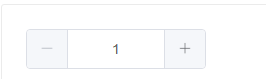

# day11 - 黑马面面

## 反馈

1.  老师辛苦啦
2.  挺好的👌 今天那个checkbox本来有些模糊，飞飞老师又巩固了一遍。完美理解


## 回顾

1. 日期选择器

   ~~~
   el-date-picker
   v-model     type类型决定日期组件功能  date  年月日
   
   ~~~

2. 联动选择器

   ~~~
   el-cascader   
   v-model 数据双向绑定
   options  该联动选择器的使用的数据 
   默认：  是个数组  xxxx  oooo  child
   props  修改配制   :props={label:'xxxx',value:'oooo',children:'child'}
   ~~~

3. radio

   ~~~
   el-radio   值  label
   el-radio-group 写一个v-model就ok
   ~~~

   


## 题库模块-新增组件题型与难度

>题型与难度的基本功能处理

~~~vue
      <el-form-item label="题型" prop='type'>
        <el-radio-group v-model="form.type">
          <el-radio :label="1">单选</el-radio>
          <el-radio :label="2">多选</el-radio>
          <el-radio :label="3">简答</el-radio>
        </el-radio-group>
      </el-form-item>
      <el-form-item label="难度" prop='difficulty'>
        <el-radio-group v-model="form.difficulty">
          <el-radio :label="1">简单</el-radio>
          <el-radio :label="2">一般</el-radio>
          <el-radio :label="3">困难</el-radio>
        </el-radio-group>
      </el-form-item>
~~~

对应form数据处理

~~~
      form: {
        subject: "", //学科
        step: "", //阶段
        enterprise: "", //企业
        city:[],
        type: 1, //题型
        difficulty: 1 //难度
      },
~~~


##  vue-quill-editor 富文本编辑器

> 项目中使用了富文本编辑器，我们来看看如何使用

npm地址： [https://www.npmjs.com/package/vue-quill-editor](https://www.npmjs.com/package/vue-quill-editor) 

1. 安装

   1. ~~~
      npm i vue-quill-editor
      ~~~

2. 使用

   1. ~~~js
      //导入相应的组件与相应的css
      import { quillEditor } from "vue-quill-editor";
      import "quill/dist/quill.core.css";
      import "quill/dist/quill.snow.css";
      import "quill/dist/quill.bubble.css";
      ~~~

   2. 注册

      ~~~
        components: {
          quillEditor
        }
      ~~~

   3. 使用

      ~~~html
      //v-model为该组件双向绑定的值，@change="就是一个change事件，该事件会返回该函数相应的值" 
      <quillEditor v-model="content" @change="editorChange"></quillEditor>
      ~~~

      

```html
<template>
  <div>
    <quillEditor v-model="content" ref="myQuillEditor" @change="editorChange"></quillEditor>
  </div>
</template>
<script>
import { quillEditor } from "vue-quill-editor";
import "quill/dist/quill.core.css";
import "quill/dist/quill.snow.css";
import "quill/dist/quill.bubble.css";
export default {
  data() {
    return {
      content: ""
    };
  },
  components: {
    quillEditor
  },
  methods: {
    editorChange(val) {
      window.console.log(val);
    }
  }
};
</script>
<style>
</style>
```


## 题库模块 - 新增题库中加入富文本编辑器

>我们将他包装一层，方便外部使用

步骤：

1. 下包`npm i vue-quill-editor`

2. 引入 该富文本编辑器

   1. 导入，注册，使用

      ~~~js
      import { quillEditor } from "vue-quill-editor";
      import "quill/dist/quill.core.css";
      import "quill/dist/quill.snow.css";
      import "quill/dist/quill.bubble.css";
      ~~~

   2. 注册

      1. ~~~js
         components: {
           quillEditor
         }
         ~~~

         

   3. 使用时绑定相应的v-model值即可

      ~~~
            <el-form-item label="试题标题">
              <quillEditor v-model="form.title"></quillEditor>
            </el-form-item>
      ~~~

   4. 在form中加入相应的变量title

      ~~~js
            form: {
              subject: "", //学科
              step: "", //阶段
              enterprise: "", //企业
              type: 1, //题型
              difficulty: 1, //难度
              title: "" //标题
            },
      ~~~

      

## 组件传值 - $emit

> 在使用prop传递数据的时候，不能直接修改来自于父组件的数据，那么如何和父组件通讯呢? 使用`$emit`就可以了哦

[传送门](https://cn.vuejs.org/v2/guide/components.html#%E7%9B%91%E5%90%AC%E5%AD%90%E7%BB%84%E4%BB%B6%E4%BA%8B%E4%BB%B6)

父传子数据

1. 在子组件身上定义一下相应的属性   属性名=“值”

2. 在子组件内接收该值

   1. ~~~
      props:['属性名']
      ~~~

   2. ~~~
      props:{
      属性名:{
      type:类型   Number   String.....
      default:123
      default:定义引用类型的数据function(){return {}
      }
      }
      注意点：
      定义默认值时如果是基本数据类型直接写值就OK
      但是如果是引用类型数据，需要function(){return 相应值}
      如果props传递的是基本类型的数据，我们是不可以修改的
      但是如果是引用类型数据，我们是可以修改的，而且修改后，父组件也会相应修改
      
      ~~~

      

子组件调用父组件方法

- 在子组件上定义一个方法
  - <子组件 @`自定义方法名`=“`父组件方法`”></子组件>
  - button  @click="btnClick"
- 在子组件里调用该方法
  - this.$emit("`自定义方法名`",参数)，这样就会触发`父组件方法`

## 组件传值 - v-model（重要）

> 虽然使用prop和emit可以实现通讯，但是双向绑定不是更简单吗，如何使用呢？

[传送门](https://cn.vuejs.org/v2/guide/components.html#%E5%9C%A8%E7%BB%84%E4%BB%B6%E4%B8%8A%E4%BD%BF%E7%94%A8-v-model)

步骤:

1. 子组件中定义`value`属性
2. 数据改变的时候，要去触发`input`事件
   1. `$emit`去触发
3. 父组件就可以通过`v-model`实现双向数据绑定

注意：

1. v-model的本质其实是一个`语法糖`
2. 帮助我们把几步操作简化为一个命令
3. 简化了
   1. v-bind:value的属性绑定    
   2. v-on:input的事件绑定
      1. 事件中，直接把传递过来的数据 设置给 绑定的父组件属性

## 自定义组件 - 计数器

> 使用刚刚学习的`prop`和`$emit`咱们来封装一个 计数器组件



参数

| 参数  |  说明  |  类型  | 默认值 |
| :---: | :----: | :----: | :----: |
| value | 绑定值 | number |   0    |
|  min  | 最小值 | number | 无限小 |
|  max  | 最大值 | number | 无限大 |
| step  |  步长  | number |   1    |

事件

| 事件名        | 说明      | 参数        |
| ------------- | --------- | ----------- |
| number-change | value改变 | 新的value值 |

```html
<template>
  <div class="input-number">
    <span @click="sub">-</span>
    <input type="text" v-model="selfValue" />
    <span @click="add">+</span>
  </div>
</template>

<script>
export default {
  // 定义参数
  props: {
    value: {
      type: Number,
      default: 0
    },
    min: {
      type: Number 
    },
    max: {
      type: Number
    },
    step: {
      type: Number,
      default: 1
    }
  },
  // 定义自己的数据
  data() {
    return {
      selfValue: this.value
    };
  },
  methods: {
    // 递减
    sub() {
      if (this.min === undefined) {
        // 没有限制 无止境的递减
        this.selfValue -= this.step;
      } else {
        //  先递减
        this.selfValue -= this.step;
        if (this.selfValue < this.min) {
          this.selfValue = this.min;
        }
      }
    },
    // 累加
    add() {
      if (this.max === undefined) {
        this.selfValue += this.step;
      } else {
        this.selfValue += this.step;
        if (this.selfValue > this.max) {
          this.selfValue = this.max;
        }
      }
    }
  }
};
</script>

<style>
.input-number {
  display: flex;
}
.input-number span {
  height: 40px;
  width: 40px;
  text-align: center;
  line-height: 40px;
  font-size: 25px;
  color: gray;
  border: 1px solid gray;
}
.input-number span:first-child {
  border-top-left-radius: 5px;
  border-bottom-left-radius: 5px;
}
.input-number span:last-child {
  border-top-right-radius: 5px;
  border-bottom-right-radius: 5px;
}
.input-number input {
  width: 100px;
}
</style>

```


## 题库模块-新增组件单选抽离

>将单选，多选简答抽离成一个单独组件

1. 创建一个allSelect.vue组件，用于抽离 单选，多选，简答区域功能

2. 同时在新增组件中使用上

   1. 导入  import allSelect from "./allSelect.vue";

   2. 注册  

   3. 使用

      ~~~vue
         <el-form-item :label="{1:'单选',2:'多选',3:'简答'}[form.type]">
          <allSelect></allSelect>
         </el-form-item> 
      ~~~

   4. 在新增组件上定义完整 的form表单选项所需要的值

      ~~~js
            form: {
              subject: "", //学科
              step: "", //阶段
              enterprise: "", //企业
              city: [],
              type: 1, //题型
              difficulty: "", //难度
              title: "", //试题标题
              single_select_answer: "", // 单选答案
              multiple_select_answer: [], //多选答案
              short_answer: "", //简答答案
              video: "", //解析视频
              remark: "", //试题备注
              // 题目选项
              select_options: [
                {
                  label: "A",
                  text: "狗不理",
                  image: ""
                },
                {
                  label: "B",
                  text: "猫不理",
                  image: ""
                },
                {
                  label: "C",
                  text: "麻花",
                  image: ""
                },
                {
                  label: "D",
                  text: "炸酱面",
                  image: ""
                }
              ]
      ~~~

      

   5. 使用时，将form表单数据传递过去，以便选项组件能直接获取type与一些其它选项值

      ~~~
         <el-form-item :label="{1:'单选',2:'多选',3:'简答'}[form.type]">
          <allSelect :form="form"></allSelect>
         </el-form-item> 
      ~~~

3. 在单独组件中获取传递过来的form值，同时写出单独页面

   1. 单选组件中获取传递过来的form

      ~~~
        props: {
          form: {
            type: Object
          }
      ~~~

   2. 同时针对form里的type处理出单选

`单选`

~~~vue
    <!-- 单选 -->
    <div v-if="form.type==1">
      <el-row v-for="(item, index) in form.select_options" :key="index">
        <el-col :span="20">
          <el-radio
            class="radioItem"
            :label="item.label"
            v-model="form.single_select_answer"
          >
            {{item.label}}
            <el-input v-model="item.text" class="input"></el-input>
          </el-radio>
        </el-col>
        <el-col :span="4">
         上传图片
        </el-col>
      </el-row>
    </div>
~~~


## 题库模块-选项组件抽离图片上传

>图片上传功能比较独立，可以抽离 出来，结构更简洁

先ctrl+c复制element相应的上传组件，修改下上传地址

~~~vue
<template>
  <el-upload
    class="avatar-uploader"
    :action="uploadURL"
    :show-file-list="false"
    :on-success="handleAvatarSuccess"
    :before-upload="beforeAvatarUpload"
  >
    
    <i v-else class="el-icon-plus avatar-uploader-icon"></i>
  </el-upload>
</template>


<script>
export default {
  data() {
    return {
      imageUrl: "",
      // 上传的地址
      uploadURL: process.env.VUE_APP_URL + "/question/upload"
    };
  },
  methods: {
    handleAvatarSuccess(res, file) {
      this.imageUrl = URL.createObjectURL(file.raw);
    },
    beforeAvatarUpload(file) {
      const isJPG = file.type === "image/jpeg";
      const isLt2M = file.size / 1024 / 1024 < 2;

      if (!isJPG) {
        this.$message.error("上传头像图片只能是 JPG 格式!");
      }
      if (!isLt2M) {
        this.$message.error("上传头像图片大小不能超过 2MB!");
      }
      return isJPG && isLt2M;
    }
  }
};
</script>
<style>
.avatar-uploader .el-upload {
  border: 1px dashed #d9d9d9;
  border-radius: 6px;
  cursor: pointer;
  position: relative;
  overflow: hidden;
}
.avatar-uploader .el-upload:hover {
  border-color: #409eff;
}
.avatar-uploader-icon {
  font-size: 28px;
  color: #8c939d;
  width: 178px;
  height: 178px;
  line-height: 178px;
  text-align: center;
}
.avatar {
  width: 178px;
  height: 178px;
  display: block;
}
</style>
~~~

再整合进新增组件的单选多选简答的抽离组件中

1. 导入，注册，使用

~~~vue
  导入：import uploadImage from "./uploadImage";
  注册：  components: { uploadImage  },
  使用：
  <el-col :span="4">
          <uploadImage></uploadImage>
        </el-col>
~~~

2. 给图片上传组件来一个默认图片显示（当有图片数据时），结合v-model，

`uploadImage组件调整`

将uploadImage里的image改为props传值的value,同时修改成功的回调处理

~~~vue
<template>
  <el-upload
    class="avatar-uploader"
    :action="uploadURL"
    :show-file-list="false"
    :on-success="handleAvatarSuccess"
    :before-upload="beforeAvatarUpload"
  >
    
    <i v-else class="el-icon-plus avatar-uploader-icon"></i>
  </el-upload>
</template>


<script>
export default {
  props: {
    value: {
      type: String,
      default: ""
    }
  },
  data() {
    return {
      // 上传的地址
      uploadURL: process.env.VUE_APP_URL + "/question/upload",
      baseUrl: process.env.VUE_APP_URL + "/"
    };
  },
  methods: {
    handleAvatarSuccess(res, file) {
      window.console.log(file);
      //   this.imageUrl = URL.createObjectURL(file.raw);
      this.$emit("input", res.data.url);
      window.console.log("图片上传成功：", res);
    },
    beforeAvatarUpload(file) {
      const isJPG = file.type === "image/jpeg" || file.type === "image/png";
      const isLt2M = file.size / 1024 / 1024 < 2;

      if (!isJPG) {
        this.$message.error("上传头像图片只能是 JPG,png 格式!");
      }
      if (!isLt2M) {
        this.$message.error("上传头像图片大小不能超过 2MB!");
      }
      return isJPG && isLt2M;
    }
  }
};
</script>
<style>
.avatar-uploader .el-upload {
  border: 1px dashed #d9d9d9;
  border-radius: 6px;
  cursor: pointer;
  position: relative;
  overflow: hidden;
}
.avatar-uploader .el-upload:hover {
  border-color: #409eff;
}
.avatar-uploader-icon {
  font-size: 28px;
  color: #8c939d;
  width: 178px;
  height: 178px;
  line-height: 178px;
  text-align: center;
}
.avatar {
  width: 178px;
  height: 178px;
  display: block;
}
</style>
~~~

修改选项抽离组件，加入v-model处理

~~~html
 <uploadImage v-model="item.image"></uploadImage>
~~~


## Element-ui 文本域

> 文本域的话，Element-ui也提供了哦，基于输入框设置一个属性，即可使用

[传送门](https://element.eleme.cn/#/zh-CN/component/input#wen-ben-yu)

```html
<el-input v-model="value" type="textarea" rows="6" placeholder=""></el-input>

```

## 题库模块-新增组件单选多选简答抽离

>抽离的选项组件中完成多选与简答

~~~vue
<template>
  <div class="allSelect">
    <!-- 单选 -->
    <div v-if="form.type==1">
      <el-row v-for="(item, index) in form.select_options" :key="index">
        <el-col :span="20">
          <el-radio
            @change="emitData"
            class="radioItem"
            :label="item.label"
            v-model="form.single_select_answer"
          >
            {{item.label}}
            <el-input v-model="item.text" class="input"></el-input>
          </el-radio>
        </el-col>
        <el-col :span="4">
          <uploadImage v-model="item.image"></uploadImage>
        </el-col>
      </el-row>
    </div>
    <!-- 多选 -->
    <div v-else-if="form.type==2">
      <el-row v-for="(item, index) in form.select_options" :key="index">
        <el-col :span="20">
          <el-checkbox class="radioItem" :label="item.label" v-model="form.multiple_select_answer">
            {{item.label}}
            <el-input @change="emitData" v-model="item.text" class="input"></el-input>
          </el-checkbox>
        </el-col>
        <el-col :span="4">
          <uploadImage v-model="item.image"></uploadImage>
        </el-col>
      </el-row>
    </div>
    <!-- 简答 -->
    <div v-else>
      <el-input @change="emitData" type="textarea" rows="4" v-model="form.short_answer"></el-input>
    </div>
  </div>
</template>
<script>
import uploadImage from "./uploadImage";
export default {
  components: {
    uploadImage
  },
  props: {
    form: {
      type: Object
    }
  },
  data() {
    return {
      // 上传的地址
      uploadURL: process.env.VUE_APP_URL + "/question/upload"
    };
  },
  methods: {
    //   将得到的值提交出去
    emitData() {
      this.$emit("data");
    }
  }
};
</script>
<style lang="less">
.allSelect {
  .radioItem {
    width: 80%;
  }
}
</style>
~~~

