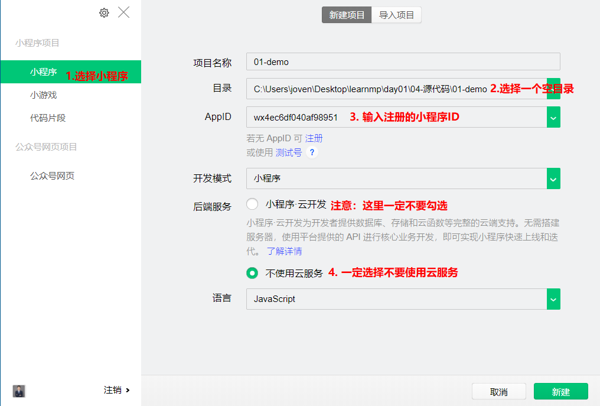
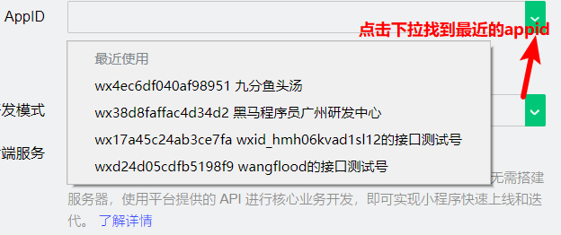
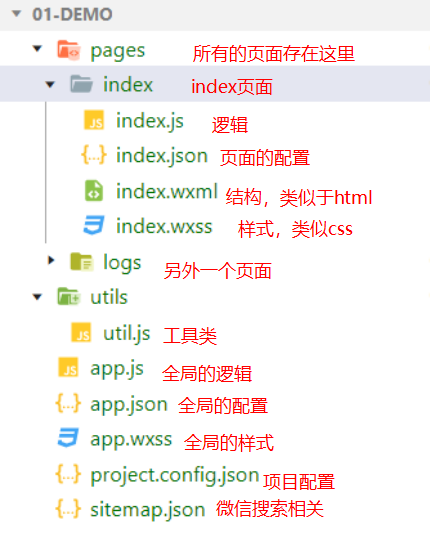

# 微信小程序学习第1天

## 自我介绍

1. 王侨文
2. 88年的，2年java+7移动前端工作经验
3. 汇丰银行+360+乐信（分期乐）

> 技术问题统一在QQ群讨论


## 小程序的学习重要吗？

1. 从课程调整的角度看
   1. 38前，小程序在react前面
   2. 38~43期 小程序课程摆在react后面
   3. 44期开始小程序课程又调整到react前面
2. 从学生就业工作内容来看（从端上来分）
   1. pc
      1. 后台管理
         1. 类似于黑马面面
         2. 学生就业最多的方向
      2. 公司官网
         1. 现在公司官网趋向于简单化
   2. 移动
      1. 浏览器h5
         1. 类似于黑马头条
      2. app
         1. 混合模式的APP
      3. 小程序
         1. 引流的
3. 小程序语法和Vue很像，后面还会用vue语法的框架来写小程序。

>  微信小程序和支付宝小程序是一样的么, 基本上一样，如果用原生语法来写的话，得写两套代码。一般来说，可以使用跨端框架


## 课程安排

1. 2天时间介绍微信小程序语法
2. 4天时间，微信小程序语法的项目：蘑菇在线
3. 8天时间，uniapp写优购商城
   1. uniapp可以支持微信小程序，安卓app，iOS app，h5
4. 1天时间，介绍mpvue

> h5页面是指运行在浏览器里面的h5页面，类似黑马头条


## 微信小程序**介绍**

1. 是什么
   1. **运行在微信里面的迷你的App**
2. 怎么使用
   1. 只要有微信就可以运行
   2. 安卓，iOS, windows里面微信都可以运行小程序
3. 有什么用
   1. 引流
   2. 电商购物
   3. 工具效率
   4. 其他一些作用
4. 其他说明
   1. 小程序有很多种，微信小程序，支付宝小程序，百度智能小程序，字节跳动小程序。。。
   2. 众多小程序里面，微信小程序是最有名的，通常说小程序就是指微信小程序


##  如何开发微信小程序

[传送门](https://mp.weixin.qq.com/cgi-bin/wx)

> 发布微信小程序，就是把我们写完小程序代码放到微信的服务器，这个是免费

1. 注册
   1. 注册账户
2. 小程序信息完善
   1. 小程序名称，图标
3. 开发小程序
   1. 写代码
   2. [开发文档](https://developers.weixin.qq.com/miniprogram/dev/framework/)
   3. [开发工具](https://developers.weixin.qq.com/miniprogram/dev/devtools/devtools.html)
4. 提交审核和发布
   1. 小程序代码发布微信服务器

> 如果想发布你的H5页面，也就是说外网可以访问到。那么得把h5页面放到服务器，并且服务器得有外网ip,也可以再买域名


## 注册账号&小程序信息完善-练习

[微信公众平台](https://mp.weixin.qq.com/)

1. 帐号信息
   1. 邮箱不能是注册过订阅号，也不能是服务号，也不能被微信绑定过的
   2. 重新注册一个邮箱，比如163邮箱
2. 邮箱激活
   1. 点击链接激活
3. 信息登记
   1. 选择主体类型：个人
      1. 其他类型需要认证资料
   2. 会填写姓名，身份证号，手机号，短信验证码
   3. 扫码
      1. 扫码的微信账号就是注册小程序的管理员
4. 完善小程序信息
   1. 小程序名称
      1. 最好取一些冷门的名字，比如说**美食名称**
      2. 好名称已经被完了
      3. 商城类的名称，会被要求上传营业执照去认证
   2. 小程序头像
      1. 尽量图片是积极向上的
   3. 服务类目
      1.  **工具 > 信息查询** 
5. 获取小程序的ID
   1. 开发->开发设置->AppID

#### 注意点

1. 解绑被微信绑定的邮箱
   1. 我的->设置->帐号与案例->更多设置->邮箱地址->找到你的邮箱，解绑
2. 小程序名称不要有心灵鸡汤，会在审核时被拒绝
3. 服务类目不能选择小游戏
   1. 微信小程序是包小程序和小游戏，如果选择服务类目为小游戏的话，那么appid不能用来开发小程序
4. 身份证姓名要用真实的
   1. 支付功能会绑定银行卡，银行卡姓名会校验
5. 小程序很多信息可以修改，但是有次数限制


## 微信开发者工具安装及使用-练习

[微信开发者工具](https://developers.weixin.qq.com/miniprogram/dev/devtools/devtools.html)

1. 选择微信开发者工具，稳定版本下载安装，并微信扫码登录微信开发者工具

   1. 微信开者工具不够稳定，可能会崩。
   2. 保留一个.exe

2. 新建小程序的helloworld项目

   

3. 在微信开发者工具，点预览出现二维码，然后用微信扫码，可以看到小程序在微信中的运行效果

#### 注意点：

1. 新建项目界面，如果想拖动，只能按住最左侧拖动

2. 新建项目时，一定不要选择云服务

3. 选择目录时，一定选择存放代码的空目录

   1. 一般的开发者都会根据项目名称在路径下生成文件夹，但是微信开发者工具并不会

4. 新建项目时，可以选择最近使有的appid

   

5. **一切和写代码相关的工具安装默认路径最稳定**
6. 如果小程序没注册成功?
   1. 点`测试号`生成测试号，也可以创建项目
7. 如果初次打开微信开发者工具时，没有出现二维码，解决方法
   1. 齿轮（设置），打开后找到代码，勾选不使用任何代理


## 认识微信开发者工具

[传送门](https://developers.weixin.qq.com/miniprogram/dev/devtools/page.html#%E5%90%AF%E5%8A%A8%E9%A1%B5)

> 内嵌一个chrome内核

微信开发者工具从上往下，从左往右分为五大部分

1. 菜单栏
   1. 项目->新建项目
   2. 项目->导入项目
      1. 如果打开微信小程序的项目，直接拖进去没反应。必须选择项目目录，导入
   3. 项目->打开最近的项目
      1. 找到你最近打开过的项目，切换即可
   4. 设置->外观
      1. 可以调整主题颜色
2. 工具栏
   1. 模拟器，编辑器，调试器，点击可以切换显示/隐藏，至少得有一个显示
   2. 预览会显示二维码，手机扫码，可以在手机上看到小程序的运行效果
   3. 详情可以看到项目的基本信息
3. 模拟器
   1. 选择设备及调整显示比例
4. 编辑器
   1. 分为两部分，项目目录结构和文件打开显示
   2. 写代码的地方，相当于是vscode
   3. 上手不难，**快捷键和vscode完全相同**
5. 调试器
   1. Console就是打印日志
   2. sources查看源文件，方便打断点调试
   3. network查看网络请求
   4. wxml查看页面结构


## 小程序文档介绍

[传送门](https://developers.weixin.qq.com/miniprogram/dev/framework/)

在哪里找小程序文档

1. [收藏地址](https://developers.weixin.qq.com/miniprogram/dev/framework/)
2. 微信开发者工具->帮助->开发者文档

文档怎么看

1. 如果想找框架原理相关的，找`指南`和`框架`

2. 如果想在页面添加结构的话，找`组件`

3. 如果想找方法的话，找API

   

#### 注意点：

1. 小程序提供了很多组件，除了基本组件外，还包括饿了么UI组件库
2. 小程序的API基本上以`wx.`开头，也就是说由wx对象提供的
3. 开发者社区可以理解成微信小程序的官方论坛
4. 如果想在文档里面快捷地找到目标的话，必须得**熟悉文档**。也可以搜索
   1. 文档里面大的标题都要看一下


## 小程序项目结构

> 本质小程序是运行在微信提供的浏览器里面

小程序的不能使用html,css,js，**是一种类vue语法的项目,项目结构很类似于vue脚手架生成的项目**

小程序用路由管理多个页面



#### 说明：

1. app.js是全局的逻辑，一般不改动，先忽略掉
2. app.json全局的配置
   1. pages属性是个数组，配置页面路径
      1. 可以理解vue脚手架项目里面路由配置
      2. 在目录pages里面所有的页面都应该配置在里面
      3. 数组的第一个路径就是模拟器的默认首页
   2. window就是设置所有页面的窗口样式的
3. app.wxss是全局的样式
   1. 样式会影响到所有的页面
4. 一个页面由相同文件名的四个文件组件
   1. .js逻辑，类Vue语法
   2. .json  配置
   3. .wxml 结构，小程序组件当标签名使用
   4. .wxss 基本上和css一样的
      1. display:flex属性兼容性没问题，多多使用

#### 注意点

1. page标签无须在结构中写，自动添加
2. wxss里面可以拿标签名，声明样式
3. 配置文件是JSON格式，格式比较严格
   1. 属性名必须双引号
   2. 字符串必须双引号
   3. 数组或者对象的最后一项不能有逗号


## 基本标签的使用

[组件](https://developers.weixin.qq.com/miniprogram/dev/component/)

小程序组件名当标签使用

1. text文本，相当于是HTML span, 是行内元素
2. view容器，相当于是HTML div
3. image图片
   1. 有默认宽度，一般需要根据设计稿设置宽度
   2. 行内块级元素
4. button按钮

#### 注意点：

1. 微信小程序文件名规范：页面名和页面下同个文件名保持一致。举例`pages/index/index`,`pages/demo/demo`
2. app.json里面pages数组里面配置了页面路径，它们都是以`pages`开头的
3. 在目录结构新建page时，需要在页面目录下创建。会自动帮我们在app.json pages数组里面添加路径
4. 在app.json pages数组里面添加路径也会自动生成页面，新建页面用这个方式是最好的
5. 小程序不认识的标签，只会显示里面的文字，强烈不建议使用小程序不认识的标签


## 图文混排案例-练习

写小程序静态页面时：

1. 先结构后样式


#### 注意点:

1. flex布局，如果主轴和子元素想居中方向是交叉的话，居中应该用align-item:center
2. html里面文字默认大小是多少？16px? 12px?
   1. 16px, 而且小程序里面默认字体大小也是16px
3. text-align默认值就是left, 在固定的宽度里面怎么排列
4. align-self可以定制自己在父盒子里面如何排列
5.  老师有自动保存的设置吗 ？？


## 数据绑定

[传送门](https://developers.weixin.qq.com/miniprogram/dev/reference/wxml/data.html)

**所有data中的属性在结构中使用时，都需要用{{}}**

1. 渲染文本

   ```html
   <text>{{msg}}</text>
   ```

2. 属性绑定

   ```html
   <image src="{{imgUrl}}"></image>
   ```

3. 条件判断

   ```js
   <view wx:if="{{isHandsome}}">很帅</view>
   <view wx:else>丑拒</view>
   ```

4. 遍历

   ```html
   <view wx:for="{{movieList}}">
     {{item}}--{{index}}
   </view>
   ```

   

#### 注意点：

1. 在调试器AppData可以看到相应页面data的属性，也可以改。相当于是chrome Vue devtools，方便调试
2. wx:for默认的元素别名是item,默认索引别名是index。无须声明
3. 双层嵌套wx:for的话，元素别名和索引别名不能相同
   1. 可以通过`wx:for-item`和 `wx:for-index `分别修改元素和索引别名


## 注册事件及消息提示框

[事件绑定](https://developers.weixin.qq.com/miniprogram/dev/framework/view/wxml/event.html)

[消息提示框](https://developers.weixin.qq.com/miniprogram/dev/api/ui/interaction/wx.showToast.html)

1. 注册事件方法

   ```html
   <view bind事件名="事件处理方法"></view>
   ```

   ```js
   Page({
       事件处理方法(){
           
       }
   })
   ```

2. 事件名有很多，tap是最常见的事件，相当于是click

3. wx.showToast方法的使用

   ```js
   wx.showToast({
       title: '成功',//标题
       icon: 'none',//图标类型
       duration: 4000,//提示显示的时长
       mask:true, //是否添加蒙层，默认为false
   })
   ```

#### 注意点：

1. 微信小程序，很多的方法都是wx对象提供的


## 方法中的this

[传送门](https://developers.weixin.qq.com/miniprogram/dev/reference/api/Page.html)

需求：有一个红色圆圈，点击切换背景色红色/透明

结论：

1. 在方法中的this, 如果需要访问方法的话，`this.方法名`

2. 在方法中的this，如果需要访问属性的话，`this.data.属性名`

3. 如果想改变data属性，需要用setData

   ```js
   this.setData({
      data属性名：值
   })
   ```

   

## 图片切换-练习


1. 先结构与样式
2. 功能
   1. 先显示图片
      1. 图片数组 [图片1，图片2，图片3，图片4]
      2. 数组下标 index:0
      3. 结构中显示图片 {{arr[index]}}
   2. 点击+，显示下一张;点-，显示上一张
      1. 点击+ bindtap="next", index++
      2. 点击- bindtap="prev", index--
   3. 越界问题处理
      1. 点下一张，如果当前是最后一张，直接跳到第一张;
         1. next方法
      2. 点上一张时，如果当前是第一张，直接跳到最后的一张
         1. prev

#### 注意点：

1. pages应该只放页面，如果有静态资源，放在和pages平级
2. index++是先赋值后自增，如果拿捏不准的话，直接`index+1`
3. 在微信小程序里面"/"就表示项目目录

## 总结

1. 微信小程序概念：运行在微信中的mini的app
2. 如何开发微信小程序
   1. 注册
   2. 信息完善，获取appid
   3. 写代码
   4. 发布
3. 微信开发者工具新建项目
   1. 选择小程序
   2. 选择目录：存放代码的空目录
   3. 填写appid，也就是大家注册的appid
   4. 不要选择云服务

4. 微信开发者工具
   1. 编辑器类似于vscode,快捷键是一样的
   2. 模拟器，可以用来看效果，和chrome差不多
   3. 调试器，来调试用来，和chrome差不多
5. 小程序文档
   1. 今晚大家有时间的话，熟悉文档
6. 基本标签的使用
   1. 小程序组件在结构中直接使用
7. 数据绑定
   1. data属性在结构中使用时，全部是用{{}}
   2. 条件判断 wx:if
   3. 遍历wx:for
      1. 默认的索引别名和元素别名item,index
8. 注册事件
   1. bind事件名=”事件处理方法“
   2. 事件处理方法声明在data平级，没有methods
9. 方法中的this
   1. this.方法名
   2. this.data.属性名
   3. this.setData({})来改变data的属性	

10. 总结：微信小程序的语法可能大家一开始不接受，但是要明白它也是数组驱动的，所以**和vue解决问题的思路是一致，只要记住特定的语法**。


## 作业

1. 完成图片切换案例

2. 完成git克隆learnmp，并切换mp49分支，用SSH

   1.  https://gitee.com/jovenwang/learnmp/tree/mp49/ 

3. 熟悉微信小程序文档

   