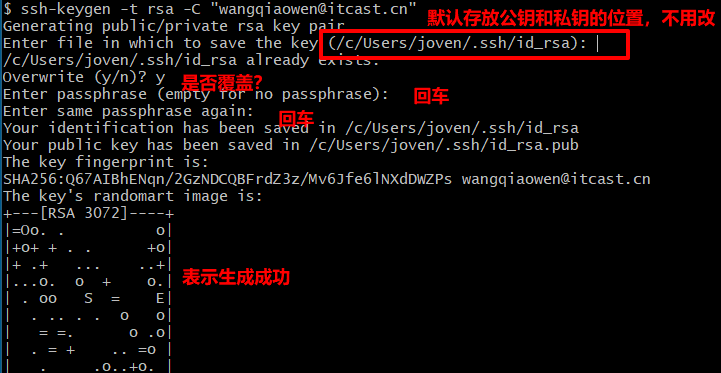
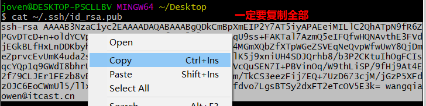
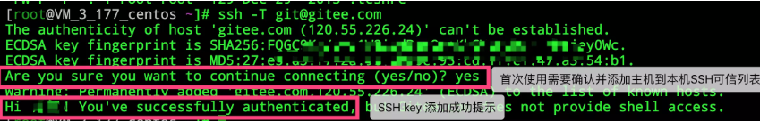
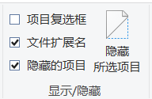
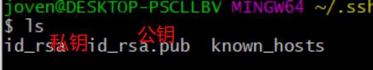
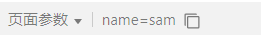
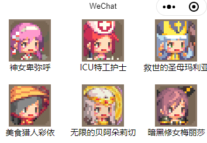
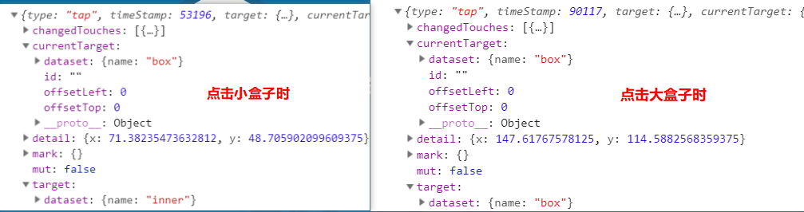
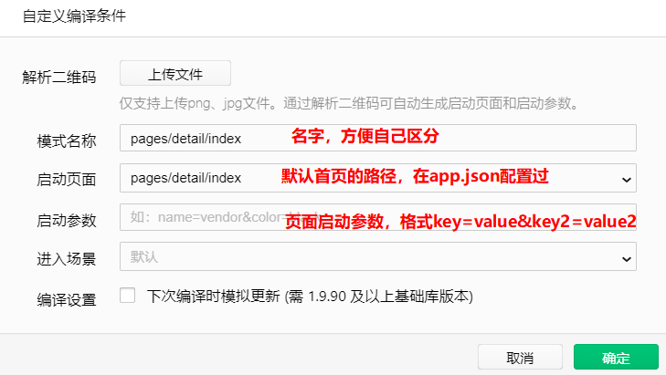

# 微信小程序学习第2天

## 回顾

1. 会注册微信小程序

   1. 邮箱密码
      1. 应该用新的邮箱
   2. 信息登记
      1. 类型选择个人
      2. 姓名，身份证，都用真实
      3. 用微信扫码
         1. 微信账号就是注册的小程序的管理员
   3. 信息完善
      1. 小程序名称
      2. 小程序头像
      3. 小程序的服务类目：信息查询

2. 了解微信小程序的开发步骤

   1. 注册
   2. 信息完善
   3. 开发
      1. 开发文档
      2. 开发者工具
   4. 发布

3. 新建项目

   1. 选择小程序
   2. 选择一个存放代码的空目录
   3. 填写你注册的小程序ID
   4. 不要选择云服务

4. 了解小程序中的数据绑定的写法

   1. data属性在结构中使用时，全部是{{}}

5. 会小程序中条件渲染的写法

   1. wx:if="{{}}"

6. 会小程序中列表渲染的写法

   1. wx:for="{{数组}}"
   2. 会有默认的元素别名item，还有默认索引别名index

7. 事件注册

   1. bind事件名=“事件处理方法”
   2. 事件处理方法声明在data平级

8. 方法中的this

   1. this.方法名
   2. this.data.属性名
   3. 如果想改变属性 this.setData({属性名：值})

9. 微信开发者工具假死的问题

   1. 现象：点击微信开发者工具时，30s内还没启动
   2. 解决方案：打开任务管理器，找到在后台的微信开发者工具，结束任务，再点击微信开发者工具。

   

## 每日反馈

1. 感觉Page对象中的东西比较模糊,他们之前的关系是什么
   1. 方法中的this就是Page实例
   2. onLoad, onShow...这些都是小程序的生命周期钩子函数，第6讲
   3. 这些新建页面时默认生成的函数都是在特定时机会被触发，先不关注。
2. 微信小程序跟之前相差有点大，还是有点不习惯
   1. 学习微信小程序的时候，可以和Vue对比。思想是一样的，只不过语法一样。
3. 还可以😊
   1. ~_~
4. 啥都好 就是有点炸麦 老师说话可以不用离麦克风那么近
   1. 翁


## 作业检查

1. 企业里面：好的命令胜过很多行注释，一般在业务逻辑时才会给注释
2. 代码需要给点注释
3. 相对路径需要练习，最好不看路径提示
4. 在数据驱动的框架里面，对data属性的改动，尽量一步到位


## Git项目克隆

微信小程序课程地址：  https://gitee.com/jovenwang/learnmp  分支：mp49


#### git复习

1. 本地的代码推送到远端
2. 本地每一次提交，远端也提交的历史

问题：

1. 什么是分支？
   1. 不同环境对应不同的代码
2. 克隆项目到本地，需要在本地执行先git init吗？不需要 
   1. git init初始化本地仓库，生成.git文件夹
   2. git克隆本质就是远端的git项目copy到本地，远端git项目里面已经有.git文件


#### **git克隆支持两种协议，https和ssh**

1. https，在git提交或者pull时需要输入用户名和密码，不建议
2. 更建议使用ssh来克隆项目，后续提交或者Pull时不再需要输入用户名和密码
   1. 需要我的电脑的生成SSH公钥配置在远端，目的就是让远端信任我的电脑


#### learnmp项目克隆步骤

1. 在电脑上生成SSH公钥( 三次回车 )

   ```bash
   ssh-keygen -t rsa -C "有意义的邮箱"  
   ```

   

2. 查看并复制公钥

   1. cat 查看文件内容
   2. ~表示home目录
      1. windows里面表示`c:/Users/用户名`

   ```bash
   cat ~/.ssh/id_rsa.pub
   ```

   

3. 码云或者github添加公钥

   1. 头像->设置-> SSH公钥
   2. 公钥输入框粘贴第2步复制的公钥，最后在标题给一个名字（方便自己记记）

4. 克隆learnmp

   1. 在需要存放learnmp目录下执行

   2. 添加公钥后，首次克隆会提示，yes

      

   ```bash
   git clone git@gitee.com:jovenwang/learnmp.git #克隆git项目的master分支到当前目录
   ```

5. 切换分支

   ```切换分支
   git checkout mp49
   ```

   

#### 企业是如何使用git

1. 企业的代码一般部署在哪里？
   1. github最开始主要是开源，托管的项目公开是免费，私有是收费。后来被微软收购，私有也是免费
   2. gitlab托管理项目私有公开都免费
   3. 一般企业都是，**把gitlab部署自己的服务器，用来托管公司的项目的**
2. 一般员工到公司后，OA会提供gitlab网站的用户名和初始密码
3. gitlab项目权限
   1. 看项目，可以克隆项目
      1. 如果看不到项目，需要加权限
   2. 开发者，可以拉分支，推送到自己分支
   3. 主程序员：合并代码到master
   4. 所有者：创建项目的人

#### 注意点：

1. 作为程序员，windows资源管理器需要勾选文件扩展名和隐藏项目

   

2. git bash里面的命令来自于linux命令，比cmd命令要强大
3. 一般在命令行如何复制和粘贴呢，右键
4. 建议大家在学习阶段多用git命令。
5. 大部分程序员在企业git图形化工具是sourcetree和乌龟git, 还可vscode+git命令
6. 不要公司的代码放到github或者码云，哪怕是私有。
7. 


## 轮播图组件

[传送门](https://developers.weixin.qq.com/miniprogram/dev/component/swiper.html)

小程序不仅包括基本的组件，还有轮播图，日期选择，横向滚动，进度条，富文本，开关选择器等等。这些组件都可以在结构中当标签使用

轮播图组件的使用：

1. 一般来说小程序组件使用，copy示例代码，先让最最基本的demo能跑起来，再添加属性即可

```html
<!-- 
  indicator-dots:是否有指示点
  indicator-color 指示点颜色
  indicator-active-color 指示点选中颜色
  autoplay 自动轮播
  interval 切换间隔时间
  duration 切换动画的时间
  circular 循环
 -->
<swiper indicator-dots indicator-color="#ffffff" indicator-active-color="#009900" autoplay
interval="3000" duration="100" circular>
	<block wx:for="{{3}}">
		<swiper-item>
			<image src="https://dss1.bdstatic.com/70cFuXSh_Q1YnxGkpoWK1HF6hhy/it/u=2510813180,1433615451&fm=26&gp=0.jpg"></image>
		</swiper-item>
	</block>
</swiper>
```

#### 提示：

1. block类似于vue template标签，作用包裹，最终不会渲染。可以配合wx:for使用
2. wx:for也可以作用于值范围，表示渲染次数。和v-for一样的。
3. w3c规范，如果属性是boolean，如果只有属性没有值，相当于是值为true


## wx:key的设置

> 如果不设置wx:for的key值，会报警告，警告提示：添加key提主性能

如何添加：

1. 如果wx:for遍历的数组元素是对象的话：wx:key应该设置为一个遍历的数组元素的属性名，这个属性名对应的值是唯一

```html
//正确的wx:key值设置
<view wx:for="{{songList}}" wx:key="属性名">
//错误的wx:key值设置
<view wx:for="{{songList}}" wx:key="{{item.id}}">
```

2. 如果wx:for遍历的数组元素不是对象的话：wx:key值应该设置wx:key="*this"

   ```html
   <view wx:for="{{movieList}}" wx:key="*this">
   //相当于vue :key="item"
    <div v-for="item in movieList" :key="item">
        
    </div>
   ```

问题：在vue vfor里面是不是总是要设置key为唯一标识？不是

	1. 数组渲染后，如果元素的下标有变化时，需要给唯一标识
 	2. 数组渲染后，如果元素的下标不会有变化时，可以不给key值
      	1. 设置key="index"只是为了避免报错


## 模块化

[传送门](http://es6.ruanyifeng.com/#docs/module)

模块概念：将一些公共的逻辑抽取出来放到js文件，这个文件就是模块

推荐使用ES6模块，和vuecli生成的项目完全一样

```js
// 在模块里面export向外暴露接口
export default sayHello
// 使用模块的文件,import
import sayHello from '../../utils/hello'
```

#### 注意点

1. 引入模块的路径不支持绝对路径，只能相对路径
2. 不支持使用@符号


## navigator组件

[传送门](https://developers.weixin.qq.com/miniprogram/dev/component/navigator.html)

概念：跳转页面

如何使用

1. 跳转并传参

   ```html
   <navigator url="/pages/login/index?参数1=值&参数2=值">带我去首页</navigator>
   ```

2. 目标页面onLoad形参即可获取页面跳转传递参数

   ```js
     onLoad: function (options) {
       console.log(options.参数1)
     },
   ```

#### 注意点：

1. 页面传参在目标页面接受参数，可以模拟器的页面参数上看到。方便调试

   

2. navigator url属性支持的页面路径是在app.json pages数组里面配置的路径。推荐使用绝对路径

   

## 克鲁赛德战记案例-练习



#### 01.案例分析

1. 主要模块：展示英雄列表
2. 其他说明
   1. 英雄列表，展示每个英雄包括头像和名字
   2. 一行显示三个
   3. 数据来源`learnmp\day02\02-其他资料\heroList.js`
   4. 点击英雄时，跳转到英雄详情页面，展示该英雄的技能

#### 02.静态页面

1. 创建一个小程序项目`klgame`
2. 新建两个页面home和detail
3. 首页的结构和样式
   1. flex布局
   2. 在flex布局里面，一行展示3个，用width:33.33%

#### 03.获取数据&渲染列表

1. 模块导出export
2. index.js引入import
3. 导入的heroList作为data属性
4. 渲染列表
   1. wx:for

#### 04.英雄详情页

1. 跳转英雄详情页

   1. navigator

2. 传递参数

   ```html
   <navigator url="/pages/detail/index?skill={{item.skill}}">
   ```

3. 在模拟器页面参数，确认传参成功
4. detail页面onLoad获取参数
5. 添加data属性skill，获取到参数设置skill属性，渲染页面

#### 注意点：

1. 调试器AppData,会显示不同页面的data属性
2. 小程序样式里面不支持用`*`
3. css font-size这个属性是可以继承。box-sizing属性不可以继承。


## 编程式导航

回顾vue路由

1. 声明式导航

   ```html
   <router-link path="/sing"/>
   ```

2. 编程式导航

   ```js
   router.push('/sing')
   ```

概念：用js的方式跳转页面

如何使用

```js
wx.navigateTo({
    url: '/pages/login/index?name=joven',
})
```

使用场景

1. 如果想在路由跳转前做一些事情的话，必须用编程式导航


## 事件传参

1. 在注册事件所在dom上，传属性

   ```html
   <button bindtap="toLogin" data-属性名="值">点我去登录</button>
   ```

2. 在事件处理方法的里面获取事件传参

   1. dataset是固定写法，不能改

   ```js
   toLogin(event){
       event.currentTarget.dataset.属性名 //获取到传值
   }
   ```

#### 注意点

1. 小程序注册事件，`事件处理方法`只能使用方法名，不能写行内逻辑。如果写了非方法名之外的东西，会被识别为方法名

   ```html
   <view bind事件名="事件处理方法"/>
   ```

   

### 事件对象的target与currentTarget

1. target是指事件源那个dom

2. currentTarget是指注册事件所在dom

   

#### 结论

1. 如果在注册事件所在的dom上传参的话，始终取currentTarget

注意点：

1. 小程序的结构也有事件冒泡的

   

## 编译模式的设置

作用: **设置模拟器的默认首页，方便调试**

如何使用：

1. 工具栏的普通编译-->添加编译模式
2. 在弹框一般需要设置三个属性
   1. 启动页面，默认首页的路径
   2. 模式名称：给上名字，方便自己记忆
   3. 启动参数：进入页面需要传递的参数



#### 注意点：

1. 编译模式可以编辑和删除


## lol英雄案例-英雄列表页


#### 01.页面分析

1. 主要模块，展示英雄列表
2. 其他说明
   1. 每个英雄展示，头像和名字
   2. 点击英雄跳转英雄详情页
   3. 数据来自于`learnmp\day02\02-其他资料\lol\data`
   4. 设计稿`learnmp\day02\02-其他资料\lol\img`

#### 02.静态页面

1. 新建项目`lol_game`
2. 新建两个页面home,detail
3. 首页的结构与样式
   1. flex

#### 03.导入数据&列表渲染

	1. lol_duowan.js导出export
 	2. home.js引入import
 	3. wx:for渲染

#### 04.导航区设置

[传送门](https://developers.weixin.qq.com/miniprogram/dev/reference/configuration/page.html)

1. 就是JSON对象

   ```js
   {
     "navigationBarBackgroundColor": "#354559",
     "navigationBarTextStyle": "white",
     "navigationBarTitleText": "英雄列表"
   }
   ```

2. 导航栏文案在模拟器和iphone上居中，安卓居左
3. 页面配置的属性名和全局配置属性名一致

#### 注意点：

1. 页面配置优先级大于全局配置


## 总结

1. git复习
   1. git日常操作
      1. git add .  本地改动加到暂存区
      2. git commit -m 'xx' 提交
      3. git push 推送到远端 
2. git clone两个协议
   1. https，后续提交或者拉取需要输入用户名和密码，不建议
   2. ssh协议
      1. 需要让远端信任我的电脑
         1. 需要在托管代码远端添加公钥
         2. 然后提交或者拉取代码，远端会带公钥和电脑本地私钥进行校验
3. git clone learnmp
   1. 生成公钥
   2. 复制全部的公钥添加到远端
   3. git clone
   4. 切换分支
4. 企业里面如何git托管
   1. 一般都是装gitlab整个网站部署到公司的服务器，防止公司代码泄露
   2. 新入职公司的员工会被分配gitlab网站用户名和密码
   3. 具体的项目，需要领导来分配项目权限给你
5. 轮播图组件
   1. 小程序里面提供了很多类似于饿了么ui一些组件，当标签使用即可。
   2. 建议copy示例代码，先运行起来。其他属性查阅文档即可
6. wx:key
   1. 如果数组的元素是对象的话，wx:key应该设置元素里面某一个属性名，这个属性名的值是唯一
   2. 如果数组的元素是不是对象的话，wx:key="*this"
7. 模块化
   1. ES6语法
      1. export
      2. import
8. navigator组件
   1. url="/pages/login/login?name=joven" 跳转并传参
   2. 目标页面获取参数onLoad函数里获取
9. 编程式导航
   1. 用js方法跳转页面
   2. wx.navigateTo({url:'/pages/login/login?name=joven'})
10. 事件传参
    1. 在注册事件所在dom上 data-属性名=”值“
    2. 在事件处理方法 event.currentTarget.dataset.属性名
11. target与currentTarget的区别
    1. target就是事件源
    2. currentTaret就是注册事件所在的dom

12. 编译模式
    1. 设置模拟器的默认首页，方便调试
    2. 重要属性
       1. 启动页面，默认首页的路径
       2. 模式名称，给一个区分不同页面的名称
       3. 启动参数：key=value，设置页面参数
13. 页面配置
    1. 页面配置优先级大于全局配置
    2. 它的配置是JSON对象，不需要window

## 作业

1. 完成克隆learnmp
2. 完成lol英雄案例的列表页
