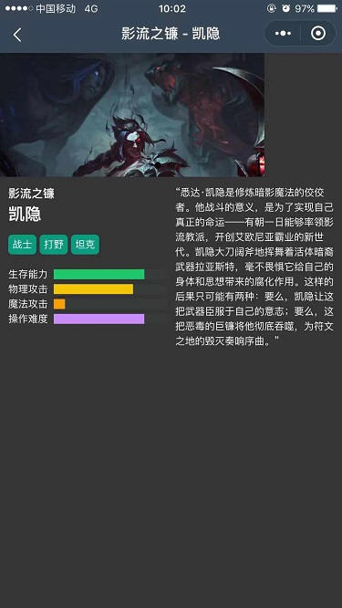

# 微信小程序学习第3天

## 回顾

1. 编程式导航

   1. 跳转页面并传参

      ```js
      wx.navigateTo({
      	url:'/pages/login/login?title=joven'
      })
      ```

   2. 目标页面获取参数

      ```js
      Page({
      	onLoad(options){
      		console.log(options.title)
      	}
      })
      ```

   3. 模拟器的页面参数可以看到传参（辅助我们定位问题）

2. 事件传参

   1. 注册事件并传参

      ```html
      <button bindtap="toLogin" data-属性名="值">点我去登录</button>
      ```

   2. 事件处理方法获取传参

      ```js
      toLogin(event){
      	event.currentTarget.dataset.属性名
      }
      ```

3. 事件对象的target和currentTarget

   1. target指向源dom，你点哪个dom，target就是那个dom
   2. currentTarget注册事件所在的dom

4. 编译模式的设置

   1. 模式名称：取个名字
   2. 启动页面：页面路径，模拟器默认首页的路径
   3. 启动参数：设置页面的参数

5. 页面配置

   1. 属性名和app.json全局配置一样
   2. 页面配置就是一个JSON对象，不需要window
   3. 页面配置优先于全局

6. wx:key

   1. wx:for遍历的**数组元素如果对象**的话, 那么wx:key应该设置为对象的某一个属性名，这个属性名所对应的值应该是唯一

      ```js
      [{},{},{}]
      ```

   2. wx:for遍历的**数组元素如果不是对象**的话，那么wx:key应该设置为wx:key="*this"。相当于vue :key="item"

      ```
      [1,2,3,4,'34']
      ```

      

## 每日反馈

1. 老师,只有导入模块要使用相对路径,其他都是可以用/的吗
   1. 是的。只有导入模块不支持绝对路径
2. 小程序的文档，好垃圾啊，好难找。都不知道是哪个渣渣写的，好想把它拖出去糟蹋了
3. 老师，视频可以放文叔叔吗？我网不是很好，用qq下载，网只要卡一下暂停了就得从头下载，我太难了。
   1. 文叔叔是要钱了。可以
   2. 能否放百度网盘可以吗？


## 作业检查

1. wx:key值的错误设置

   ```js
   wx:key="item.id"
   <view class="hero" wx:for="{{heroList}}" wx:key="*this">
   ```

   


## lol英雄案例-英雄详情页



#### 01.页面分析

1. 主要模块: 轮播图，昵称和名字，标签，能力，故事
2. 其他说明
   1. 从列表页点击一个英雄，跳转英雄详情页，展示它的详情
   2. 导航栏文字 昵称-名字
   3. 数据来自于`learnmp\day03\02-其他资料\lol\data\lol_details_duowan.js`


#### 02.列表页点击一个英雄，跳转到详情页

1. 点击英雄跳转详情页，用编程式导航
   1. 点击事件bindtap: toDetail
   2. 编程式导航wx.navigateTo({url})
2. 跳转英雄详情时传递参数，传什么参数？
   1. 分析detail数据，应该传id
   2. 传id，在lol_details_duowan.js数组里面找一个id相同的那个对象
3. 如何传id?
   1. 事件传参：在注册toDetail方法所在dom上，data-属性名="值"
   2. toDetail方法里面event.currentTarget.data.id
   3. wx.navigateTo的url以key=value形式传递
   4. 在模拟器页面参数验证跳转传参是否正确
4. 添加编译模式设置模拟器的默认首页为英雄详情页面
   1. 设置编译模式
      1. 页面路径
      2. 启动参数
   2. 英雄详情页获取启动参数
      1. onLoad(options)

#### 03.静态页面

1. 轮播图
   1. copy文档的示例代码
   2. swiper有固定的高度，需要按设计稿设置高度
   3. 自动无限轮播属性添加
2. 主体部分左右布局
   1. flex布局
      1. 如果左侧宽度固定，希望右侧占满剩下的宽度需要flex:1

#### 04-静态页面-进度条progress组件

[progress](https://developers.weixin.qq.com/miniprogram/dev/component/progress.html)

1. percent 进度长度，百分比
2. storke-width进度的宽度（高度）
3. activeColor进度的选中的颜色
4. backgroundColor 背景色（如果背景色和页面背景色一样的，那么不会显示进度条未选中的部分）
5. active开启动画

```html

<progress percent="80" stroke-width="12" activeColor="#f2c40c"
        backgroundColor="#363636" active></progress>
```

#### 05-渲染数据

1. 参数id在detail数组里面找一个id相同的对象，用这个对象来渲染页面
   1. 导入lol_details_duowan.js，export default
   2. detail.js导入 import
   3. 使用find找到目标对象，设置为data属性
2. 渲染页面


#### 06-导航区设置

1. 动态设置导航栏的标题
   1. wx.setNavigationBarTitle({title})
2. 导航栏的前景色和背景色设置到app.json里面
3. 页面跳转空隙，让导航栏为空。需要在app.json设置导航栏文案为空字符串

#### 注意点

1. 添加编译模式的技巧，copy页面参数，粘贴到启动参数里面

2. 在模拟器左上角home图标，点击会跳转到app.json pages数组里面第一个路径所对应的页面

   

3. 前端在做静态页面，先保证iphone6显示OK. 所以模拟器机型最好设置为iphone6
4. 数组的forEach不能中断遍历
5. 数组的find,遍历数组,数组的每一项会执行指定的函数，如果函数返回true，中断遍历，并返回这一项。如果遍历完都找不到，返回undefined
6. 如果一个属性是对象类型，初始值给空对象; 如果属性是数组的话，给空数组. 不要把初始值设置为null或者undefined
7. **在结构中使用变量，都应该声明为data属性; 不在结构中使用变量，都不应该声明为data属性**


## 小程序版本

1. 开发版本
   1. 微信开发者工具预览扫码
   2. 权限： 项目成员才可以打开开发版本
2. 体验版本
   1. 用于产品经验，客户，测试人员体验的小程序版本，一般在上线前会有一个体验环节
   2. 权限：只有在体验成员里面人才可以使用体验版本的小程序
3. 上线版本
   1. 小程序发布
   2. 权限：所有人都可以使用


## 小程序上线步骤

1. 确认微信开发者工具里填写你注册的小程序的ID

   1. 如果是真实的appid，上传按钮是显示
   2. 如果不是真实的appid，需要修改
      	1. 修改方法, 详情->基本信息->appid，修改

 2. 上传微信开发者工具里面代码到微信服务器

     1. 填写版本号及项目备注

    

3. 上小程序后台，把上传的小程序设置为体验版本（可选）

   1. 下拉选为体验版本

      

   2. 需要设置正确的首页路径

4. 提交审核

   1. 点击提交审核
   2. 测试账号
      1. 如果你的小程序需要登陆的话，提供账号方便审核人员登陆进去查看功能
   3. 等待审核通过，一般20分钟

5. 上线

   1. 如果审核通过，会通知管理员的微信
   2. 然后小程序后台版本管理，提交发布即可

6. 如何访问小程序

   1. 微信->发现->小程序->搜索 
      1. 找到你的小程序名称，按名称搜索

#### 注意点：

1. 如果没有写完的话，也可以上线
2. 微信开发者工具APPID有三种
   1. 真实的APPID，微信开发者工具里面所有功能都可以使用
   2. 测试号：没有上传功能
   3. touristappid, 游客id，预览真机调试及上传，还是云服务功能都没有。
3. 审核快速通过的技巧
   1. 小程序名称不带商城，也不能是心灵鸡汤
   2. 服务类目：工具->信息查询
4.  小程序上线还可以在修改,然后在重新上线吗?? 
   1. 再发一次即可


## image mode属性（了解）

[传送门](https://developers.weixin.qq.com/miniprogram/dev/component/image.html)

 图片裁剪、缩放的模式。

> 学习时可以类比于css background-size:cover,contain

1. scaleToFill不保持纵横比，短边拉伸
2. aspectFit 保持纵横比，长边显示，短边留空
3.  aspectFill保持纵横比，短边显示，长边截取
4.  widthFix保持纵横比,宽度不变，高度自动变化


#### 注意点：

1. 如果图片显示的区域的纵横比和原图片是一致，不管用什么模式都是一样的效果
2. 设计稿的图片宽高尽量要和后端返回的图片一致


## 蘑菇在线项目演示

#### 有哪些功能？

1. 首页展示轮播图，推荐课程，还是热门视频，搜索区域
2. 课程页面展示所有课程
3. 我的展示我的基本信息
4. 微信授权登录
5. 手机号码登录

#### **项目目的**

> 微信小程序就业数据，一半的学生会用原生，另外一半用框架，框架uniapp/mpvue

1. 熟悉原生小程序的语法
2. 设计稿是蓝湖，蓝湖链接：https://lanhuapp.com/url/8NzGu-bRg23


> 设计稿的形式
>
> 1. PSD就是用photoshop做的图
>    1. PSD文件可以切图
> 2. sketch对设计来说，效率比ps高一些，导出html
>    1. sketch可以结合蓝湖


## 蘑菇在线目录说明


## 自适应单位rpx 

[传送门](https://developers.weixin.qq.com/miniprogram/dev/framework/view/wxss.html#%E5%B0%BA%E5%AF%B8%E5%8D%95%E4%BD%8D)

##### 什么是自适应？

页面在不同尺寸的设备上显示良好。

> 自适应很多时候也就是响应式。

##### 黑马头条能否自适应？

1. vant用flexible.js+rem来作自适应，底层支持
2. 部分手机需要稍微，兼容不同手机叫做处理兼容性问题

##### rpx单位的概念？

1. rpx可以随屏幕宽度变化，到底1rpx值是多少呢？
   1. 所以的设备屏幕宽为750rpx，**rpx就是对所有设备屏幕750等分，每一等分1rpx**.
2. 为什么在iphone6，200rpx=100px???
   1. css单位：在css里写px值，iphone6宽度的css单位的值是375px
   2. iphone6宽度的也可以是750rpx 

##### rpx单位如何使用呢？

1. 官方说的：开发微信小程序时设计师可以用 iPhone6 作为视觉稿的标准
2. 一句话：设计稿一般是750px单位
3. **代码里面rpx值=设计稿量的px值**

**使用场景**

1. 什么时候使用rpx，什么时候使用px？
   1. 元素大小需要固定就用px，如果需要自适应的话用rpx
2. 哪些元素可以使用rpx
   1. 以前使用px的地方都应该换成rpx
3. font-size要不要随屏幕宽度自适应？
   1. 这里有分歧的
   2. 如果需要适应的设置只包括手机的，那么一般字体大小也随屏幕宽度自适应

#### 注意点

1. 设计稿iphone6，前端让静态页面适配iphone6,完成功能后再适配其他手机，稍调即可。

>  iphone6分辨率为1334*750像素 ,750就是物理像素

## 项目准备

1. 新建项目`mushroom-lite49`
2. 新建一个页面home
3. 删除无用的文件
   1. index页面
   2. logs页面
   3. utils文件夹
   4. app.js清空内容，然后敲App自动生成基本的代码
   5. app.wxss清空内容
   6. app.json删除index和ogs的页面路径


## 项目git管理

> 推荐大家使用码云，访问速度快，然后界面是中文，更利于学习。

1. 在码云上新建仓库

   

2. 初始化远端仓库

   1. 切到SSH

      1. 如果昨天没有在码云上添加SSH公钥的话，需要添加

   2. 按命令提示操作

      ```bash
      #用git bash打开mushroom-lite49文件夹
      git init #初始化本地仓库
      git add .#把当前目录下所有的文件添加到暂存区
      git commit -m "first commit" #提交
      git remote add origin 你自己的git项目地址 #添加远端服务器地址
      git push -u origin master #在远端创建master，并推送本地master分支到远端
      ```

3. 在远端刷新一下页面就可以看代码

4. 新建开发分支，取名`Fea_joven_2020531`

   ```bash
   git checkout -b Fea_joven_2020531 #创建并切换分支
   git push --set-upstream origin Fea_joven_2020531 #远端创建分支，并推送本地分支到远端
   ```

#### 注意点：

1. 微信开发者工具有git图片化工具，难用，然后考虑到只有写小程序才能用，所以忽略掉。

2. 一般在企业里面开发新的需求时，都需要新建分支的。分支名按公司的规则来命名。最终需求分支上的代码验证OK，最终再合并到master

3. 指示是否用SSH公钥提示，给yes

   

4. 在码云新建仓库时，不要选择"添加readme以初始化仓库"


## 服务器启动

#### 数据库初始化启动

1. 安装phpstudy,并启动mysql。保证mysql是绿色

   

2. 打开"mysql-front"

   

3. **打开SQL编辑，清空里面内容，复制蘑菇在线SQL文件全部内容粘贴进去，然后点绿色的按钮执行**

   1. 蘑菇在线SQL文件位置`learnmp\蘑菇在线\数据库文件\mushroom_online.sql`
   2. 蘑菇在线SQL文件内容需要全部复制

4. 如果看到左侧展示mushroom_online，展开看到表，就表示数据库初始化成功

   

#### 后台启动

1. 后台代码位置`learnmp\蘑菇在线\服务器代码\mushroom-online-server`

   1. 注意这个是**后台代码，后台代码**。虽然也是nodejs

2. 项目目录下执行npm install

3. 项目目录下执行npm run start

4. 如果有以下提示，表示OK

   

5. 验证数据库启动，并且后台启动。访问以下地址
   1.  http://localhost:3000/api/user/vcode?phone=15361819242 
   2. 如果接口返回正确的vcode，表示ok

#### 日常操作：

1. 打开phpstudy，保证mysql是启动
2. 后台启动在相应目录下执行npm run start

#### 注意点：

1. nodejs项目，package.json里面scripts对象的属性名，都可以在项目下执行npm run 属性名，完成执行

2. 如果执行npm run start，报错提示端口被占用

   1. 如果后台代码有改动，注销电脑，再次执行npm run start
   2. 如果后台代码没有改动，let it be，不用管

   

3. apache服务器启动默认端口是80，后台代码启动默认端口是3000，并不会冲突

## 设计稿地址

设计稿地址 https://lanhuapp.com/url/8NzGu-bRg23


## 总结

1. 小程序版本
   1. 开发版本
   2. 体验版本
   3. 上线版本
2. 小程序发布
   1. 填写真实的appid
   2. 上传
   3. 小程序后台提交审核
      1. 等待
   4. 提交发布
   5. 如果审核拒绝，查看审核详情，依据提示，修改，然后再次提交审核
3. rpx单位
   1. 所有设置屏幕750等分，每一份都是1rpx
   2. 使用：设计稿是750px，那么代码里面写的rpx值=量的px值
4. 数组的find方法会遍历数组,对每一项执行指定函数,如果函数返回值是true,中断遍历，并返回那一项;如果找不到的话，返回undefined


## 作业：

1. lol英雄案例上线，并分享到49期微信群
2. 把蘑菇在线项目推送到码云，以后检查作业提供git地址，并且最好是开发分支的地址
   1. 类似于这样   https://gitee.com/jovenwang/mushroom-lite49/tree/Fea_joven_2020531 
   2. 班长找组长帮收集，给我md文档。谢谢（明晚之前给我）
3. 完成蘑菇在线的首页静态页面（可选）
4. 全部同学务必今晚完成服务器启动！！！

