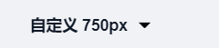
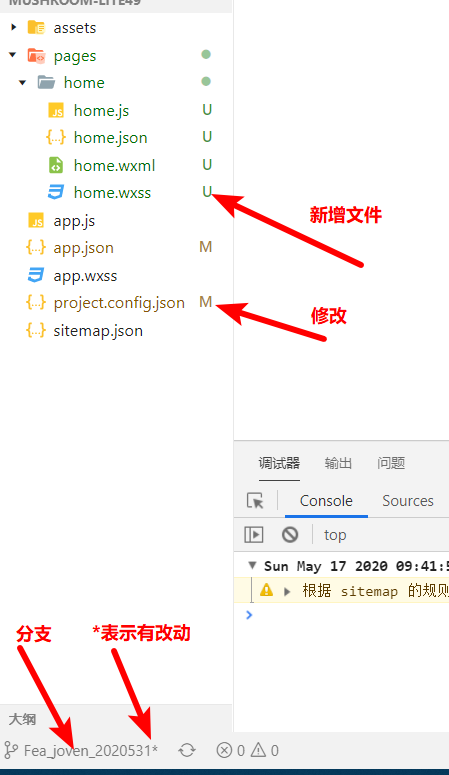
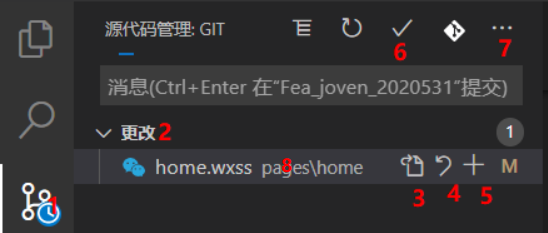
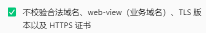
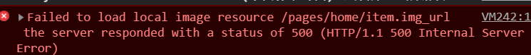
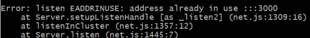
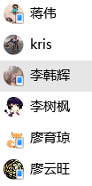

# 微信小程序学习第4天

## 每日反馈

1. 小程序发布如果被拒绝，查看通知那里，查看审核详情。基本上是说名称内容不符，所以根本的原因就是小程序和名称
   1. 名称要取冷门的。而且要低调。“正宗”
   2. 如果审核次过多，可能会延长审核时间。
      1. 可以申请5个微信小程序，可以同时发布微信小程序
   3. 再搞不定，发布并不阻塞后面的学习。

> 一份小程序代码可以发到多个小程序账号; 多个小程序代码版本发到一个微信小程序账号，后面发会覆盖前面


## 回顾

1. 自适应单位rpx
   1. px是固定单位，不会随着设计尺寸而改变大小
   2. rpx是自适应单位，所有的设计屏幕都是750rpx, 750等分，每一等分1rpx
   3. 设计稿一般是iphone的2倍图，设计稿是750px. **代码里面rpx值=设计稿量的值**
2. 项目git管理
   1. 首先在码云上创建仓库
      1. 不要勾选添加Readme
   2. 基本上就是按照提示推送本地项目到远端仓库
3. 服务器启动
   1. 初始化数据库
      1. 启动phpstudy
      2. 导入mysql
   2. server启动
      1. 服务器代码地址`learnmp\蘑菇在线\服务器代码\mushroom-online-server`
      2. npm install
      3. npm run start
   3. 后续如果你调接口
      1. 启动phpstudy, 启动Mysql
      2. server启动 npm run start
   4. 验证接口Ready!
      1.  http://localhost:3000/api/home/swipers 确认一下有返回数据

> 建议直接用老师发的phpstudy，不要纠结后台配置，越简单越好。


## 首页-页面分析


1. 入口：小程序启动后打开的第一个页面，底部tab栏点击首页显示的页面
2. 主要模块：搜索链接，轮播图，推荐课程，热门视频
3. 其他说明
   1. 搜索链接这个区域并不能输入触发搜索，只是一个占位，点击跳转
   2. 推荐课程可以横向滚动

## 首页-静态页面

> 蓝湖链接：  https://lanhuapp.com/url/8NzGu-bRg23 

#### 提示：

1. **蓝湖设计稿自定义宽度**，选择开发平台，**自定义宽度750px**。代码的rpx值=设计稿量的值

   

2. 微信开发者工具里面模拟器选择什么设备？**iphone6**

3. 在蓝湖里面居然有代码，前端要失业了? 并不是，部分可以复制并参考

#### 步骤：

1. 在app.json配置导航栏文案为"酷丁鱼课堂"
2. 搜索链接
   1. 图片和文字垂直方向上对齐
      1. 父盒子display:flex, align-items:center
3. 轮播图
   1. copy开放文档的示例代码
   2. 接口的图片Url当做假数
   3. 设置swiper的属性
4. 推荐课程
   1. 文字和图片垂直居中，参考步骤2
   2. scroll-view的使用
      1. copy开放文档的示例代码
      2. 接口的图片Url当做假数
      3. nth-last-child(1)意思是从后面开始数第一个子元素
5. 热门视频
   1. flex布局

#### 注意点：

1. 微信开发者工具里有git的支持

   

2. 蓝湖设计稿下载切图：选中->勾选2x图->下载当前切图即可
3. 蓝湖设计稿的代码，字体font-family如果苹方的话，忽略掉，不用写
   1. iOS默认就是苹方
   2. 安卓上苹方字体用不了。
4. page其实有一个宽度750rpx，如果配合padding使用的话，需要box-sizing:border-box
5. 有时候后端接口直接返回一个大图片的链接，需要在手机上看性能怎么样，一般没有问题的话直接图片是OK。


## VScode与git配合日常操作




1. 源代码管理
   1. 角标数字表示工作区的文件改动个数
   2. 点击后，可以切到源代码管理视图
2. 更改
   1. 工作区里面所有文件改动
      1. M表示改动
      2. U表示新增文件
      3. D删除文件
3. 查看当前文件
4. 工作区的撤销，点击撤销一个文件的改动
5. 添加到暂存区 git add 当前文件
6. 提交git commit，初次会提示是否先加到暂存区再提交
7. 三个点下拉里面有很多其他git功能，推送就是git push
8. 点击更改的文件时，可以看到这次更改与更改之前对比。
   1. 提交之前都应该逐个查看每一行的更改


## 异步请求wx.request

[传送门](https://developers.weixin.qq.com/miniprogram/dev/api/network/request/wx.request.html)

> 豆瓣电影API :   https://api.douban.com/v2/movie/in_theaters?apikey=0df993c66c0c636e29ecbb5344252a4a

是什么？发ajax请求

作用：和jQuery.ajax，还有axios作用一样，都是发ajax请求的

原理？**也是基于XMLHttpRequest封装的**

**使用方法**

1. API基本和jQuery.ajax一致
2. 不一样的地方
   1. get请求参数可以放到data
   2. header的content-type默认为 application/json 
3. 缺点：获取请求结果的话，需要用回调函数
   1. 如果需要用Promise需要自己封装

```js
wx.request({
    url: 'https://api.douban.com/v2/movie/in_theaters?',
    data:{
        apikey:'0df993c66c0c636e29ecbb5344252a4a'
    },
    header:{
        'content-type':'application/x-www-form-urlencoded'
    },
    success:(res)=>{
        console.log(res.data.subjects)
    }
})
```

#### 注意点：

1. 在微信小程序里面能否使用axios?

   1. 不能的。微信小程序无法使用XMLHttpRequest

2. 小程序前端访问后端，服务器地址需要配置在小程序后台，如果没有配置的话，报错

   1. 微信开发者工具里面设置，详情->本地设置，勾选不检验合法域名

      

3. header默认content-type是application/json，一般不需要改。如果报错，比如400， 可能需要改变默认的content-type


## 设置合法域名

[传送门](https://developers.weixin.qq.com/miniprogram/dev/framework/ability/network.html)

为什么要设置合法域名呢? 

	1. 官方说的： 小程序**只可以跟指定的域名进行网络通信** 
 	2. 简单来说：**小程序ajax请求的url域名必须在小程序后台配置**

**解决方案：**

1. 配置方法:

   1. 保证当前微信开发者工具里面登陆的是真实的appid
   2.  **小程序后台-开发-开发设置-服务器域名**
   3. 微信开发者工具->详情->项目配置; 重新编译
      1. 自动更新服务合法的配置

2. 临时方案：

   1. 微信开发者，详情->详情->本地设置，勾选不检验合法域名

      

   2. 手机上预览扫码后，点击...，打开调试。可以开发小程序调试模式
      1. 处理于调试模式下，不检验合法域名
      2. 不处于调试模式，会检查的合域名？？？

#### 注意点：

1. 尽量不要用临时方案，直接在小程序后台添加合法域名
   1. 小程序上线后，临时方案无用
   2. 一般来说需要在小程序后台配置的服务器域名的域名并不多。
2. 微信开发者工具自动预览：代码有改动，自动更新上一次预览扫码的小程序的代码，并刷新页面
3. 真机调试：手机上运行效果，电脑上打开调试器用来调试
4. 如果想清除上一次打开的微信小程序的各种缓存，删除即可。


## 首页-渲染页面-轮播图

1. 尽早发请求渲染

   1. onLoad发请求

   2. 接口

      1.  http://localhost:3000/api/home/swipers 

   3. 请求拿到数据后，设置为data属性`swiperList`，wx:for遍历渲染

   4. 如果status为0,message才是正确的数据，并使用解构语法使代码更加简洁

      ```js
      // 如果status为0,message才是正确的数据
      // if (res.data.status === 0) {
      //   this.setData({
      //     swiperList: res.data.message
      //   })
      // }
      let { status, message } = res.data
      if (!status) {
          this.setData({
              swiperList: message
          })
      }
      ```

#### 注意点：

1. localhost不能配置为小程序合法域名
   1. **请求必须在微信开发者工具，勾选不检验合法域名**

2. 手机运行小程序
   1. 只能打开调试模式才可以访问localhost
   2. 手机如果访问的localhost，这个localhost是指手机本地, **无法访问电脑上启动的Server**
   3. http协议的图片显示是有问题
   4. 结论：**蘑菇在线不支持在手机上运行**
3. 一切回调函数都最好用箭头函数，箭头函数不会绑定this，不像function有副作用。

#### 练习注意：

1. 蘑菇在线课堂练习：  https://gitee.com/jovenwang/mushroom-lite49/tree/Fea_joven_2020531/ 

2. 启动Server

3. 如果静态页面还没有完成，先copy我的`learnmp\蘑菇在线\静态页面\mp-mushroom-online`

4. 没有配置合法域名，手机上预览扫码

   1. 处理开发版，没有配置合法域名都可调用
   2. 体验版，打开调试相当于勾选不检验合法域名
   3. 不用纠结，**真实的开发，一定配置合法域名**

5. 微信开发者工具中，image 500的错误

   1. 基本是指image src给的值不对，找不到对应的图片

   

6. 后台服务器端口被占用

   1. 正确的关闭后端的方法ctrl+c
   2. 如果端口被占用
      1. 后台没有改的话，let it be, 不管它。接口服务还可以用。
      2. 后台有改，注销电脑，然后再执行npm run start即可

   


## 首页-渲染页面-课程和视频

1. 请求课程和视频
2. 渲染课程和视频

注意点：

1. 一般来说，一个请求逻辑尽量封装为一个单独方法，方法名尽量和请求url有关

## 复习Promise

**概念**：管理异步操作的

**如何使用**

```js
// Promise的使用
let p = new Promise((resolve, reject) => {
  // 异步操作放到Promise构造函数
  setTimeout(() => {
    // console.log('')
    resolve('这是一个阴天')
  }, 1000)
})

p.then(res=>{
  // promise对象then里面的值=Promise里面异步操作resolve的值
  console.log(res)
})
```

**有什么作用**

1. **管理异步操作**
   1. Promise.all接受一个数组，所有的异步任务都完成后执行
   2. Promise.race有一个异步任务完成就执行
   3. .....
2. 解决回调地狱
   1. 这个是次要原因，情况比较少见

```js
//需求：A,B两个请求完成后做C

let isAdone = false
let isBdone = false

//A请求
A({
    succcess(){
       isAdone = true
       if(isBdone){
           doC()
       }
    }
})

//B请求
B({
    succcess(){
        isBdone = true
         if(isAdone){
           doC()
       }
    }
})

//第二种方案
Promise.all([异步1，异步2，异步3,...]).then(()=>{
    doC()
})
```


## 首页-wx.request的封装

为什么要提供一个公共的请求方法？？

1. 三个请求逻辑基本一致，一致所以得抽取
2. wx.request回调函数不想用，希望用promise

步骤：

1. 在home.js抽取一个公共请求方法，让请求轮播图函数调用
   1. 在home.js声明在一个request方法
   2. 把getSwipers方法里面所有的逻辑copy到request方法里面
   3. getSwipers方法直接调用request方法
2. request方法url不能写死
   1. 调用request方法传递{url:'xxxx'}
   2. 在request方法里面设置options.url
3. request方法里面setData逻辑不能写死，wx.request success返回的数据应该用回调函数的形式返回
   1. 调用request方法传递{url:'xxxx',callback:function(){}}
   2. 在request方法里面success回调里面options.callback(message)
4. 不想使用callback,用Promise
   1. 在request方法，返回promise
   2. 调用request方法里面，promise.then
5. async和await的使用
   1. await修饰promise对象，返回promise.then数据
   2. async：有await的代码的函数必须加async
6. 如果想在其他页面上访问，必须模块化
   1. 把request方法放到utils/request.js文件
   2. request.js暴露request方法export
   3. 需要使用request方法地方，引入import
7. 提取基地址
   1. 是一个常量 const BASE_URL
8. 其他两个接口应用request方法

#### 练习说明：


## Loading效果

[showLoading](https://developers.weixin.qq.com/miniprogram/dev/api/ui/interaction/wx.showLoading.html)

如何使用：

1. 屏幕中央loading

   ```js
   //显示
   wx.showLoading({
       title: '加载中...',
       mask:true
   })
   setTimeout(() => {
       //隐藏loading
       wx.hideLoading()
   }, 1000);
   ```

2. 导航栏loading

   ```js
   //显示
   wx.showNavigationBarLoading()
   setTimeout(() => {
       // 隐藏
       wx.hideNavigationBarLoading()
   }, 1000);
   ```

使用场景：

1. 看交互设计师想法来定


## request.js添加loading效果

1. 请求前开启loading，请求后关闭loading
   1. 请求前wx.request发请求前
   2. 请求结束complete
      1. success或者fai都会执行


## 总结

1. 首页静态页面

   1. 蓝湖设计稿自定义宽750px，那么代码写的rpx值=设计稿量的px值
   2. scroll-view的使用
      1. 示例代码
      2. 按需求添加其他属性即可

2. VScode与git配合日常操作

   1. vscode微软，从atom编辑器过来。atom是github推出的。所以vscode集成了强大git功能
   2. 大家多加练习

3. wx.request

   1. 发请求的
   2. 原理：也是基于xhr对象来封装的
   3. 使用方法
      1. 基本上jQuery.ajax一致
      2. header的content-type默认是application/json，视后端接口可以更改
      3. 不会返回promise，如果需要的话，自己封装

4. 设置合法域名

   1. 小程序发请求的域名必须在小程序后台配置
      1. 小程序后台限制只允许部分域名访问，性能好，而且更安全
   2. 如何配置
      1. 小程序后台-开发-服务器配置添加
   3. 临时方案
      1. 一般不应该用，事际项目里面一定不会用这个方案
      2. 微信开发者工具，详情，本地设置，勾选不检验合法域名
   4. 关于蘑菇在线
      1. 蘑菇在线后台是部署在本地，访问localhost
      2. localhost是无法在小程序后台添加合法域名的，所以只能用临时方案
      3. 这个蘑菇在线在手机微信访问是不是支持

5. promise的使用

   1. new Promise，然后把异步操作放进去
   2. 异步操作有正确的数据时，resolve数据。返回的promise对象.then可以获取到resolve的数据

6. promise作用

   1. 管理异步操作

7. wx.request封装

   1. 提供一个公共的请求方法request
      1. 先调用起来，把原来成熟请求逻辑塞进去
   2. request方法不能写死url, 回调函数的数据
      1. options传参
   3. 回调函数不爽，需要用promise
   4. promise不爽，可以使用async和await
   5. request需要各个页面都可以访问，必须模块化
      1. 导出
      2. 导入
   6. 抽取基地址
   7. 大家可以对照着axios封装来看

   

## 作业

1. 需要完成首页+包括wx.request封装



