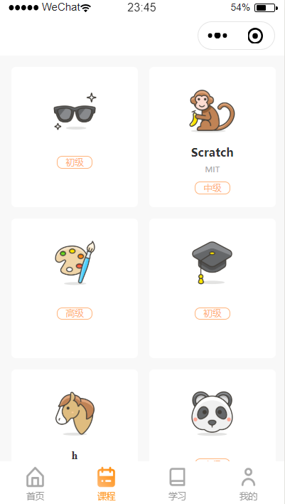
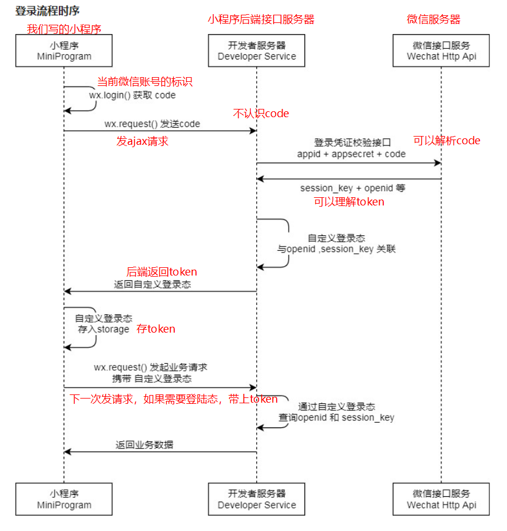

# 微信小程序学习第5天

## 每日反馈

1.  关于将网络请求封装成Promise这一块还是搞不明白
2.  封装回放中 
3.  重新看了一遍对request方法的封装，感觉对promise 和 async&await的应用有了更清晰的理解，挺好的，开心 

## 回顾

1. 首页静态页面

   1. 设计稿自定义宽度为750px。代码里rpx值=设计稿量的值

2. wx.request异步请求

   1. 发ajax请求
   2. 原理也是基于小黄人封装
   3. 使用基本上和jQuery.ajax一致

3. 设置合法域名

   1. wx.request发请求的参数url，url的域名这部分必须在小程序后台配置

   2. 如果不设置合法域名就会报错

      

   3. 如何配置？ 小程序后台-开发-开发设置-服务器域名 

   4. 临时方案，不建议使用

      1. 但是蘑菇在线需要使用临时方案，因为我们服务器部署在本地,localhost无法第3步去配置

4. 对wx.request封装

   1. promise的使用

      1. 把异步请求放在这里 new Promise里面，请求成功就resolve，请求失败reject

      ```js
      new Promise((resolve,reject)=>{
          //把异步请求放在这里
          wx.request({
              success:(res)=>{
                  //请求成功
                  resolve(res)
              },
              fail:(err)=>{
                  //请求失败
                  reject(err)
              }
          })
      }).then(res=>{
          //res就是success回调函数获取到的数据
      })
      ```

   2. 封装的步骤

      1. 提供一个公共的请求方法request，request就声明在home.js
         1. 把现有的某一个请求逻辑放到request，然后调用成功即可
      2. url和success里面处理，每一个请求是不一样，不能写死
         1. url传参
         2. success里面处理，回调函数
      3. 回调函数不爽，用Promise
      4. promise不爽，用async和await(异步请求终极解决方案)
         1. await修饰promise，就会返回then里面数据
         2. await后面语句会等待await执行完成后执行，看起来像同步代码
         3. async：包含await语句的方法，必须用async
      5. 如果想让其他页面都可以使用request方法，必须用模块化
         1. 导出
         2. 导入
      6. 提取BASE_URL

   

## 作业检查

目标：需要完成首页+包括wx.request封装

1. https://gitee.com/liaoyq1115/mymushroom/tree/YQ/ 

   1. 基本上a.b.c这种，有三层以上，想办法优化

      ```js
      if(res.data.status=== 0) {
          resolve(res.data.message)
      }
      //简化
      let {status, message} = res.data
      if(status===0){
          resolve(message)
      }
      ```

   2. 单词拼写` courceList `
   3. 建议完成提取BASE_URL
   4. 很好！

2. https://gitee.com/vickylhh/mushroom49/tree/maque/ 

   1.  常量 必须全大写 单词以_ 分割 
   2. ` getrequest `尽量用驼峰命名，命名尽量见名知义。
   3. 有调试的痕迹，很好
   4. 一般我在企业很少给注释，但是命名一定命好，一个好命名胜过很多行注释。
      1. 关于业务逻辑我才会给注释

3. https://gitee.com/li-zimu/agaric-on-line

   1. 单词拼写` videoLisr `
   2.  实际工作中, 一般是不能出现 console.log 和注释的代码

4. 以上这种ERR_CONNNECTION_REFUSED, 一般就是指接口服务没有启动。或者启动已经报错停止了

   


## Tab栏基本使用

[传送门](https://developers.weixin.qq.com/miniprogram/dev/reference/configuration/app.html#tabBar)

是什么？ 一般是在底部的菜单，点击某一项显示对应的页面

​	1. 一般来说tab菜单，2到5个子菜单

有什么作用? 给应用增加多入口的

#### 使用方法

1. 使用时直接配置就行，**app.json配置**

   1. 小程序里面只有一个tab栏，不会tab栏里面页面还有tab栏

2. 具体的使用

   1. tabBar属性和window是平级

   ```json
   "tabBar": {
       #所有tab公共的属性
       "color": "#0000ff", #所有tab文字的前景色
       "selectedColor": "#ff0000", #tab选中时文字的前景色
       "list": [
           {
               #点击tab时显示页面的路径，这个路径和pages数组里面一致
               "pagePath": "pages/index/index",
               "text": "首页", #tab文字
               "iconPath":"" #tab图标
       		"selectedIconPath" #tab选中时的图标
           },
           {
               "pagePath": "pages/logs/logs",
               "text": "日志"
           }
       ]
   },
   ```

## 蘑菇在线Tabbar栏配置

思路：在app.json配置即可


1. 新增另外两个页面study, my
2. 在app.json添加tabBar配置, copy官方示例
3. 先让首页和课程，点tab文字，显示对应页面即可
4. 增加tabbar属性，color,selectColor, iconPath,selectedIconPath
5. study和my页面添加配置即可


## 课程-页面分析



1. 入口：点击底部tab栏的课程时，显示课程的页面
2. 主要模块
   1. 展示课程列表，每一项不是图片

## 课程-静态页面

1. 新建一个course
2. 页面配置设置导航栏标题
3. 静态页面flex布局


## 课程-渲染页面

> level为1，2，3分别应该显示初级课程，中级课程和高级课程

1. 接口

   1. url  http://localhost:3000/api/course/list 

2. 请求

   1. 尽早发请求onLoad
   2. 请求方法getCourseList
   3. 引入request方法

3. 渲染

   1. 请求结果作为data属性
   2. wx:for

4. 优化

   1. 很多时候，数组能代替else if
   2. 在html里面有相似的dom时，尽量优化掉
   3. 优化方法
      1. 声明一个levelArr

   ```js
   levelArr: ['', '初', '中', '高']
   ```

   ```html
   <!-- <text class="level" wx:if="{{item.level===1}}">初级课程</text>
   <text class="level" wx:elif="{{item.level===2}}">中级课程</text>
   <text class="level" wx:elif="{{item.level===3}}">高级课程</text> -->
   <text class="level">{{levelArr[item.level]}}级课程</text>
   ```

   

## 登录页-页面分析


1. 入口: 我的页面如果没有登录态的话，会跳转到登录页
2. 主要模块：微信授权登录按钮和手机号码登录
3. 其他说明
   1. 微信授权登录用当前登录微信的账号登录小程序
   2. 手机号码登录，点击会跳转到登录页


## 登录页-静态页面

1. copy静态页面进来
2. 在app.json添加页面路径

#### 样式说明

1. 伪元素的使用

   1. 使用方法

      1. 父元素position:relative

      2. 伪元素

         ```css
         .desc::before {
           position: absolute;
           content: '';
           /* 定位*
           top: 17rpx;
           left: -54rpx;
         }
         ```

         

   

2. 手机号码登录点击跳转用组件navigator

3. 微信授权登录样式

   1. 从语义来说的确应该用button
   2. 微信小程序button有很多我们不需要的样式，如果想整成以下样子的话，需要重新设置一系列的样式，所以改用`view`
   3. 实例开发中，button也有直接图片搞定

   


## 小程序授权

[传送门](https://developers.weixin.qq.com/miniprogram/dev/framework/open-ability/authorize.html)

> 文档位置: 指南->开放能力->授权

#### 是什么？

小程序向微信申请一些权限，微信用户信息，微信运动步数，微信通讯地址，录音等等

#### 基本使用（不包括用户信息）

1.   [wx.authorize](https://developers.weixin.qq.com/miniprogram/dev/api/open-api/authorize/wx.authorize.html)  发起授权
2. 调用对应的API

```js
// 1.发起授权
wx.authorize({
    scope: 'scope 列表中一个scope',
    success: () => {
        // 2.调用授权接口,scope对应的方法
        scope对应的方法({
            success(res) {
            }
        })
    }
})
```

#### 用户信息授权

1. 不能使用编程式，只能用声明式

```html
<button open-type="getUserInfo" bindgetuserinfo="事件处理方法">获取用户息</button>
```

```js
function 事件处理方法(event){
	event.detail.userInfo来获取到用户信息
}
```

#### 注意点：

1. wx.authorize发起授权，第一次会弹出授权弹框，如果用户允许，不会弹。

2. 授权弹框，在微信开发者工具里，显示在模拟器中央，但是手机上底部。

3. 授权弹框，如果用户允许会进入success回调。如果上一次用户允许了，不会弹授权弹框，会直接进入success回调

4. 在微信开发者工具里面，这个是用来清缓存

   

5. 除了用户信息之外的授权弹框，如果拒绝，下次点击不会弹框; 用户信息授权弹框，如果用拒绝也会弹。
6. 在手机上，清除授权数据，把小程序从最近使用里面删除。
7. 微信开发者工具获取用户的通讯地址，无论是否使用真实的APPID, 通讯地址都是假数据
8. 微信小程序运行在手机上获取通讯地址来自于，微信头像，点击我的地址

#### 练习：

1. 获取用户**通讯地址**
2. 获取用户信息
3. 用手机预览扫码


## 小程序登录

[传送门](https://developers.weixin.qq.com/miniprogram/dev/framework/open-ability/login.html)

#### 概念

就是用微信账号登陆微信小程序

#### 原理

就是第三方登录

1. 什么是第三方登录。比如微信相对于掘金就是一个第三方
2. 如何理解：如果不关心微信接口服务器的话，**小程序带上code发ajax请求给后端，后端返回token**。




#### 注意点

1. wx.login的用法

   ```js
   wx.login({
     success (res) {
       console.log(res.code) //033KivfC0ZAAHk2yIGhC0v3LfC0KivfH
     }
   })
   ```

2. 小程序登录，ajax请求带上code，但是实际上很多情况下，登录请求都需要带上小程序授权信息+code。


## 登录页-微信授权登录

1. 先分析接口

   1. url  http://localhost:3000/api/user/wxlogin 
   2. 方法是post
   3. 参数
      1. code wx.login获取
      2. nickname 声明式用户授权信息
      3. avatar 声明式用户授权信息

2. 必须要先授权获取到用户信息, 使用声明式获取用户信息

   1. 原因：参数里面nickname必须用声明式

   2. 方法

      ```html
      <button open-type="getUserInfo" bindgetuserinfo="wxLogin">获取用户息</button>
      ```

   3. 又有新的问题：微信授权登录的按钮，并不是button，无法声明open-type.

      1. 方案：把获取用户信息的button覆盖在view上面，而且透明

         1. 在父盒子里面绝对定位，透明

         ```css
         .wx-login-btn button:not([size='mini']) {
           position: absolute;
           width: 100%;
           height: 100%;
           opacity: 0;
         }
         ```

   3. 获取用户code

      1. wx.login

   4. 发请求

      1. 由于第3步，是异步的。所以发请求必须在wx.login的success
      2. 引入request

   5. 请求url,方法，传参都没有问题，但是并没有返回code

      

      1. 原因
         1. 后台逻辑：**只有当前小程序的项目成员才可以登录**
      2. 解决方案
         1. 确认微信开发者工具appid是第一天注册的
         2. 后台代码配置小程序appid，appsecret
            1. 后台代码配置文件位置`蘑菇在线\服务器代码\mushroom-online-server\src\config\wxconfig.js`
            2. 更新AppID和AppSecret
               1. AppSecret在小程序后台，开发，开发设置，重置生成一个新的AppSecret
         3. 重启后台代码服务器
            1. ctrl+c， npm run start
            2. 如果找不到命令行，或者说已经报错，3000端口占用
               1. 注销电脑，再次执行npm run start

   6. 无法获取token

      1. 原因：公共请求方法resolve(res.data.message), 而token字段和message是平级的
      2. 解决方法：
         1. 公共请求方法resolve(res.data)
         2. 其他页面请求得改

#### 注意点

1. 在调试器里面，样式划线，但是还是生效，bug

   

2. 能css解决的话，不要再js来参与解决

3. 公共请求request方法里面，注意需要传method和data

4. 如果请求出错，如何定位问题

   1. **无论前端请求有多少封装，最终都可以在调试器的network查看得到**。包括前端发给后端的数据，后端返回给前端的数据

   2. 如何定位

      1. 在network找到你的请求，点击

      2. 重点看这三部分

         

         1. response就是后端返回前端数据
         2. preview是response的格式化的数据
         3. **headers前端发给后端的数据，重点检查**
            1. **URL**
            2. **方法**
            3. **参数（拉到最下面）**

         

      3. 下次如果请求出错，截图发我URL方法和参数

#### 练习注意点：


## 总结

1. tabbar

   1. 概念：底部菜单，点击其中一个菜单时，显示对应页面
   2. 作用：给应用增加多入口
   3. 使用方法：app.json的tabBar属性上配置即可

2. 小程序授权

   1. 概念：小程序获取微信的一些权限

   2. 基本使用（不包括用户信息）

      1. 发起授权，弹出授权弹窗
         1. wx.authorize
         2. 例如: scope.address
      2. 调用相应的授权接口
         1. 例如 wx.chooseAddress()

   3. 获取用户信息

      ```html
      <button open-type="getUserInfo" bindgetuserinfo="事件处理方法中获取到用户信息"></button>
      ```

3. 小程序登录
   1. 概念： 微信账号登录小程序
   2. 原理：ajax请求带上code，发送后端，后端返回token
      1. 会涉到小程序后台会拿到code+appid+appsecret发送微信接口服务器，由后者返回token
4. 登录页-微信授权登录
   1. button放在微信授权登录这个view里面，只能有功能，不能有样式
      1. button绝对定位，占满父盒子，然后透明
   2. 点击button，获取用户信息
   3. 获取code
      1. wx.login的回调函数success
   4. 发请求
   5. code不正确
      1. 后台代码逻辑：只有小程序管理员或者开发者才能登录
      2. 后台代码需要配置
         1. wxconfig.js里面配置appid和appsecret
         2. 重启server

> 为什么蘑菇在线服务器要部署在本地？
>
> 原因是：登录的逻辑方便大家更改appid

## 作业

1. 课程页面
2. tab栏配置
3. 登录页面完成
4. 我的页面的静态页面(选做)
