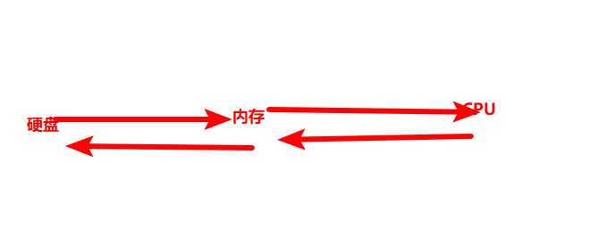
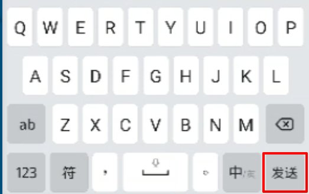
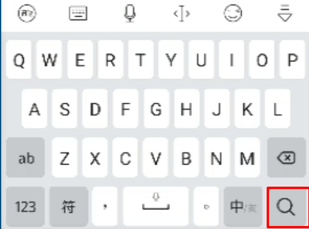

# 微信小程序学习第6天

## 每日反馈

1. 声明式和编程式有点混乱了 

   1. 问问题能更加具体一些

   2. 描述好一个问题

      1. 心态上应该方便别人，节约别人时间
      2. 写问题时候，尽量邮件形式（截图给代码）

   3. 声明式（html,wxml就是结构）

      ```html
      <navigator url/>
      <button open-type="getUserInfo">
          
      </button>
      ```

   4. 编程式就是js

      ```
      wx.getUserInfo x
      ```

   5. 小程序授权里面用户信息授权只能用声明式，官方规定


## 回顾

1. 课程页面

   1. 静态页面

   2. 发请求渲染页面

   3. 优化：用数据替代if...else

      ```js
      levelArr: ['', '初', '中', '高']
      ```

2. 微信授权

   1. 概念：小程序获取微信的一些权限，比如通讯地址，用户信息，录音，开启摄像头

   2. 使用

      1. 基本使用（不包括用户信息）

         1. 发起授权，弹出授权弹窗
            1. wx.authorize
         2. 调相应接口
            1. 举例[wx.chooseAddress](https://developers.weixin.qq.com/miniprogram/dev/api/open-api/address/wx.chooseAddress.html) 

      2. 用户信息

         ```html
         <button open-type="getUserInfo" bindgetuserinfo="事件处理方法"></button>
         ```

3. 小程序登录

   1. 概念：用微信账号登录小程序
   2. 原理：小程序发ajax请求，带上code，后端返回token
      1. code是微信账号标识，只有微信接口服务器才能解析，所以后端需要和微信接口服务器通信

4. 微信授权登录

   1. button放到微信授权登录的view标签中，覆盖并透明(原来的微信授权登录有功能，不影响样式)
      1. 覆盖postion:absolute, height:100%;width:100%
      2. 透明 opacity:0
   2. 用户信息
   3. code
      1. wx.login
   4. 发请求
   5. 请求报错，code不对
      1. 微信开发者工具需要设置真实的appid
      2. 后台服务器代码配置appid和appsecret，并重启

> 微信开发者闪退，原因当你打开微信开发者工具时，如果模拟器没有显示完整，就会闪退。


## 作业检查

1. https://gitee.com/weng9806/mushroom-lite/tree/abc/

   1.  不错

2. https://gitee.com/zhlgh/mushroom/tree/lgh_2020531/

   1.  还不错，
   2.  后面没有push？

3. https://gitee.com/xiehuiyu/mushroom/tree/xhy/

   1. 方法的参数如果比较多的话，尽量使用对象

      1.   这样写传参的顺序不能变

      ```js
      export default function appRequest(api, params, method = 'GET', loading = true) {
         // 形参的解构
      export default function appRequest({api, params, method = 'GET', loading = true}) {
      ```

   2. 关闭loading的效果应该放在complete
   3. 公共请求方法resolve(res)？？？？
   4. 有自己思路，挺好

4. https://gitee.com/HZL-GIT/mushroom49/tree/home

   1.  公共的请求方法里面不应该出现个别请求的参数，整个data应该作为参数传递
   2.  注释详细

5. https://gitee.com/joyceqiu/mushroom.git

   1.  赞

6. https://gitee.com/chenwenjie8888/mushroom-mp49.git

   1.  使用回调，不使用promise???

7. https://gitee.com/t-twelve/heimaxcx49qi.git

   1.  没跟上，加油

> 年终评极: S,A,B,C,D
>
> S: 大大超出预期
>
> A:超出预期：3个月
>
> B: 符合预期，正常的1个月年终奖
>
> C:完成不好：没有年终奖，下一年涨薪没有了
>
> D:更不好


## 数据缓存

[传送门](https://developers.weixin.qq.com/miniprogram/dev/api/storage/wx.setStorageSync.html)

**回顾localStorage与sessionStorage**

1. 使用

   1. localStorage和sesssionStorage的API一致

   ```js
   localStorage.setItem('key',值)
   localStorage.getItem('key')
   localStorage.removeItem('key')
   localStorage.clear() //清除所有
   ```

2. 区别

   1. 关闭页面localStorage存储还在

3. 缺点

   1. 只能存5M

结论：localStorage存储的空间还是偏小，小程序里面提供storage API有更大的存储空间


#### API的使用

​	1.  建议直接使用同步api即可

```js
// 存
wx.setStorage({
    key: 'name',
    data: 'joven',
    success(){
        console.log('存成功了')
    }
})
// 同步API
wx.setStorageSync('age', 18) //存
console.log(wx.getStorageSync('name'))//取
wx.removeStorageSync('name') //移除指定Key的存储
wx.clearStorageSync() //清除所有
console.log(wx.getStorageInfoSync()) //当前storage的相关信息
```

**问题: 为什么setStorage有回调函数？为什么还有对应的Sync的方法？**（了解)

1. 硬盘和内存的关系 

   1. 硬盘：容量比较大，相同的容量的话比内存便宜，断电后数据不会丢失; 存取速度比较慢

   2. 内存：容量比较小，相同的容量的话比内存比较贵，断电后数据就丢失; 存取速度比较快

   3. 一般数据是存硬盘里面，运行时从硬盘调到内存里面，然后内存再和cpu通信,程序退出前，内存数据存到硬盘。

      

   4. 我们常用的API特点：一般存取硬盘是异步的，存取内存是同步的

      1. nodejs读文件 fs.readFileSync

2. setStorage本质上就是**存取手机文件系统的**

3. sync这种API, 相当于是`await修饰过的promise对象`，只不过看起来是同步，实际上还是异步的

4. localStorage存取时候也是同步的，关闭页面localStorage存储还在？

   1. 关闭浏览器前，内存=>硬盘

**使用场景：**

1. 一般直接使用同步的API即可

#### 注意点

1. 存储的情况在调试器的storage里面可以看到
2.  单个 key 允许存储的最大数据长度为 1MB，所有数据存储上限为 10MB 
3. **存取数据可以是对象**


## 登录页-存储token

1. 存token并提示成功
   1. wx.setStorageSync
   2. wx.showToast

#### 注意点

1. **工作中用到的软件，默认安装路径是最稳定**
   1. vscode,git,nodejs


## 小程序App生命周期

[App生命周期](https://developers.weixin.qq.com/miniprogram/dev/reference/api/App.html)

> 小程序生命周期包括两部分: 页面生命周期和App生命周期

App生命周期：可以理解小程序的生命周期

1. onLaunch 启动时触发，只能触发一次
2. onShow 小程序显示
3. onHide 小程序隐藏


## 小程序Page生命周期

[Page生命周期](https://developers.weixin.qq.com/miniprogram/dev/framework/app-service/page-life-cycle.html)

> 可以理解成浏览页面的生命周期

1. onLoad 页面加载
   1. 应用场景：页面加载尽早发请求
2. onShow 页面显示
   1. 应用场景：切换tab页，想发请求刷新页面
3. onReady 页面初次渲染完成
   1. 可以理解成DOMContentLoaded
4. onHide   页面隐藏
   1. 应用场景: 切换别的tab页面时，想存储
5. onUnLoad 页面销毁
   1. 应用场景：非tab页面返时，定时器清除

> $(function(){
>
> })
>
> 完整写法
>
> jQuery.ready(function(){
>
> //能保证dom渲染完成
>
> })
>
> 问题是：jQuery.ready是怎么实现？？
>
> ```
> document.addEventListener("DOMContentLoaded",function(){
> ```

#### 注意点

1. vue路由切换页面，默认会销毁前一个页面
   1. **TODO: 如果配合keep-alive可以在切换页面，只是隐藏页面**
2. 小程序返回页面，**上一个页面也会销毁**，并不会隐藏

## Tab页特点

[传送门](https://developers.weixin.qq.com/miniprogram/dev/framework/app-service/route.html)

tabbar作用：给应用增加多入口

特点：

1. 没有配置在tabbar里面页面，打开页面不会显示底部的tabbar
2. 跳转到非tabbar页面，用`wx.navigateTo`
3. 跳转到tabbar页面，用`wx.switchTab`
4. 初始小程序只会初始化第一个tab页面，首次点击其他tab页，才会初始化该tab页
   1. 小程序打开时先保证第一个页面初始化完全，首屏加载速度快
5. 后续切换tab页，只会触发tab页显示/隐藏，并不会销毁
   1. 用户会步骤使用

> 打开小程序时，是不是所有的tab页都初始化？否

#### 提示：

1. `wx.navigateBack()`, 默认返回上一页
2. 非tab页返回时会销毁


## 我的-页面分析 


1. 入口：tab栏点击我的，显示我的页面
2. 主要模块：头像，昵称，打电话
3. 其他说明
   1. 如果用户没有登陆直接跳转登录页
   2. 登录页登录回来，刷新页面展示用户昵称头像


## 我的-静态页面

1. copy静态页面
2. 主体部分向上突出效果，margin-top:负值

## 我的-渲染页面

1. 如果用户没有登录，跳转登录页

   1. 尽早判断storage有没有存token
      1. 尽早： onLoad还是onShow??暂时用onLoad

2. 登录成功后需要跳转到我的页面

   1. wx.navigateBack返回上一页

3. 希望登录成功后的提示显示一会再跳转

   1. wx.showToast success并不是提示消失的回调，而且 消息提示框显示的时候触发的
   2. 需要在success里面用setTimeout延时

4. 返回我的页面和初始化我的页面，发请求获取我的信息，并渲染

   1. 接口 
      1. url /api/my/info
      2. header需要传token
   2. onLoad如果有token的话，就发请求
   3. 渲染

5. 点击在线客服，打电话

   1. phoneNumber值必须是字符串

   ```js
   wx.makePhoneCall({
       phoneNumber: '10086',
   })
   ```

6. 我的页面未登录跳转微信授权登录后，再跳转回来，并不会刷新页面
   1. 原因：navigateBack不会触发onLoad, 会触发onShow
   2. 解决方案：
      1. **onShow**处理判断token
         1. 如果没有登录跳转登录
         2. 有登录态，请求接口渲染页面

#### 注意点：

1. wx.navigateTo跳转到其他页面时，后面代码依然会执行; 如果不想后面逻辑执行，需要return
   1. A跳转B时，A页面依然存在，所以页面逻辑依然执行

>  A->B, A,B两个页面都在
> B->A, B销毁，A显示onShow
> tab页切换只能显示与隐藏  


## 组件Input

[传送门](https://developers.weixin.qq.com/miniprogram/dev/component/input.html)

#### 概念

1. 就是输入框，不是单选框或者复选框
   1. 单选框或者复选框是其他组件

#### 如何使用

```html
<input value="这是一个下雨天"></input>
```

1. 特点：没有边框

   1. 如果想增加边框的话，用css

2. **type就是键盘类型**，默认是text

   1. text 文本键盘
   2. number 数字键盘
   3. idcard 身份证键盘

3. **confirm-type设置键盘右下角按钮文案**（必须type字段为text时才生效）

   1. send 发送

      

   2. search 搜索

      

4. 如何获取输入框的值呢？
   1. 小程序没有v-model
   2. bindinput的事件处理方法 event.detail.value
5. 键盘右下角按钮点击事件
   1. bindconfirm
   2. 电脑上enter点击会触发bindconfirm事件

## 手机号登录页-页面分析


1. 入口：登录页点击手机号码登录跳转的
2. 主要模块：手机号码输入框，获取验证码，验证码输入框，立即验证按钮
3. 其他说明
   1. 手机号码输入框只能输入手机号码
   2. 获取验证码，点击后变成60S，开始倒计时，同时会发请求获取验证码
      1. 倒计时到0后，变成获取验证码
      2. 倒计时过程中，不能点击
      3. 验证码并不是短信验证码，直接toast出来
   3. 立即验证完成手机号码登录

## 手机号登录页-获取验证码-练习

1. 设置两个输入框的长度，和输入框类型

   1.  maxlength 
   2. type

2. 获取用户输入的手机号码

   1. bindblur:getPhoneNumber
   2. 在事件处理方法getPhoneNumber,event.detail.value获取手机号码
   3. 获取到手机号码，作为data属性

3. 每次编译手机号码输入框都是空的，能不能整个初始时写死一个手机号码

   1. data.phoneNubmer给个初始值
   2. 然后data属性绑定input value值

4. 点击获取验证码，开启倒计时

   1. 点击bindtap: queryVcode
   2. 需求拆分
      1. 点击获取验证码，按钮文案变成'60s'
         1. data属性isCountDown
         2. 点击改变isCountDown
         3. 结构里面根据isCountDown决定按钮的文案

5. 开始倒计时：每一秒数字-1

   1. 60数字不能写死，只能作为data属性countNum
   2. 定时器setInterval，每一秒countNum-1

6. 倒计时数字减到0，变成发送验证码

   1. 判断countNum
      1. countNum>1，countNum--
      2. 否则的话，变成发送验证码

7. 检验其他的bug

   1. 倒计时结束再次点击获取验证码，倒计时数字从1开始
      1. 倒计时结束时，countNum:60
   2. 倒计时结束再次点击获取验证码,倒计时数字-1很快
      1. 清除定时器
   3. 如果正在倒计时中，不允许点击的
      1. 逻辑放在最上边

8.  TODO：判断phoneNumber的格式没有问题

   1. 正则表达式判断

9. 发请求获取验证码，并toast出来

   1. 接口 

      1. url   [/api/user/vcode](http://localhost:3000/api/user/vcode) 
      2. 参数phone

   2. toast提示

      1. title必须是字符串
      2. icon不需要，设置none

      ```js
      wx.showToast({
          title: data.vcode + '',
          icon:'none',
          duration:5000
      })
      ```

#### 注意点：

1. 微信开发者工具，input type:number依然可以输入字母。这个在手机上是没有问题，忽略掉

2. 结构里面{{}}就是js语法

   ```js
   {{isCountDown?(countNum+'s'):'获取验证码'}}
   ```

## 手机号登录页-点立即验证完成登录

1. 获取验证码
   1. bindblur：getVcode
   2. getVcode获取用户输入的vcode，event.detail.value
   3. 获取到的值设置为data属性vcode
2. 分析接口
   1. url  [/api/user/login](http://localhost:3000/api/user/login) 
   2. 请求方法post
   3. 参数
      1. phone
      2. vcode
3. 点击立即验证发请求
   1. 点击事件 bindtap: phoneLogin
   2. 请求成功后，存token，提示，并跳转my页面
      1. 我的->登录页->手机号码登录，所以跳转my页面，不能navigateBack，需要switchTab
4. 其他问题检查
   1. 假数据还原
      1. phoneNumber
      2. countNum
   2. 如果没有在结构中使用的变量，不应该声明data属性
      1. 解决方案：直接把变量添加this.属性

#### 注意点：

1. 手机号码登录，用户的头像和昵称数据是没有。也就是去我的页面无法展示头像和昵称

## 总结

1. 数据缓存

   1. 概念：存取数据

   2. 使用：建议使用同步的API

      ```js
      wx.setStorageSync(key,value)
      wx.getStorageSync(key)
      wx.removeStorageSync(key)
      wx.clearStorageSync()
      ```

   3. 原理上：存取就是存取手机的文件系统，所以是异步的

2. 小程序app的生命周期

   1. onLaunch 小程序启动
   2. onShow 小程序切前台
   3. onHide 小程序切后台

3. 小程序页面的生命周期

   1. onLoad加载, 非tab页面请求
   2. onShow 页面显示，tab页面请求
   3. onReady 页面初次渲染完成
      1. 类比于DOMContentLoaded
   4. onHide 页面隐藏：tab页隐藏时，存储
   5. onUnload销毁，页面返回前清除定时器

4. tab页面特点

   1. 跳转wx.switchTab
   2. 没有app.json的tabbar配置的页面，不会显示底部的tab栏
   3. 小程序启动时，只会初始化第一个tab页面，其他tab页面，第一次点击才初始化
   4. tab页只要初始化，就不会销毁，后续切换tab只会显示/隐藏,会触发onShow

5. 组件Input

   1. type 键盘类型
   2. confirm-type键盘右下角按键的文案
   3. 获取Input的值 bindinput,bindblur的事件处理方法event.detail.value
   4. 键盘右下角按钮点击事件, bindconfirm

6. 手机登录页-倒计时

   1. 点击后，按钮文案改变
      1. 状态isCountDown
   2. 开始倒计时
      1. countNum--
   3. countNum减到1时，下一步变成获取验证码
      1. 如果减到1
         1. isCountDown为false
         2. countNum:60
         3. 清除定时器
   4. 其他bug
      1. 如果正在倒计时，禁止点击

## 作业

1. 我的页面
2. 手机号登录页
3. 有兴趣可以把token的判断放在request.js里面
