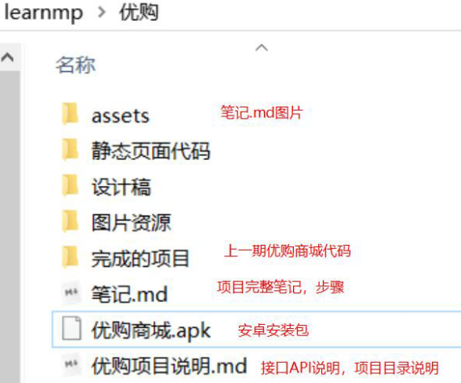
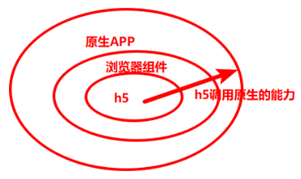
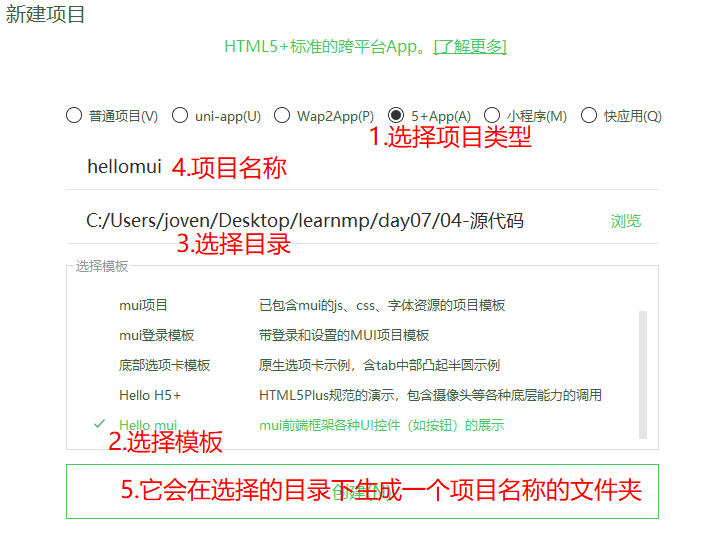
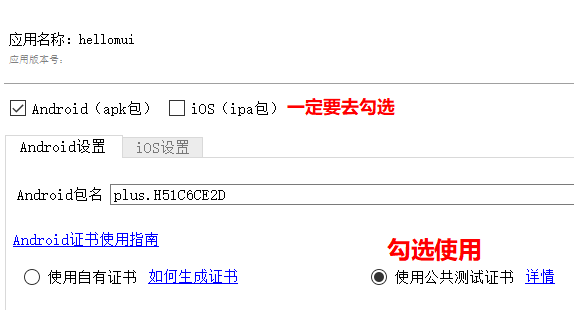
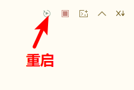
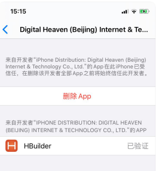

# 微信小程序学习第7天

## 回顾

1. 数据缓存

   1. 概念就是小程序存取

   2. 使用

      ```js
      wx.setStorageSync(key,value)//存，value值可以是对象
      wx.getStorageSync(key) //取
      wx.removeStorageSync(key) //移除指定key的存储
      wx.clearStorageSync //清除所有存储
      ```

   3. 本质上是对手机文件系统的存取

2. 小程序app的生命周期

   1. onLaunch 小程序启动时
   2. onShow 小程序显示，或者小程序前台
   3. onHide 小程序切后台

3. 小程序页面的生命周期

   1. onLoad 页面加载
   2. onShow 页面显示
   3. onReady 页面初次渲染完成
   4. onHide 页面隐藏
   5. onUnload 页面卸载

4. 组件Input

   1. 没有边框
   2. type键盘类型
   3. confirm-type键盘右下角按钮文案
   4. 如何取值 bindinput="eventHandler", event.detail.value
   5. 键盘右下角按钮点击事件bindconfirm

5. 发送验证码倒计时

   1. 点击后,按钮文案有变化，isCountDown决定结构显示"获取验证码"还是倒计时
   2. 开启倒计时 setInterval，每秒减1
   3. 减到0以前，每秒减1; 减到0后，isCountDown:false, countNum:60,清除定时器
   4. 正在倒计时中，不能点。


## 作业检查

检查内容：我的页面以及手机号登录页

1.   https://gitee.com/tsukiShiro/mushroom-lite49/blob/dev_2020515/pages/phone-login/phone-login.js 
    1.  手机号码登录检验了手机号码及验证码的格式
2.    https://gitee.com/chen_zihuang/mushroom/blob/fea_czh_20200531/pages/phoneLogin/phoneLogin.js 
     1.   timeId可以作为局部变量的，你试试？？
     2.    clearInterval ？？？
     3.    unable 一般用作disabled
     4.   bindtap注册事件，是初始化dom时触发，并不是每次点击时注册
3.   https://gitee.com/tang_36/mushroom-mp-49/tree/mp_2020531/
     1.  平淡无奇
4.   https://gitee.com/liu_zx001/mushroom-mp-49/blob/Fea_kobe_2408/pages/phone-login/phone-login.js 
     1.  有检验手机号码的逻辑和自己的思路
5.   https://gitee.com/yangzhiyuan123456/mushroom/blob/yzy_2020531/pages/phone-login/phone-login.js 
     1.  单词拼写错误
     2.  有请求错误的处理
6.   https://gitee.com/liaoyq1115/mymushroom/blob/YQ/pages/phone-login/phone-login.js 
     1.  有检验手机号码的逻辑
7.   https://gitee.com/weng9806/mushroom-lite/blob/abc/pages/phone-login/phone-login.js 
     1.  完成后需要移除测试数据
8.   https://gitee.com/superhero_movie/mushroom/tree/mushroom_49/  
     1.   假数据需要移除
     2.   挺好


## 没有在结构中使用变量，不应该声明为data属性

1. 只在结构中使有变量，必须声明为data属性

2. 为什么没有在结构中使用变量，不应该声明为data属性

   1. data属性都会被defineProperty监听改变并尝试更新关联的dom，如果这个属性并没关联dom，监听就是浪费性能

3. 没有在结构中使用变量，应该怎么声明

   1. 在页面script最开始的部分声明全局变量

      ```js
      let swiper = null
      ```

   2. **给vue实例添加属性，无须声明(推荐用这种)**

      ```js
      this.swiper = new Swiper('.swiper-container')
      ```

>  特殊情况： 需要侦听watch呢 没有在data对象中 可以侦听到吗? 不能，需要放在data属性中


## 优购商城项目介绍

1. 商城的业务类型很ok
   1. 小程序最常见业务类型
   2. 大家毕业后，如果做小程序的话，基本上拿优购商城改改就行
2. 优购商城的基本逻辑
   1. 会参考小米lite小程序，京东商城app
   2. 分类->类目搜索->点击具体商品->商品详情->加入购物车->结算去到支付页面，完成支付
3. 项目支持多端
   1. uniapp支持8端包括ios,安卓，h5,各种小程序
   2. 优购商城会ios,安卓，h5,各种小程序
4. 接口
   1. 接口服务器不是部署在本的
   2. [接口文档](https://www.showdoc.cc/696455032746099?page_id=3984516634822174)

#### **优购文件夹目录说明：**



1. assets：忽略掉，这个是笔记.md图片
2. 静态页面代码：前两个页面，会课堂上完成，其他页面直接copy
3. 设计稿，是png，不是一个标准的设计稿
4. 图片资源：小图标，写静态页面需要引入
5. 完成项目：上一期完成的代码
6. 笔记.md：每一天关于优购商城的笔记汇总
7. 优购商城apk：上一期的安卓安装包
8. 优购项目说明：接口说明

## 移动开发

移动端：运行有手机端或者平板上的前端界面

1. 原生App开发
   1. 概念: 安卓用java开发app，ios用object-c+swift开发的app
   2. 优点: 性能最好，动画支持以及数据处理最好最快
   3. 缺点：两套代码，审核麻烦
      1. 审核麻烦
         1. ios一般审核需要两周，而且审核规则比较严格
            1. 一定需要你有注册功能
            2. 而且一些页面不能显示出来
         2. 安卓需要发布至少4个平台，比如小米应用商城，应用宝，vivo，华为。。。
            1. 安卓一般来说4天审核通过
   4. 应用场景
      1. 总的来说原生APP开发市场越来越小了。
      2. 应用场景：对动画要求比较高，比如游戏。比如直播
2. 移动端H5
   1. 概念: 浏览器里面运行的页面
   2. 举例
      1. 黑马头条
   3. 优点
      1. 完成项目速度挺快的。
   4. 缺点
      1. 没有原生能力，不是独立的APP
   5. 应用场景
      1. 手机短信点击链接跳转
      2. 微信公众账号就是H5页面
3. **H5混合是用来做App（Hybrid）**
   
   1. 概念: 原生APP提供一个浏览器组件，在浏览器组件里面运行H5，H5可以调用原生能力
   
      
   
   2. 优点：可以访问原生，可以用h5技术来做APP。开发效率是比较高的，发版无须审核。
   
   3. 缺点
   
      1. 基本上只能支持简单的动画
      2. 依然需要安卓和ios程序员
   
   4. 开发的工作量方面
   
      1. 95%以上还是写h5
      2. 5%是调用原生能力
   
   5. 兼容性
   
      1. 一套代码可以h5,安卓和ios兼容
   
   6. 应用场景
   
      1. 市场上大部的app都是用这种技术
4. 原生混合
   1. 概念: 用类h5语法作为配置文件，告诉原生如何渲染组件
   2. 优点：性能会比h5混合稍快，稍复杂的动画可以使用这种技术
   3. 缺点：类h5语法有学习成本，兼容性只能兼容ios和安卓
   4. 技术代表
      1. react native,  weex都不成熟
   5. 应用场景
      1. 对动画和性能稍有要求的公司会用
5. 小程序
   1. 概念: 运行在微信中的MINI的APP
   2. 优点：性能还好，在微信里面有入口
   3. 缺点：只能在微信的生态里面
   4. 应用场景
      1. 引流
      2. 商城类的小程序
      3. 工具效率类的

> 大家就业移动端，基本上是用混合模式的app和小程序


## 原生小程序与第三方小程序框架们

原生小程序是什么？有原生HTML这种说法吗？

1. 原生来自于英文"raw", 意思**官方语法**

2. 原生小程序是微信小程序的语法

3. 原生HTML，没有这种说法

   

#### **原生小程序的痛点：**

1. 语法：类vue，挺另类的
2. 开发工具
   1. 微信开发者工具不好用
3. 引入第三方组件
   1. 比较麻烦
4. npm支持
   1. 支持不好

#### **几个常见的第三方小程序框架对比**

第三方小程序框架：用我们熟悉H5页面代码转成小程序代码，可以做一套代码支持多端

   1. wepy
      1. 语法：类vue
      1. 由腾讯收编，腾讯在维护
          2. 多端兼容性：能够多种小程序
   2. mpvue
        1. 语法：纯纯vue语法
        1. 框架来自美团，已经年久失修，3年没有人维护
        1. 多端兼容性：能够支持各种小程序
        1. 缺点：框架本身不够完美，坑挺多
    3. uniapp
           	1. 语法：vue语法
           	2. 多端兼容性：支持8端
           	3. 来自数字天堂（北京）
           	4. 优点：支持多端，坑比较少
      4. taro
        1. 语法：React
        2. 京东提供的框架
        3. 多端兼容性：能够支持各种小程序

#### **扩展：**

1. 什么是跨端开发框架？
   1. 一套代码支持多端
2. 小程序第三方框架对比：
   1. [传送门](https://juejin.im/post/5ca1736af265da30ae314248)


## Dcould(数字天堂)的产品

[传送门](https://www.dcloud.io/)

1. **HBuilder** X
   1. **开发工具**
      1. 也不是国产的
      2. eclipse+web插件
2. **uni-app**
   1. 多端开发框架，vue.js开发所有前端应用
3. **H5+** 
   1. 用来做混合模式的APP
4. MUI
   1. h5+的UI库

> 有技术气质的公司，文档写得详细得令人发指。阅读的话，可以把前端技术能点满


## 认识开发工具HBuilder和HBuilderX

[传送门](https://www.dcloud.io/hbuilderx.html)

#### 安装：

1. 下载哪个版本？
   1. App开发版
      1. 包括App打包等等一些插件
2. 解压安装
   1. 推荐在C盘新建一个文件夹"myApp"
      1. 不要放在c盘program目录
   2. 把hbuilder...zip包拖进去，解压
      1. 一定要等它解压完
         1. 否则有部分功能可能会缺失
   3. 运行，找到hbuilder.exe文件打开即可
3. 需要注册？
   1. **最好是注册一下**
   2. 如果不注册，每次会弹注册，插件引入一定需要注册


#### 熟悉HBuilder

1. 设置快捷键
   1. 工具->预设快捷键方案->vs code
2. 切换主题
   1. 工具->主题
3. 支持vue语法
4. 新建项目
   1. 文件-新建- 项目
5. 视图
   1. 双击打开的文件，可以隐藏项目管理器
   2. 再双击文件时，又可以显示项目管理器
6. 关闭项目
   1. 选择项目-关闭项目
   2. 关闭的项目都在项目管理器的下边
7. 设置
   1. 需要设置制表符长度为2
      1. 也就是代码缩进为2个空格

## HBuilder基本使用-练习

创建一个h5+类型的项目，同时选择hellomui模板



1. 浏览器运行

   1. **选择.html文件**，运行->内置浏览器（运行到浏览器）

2. 真机调试

   1. 保证手机已经连结电脑（用数据线）
   2. 选择项目->运行->运行到手机或者模拟器

3. 打包apk

   1. 选择项目—>发行->原生App云打包

   2. 在弹出的界面

      

      1. 去勾选ios
      2. 安卓使用公共测试证书
      3. 打包

   3. 下载apk并安装

      1. 发行->查看云打包状态，如果打包完成的话，会提供一个载链接
      2. 下载安装即可

4. 控制台

   1. 一个项目运行不同的环境都会有一个对应的控制台，在控制台里面可以重启

      

5. 复制粘贴

   1. 可以直接把文件拖到hbuilder工程里面

#### 注意点

1. hbuilder创建项目时，会根据项目名称在目录下自动生成文件夹
   1. 和微信开发者工具新建项目不一 样


#### 练习：

1. 创建hellomui项目
2. 浏览器运行
3. 手机连结hbuilder
4. 打包apk

## HBuilder连结手机（可选）

1. 安卓
   1. 打开usb调试及usb安装
      1. 在设置，点击系统版本号7次，打开“开发者选项”
         1. 具体每个手机，怎么打开“开发者选项”，自行百度一下
      2. 在设置里面找到“开发者选项”, 允许，允许usb调试，和usb安装
   2. 连电脑
      1. 运行->运行到手机或者模拟器->你的设备
   
2. windows连结ios
   5. 信任证书
   
      1. 设置->通用->描述文件（设备管理）->找到Dcould企业证书->点击信任
   
         
   
3. 其他方法


#### 练习：

1. 创建hellomui项目
2. 浏览器运行
3. 手机连结hbuilder
4. 真机调试
5. 打包apk

#### 注意点：


## H5+基本使用-练习

[传送门](http://www.html5plus.org/doc/h5p.html)

#### 概念

#### 使用

#### 注意点：


## uni-app介绍

[传送门](https://uniapp.dcloud.io/)

#### 概念

#### 新建项目

#### 运行

1. 浏览器运行
2.  真机调试
3. 运行微信开发者工具


#### 提示：

3. **运行小程序配置**


#### 问题：


## uni-app文档简介

[传送门](https://uniapp.dcloud.io/)

1. 介绍
2. 框架
3. 组件
4. API
5. 插件市场


## 总结


## 作业

3. 连结手机(可选)
2. 熟悉uniapp文档
3. h5+的api