# 微信小程序学习第8天

## 每日反馈

1. 概念的东西确实难理解一点, 优购项目是用什么开发模式的呀
   1. uniapp框架
   2. 开发工具hbuilder(写代码)
   3. 查看效果用微信开发者工具
   4. 以微信小程序文档为主，uniapp也会查看
   5. **uniapp是h5+和mpvue的结合体**
2. 概念较多，不难理解
   1. 不错
3. 感谢文哥每天认真负责的讲课,我个人及其喜欢文哥这种不为了讲课而讲课,能够给我们拓展很多大纲以外的知识包括人生经验;谢谢文哥!
   1. 。。。
   2. git
   3. 工作流程
4. 老师 如果说没有视频预习资料的话，我建议笔记多放一些图片，感觉基本都是文字（头晕）预习效果不是很好 上课也有点难记忆。
   1. 我会多放些图片
   2.  48期微信小程序全15天的视频资料 
      1.  链接：https://pan.baidu.com/s/13_i0_ayTedjYLO1dW_2K6A 
         提取码：cdc5  
5. 老师，你说不要写注释，是单指小程序里的，还是开发中所有项目中？以前看新闻，有程序员不写注释被同事打死了，怎么办？到底听谁的。。。还有打包好像会去掉注释吧？？？
   1. 实际项目里如果能用好的命名解决的，不需要注释
      1. 比如有一个方法，查询商品列表， queryGoodsList。
      2. **业务逻辑必须注释**，尽量给一个好的命名
      3. webpack打包会去掉注释，当然也需要了解这个配置，在合适去改。

> 通常说App是特指手机上装的App
>
> 也有用App代表应用，包括微信小程序，h5，手机上装的App

## 回顾

1. 混合模式(Hybrid) App

   1. Hybrid就是杂交的意思

   2. **原生提供一个浏览器组件，组件里面可以运行h5, h5访问原生**

   3. 工作量：95%时候还是在写H5，另外5%在调用原生

      1. 一般公司会有安卓和iOS程序员写好原生能力，前端调原生JS-API统一封装的。大概的代码

         ```js
         jsBridge.call(‘takePic’,function(){
         
         })
         ```

   4. 混合模式App是市场做App最流行一种解决方案
   5. 优点：一套代码可以支持三端（ios,安卓, h5），发布无须审核，开发速度也快。

2. h5+的基本使用

   1. 概念：h5和plus对象来调用原生

   2. 使用

      ```js
      plus.device.dial(10086)
      ```

3. uniapp介绍

   1. 用vue.js开发所有的前端应用

   2. uniapp是h5+的基础上再借鉴了mpvue。

   3. 运行能支持浏览器，真机调试，打包apk，运行微信开发者工具

   4. 运行微信开发者工具配置

      1. 在hbuilder配置微信开发者工具路径

         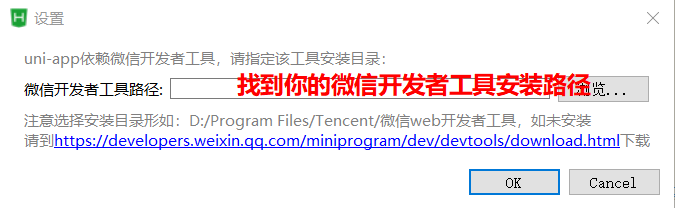

      2. 微信开发者工具打开服务端口

         1. 设置，安全设置（端口号是随机）

            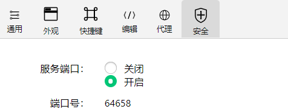


## uni-app的工程结构

[传送门](https://uniapp.dcloud.io/frame?id=%e7%9b%ae%e5%bd%95%e7%bb%93%e6%9e%84)

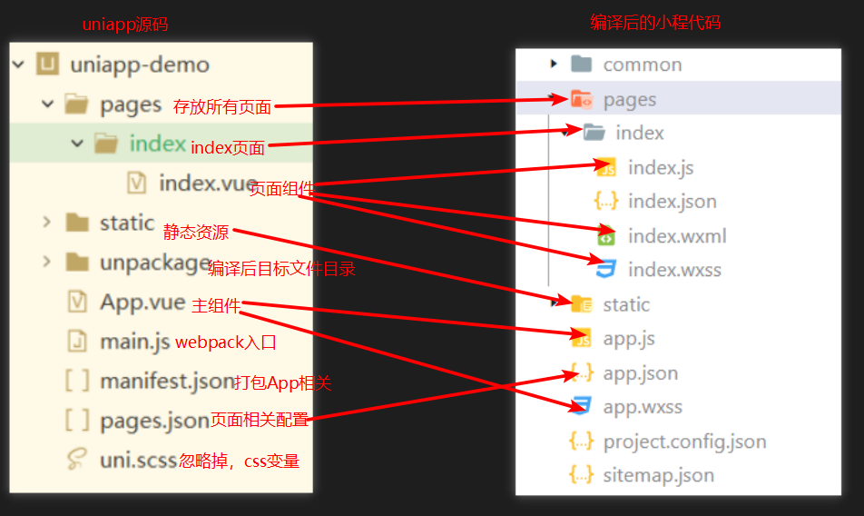

```
┌─components       存放组件位置   
│  └─comp.vue       其中一个组件
├─pages             存放所有页面 
│  ├─index			其中一个页面  
│  │  └─index.vue   页面结构样式和逻辑 
│  └─list           另一个页面
│     └─list.vue        
├─static             静态资源
├─main.js            webpack入口
├─App.vue              主组件，会编译小程序的app.js和app.wxss
├─manifest.json      打包App相关配置，包括小程序的appid
├─pages.json        页面相关配置
└─uni.scss           忽略掉，scss变量声明
```

1. pages.json文件

   ```json
   "pages": [ //所有页面路径和页面配置的数组
       {
           "path": "pages/index/index",//页面路径
           "style": {//页面配置
               "navigationBarTitleText": "uni-app"
           }
       }
   ],
   "globalStyle": { //全局的窗口样式，编译成小程序的app.json window对象
   
   }
   ```

2. main.js里面初始化主组件App.vue，同黑马头条一样的

3. App.vue 主组件，会编译小程序的app.js和app.wxss

#### 结论

uniapp项目结构是一个典型的vue脚手架4.x的项目，页面逻辑样式和结构在pages/**/*.vue，页面配置和页面路径在pages.json的pages数组里面。

## uni-app语法

[传送门](https://uniapp.dcloud.io/frame)

**uniapp完全可以使用vue.js语法，可以使用小程序组件和API，不能使用html标签**

1. 组件
   1. 在结构里面需要使用小程序组件
   2. 常用的组件
      1. view,image,text,navigator,input,button,picker,swiper
2. vue语法
   1. 完全可以使用vue语法
   2. 常见的语法：v-model,v-for,方法中this，事件注册
3. 样式
   1. px单位和rpx都可以使用
4. api
   1. 所有小程序的wx对象的方法，换成uni对象的方法

#### 注意点：

1. uniapp需要兼容8端，所以兼容性问题处理会很麻烦，所以一定要按照规范来写
   1. 不能使用img，ul,li
2. 可以使用vant插件？
   1. 也可以源码copy
   2. uniapp不建议使用vant插件
      1. vant兼容性方面可能会有问题
      2. 有一些uniapp组件其实是原生提供，性能会好一些. vant就做不到。


## 优购案例-项目准备

1. 创建工程

   1. 新建uniapp项目，名称`uni-yougou49`

      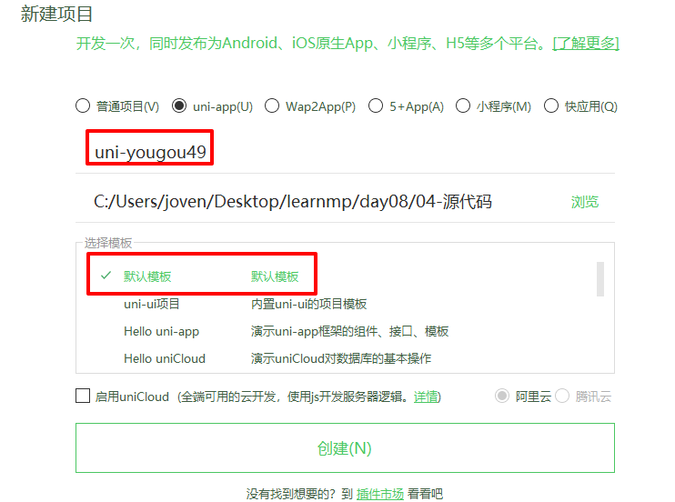

2. 推送到码云

   1. 码云上新建项目

      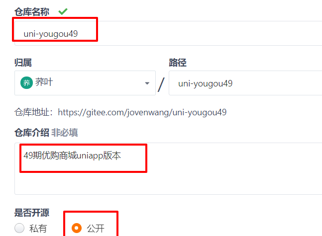

   2. 按提示推送本地新建项目到远端

      ```bash
      #去到uni-yougou49项目目录下
      git init #初始化本地仓库
      git add . #添加当前目录所有的文件到暂存区
      git commit -m "first commit" #提交
      git remote add origin git@gitee.com:jovenwang/uni-yougou49.git #添加远端git服务器地址
      git push -u origin master #在远端创建master分支，并推送本地master到远端master分支
      ```

      

3. 本地创建开发分支`dev_joven_2020531`

   ```bash
   git checkout -b dev_joven_2020531 #创建并切换到分支
   git push -u origin dev_joven_2020531 #在远端创建dev_joven_2020531分支，并推送本地dev_joven_2020531分支到远端dev_joven_2020531分支
   ```

   1. vscode里面操作

      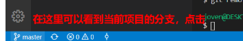

      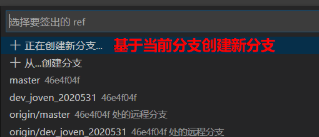

      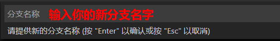

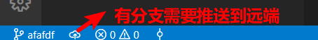


#### 注意点

1. vscode的状态栏git

   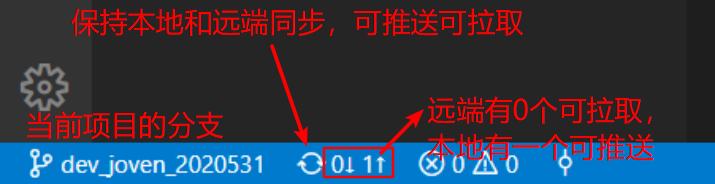

2. 修改git远端URL

   ```bash
   git remote set-url origin 新的git远端URL
   ```

   

## 优购案例-tarBar设置-练习


#### 步骤

1. 先把tab图标copy（把静态资源全部copy）到static目录
   1. 删除static/logo.png
2. 新建四个页面home,category,cart,me
   1. copy改，添加路径
3. 配置tab栏，首页和分类
   1. copy uniapp文档tabbar示例代码，改
   2. 先保证首页和分类文字显示，可以切换
   3. 配置图标

4. 复制首页和分类配置，完成其他两个页面
5. 全局配置
   1. 导航栏标题设置为"优购"
   2. 前景色和背景色

#### 练习说明：

1. 模拟器显示比例缩小时，导航栏可能会有白色的线，但是手机没有问题，忽略掉

   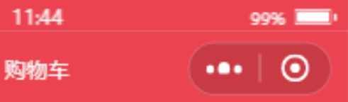

2. 建议大家新建项目用hbuilder，不要用vuecli方式

3. 可以添加`.gitignore`文件来忽略unpackage目录的改动

   1. 找到黑马头条项目目录下的.gitingore文件, copy到当前项目目录下

   2. 然后打开.gitignore文件，添加`unpackage`

      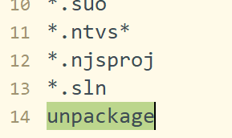


## 优购案例-首页


#### 01.页面分析

1. 入口: 打开应用首页，点击tab栏首页，显示首页
2. 主要模块：搜索热区，轮播图，导航栏，楼层
3. 其他说明
   1. 搜索热区并不能点击，没有输入框
   2. 楼层有好几层，具体看接口
   3. 首页点击商品，不会跳转

#### 02.静态页面

1. 安装less

   1. hbuilder, 工具, 插件安装，找到less点击安装即可
   2. 页面style里面就可以声明lang="less"，可以使用了

2. 搜索热区

   1. Icon组件的使用。它的颜色是作为属性的

      ```html
      <icon type="search" size="16" color="#bbb"></icon>
      ```

3. 轮播图

   1. swiper的属性和微信小程序一致
   2. copy示例代码，改

4. 导航区

   1. flex主轴排列

      1. space-between，元素之间留空，space大小一样
      2. space-evenly, 元素左右留空，space大小一样
      3. space-around, 元素左右留空而且space是相加

      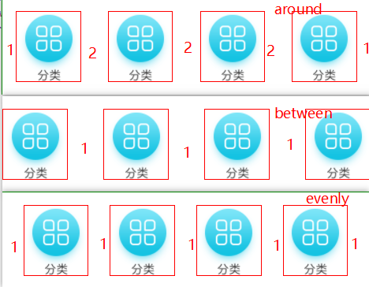

5. 楼层

   1. flex布局
   2. css`>`表示子元素
   3. image是行内块级元素，排列时候会有缝隙，怎么解决
      1. flex布局
      2. 父元素设置font-size:0

#### 注意点

1. 如果用命令行创建uniapp，需要npm install。
2. 如果需要安装loader去webpack官网找。如果想装npm包，去该npm包对应官网找。


#### 03.请求数据&渲染数据

1. 请求轮播图数据并渲染

   1. 接口 url  https://www.uinav.com/api/public/v1/home/swiperdata 
   2. 什么时候发请求? onLoad

2. 导航和楼层的渲染

   1. onLoad时发请求

   2. vfor渲染页面即可

   3. product-list右侧4张图片渲染

      1. 如果把v-if换成v-show, v-show也会渲染，效率不高
      2. vue官方有建议不要把v-if和v-for放在同一标签
         1. 官方考虑是减少遍历次数，渲染dom数量
         2. 当前情况，如果声明计算属性的话，会先遍历一次。而且多渲染一个dom而已。所以使用block避免v-for和v-if放在同一标签即可

      ```html
      <!-- 第一张不渲染-->
      <!--
      <image v-if="index" v-for="(item,index) in floor.product_list" :key="index" 
      						:src="item.image_src"></image>
      -->
      <block v-for="(item,index) in floor.product_list" :key="index">
          <image v-if="index" :src="item.image_src"></image>
      </block>
      ```

#### 注意点

1. vfor的key值什么时候需要给，给什么呢？
   1.   **如果明确知道该列表是静态，或者不必关注其顺序，可以选择忽略** ，**或者是给index让它不警告**
   2. **如果列表是动态，中间插入一项，顺序反转，需要给唯一标识的key值**
   3. 并不是key值给唯一标识性能最好。


#### 04.uni.request封装

1. 在home.vue抽取一个公共的请求方法request

   1. 需要保证可以被调用，比如getFloordata
      1. getFloordata里面逻辑copy
      2. 原有getFloordata方法里调用request

2. url不能写死

   1. 调用时传对象
   2. 声明request获取options形参

3. 请求成功后，数据需要在调用的地方获取

   1. callback（x）
   2. promise

4. 使用async和await

5. 希望这个方法可以给所有页面使用，必须使用模块化

   1. 在request方法放在utils/request.js文件里面，export
   2. 需要使用地方 import 

6. 提取一个基地址

7. 能否全局引入

   1. 尽早地把$request添加到Vue原型
      1. main.js
   2. 其他页面就可以this.$request

   ```js
   // 引入request
   import request from '@/utils/request'
   // 把$request添加为vue原型
   Vue.prototype.$request = request
   ```

8. 请求开启时添加loading，请求结束后关闭loading
   1. 请求开启：uni.request之前
   2. 请求结束：complete成功者失败都会进入
9. home.vue文件里面，其他两个请求改用request

#### 注意点：

1. Vue原型上的方法，实例可以访问
2. 如果修改main.js文件，也就是说修改webpack入口，需要重启webpack才会生效

## 优购案例-分类


#### 01.页面分析

1. 入口: tabbar点击分类，显示分类页面
2. 主要模块：搜索热区，还有左侧一级分类，右侧二级和三级分类
3. 其他说明
   1. 点击一级分类，切换二级和三级分类的内容
   2. 左侧和右侧分别滚动

#### 02.静态页面

1. 搜索热区抽取为一个组件
   1. 在components/SearchLink.vue，copy首页的搜索热区的结构和样式
   2. 首页引入组件，注册，使用
   3. 分类引入组件，注册，使用

#### 注意点

## 总结

1. uniapp工程

   1. 基本上和vuecli4.x类似，源码最终编译成小程序

      1. 页面pages/**/*.vue这个会编译成页面的结构样式和逻辑

      2. 页面配置和页面路径配置pages.json

         ```js
         "pages": [ //所有页面路径和页面配置的数组
             {
                 "path": "pages/index/index",//页面路径
                 "style": {//页面配置
                     "navigationBarTitleText": "uni-app"
                 }
             }
         ],
         "globalStyle": { //全局的窗口样式，编译成小程序的app.json window对象
         
         }
         ```

   2. uniapp语法
      1. 完全可以使用vue.js语法，也可以使用小程序的组件和api，不能使用html标签
   3. tabBar配置
      1. uniapp很多属性名也和小程序完全一致
   4. vue vfor的key值
      1. 如果渲染的列表是静态的话，key值给index, 让它不警告。没必要给唯一标识
      2. 如果渲染的列表是动态的话，key值必须要给唯一标识
   5. vfor和v-if尽量不要放在同一标签
      1. 官方推荐用计算属性
      2. 是否计算属性效率更高，需要看实际的情况
   6. uni.request封装
      1. 提取一个公共的请求方法
      2. 这个方法最好得返回promise
      3. async和await优化
      4. 其他页面想访问呢，模块化
      5. 每个页面都需要引入request.js
         1. 在main.js把$request添加到Vue原型属性
         2. 其他页面就可以this.$request
      6. 抽取基地址
      7. loading
   7. 分类页面
      1. 抽取组件SearchLink.vue

## 作业：

1. 所有同学的码云地址，麻烦班长和各位组长

2. 优购商城首页

3. uni.request封装

4. 分类页面（可选）

   1. 分类页面怎么做到左右两侧分别滚动
   2. 拿到数据，如何渲染

   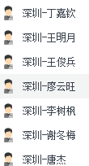

