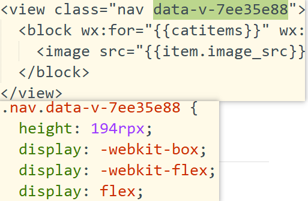
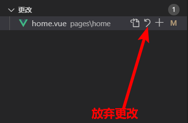
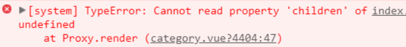
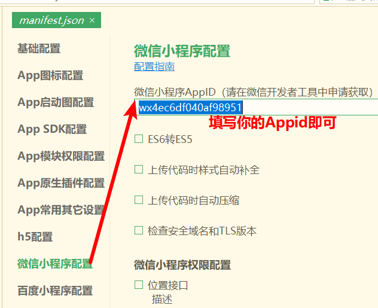
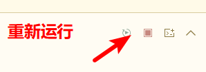
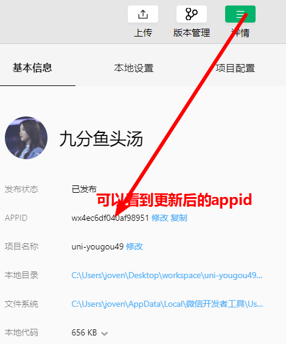

# 微信小程序学习第9天

## 每日反馈

1. 面试问到怎么兼容安卓和ios，老师可以说下大概怎么处理？
   1. 自适应
      1. 概念：让我们页面在不同尺寸的设备上显示OK
      2. 如何自适应
         1. 小程序：rpx自适应
         2. H5, 混合模式App（iOS和安卓）自适应方案：**flexible.js+rem**
   2. API使用上遵从规范
      1. uniapp不要ul,li,img，标签闭合
      2. uniapp引入全局样式，在App.vue引入
   3. caniuse上检查兼容性
      1. 遇到项目想引入新的api，或才css属性的话，去caniuse查一下兼容性
      2. 需要对照页面需要兼容设备
   4. 测试
      1. 一定需要真机测试
      2. 重点测试以下设备
         1. ios
            1. iphone X，iphone5,iphon4s
            2. 系统版本: iOS10.2, 最新iOS版本
         2. 安卓
            1. mix2s全面屏，vivo，oppo,华为，小米
         3. 微信浏览器
         4. 手机浏览器测试
   5. 其他
      1. 日期格式，如果格式'2020-5-23', 在iOS是无法解析为Date类型。所以统一把日期字符串-改成/
      2. webpack会对css属性自动加上前缀，兼容更好
      3. webpack对es6语法转es5, 但是部分js新语法并不转，需要babel-polyfill
   
2. icon的size单位是px

   1. icon的确不能自适应
   2. 大家可以用iconfont

3. unpackage/dist是webpack根据源码编译输出目录

   1. 这个目录只能读，不要改
   2. 如果删除dist目录，那么重新运行到微信开发者工具又会生成

4. 很不习惯,感觉uni就是个大杂烩,又是vue的语法,又是微信的API,又是换了不熟悉的HB开发工具, 一关页面习惯性跑去打开VScode.还有,老师说的,写的时候看看小程序文档,再看看uni文档,感觉好麻烦,单一个小程序的文档已经很销魂了,此刻想念饿了么的文档, 清晰明了

   1. 什么才是本质，数据驱动视图原理

   2. 大家可以vscode开发，推荐插件

      

      

   3. 大家可以直接看uniapp文档

5. 我突然发现，请求方法封装和渲染页面都会，但是页面布局都还给绿群和文美老师他们了。。。老师，这个一般公司有没有那种专门写布局的实习生帮忙啊QAQ

   1. 写静态页面是前端基本功，还包括切图
   2. 切图，慕课网上有视频

>  移动端项目: 面向用户的，所以界面美观度还有响应速度，还是bug要求都比后台管理系统


## 回顾

1. uniapp工程结构
   1. 首先它工程结构和vue-cli4.x生成项目结构很类似
   2. `pages/**/*.vue`表示页面结构样式和逻辑
   3. pages.json属性pages:包括所有页面的路径，还有页面配置
2. uniapp语法
   1. 完全可以使用vue.js，还有小程序组件和api，不能使用html
3. vue vfor的key值
   1. 列表渲染如果是动态的话，就需要给唯一的标识
   2. 否则的话，可以不给;或者给index防止报错
4. uni.request封装
   1. 提供一个公共的请求方法
   2. 方法需要所有的页面都可以访问
      1. $request添加为Vue原型的属性
      2. 其他页面上就可以this.$request
      3. promise,aysnc。。。
      4. 设置基地址

> 难度排序：  移动端>pc端 >小程序


## 作业检查

作业内容：首页和uni.request的封装

1. 谢冬梅  https://gitee.com/xieisabella/uni-yougou49xie/tree/dev_isabellaxie_0522/ 
   1. vfor嵌套能用同名的索引名吗？可能会导致错误
   2. title的拼写
2. 李树枫  https://gitee.com/li-zimu/yougou-sc/tree/yougou/ 
   1. 有注释
   2. less的使用错误，css嵌套层级不要超过3层
      1. 否则会造成浏览器的解析压力
      2.  **三层选择器就已经够用了：模块 - 子模块 - 子元素** 
3. 王明月  https://gitee.com/wmylxf/uni-shoping/tree/my_uniapp 
   1. components不能放在pages里面
   2. [代码规范](https://github.com/AlloyTeam/CodeGuide)
      1. class属性是给css使用，命名中划线 product-list
      2. id属性给js使用,命令驼峰 productList
      3. 文件名如何命名: 一般下划线


## style要不要加scoped

1. scoped可以把样式限定在组件内，如何做到的？

   1. 在结构上类名上加一个唯一class名

   2. css类名也加一个唯一class名

      

2. **uniapp页面style要不要加scoped? 无须加scoped**

   1. 如果加了scoped，page的样式会错误 
      1. 因为scoped无法对page作用
   2. uniapp页面是独立，相互之间样式不会影响

3. **uniapp组件的style要不要加scoped？需要加**

   1. 官方说法：非H5端默认并未启用 scoped，如需要隔离组件样式可以在 style 标签增加 scoped 属性，H5端为了隔离页面间的样式默认启用了 scoped 
   2. 微信开发者工具模拟器，如果子组件不能scoped的话，会影响父组件的样式。



## 分类页面

#### 02.静态页面

 1. 左侧结构

     1. 选中的样式，用了伪元素

        ```css
        &.active{
            position: relative;
            &::before{
                position: absolute;
                content: '';
                width: 8rpx;
                height: 60rpx;
                background-color: #eb4450;
                left:0;
                top:20rpx;
            }
        }
        ```

 2. **左侧如何单独滚动呢**？

     1. DOM高度必须是固定的？？

         1. 设置父元素content占满屏幕剩下的距离

            ```css
            position: absolute;
            left: 0;
            right: 0;
            top: 100rpx;
            bottom: 0;
            ```

    2. 设置left overflow:scroll

	3.  右侧静态页面

     	1.  flex左右布局，如果左侧有宽度，右侧希望占满剩下的宽度，一定要给flex:1
     	2.  右侧包括了二级分类和三级分类，可以利用class名来区别dom是干什么

#### 03.获取数据&渲染数据

 	1. 一级分类点击选中
      	1. 点击时，记住点击元素的下标activeIndex
      	2. 决定一级分类是否添加.active类名, 可以判断当前元素下标是否为activeIndex相等
 	2. 尽早发请求
      	1. 请求方法getCategories
 	3. 先渲染左侧一级分类
 	4. **如何渲染二级分类？？**
      	1. 二级分类数据来自于 `当前选中的一级分类.children `
           	1. `categoryList[activeIndex].children`

#### 04.当请求的数据没有回来之前，不渲染页面

现象？

1. 运行内置浏览器时发现错误

   

原因?

1. categoryList[activeIndex]是undefined
2.  **页面加载还没有获取到数据,渲染页面错误**

**解决方案?**

1.  nextTick(x)
2. 判断categoryList[activeIndex]有数据,在渲染children
   1. v-show, 依然会渲染，只不过隐藏
   2. v-if 条件为false不会渲染

#### 注意点：

1. **某DOM滚动的条件**

   1. 内容高度大于DOM的高度
      1. DOM高度必须是固定的
   2. DOM设置overflow:scroll或者auto
   
2. uniapp第一个bug，**注册事件不要在行内写逻辑，直接声明为方法即可**

3. 什么时候必须使用v-if而不能使用v-show

   1. **典型的应用场景：请求没有回来之前渲染页面报错**

4. uniapp对v-show支持不好,bug

   1. [传送门](https://ask.dcloud.net.cn/question/75176)

5.  右边内容滚动了 左边切换分类 滚动没有回到顶部

   1. 右侧用scroll-view

      ```html
       <scroll-view :scroll-top="scrollTop">
      ```

6. web-view就是小程序提供的浏览器组件，自动铺满全屏，宽度和高度还有位置无法调整

   1. 在企业里面使用时，只有无须交互的页面用web-view
      1. 比如 协议页面

7. 接口优化

   1. 一般实际项目里面，分类页面会拆分接口


## 下拉刷新

[传送门](https://developers.weixin.qq.com/miniprogram/dev/reference/configuration/page.html)

概念：在分页场景里面，下拉在页面顶部开启动画，并清除之前分页数据，加载第一页面

如何使用？

配置即可

1. 开启下拉

   ```json
   {
     "enablePullDownRefresh":true, //开启下拉
     "backgroundColor":"green", //可选，窗口的颜色，下拉背后的颜色
     "backgroundTextStyle":"dark"//可选,下拉loading的颜色，默认是light
   }
   ```

2. 下拉会触发`Page.onPullDownRefresh`

   1. 实际项目中，在这个方法里面一般清除分页数据，加载第一个页面数据

## 上拉加载更多

[传送门](https://developers.weixin.qq.com/miniprogram/dev/reference/configuration/page.html)

概念：分页场景里面，上拉时，加载下一页数据

如何使用？

配置即可

1. 开启上拉

   ```json
   "onReachBottomDistance":50 #默认值是50
   ```

2. 上拉会触发方法`Page.onReachBottom`
   1. 一般在分页场景，在这个方法里面，加载下一页数据

#### 注意点：

1. 上拉触发条件
   1. 必须有滚动
   2. 内容底部位置-页面位置==50会触发onReachBottom

## 下拉上拉-综合案例

参考<https://dev.dcloud.net.cn/mui/>

案例要求：一页展示十条，上拉加载十条数据，下拉刷新显示第一页数据


步骤：

1. 在页面配置开启上拉和下拉

   ```json
   {
     "enablePullDownRefresh":true,
     "backgroundColor":"green",
     "backgroundTextStyle":"dark",
     "onReachBottomDistance":50
   }
   ```

2. 页面结构与样式

3. 一页展示10条，在data属性里面声明arr:[1~10]

   1. 需要10条数据列表触发上拉加载，必须要有滚动条，微调每一条数据的高度

4. 上拉加载

   1. 塞十条数据，追加数据

5. 下拉刷新

   1. 直接把data设置十条数据

   2. 主动停止下拉刷新动画

      ```js
      // 主动停止动画
      wx.stopPullDownRefresh()
      ```

#### 注意点：

1. 上拉加载和下拉刷新的配置只限页面配置


## 优购案例-搜索列表


#### 01.页面分析

1. 入口: 三级分类点击跳转到搜索列表
2. 主要模块：搜索框，过滤栏，商品列表
3. 其他说明
   1. 三级分类点击跳转到搜索列表，搜索框关键字应该三级分类名字，按三级分类名字搜索
   2. 搜索框输入关键字，键盘右下角按钮，触发搜索
   3. 销合销量和价格没有接口，完成点击选中即可
   4. 商品列表可以上拉加载和下拉刷新

#### 02.静态页面

1. copy页面并在pages.json里面添加页面路径和导航标题

2. App.vue样式也需要copy

   ```css
   page{
       color:#333;
   }
   .text-line2{
       overflow: hidden;
       text-overflow: ellipsis;
       display: -webkit-box;
       -webkit-line-clamp: 2;
       -webkit-box-orient: vertical;
   }
   ```

#### 03.请求数据&渲染数据

 	1. 过滤栏菜单点击选中
      	1. 菜单数组去渲染菜单
      	2. 点击某个菜单，记下它的位置activeIndex
      	3. 菜单选中的样式，由activeIndex===index
 	2. 点击三级分类跳转到搜索列表页面
      	1. 点击@click: toSearchList
      	2. toSearchList，跳转页面uni.navigateTo
 	3. 跳转到搜索列表页面，传递什么参数呢？？
      	1. 分析接口
           	1. url
           	2. 传参
                	1. query 关键字
                	2. pagenum页码从1开始
                	3. pagesize,页容量，每一页数据条数是一样，这个变量应该是常量
      	2. 所以应该传三级分类名字
      	3. 步骤
           	1. 跳转页面在url上传
           	2. 在模拟器页面参数上确认参数传了
           	3. 在搜索列表页面onLoad来获取
 	4. 请求数据&渲染页面
     1. 添加编译模式的启动参数
     2. 在onLoad拿到关键词后发请求queryGoodsList
     3. 声明data属性goodsList
	5. 分类跳转过来，三级分类名字设置到搜索框
    	1. 搜索框输入框应该和data属性绑定，属性名keyword

6. 输入框触发搜索，按照输入框的值去搜索
   1. confirm-type设置键盘右下角按钮文字 
   2. @confirm事件触发搜索queryGoodsList
      1. queryGoodsList就是按data.keyword进行搜索

#### 04.下拉刷新

1. 开启下拉

   ```json
   "enablePullDownRefresh":true
   ```

2. 触发函数 onPullDownRefresh ，在函数加载第一页

3. 下拉刷新需要清空前面数据

   ```js
   this.pageNum = 1 //第一页
   this.goodsList = [] //把历史数据清空，只展示第一页数据
   ```

#### 05.上拉加载更多

1. 开启上拉

   ```json
   "onReachBottomDistance":50
   ```

2. 触发函数  onReachBottom ，在函数加载下一页数据

   1. 页码+1

   2. queryGoodsList

   3. 下一页数据应该追加

      ```js
      this.goodsList = [...this.goodsList, ...data.goods]
      ```

#### 练习说明：

1. 修改manifest.json文件，更新微信开发者工具里面的AppID

   1. 打开manifest.json，填写appid

      

   2. 重新运行

      

   3. 在微信开发者工具里面可以看到真实的appid

      

2. 从分类页面点击三级分类传递三级分类名字乱了？？

   1. 原因：vfor双层嵌套，索引别名相同
      1. 当我们点击三级分类的第3个时，其实它取的是二级分类的第3个里面三级分类里面第3天
   2. 解决方案：
      1. vfor双层嵌套不要索引同名

3. copy字符串注意空格

4. 同样需要配置合法域名

5. 微信开发者工具模拟器的输入框可能无法输入中文，手机微信里面运行没有问题，所以忽略掉

## 总结

1. style要不要加scoped

   1. 页面无须加
      1. 页面是相互独立
   2. 组件需要加scoped

2. 分类页面

   1. 左右分别滚动

      1. 左右两侧高度固定，占满屏幕剩下高度，所以它的父元素高度固定

         ```
         postion:absolute;
         top:100rpx;
         left:0;
         right:0;
         bototm:0;
         ```

      2. 左右两侧设置overflow:scroll/auto

   2. 右侧渲染，它的数据是选中的一级分类的children

      1. `categoryList[activeIndex].children`

   3. 数据回来前，不渲染页面

      1. v-if判断
      2. v-show不适合，依然渲染

   4. 下拉刷新，上拉加载

      1. 都是配置的

   5. 搜索列表页面

      1. 可能有前面的逻辑影响后面的逻辑

## 作业

1. 分类页面
2. **搜索列表页面展示搜索商品列表**
   1. TODO: 如果已经拉到最后一页，不想发请求？？
