# 微信小程序学习第11天

## 每日反馈

1. git插件安装推荐

   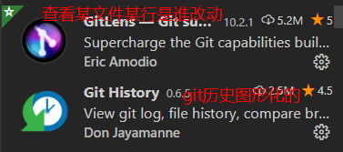

2. git pull与本地改动
   1. 本地工作区有改动，远端有更新

      1. *表示工作区有改动

      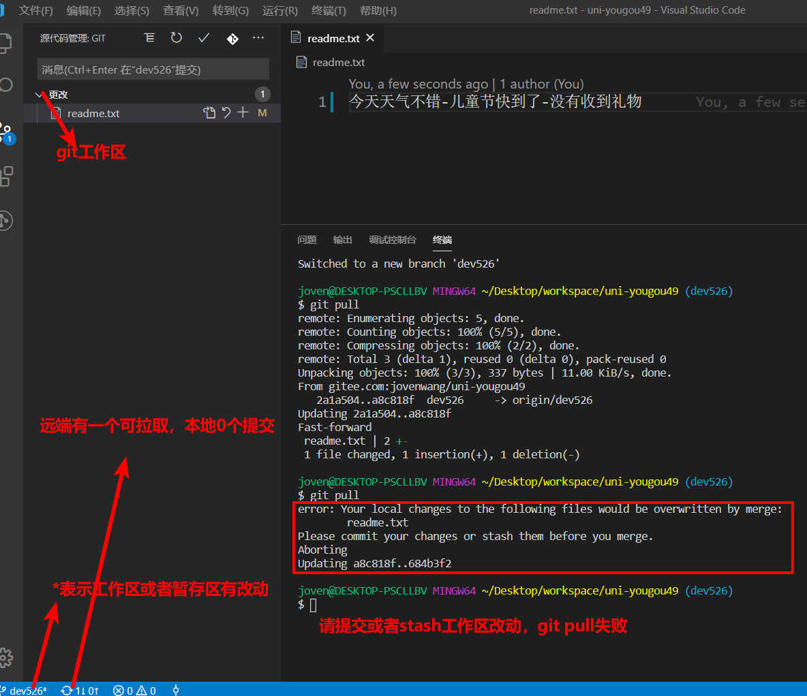

   2. 暂存区有改动，远端有更新时

      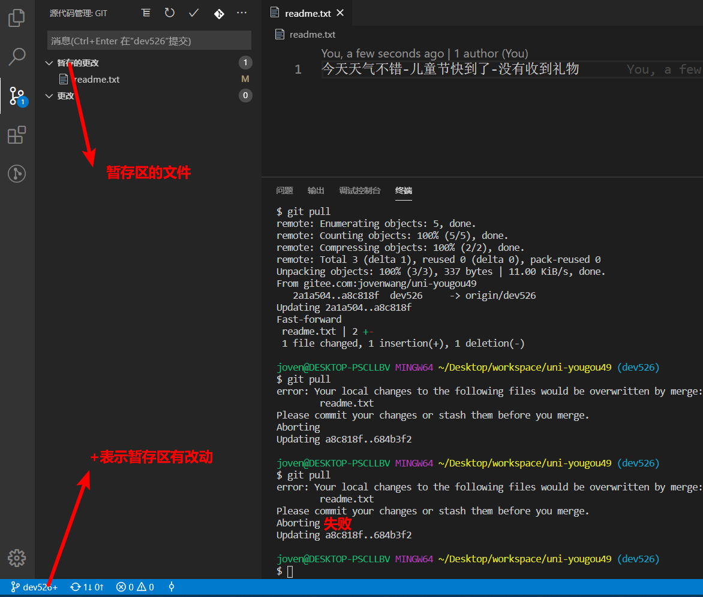

   3. 本地有提交，远端有更新时

      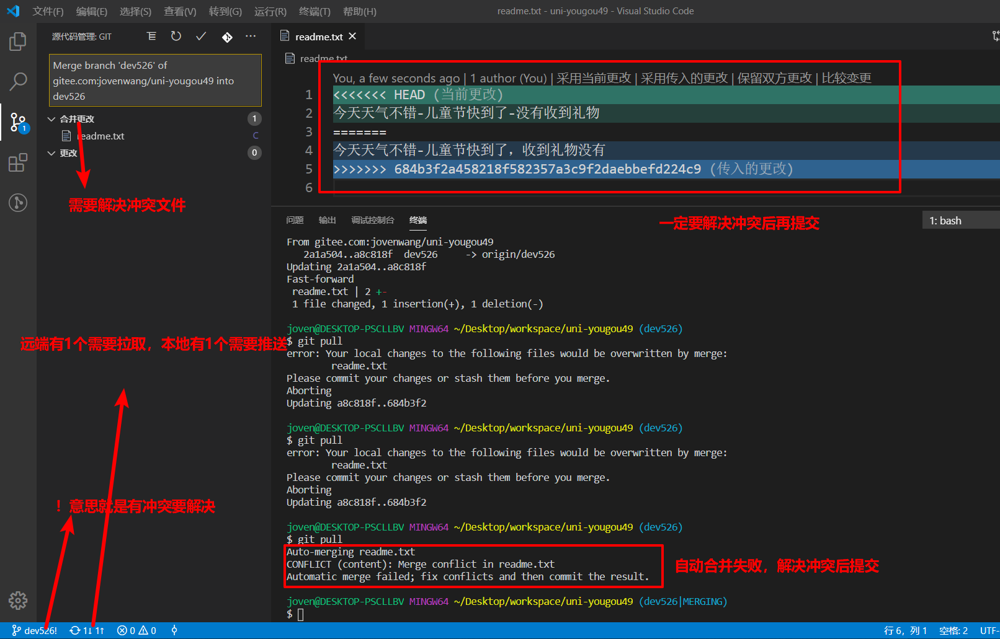

3. 如何解决git冲突

   1. 什么时候会产生git冲突

      1. 远端有更新，本地有提交，改动同一文件，当git pull
      2. 在执行git merge时，当前分支有提交，合并分支有更新时，如果改动是同一文件

      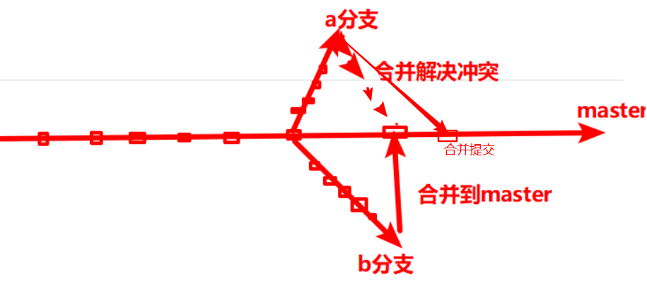

   2. 原则：冲突是无法避免，但是要能解决好冲突

      1. 一般来说分支开发完后，再merge master，如果有冲突解决冲突。不用说上班前Pull，下拉前push
      2. 什么一定需要pull
         1. 基于当前分支新建分支 git branch

   3. 如何解决冲突呢?

      1. 解决方法，**解决完冲突，文件不能包含<<<<,====,>>>>**

         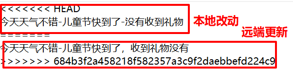

         1. 要不用本地改动
            1. 需要和远端更新的冲突的开发者去沟通，如果对方说他们是无效
         2. 要不用远端更新
            1. 自己拿主意觉得自己代码是无效
         3. 要不两者都保留
            1. 本地和远端都有效

      2. 解决完冲突后，相当于是工作区改动。git add .,git commit , git push

> git 工作流有好几种
>
> 一般公司的master是受保护的，只有高级程序员才有权限合并到master分支

**git冲突的解决，具体保留本地还是远端的，或者两者都需要，是需要和冲突对方进行沟通的。**

## git命令重现和解决冲突

思路：远端有更改，但是本地并没先Pull, 本地改动同一文件，git push有冲突

1. 远端由另一个同事推送一次

2. 本地不pull，改动后，提交，执行push会冲突

3. 冲突提示

   1. 推送失败
   2. 先git pull，解决完冲突后再push

   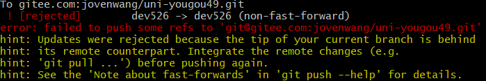

4. 执行pull

   1. 先解决冲突再提交

   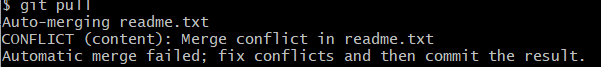

5. 解决冲突的现场

   

   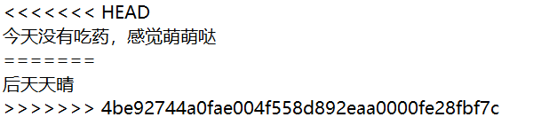

6. 比如我想保留两者

   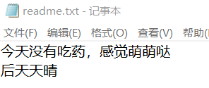

7. 正常的git操作，git add ., git commit, git push

## 回顾

1. 小程序的页面栈

   1. 概念：以栈的形式存放所有的具有返回关系页面

   2. 作用：方便我们理解小程序路由

   3. 举例：

      1. A打开B,B入栈，A会onHide，B初始化
      2. B返回A，B出栈，A会onShow，B销毁

   4. tab栏同一时间只有一个会入栈

   5. switchTab会让所有的非tab页出栈销毁

   6. getCurrentPages获取页面栈

   7. AppData可以看查看所有活动页面的data属性

      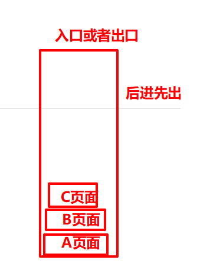

2. unipapp的生命周期

   1. App和页面的生命周期和小程序一致
   2. 组件的生命周期和Vue组件一致

3. 搜索列表页

   1. 上拉加载，数据是追加
   2. 搜索框回车，下拉刷新，清除列表数据，展示第一页数据
      1. goodsList清空
      2. pageNum=1
      3. isLastPage:false
      4. 发请求
   3. 如何判断是否是最后一页
      1. 商品列表长度===data.total


## 作业检查

1. https://gitee.com/liaoyq1115/my-uni-yougou/blob/YQ/pages/search_list/search_list.vue 
   1.  uni.stopPullDownRefresh( )请求结束后就停止Loading动画
2. https://gitee.com/weng9806/uni-yougou/blob/abc/pages/search_list/search_list.vue 
3. https://gitee.com/xiehuiyu/uni-yougou/blob/xhy/pages/search_list/search_list.vue 
   1. 在结构中使用变量，必须声明为data属性` parameter.query `
   2. 变量名驼峰


## 分享功能

[传送门](https://developers.weixin.qq.com/miniprogram/dev/framework/open-ability/share.html)

[onShareAppMessage](https://developers.weixin.qq.com/miniprogram/dev/reference/api/Page.html#onShareAppMessage-Object-object)

1. 页面内分享

   1. 发起分享

      ```html
      <button open-type="share"></button>
      ```

   2. 定制分享弹框

      ```js
      Page({
        onShareAppMessage: function () {
          return {
            title: '自定义转发标题',// 默认当前小程序名称
            path: '/page/user?id=123', //分享后用户点击去到小程序页面路径，默认为当前页面路径
            imageUrl:'自定义分享图片' //如果不设置的话，图片是随机
          }
        }
      })
      ```

      

2. 点右上角...弹框分享

   1. 只要有onShareAppMessage的声明，右上角转发就会生效


## 商品详情

1. uniapp使用iconfont的补充

   1. **需要在App.vue引入css**

      1. vuecli项目引入css有两种，效果是一样的

         1. main.js

            ```js
            import '@/css/iconfont.css'
            ```

         2. App.vue

            1. css语法的分号不能去掉

            ```css
            @import url("/css/iconfont.css");
            ```

      2. uniapp官方推荐在App.vue引入

   2. CDN

      1. 概念：内容分发网络，

      2. 作用：把我们服务器上静态资源，复制到它的全国各地各节点的服务器上，用户可以就近访问

      3. 特点：静态资源如果想更新的很麻烦，一般静态资源每次发布都发新文件dog_hash.png，CDN定时器清除没有人访问的资源。

         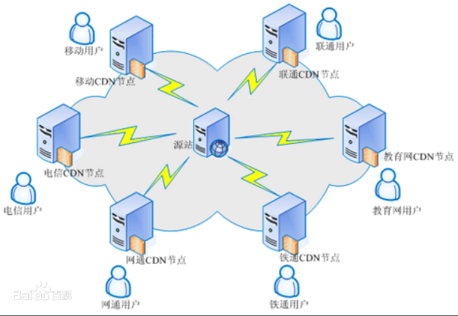

2. 搜索列表点击商品，传递goodsId,并跳转到商品详情页面

   1. 点击@click: toItem
   2. 跳转并传参uni.navigateTo
   3. 在页面参数确认传参了，然后添加编译模式，启动参数
   4. 在商品详情页面获取到传参onLoad

3. 发请求, 拿到数据作为data属性，渲染页面

   1. 获到传参后，再发请求
   2. 渲染轮播图，商品名称和价格

4. 轮播图预览图片

   1. wx.previewImage

      1. 概念：在新页面打开一组图片进行预览

      2. 使用

         1. uniapp API，current可以是数字

         ```js
         wx.previewImage({
           current: '', // 默认显示的图片链接
           urls: [] // 数组，包含图片链接
         })
         ```

   2. 步骤

      1. 点击轮播图 @click: prevImg

      2. prevImg里面调用uni.previewImage

         ```js
         uni.previewImage({
             // urls:urls//预览图片链接的数组
             urls,
             // current:urls[index] //不建议传默认图片url
             current: index
         })
         ```

      3. 扫码预览

5. 图文介绍和规格

   1. 规格没有接口数据

   2. 渲染图文介绍

      1. nodes属性可以传html string
      2. 也可以使用v-html, v-html还是会解析成rich-text。建议使用rich-text

      ```html
      <rich-text :nodes="goodsDetail.goods_introduce"></rich-text>
      ```

6. 分享的功能

   1. 声明分享，分享功能不能影响之前样式

      1. 绝对定位，透明

      ```html
      <button open-type="share">分享</button>
      ```

   2. 定制弹窗

      1. path默认当前页面，分享给别人后，我希望她打开时显示当前页面。所以path保持默认即可。

      ```js
      // 定制分享弹窗的内容
      onShareAppMessage() {
          return{
              title: this.goodsDetail.goods_name, //标题设置为当前商品名称 
              imageUrl:this.goodsDetail.pics[0].pics_big //图片设置为当前商品第一张图片
          }
      },
      ```

   3. 预览扫码，可以完成右上角转发，还是分享按钮的分享

7. 客服功能

   1. 声明客服功能的按钮

      1. 绝对定位和透明

      ```html
      <button open-type="contact"></button>
      ```

   2. TODO后端工作量：后台接入客服功能

#### 练习注意点

1. map会返回一个新数组,对原数组进行遍历,每一项执行指定函数,函数返回结果作为新数组的元素
   1.  使用场景：根据条件生成新数组map
2. debuger
   1. 使用：运行到debugger这个地方，相当于是给了断点，会停上来
   2. 场景：有时候浏览器源码被压缩了，给断点很难，就在源码里面给debugger
   3. 上线前一定要把debugger去掉
3. webp图片格式同样质量的图片会比jpg或者png更小
4. 图文介绍这块在ios显示是有问题的
   1. 原因是ios不支持webp格式
   2. TODO：需要把html string里面`.webp`去掉
      1. 声明计算属性，使用正则
5. 客服系统
   1. 概念：用户在前端想和公司沟通，公司派一些客服人员接入进行会话，用户比较多，会等待。
   2. 特点：是一个公司的基础需求，而且功能都差不多。所以公司买客服系统就行。
   3. 举例:53kf，腾讯云和阿里云都可以有客服系统服务
   4. 微信小程序的客服功能是需要后端接入的
6. rich-text应用
   1. 只能解析基本的标签，解析速度比浏览器组件要快
   2. 基本上所有商详图文介绍（小程序，混合模式的App），都是图片，然后用rich-text解析
7. 工作经验的分享
   1. 需求小程序和App都需要分享一张包括商品图片，价格，名称，优惠，小程序二维码组合成一张图片
   2. 方案：
      1. 老大方案：每次分享时，h5调用原生接口传参，生成这张图片
         1. 原生接口有开发量，需要发版
         2. 每次分享都需要调用接口，又慢又耗性能
      2. h5来做，canvas画这张图，然后导出Png即可
         1. 性能更差
      3. 在后台管理系统，添加商品生成shareImg字段，按第2种方案
         1. 无须每次分享时生成，效率更高
         2. 提前生成的，并不会让用户等待
8. canvas
   1. 需要稍微了解基本的api
   2. 我的应用经验：
      1. 雪花背景，copy已有的代码，看懂过后，调参数即可


## Vue组件通信

#### 01.父传子

**基本使用**

1. 父使用子组件地方声明属性

   ```html
   <child 属性名="不要早恋" />
   ```

2. 子组件声明相应的props，然后prop可以当然属性一样使用

   1. props声明属性名和步骤1时属性名一样

   ```html
   <script type="text/x-template" id="tpl">
   <div class="child">
       <h4>父对子说:{{msg}}</h4>
   </div>
   </script>
   <script>
       Vue.component('child', {
           template: '#tpl',
           props: ['属性名']
       })
   ```

**关于属性名的命名**

1. html里面传属性名建议用中划线分隔`parent-msg`，然后在子组件声明时可以驼峰
   1. 如果属性名是驼峰会被转成小写，因为HTML标签和属性名大小写不区分的
   2. vue内部帮我们转了
2. .vue文件里面属性名能否驼峰呢？
   1. 能的
   2. 因为.vue是由vue-loader解析


#### 02.父传子动态

 1. vue组件通信，应该**遵从单向数据流**

     1. 父传子可以，但是子改父不行

     2. 测试到情况：子如果改变父传过的props，是报错的

     3. 如果子想改prop

         	1. 子组件属性名读和改都不会影响父亲

        ```js
        data(){
            return{
                子组件属性名: this.父传子prop
            }
        }
        ```

	2. 如果像第1步这亲，遵从单向数据流的话，那么父传子动态，子无法感知，怎么解决

    1. 侦听prop的变化，有变化时设置子组件属性

       ```js
       watch:{ //侦听prop，或者属性
           prop名字(prop变化后的值){
               this.子组件属性名 = prop变化后的值
           }
       }
       ```

> 最终结果：父传子可以动态，但是子不能改prop


#### 03.子传父

**基本使用**

1. 子组件$emit事件，并传参

   ```js
   this.$emit('事件名',参数)
   ```

2. 父组件使用子组件地方，注册事件

   ```html
   <child @事件名="事件处理方法"/>
   ```

   ```js
    事件处理方法(data){
        console.log(data) //data就是父传子的参数
    }
   ```

> 事件名建议用中划线分隔

#### 注意点：

1. 父传子属性如果对象话，子改父prop也不会报错
   1. 建议还是遵从单向数据流
      1. data.属性名=克隆（props）
   2. 如果非要用的话，建议局部使用
2. 单向数据流和双向数据绑定
   1. 单向数据流是说父传子，子传父不允许
   2. 双向数据绑定v-model
      1. data=>结构
      2. 结构=>data


## 搜索列表-抽取头部输入框为单独的组件

1. copy静态页面SearchBar组件，并在搜索列表页面使用

   1. 父组件的样式影响到SearchBar组件，样式调整

2. 删除搜索列表原来的搜索框的样式

3. 在SearchBar.vue的input设置键盘右下角按钮文案 confirm-type="search"

4. 完善SearchBar的功能

   1. 搜索框有内容展示x按钮，没有内容就不展示x按钮
      1. 获取input框内容 v-model:inputVal
      2. v-show决定要不要显示x按钮
   2. 点击x按钮时清除input框的内容
      1. 点击@click: clearInput

5. SearchBar输入内容，点击键盘右下角按钮时，按输入内容进行搜索

   1. 子传父
      1. 子
      2. SearchBar点击键盘右下角按钮 @confirm: confirmHandler
      3. confirmHandler需要$emit事件，事件名@search，传参输入框的值
      4. 父
      5. 父使用子组件地方，注册@search: searchHandler
      6. 在事件处理方法里面，获取参输入框的值后搜索
   2. 当输入内容为空，没有必要搜索了
      1. 判断如果内容为空，return, 不emit事件

6. 从分类页面点击三级分类跳转到搜索列表页面，但是输入框并没有值

   1. 父传子
      1. 父使用子组件，传属性keyword
      2. 子里面声明props: keyword
   2. 子获取到的prop应该设置给它属性
      1. inputVal:keyword
   3. 以上两步后，输入框初始值依然是空的
      1. 原因：父组件获取传参时，子组件已经初始化了
      2. 如何解决
         1. 侦听子组件prop，有变化再设置给inputVal

   

#### 注意点：

1. 如果在工作中，对设计稿有异议，可以提前和设计师沟通
2. 绝对定位，left和right都有的话，left优先级比right更高一些

## 总结

1. 如何解决git冲突

   1. git冲突的可能性有很多，而且无法完全避免冲突
   2. 解决冲突
      1. 冲突文件处理<<<<，需要冲突另一方同事进行沟通，确定是保留自己的，还是对方的，还是两者
      2. git add, git commit,git push

2. 商品详情

   1. rich-text通常在商品详情里面用，主要是用来解决html string（image标签）

   2. 分享

      1. 页面内分享

         1. 发起分享

            ```html
            <button open-type="share">
                
            </button>
            ```

         2. 定制分享弹窗

            ```
            Page({
            	onShareAppMessage(){
            	return{
            		title, 
            		path
            		imageUrl
            	}
            	}
            })
            ```

            

      2. 右上角转发

         1. 也可以通过onShareAppMessage定制分享弹窗

   3. 父传子动态

      1. 遵从单向数据流

         ```js
         data(){
             return{
         		属性：this.prop  //在子组件可以自由地使用自己属性
             }
         }
         ```

      2. 当父传子动态时，子无法感知

         ```js
         watch:{
             prop(){
                 //prop有变化，会调用到这里.在这里把改变后的值设置给组件属性
             }
         }
         ```

   4. 搜索列表引入SearchBar
      1. 引用
      2. 调整样式
      3. SearchBar基本功能
      4. SearchBar回车，触发父组件按SearchBar输入内容搜索
         1. 子传父并传参
      5. SearchBar初始值
         1. 父传子
         2. 父获取传参前，子组件已经初始化
            1. 子组件需要监听props变化

## 作业

1. 商品详情
2. 搜索列表引入SearchBar组件

