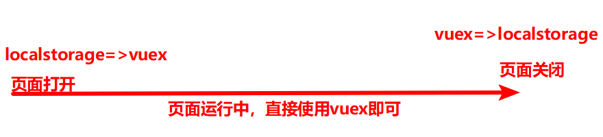
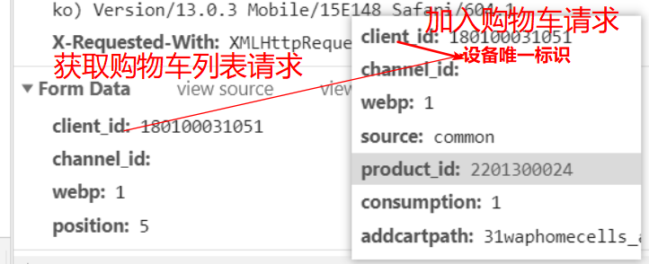

# 微信小程序学习第12天

## 每日反馈

1.  要找工作了，好慌啊，感觉学的好菜。。。要喝鸡汤 

   1. 大概在学完小程序后去找工作

   2. 工作内容：黑马面面（后台管理项目结构和黑马面面会很像的），黑马头条，优购商城

   3. 对于面试应该正确态度

      1. 面试本身就是有机会大佬交流
      2. 面试者一般会引导被面试者说自己会的，当然也知道你的边限
      3. 面试中如果有不会的，或者差不多会的，面试回来后针对性复习，学习效率
      4. 面试技巧：模拟现场，面试多加练习（可以找一些小公司刷经验）

   4. 结论：先总结一下写代码的bug如何解决，优化，相似知识对比总结，学完小程序，**去面试**

      

2. 这几天老师讲解的页面优化，工作经验分享，很好，很实用。可以总结一下命名规律吗，类名，属性名，方法名，什么时候用中线，下划线。大小驼峰。常量声明，大写，我们记住了。谢谢老师！！ 

   1. 原则：好的命名胜过很多行注释

      1. 尽量不要有拼音
      2. 英文单词不要拼写错误
      3. 如果有简写`confirm`=>`cfm`,需要积累，不关键。因为单词写长一点没有关系，因为webpack会压缩

   2. 单词之间如何连结

      1. 变量

         1. 常量：字母全大写，单词之间中划线分隔`BASE_URL` `PAGE_SIZE`
         2. 类名：首字母大写的驼峰
         3. 除此之外变量都是：首字母小写的驼峰
      4. 其他：
            1. 添加原型属性以`$`开头
         2. 私有变量以`_`开头
      
   2. html class： 单词小写中划线分隔 `user-name` `search-icon`
      
      1. class一般是给css用的
      
   3. html id：首字母小写的驼峰
      
      1. id只给js使用
      
      4. 文件命名
      
      1. 常见的,单词小写下划线分隔 `search_list`
         2. 在vue-cli的项目，组件的文件名，首字母大写的驼峰
      3. 具体看公司如何规范的
      
   5. 特殊文件夹命名
      
      1. 如果复数命名带`images` `pages`
      
   6. 其他
      
      1. vue通信
      
         1. html里面，父组件在使用子组件时，传属性，这个属性名需要 **单词小写中划线分隔**
      
               1. 映射是vue内部做的
      
                  ```html
               props: ['postTitle'],
                  <blog-post post-title="hello!"></blog-post>
                  ```
      
            2. html子传父，事件名 建议kebab-case 的事件名

3.  老师，能简单总结一下，token存到localStorage和存到vuex的逻辑吗？用过几遍了，也百度查了下，但是总感觉很迷，没什么思路一样，存取都是local那，存到vuex去干嘛？？？ 

   1. 具体的场景是啥？

   2. vuex是全局变量，关闭页面会丢失

      1. vuex有全局的state，而且改变state是有规范的mutations

   3. localStorage关闭页面存储还在

   4. 一般页面初始时localStorage=>vuex;页面关闭前vuex=>localStorage; 

      

4. watch

   1. deep:true，如果要侦听对象，而对象属性改变时，必须深度侦听
   2. immediate默认值是false，如果为true，侦听属性初始化时，也会触发handler
   3. 如果需要以上两个属性的话，无法用简写，侦听对象必须完整写法

   ```js
    // 侦听属性，计算属性，prop有变化，如果有变化就执行指定函数
   watch: {
       //简写
       // msg (newValue) {
       //   // newValue第一个形参，表示msg变化后的值
       //   console.log(newValue)
       // }
       // 完整写法
       msg: {
           //这个时候需要侦听属性是一个对象
           handler (newValue) {
               //侦听的属性有变化时会触发handler
               console.log(newValue)
           }
       },
           // 侦听person.name的变化
           // 'person.name':{
           //   handler(newName){
           //     console.log(newName)
           //   }
           // }
   
           person:{ //对象的属性有变化时，无法侦听到
               handler(newPerson){
                   console.log(newPerson)
               },
                   //深度侦听
                   deep:true,
                       immediate:true //侦听的属性初始时也会触发handler
           }
   }
   ```

   

5. debugger

   1. 概念：debugger当逻辑到这里时会停下来，相当是于断点
   2. 应用场景：有些时候不方便给断点，那么就可以在源码里面给debugger
   3. note: 最终上线源代码不能有debugger


## 回顾

1. 商详页面
   1. 点击轮播图在新页面中预览图片
   
      1. uni.previewImage
         1. urls 预览的图片数组
         2. current 默认预览的图片（第几张，图片链接）
   
   2. 图文介绍
   
      1. rich-text 富文本
      2. 能解析html string，只能包括基本的标签
   
   3. 分享
   
      1. 页面内转发
   
         1. 发起
   
            ```html
            <button open-type="share">
                
            </button>
            ```
   
         2. 定制弹窗
   
            ```js
            onShareAppMessage(){
            	return{
                    title:
                    path:
                    imageUrl
                }
            }
            ```
   
      2. 右上角转发
   
         1. onShareAppMessage
   
2. 搜索列表引入SearchBar组件

   1. 引入并使用
   2. 组件基本功能
      1. 有内容才展示x
      2. 点击x清除内容
   3. 输入框输入，回车，按输入框内容进行搜索
      1. 子传父
   4. 输入框初始值
      1. 父传子
      2. 父onLoad执行时机比子组件data函数晚
         1. 需要watch keyword的变化

## 作业

检查内容：商品详情及搜索列表使用SearchBar

1. https://gitee.com/wmylxf/uni-shoping/tree/my_uniapp
2. https://gitee.com/TheSacrificeOfXX/yougou/tree/xiexuan_2020%2F05%2F22/
   1. 赞
   2. `component`=>`components`
   3. cart才是表示购物车
   4. 用canvas生成分享图片
3. https://gitee.com/lu_zhiyi/uni-yougou/tree/dev_joven_2020531/
   1. search单词拼写错误，` serch `
4. https://gitee.com/superhero_movie/uni-yougou49/tree/yougou_1_1/
   1. 没推送代码？
5. https://gitee.com/small_whirlwind_01234/uni-shangcheng/tree/dev_guorong_20200601/ 


## 优购案例-搜索页面


#### 01.页面分析

1. 入口：首页或者分类点击搜索热区时跳转搜索页面
2. 主要模块
   1. 搜索框SearchBar组件
   2. 历史搜索
3. 其他说明
   1. 搜索框输入内容，回车，会跳转搜索列表页面，按输入框内容进行搜索展示列表。
   2. 第1步，同时会把搜索框输入的内容添加到历史搜索列表中
   3. 历史搜索需要存储在storage
   4. 点击历史搜索的某一项时，跳转搜索列表页面，按关键字进行搜索
   5. 第2步和第4步，关键字添加到历史搜索列表中，关键字加到前面，不能重复

#### 02.静态页面

1. copy
2. 在pages.json添加页面路径

#### 03.基本逻辑

1. 首页或者分类点击搜索热区时跳转搜索页面
   1. 在SearchLink.vue组件点击跳转
      1. 点击@click:toSearch
      2. 跳转uni.navigateTo
2. 搜索框输入内容，键盘右下角按钮点击，会跳转搜索列表页面，按输入框内容进行搜索展示列表
   1. 在页面使用SearchBar组件的标签上注册@search事件
      1. 跳转搜索列表页面toSearchList（）{uni.navigateTo}
      2. 跳转时需要传递catName
3. 先把历史搜索列表展示，历史搜索列表需要存储在storage
   1. 页面刚初始化时 storage=>data.属性，然后vfor展示
      1. 属性名：keywordList
      2. 读取storage： uni.getStorageSync
4. 第2步，需要同时把输入框内容添加到历史搜索列表，关键字加到前面，不能重复
   1. 相当于字符串加到数组里面，加到前面且不能重复
      1. 插入头部
         1. unshift插入到头部
         2. ...展开运算符[keyword,...arr]
      2. 去重
         1. [...new Set(arr)]
   2. 重启小程序，历史列表改变应该还存在
      1. 历史列表改变需要存储到storage
5. 优化：输入框输入关键字，先跳转返回搜索页面时才看到历史搜索头部插入关键字？？
   1. 跳转页面不改data.keywordList, 然后在onHide或者onShow时把storage同步给data.keywordList
      1. onShow是从别的页面返回搜索页面时触发，而且页面初始化也会触发
         1. onShow更好，两段逻辑可以统一放在onShow
      2. onHide搜索页面跳转到其他页面，搜索页面已经隐藏时才触发
6. 点击历史搜索的某一项时，跳转搜索列表页面，按关键字进行搜索
   1. 逻辑是否和toSearchList是一致？？
      1. 点击每一项@click:toSearchList
      2. 然后逐步分析，逻辑完全可以重用
7. 点x，弹框，确认后清除历史搜索列表
   1. 点击@click: clearHistoryList
   2. 弹框确认uni.showModal
   3. 清除历史搜索列表
      1. data.属性
      2. 清除storage
         1. uni.removeStorageSync??


#### 注意点

1. `wx.getStorageSync('不存在key')`返回值是空字符串

2. 初始变量一定要给初始值, 或者默认值

   ```js
   keywordList:uni.getStorageSync(KEYWORD_LIST)||[]
   ```

3. 工作中setTimeout的使用，一般setTimeout0，表示在同步代码后执行。setimeout定时除了0以外的都是垃圾代码

   1. setTimeout涉及到知识是事件循环(event loop)

4. `wx.navigateTo`的success是指开始跳转，并是跳转到目标页面后

5. 界面的变化是data.属性的改变，小程序重启后这个data.属性会丢失，所以我们需要借助storage存储。

   1. storage改变=>data.属性=>更新界面


## 计算属性setter-练习

[传送门](https://cn.vuejs.org/v2/guide/computed.html#%E8%AE%A1%E7%AE%97%E5%B1%9E%E6%80%A7%E7%9A%84-setter)

**回顾计算属性getter**

1. 概念：计算属性里面get方法

2. 使用

   1. 在结构中使用计算属性时，其实就是调用计算属性的get方法返回值

   ```js
   computed: {
       // 简写
       // fullName () {
       //   return this.firstName + ' ' + this.lastName
       // }
   
       // 完整写法
       fullName: {
           //fullName计算属性
           get () {
               //getter
               // 返回结果
               return this.firstName + ' ' + this.lastName
           }
       }
   }
   ```

1. 使用场景
   1. 在结构需要对data属性有复杂计算时，都应该声明为计算属性

**计算属性setter**

概念：计算属性里面set方法

使用

1. 计算属性有改变会触发set方法，一般在set方法改变计算属性的依赖

```js
// 完整写法
fullName: {
    //fullName计算属性
    get () {
        //getter
        // 返回结果
        return this.firstName + ' ' + this.lastName
    },
        // 当计算属性有改变时，就会触set方法。它的第一个形参就是改变后的值
        set (newValue) {
            // console.log(newValue)
            // 这个并没有改变app.fullName,如果想改变的话，必须改变它的依赖
            let arr = newValue.split(' ')
            this.firstName = arr[0]
            this.lastName = arr[1]
        }
}
```

应用场景

1. 全选逻辑

#### 注意点：

1. 计算属性和data属性不一样，后者可以直接设置来改变属性，计算属性设置新的值只会触发它的set

#### 

## 优购案例-购物车


#### 01.页面分析

1. 入口: 点击tab栏购物车会显示购物车页面; 商品详情点击购物车也会跳转到购物车页面
2.  主要模块：商品列表，全选，总价格，总数量
3. 其他说明
   1. 收货地址不放在购物车页面，放在支付页面
   2. 商品列表每一项包括：选中状态，商品名称价格图片，还是数量，数量还可以更改
   3. 全选：如果所有商品都选中的话，全选icon选中; 点击全选，所有商品选中状态和全选同步
   4. 总数量：选中的商品数量之和
   5. 总价格：选中的商品的数量*商品价格之各

#### 02.购物车的数据的改变是发请求还是存本地，还是存Vuex?（补充）发请求

 1. 需求

     	1. 如果没有登录时添加商品到购物车，用户登录后该商品在购物车吗？有
     	2. 手机添加商品到购物车，打开电脑的浏览器该商品在购物车吗？有

 2. 对比以上三个方案

     1. 如果是存本地，需求1能满足，需求2不能满足

     2. 如果是存Vuex，需求1能满足，需求2不能满足

     3. 如果是发请求，2者都可以满足。以小米商城为例

        

#### 注意点：

1. 一般公司里面，请求响应时间在100ms以内

#### 03.静态页面

1. copy
2. iconfont引入
   1. 找到icon，加入购物车，生成新的.css文件
   2. copy内容更新项目里面iconfont.css
   3. 在cart页面使用iconfont

#### 04.请求数据&&渲染数据

1. 商品详情点击购物车，跳转购物车页面

   1. 点击@click:toCart
   2. 跳转uni.switchTab

2. 接口分析

   1. url /api/public/v1/goods/goodslist?goods_ids=140,395,701
      1. 购物车商品id以,分隔拼接为字符串作为goods_ids参数
   2. 返回数据是一个数组，数组每一项包括：商品价格名称和图片
   3. 商品id从哪里来呢？
      1. 在商品详情点击加入购物车，商品id存storage
   4. 结论：**商品价格名称图片是由接口返回，商品id、商品选中状态和数量存在storage**

3. 商品id、商品选中状态和数量存在storage,在storage的数据结构应该什么样子呢

   1. **数组方式特点有序的(应该用数组方式，因为要保证有序)**
   2. 对象方式无序，更方便判断某个key是否存在

   ```js
   #数组方式
   let cartArr=[
   	{
           goodsId:'701', #商品id
           checked:true, #商品选中状态
           num:1 #商品数量
       },
       ...
   ]
       
   #对象方式
   let cartObj={
       '701':{
       	checked:true, //商品选中状态
           num:1 //商品数量
       },
       '504':{
           checked:false, //商品选中状态
           num:10 //商品数量
       }
   } 
       
   ```

   

4. 商品详情点击加入购物车，包括更新商品选中状态及数量

   1. 分析商品选中状态和数量如何更新？
      1. 数量：首次添加数量1; 非首次添加数量++
      2. 商品选中状态呢？
         1. 如果在购物车里面去勾选商品，然后在商品再加入购物车，回到购物车，商品是勾选还是非勾选的呢？勾选
         2. 结论：只要添加购物车，选中状态都勾选的
      3. 总结论：**第一次添加，num:1,checked:true; 非首次添加num++,checkec:true**
   2. 步骤
      1. 点击加入购物车@click:add2Cart
      2. add2Cart逻辑
         1. 取storage，更新，再存storage

5. 如果加入购物车功能，storage存储数据结构用对象的话（了解）

   1. 判断是否是第一次添加

      ```js
      cart[goodsId]  //如果为undefined就是没有添加过，否则非首次
      ```


#### 注意点：

1. 如果前端需要列表，后端返回对象，对象是无序，不能够保证列表顺序。应该返回数组

## 总结

1. watch
   1. 如果侦听对象或者数组，需要深度侦听deep:true
2. debugger就是代码执行到debugger停下来，相当于这里打了一个断点
3. 搜索页面
   1. 输入框输入，回车，跳转搜索列表并按关键字进行搜索
   2. 关键字应该加入历史搜索头部，去重
      1. [keyword,...数组]
      2. [...new Set(新数组)]去重
   3. 历史搜索列表项点击时，逻辑和上边一致
   4. 清空历史搜索
4. 计算属性的setter
   1. 改变计算属性时，就会触发计算属性的set方法，一般在set方法把改变的值设置给计算属性的依赖
   2. 应用场景：全选逻辑
5. 购物车
   1. 商品详情购物车跳转
   2. 请求数据渲染列表
      1. 接口分析，返回数据只包括商品名称，价格还有图片
      2. 商品选中状态，数量，还是商品id都应该存在storage
      3. storage购物车数据结构
         1. 数组存对象，有序，判断是否是第一次添加麻烦
         2. 对象无序，是否是第一次添加简单
      4. 加入购物车的功能
         1. 商品选中状态始终为true, 数量首次1，非首次+1
         2. 步骤：取，更新，存

## 作业

1. 完成搜索页面

2. 完成商品详情加入购物车功能

   1. 对象方式（可选）
   2. 数组方式
   
   
