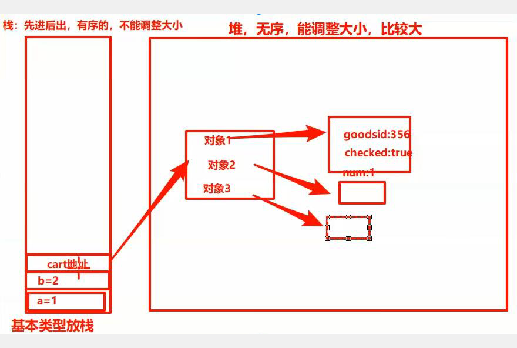
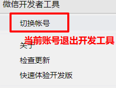
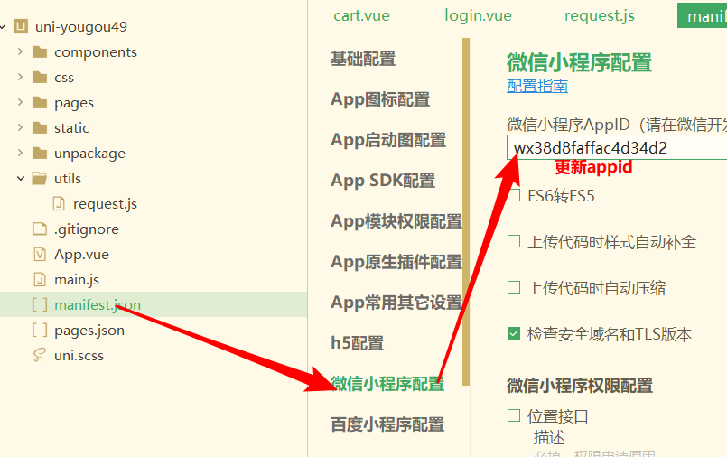
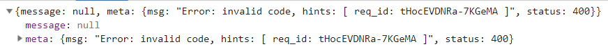

# 微信小程序学习第13天

## 每日反馈

1.   在自己的分支上pull 不是没啥作用吗 
    1.  如果几个人共有一个分支，那么pull
    2.  如果一个人独占一个分支，无须pull
2.  购物车逻辑些许复杂，老师复习的时候建议再过过思路 
3.  小乔老师,还有最后3天课啦,谢谢您带我们小程序!最后的最后,老师您可以再给我们传授一些职场经验,嘿嘿 
    1.  憨憨？
    2.  刚进公司干什么呢？
        1.  心态上，如果进公司了不要慌。公司如果招人就不会轻易干掉
            1.  面试官有责任的
            2.  一般公司会有培训，对新人培训有成本
        2.  你的工程了如指掌
            1.  了解你的工程里面npm包分别是做什么用的？
            2.  找一个核心页面完看懂，并写一个
            3.  对工程里面每一个文件都了解
    3.  是不是计算专业并不重要，但是到少得大专学历，可以考虑自考本科


## 回顾

1. 搜索页面

   1. 搜索输入框输入内容，回车跳转到搜索列表页面，按输入内容进行搜索

      1. 子传父@search
      2. 跳转并传参

   2. 第1步这里，先跳转再输入内容插入到历史搜索头部

      1. 跳转前先把输入内容插入到头部更新storage

         ```js
         [...new Set([keyword,...数组])]
         ```

      2. onHide和onShow时都可以把storage=>data.属性

         1. onShow页面初始化也会调用onShow

2. 计算属性getter与setter

   1. 当改变计算属性时会触发计算属性的set方法

      ```js
      computed:{
      	isAll:{
              get(){
                  return ''
              },
             //改变isAll会触发set
              set(isAll改变后的值){
                  
              }
          }
      }
      ```

3. 加入购物车

   1. 购物车商品列表分析接口
      1. 请求参数需要传商品id，所以商品id从哪里来呢？
         1. 加入购物车没有接口，所以**商品id只能存storage**
      2. 返回数据包括商品id，商品名称价格和图片, 还有商品选中状态和数量存哪里呢？
         1. **商品选中状态和数量存storage**
   2. storage存商品状态，数量及商品id, 数据结构应该是怎样的
      1. 数组[{},{}]
         1. 有序的
         2. 想取某属性需要遍历数组
      2. 对象{商品id：{}，商品id2:{}}
         1. 无序的
         2. 取某属性值是很方便的
   3. 商品详情加入购物车
      1. 商品选中状态:true，商品数量：第一次1，非首次num++
      2. 如何判断是不是首次？
         1. 如果对象cart[goodsId]
         2. TODO: 如果是数组？？
      3. 步骤：取storage，更新,存storage


## 作业检查

1. https://gitee.com/scamping_rabbit/uni-yougou/tree/dev_rabbit_20200531/
   1. git提交，一个小功能就可以提交一次。
      1. 方便回溯
   2. 搜索页面先跳转后插入到历史搜索头部的逻辑有新意
   3. 加入购物车功能

 

## 购物车-剩余功能

1. storage购物车数据结构确认为数组，加入购物车功能

   ```js
   #数组方式
   let cartArr=[
   	{
           goodsId:'701', #商品id
           checked:true, #商品选中状态
           num:1 #商品数量
       },
       ...
   ]
   ```

   1. 思路：商品选中状态:true，商品数量：第一次1，非首次num++
   2. 问题：如何判断是不是首次添加
      1. 判断数组里有没有一项它的goodsId为701??遍历
   3. 步骤
      1. 取storage
      2. 更新cart
         1. 判断是否是第一次添加, 数组find方法
         2. 如果是非首次添加，num++, checked:true
         3. 如果是首次添加，构造一个对象插入到数组最前面unshift
      3. 提示加入购物车成功
      4. 存storage

2. 加入购物车非首次添加，也需要把对象插入到数组最前面(了解)

   1. 方案1

   ```js
   cart = [...new Set([targetGoods, ...cart])]
   ```

   2. 方案2
      1. 借助findIndex

3. 购物车页面请求获取商品列表，并渲染

   1. 请求参数 `商品id1,商品id2...`
      1. 思路：数组每一项goodsId,以,分隔
         1. 方案1，遍历forEach后，拼接完后字符串需要去掉最后一,
         2. 方案2，把每一项goodsId放到一个数组中，然后用join方法以,转成字符串
            1. map和join配合
   2. 发请求
      1. onLoad还是onShow两个时机？？**onShow**
         1. tab页不会销毁，后续切换只能执行onShow
      2. 把请求数据作为data属性
      3. 渲染基本的，商品名称，商品价格，商品图片

4. 如何渲染商品列表每一项的商品选中状态及数量？？

   1. 数据来自storage cart

   2. 渲染是乱了

      1. **因为接口返回的数组并不是按传参goodsId的顺序**
      2. 所以：渲染的时候必须以storage cart为主

   3. 新的问题：渲染商品名字的逻辑大概是，需要在goodsList找一项goods_id为当前goodsId那一项的goods.name

      1. 如何解决？**对cart和goodsList融合，以cart为主**

         ```js
         // 需要把cart和goodsList融合,以cart为主
         this.goodsList = this.cart.map(item=>{
             // 把cart每一项和goodsList里面goodsId相同那一项融合
             let targetGoods = goodsList.find(goods=>{
                 return item.goodsId ===goods.goods_id
             })
             // 合成一个新的对象
             return {...item,...targetGoods}
         })
         ```

5. 商品选中状态，点击勾选/勾选
   
   1. @click: toggleCheck
6. 点击每一项，跳转商品详情页
   1. @click:toItem
   2. 跳转并传参GoodsId
   3. 阻止冒泡
      1. 在子元素上阻塞冒泡.stop
7. 商品数量点击+，num++; 商品数量点击-，num--，减到0确认然后删除
   1. 点击+ @click.stop:addNum
   2. 点击- @click.stop：subNum
   3. 减到0时，confirm提示，确认删除
      1. 数组的splice方法
8. 所有商品都选中，全选按钮选中
   1. 计算属性isAll
   2. 逻辑
      1. 选中的商品数量和goodsList长度相等，return true
      2. 只要有一个商品未选中，return false;否则return true
      3. 数组的every方法
9. 勾选/不勾选全选图标，需要把选中状态设置给所有的商品
   1. 计算的set方法
   2. 点击全选图标@click:toggleAll
10. 总数量：选中的商品数量之和
    
    1. 计算属性和数组方法reduce
11. 总价：选中的商品数量*商品价格之和
    
    1. 计算属性和数组方法reduce
12. 购物车商品选中状态及数量改变，小程序重启后没有了
    1. 原因选中和数量改变时本质上改变goodsList,这个数据并没有同步到storage
    2. 解决方案：
       1. 点击每个商品的选中状态，-+按钮，以及点击全选时都要把改变的数据同步给storage
       2. **深度侦听goodsList改变**
          1. **直接把goodsList构造一个新的cart，设置到storage即可**

#### 注意点：

1. 在加入购物车逻辑，为什么更新找到对象后，cart也更新

   1. targetGoods也是引用，更新targetGoods实际会更新一块堆块，cart也会间接找到这里

   

2. 商品详情页面数据没有回来前，名称和价格都是undefined，不能给用户展示undefined，所以两种方案
   1. v-if，如果数据没有回来之前，不渲染。缺点白屏时间有点长
   2. 给名称和价格默认值（适合更多的页面）
3. data属性cart没有在结构渲染，不应该作为data属性

## Array的方法总结

1. forEach用作遍历数组

   ```js
   // forEach遍历，无法中断的
   arr.forEach(item=>{
     console.log(item)
     item=9999 //能否改元素？？？不能改
     if(item>10){
       return //能否中断？不能中断
     }
   })
   ```

   1. 不能中断遍历
   2. 不能修改元素

2. find

   1. 概念：在数组中找一个元素
   2. 作用：遍历数组, 让数组元素执行指定函数，函数返回值是true，中断遍历返回这一项;函数返回值一直为false,返回undefined

```js
let target = arr.find(item=>{
  console.log(item)
  return item>10000
})

console.log(target)
```

3. map

   1. 概念：返回新数组
   2. 作用:返回一个新数组，遍历原数组，每一项执行指定函数，函数返回值作为新数组每一项
   3. 使用场景：一般是原数组结构不太满意，构造一个新数组结构

4. for in

   1. 使用：对对象或者数组进行遍历

      ```js
      for(let key in arr){
      
      }
      ```

5. for of

   1. 使用：只能对数组进行遍历

   2. 特点：**可以中断**

      ```js
      for(let item in arr){
      //item就是值，并不是键
      }
      ```

6. every
   1. 概念：数组每一项都满足条件就为true
   2. 如何作用的:遍历数组，每一项执行指定的函数，**所有**函数返回结果都为true的话，最终返回true

7. some
   1. 概念：数组有一项都满足条件就为true
   2. 如何作用的:遍历数组，每一项执行指定的函数，**有一个**函数返回结果为true的话，最终返回true

8. reduce

   1. reduce如何作用的：遍历数组，sum初始值是第二个参数，每一项执行指定的函数，**函数返回值在下一次遍历前赋值给sum**;遍历结束后返回最一次的函数返回值
   2. 使用场景：累加或或者阶乘

   ```js
   let 返回值 = 数组.reduce((中间值,item)=>{
     return 中间值与item的计算
   },中间值的初始值)
   
   ```

## 优购案例-登录


#### 01.页面分析

1. 入口：购物车点结算时，如果没有登陆，跳转登陆。我的页面也需要登录态
2. 主要模块：点我登录按钮
3. 其他说明
   1. 没有设计稿

#### 02.微信授权登录

1. copy剩余所有的页面，然后pages.json添加login页面路径，并添加编译模式

2. 分析接口

   1. 需要code
   2. 需要用户信息

3. 步骤

   1. 声明button获取用户信息

      ```html
      <button open-type="getUserInfo" @getuserinfo="getMyInfo">点我登录</button>
      ```

   2. uni.login获取code

   3. 调接口


# 微信授权登录需要配置！！！

#### 为什么需要配置？

1. 因为深圳没有优购商城后端服务器，登录逻辑只能用广州`www.uinav.com`
   1. 真实原因：微信支付功能需要注册商户号，商户号需要营业执照。如果想让大家完成登录，小程序账号也得是企业小程序账号，要求有营业执照
      1. 所以原因是没有营业执照
2. uinav服务器是配置有它自己的appid，前端需要使用它的appid
3. 微信开发者工具只能使用我的微信账号
   1. 后端代码时面登录逻辑是这样的，只有作为appid开发者的微信账号才可以登录
      1. 我的微信账号已经是appid的开发者

#### 需要配置什么？

1. 服务器地址 `https://www.uinav.com`
 	2. appid要改 `wx38d8faffac4d34d2`
 	3. 需要老师扫码 

#### 步骤（登录前一定要做的）：

1. 在request.js更新基地址为 `https://www.uinav.com`

2. 在微信开发者工具退出当前账号

   

3. 更新微信开发者工具的appid

   1. 找到源代码manifest.json打开，再打开微信小程序配置，找到appid更新为`wx38d8faffac4d34d2`

   

   2. 重启当前项目
      1. 

4. 把未登录的二维码截图给老师，让老师扫码完成登录

   1. 微信账号同时只能由一个微信开发者工具登录，所以是**排队**的

   2. 希望大家在让我扫码前，确保自己的请求是OK的

      1. 检查请求url，方法，参数是不是OK的

      2. 请求返回是不是这样的

         

#### 注意点

1. 注册method在request.js可能需要传


## 总结

1. storage cart以数组方式存储，加入购物车的功能

   1. 如何判断是否是第一次添加
      1. 数组find方法
   2. 非首次，选中状态true,num++，插入数组头部
   3. 首次，构造一个对象，插入数组头部

2. 商品列表渲染，发请求，渲染列表

   1. 请求参数goodsid1,goodsid2...
      1. 取storage cart，map和join

3. 如何渲染商品数量和选中状态

   1. 接口返回的数组是无序，渲染以storage cart为主

   2. cart和goodsList两个数组合并

      ```js
      this.goodsList = this.cart.map(item => {
          // 把cart每一项和goodsList里面goodsId相同那一项融合
          let targetGoods = goodsList.find(goods => {
              return item.goodsId === goods.goods_id
          })
          return { ...item,
                  ...targetGoods
                 }
      })
      ```

4. 所有商品选中，全选选中

   1. 数组every

5. 全选点击处理

   1. 改变计算属性set方法
   2. 在set方法把状态设置给所有的商品

6. 总价格和总数量

   1. 数组方法reduce

      ```js
      let 返回值 = 数组.reduce((中间值,item)=>{
        return 中间值与item的计算
      },中间值的初始值)
      ```

7. 商品列表属性的变化，并没有同步给storage
   1. 侦听goodsList，有变化直接同步给storage


#### 作业

1. 购物车剩余功能
2. 登录页
