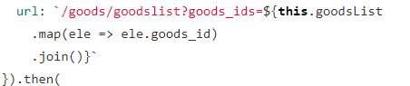
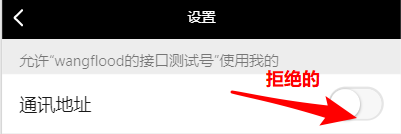
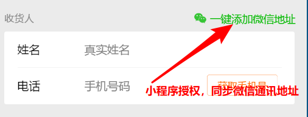
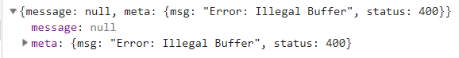
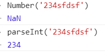

# 微信小程序学习第14天

## 每日反馈

1. 老师,我们即将停课6天了,想问问学习方向,该怎么安排时间呢, 重点是放复习还是背面试题
   1. 优先级
      1. 先尽量面试找到工作
      2. 背面试题
      3. 复习的以前项目


## 回顾

1. 购物车

   1. 分析接口

      1. 请求参数来自storage存储
      2. 接口返回的数据只包括了商品名称价格和图片，另外商品选中状态及商品数量存在storage

   2. goodsId,选中状态还有商品数量在storage是怎样的数据结构

      1. 数组

         1. 有序

         ```js
         let cart =[
             {
                 goodsId,
                 checked:
                 num
             }
             ...
         ]
         ```

      2. 对象

         1. 无序
         2. 取值方便

         ```js
         let cart={
         	goodsId:{
         		checked:
         		num
         	}
         }
         ```

         

   3. 加入购物车功能

      1. 判断是否是首次添加
         1. 数组方法find
         2. 数组方法findIndex,没有找到就是-1
      2. 如果首次添加，构造一个对象，num:1, checked:true,插入数组前面
      3. 如果非首次，num++,checked:true，然后插入头部

   4. 构造请求参数，需要拿数组里面每一个对象的goodsId以,拼接

      1. map返回一个goodsId数组，然后join以,拼接

   5. 发请求渲染页面

      1. 渲染商品名称，价格图片

   6. 商品数量如何渲染

      1. 提示：接口返回数组并不是有序的。所以要按钮storage cart
      2. 渲染商品名称：在goodsList找一项goods_id为goodsId,它的goods_name
      3. 合并两个数组，以cart为主
         1. 遍历cart拿出每一项，在goodsList找一项goodsId相等，如果等就把两个对象合并

   7. 所有商品选中全选选中

      1. 计算属性，数组方法every

   8. 全选点击处理

      1. 触发计算属性set，在set方法中把全选状态设置给所有的商品

   9. 商品数量和价格

      1. reduce

   10. 界面改动同步到storage

       1. 侦听goodsList，深度
       2. 把goodsList同步到storage

2. 微信授权登录

   1. 获取用户信息

      ```html
      <button open-type="getUserInfo" @getuserinfo="事件处理方法里面获取用户信息">
          
      </button>
      ```

   2. uni.login获取到code

   3. 发请求

   4. 配置

      1. appid
      2. host服务器地址
      3. 需要老师扫码

   

## 作业检查

1. https://gitee.com/TheSacrificeOfXX/yougou/tree/xiexuan_2020%2F05%2F22/

   1. number不要用作变量

   2. 购物车页如果没有storage cart数据就不发请求

   3. 代码尽量写得通俗易懂些

      

   4. 对data属性赋值尽量一步到位，避免data属性更新导致结构变化，有抖动

2. https://gitee.com/tang_36/uni-yougou/tree/tang_36 

   1. css文件夹名大写？
   2. 有小功能完成就可以git提交，不要积累很多，再提交


## 小程序微信支付（了解）

[传送门](https://pay.weixin.qq.com/static/product/product_intro.shtml?name=miniapp)

用户在微信小程序内唤起微信支付，完成支付返回微信小程序

使用示例


#### 申请流程

1. 申请小程序开发者账号，而且必须是**小程序企业开发者账号**
   1. 企业开发者账号需要营业执照
   2. 公司里面有营业执照
2. 微信认证

   1.  个人号无法认证
3. 小程序开通微信支付
4. 点击开通按钮后，选择新申请微信支付商户号或绑定一个已有的微信支付商户号，
5. 申请微信支付商户号

   1. [传送门](https://pay.weixin.qq.com/index.php/apply/applyment_home/guide_normal)
   2. 需要营业执照和银行卡号
6. 业务流程
   1. 前端只调接口，拿到支付参数，然后调用wx.requestPayment，唤起微信支付
   2. 后端调用`wxsdk.reqWXUnifiedorder`,传入appid，商户号，open_id等生成前端微信支付的参数。


## 小程序授权拒绝处理

[授权](https://developers.weixin.qq.com/miniprogram/dev/framework/open-ability/authorize.html)

概念：小程序授权向微信要一些权限

使用：

1. 用户信息，声明式
2. 其他
   1. 先发起授权，弹出授权弹窗
   2. 调用相应的授权接口

#### 问题：如果小程序授权拒绝如何处理

1. 现象：只要拒绝一次，那么后续点击无任何返应

2. 解决方法：**先弹框提示，然后打开设置**

   ```js
   // 只要是拒绝的状态，都会进入fail里面
   // 处理一般先提示，打开允许
   wx.authorize({
       fail(){
           wx.showModal({
               title: '提示',
               content: '请在设置中允许通讯地址',
               success(res) {
                   if (res.confirm) {
                       //打开授权设置
                       wx.openSetting({
                       })
                   }
               }
           })
       }
   })
   ```

注意点：

1. `wx.authorize`的fail方法，第一次拒绝和拒绝再请求授权都会进调用fail方法

2. `wx.openSetting`打开小程序授权状态面板

   1. 以下这个面板在微信里面，点右上...，点设置也可以打开

   


## 优购案例-支付


#### 01.页面分析

1. 入口：购物车点击结算跳转到支付页面

2. 主要模块：收货地址，商品列表，底部的微信支付

3. 其他说明

   1. 没有设计的
   2. 商品列表，每一个不能调整选中状态，也不能改商品数量
   3. 微信支付会先生成**订单**，然后根据订单生成支付单。
      1. 订单可能会支付失败。通过订单查找你待支付的商品
   4. 如果订单生成，商品就会从购物车去掉
   5. 微信支付（显示的是总金额）
   
   

#### 02.静态页面

1. copy页面
2. 在pages.json添加页面路径


#### 03.同步微信通讯地址

1. 一般实际项目小程序收货地址

   1. 主要调后端接口，对收货地址增删改查

   2. 辅以微信小程序授权获取通讯址

      

2. 支付页面获取收货地址
   1. 点击请选择地址，发起授权，获取通讯地址
      1. 点击@click:getAddr
      2. 发起授权wx.authorize
      3. 调用接口wx.chooseAddress
   2. 授权拒绝的处理
      1. 在wx.authorsize的fail回调
      2. 先提示，然后打设置面板
   3. 显示小程序授权获取到的地址
      1. 小程序授权数据作为data属性 address
      2. 请选择地址和收货地址的显示与隐藏v-if
         1. 因为请选择址址并不会经常显示
   4. 小程序重新启动后，之前授权获取到的收货地址有没了
      1. 解决方法：需要把收货地址数据存到storage
         1. storage地址address
         2. 授权获取到收货地址的时候存uni.setStorageSync
         3. 初始化时storage=>data属性
   5. 无法切换收货地址
      1. 第1步注册点击事件应该放在收货地址dom最外层

#### 04.请求数据&渲染数据

1. 从购物车点击结算跳转支付页面

   1. 如果没有选择商品，提示
   2. TODO: 如果没有登录跳转登录
   3. 以上两个条件都不满足，跳转支付页面
      1. 跳转uni.navigateTo

2. 发请求并渲染
   1. 什么时候发请求，onLoad
   2. 请求参数应该为storage cart里面选中的商品id

3. 商品总价格

   1. 计算属性

4. 在登录页，登录成功后需要存储token，并提示，并返回

   1. storage
   2. toast
   3. navigateBack

5. 点击微信支付，创建订单并生成支付参数，唤起微信支付

   1. 点击@click:pay

   2. 创建订单前的条件

      1. 收货需要填写
      2. 必须得有商品
      3. 必须登录，如果没有，跳转登录

   3. 创建订单

      1. 需要在header传token，同时需要在request.js确认有传递header
      2. data参数
         1. 用方法返回值
         2. 不适合用计算属性，因为参数并没有在结构中使用

   4. 获取支付参数

   5. 唤起微信支付

      ```js
      uni.requestPayment({
           支付参数,
          success(){
              支付成功
          },
          fail(){
              支付失败
          }
      })
      ```

      

#### 注意点

1. 购物车页面如果storage没有数据的话，无须发请求

2. 数组方法filter

   1. 概念：在数组找符合条件所有的元素
   2. 如何作用的，返回一个新的数组，遍历原数组,对每一项执行一个指定函数，如果函数返回结果为true，在新数组中加入这一项

3. 登录的问题

   1. 服务器的问题，点请求两次即可

   

4. 业务逻辑，商城系统并不是点击支付调接口发起支付，这中间先生成订单，然后再拿 订单号生成支付单，拿 支付单去支付。
5. 在微信开发者工具，支付是弹出二维码，手机扫码完成支付。用手机扫码预览，就是正常的唤起微信支付
6. 大家在下面完成练习时，在微信开发者工具弹出支付二维码就表示成功。

## 优购案例-优化

#### 01.订单生成成功后，删除已勾选的商品

	1. 无须更新data.属性goodsList，因为支付无论是成功还是失败都会跳转页面
 	2. 需要删除storage cart已勾选的商品：arrangeCart
      	1. 取storage
      	2. 更新cart
           	1. 过滤filter
      	3. 存storage

#### 02.商品详情-立即购买跳转支付页面

​	把当前商品购买一份，直接跳转支付页面，不经过购物车，无须在storage存储

1. 点击立即购买跳转支付页面，并传递goodsId
   1. 点击@click:toPay
   2. 跳转uni.navigateTo
   3. 在模拟器页面参数确认传参Ok
   4. 支付页面获取到goodsId
2. 如果是从商详跳转支付页面，商品列表应该展示该商品，数量为1
   1. 构造cart
3. 如果不是从商详立即购买过来，生成订单后删除storage cart里面选中的商品

#### 03.设置购物车的商品个数

  1. 设置在tabbar购物车上边数字，数字应该为购物车商品种类个数(storage cart的长度）

       		1. 什么时候设置切到购物车页面更新onShow

  2. `wx.setTabBarBadge`

     ```js
     wx.setTabBarBadge({
       index: 0, //tabBar 的哪一项，从左边算起
       text: '1' //显示文字，必须是字符串类型
     })
     ```

#### 04.request中设置token

把header传token，和需要登录态没有token就跳转登录页的逻辑统一放在request.js

三种情况：

1. 接口无须token,header不需要传或者传header={}
2. 接口需要token，有登录态，header传token
3. 接口需要token，但是没有登录态，跳转登录页

步骤：

1. 根据接口是否需要token，两种状态isAuth,默认值为false

2. 默认request.js header={}

3. 如果是情况2，给header设置token

4. 如果是情况3，跳转登录

   ```js
   // 接口不需要传token,默认值为{}
   let header = {}
   
   if (isAuth) {
       // 接口需要传token
       let token = uni.getStorageSync('token')
       // 接口需要token，但是没有登录态，跳转登录页
       if(!token){
           uni.navigateTo({
               url: '/pages/login/login'
           })
           return 
       }
       header.Authorization = token
   }
   ```

   

#### 05.request错误提示

1. status如果不为200,提示

   ```js
   // 如果后端返回数据非正确数据,提示
   uni.showModal({
       title: '提示',
       content: meta.msg,
       showCancel: false
   })
   reject(meta)
   ```

   

2. uni.request fail处理，网络错误

#### 注意点

1. 尽量不要使用"==", 因为比较时存在隐性转换，隐性转换可能在意料之外。所以应该尽量在类型确定的情况下进行比较，建议总是使用`===`

2. 页面url传参，通过onLoad方法获取到的参数总是字符串类型的

3. 字符串转数字，尽量用parseInt

   

## 优购案例-订单结果页(了解)

#### 01.页面分析

1. 支付页面，支付取消或者支付成功，都会进入订单结果页

2. 订单结果页支付成功，展示成功状态和首页按钮，点首页按钮去到首页
3. 订单结果页支付失败，展示失败状态和首页按钮与订单详情按钮，点首页按钮去到首页，点订单详情去到订单详情

#### 02.静态页面

1. 文案及两个按钮

#### 03.基本逻辑

1. 支付页面上，支付成功和失败跳转订单结果页
   1. 失败时候传递orderNumber
2. 支付成功显示`首页`,并设置标题
3. 支付失败显示`首页`和`查询订单详情`，也设置标题


## 优购案例-订单详情(了解)

#### 01.页面分析

1. 订单结果点订单详情去到订单详情
2. 订单详情展示订单基本信息

#### 02.静态页面

1. 展示订单基本信息

#### 03.请求&渲染数据

1. 未登录跳转登录

2. 查询订单状态

   1. 接口 /api/public/v1/my/orders/chkOrder

      1. 请求方式POST

      2. 请求头:

         "Authorization" : token // 需要设置token带给后台

      3. 请求体:
         order_number : 订单号


## 优购案例-我的(了解)

#### 01.页面分析

1. 入口是tabBar
2. 展示登录状态收藏店铺、订单及其他信息
3. 已经登录展示用户头像和昵称，未登陆就显示登录，点登录跳转登录
4. 点订单跳转订单列表
5. 拨打电话的功能

#### 02.静态页面

#### 03.基本逻辑

1. 已经登录展示用户头像和昵称，未登陆就显示登录，点登录跳转登录
   1. login页userInfo添加到storage
   2. onShow里面获取到用户信息
   3. 点登录跳转登录
2. 拨打电话
   1. wx.makePhoneCall


## 优购案例-订单列表(了解)


#### 01.页面分析

1. 分别展示全部，待付款，已付款，退款/退货的订单列表
2. 在我的页面，点击订单去到订单列表

#### 02.静态页面

1. 顶部tab栏
2. 订单列表展示

#### 03.基本逻辑

1. 我的页面点击不同菜单去到订单列表，选中对应的tab
   1. 两边菜单并不是一一对应的，设置数组序列标志
2. 点击tab展示对应的列表

#### 04.请求&渲染数据

2. 渲染订单列表

   1. 接口`/api/public/v1/my/orders/all?type=1`

      1. 请求方式GET

      2. 请求头:

         "Authorization" : token //需要设置token带给后台

2. 切换Tab发送请求


## Vuex复习

概念: vuex存储所有组件的状态，改变状态有自己规范

 1. 状态可以理解把原来组件里面属性公开放到vuex中作为状态

 2. 改变状态的规范是mutations

 3. 方便理解，你可以认为vuex就是一个全局变量，只不过改变全局变量有规范

    ```js
    (function(){
    	防止全局变量污染
    })
    ```

#### vuex的核心概念：

1. state状态：就是用来存储所有组件状态
2. getters：state计算属性
3. mutations: 改变state的规范

```js
//store实例
const store = new Vuex.Store({
  state: {
    count: 1
  },
  mutations: {
    increment (state) {
      // 变更状态
      state.count++
    }
  }
})

//调用mutations
store.commit('increment')
```


#### uniapp如何使用vuex呢

1. 如果项目是hbuiler创建的，无须装vuex包

2. 新建store/index.js，声明store

3. main.js引入store，然后把store注册到Vue实例化

   ```js
   import store from './store'
   const app = new Vue({
   	store,
   	...App
   })
   ```

## 总结

1. 小程序微信支付
   1. 微信支付可以给小程序,h5,app都可以接入
   2. 微信支付有商户号
   3. 个人微信无法开通微信支付
   4. 前端如何唤起微信支付， wx.requestPayment(支付参数)
2. 小程序授权如果拒绝，怎么处理
   1. 拒绝都会进入wx.authorize的fail回调
   2. 弹框提示，打开授权设置，让用户允许即可
      1. wx.openSetting会打开授权设置
3. 支付页面
   1. 收货地址本质上就是授权获取小程序通讯址
   2. 渲染列表
      1. 取storage cart选中商品
   3. 点击微信支付，先创建订单，再拿订单号发请求获取支付参数，然后拿支付参数传给wx.requestPayment唤起微信支付
4. 优化
   1. 生成订单后，删除购物车勾选的商品
   2. 商详点击立即购买跳转支付页面
      1. 把商品购买一个
      2. 渲染列表
         1. 构造一个类似于storage cart这种结构
         2. 优化第1步，这个逻辑无须处理
   3. tabbar购物车数量设置为badge
      1. wx.setTabbarBadge
   4. request.js把token收拢
      1. 接口无须token，就传header={}
      2. 如果需要token,header传token
      3. 如果需要token，但是没有，跳转登录

## 作业

1. 登录和支付，一定找我扫码
2. request.js中添加token的功能
3. 优购商城与vuex结合(选做)
