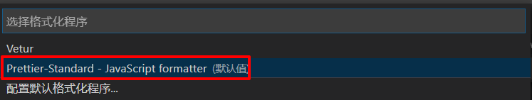

# 微信小程序学习第15天

## 每日反馈

1.  后面这几天都不怎么听得进去，思路几乎是没有的，好难 
   1. 是否缺少练习时间
2.  小乔老师，顺带讲一下移动端如何适配吗？大概有几种主流的移动端适配？？？（pc端就是用 rem吗）。 APP和小程序咱们就用rpx 就搞定了是吧，觉得还是小程序的适配最简单方便！ 另外有一个还是没懂：原生h5+ 混合开发项目。h5本来不就是原生吗？还有哪些开发模式呀？？？？小乔老师一起讲一下把！ 谢谢乔哥，今天是你最后一天带我们了，感谢你大半个月辛苦的讲课！喜欢像您这样负责及其认真的老师，小程序让我有收获! 
   1. 主流的移动端适配
      1. 百分比（了解）
      2. media query+rem
      3. flexible.js+rem(最主流的方案)
   2. pc端适配
      1. bootstrap
      2. flexible.js+rem
   3. App开发有好几种技术
      1. App原生开发（ios用object-c, 安卓用java）
      2. 混合模式的开发：原生提供浏览器组件，在浏览器组件运行h5，h5能够访问到原生接口
         1. 一般在企业，需要ios和安卓程序员提供浏览器组件壳，原生接口。在浏览器组件里写h5,不能使用rpx。
         2. h5+适合学习的混合模式开发
   4. 小程序之所以可以使用rpx，是它自己封装了。
   5. 原生就是官方提供的语法，h5是原生不对的。


## 移动端适配方案flexible.js+rem

[flexible.js](https://github.com/amfe/lib-flexible)

移动端自适应：页面在不同尺寸的设备上显示良好。

#### rem是什么？

相对于html标签的font-size大小。

1. 比如html标签的字体大小是16px, 子元素如果是10rem，实际10rem相当于160px


#### flexible.js+rem自适应原理

1. 思路：只是使用rem并不能够做到自适应。如果根据不同设备尺寸给html font-size一个合适的值，那各元素就可以自适应了。
2. flexible.js正好可以根据不同设备尺寸给html font-size一个合适的值
3. 结论：**flexible.js给不同尺寸屏幕一个合适的html标签font size，然后页面各元素使用rem，就可以随屏幕尺寸自适应了。**

#### 如何使用

1. 设计稿是iphon6的2倍图，设计稿宽度750px

2. 前端写静态页面先适配iphone6

3. 方案1：根据设计稿量的大小/37.5/2就可以了

4. 方案2：结合css预处理器，声明一个@p=1/75rem，那么在less里写的话就可以把量的值直接写在代码

   1. 就相当于在h5页面可以使用"rpx"

   ```less
   // 设计稿量的大小/37.5/2 = 设计稿量的大小*@p
   @p:1/75rem;
   .rimg{
       width:128*@p;
       height: 140*@p;
       border: 1px solid green;
   }
   //会编译成
   .rimg {
     width: 1.7066666666666668rem;
     height: 1.8666666666666667rem;
     border: 1px solid green;
   }
    
   ```

#### media query+rem和flexible.js+rem的对比

1. media query+rem是如何自适应的
   1. 比如320-375px屏幕它的html font-size是多少
2. 所以前者方案自适应并不是连续的。所以基本上选择flexible.js+rem就行

#### 近距离看flexible.js源码

html标签的字体大小设置为：屏幕宽度/10px

```js
function setRemUnit () {
    var rem = docEl.clientWidth / 10
    docEl.style.fontSize = rem + 'px'
}
```

#### 注意点：

1. 只能在uniapp和小程序写rpx

## 回顾

1. 支付页面
   1. 收货地址，小程序授权
      1. 授权拒绝wx.authorize的fail回调
      2. 处理方法: 提示，打开设置让用户允许
   2. 先创建订单，取得订单号作为参数请求支付参数接口，获取支付参数调用wx.requestPayment唤起微信支付
2. 优化
   1. 生成订单，就应该删除购物车中商品
   2. token逻辑统一放到request.js
      1. 接口不需要token，传header={}
      2. 接口需要token，传header={aut...:token}
      3. 接口需要token并没有，跳转登录
3. vuex的复习
   1. 所有组件需要传递属性统一放vuex的状态中，集中管理。如果想改变vuex状态的话，有规范mutations
   2. 核心概念
      1. state状态：就是用来存储所有组件状态

      2. getters：state计算属性
      3. mutations: 改变state的规范

```js
//store实例
const store = new Vuex.Store({
  state: {
    count: 1
  },
  mutations: {
    increment (state) {
      // 变更状态
      state.count++
    }
  }
})

//调用mutations
store.commit('increment')
```

**uniapp如何使用vuex呢**

1. 如果项目是hbuiler创建的，无须装vuex包

2. 新建store/index.js，声明store

3. main.js引入store，然后把store注册到Vue实例化

   ```js
   import store from './store'
   const app = new Vue({
   	store,
   	...App
   })
   ```

## 作业检查

1.  https://gitee.com/tsukiShiro/uni-yougou/blob/dev_20200522/pages/pay/pay.vue 
   1. ` goods:**this**.getOrderGoods `能调用吗，不能。这里要给（）才能形式调用。并不是计算属性


## 优购商城整合Vuex

#### 为什么storage cart适合用vuex

1. 频繁地和storage肯定比较慢而耗性能
2. 访问Vuex是比较快

思路：**小程序启动时storage=>vuex，然后小程序关闭时vuex=>storage, 那么在小程序运行中就可以直接和vuex通信**

1. 小程序启动时，初始化state时机，就storage=>vuex
2. 小程序关闭时vuex=>storage设置时机是？也就是说小程序关闭时是否总会执行onHide?
   1. **正常关闭微信小程序都会执行onHide**

#### 步骤

1. 在目录下创建store/index.js，在里面实例化Store

2. main.js引入store，然后把store注册到Vue实例化

   ```js
   import store from './store'
   const app = new Vue({
   	store,
   	...App
   })
   ```

3. 引入vuex logger插件

   ```js
   import createLogger from 'vuex/dist/logger'
   
   const store = new Vuex.Store({
     plugins: [createLogger()]
   })
   ```

4. 小程序启动时，初始化state时候，就storage=>vuex

5. 小程序关闭时，在onHide里面vuex=>storage

6. 加入购物车的功能

   1. 直接使用state.cart

   2. 以上思路并不好，因为vuex官方要求我们改变vuex state用muations

      1. 把改变state cart的逻辑全部放到store/index.js的mutations

      2. 在item.vue add2Cart，就commit

         ```js
         // 调用state mutations 
         this.$store.commit('add2Cart',this.goodsDetail.goods_id)
         ```

7. 小程序运行中，原来storage cart全部改成state.cart
   1. 如果读cart，就用state.cart
   2. 如果改state.cart，就用muations
   3. 步骤：
      1. 购物车
         1. onShow取 storage cart逻辑换成state.cart
         2. 当界面改变，商品选中状态还是数量改变时，更新cart
            1. mutations: updateCart
      2. 支付
         1. onLoad取 storage cart逻辑换成state.cart
         2. 删除 cart里面选中的商品
            1. mutations:arrageCart

#### 注意点

1. 上边这个思路并不适合h5页面，因为h5页面关闭时没有一个钩子可以storage=>vuex

2. 在微信开发者工具没有chrome devTools，无法看Vuex状态

3. vuex内置logger插件

   1. vuex自带的，无须install
   2. 改变vuex的状态时会在控制台打印

   

4. 什么时候使用vuex
   1. 三层以上组件通信时
   2. 和多个页面没关系
      1. 如果多页面应用，页面之间通信通过url
      2. 如果单页面应用,SPA，页面相当是组件，很可能组件层次就深了，就需要vuex
         1. 后台管理系统最适合用SPA, 通常需要引入vuex

## H5和App兼容性问题解决

> 兼容性问题调试起来是很耗时间

如果想让代码兼容多个平台，**写代码应该总是遵从规范**

1. 不要写img,换成image

2. ul，li换成view

3. @click="不要在行内写逻辑"

4. h5搜索列表商品列表会盖在头部上边，这个需要给头部设置z-index

5. h5搜索列表，如果不主动停止下拉动画的话，就会一直loading

   ```js
   uni.stopPullDownRefresh()
   ```

6. 在合适的时候使用条件编译

   1. [传送门](https://uniapp.dcloud.io/platform)

7. TODO: App这个加入购物车toast文字溢出

#### 注意点 

1. 登录以后逻辑，不支持h5和app


## 发布

1. 微信小程序
   1. 发行->小程序-微信
   2. 在微信开发者工具上传，审核发布
   3. 注意点：优购商城无法用个人微信小程序账号发布
      1. 商城类型必须是企业微信小程序账号才可以发
   4. 发布代码在项目目录下 `/unpackage/dist/build/mp-weixin`
2. app
   1. 发行->原生App云打包
   2. 打开manifest.json文件配置app的名字和图标
   3. 下载包：发行->查看云打包的状态，获取链接下载apk，安装即可
3. h5
   1. 发行->网站h5
   2. 发布的代码在项目目录下`/unpackage/dist/build/h5`


## mpvue介绍

[传送门](http://mpvue.com/)

[git地址](https://github.com/mpvue/mpvue)

#### 基本介绍

**用vue.js写各种小程序，但是不支持h5**


#### 学习的目的：

1. 掌握一个新的框架
2. mpvue是基于vue脚手架2.x
3. eslint的使用

> mpvue已经2年没有维护了


## mpvue快速上手

[传送门](http://mpvue.com/mpvue/quickstart.html)

#### 01.初始化mpvue项目

```bash
#1.先确认你的npm源是taobao源
npm config list
#2.如果不是淘宝源，设置npm源为taobao源
npm set registry https://registry.npm.taobao.org/
#3 在vuecli4.x上桥接一个vuecli2.x
npm install -g @vue/cli-init
#4 创建项目，命令行选项全部yes，直接回车
vue init mpvue/mpvue-quickstart 项目名
#5，去到项目目录下，npm装包，执行npm run dev
cd 项目目录下 #去到项目目录下
npm install&npm run dev
```

#### 注意点

1. **不要使用cnpm**, 因为cnpm解压包方式和npm不一样，可能会导致问题

2. 确认是不是npm淘宝源。设置了淘宝源，可以再执行npm config list再确认一下

   

3. `vue create`来自vuecli3.x或者vuecli4.x， `vue init` 来自于vue2.x,步骤3其实是在vuecli4.x上桥接vuecli2.x

   1. 以下表示成功

      

4. 注意步骤4，是在当前目录下创建项目，所以得选择一个合适的目录

   1. 命令行选项全部yes，直接回车

      

5. npm run dev后，看到以下界面表示成功

   1. 可以看项目目录dist/wx就是生成微信小程序的代码

   

6. linux基本命令
   1. [传送门](https://www.cnblogs.com/zj233/p/5888325.html)
   2. ls命令就是列出当前目录下所有文件和目录

#### 02.调试开发 mpvue

1. 用微信开发者工具导入**项目名**

   1. project.config.json文件，以下属性告诉了微信开发者工具dist/wx目录才是代码目录

      ```js
      "miniprogramRoot": "dist/wx/",
      ```

2. 用vsCode写代码，用微信开发者工具查看效果


## 一次性搞定npm安装的问题！！！

1. 确认npm源是不是淘宝源，一定为淘宝源

2. 权限不足

   1. 现象:报错提示出来'operation','permission'
   2. 如何解决
      1. windows，以管理员身份打开，然后去到指定目录，再次执行命令
      2. Mac: sudo+命令
         1. 可能需要输入密码

3. 清除npm缓存

   1. 现象： 报错提示有'.stagging'
   2. 如何解决？ 执行` npm cache clean --force `

4. 执行命令的目录不要有中文

5. 网络问题

6. npm install如果卡住不动了，cltr+c停止，然后删除node_modules，再次执行 npm install

7. 其他

   1. 没装包npm install

      

   2. vuecli4.x没有安装

          

         ```bash
         npm install -g @vue/cli
         ```

## mpvue项目结构

**mpvue项目结构是一个vuecli2.x项目结构，和uniapp结构类似**


#### 其他说明：

1. main.js是整个项目入口

   1. 实例化App.vue
   2. 问题：Vue好像并不是我们所认识的Vue？
      1. vue是mpvue

2. App.vue会转成app.js和app.wxss，全局样式和逻辑

3. app.json全局配置，和生成的小程序代码的app.json一毛一样

4. pages/**/main.js 这个文件就是实例化它旁边的 *.vue文件的

   1. 问题：页面配置在哪里呢？
      1. 在页面目录下添加配置文件，名必须为`main.json`，不能改

5. dist目录是webpack把src目录编译后的文件存放点，dist只能看不能改，也可以删除

6. webpack.base.conf.js文件解析

   1. 入口有多个，包括`pages/**/main.js`和`src/main.js`

   2. resolve的作用

      ```js
       // webpack如何解决包引入
        resolve: {
          // 引入文件如果是以下后缀，可以省略
          extensions: ['.js', '.vue', '.json'],
          // 别名
          alias: {
            'vue': 'mpvue',
            // @表示src目录
            '@': resolve('src')
          },
          symlinks: false,
          aliasFields: ['mpvue', 'weapp', 'browser'],
          mainFields: ['browser', 'module', 'main']
        },
      ```

   3. rules的作用

   ```js
   // webpack就是各种类型的文件转成js，以下这里就loader
       //loader把某类型的文件转成js
       rules: [
         {
           //检查src和test目录下所有的.js或.vue的代码格式
           test: /\.(js|vue)$/,
           loader: 'eslint-loader',
           enforce: 'pre',
           include: [resolve('src'), resolve('test')],
           options: {
             formatter: require('eslint-friendly-formatter')
           }
         },
   ```

## vue-cli2.x项目结构（了解）

> 很可能企业用到的vue脚手架就是2.x

vue-cli2.x项目结构主要特点是：webpack配置就在项目里面


#### 具体解析：

1. 运行npm run dev/npm run start本质上生成dist/wx目录
2. config里面包括开发和生产环境对应的配置，开发时服务器的端口、上线图片的路径。。。
3. 开发时执行：npm run dev->build/dev-server.js->webpack.dev.conf->webpack.base.conf.js
4. 上线打包： npm run build-> build/build.js->webpack.prod.conf->webpack.base.conf.js
5. webpack.base.conf.js
   1. src/main.js和pages目录下所有的main.js文件都是入口
   2. resolve配置是webpack如何解析包引入
   3. loader就是把某一个类的文件转成js

#### 使用场景：

1. 可以拿vue-cli生成的webpack配置读懂，改改。

#### 注意点

1. 大家下去找博客去研究下vue-cli2.x项目结构分析
   1. [传送门](https://my.oschina.net/wangnian/blog/2050375?nocache=1536818711949)
2. webpack loader和plugin区别
   1. loader某一个类的文件转成js
   2. plugin可以在webpack执行不同时机去加载初始化loader
3. 大家还可以去闲鱼上买一些视频，5块买到几个G。


## mpvue创建自己的页面

**mpvue使用Vue语法，也可以使用小程序组件和wx对象，可以使用html标签**

**css可以使用rpx和px**


#### 创建页面步骤

1. pages目录下copy一个文件夹，改名为demo
2. 在app.json添加路径
3. 重启webpack server
   1. ctrl+c
   2. npm run dev

#### 注意点

1. mpvue项目结构是多入口，每新增一个页面就是新增一个入口，重启webpack server
2. 和uniapp对比可以使用html标签, API就是使用wx对象


## ESLint说明-练习

 [传送门](https://eslint.bootcss.com/)

#### eslint介绍

**是什么**？ 

检测js文件代码格式风格

**有什么用?**

1. 团队内统一代码格式非常重要
2. 有部分公司在git commit前置钩子会开启eslint检测，检测不通过，无法提交
3. 检测风格的同时也会查出一些错误

**怎么使用呢？**

	1. eslint就是npm包
 	2. 更我我时候，eslint会结合webpack使用

```bash
eslint yourfile.js #eslint检查yourfile.js文件，以当前目录下.eslintrc的规则
```

**应用场景：**

eslint会结合webpack使用

#### mpvue项目里面的eslint

1. webpack.base.conf.js文件声明eslint-loader
   1. 检查src和test目录下所有的.js或.vue的代码格式
2. eslint依据规范在这里声明`.eslintrc.js`
   1. extends字段表示Js规范
3. JavaScript规范：规则的集合
   1. google
   2. 爱彼迎 aribnb 
   3. [JavaScript标准规范](https://github.com/standard/standard/blob/master/docs/RULES-zhcn.md)

4. 结论：**mpvue项目就是遵从javaScript标准规范来检测src目录下所有.js和.vue文件的**

#### 自动格式化代码

1. vscode装插件` Prettier-Standard - JavaScript formatter`

   1. 作用：按照JavaScript标准规范来格式化代码

   ​	

2. 在vscode配置.js, .vue,.html文件的格式化配置

   



#### 注意点

1. 格式化插件无须配合eslint插件

2. 如果不想让某文件或者某部分代码被eslint检查

   ```js
   /* eslint-disable */
   ```

3. 全局去掉eslint检查，不建议

## uniapp优购商城迁移到mpvue

#### 01.准备

1. 创建项目&装包&启动

   ```bash
   vue init mpvue/mpvue-quickstart mpvue-yougou49
   npm install
   npm run dev
   ```

2. 导入微信开发者工具
3. 推送到gitee
   1. 去gitee创建项目
   2. 按提示推送
4. 清除无用的代码，保留一个页面即可
   1. 清空components，utils，static,logs页面
   2. app.json保留index页面路径，移走tabbar配置
   3. index/index.vue清空内容，生成vue基本结构

#### 02.完成首页

1. copy components,css,static,store,App.vue，pages.json，utils文件夹到mpvue优购下src目录

2. main.js把$request和$store都添加为Vue原型

   1. new Vue不支持传入$store

   ```js
   // 把$request和$store添加为vue原型
   Vue.prototype.$request = request
   Vue.prototype.$store = store
   
   ```

3. copy home页面文件夹，把index/main.js copy进去

   1. main.js实例化.vue文件名改变home.vue
   2. 需要在app.json修改页面路径

4. 安装vuex, less

   ```bash
   npm install vuex
   npm install less less-loader --save-dev
   ```

5. 解决eslint的格式问题

   1. 注释前必须要缩进

      ```js
      // 这里是注释
      ```

   2. 文件里面不能有注释的代码

6. 所有src下的文件全局替换掉uni.=>wx.

7. 错误 `Module build failed: TypeError: loaderContext.getResolve is not a function`

   ```bash
   npm uninstall less-loader
   npm install less-loader@4.1.0 --save
   ```

8. App.vue的css引入问题

   ```css
   @import url('./css/iconfont.css');
   ```

9. copy 全局的窗口配置

#### 03.完成四个tab栏

1. copy 其他3个页面，main.js调整，app.json添加路径
   1. copy全部剩余页面
2. copy tabbar配置，调整页面路径，还是icon的路径
3. eslint格式化问题
   1. 不能有注释的代码
4. src下所有的文件uni.=>wx.
5. 调整static目录位置

#### 04.完成剩余页面

1. main.js调整，在app.json修改页面路径
2. eslint格式化
3. 所有页面的跳转路径调整
4. search_list页面下拉和上拉配置
5. project.config.json更新appid `wx38d8faffac4d34d2`
6. mpvue声明式获取用户信息，事件处理方法res.mp.detail


**项目代码地址**:  https://gitee.com/jovenwang/mpvue-yougou49 

##### 注意点

1. vuecli项目里面"/"表示项目根目录，并不是src目录

2. npm run dev运行时，并不会清空dist/wx目录生成，可能会导致src目录和dist目录不同步的，所以可以手动删除dist/wx目录，然后再npm run dev

   1. TODO : 也可以在webpack配置添加清空dist/wx目录逻辑

3. 注意static目录摆放位置

4. mpvue tabbar的icon配置尽量用绝对路径

5. 有部分标签没有闭合，prettier格式化可能不会生效

   

## mpvue坑点(了解)

1. 新增页面需要重新npm run start
2. 嵌套v-for索引别名不要相同，双层嵌套v-for需要取不同索引别名
   1. v-for会转成wx:for，后者有默认的索引别名index
3. v-html指令大部分HMTL不能解析，能解析img标签
4. 过滤器无法使用
5. 指令不支持方法，常见的{{}}里面不支持方法
6. 指令里面不支持字符串的模板语法
   1. 但是data里面属性声明是可以用字符串模板语法
7. mpvue tabBar的配置，app.json最好用根路径，以`/`打头。不要用相对路径
8. v-model指令不支持<input type=checkbox/>
9. **页面销毁，对应的Vue实例还在，需要手动重置数据**
10. **父传子，子组件里面可以直接改props，不会报错**
    1. 我们依然需要遵从vue组件单向数据流规则
11. **经常有源码目录和dist目录不同步的问题，需要手动删除wx/dist重启，更好的方式是在dev-server.js里面加上清空dist/wx目录的逻辑**
12. **obj.prop1.prop2改变数据不响应**


## 总结

1. 优购商城整合Vuex
   1. 思路: 小程序启动storage=>vuex, 然后小程序关闭vuex=>storage,那么小程序运行中都可以使用Vuex
   2. 就是把vuex当作全局变量this.$store.state.cart
   3. 改变state地方都要使用mutations
2. mpvue项目结构src目录基本和uniapp一s致的
3. mpvue语法，使用vue.js，小程序组件和wx对象，还可以使用html标签
4. eslint装插件prettier-standrand, 默认按照javasscript标准规范来格式化的


**最后的最后：**

年轻人还是多说话，多出去面试，复习更有针对性。有时间就把黑马面面，黑马头条还有优购商城多消化。

祝大家六一节快乐。


