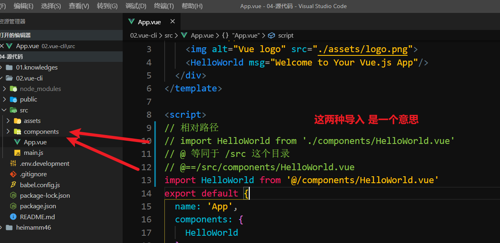
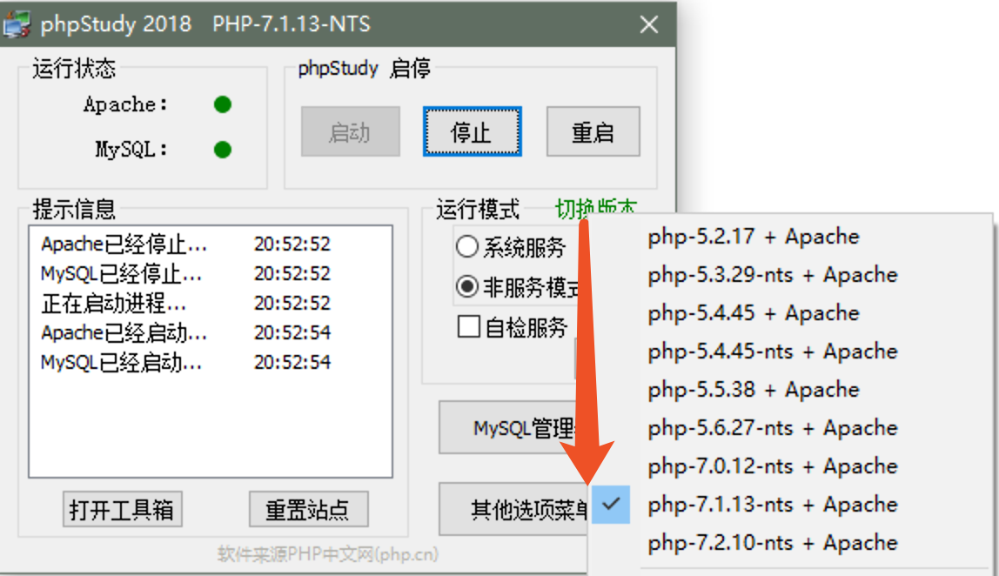

# day01 - 黑马面面

##  课程介绍

> 黑马面面-Vuepc端项目，通过Vue全家桶开发的 `后台管理系统`

项目演示：先运行项目看看里面具体功能

后台管理系统：

1. 登陆
2. 注册

 	3. 数据增删改查管理
 	4. 注册用户的权限管理
      	4. ...

技术栈:

	1. vue
 	2. vue-router
 	3. vuex  共享数据管理
 	4. axios
 	5. Element-ui
 	6. ....

加强对vue基础知识的综合运用与加深，同时了解企业开发中项目开发的流程，通过项目学会一些实际开发过程中的常见知识点。

相关资料:[传送门](https://www.yuque.com/prqozm/roh46t)

1. 2. 

## 项目起步 - 创建并运行

> 早期脚手架不好用，很多公司喜欢自己搭建，现在直接用官方即可，不需要做什么修改

3. 创建本地脚手架 ，vue create 项目名
2. 运行项目   npm run serve

## 项目起步 - 无法创建的折中方案

> 如果实在无法创建成功，用其他资料中的`heimamm`装包并运行吧，还要初始化一下git仓库

在`其他资料`

找到`heimamm`

`npm i`装包，即可运行

注意:

1. 必须装包
2. 初始化git仓库`git init`


## 创建远程仓库

> 除了本地使用git记录以外,远程仓库也保存一份

1. 创建远程仓库这里以`github`为例
   1. `public`或者`privite`根据需求选择
   2. `README.md`  不用勾选,创建项目时已经创建完毕
   3. `.gitignore` 不用勾选,创建项目时已经创建完毕
   4. `license`根据[需求](https://baike.baidu.com/item/开源协议/10642383?fr=aladdin)选择即可,我们这里不勾选


注意:

1. 基本所有的企业开发，都有用到远程仓库
2. 常见的有：
   1. github
   2. gitlab
   3. 码云
   4. 公司内部自己搭建的
   5. 。。。
3. 只要是基于git的远程仓库，操作方法类似

## 项目起步 - 提交到远程仓库

>将本地的代码提交到远程，这样就不用担心本地代码出问题了

命令:

1. 创建好了之后，会提示命令

```bash
git remote add origin https://github.com/AutumnFish/heimamm46.git
git push -u origin master
```

注意:

2. 如果弹出输入用户名和密码的窗口，输入你自己的github 用户信息即可
3. 如果 实在，无法弄好`github`，不影响后续的操作

### 注意点：

1. 如果 实在，无法弄好`github`，不影响后续的操作
2. git命令记不住：
   1. 提交的命令，可以直接`c+v`
   2. 基础的命令一会会回顾，今天下课之后会一起安装一个图形化软件
3. 如果出现了如下提示
   1. 没有配置git的邮箱，和用户名
   2. 执行`git config --global user.email "github邮箱"`
   3. 执行`git config --global user.name "github用户名"`
   4. 再继续执行提交操作
   5. 配置一次即可

4. 如果用的不是 `vue create`创建的项目
   1. 需要自己去
   2. `git init `
   3. ` git add .`
   4. `git commit -m"初始化"`
5. 终端的路径：
   1. 项目的根目录`heimamm/`
   2. 不要去`src`或者其他


## @关键字

> Vue-cli为了让我们在导入文件时路径编写的更为简洁，支持用`@`关键字,他等同于`/src`



注意：@在style中的使用需要`~@`

工作中绝大多数人都是使用`@`

## 项目起步 - 删除默认代码

> 脚手架创建的默认项目有一些用不上的示例代码，咱们来调整一下

git 命令

```bash
查看本地git状态
git status
查看提交的记录信息
git log
git log --oneline
将文件提交到本地暂存区,add与后面.之间有一个空格
git add .
记录此次更改
git commit -m"注释"
提交到远程仓库
git push
```

步骤：

1. 删除`app.vue`中的代码
2. 删除`helloWorld.vue`
3. 提交到暂存区
4. 记录此次操作
5. `-m`的信息不用和老师相同，但是必须要有意义


git 记录

```bash
git add .
git commit -m"项目起步 - 删除默认代码"
```


## 项目起步 - 创建路由，视图目录

> git 默认是不会记录空目录的哦，如果要记录可以添加一个`.gitkeep`文件哦

步骤:

1. 创建`src/router/`文件夹
2. 创建`src/views`文件夹
   1. 专门用来放，路由管理的组件
3. 用git记录
   1. `git add .`
   2. `git commit -m"项目起步 - 创建路由，视图目录"`

注意:

	1. 出于性能考虑，git默认不跟踪空目录
 	2. 必须创建`.gitkeep`文件，不需要写任何内容
 	3. git就回跟踪了


## 项目起步 - Element-ui整合

> 黑马面面中重度使用了Element-ui，咱们先整合进来

[传送门](https://element.eleme.cn/#/zh-CN/component/installation)

步骤:

1. 装包 `npm i element-ui`
2. `main.js`中
   1. 导入库
   2. 导入样式
   3. 注册一下
3. 使用按钮测试
4. git记录
   1. `git add .`
   2. `git commit -m"项目起步 - Element-ui整合"`


注意:

1. 默认的分支是:`master`主分支


git 记录

```bash
git add .
git commit -m"项目起步 - Element-ui整合"
```


## 回顾 - 分支使用

> 刚刚的所有工作都是准备工作，咱们在`master(主分支)`完成，接下来要开始编码了，是在主分支吗？

实际 开发往往二种

1. 建立 个人分支-donghaofei
2. 建立 模块公支-login分支

分支操纵语法

```bash
查看本地分支
git branch
创建分支
git branch 分支名
切换分支
git checkout 分支名
合并分支（当前分支合并某分支）
git merge 分支名
删除分支
git branch -d 分支名
```

概念：

1. 主分支一定要可以稳定运行
2. 其他的逻辑，切换分支编写
3. 写好了之后，合并到主分支，然后删除其他的分支
4. 可以把分支想象为一个和主分支互不干扰的`平行宇宙`

常见用法：

1. 企业中常见用法:
   1. `master`，任何时候他的代码都是稳定可以运行的
   2. 其他的逻辑，在对应的分支编写
   3. 工作中的分工一般是按照模块来分的
      1. 登录模块
         1. 创建`login`分支
         2. 切换到`login`分支
         3. 写代码，记录步骤
         4. 搞定了，测试没问题了
         5. 切换会`master`分支
         6. 合并到`index`分支
         7. 删除`login`分支
      2. 注册模块
      3. 首页模块
      4. 。。。

注意：

1. 工作中，绝对不会在主分支写逻辑代码，都是写好了合并上去的


## 登录模块 - 分支切换

> 接下来我们开始做登录模块，先把分支切换了，登录的英文叫做`login`

步骤:

1. 创建登录(login)分支
   1. `git branch login`
2. 切换到登录分支
   1. `git checkout login`
3. 查看现有分支
   1. `git branch`


注意:

1. `git branch 分支名`
2. `git log`输出记录的内容


git 记录

```bash
git branch login
git checkout login
git branch
```


## 登录模块 - 路由整合

> 先来建立第一个路由规则，登录的路由

步骤：

1. 建立 文件夹router，在router内建立 一个index.js文件，在该index.js写入路由基本步骤
   
   1. 安装vue-router     npm i vue-router
   
   2. 导入vue-router    import VueRouter from 'vue-router'
   
   3. 注册路由  Vue.use(VueRouter)
   
   4. 路由实例化
   
      1. ```js
         const router=new VueRouter({
         routes:[
         //这里编写相应路由规则 
         //写登陆模块规则
             {
                 path:"/login",
                 component:login   //这里login要对应导入登陆模块名字
             }
         ]
         })
         ```
   
   5. 在index.js中输出路由    export default router
   
   6. 在main.js中导入路由     import router from './router/index.js'
   
   7. 挂载到vue实例    new Vue({router})
   
2. 

注意：

1. 路由管理页面的放置位置?
   1. `components/`
      1. 单词是组件的意思
      2. 全局都要使用的组件，放在这里
      3. 小的，功能类
   2. `views/`
      1. 页面，视图
      2. 路由管理的页面都放在这里
2. 组件的`name`属性
   1. 可以省略
   2. 写上之后，更加利于调试
   3. 在`chrome`的`Vue`插件界面十分便捷的进行检索

git 记录

```bash
git add .
git commit -m"登录模块 - 路由整合"
```

## 脚手架中用less

> css预处理可以提高编码效率，在脚手架中如何使用这个呢?

[传送门](https://cli.vuejs.org/zh/guide/css.html#%E9%A2%84%E5%A4%84%E7%90%86%E5%99%A8)

步骤:

1. 装包`npm install -D less-loader less`
   1. npm i less-loader
   2. npm i less
   3. cnpm安装  淘宝镜像
2. 在`style`上设置`lang="less"`


注意:

1. 安装的包 有2个

## 登录模块 - 整体布局

> 直接通过蓝湖，去获取尺寸和基础素材

蓝湖邀请链接:[传送门](https://lanhuapp.com/url/1KeZf-IqHTo)

1. 先创建登陆相应组件`login.vue`

   在view文件夹下建立 login文件夹，在里面创建一个login.vue

2. 完成登陆页的路由配制

   1. 导入login.vue

      ~~~
      // 导入登陆组件
      import login from '@/view/login/login.vue'
      ~~~

   2. 写路由相应配制

      ~~~
          // 路由配制
          routes: [
              {
                  path: "/",
                  component: login
              }
          ]
      ~~~

      

3. 实现登陆页的基本布局

   ~~~vue
   <template>
     <div class="login">
       <div class="left"></div>
       <div class="right">
         
       </div>
     </div>
   </template>
   <script>
   export default {
     name: "login"
   };
   </script>
   <style lang="less">
   .login {
     /* 弹性盒子布局 */
     display: flex;
     /* 水平布局 */
     justify-content: space-around;
     /* 垂直居中 */
     align-items: center;
     height: 100%;
     background: linear-gradient(
       225deg,
       rgba(20, 147, 250, 1),
       rgba(1, 198, 250, 1)
     );
     .left {
       width: 478px;
       height: 550px;
       padding: 42px;
       background-color: #f5f5f5;
     }
   }
   </style>
   ~~~

   


git 记录

```bash
git add .
git commit -m"登录模块 - 整体布局"
```


1. 


## 登录模块 - 标题区域布局

> ui框架不能完成所有的布局，左侧顶部的标题区域，我们自己写

~~~vue
<template>
  <div class="login">
    <div class="left">
      <div class="title">
        
        <span class="titleName">黑马面面</span>
        <span class="titleLine">|</span>
        <span class="titleName2">用户登陆</span>
      </div>
    </div>
    <div class="right">
      
    </div>
  </div>
</template>
<script>
export default {
  name: "login"
};
</script>
<style lang="less">
.login {
  /* 弹性盒子布局 */
  display: flex;
  /* 水平布局 */
  justify-content: space-around;
  /* 垂直居中 */
  align-items: center;
  height: 100%;
  background: linear-gradient(
    225deg,
    rgba(20, 147, 250, 1),
    rgba(1, 198, 250, 1)
  );
  .left {
    width: 478px;
    height: 550px;
    padding: 42px;
    background-color: #f5f5f5;
    .title {
      display: flex;
      align-items: center;
      .titleName {
        font-size: 24px;
        font-weight: 400;
        color: rgba(12, 12, 12, 1);
        margin: 0 15px;
      }
      .titleName2 {
        font-size: 22px;
        font-weight: 400;
        color: rgba(12, 12, 12, 1);
        margin: 0 15px;
      }
    }
  }
}
</style>
~~~


git 记录

```bash
git add .
git commit -m"登录模块 - 标题区域布局"
```


## Element - ui  输入框

> 饿了么除了外卖送得快，框架中也提供了很多可用的组件，比如输入框

[输入框传送门](https://element.eleme.cn/#/zh-CN/component/input#dai-icon-de-shu-ru-kuang)

[图标传送门](https://element.eleme.cn/#/zh-CN/component/icon)

```html
 <!-- 挂载的元素 -->
    <div id="app">
        <el-input placeholder="请输入用户名" prefix-icon="el-icon-user" v-model="input1">
        </el-input>
        <el-input show-password placeholder="请输入密码" prefix-icon="el-icon-lock" v-model="input2">
        </el-input>
        <el-input placeholder="请输入验证码" prefix-icon="el-icon-key" v-model="input3">
        </el-input>
    </div>
```

注意：

1. 图标直接去element-ui的图标库检索即可

## Element - ui 栅格系统

> 如果想要将一行分为若干份，可以使用饿了么提供的栅格系统哦

[传送门](https://element.eleme.cn/#/zh-CN/component/layout)

```html
 <el-row>
        <el-col class="item" :span="8"></el-col>
        <el-col class="item2" :span="8"></el-col>
        <el-col class="item3" :span="8"></el-col>
        <el-col class="item4" :span="8"></el-col>
        <!-- 3格 数字设置为几 -->
  </el-row>
```

注意：

1. 一行24份
2. 装不下了，会自动换行

## Element - ui 文字链接

> 蓝色的文字自己写样式并不难，但是饿了么已经提供了

[传送门](https://element.eleme.cn/#/zh-CN/component/link#link-wen-zi-lian-jie)

```html
<el-link type="primary">用户协议</el-link>
必须要同意
<el-link type="primary">隐私条款</el-link>
```

注意：

1. 解析完毕之后，是a标签包裹了 `span`

## Element - ui 多选框

> 复选框饿了么也有哦

[传送门](https://element.eleme.cn/#/zh-CN/component/checkbox#checkbox-duo-xuan-kuang)

```html
 <el-checkbox v-model="checked">晚上要不要吃辣椒！</el-checkbox>
```


注意：

1. true是勾选
2. false是取消勾选
3. 修改内容即可实现调整文本

## Element - ui 按钮

> 按钮这么常用的组件 饿了么不可能不提供哈

[传送门](https://element.eleme.cn/#/zh-CN/component/button#button-an-niu)

```html
<el-button @click="clickMe" class="my-btn" type="primary">登录</el-button>
<el-button class="my-btn" type="primary">注册</el-button>
```


注意：

1. 样式的修改，不要直接改自带的类名
2. 添加自己的类名来修改，避免出现覆盖默认样式的问题

## Element - ui 表单

> 与其自己组合表单元素，不如弄一个饿了么提供的现成的，然后调整为自己要的

[传送门](https://element.eleme.cn/#/zh-CN/component/form#dian-xing-biao-dan)

```html
    <!-- 挂载的元素 -->
    <div id="app">
        <el-form ref="form" :model="form" label-width="80px">
            <el-form-item >
                <el-input v-model="form.name"></el-input>
            </el-form-item>
            <el-form-item >
                <el-checkbox-group v-model="form.type">
                    <el-checkbox label="美食/餐厅线上活动" name="type"></el-checkbox>
                </el-checkbox-group>
            </el-form-item>
 

            <el-form-item>
                <el-button type="primary" @click="onSubmit">登录</el-button>
                <el-button>取消</el-button>
            </el-form-item>
        </el-form>
    </div>
    <!-- 开发环境版本，包含了有帮助的命令行警告 -->
    <script src="https://cdn.jsdelivr.net/npm/vue/dist/vue.js"></script>
    <!-- 引入组件库 -->
    <script src="https://unpkg.com/element-ui/lib/index.js"></script>
    <script>
        const app = new Vue({
            el: "#app",
            data: {
                form: {
                    name: '',
                    region: '',
                    date1: '',
                    date2: '',
                    delivery: false,
                    type: [],
                    resource: '',
                    desc: ''
                }
            }
        })
    </script>
```


## 补充 - sourceTree安装

> sourceTree作为十分流行的图形化git工具，我们一起来安装一下，明天开始用它来简化git操作，不写命令了

1. 安装软件
   1. 双击`SourceTreeSetup-2.5.5.exe`进行安装

2. 使用补丁
   1. 将`accounts.json`拷贝到你的用户名录下
   2. 路径为:`C:\Users\你的用户名\AppData\Local\Atlassian\SourceTree`
   3. 如果能够成功注册账户并登陆，这步可以跳过，需要`科学上网`

## 补充-本地解决跨域小方法

> 本地电脑解决跨域的简单方法

1.在电脑上新建一个目录，例如：C:\MyChromeDevUserData

2.在属性页面中的目标输入框里加上  --disable-web-security --user-data-dir=C:\MyChromeDevUserData，--user-data-dir的值就是刚才新建的目录。

3.点击应用和确定后关闭属性页面，并打开chrome浏览器。

再次打开chrome，发现有“--disable-web-security”相关的提示，说明chrome又能正常跨域工作了。

## 补充 -sourceTree 基本使用

> 相比于命令行模式，使用图形化工具重点只需要记住使用步骤即可，更为简便

## 本地接口部署

1. 安装`phpStudy2018`

1. 1. 版本需要是这个，低版本中无法设置php的版本信息
   2. 解压之后安装到任意非中文目录

1. 1. 如果已经安装这一步可以省略

1. 打开`phpStudy2018`
   1. 1. 安装完毕提示的内容全部允许
   2. 1. 如果双击提示已经打开，在任务栏找
   3. 1. 确保`apache`和`mysql`都运行起来了
   4. 1. 

1. 选择版本

1. 1. 在`phpStudy2018`主界面选择`切换版本`
   2. 选择`php-7.1.13-nts + Apache`
   3. 因为开发的语言是这个版本
   4. 

1. 

1. 拷贝接口

1. 1. 在主界面点击`其他选项菜单->网站根目录`
   2. 进入到`www`目录
   3. 将项目克隆到这个目录
   4. 项目的git地址: https://gitee.com/phper_leo/heimamm.git


```
git clone https://gitee.com/phper_leo/heimamm.git
```

1. 1. 
   2. 

1. 项目安装

a. 在确保主界面的MySQL和Apache都启动成功的情况下

b. 打开浏览器访问http://127.0.0.1/heimamm/public/

c.自动引导到安装界面


d. 数据库密码，如果没改是`root`，如果改了输入你改了的

1. 测试访问
   1. 1. 在确保主界面的`MySQL`和`Apache`都启动成功的情况下
   2. 1. 打开浏览器访问`http://127.0.0.1/heimamm/public/captcha?type=login`
   3. 1. 能看到验证码说明开启成功
   4. 1. 

1. 缺少`VC`

1. 1. 如果在安装的时候提示缺少`vc`
   2. 根据提示的内容进行安装即可