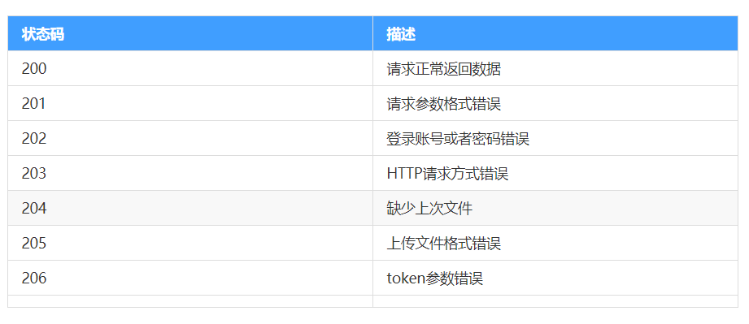

# day04 - 黑马面面

## 反馈

1.	董老师讲课很细心,感觉吸收得还不错
1.	太难了，我的头发家族快灭族了，大毛二毛走好
1.	偶然性亢奋，持续性怀疑人生中


## 回顾

1. 环境变量

   1. 开发环境
      1. 建立 一个.env.development文件
      2. 在里面就可以创建开发环境使用的变量了
      3. 变量有一个规则  VUE_APP_开头
      4. npm run serve
   2. 生产环境
      1. 建立 一个.env.production文件
      2. 在里面就可以创建开发环境使用的变量了
      3. 变量有一个规则  VUE_APP_开头
      4. npm run build

2. el-upload

   1. action:上传的接口地址
   2. name对应上传文件的参数
   3. show-file-list:是否显示上传文件列表
   4. before-upload:上传前的回调函数
      1. file文件对象
      2. 文件的type
      3. 文件的size
   5. on-success上传成功后的回调函数
      1. res:调用上传接口的返回结果
      2. file    file.row文件的file对象
   6. 注意点：文件上传它不能主动触发校验，需要手动触发
      1. el-form上定义一个ref值
      2. el-form-item上定义相应的prop（需要验证的值）
      3. 进行单独验证this.$refs.值.validateField("需要验证的值“，error=>{})

3. 自定义校验规则

   1. el-form   rules绑定

   2. data里面定义相应

   3. ~~~
      rules:{
      username:[
      {required:true,message:"出错信息",trigger:"blur/change"},
      {validator:(rule,value,callback){
      rule:"规则"，
      value:"当前校验项的值"
      callback:
          callback()什么都不传就是校验通过
          callback("出错信息")不通过且显示相应的出错信息
      }}
      ]
      }
      ~~~

4. 列偏移

   1. el-row:行
   2. el-col:列   :span="值   offset="偏移量”

5. axios的加深

   1. 创建一个axios的副本

      1. ~~~
         import axios from "axios"
         创建副本：
            let interface=axios.create({
            //自定义一些相应配制信息
            baseURL:"基地址",
            headers
            timeout.....,
            withCredentials:true
            })
            interface它就代表了创建好的定义了一些自定义属性的axios副本
         ~~~

      2. 请求拦截/返回拦截

         1. ~~~
            请求拦截，在请求前面可以拦截下来自定义处理一些事件
            interface.interceptors.request.use(function(config){
            //发送前的处理
            return config
            },function (error){
            return Promise.reject(error)
            })
            返回数据拦截
            interface.interceptors.response.use(function(response){
            //返回的全部数据response
            return response
            },function (error){
            return Promise.reject(error)
            })
            
            ~~~

            


## 注册模块 - 短信获取倒计时

>为了防止用于频繁点击获取 验证码，加一些前端 限制 

1. 首先定义一个倒计时时间  totalTime=60
2. 点击 获取 验证码调用接口前进行倒计时，setInterval    totalTime--
3. 当totalTime<0   清除倒计时clearInterval     totalTime=60
4. 限制 一下按钮点击功能在相应按钮上加上一个disabled=''totalTime!=60"

~~~js
        // 倒计时功能
        this.totalTime--;
        let _interval = setInterval(() => {
          this.totalTime--;
          if (this.totalTime <= 0) {
            clearInterval(_interval);
            this.totalTime = 60;
          }
        }, 1000);
~~~

~~~html
      <!-- 验证码 -->
      <el-form-item label="验证码" prop="rcode">
        <el-row>
          <el-col :span="16">
            <el-input v-model="form.rcode"></el-input>
          </el-col>
          <el-col :span="7" :offset="1">
            <el-button @click="getRecode" :disabled="totalTime!=60">
              获取验证码
              <span v-if="totalTime!=60">{{totalTime}}</span>
            </el-button>
          </el-col>
        </el-row>
      </el-form-item>
~~~


## export基本用法

对象解构赋值

~~~js
{a}={a:10}
a=10
{a}={b:20}
a=?
{a=100}={a:20}
a=?
//当他有一个默认值且不为undefined时，解构赋值时的值为undefined它会取它的默认值
~~~

在js中使用export 

- export { a}    export {b}   
- 它是与import对应使用   import {a}  from "export js"
- 它们二个之间就是一个解构赋值     {a}  =    {a,b}
- 注意点：命名方面需要一样，export可以写多个


## 注册模块 - 注册接口抽取

> 如果数据的校验能够通过，那么就把数据提交到服务器即可，这里涉及到接口的调用，将他抽取为方法，方便调用

步骤:

1. 根据接口文档，抽取注册接口为方法
2. 请求参数，作为方法的参数传递
3. 暴露出来方便后续调用
4. 位置`/api/register.js`

~~~js
import axios from "axios"
const instance = axios.create({
    baseURL: process.env.VUE_APP_URL,
    withCredentials: true
})
// 添加请求拦截器
instance.interceptors.request.use(function (config) {
    window.console.log(config)
    // 在发送请求之前做些什么
    return config;
}, function (error) {
    // 对请求错误做些什么
    return Promise.reject(error);
});
// 添加响应拦截器
instance.interceptors.response.use(function (response) {
    console.log('响应拦截器')
    console.log(response)
    // 可以对响应的值进行一些处理
    // return response;
    return response.data
}, function (error) {
    // 可以在这里对错误进行一些处理
    return Promise.reject(error);
});
function sendsms(data) {
    return instance({
        url: "/sendsms",
        method: "post",
        data: data,
    })
}
function register(data) {
    return instance({
        url: "/register",
        method: "post",
        data,
    })
}
export { sendsms, register }

~~~

## 注册模块-注册功能实现

>使用刚才定义的api注册方法，完成注册功能

1. 导入相应注册api方法

   ~~~js
   import { sendsms, register } from "@/api/register.js";
   ~~~

2. 在点击确定按钮时，在表单验证通过了后进行注册接口调用

   调用接口当成功时，清除表单数据，同时关闭弹窗，提示注册成功

   ~~~js
       // 确定按钮点击事件
       submitClick() {
         this.$refs.form.validate(result => {
           if (result) {
             register(this.form).then(res => {
               window.console.log("注册返回信息:", res);
               if (res.code == 200) {
               //提示注册成功
                 this.$message.success("注册成功");
                 //关闭弹窗
                 this.dialogFormVisible = false;
               }
             });
           }
         });
       },
   ~~~
   


## 关闭页面时，清空表单数据

>往往实际使用中，在关闭弹窗时，我们需要把数据置空

关闭弹窗，它其实一定会修改一个值，就是弹窗的:visible.sync的值，

其实我们只需要对该值做个watch处理，就可以了

watch观察某个值改变了，可以做一些相应处理

~~~js
  watch: {
    dialogFormVisible(newVal) {
      if (newVal == false) {
        // 清空表单
        this.$refs.form.resetFields();
        // 将图片置空
        this.imageUrl = "";
      }
    }
  },
~~~

## api全局处理响应错误拦截

> 根据全局的api错误编码提示，在响应拦截全局处理相应错误



1. 在js中使用element组件

   1. 导入相应组件

      ~~~
      import { Message } from 'element-ui'
      ~~~

   2. 调用相应组件，这里的`Message`相当于`this.$message`

      ~~~
      Message.error("请求参数格式错误！")
      ~~~

2. 处理接口响应拦截

   ~~~js
   /*
   接口调用；
   1：安装axios   npm i axios
   2:导入axios    import axios from 'axios
   3:使用axios调用接口
   */
   
   import axios from 'axios'
   import { Message } from 'element-ui';
   var instance = axios.create({
       baseURL: process.env.VUE_APP_URL,   //设置基地址
       withCredentials: true //跨域照样协带cookie
   });
   // 添加请求拦截器
   instance.interceptors.request.use(function (config) {
       // 在发送请求之前做些什么
       return config;
   }, function (error) {
       // 对请求错误做些什么
       return Promise.reject(error);
   });
   
   // 添加响应拦截器
   instance.interceptors.response.use(function (response) {
       // 对响应数据做点什么
       if (response.data.code == 200) {
           // 因为返回数据里面axios帮我们额外的包了一层data但实际我们基本不用，所以我们把它干掉
           return response.data;
       } else {
           // 提示用户错误
           // 出错了我们还有必要返回数据出去吗？
           //抛出一个错误，不要让后面代码执行
           //只要return了一个Promise.reject("error")后面的接口的.then就不会执行了
           Message.error(response.data.message)
           return Promise.reject("error");
       }
       // switch (response.data.code) {
       //     case 200:
       //         return response;
       //     case 201:
   
       //         Message.error(response.data.message)
       //         // 出错了我们还有必要返回数据出去吗？
       //         //抛出一个错误，不要让后面代码执行
       //         window.console.log("抛错误前处理:", response)
       //         return Promise.reject("error");
   
       // }
   
       // return response;
   }, function (error) {
       // 对响应错误做点什么
       return Promise.reject(error);
   });
   
   
   function getPhoneCode(data) {
       return instance({
           url: "/sendsms",
           method: "post",
           data      //data: data   
       })
   }
   
   function register(data) {
       return instance({
           url: "/register",
           method: "post",
           data      //data: data   
       })
   }
   
// export default getPhoneCode
   // export default我们看不出来页面用了些什么接口，它一个js只能使用一个export default
   //
   export { getPhoneCode, register }
   ~~~
   
   

## 登录模块 - 分支切换

> 注册模块的逻辑搞定啦，分支切换，合并，删除来一波

~~~
git add .
git commit -m"注册功能完成"
git push
git checkout master
git merge register
git push
切换到登陆模块，如果前面删除了登陆的  创建一个登陆模块
git checkout login    /  git branch login    git checkout login
如果前面没删除的话最好合并一个master
在login分支合并一下master
git merge master


~~~

## 登录模块 - 验证码获取

> 用户登录也是需要获取验证码，注意别和注册的验证码弄混了哦

[传送门](https://www.showdoc.cc/538567623707717?page_id=3186586503196977)

步骤:

1. 进入页面 获取 `登录验证码`

   1. 定义登陆验证码src地址

      ~~~
      code: process.env.VUE_APP_URL + "/captcha?type=login",
      ~~~

   2. 将该地址用于登陆验证码处

      ~~~
          
      ~~~

      

2. 点击刷新

   1. 点击事件绑定

      ~~~js
      
      ~~~

      

   2. 使用时间戳，或者随机数重新生成验证码

      ~~~js
          //验证码点击 事件
          codeClick() {
            this.code =
              process.env.VUE_APP_URL + "/captcha?type=login&t=" + Date.now();
          }
      ~~~

      

## 登录模块 - 自定义校验规则

> 登录页面的手机号验证逻辑和注册页面一样，c+v来一波

1. 完成相应数据绑定 

2. 在需要校验的项上加上prop

3. 然后在el-form上定义一个rules  

4. 在data里面写相应规则

   1. ~~~
      rules:{
      prop值：[
      {required:true,message:"出错信息",trigger:"blue/change"},
      {validator:(rule,value,callback)=>{
      rule:规则
      value:当前校验项的值，
      callback("错误信息")
      callback()  //正常通过
      }}
      ],
      }
      ~~~

      

1. 手机号

   ~~~js
           phone: [
             { required: true, message: "请填入手机号！", trigger: "change" },
             {
               validator: (rule, value, callback) => {
                 let _reg = /^(0|86|17951)?(13[0-9]|15[012356789]|166|17[3678]|18[0-9]|14[57])[0-9]{8}$/;
                 if (_reg.test(value)) {
                   callback();
                 } else {
                   callback("请正确输入手机");
                 }
               },
               trigger: "change"
             }
           ],
   ~~~

   

2. 用户协议，注意用户协议这里的值只有当它为true时才能通过

   ~~~js
           isCheck: [
             { required: true, message: "请勾选选协议", trigger: "change" },
             {
               validator: (rule, value, callback) => {
                 if (value === true) {
                   callback();
                 } else {
                   callback("请勾选选协议");
                 }
               },
               trigger: "change"
             }
           ]
   ~~~

   

## 登录模块 - 登录接口抽取

> 登录页面的接口，为了方便管理我们也抽取为一个文件，拆分的文件虽然多，但是后期维护起来会更加方便，尤其是名字是对应的

[传送门](https://www.showdoc.cc/538567623707717?page_id=3184415727281421)

步骤:

1. 创建`/api/login.js`文件

2. 内部抽取登录接口，仿`register.js`

3. 由于login与register其实它们都应该有共用的create与请求和响应拦截，其实我们共用代码是可抽离 出来成一个单独js，这种公用方法我们一般放到一个单独文件夹里面`utils/request.js`,然后输出`instance`,在相应api文件里导入该`request.js`就可使用`axios`了

   ~~~js
   /*
   接口调用；
   1：安装axios   npm i axios
   2:导入axios    import axios from 'axios
   3:使用axios调用接口
   */
   
   import axios from 'axios'
   import { Message } from 'element-ui';
   var instance = axios.create({
       baseURL: process.env.VUE_APP_URL,   //设置基地址
       withCredentials: true //跨域照样协带cookie
   });
   // 添加请求拦截器
   instance.interceptors.request.use(function (config) {
       // 在发送请求之前做些什么
       return config;
   }, function (error) {
       // 对请求错误做些什么
       return Promise.reject(error);
   });
   
   // 添加响应拦截器
   instance.interceptors.response.use(function (response) {
       // 对响应数据做点什么
       if (response.data.code == 200) {
           // 因为返回数据里面axios帮我们额外的包了一层data但实际我们基本不用，所以我们把它干掉
           return response.data;
       } else {
           // 提示用户错误
           // 出错了我们还有必要返回数据出去吗？
           //抛出一个错误，不要让后面代码执行
           //只要return了一个Promise.reject("error")后面的接口的.then就不会执行了
           Message.error(response.data.message)
           return Promise.reject("error");
       }
       // switch (response.data.code) {
       //     case 200:
       //         return response;
       //     case 201:
   
       //         Message.error(response.data.message)
       //         // 出错了我们还有必要返回数据出去吗？
       //         //抛出一个错误，不要让后面代码执行
       //         window.console.log("抛错误前处理:", response)
       //         return Promise.reject("error");
   
       // }
   
       // return response;
   }, function (error) {
       // 对响应错误做点什么
       return Promise.reject(error);
   });
   export default instance
   ~~~
   
register.js相应调整
   
~~~js
   import instance from '@/utils/request.js'
   function sendsms(data) {
       return instance({
           url: "/sendsms",
           method: "post",
           data: data,
       })
   }
   function register(data) {
       return instance({
           url: "/register",
           method: "post",
           data,
       })
   }
   export { sendsms, register }
   
   ~~~
   
login.js相应方法定义
   
~~~js
   import instance from '@/utils/request.js'
   function toLogin(data) {
       return instance({
           url: "/login",
           method: "post",
           data
       })
   }
   export { toLogin }
   ~~~
   


## 登录模块 - 用户登录

> 在点击登录表单校验通过的时候，还需要判断是否勾选哦，如果都没问题，就可以提交数据了，根据响应的结果，提示用户，或者进行页面的跳转，服务器好像响应的内容中有关键信息哦

步骤:

1. 导入登陆api方法

   ~~~js
   import { toLogin } from "@/api/login.js";
   ~~~

   

2. 校验数据

3. 都验证通过，提交数据
   1. 对：
      1. 提示用户
      2. 保存一些数据
      3. 页面的跳转
   2. 错：提示用户(已在相应的请求拦截处理了)

~~~js
    //   登陆点击
    loginClick() {
      window.console.log(this.form);
      this.$refs.form.validate(result => {
        window.console.log(result);
        if (result) {
          toLogin(this.form).then(res => {
            window.console.log(res);
            this.$message.success("登陆成功");
          });
        }
      });
    },
~~~


正常登陆后，我们需要保存一些登陆的信息，在其它页面都可以使用，我们需要保存到localstorage以便其它页面都可正常使用

## 登录模块 - token函数抽取

> 上一步服务器返回了token，我们也保存了，其他页面可能需要获取，可能需要删除，为了方便调用，咱们把他抽取为函数，避免因为`key`写错了出现问题

步骤:

1. `/src/utils`下创建token的工具函数`token.js`
2. 内部抽取的三个方法
   1. `setToken`
   2. `getToken`
   3. `removeToken`

~~~js
// 保存token
function saveToken(val) {
    window.localStorage.setItem('token', val)
}
// 获取token
function getToken(name = 'token') {
    return window.localStorage.getItem(name)
}
// 删除token
function removeToken(name = 'token') {
    window.localStorage.removeItem(name)
}
export { saveToken, getToken, removeToken }

~~~

## 登陆模块-登陆后保存token

>登陆后，接口给了一个token我们，我们是需要保存起来的，它相当于一个登陆人的令牌

1. 在登陆页面导入相应token保存方法

   ~~~js
   import { getToken } from "@/utils/token.js";
   ~~~

2. 登陆成功后，调用该方法保存登陆后的token

   ~~~js
       //   登陆点击
       loginClick() {
         window.console.log(this.form);
         this.$refs.form.validate(result => {
           window.console.log(result);
           if (result) {
             toLogin(this.form).then(res => {
               window.console.log(res);
               saveToken(res.data.token);
               this.$message.success("登陆成功");
             });
           }
         });
       },
   ~~~

   

## 分支处理

~~~
git add .
git commit -m"登陆完成"
git push
git checkout master
git merge login
git push
~~~

创建一个home

git checkout -b home

## Element - ui 布局容器

> 常见的经典布局，Element-ui已经封装好了，我们直接拿来用即可

[传送门](https://element.eleme.cn/#/zh-CN/component/container)

```html
<head>
    <meta charset="UTF-8">
    <meta name="viewport" content="width=device-width, initial-scale=1.0">
    <meta http-equiv="X-UA-Compatible" content="ie=edge">
    <title>Document</title>
    <!-- 引入样式 -->
    <link rel="stylesheet" href="https://unpkg.com/element-ui/lib/theme-chalk/index.css">
    <style>
        html,body{
            height: 100%;
            margin: 0;
            padding: 0;
        }
        #app{
            height: 100%;
        }
        .my-container{
            height: 100%;
        }
        .my-header{
            background-color: pink;
        }
        .my-aside{
            background:#0094ff;
        }
        .my-main{
            background-color: yellowgreen;
        }
    </style>
</head>

<body>
    <!-- 挂载的元素 -->
    <div id="app">
        <el-container class='my-container'>
            <el-header class='my-header'>Header</el-header>
            <el-container>
                <el-aside width="200px" class='my-aside'>Aside</el-aside>
                <el-main class='my-main'>Main</el-main>
            </el-container>
        </el-container>

    </div>
    <!-- 开发环境版本，包含了有帮助的命令行警告 -->
    <script src="https://cdn.jsdelivr.net/npm/vue/dist/vue.js"></script>
    <!-- 引入组件库 -->
    <script src="https://unpkg.com/element-ui/lib/index.js"></script>
    <script>
        const app = new Vue({
            el: "#app",

        })
    </script>

</body>
```


## 首页模块 - 整体布局

> 使用Element-ui的布局容器将页面进行拆分

步骤:

1. 创建`/views/home/layout.vue`组件
2. `/router/router.js`定义规则，把首页和规则关联
3. 首页中，使用布局容器区分，上，左，右三个区域
4. 通过样式让他撑开，变为整个屏幕

layout.vue的代码

```html
<template>
  <el-container class="my-container">
    <el-header class="my-header">Header</el-header>
    <el-container>
      <el-aside width="200px" class="my-aside">Aside</el-aside>
      <el-main class="my-main">Main</el-main>
    </el-container>
  </el-container>
</template>

<script>
export default {};
</script>

<style lang="less">
.my-container{
    height: 100%;
    .my-header{
        background: hotpink;
    }
    .my-aside{
        background: yellowgreen;
    }
    .my-main{
        background: #0094ff;
    }
}
</style>

```

router.js

~~~js

// 1：安装路由插件  npm i vue-router
// 2:导入路由  
import VueRouter from 'vue-router'
// 3:注册路由   
import Vue from "vue"
import login from "@/view/login/login.vue"
import layout from "@/view/home/layout.vue"
Vue.use(VueRouter)
// 4:路由实例化
const router = new VueRouter({
    routes: [
        {
            path: "/",
            component: login
        },
        {
            path: "/layout",
            component: layout
        },
    ]
})
//     输出出去   
export default router 
~~~

修改登陆页，登陆成功后跳转至此页面

~~~js
this.$router.push("/layout");
~~~


## 首页模块 - 顶部布局

> 顶部的布局，可以使用弹性十分方便来实现

步骤：

1. 开启弹性布局
2. 两边顶格
3. `M`可以下载贴图，其他的都是自己写的
4. 图标用的是`element-ui`的图标

这部分直接参照设计图即可了，

html部分

~~~html
  <el-container class="home">
    <el-header class="header">
      <div class="left">
        <i class="el-icon-s-fold setwh"></i>
        
        <p class="title">黑马面面</p>
      </div>
      <div class="right">
        
        <span class="name">李XX,您好</span>
        <el-button type="primary" size="mini">退出</el-button>
      </div>
    </el-header>
    <el-container>
      <el-aside width="200px" class="aside">Aside</el-aside>
      <el-main class="main">Main</el-main>
    </el-container>
  </el-container>
~~~

css部分

~~~less
<style lang='less'>
.home {
  .header {
    background: rgba(232, 233, 236, 1);
    display: flex;
    justify-content: space-between;
    align-items: center;
    height: 60px;
    .left {
      display: flex;
      align-items: center;
      .setwh {
        font-size: 24px;
        color: #000;
      }
      .logo {
        width: 33px;
        height: 28px;
        margin: 0 15px;
      }
      .title {
        width: 92px;
        height: 22px;
        font-size: 22px;
        font-weight: bold;
        color: rgba(73, 161, 255, 1);
      }
    }
    .right {
      display: flex;
      align-items: center;
      .avator {
        width: 43px;
        height: 43px;
        border-radius: 50%;
      }
      .name {
        color: #3f3f3f;
        margin-left: 15px;
        margin-right: 20px;
      }
    }
  }
  .aside {
    background-color: orange;
  }
  .main {
    background-color: blue;
  }
}
</style>
~~~


## 首页模块 - 接口抽取

> 之前是调用一个接口就抽取一个，这次我们一次性首页的接口都抽取完毕

[传送门](https://www.showdoc.cc/538567623707717?page_id=3190467252759447)

步骤:

用户信息展示 

1. 定义接口
   1. 创建一个api/home.js
   2. 写相应的api方法
2. 获取用户信息
   1. 在哪个生命周期  created
   2. 导入api相应方法
   3. 获取用户信息


1. 创建`/src/api/home.js`文件
2. 抽取用户信息接口
3. 抽取退出接口

~~~js
import instance from '@/utils/request.js'
import { getToken } from '@/utils/token.js'
function getUserInfo() {
    return instance({
        url: "/info",
        headers: {
            token: getToken('token')
        }
    })
}
function logout() {
    return instance({
        url: "/logout",
        headers: {
            token: getToken('token')
        }
    })
}
export { getUserInfo, logout }
~~~

后面接口基本都是要求有token才可调用，那我们可以将token的处理写到请求拦截里面去

在请求拦截里加入token处理

1. 在`utils/request.js`中导入`getToken`方法`

   ~~~js
   import {  getToken } from "@/utils/token";
   ~~~

2. 在请示拦截里加入token处理

~~~js
// 添加请求拦截器
instance.interceptors.request.use(function (config) {
    // 在发送请求之前做些什么
    if (getToken()) {
        config.headers.token = getToken()
    }
    return config;
}, function (error) {
    // 对请求错误做些什么
    return Promise.reject(error);
});
~~~

再删除home.js相应api方法的token请求头的处理


## 首页模块 - 用户信息获取

> 进入首页之后，获取用户信息，并渲染到页面上，获取的时间要尽可能早哦

步骤：

1. 首页导入接口

   ~~~js
   import { getUserInfo } from "@/api/home";
   ~~~

   

2. created中调用接口

   ~~~
     created() {
       getUserInfo().then(res => {
         window.console.log("用户信息:", res);
       });
     }
   ~~~

   

3. 数据获取到之后渲染到页面上即可

~~~js
  data() {
    return {
      userInfo: ""
    };
  },
  created() {
    getUserInfo().then(res => {
      this.userInfo = res.data;
      this.userInfo.avatar = process.env.VUE_APP_URL + "/" + res.data.avatar;
      window.console.log("用户信息:", res);
    });
  }
~~~

html

~~~html
        
        <span class="name">{{userInfo.username}},您好</span>
        <el-button type="primary" size="mini">退出</el-button>
~~~


## 在js中使用路由router

>有时候我们也是需要在外部js使用路由跳转的，这时候我们就得导入该路由的实例

在js中导入路由的实例对象

~~~
import router from '@/router/router.js'
//这里的router相当于this.$router
~~~

实现路由跳转

~~~
import router from '@/router/router.js'
router.push("相应的path")
~~~


## 优化全局响应拦截token参数错误

>当token不存在或者超时不正确等情况时，我们进入此页面应该回到登陆页，那要怎么处理呢？

1. 在token响应拦截做出处理，当接口报错206时

   1. 删除本地存储token

      1. 导入删除token方法

         ~~~
         import { getToken, removeToken } from '@/utils/token.js'
         ~~~

      2. 在响应拦截报206时做出相应处理

   2. 跳转至登陆页

      ~~~js
              case 206:
                      Message.error("token参数错误")
                      // 删除本地token
                      removeToken("token");
                      // 跳转至登陆页
                      router.push('/')
                      break
      ~~~

      