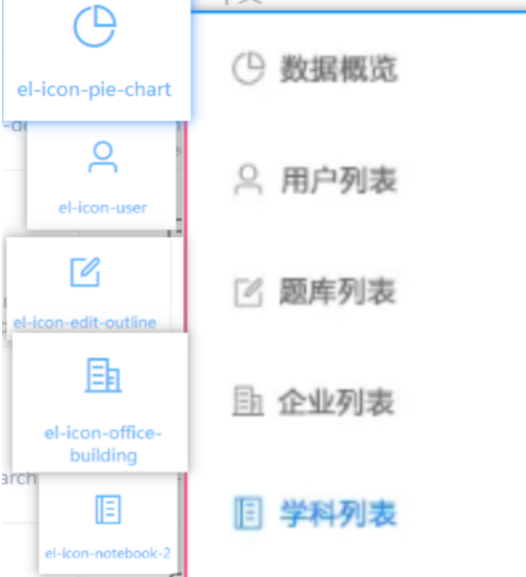
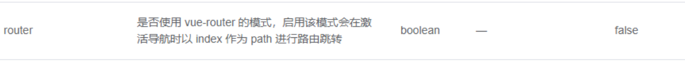

# day05 - 黑马面面

## 反馈

1.	今天有点懵,那么多文件抽取来抽取去的,老师能小小总结几句每个文件什么用处吗
1.	好像都懂了，整合在一起又不懂了。这代码的心思真难猜
   1.	跟着老师一起写，跟着笔记写，
   1.	这个阶段学完了，三天缓冲一天，那一天最好把这三天的东西独立写出来一下
   1.	整个阶段学完，再独立写一次
1.	恭喜浩飞老师获得”找bug小能手”称号
1.	没思路，不知道下一步是干嘛。回头看之前的，不知道这一步又是在干嘛。大概是凉了
   1.	api不需要我们去怎么思考 主体是记住这种做法
1.	感觉进度有点快，一旦卡bug了，后面的就有点慌了。。。
   1.	知识点东西较多，而且还得考虑项目逻辑
   1.	一出bug,一有时间立马找我


## 回顾

api抽取

1. api相应方法
2. api请求拦截响应拦截等抽取

token.js抽取


## 昨天易错的点

1. export default     export     import之间使用

   1. export  与import 
   2. export  { a}      import { a}  
      1. 注意点，export 的东西,import 使用时要有{}
   3. export default  与import 
      1. export  default 的东西import不需要{}

   

2. token.js使用

   1. ~~~
      function getToken(name = "token") {
          return window.localStorage.getItem(name)
      }
      一定要注意获取token要加return
      ~~~

      

   

3. 验证码路径问题

   1. 把短信验证码用到了登陆验证码页面

4. git操作

   1. 平时一定要注意提交
   2. 不要频繁二分支写代码，这分支写一点那分写一点
   3. 建议你们自己再到github创建一个仓库，用于熟悉一下git命令
   4. 基本你们使用不会超过15句


## 在js中使用路由router

>有时候我们也是需要在外部js使用路由跳转的，这时候我们就得导入该路由的实例

在js中导入路由的实例对象

~~~
import router from '@/router/router.js'
//这里的router相当于this.$router
~~~

实现路由跳转

~~~
import router from '@/router/router.js'
router.push("相应的path")
~~~


## 优化全局响应拦截token参数错误

>当token不存在或者超时不正确等情况时，我们进入此页面应该回到登陆页，那要怎么处理呢？

1. 在token响应拦截做出处理，当接口报错206时

   1. 删除本地存储token

      1. 导入删除token方法

         ~~~
         import { getToken, removeToken } from '@/utils/token.js'
         ~~~

      2. 在响应拦截报206时做出相应处理

   2. 跳转至登陆页

      ~~~js
       else if (response.data.code == 206) {
              // token出错处理
              Message.error(response.data.message)
              // 跳至登陆页
              router.push("/")
              // 清理掉token
              removeToken()
              return Promise.reject("error");

          }
      ~~~
      
      

## 获取用户信息前的token检验

>有时候拿到网址就直接访问home页面，一进来它连token都没我们就调用接口耗性能

1. 判断token是否存在，

   1. 存在，获取用户信息
   2. 不存在，跳转至登陆页

   ~~~js
   import { getUserInfo } from "@/api/home";
   import { getToken, removeToken } from "@/utils/token.js";
   export default {
     data() {
       return {
         userInfo: ""
       };
     },
     created() {
       //   获取token，如果没取到值
       if (!getToken()) {
         // 跳至登陆页
         this.$router.push("/");
         return;
       }
       getUserInfo().then(res => {
         this.userInfo = res.data;
         this.userInfo.avatar = process.env.VUE_APP_URL + "/" + res.data.avatar;
         window.console.log("用户信息:", res);
       });
     }
   };
   ~~~

   

   

## 登陆模块优化

>当已登陆用户直接打开登陆页时，让用户直接跳入首页

进入登陆页就进行判断 ，看token是否存在，

- 存在，跳入首页
- 不存在，不做任何处理

1. 导入token获取方法

   ~~~js
   import { saveToken, getToken } from "@/utils/token.js";
   ~~~

2. 在created里进行判断处理

   ~~~js
     created() {
       // 验证token是否存在
       if (getToken()) {
         // 存在，跳入首页
         this.$router.push("/home");
       }
     },
   ~~~

3. 登陆成功跳入首页

   ~~~js
       // 登陆点击
       loginClick() {
         // 登陆全局校验
         this.$refs.form.validate(result => {
           // 登陆接口调用
           if (result == true) {
             toLogin(this.form).then(res => {
               this.$message.success("登陆成功");
               window.console.log("登陆信息：", res);
               // 保存token
               saveToken(res.data.token);
               this.$router.push("/home");
             });
           }
         });
       },
   ~~~

   


## Element - ui 弹框

> 如果 需要用户选择，可以使用 弹框组件来实现

[传送门](https://element.eleme.cn/#/zh-CN/component/message-box)

注意:

1. 原生的弹框，不好看，容易被当做流氓弹窗

```javascript
this.$confirm('你确定要离开我们网站', '友情提示', {
    confirmButtonText: '狠心离开',
    cancelButtonText: '继续看看',
    // type: 'error'
    type: 'success'
}).then(() => {
    // 点击确定
}).catch(() => {
   // 点击取消
});
```


## 首页模块 - 用户退出

> 点击退出的时候，调用接口，把之前保存的东西删掉哦

步骤:

1. 点击 退出 
2. 弹出确定框
   1. 确定   退出登陆（调用退出 接口），删除token  跳到登陆页
   2. 取消  什么都不干

 实现

1. 绑定一个退出 事件

   ~~~html
   <el-button type="primary" @click="exit">退出</el-button>
   ~~~

   

2. 写相应事件

   1. 弹出一个确定框

   2. .then里面调用退出 接口

      1. 定义相应api方法

         ~~~js
         function exitLogin() {
             return instance({
                 url: "/logout",
                 method: "get"
             })
         }
         ~~~

         

      2. 在home页导入该方法

         ~~~js
         import { getUserInfo, exitLogin } from "@/api/home.js";
         ~~~

         

      3. 调用该方法

      4. 该方法成功后

         1. 删除token  跳到登陆页

~~~js
    exit() {
      this.$confirm("你确定要退出该网站吗?", "提示", {
        confirmButtonText: "确定",
        cancelButtonText: "取消",
        type: "warning"
      }).then(() => {
        // 退出接口调用
        exitLogin().then(() => {
          //  删除token
          removeToken();
          // 跳至登陆页
          this.$router.push("/");
        });
      });
    }
~~~


## Element - ui导航菜单

> 首页左侧的导航菜单，Element-ui也提供了对应的组件，不需要自行设置`router-link`，咱们来看看如何使用

[导航菜单传送门](https://element.eleme.cn/#/zh-CN/component/menu#ce-lan)

```html
     <el-menu default-active="2" class="el-menu-vertical-demo" >
            <el-menu-item index="1">
                <!-- 图标 -->
                <i class="el-icon-pie-chart"></i>
                <span slot="title">数据概览</span>
            </el-menu-item>
            <el-menu-item index="2">
                <i class="el-icon-user"></i>
                <span slot="title">用户列表</span>
            </el-menu-item>
            <el-menu-item index="3">
                <i class="el-icon-edit-outline"></i>
                <span slot="title">题库列表</span>
            </el-menu-item>
            <el-menu-item index="4">
                <i class="el-icon-office-building"></i>
                <span slot="title">企业列表</span>
            </el-menu-item>
            <el-menu-item index="5">
                <i class="el-icon-notebook-2"></i>
                <span slot="title">学科列表</span>
            </el-menu-item>
        </el-menu>
```



## 首页模块 - 左侧导航整合

> 导航菜单的基本使用已经演示完毕了，咱们整合到项目中

[图标传送门](https://element.eleme.cn/#/zh-CN/component/icon)

步骤:

1. 找到侧边栏
2. 把导航菜单c+v进去
3. 修改文字和图标即可


## Element - ui 导航菜单折叠

> 如果导航菜单看起来有点碍眼，可以使用折叠功能将其收起,但是样式需要稍作处理，这里不要弄错了哦

[传送门](https://element.eleme.cn/#/zh-CN/component/menu#zhe-die)


```html
<!DOCTYPE html>
<html lang="en">

<head>
    <meta charset="UTF-8">
    <meta name="viewport" content="width=device-width, initial-scale=1.0">
    <meta http-equiv="X-UA-Compatible" content="ie=edge">
    <title>Document</title>
    <!-- 引入样式 -->
    <link rel="stylesheet" href="https://unpkg.com/element-ui/lib/theme-chalk/index.css">
    <style>
        /* c3中的transition（过渡），需要有开始和结束的值 */
        .el-menu-vertical-demo:not(.el-menu--collapse) {
            width: 200px;
            min-height: 400px;
        }
    </style>
</head>

<body>
    <!-- 挂载的元素 -->
    <div id="app">
        <input type="button" value="切换" @click="isCollapse=!isCollapse">
        <el-menu :collapse="isCollapse" default-active="2" class="el-menu-vertical-demo">
            <el-menu-item index="1">
                <!-- 图标 -->
                <i class="el-icon-pie-chart"></i>
                <span slot="title">数据概览</span>
            </el-menu-item>
            <el-menu-item index="2">
                <i class="el-icon-user"></i>
                <span slot="title">用户列表</span>
            </el-menu-item>
            <el-menu-item index="3">
                <i class="el-icon-edit-outline"></i>
                <span slot="title">题库列表</span>
            </el-menu-item>
            <el-menu-item index="4">
                <i class="el-icon-office-building"></i>
                <span slot="title">企业列表</span>
            </el-menu-item>
            <el-menu-item index="5">
                <i class="el-icon-notebook-2"></i>
                <span slot="title">学科列表</span>
            </el-menu-item>
        </el-menu>
    </div>
    <!-- 开发环境版本，包含了有帮助的命令行警告 -->
    <script src="https://cdn.jsdelivr.net/npm/vue/dist/vue.js"></script>
    <!-- 引入组件库 -->
    <script src="https://unpkg.com/element-ui/lib/index.js"></script>
    <script>
        const app = new Vue({
            el: "#app",
            data: {
                isCollapse: false
            }
        })
    </script>

</body>

</html>
```


## 首页模块 - 左侧导航折叠

> 把刚刚使用的折叠功能整合到项目中

[传送门](https://element.eleme.cn/#/zh-CN/component/menu#zhe-die)

步骤:

1. data中定义是否折叠的布尔值

   ~~~
    collapse: false //是否折叠菜单
   ~~~

   

2. 为左上角的图标绑定点击事件

   ~~~js
         <div class="left">
           <i class="el-icon-s-fold setwh" @click="collapse=!collapse"></i>
           
           <p class="title">黑马面面</p>
         </div>
   ~~~

   

3. 布尔值绑定给 导航菜单

   ~~~html
    <el-menu default-active="2" class="el-menu-vertical-demo" :collapse="collapse">
   ~~~

   

4. 整合样式

   ~~~css
      /* css3中的transition（过渡），需要有开始和结束的值 
      这里的el-menu-vertical-demo为el-menu上定义的class名字
      */
       .el-menu-vertical-demo:not(.el-menu--collapse) {
         width: 200px;
       }
   ~~~

   

5. 设置侧边栏的width="auto"

   ~~~html
    // 不能将侧边栏宽度写死，要让里面内容撑开，不然就没有适配效果了
   <el-aside width="auto" class="aside">
~~~
   


## 回顾

1. 菜单

   ~~~
   el-menu组件
   :default-active="值" 对应下面子项的index的值
   :collapse按钮菜单的切换  boolean值
   注意点   设置一个相应的css
   el-menu-item
        i	图标
        slot="title"  重写title部分
   
   ~~~

   


## 首页模块-获取用户信息前优化

>为了减少一些没必要接口调用，我们进入首页模块时，就进行一次判断 ，当无token时，直接就跳回登陆页，不必要调用用户信息接口

1. 进入首页模块验证一下有无token 

   1. 导入getToken方法

   2. 无token  进入登陆

   3. 有token  请求用户信息

      ~~~js
          // 进行一个基本判断
          //无token跳入登陆页
          if (!getToken()) {
            // 无token
            this.$router.push("/");
            return;
          }
      ~~~

      


## vue-router 嵌套路由

> 页面的结构如果更加复杂了，可以通过嵌套路由进行更为细致的划分

[传送门](https://router.vuejs.org/zh/guide/essentials/nested-routes.html)

步骤：

1. 嵌套路由的组件出口设置`router-view`
2. 定义组件，设置路由规则
3. 使用地址访问


```javascript
import Vue from 'vue';
import VueRouter from 'vue-router';
Vue.use(VueRouter);

// 导入组件 login
import login from '@/views/login/login.vue';
// 导入组件 index
import index from '@/views/index/index.vue';

// 导入嵌套路由组件 vip
import vip from '@/views/index/vip/vip.vue';
// 导入嵌套路由组件 greenVip
import greenVip from '@/views/index/greenVip/greenVip.vue';

const router = new VueRouter({
  routes: [
    {
      path: '/index',
      component: index,
      // 嵌套的路由规则
      children: [
        {
          // 地址不需要写/
          // 最终解析的是 /index/vip
          path: 'vip',
          component: vip
        },
        {
          // 地址不需要写/
          // 最终解析的是 /index/greenVip
          path: 'greenVip',
          component: greenVip
        }
      ]
    },
    {
      path: '/login',
      component: login
    }
  ]
});

export default router;

```

嵌套路由也有出口

```html
<template>
  <div class="index">
    <div class="left">
      <router-link to="#" >vip</router-link>
      <router-link to="#" >绿钻vip</router-link>
      <router-link to="#" >黑钻vip</router-link>
    </div>
    <div class="right">
      <!-- 出口 -->
      <router-view></router-view>
    </div>
  </div>
</template>

```


注意:

1. 现有路由结构中，再嵌套一层，`children`

2. 嵌套路由也需要设置出口   `router-view`

   

   


## 首页模块 - 嵌套路由整合

> 嵌套路由的整合和普通路由就是规则设置的区别，其他基本一样呢

步骤：

1. 创建组件：
   1. 数据概览：chart
   2. 用户列表：userList
   3. 题库列表：question
   4. 企业列表：business
   5. 学科列表：subject
   
2. `router/router.js`完成路由配制
   
   1. 在`layout`下加入`children`数组
      1. path: 不需要写/，不写/就是一个相对地址，它会自动搭接父组件的path并带上/
      2. component   为导入的相应组件
   
3. 嵌套路由的出口

   在layout.vue的el-main内加入路由出口，也就是路由展示 的地方

   ~~~vue
         <el-main class="main">
           <router-view></router-view>
         </el-main>
   ~~~

   

## Element - ui 导航菜单 router模式

> 导航菜单点击之后应该可以切换url地址吧，如何设置呢，注意好两个地方就可以了哦

[导航菜单属性](https://element.eleme.cn/#/zh-CN/component/menu#menu-attribute)



只需要给导航菜单设置`router`

每个导航项，设置index 即可实现点击跳转,也就是说index的值就可以换成是path相关了

## 首页模块 - 开启导航功能

> 点击可以高亮，通过开启`router`模式即可，刷新也应该高亮了，这里需要把当前地址和`default-active`关联起来即可

[传送门](https://element.eleme.io/#/zh-CN/component/menu#menu-attribute)

步骤：

1. 导航菜单设置`router`

   ~~~html
        <el-menu
             :router="true"
             default-active="2"
             class="el-menu-vertical-demo"
             :collapse="collapse"
           >
   ~~~

   

2. 设置菜单的默认值为当前路由的地址path

   ~~~html
       <el-menu
             :router="true"
             :default-active="$route.path"
             class="el-menu-vertical-demo"
             :collapse="collapse"
           >
   ~~~

   

3. 为每一项的index设置嵌套路由的地址

   ~~~vue
      <el-menu
             :router="true"
             :default-active="$route.fullPath"
             :collapse="collapse"
             class="menuTransition"
           >
             <el-menu-item index="/home/chart">
               <i class="el-icon-pie-chart"></i>
               <span slot="title">数据概览</span>
             </el-menu-item>
             <el-menu-item index="/home/userList">
               <i class="el-icon-user"></i>
               <span slot="title">用户列表</span>
             </el-menu-item>
             <el-menu-item index="/home/question">
               <i class="el-icon-edit-outline"></i>
               <span slot="title">题库列表</span>
             </el-menu-item>
             <el-menu-item index="/home/business">
               <i class="el-icon-office-building"></i>
               <span slot="title">企业列表</span>
             </el-menu-item>
             <el-menu-item index="/home/subject">
               <i class="el-icon-notebook-2"></i>
               <span slot="title">学科列表</span>
             </el-menu-item>
           </el-menu>
   ~~~

   

## 路由重定向

redirect:重定向到某个地址

~~~js
          path: "/home",
            redirect: "/home/subject",
            component: layout,
~~~


## 导航守卫

> 如果我们希望在页面加载之前执行一些逻辑的话，可以使用导航守卫，执行的时机比组件的生命周期钩子更早哦

[传送门](https://router.vuejs.org/zh/guide/advanced/navigation-guards.html)

`导航守卫`可以理解为就是几个回调函数

比如`生命周期钩子`也是回调函数

`导航守卫`，是路由提供的回调函数

每个守卫方法接收三个参数：

- **`to: Route`**: 即将要进入的目标 [路由对象](https://router.vuejs.org/zh/api/#路由对象)
- **`from: Route`**: 当前导航正要离开的路由
- **`next: Function`**: `一定要调用`该方法来 **resolve** 这个钩子。执行效果依赖 `next` 方法的调用参数。
  - **`next()`**: 进行管道中的下一个钩子。如果全部钩子执行完了，则导航的状态就是 **confirmed** (确认的)。
  - **`next(false)`**: 中断当前的导航。如果浏览器的 URL 改变了 (可能是用户手动或者浏览器后退按钮)，那么 URL 地址会重置到 `from` 路由对应的地址。
  - **`next('/')` 或者 `next({ path: '/' })`**: 跳转到一个不同的地址。当前的导航被中断，然后进行一个新的导航。你可以向 `next` 传递任意位置对象，且允许设置诸如 `replace: true`、`name: 'home'` 之类的选项以及任何用在 [`router-link` 的 `to` prop](https://router.vuejs.org/zh/api/#to) 或 [`router.push`](https://router.vuejs.org/zh/api/#router-push) 中的选项。
  - **`next(error)`**: (2.4.0+) 如果传入 `next` 的参数是一个 `Error` 实例，则导航会被终止且该错误会被传递给 [`router.onError()`](https://router.vuejs.org/zh/api/#router-onerror) 注册过的回调。

~~~js
router.beforeEach((to, from, next) => {
   //路由进入前处理
     next()
})
router.afterEach(() => {
//路由进入后的处理
})
~~~


## nprogress

>  一个挺好看的进度条，轻量级，使用简便

[传送门](https://github.com/rstacruz/nprogress)

```html
<!DOCTYPE html>
<html lang="en">

<head>
    <meta charset="UTF-8">
    <meta name="viewport" content="width=device-width, initial-scale=1.0">
    <title>Document</title>
    <link rel="stylesheet" href="https://unpkg.com/nprogress@0.2.0/nprogress.css">


</head>

<body>
    <script src="https://unpkg.com/nprogress@0.2.0/nprogress.js"></script>
    <script>
        // 开启进度
        NProgress.start()
        setTimeout(() => {
            // 结束进度
            NProgress.done()
        }, 1000);
    </script>
</body>

</html>
```

注意：

1. 这个进度条，开始和结束都是我们自己控制的
2. 比如希望在发送请求时，开启，请求结束时关闭
   1. ` NProgress.start()`
   2. .then或者是回调函数中`NProgress.done()`

## 首页模块 - nprogress整合

> 使用导航守卫，使用刚刚的第三方模块，我们来实现页面切换时顶部的进度条

步骤:

1. 装包 `npm i nprogress`
2. 导包
   1. `import  NProgress from 'nprogress'` 
   2. 导入他的样式 `import 'nprogress/nprogress.css`
3. `/router/router.js`的路由实例化后的导航守卫 中加入即可
   1. 导航守卫 `beforeEach`  开启    `Nprogress.start()`
   2. 导航守卫`afterEach `  关闭即可  `Nprogress.done()`

~~~js
import Nprogress from 'nprogress'
import 'nprogress/nprogress.css'
router.beforeEach((to, from, next) => {
    Nprogress.start()
    next()

})
router.afterEach(() => {
    Nprogress.done()
})
~~~


## 登录校验模块 - 分支切换

> 现在可以进到首页了，但是不登陆也可以进来，很明显这不合理，接下来我们来实现登录校验模块，分支操作来一波

步骤:

1. 切换到主分支
2. 合并 首页分支 到主分支
3. 删除首页分支
4. 创建登录校验分支`check`

~~~
git add .
git commit -m'首页模块功能完成'
git push
git checkout master
git merge home
git push
git branch check
git checkout check
~~~

## 总结 

弹窗

~~~
this.$confirm("内容"，“标题”,{
//确定按钮
confirmButtonText:"确定",
cancelButtonText:"取消"，
type:"error,success,warning"
}).then(()=>{
//点击 确定后的处理
}).catch(()=>{
//取消点击 后的处理
})
~~~

导航菜单

~~~
el-menu组件
  default-active  默认的选中项的值，它与后面自己子项的index是一对
  collapse  控制是否折叠
  router  bollean值   true  可以让它的index控制 路由跳转
  el-menu-item  index="当前项的值，与default-active是对应的"
     i  图标
     slot="title"    重写标题部分
     
~~~

嵌套路由

1. 在相应需要嵌套的组件里面写一个router-view
2. 配制相应路由规则
   1. 在相应路由下面配制一个children:[  {path:"",component:}]

导航守卫 

1. 进入前守卫
   1. router.beforeEach((to,from,next)=>{})
      1. to  ，from  就是相当于路由的$route
      2. next控制路由跳转
         1. next(),正常通过
         2. next(值)， 把你甩到其它路径上去，注意这里容易形成一个死循环
2. 进入后守卫
   1. router.afterEach((to,from)=>{})
   2. 它是已相当于进到当前路由了

nprogress

1. 安装  npm i nprogress
2. 导入  (同时需要导入它的css)
   1. import NProgress from 'nprogress'
3. 使用
   1. NProgress .start()   开始
   2. NProgress .done()   结束