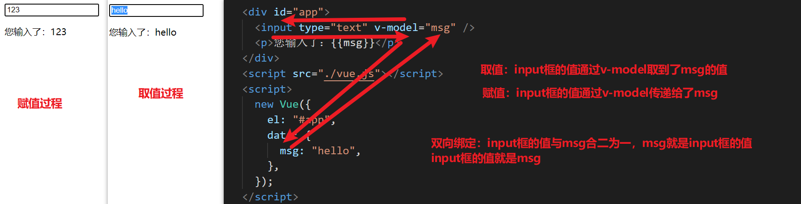

# Vue.js - day01

## 插件安装推荐

vscode有二个常用插件：vetur，Vue 2 Snippets

1. vetur:让一些vue的关键字能高亮显示，还能进行一些语法的检测。

   - 语法错误检查，包括 CSS/SCSS/LESS/Javascript/TypeScript等
   - 语法高亮，包括 html/css/sass/scss/less/js/ts等

2. Vue 2 Snippets：能在平时写代码过程中提示功能更强大,对vue的语法有提示

   官网地址(里面列出了相关提示快捷词)： [https://marketplace.visualstudio.com/items?itemName=hollowtree.vue-snippets](https://marketplace.visualstudio.com/items?itemName=hollowtree.vue-snippets) 


安装方式有二种：在线安装（能上网，条件允许推荐在线安装）,离线安装

**在线安装**：在vscode中按（ctrl+shift+x）,搜索插件名称（例：vetur），

​                  会出现相关插件，如果里面有install.就点击安装，如果安装完成就没install了

**离线安装**：拷贝相应的压缩包解压到相应目录下面（2个vscode插件.zip）

```
C:\Users\电脑用户名\.vscode\extensions
```


安装完成后，重启一下vscode就可使用插件了

​                   

## vue.js是什么

[官网地址](https://cn.vuejs.org/v2/guide/)

> 我们学习一个知识，首先是不是要了解它是什么？有什么特点？

**vue.js是什么：vue就是一个javascript框架，**

**特点：**无需再操作dom,只关心数据

vue做法与传统js对比

```html
<!DOCTYPE html>
<html lang="en">

<head>
    <meta charset="UTF-8">
    <meta name="viewport" content="width=device-width, initial-scale=1.0">
    <meta http-equiv="X-UA-Compatible" content="ie=edge">
    <title>Document</title>
</head>

<body>
    <!-- js传统做法 -->
    <input type="text" id="txt">
    <p id="p">您输入了:</p>
    <script>
        let _txt = document.getElementById("txt")
        let _p = document.getElementById("p")
        _txt.oninput = function () {
            _p.innerText = "您输入了:" + _txt.value
        }
    </script>

    <!-- vue做法 -->
    <div id="app">
        <input type="text" v-model="msg">
        <p>您输入了:{{msg}}</p>
    </div>
    <script src="https://cdn.jsdelivr.net/npm/vue/dist/vue.js"></script>
    <script>
        new Vue({
            el: "#app",
            data: {
                msg: "hello"
            }
        })
    </script>
</body>

</html>
```

**总结：对vue而言，我们无需再操作dom,只需要关心数据data,把相应的数据与标签用vue的语法关联上就OK了**

## vue的基本使用

>我们刚子解了vue是什么和它的特点，那我们如何去使用它呢？

[直通车](https://cn.vuejs.org/v2/guide/#起步)

**基本使用方法（分三步）：**

- 引包(导入vue.js到html)

  - 引包这里官网说到二个词，开发环境，生产环境

    - 开发环境：就是我们作为开发人员写代码过程中使用的环境,选择包相当于jquery时的jquery.min.js。
    - 生产环境：项目正式上线后的环境,选择包相当于jquery时的jquery.js。

    学习阶段我们还是用开发环境的包，因为代码会有相关警告提示等。

  ```html
  <script src="https://cdn.jsdelivr.net/npm/vue/dist/vue.js"></script>
  ```

- 布局。（写好页面标签，以前怎么写现在还怎么写）例：

  ```html
      <div id="app">
          {{msg}}
      //这个div写了一个id,就是留这个id以便vue更方便vue实例化时方便获取
      </div>
  ```

- vue实例化

  ```javascript
      <script>
          new Vue({
              //这里el相当于确定实例化范围就是id为app的标签，后面写法相当于一个选择器，注：这里不能选择body与html,尽量写一个id标签供选择，独一无二，可读性强，规范。  
              el: "#app",
              //这里的data就是vue需要使用到的数据，vue是以数据驱动页面，数据就来自于这里
              data: {
                  msg: "hello"
              }
          })
      </script>
  ```
```html
<!DOCTYPE html>
<html lang="en">

<head>
    <meta charset="UTF-8">
    <meta name="viewport" content="width=device-width, initial-scale=1.0">
    <meta http-equiv="X-UA-Compatible" content="ie=edge">
    <title>Document</title>
</head>

<body>
    <!-- 基本使用分为三步：
1：导包；2：布局；3：实例化
-->

    <!-- 2:布局 -->
    <div id="app">
        <!-- vue的一个插值语法，相当于挖个坑，用下面的就是值来填上 -->
        {{ message }}message
        <div>{{message}}</div>
    </div>


    <!-- 1:导包(开发环境的包) -->
    <script src="https://cdn.jsdelivr.net/npm/vue/dist/vue.js"></script>
    <script>
        //3:实例化过程    
        var app = new Vue({
            el: '#app',//el实际就是element，选择标签  实际就是确定vue的使用范围  ,注意这里不能选择 <html> or <body>      
            data: {      //数据存放的地方
                message: 'Hello Vue!',
                txt: ""
            }
        })
    </script>
</body>

</html>
```


## v-text指令（类似于innerText）

>如何改变一个标签里面的内容呢？

[直通车](https://cn.vuejs.org/v2/api/#v-text)

**用法：**v-text有二种用法，里面的值都可使用一句话的表达式，如 xxx,   xxx+123   ,xxx?"1":"2"   obj.xxx等一句话简短表达式

1. ```html
   <span v-text="msg"></span>//用于整个span标签内的textContent内容替换
   ```

   

2. ```html
   <span>消息：{{msg}}</span>  //用于部分span标签内的textContent内容替换
   //这也叫插值语法
   ```
```html
   
   msg可以是一个变量，也可以是一个简短的一句话表达式
   
   

**功能：**

- v-text=“msg”  ，它会替换当前所在标签里的所有内容，并将msg内容以文本形式显示在标签里，和innerText类似

- {{}}用法，{{}}里面将不再是字符串，可包含变量（一句话内的js表达式），获取数据，它是用于标签的textContent部分，常用于部分textContent值的更新。

  下面有关于这二种用法的一个demo,大家可运行的感受一下。

​```html
<!DOCTYPE html>
<html lang="en">

<head>
    <meta charset="UTF-8">
    <meta name="viewport" content="width=device-width, initial-scale=1.0">
    <meta http-equiv="X-UA-Compatible" content="ie=edge">
    <title>v-text</title>
</head>

<body>
    <!-- 2:布局 -->
    <div id="app">
        <!-- 加法运算表达式 -->
        <div v-text="msg+123+'xxx'">
            今天是个寒冷的天！
            <p>xxx</p>
        </div>
        <!-- 变量用法 -->
        <div>今天天气怎么样?{{txt}}</div>
        <!-- 对象用法 -->
        <div>姓名?{{obj.name}}</div>
        <!-- 三元表达式用法 -->
        <div>性别?{{obj.name?"男":"女"}}</div>
    </div>
    <!--总结： v-text与插值语诘后面都可以用简单的一句话表达式-->

    <!-- 1：导包 -->
    <script src="./vue.js"></script>
    <!-- 3:实例化 -->
    <script>
        new Vue({
            el: "#app",
            data: {
                msg: "第一次使用v-text",
                txt: "今天是个寒冷的天！",
                obj: {
                    name: "董老师",
                    sex: "男"
                }
            }
        })
    </script>

</body>

</html>
```


## v-html指令（类似innerHTML）

>和v-text相似的一个指令，但可解析值成html

[直通车](https://cn.vuejs.org/v2/api/#v-html)

**用法：**  

```html
<div v-html="msg"></div>
```

**功能：**v-html和v-text非常相似，会替换当前所在标签的内容，并以html形式展示出来。

**注：常用于富文本（带有标签元素的字符串如：`<p style="color:red">我是v-html</p>`。）**


**v-html的demo**

```html
<!DOCTYPE html>
<html lang="en">

<head>
    <meta charset="UTF-8">
    <meta name="viewport" content="width=device-width, initial-scale=1.0">
    <meta http-equiv="X-UA-Compatible" content="ie=edge">
    <title>Document</title>
</head>

<body>
    <!-- html布局 -->
    <div id="app">
        <div v-text="txt">123</div>
        <div v-html="txt">456</div>
    </div>
    <!-- 导包 -->
    <script src="./vue.js"></script>
    <!-- vue实例化 -->
    <script>
        new Vue({
            el: "#app",
            data: {
                txt: "<h1>今天天气很好！</h1>"    //这里就是一个富文本，带有标签的字符串
            }
        })
    </script>
</body>

</html>
```


## v-model指令

>前面学习了如何改变标签里面内容，那如何改变input框等表单元素的值呢？

[直通车](https://cn.vuejs.org/v2/guide/forms.html)



**用法：**例: `<input type="text" v-model="msg">`

**功能：**v-model能够实现表单元素值的双向绑定（注：适用范围为：表单元素如：input,textarea,select等）

- 双向绑定通过下面demo有一个很详情的显示，
  - 初始时，input框的值是通过v-model取到了msg的值 ，实现了值的获取 
  - 后面，当input框的值改变的过程中，也会影响到msg值的改变从而实现p标签里内容的改变
  - 所谓双向绑定就是msg与input框的值不分彼此，不管哪一个变化 ，另一个都会跟着变。

```html
<!DOCTYPE html>
<html lang="en">

<head>
    <meta charset="UTF-8">
    <meta name="viewport" content="width=device-width, initial-scale=1.0">
    <meta http-equiv="X-UA-Compatible" content="ie=edge">
    <title>Document</title>
</head>

<body>
    <div id="app">
        <!-- 这里有二个过程来说明这个双向绑定
        1：刚开始一打开页面，msg的值通过v-model传递给了input框，让input框显示了hello,这是一个取值过程
        2：后面当input框值输入改变时，通过v-model,msg的值也会随之改变，这是一个对msg传值的过程
        取值与传值 二个过程中，v-model实现了双向绑定        
        -->
        <input type="text" placeholder="请输入内容" v-model="msg">
        <p>请输入内容：{{msg}}</p>
    </div>


    <script src="./vue.js"></script>
    <script>
        new Vue({
            el: "#app",
            data: {
                msg: "hello"
            }
        })
    </script>
</body>

</html>
```


## v-on指令

>如何监听事件呢？

[直通车](https://cn.vuejs.org/v2/guide/events.html)

**用法：(  ` v-on:=> (简写)@`)**   

```javascript
<div  v-on:事件名="需要执行的简单代码或者是方法"> </div>
//简写
 <div  @事件名="需要执行的简单代码或者是方法"> </div>
```

**功能：**用于事件的绑定，例如：`click`,`dblclick`,`mouseover ` 等只要是事件，都可用它来绑定

```html
<!DOCTYPE html>
<html lang="en">

<head>
    <meta charset="UTF-8">
    <meta name="viewport" content="width=device-width, initial-scale=1.0">
    <meta http-equiv="X-UA-Compatible" content="ie=edge">
    <title>Document</title>
</head>

<body>
    <div id="app">
        <!-- v-on:事件名="一句话简短js" -->
        <button v-on:click="clickEvent">点我啊</button>
        <button v-on:dblclick="clickEvent">双击我啊</button>
        <button v-on:mouseover="clickEvent">鼠标移入</button>
        <p>你点了我{{total}}次!</p>


        <!-- 简写@,推荐后面都用简写 -->
        <button @click="clickEvent">点我啊</button>
        <button @dblclick="clickEvent">双击我啊</button>
        <button @mouseover="clickEvent">鼠标移入</button>

    </div>

    <script src="./vue.js"></script>
    <script>

        let app = new Vue({
            el: "#app",
            data: {
                total: 0
            },
            // 这里的methods就是方法的集合，就是我们在vue里面用到的方法都可写到这里来
            methods: {
                //在methods里访问data是需要加this的，而html访问是不需要的
                clickEvent() {   // 这里相当于clickEvent:function(){}
                    if (this.total < 10) {
                        this.total++
                    }
                }
            }
        })
    </script>
</body>
</html>
```


## vue实例中的this

>如何在methods中访问data里面的属性呢？前面使用的this代表什么呢？


**用法：**

- methods里某个方法访问data                        =>      this.data属性      
-  methods里A方法访问methods里的B方法    =>      this.B()

**功能：**this就是指当前new Vue实例，vue实例时会将data里面属性与methods方法平铺过来到vue实例里面，所以this能直接访问到data与methods

**注：**html里面访问data与methods不需要加this,但methods里面的方法访问data里的属性是需要加this的


```html
<!DOCTYPE html>
<html lang="en">

<head>
    <meta charset="UTF-8">
    <meta name="viewport" content="width=device-width, initial-scale=1.0">
    <meta http-equiv="X-UA-Compatible" content="ie=edge">
    <title>Document</title>
</head>

<body>
    <div id="app">
        <button @click="clickEvent">点我啊</button>
        <p>{{msg}}</p>

    </div>
    <script src="./vue.js"></script>
    <script>
        //dom里面使用vue里面的data属性与methods里面的方法时都无须加this,但是vue实例里面methods访问data与methods里其它方法都是要加this的
        var app = new Vue({
            el: "#app",
            // vue中data里的值会在vue实例化时平铺到vue实例里面
            data: {
                msg: "123",
                t1: 2,
                t2: 3,
                t3: 4
            },
            //vue中里methods里面的方法也是在vue实例化时平铺到vue
            methods: {
                clickEvent() {
                    //this就代表vue实例
                    console.log(app)
                    //打印看看this里面有什么
                    console.log(this)
                    console.log(this === app);
                    this.msg = "测试一下"
                    this.alertEvent()
                },
                alertEvent() {
                    alert(this.msg)
                }

            },
        })

    </script>
</body>

</html>
```


## 搜索英雄人物demo

>对前面学的知识点综合运用


分析：

1. 处理默认打开数据
   1. input框   v-model 
   2. 姓名 ：  {{}}   heroList[heroIndex].name
   3. 英雄故事： v-text   heroList[heroIndex].story
2. 处理搜索
   1. 按钮    @click ="搜索事件"
   2. 搜索事件处理
      1. 遍历数组  heroList
      2. heroList[i].name.indexOf(inpout框的值)！=-1
      3. 存储索引   heroIndex=i
      4. data定义heroIndex=0


这个demo是对前面所有知识点的一个综合应用。

需求：通过input框搜索出模板内的相应英雄的详信息，模板内已给出四位英雄的数据。

模板在：08搜索英雄人物demo模板.html

分析：

1. 默认取到heroList[0]的信息
   1. heroList[0].name
   2. heroList[0].story
2. 给input框来一个v-model  ="变量"
   1. 变量默认=“赛拉斯”
3. 实现搜索功能
   1. 给搜索按钮绑定事件  @click="事件"
   2. 事件要实现搜索出相应的数据
      1. 首先遍历数组
      2. 比较数组里面每一项的name
         1. name.indexOf(input框的值)！=-1
         2. 返回出相应索引 就OK了
         3. 定义一个索引变量，默认值为0


## v-on常用的几个修饰符

>如何控制事件只在某些特别条件下触发呢？

[直通车](https://cn.vuejs.org/v2/guide/events.html#%E4%BA%8B%E4%BB%B6%E4%BF%AE%E9%A5%B0%E7%AC%A6)

**用法：**

- @事件名.stop="事件执行代码"            阻止冒泡
- @事件名.prevent="事件执行代码"      阻止默认事件    
-  @keyup.enter="事件执行代码"           相当于只有按键盘回车我才触发

**功能：**.stop(阻止冒泡)   .prevent(阻止默认事件)    .enter(相当于只有按键盘回车我才触发)

```html
<!DOCTYPE html>
<html lang="en">

<head>
    <meta charset="UTF-8">
    <meta name="viewport" content="width=device-width, initial-scale=1.0">
    <meta http-equiv="X-UA-Compatible" content="ie=edge">
    <title>Document</title>
</head>
<style>
    .box1 {
        width: 200px;
        height: 200px;
        background-color: #f00;
    }

    .box2 {
        width: 100px;
        height: 100px;
        background-color: #0f0;
    }
</style>

<body>
    <div id="app">
        <div class="box1" @click="box1Click">
            box1
            <!-- vue写法阻止冒泡  .stop -->
            <div class="box2" @click.stop="box2Click">box2</div>
            {{msg}}
            <!-- prevent阻止默认事件 -->
            <a href="http://www.baidu.com" @click.stop.prevent="aClickEvent">我是a标签</a>
        </div>
        <!-- 键盘监听事件修饰符.enter 只有回车时才响应 -->
        <input type="text" @keyup.enter="inputEvent">
    </div>
    <script src="./vue.js"></script>
    <script>
        new Vue({
            el: "#app",
            data: {
                msg: ""
            },
            methods: {
                box1Click() {
                    alert("这是box1")
                },
                box2Click(event) {
                    // event.stopPropagation()
                    alert("这是box2")
                },
                aClickEvent(event) {
                    // event.preventDefault()
                    this.msg = "我修改了msg"
                },
                inputEvent() {
                    alert(123)
                }

            }
        })
    </script>
</body>

</html>
```


## v-bind指令之基本用法

> 如何通过vue去改变标签上面的样式或者其它属性值呢？

常规用法官网介绍：[https://cn.vuejs.org/v2/api/#v-bind](https://cn.vuejs.org/v2/api/#v-bind)

**用法：**(  ` v-bind:=> (简写):`)

```html
v-bind:属性名="属性值" 
```

如:      v-bind:src="图片路径(这里可写一句话以内简短js)"

**功能：**绑定相应属性值后，可以动态控制该属性值，通过控制该属性值让页面满足不同的需求效果。

```html
<!DOCTYPE html>
<html lang="en">

<head>
    <meta charset="UTF-8">
    <meta name="viewport" content="width=device-width, initial-scale=1.0">
    <meta http-equiv="X-UA-Compatible" content="ie=edge">
    <title>Document</title>
</head>
<style>
    img {
        width: 400px;
    }
</style>

<body>
    <div id="app">
        <button @click="clickEvent">点击我啊</button>
        <!-- 绑定基本属性：v-bind:属性名="变量" -->
        <!--  -->
        <!-- 简写: -->
        
    </div>
    <script src="./vue.js"></script>
    <script>
        new Vue({
            el: "#app",
            data: {
                msg: "",
                imageSrc: "http://ossweb-img.qq.com/images/lol/web201310/skin/big517000.jpg"

            },
            methods: {
                clickEvent() {
                    this.msg = "图片换了"
                    this.imageSrc = "http://ossweb-img.qq.com/images/lol/web201310/skin/big518000.jpg"
                }
            }
        })
    </script>
</body>

</html>
```


## v-bind指令之对象用法

>如何通过vue去改变标签上面的样式或者其它属性值呢？

对象用法介绍网址： [https://cn.vuejs.org/v2/guide/class-and-style.html](https://cn.vuejs.org/v2/guide/class-and-style.html)    

**用法：**(  ` v-bind:=> (简写):`)

- 对象用法(适用于复合属性，有多个值的)  
  - 如class:      v-bind:class="{class类名：一句话以内简短js,但结果会转换为true(使用该class)与false(不使用该class),}" 

**功能：**绑定相应属性值后，可以动态控制该属性值，通过控制该属性值让页面满足不同的需求效果。

**v-bind应用于class**

```html
<!DOCTYPE html>
<html lang="en">

<head>
    <meta charset="UTF-8">
    <meta name="viewport" content="width=device-width, initial-scale=1.0">
    <meta http-equiv="X-UA-Compatible" content="ie=edge">
    <title>Document</title>
</head>
<style>
    .active {
        color: red
    }
</style>

<body>
    <div id="app">
        <button @click="clickEvent">点我换颜色 </button>
        <!-- bol为true,active有效，bol为false时，active无效 -->
        <div v-bind:class="{active:bol}">使用class</div>
    </div>
    <script src="./vue.js"></script>
    <script>
        new Vue({
            el: "#app",
            data: {
                bol: false
            },
            methods: {
                clickEvent() {
                    this.bol = !this.bol
                }
            }
        })</script>
</body>

</html>
```


## 图片轮播demo

>实际运用v-bind与v-on结合

通过已给出的图片数组完成图片轮播功能，样式已给出，只需写功能就OK


## 英雄人物详细Demo

>前面所学知识点的综合运用

1. 处理默认打开数据
   1. 姓名：{{}}   hero[0].name
   2. 图片   :src     hero[0].img
   3. 故事    v-html   hero[0].story
2. 搜索
   1. input框 v-model  双向绑定  @keyup.enter="搜索事件
   2. 按钮也要来一个搜索事件  @click="搜索事件
   3. 搜索事件处理
      1. 遍历数组
      2. 找到name.indexOf(input框的值）！=-1 索引 项
      3. 存储索引  heroIndex=0


## v-for指令

>如何对列表数据进行渲染？

[直通车](https://cn.vuejs.org/v2/guide/list.html)

**用法：**   

- 用于数组 ：   `v-for="(item(数组每一项),index(索引))  in  array"`    （这里index索引也可省略不写）
- 用于对象 ：    ` v-for="(value(对象中的值)，key(对象中的键值)，index(对象中的序号，从0开始) in object)"`(这里key与index可省略,对象的for在实际项目中很少用到。)

**功能：**对数组与对象进遍历，得到每一项的值，从而进行列表之类的渲染处理。

```html
<!DOCTYPE html>
<html lang="en">

<head>
    <meta charset="UTF-8">
    <meta name="viewport" content="width=device-width, initial-scale=1.0">
    <meta http-equiv="X-UA-Compatible" content="ie=edge">
    <title>Document</title>
</head>

<body>
    <div id="app">
        <ul>
            <!-- 数组有多长它就渲染多少个    第一个值item是代表数组当前项，第二个index值是数组索引-->
            <li v-for="(item,index) in arr">索引：{{index}}------值：{{item}}</li>
            <!-- 对对象而言，第一个值value是也是对象的值，第二个是对象的键值key，第三个index是序号 -->
            <li v-for="(value,key,index) in obj">{{value}}------{{key}}-----{{index}}</li>
        </ul>

    </div>
    <script src="./vue.js"></script>
    <script>
        new Vue({

            el: "#app",
            data: {
                arr: [1, 2, 3, 45, 6, 8, 15],
                obj: {
                    name: "刘德华",
                    age: 15
                }
            }
        })
    </script>
</body>

</html>
```


## 单纯英雄列表Demo

>v-for的一个综合应用
>

已给出相应模板，模板里有相应数据，完成列表渲染，

需求：完成列表渲染，点击不同人物名称，可实现人物样式变化 ，如图


1. 列表渲染   v-for 
   1. name   {{}}
2. 加入点击 事件heroIndex=index
3. 绑定class   :class="{ active :bolean值}"
   1. heroIndex==index
   2. heroIndex存储当前点击索引值


## v-if,v-else-if,v-else指令

>有条件的渲染某些内容

[直通车](https://cn.vuejs.org/v2/guide/conditional.html)

**用法：** 

-  ` v-if="一句话表达式（最后转换成boolean值，如果为真，则进行该语句所在标签渲染，如果为假则不渲染，该标签将不存在）" `  
- `v-else-if`和`v-if` 是一样用法，它是`v-if`不成立情况下才会走到`v-else-if`这里来
- `v-else`后面无须跟任何语句，当前面`v-if`和`v-if-else`都不成立时，它就会执行，当前面任何一个执行渲染，它就不执行

**功能：**根据不同条件选择性的渲染某些标签。

```html
<!DOCTYPE html>
<html lang="en">

<head>
    <meta charset="UTF-8">
    <meta name="viewport" content="width=device-width, initial-scale=1.0">
    <meta http-equiv="X-UA-Compatible" content="ie=edge">
    <title>Document</title>
</head>

<body>
    <div id="app">
        <input type="text" placeholder="请输入相应成绩！" v-model="score">
        <div v-if="score>90">你真优秀</div>
        <div v-else-if="score>70">一般般了</div>
        <div v-else>得努力了</div>
    </div>
    <script src="./vue.js"></script>
    <script>
        new Vue({
            el: "#app",
            data: {
                score: 100
            }
        })

    </script>
</body>

</html>
```


## Demo-完整英雄列表与查询

1. 完成英雄列表
   1. v-for对数组进行列表渲染
   2. 列表点击功能用v-on绑定事件
      1. 点击后，用个值存储当前点击项，存储它的索引就ok了
   3. v-bind绑定`class`   active   
      1.  根据索引值就可以完成class绑定
2. 完成中间详情部分
   1. 绑定英雄名称用：{{}}
   2. 图片：v-bind
   3. 英雄特征：v-for
   4. 英雄故事: v-html
3. 搜索功能
   1. input框的v-model   @keyup.enter
   2. 按钮的@click事件
      1. 搜索出input框字符相匹配的第一个项
      2. 把数组进行遍历，对里面每一项的name值进行indexOf判断 ！=-1就是匹配上的
      3. 匹配后，改变当前选中项的索引值
4. 优化，找不到相应数据的处理
   1. v-if 判断heroIndex的值是否为-1，来确定是否展示相应的数据。


 

这个demo是一个今天所学所有知识点的一个综合应用，

模板里面有相应英雄的所有数据。

一打开页面，就默认展示所有英雄列表，详情里面展示 第一个英雄的详情


通过搜索，搜索出带有名字带有相关字的英雄列表，同时，英雄详情展示 出列表里第一个英雄的详情。如：


## 今天一定需要掌握的知识点

1. vue.js是什么？

   1. 它是一个js框架，它只关心数据，无须操作dom

2. vue基本使用

   ~~~
   1：导包
   2：布局
   3：实例化
    new Vue({
    el:"#app" ,  //确定了一个使用范围，内部执行的querySelector,注意点：不能使用html与body
    data:{},
    methods:{}
    })
   ~~~

3. v-text

   1. v-text="一句话表达式"
   2. 用于替换标签文本内容，类似于innerText

4. {{}}插值语法

   1. 用在标签的文本区域
   2. 它只是部分内容远的

5. v-html:

   1. 富文本解析

6. v-model:表单元素双向绑定

   1. v-model="变量"

7. v-on事件绑定，@事件名="一句话表达式或者function"

8. this

   1. vue实例对象
   2. 它把data与methods里面的数据与方法都平铺到了vue实例对象中
   3. html里使用data数据与methods方法无须加this
   4. 在vue实例对象里访问data与methods一定要加this

9. .enter  回车才触 发

   1. .stop   阻止冒泡
   2. .prevent  阻止默认事件

10. ：属性名="属性值"

11. :class="{class类名：boolean值}"

    1. true:使用该class
    2. false:不使用该class

12. v-for="(item,index) in 数组"

    1. 注意点：item与index都是局部变量，只能使用在当前v-for所在标签内

13. v-if="boolean值"

    1. true与false
    2. true:渲染该标签
    3. false不渲染该标签


