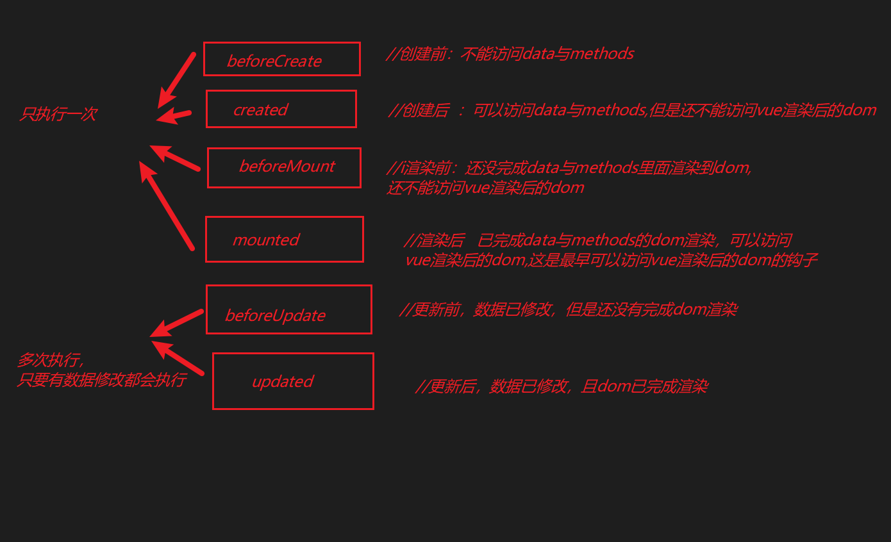
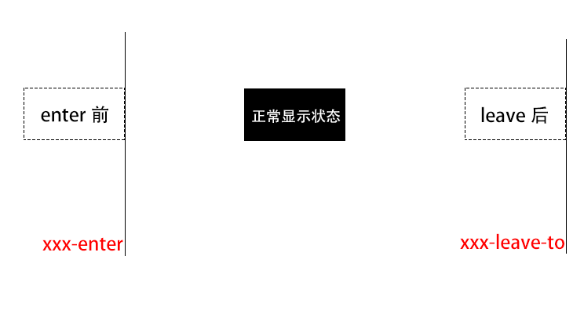
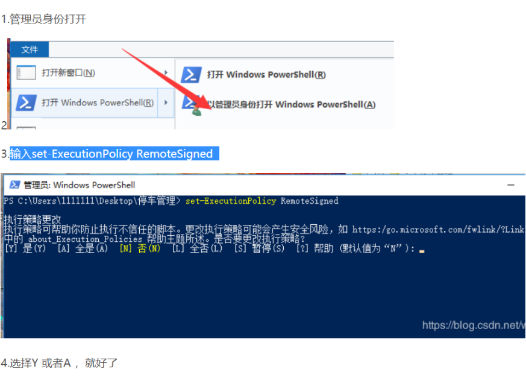

# Vue.js - day03

## 反馈

1.	老师找bug的速度，舒服了
1.	奥利给!
1.	代码敲的慢，感觉两天刚刚好，上三天课有点没时间预习
1.	多花时间 早睡早起
1.	感觉老师讲课 结构非常清晰 带着一点紧张感学习 感觉没这么困了
1.	很喜欢这种上课节奏👍👍👍


## 回顾

1. v-for用于对象

   1. v-for="(value,key,index) in 对象"

2. key

   1. 有时候标签长得太像vue也不一定认识，key相当于一个标识 
   2. v-for

3. v-if/v-show

   1. v-if:控制标签是否渲染  v-show控制 标签是否显示(display:none)
   2. 使用场景：v-if:用于多条件渲染  v-show:用于频繁切换，实际主体使用v-if

4. v-cloak特点：在newVue实例化后会消失  

   1. [v-cloak]{display:none}

5. v-once:只执行一次vue语法

6. v-pre:不执行vue语法

7. axios:ie8+    vue:10+

8. ~~~
   axios.get(url,{params:{参数}}).then(res=>{res后端 返回数据}).catch(err=>{
   错误处理
   })
   axios.post(url,{参数}).then(res=>{成功处理}).catch(err=>{失败处理})
   axios({
   url:"接口地址",
   method:"get/post",
   params:{},
   data:{}
   }).then(res=>{}).catch(err=>{})
   ~~~

9. 


## 英雄Demo网络优化版本详细讲解

**所需要接口:**

-  查询英雄名称接口：  https://autumnfish.cn/api/lol/search   
   - 请求方式：get     参数：q:英雄名（可选）
-  根据英雄id查询英雄详情的接口： https://autumnfish.cn/api/lol/info
   - 请求方式：get     参数:  id:英雄id

1. 列表功能

   1. created 调用接口
   2. axios获取数据
   3. 存储处理
   4. 列表渲染
      1. v-for
      2. 列表点击 事件
         1. heroIndex=当前索引值
      3. class   :class=”{active:heroIndex==当前 索引值}“

2. radio筛选功能

   1. v-model双向绑定
   2. 用计算属性进行筛选生成一个新数组
      1. 遍历数组 for
      2. 每一项进行筛选  hero[i].roles.indexOf(双向绑定的值)，如果 存储到新数组
      3. return 这个新数组
      4. 把以前列表渲染的数组改成计算属性的数组

3. 英雄详情功能

   1. 进入页面就获取 详情数据
   2. 在英雄列表接口获取完成后调用
   3. id=列表第一项的id   取计算属性的第一项的id
   4. 存储详情数据   heroInfo
   5. 渲染详情
      1. 姓名：heroInfo.name
      2. 图片  :src=heroInfo.img
      3. 特征  v-for
      4. 英雄故事  v-html

4. 完善筛选功能

   1. 改变特征的时候需要调用详情接口
   2. @change  是改变事件
   3. 执行详情接口调用

5. 完善列表点击 

   1. 调用详情接口

6. 完成搜索功能

   1. input框   双向绑定   @keyup.enter="搜索事件"
   2. 搜索按钮   @click="搜索事件"
   3. 搜索事件
      1. 存储双向绑定的值   searchVal=input框的值
      2. 通过searchVal进行筛选
      3. 计算属性中加入searchVal的筛选
         1. 每一项的name值.indexOf(searchVal)!=-1
      4. 执行列表第一项的点击  liClick(0)

7. 优化

   1. 暂无 数据
   2. 判断计算属性的长度

   

   


## ref的基本使用

>vue中如何选择dom

**用法:**   

- 标签中加入ref属性     

  - ```
    <div ref="xxx"></div>
    ```

- 在js中通过ref获取dom

  - ```
    this.$refs.xxx
    ```
  
    

**作用:**  获取 vue中的dom

```html
<!DOCTYPE html>
<html lang="en">

<head>
    <meta charset="UTF-8">
    <meta name="viewport" content="width=device-width, initial-scale=1.0">
    <meta http-equiv="X-UA-Compatible" content="ie=edge">
    <title>Document</title>
</head>
<style>
    * {
        padding: 0;
        margin: 0;
    }

    #wrapper {
        height: 200px;
        border: 1px solid red;
        overflow: auto;
    }
</style>

<body>
    <div id='app'>
        <button @click="goBottom">到底部</button>
        <!-- vue访问dom二步
        1:在标签上定义一个属性ref   ref="名称"
        2:使用    this.$refs.名称
        -->
        <div id="wrapper" ref="wrapper">
            <div>测试滚动1</div>
            <div>测试滚动2</div>
            <div>测试滚动3</div>
            <div>测试滚动4</div>
            <div>测试滚动5</div>
            <div>测试滚动6</div>
            <div>测试滚动7</div>
            <div>测试滚动8</div>
            <div>测试滚动9</div>
            <div>测试滚动10</div>
            <div>测试滚动11</div>
            <div>测试滚动12</div>
        </div>
        <button @click="goTop">到顶部</button>

    </div>
    <script src='./vue.js'></script>
    <script>
        new Vue({
            el: '#app',
            data: {},
            methods: {
                goBottom() {
                    console.log("vue--dom", this.$refs.wrapper);
                    console.log("原生--dom", document.getElementById('wrapper'));
                    // 以前原生写法控制 滚动条
                    // document.getElementById('wrapper').scrollTop = 9999
                    // vue写法
                    this.$refs.wrapper.scrollTop = 9999
                },
                goTop() {
                    // document.getElementById('wrapper').scrollTop = 0
                    this.$refs.wrapper.scrollTop = 0
                }
            },
            created() {
                console.log("原生--dom", document.getElementById('wrapper'));
                // 因为vue还没按它的方式完成dom渲染，所以以后建议大家使用ref
                console.log("vue--dom", this.$refs.wrapper);
            }
        })
    </script>
</body>

</html>
```


## 生命周期之beforeMount、mounted、beforeUpdate、updated

[直通车](https://cn.vuejs.org/v2/guide/instance.html#%E7%94%9F%E5%91%BD%E5%91%A8%E6%9C%9F%E5%9B%BE%E7%A4%BA)



> `beforeMount`:渲染前，被vue管理起来的dom在vue实例里还没完成渲染，所以就是还不能访问vue渲染的dom,平时项目中基本用不到，知道有这个是干什么的就行。
>
> `mounted`:渲染后，数据已在vue实例中渲染完成，也就是可以访问vue渲染的dom了，很常用的一个勾子，一定要记住。
>
> `beforeUpdate`:更新前，当数据发生改变，但页面还没完成更新，但快要更新时调用，没什么用。
>
> `updated`:更新后，当数据发生改变，且页面完成了更新后调用，也用的很少。

**用法：**

它是用在vue实例化里面的,所有的生命同期都是一个函数 ，写到vue里就可以。

```javascript
new Vue({
  el: '#app',
  methods: {
  },
  beforeCreate(){//创建前，还不能访问data与methods},
  created(){//创建后，能访问data与methods},
  beforeMounte(){//渲染前,被vue管理的dom还没完成在vue实例内的渲染，所以还不能调用dom},
  mounted(){//渲染后，被vue管理的dom已完成vue实例内的渲染，所以现在可以调用dom},
  beforeUpdate(){//更新前，当数据发生改变，但页面还没完成更新时调用。},
  updated(){//更新后，数据发生改变，且完成了页面更新时调用。}
})
```

**功能：**  

- `beforeMount`:基本没啥用。
- `mounted`:能调用dom，后面用到使用一些第三方插实例化时要调用dom时使用等，这个方法是很常用的
- `beforeUpdate`:基本没啥用。
- `updated`:基本没啥用。实际使用中，因为太多的数据发生改变了，他是在不停的调用的，所以，如果使用它会造成很多性能问题。

注：这里面我们重点需要知道二个生命周期勾子（created与mounted），但是其它勾子我们虽然 基本不怎么用，但需要记住它的功能，这个面试时，基本算是一个必问题了。

来一个demo让大家清晰一下这个过程

```html
<!DOCTYPE html>
<html lang="en">

<head>
    <meta charset="UTF-8">
    <meta name="viewport" content="width=device-width, initial-scale=1.0">
    <meta http-equiv="X-UA-Compatible" content="ie=edge">
    <title>Document</title>
</head>
<style>
    * {
        padding: 0;
        margin: 0;
    }
</style>
<div id="app">
    <button @click="clickEvent">点我啊</button>
    <div ref="dom">{{test}}</div>
</div>

<body>
    <script src="./vue.js"></script>
    <script>
        new Vue({
            el: "#app",
            data: {
                test: "测试一下"
            },
            beforeCreate() {
                console.log(this.test)
                //不能访问data,methods
            },
            created() {
                console.log("created:", this.test)
                //能访问data与methods

            },
            beforeMount() {
                console.log("beforeMount:", this.$refs.dom)
                //还不能访问dom

            },
            mounted() {
                console.log("mounted:", this.$refs.dom)
            },
            updated() {
                console.log("updated:")

            },
            beforeUpdate() {
                console.log("beforeUpdate:")
            },


            methods: {
                clickEvent() {
                    this.test = Math.random() * 100
                }
            }


        })
    </script>
</body>

</html>
```


## $nextTick使用

>它是setTimeout的高级版本，它是一个异步操作，就是帮我们算好了数据渲染到页面所需要时间后再执行它内部操作

用法：

~~~js
this.$nextTick(()=>{要执行的代码})
~~~


## 单元素的动画

>vue中是如何实现动画的呢？

[直通车](https://cn.vuejs.org/v2/guide/transitions.html)

   实现动画只能在：显示和隐藏    v-show   v-if

**用法**     

- **html部分的处理**

  - 用transition把要动画的元素包起来，给一个name值，name值其实就是后面动画css里面的class前缀

  - ```html
            <transition name="xxoo">
                <div class="box" v-if="isShow"></div>
            </transition>
    ```

    

- **css部分的处理**

  - xxoo-enter-active与xxoo-leave-active只是实现动画transition的一个class,只是为了执行transition动画,可以设置transition相关属性

  - xxoo-enter就是单元素进入前的状态也就是进入时需要是什么样子，

  - xxoo-leave-to就是离开后需要变成什么样的样式

  - ```css
        .xxoo-enter-active,
        .xxoo-leave-active {
            transition: all 2s;
        }
        //这里的xxoo-enter就是进入前的样式
        //这里xxoo-leave-to就是离开后需要变成什么样的样式
        .xxoo-enter {
            opacity: 0;
            transform: translateX(-600px);
        }
    
        .xxoo-leave-to
            {
            opacity: 0;
            transform: translateX(600px);
        }
    ```

    

**作用：**对单元素实现一个进入或者离开时的一个动画效果处理，一般是v-if 与v-show对单元素操作时的动画




```html
<!DOCTYPE html>
<html lang="en">

<head>
    <meta charset="UTF-8">
    <meta name="viewport" content="width=device-width, initial-scale=1.0">
    <meta http-equiv="X-UA-Compatible" content="ie=edge">
    <title>Document</title>
</head>
<style>
    .xxx-enter-active,
    .xxx-leave-active {
        /* 动画的实现者 */
        /* 实现动画，透明度的，时间0.5秒 */
        transition: all .5s;
    }

    /* 进入前的状态 */
    .xxx-enter {
        opacity: 0;
        transform: translatex(-200px);
    }

    /* 离开后的最后那一瞬间的状态 */
    .xxx-leave-to {
        opacity: 0;
        transform: translatex(200px);
    }

    p {
        width: 100px;
        height: 100px;
        margin: 0 auto;
        background-color: #f40;
    }
</style>

<body>
    <div id="demo">
        <button v-on:click="show = !show">
            Toggle
        </button>
        <!-- 要做单元素动效一定要用transition包住，同时给一个name,name里的值就是对应class的前缀 -->
        <transition name="xxx">
            <p v-if="show">hello</p>
        </transition>
    </div>
    <script src="./vue.js"></script>
    <script>
        new Vue({
            el: '#demo',
            data: {
                show: true
            }
        })
    </script>
</body>

</html>
```


## transition与keyframes的结合动画使用

**用法**   keyframes用法实际 和常规css写法基本一样的了，这里简单说明一下

- html部分，和单元素动画里面一样

  - ```html
    //把要实现单元素动画的标签用transition包起来，给一个name=xxx，这里的name就是需要实现动画的css前缀。
            <transition name="xxoo">
                <div class="box" v-if="isShow"></div>
            </transition>
    ```

- css部分

  - ```css
     //这里面就是对keyframes动画表现部分,实际就是为了使用一个animation
        .xxoo-enter-active,
        .xxoo-leave-active {
            animation:动画名称 时长;    //这里就是animation的用法一样
        }
    //下面就是基本的keyframes的写法
        @keyframes 动画名称 {
            0%{
                width:0px;
            }
            100%{
                width:200px;
            }        
        }
    ```

    

**作用**     用keyframes结合transition去实现动画效果

```html
<!DOCTYPE html>
<html lang="en">

<head>
    <meta charset="UTF-8">
    <meta name="viewport" content="width=device-width, initial-scale=1.0">
    <meta http-equiv="X-UA-Compatible" content="ie=edge">
    <title>Document</title>
</head>
<style>
    * {
        margin: 0;
        padding: 0;
    }

    p {
        width: 100px;
        height: 100px;
        background-color: #f00;
        margin: 0 auto;
    }

    /* 这里.xxx-enter-active与.xxx-leave-active和前面一样,都是动画的执行者 */
    .xxx-enter-active {
        animation: move 0.5s;
    }

    .xxx-leave-active {
        animation: move2 0.5s;
    }


    @keyframes move {
        0% {
            opacity: 0;
            width: 0;
            height: 0;
            background-color: #fff;
        }

        100% {
            width: 100px;
            height: 100px;
            background-color: #f00;
        }
    }

    @keyframes move2 {
        0% {
            width: 100px;
            height: 100px;
            background-color: #f00;
        }

        100% {
            width: 500px;
            height: 500px;
            opacity: 0;
            background-color: #00f;
        }
    }
</style>

<body>
    <div id='app'>
        <button @click="isShow=!isShow">点我切换</button>
        <transition name="xxx">
            <p v-if="isShow"></p>
        </transition>

    </div>
    <script src='./vue.js'></script>
    <script>
        new Vue({
            el: '#app',
            data: {
                isShow: true
            }
        })
    </script>
</body>

</html>
```


## 多元素动画

> 多元素动画必须用transition-group包住,且每个子元素必须设置一个key，其它和单元素动画是一样的

```html
<!DOCTYPE html>
<html lang="en">

<head>
    <meta charset="UTF-8">
    <meta name="viewport" content="width=device-width, initial-scale=1.0">
    <meta http-equiv="X-UA-Compatible" content="ie=edge">
    <title>Document</title>
</head>
<style>
    p {
        width: 150px;
        height: 150px;
        background-color: #f40;
        margin: 0 auto;
    }

    p:nth-child(1) {
        transition-delay: 0s;
    }

    p:nth-child(2) {
        transition-delay: 0.3s;
    }

    .xxxooo-enter-active {
        transition: all .5s;
    }

    .xxxooo-enter {
        opacity: 0;
        width: 0;
        height: 0;
    }
</style>

<body>
    <div id='app'>

        <button @click="isShow=!isShow">点我切换</button>
        <!-- 加入transition -->
        <!-- 多元素动画必须用transition-group包住
             每个子元素必须设置一个key值以便vue识别     
             其它使用和单元素一样   
        -->
        <transition-group name="xxxooo">
            <p v-if="isShow" key="1"></p>
            <p v-if="isShow" key="2"></p>
        </transition-group>


    </div>
    <script src='./vue.js'></script>
    <script>
        new Vue({
            el: '#app',
            data: {
                isShow: true
            }
        })
    </script>
</body>

</html>
```

## 天知道demo分析

http://wthrcdn.etouch.cn/weather_mini        参数：city      get请求


## 了解什么叫组件

> 把某个界面或者说某个小功能，封装起来就叫组件（就是对html css js的一个综合封装），组件也是Vue的实例，所以它也有自己的data和methods以及生命周期钩子等

**组件开发特点：**可复用，同时会简化代码结构，易于维护，同时利于多人协同开发等。


## 提前安装单文件组件所需要依赖

[直通车](https://cli.vuejs.org/zh/guide/prototyping.html)

**安装`vue-cli`**

- 在cmd命令窗口输入（在任意的路径都可以）

  ```html
  npm install -g @vue/cli
  ```

  

- 安装成功检测在cmd命令窗口输入：  

  ```html
  vue -V    // 如果安装成功会返回：@vue/cli 4.0.5类似这样的版本信息
  ```

  

  

**安装出错解决方案**(如果 vue -V无法显示版本信息，说明安装失败)

- 解决方案:

  1. 更换网络环境：有线，换无线，无线换4G

  2. 不是管理员进行安装 ，windows基本都是管理员，苹果电脑的要切换成管理员进行处理

  3. 更换安装的工具

     1. `cnpm安装` ：

        - 先安装淘宝镜像
  
          ```html
        npm install -g cnpm --registry=https://registry.npm.taobao.org
          ```

        - cnpm安装vue-cli：
  
          ```html
         cnpm install -g @vue/cli
          ```

     2. `yarn安装` :

        - 先安装yarn    
  
          ```html
         npm install -g yarn 
          ```

        - yarn安装vue-cli
  
          ```html
         yarn global add @vue/cli
          ```

             

  4. 清除npm缓存之后，重新安装
  
     1. ```html
      npm cache clean -f      //清除npm缓存
        ```

        
  
     2. 重新执行安装的命令
     
     3. 在用脚手架搭建vue项目时，提示：无法加载文件 C:\Users\电脑用户名\AppData\Roaming\npm\vue.ps1,因为在此系统禁止运行脚本
     
         这是你笔记本禁止运行脚本，解决办法
     
         命令： set-ExecutionPolicy RemoteSigned  
     
         

**安装单文件组件依赖包**（安装完成vue-cli后进行这一步）

- 正常安装

```cmd
    npm install @vue/cli-service-global -g
```

- cnpm安装的用：


```cmd
    cnpm install @vue/cli-service-global -g
```

- yarn安装的用：


```cmd
    yarn global add @vue/cli-service-global
```

**注意：**如果 前面用yarn的人就一直用yarn,不要用yarn装完vue-cli,又用npm装其它插件，这样有可能 会出问题，尽量都是同步一个安装，就是以前用npm,后面就一直用npm,以前用yarn 后面就一直用yarn


## （补充：了解）IScroll基本用法

>滚动条的优化

[直通车](http://caibaojian.com/iscroll-5/gettingstart.html)

**用法**

1. 导包，引入iscroll.js   （包已在学习资料里发给大家）

2. 布局，写好html与对应css

   1. html需要写三层布局，第 一层是用于iscroll使用范围，第二层是滚动区域

      ```html
          <div id="box" >
              <div id="ul">
                  <p>隔壁老王1</p>
                  <p>隔壁老王2</p>
                  <p>隔壁老王3</p>
                  <p>隔壁老王4</p>
                  <p>隔壁老王5</p>
                  <p>隔壁老王6</p>
                  <p>隔壁老王7</p>
                  <p>隔壁老王8</p>
              </div>
          </div>
      ```

   2. css处理

      ```css
               #box{
                   border: 1px solid #000;
                   /* 给div限制一个高度 */
                   height: 100px;
                    /* 这里一定要加一个定位，因为iscroll定位用的是绝对定位，它滚动条的位置是用的绝对定位 */
                   position:relative;
                   /* 用了iscroll就没必要系统自己的滚动条了，不然会有冲突了，所以一般是用hidden */
                   overflow: hidden;
               }
      ```

3. iscroll实例化

   ```javascript
   //IScroll来自于js包，后面#wrapper是一个选择器，也就是确定使用范围
   var myScroll = new IScroll('#wrapper', {
       // 这里是配制项，官网有很多配制，我下面列举了二项
       mouseWheel: true,   //鼠标滚轮配制
       scrollbars: true    //滚动条的显示配制
   });
   ```

   

**作用:**对项目中使用的滚动条进行优化，如，滚动条样式，效果，功能等方面的优化。


```html
<!DOCTYPE html>
<html lang="en">

<head>
    <meta charset="UTF-8">
    <meta name="viewport" content="width=device-width, initial-scale=1.0">
    <meta http-equiv="X-UA-Compatible" content="ie=edge">
    <title>Document</title>
</head>
<style>
    * {
        margin: 0;

    }

    #app {
        width: 300px;
        height: 150px;
        border: 1px solid red;
        /*去掉以前默认滚动条  */
        overflow: hidden;
        /* 让iscroll的滚动条的定位相对于该class */
        position: relative;
    }
</style>

<body>
    <!-- 布局 -->
    <button id="btn">增加li</button>
    <div id="app">
        <ul id="ul">
            <li>隔壁老王1</li>
            <li>隔壁老王2</li>
            <li>隔壁老王3</li>
            <li>隔壁老王4</li>
            <li>隔壁老王5</li>
            <li>隔壁老王6</li>
            <li>隔壁老王7</li>
            <li>隔壁老王8</li>
        </ul>
    </div>
    <!-- 导包 -->
    <script src="./iscroll.js"></script>


    <!-- 实例化 -->
    <script>
        var wrapper = document.getElementById('app');
        var myScroll = new IScroll(wrapper, {
            mouseWheel: true,     //鼠标滚轮 控制
            scrollbars: true      //显示滚动条
        });
        let _btn = document.getElementById("btn")
        btn.onclick = function () {
            let _li = document.createElement("li")
            _li.innerHTML = "xxx测试"
            let _ul = document.getElementById("ul")
            _ul.appendChild(_li)
            // 刷新iscroll，让它重新计算高度，因为dom已改变，iscroll要重新计算滚动范围那些
            myScroll.refresh()
        }

    </script>
</body>

</html>
```


## （补充：了解）iscroll在vue中基本用法

>iscroll在vue中如何使用呢？

**注意点**

- `iscroll`实例化时得在`mounted`里面，因为`iscroll`实例化得调用`vue`的`dom`，`mounted`是生命周期里第一个可访问`dom`的
- 使用`iscroll`刷新数据时，加入了`setTimeout`,因为vue中数据改变到更新到页面，是有很多代码要执行的，是需要时间的，、而`iscroll`刷新时要获取 最新`dom`高度等信息处理，所以一定要在dom更新完成时使用。

```html
<!DOCTYPE html>
<html lang="en">

<head>
    <meta charset="UTF-8">
    <meta name="viewport" content="width=device-width, initial-scale=1.0">
    <meta http-equiv="X-UA-Compatible" content="ie=edge">
    <title>Document</title>
</head>
<style>
    * {
        padding: 0;
        margin: 0;
    }

    .wrapper {
        width: 200px;
        height: 150px;
        border: 1px solid red;
        overflow: hidden;
        position: relative;
    }
</style>

<body>
    <div id="app">
        <button @click="btnClick">点我啊</button>
        <div class="wrapper" ref="wrapper">
            <ul id="ul">
                <li v-for="(item, index) in liData" :key="index">{{item}}</li>
            </ul>
        </div>
    </div>
    <script src="./vue.js"></script>
    <script src="./iscroll.js"></script>
    <script>
        new Vue({
            el: "#app",
            data: {
                iscroll: '',
                liData: ["隔壁老王", "隔壁老王", "隔壁老王", "隔壁老王", "隔壁老王"]

            },
            methods: {
                btnClick() {
                    // let _li = document.createElement("li")
                    // _li.innerHTML = "xxx测试"
                    // let _ul = document.getElementById("ul")
                    // _ul.appendChild(_li)
                    // this.iscroll.refresh()
                    this.liData.push("xxx测试")
                    // 以后使用setTImeout尽量使用箭头函数，不然this问题会有影响
                    setTimeout(() => {
                        this.iscroll.refresh()
                    }, 0);


                }
            },
            beforeCreate() {

            },
            created() {

            },
            beforeMount() {

            },
            mounted() {
                // 在mounted中实例化iscroll是因为iscroll是第一个最早可以访问vue的dom的生命周期
                this.iscroll = new IScroll(this.$refs.wrapper, {
                    mouseWheel: true,     //鼠标滚轮 控制
                    scrollbars: true      //显示滚动条
                })

            },
            beforeUpdate() {
                // 一定要是有vue里面数据的修改，它才会触发
                console.log(123);


            },
            updated() {

            },
        })
    </script>
</body>

</html>
```


## （补充：了解）优化英雄选择demo加入iscroll

>优化英雄选择demo列表，加入iscroll滚动条功能

