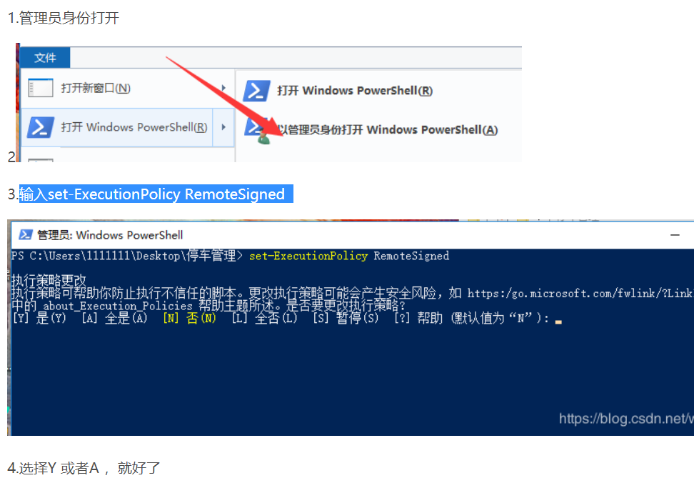
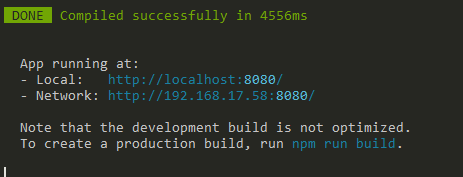
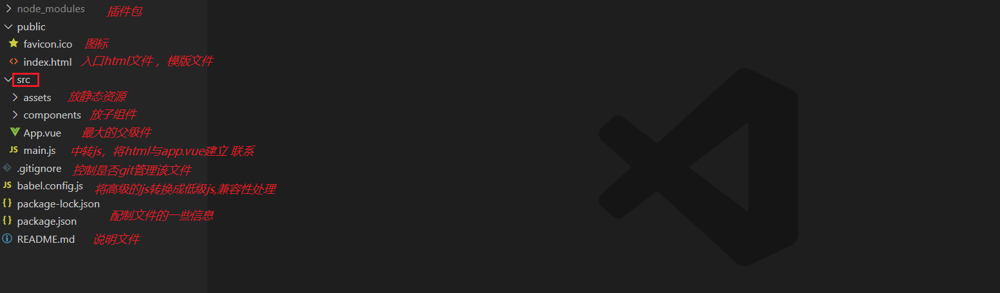

# Vue.js - day04

## 反馈

1.	很好玩,头发掉光了,奥利给
1.	😋🚀🚀🚀
1.	希望明天是小母牛骑摩托牛逼轰轰的一天！！！
1.	！！！
1.	加油,追求幸福!
1.	很棒,希望能多来些拓展
1.	有趣又好玩


## 回顾

1. ref
1. 获取dom
      1. 在标签上加一个ref属性  ref="值"
      2. 获取：this.$refs.值
2. 生命周期
   1. beforeCreate:创建前，还不能访问data与methods
   2. created:创建后，可以访问data与methods,但是还不能访问vue渲染后的dom
      1. 用于进入页面接口请求
   3. beforeMount:渲染前，还不能访问vue渲染后的dom
   4. mounted:渲染后，可以访问vue渲染后的dom
      1. 用于进入页面dom操作
   5. 上面四个生命周期只执行一次
   6. beforeUpdate:更新前，vue在页面中使用的数据已修改，但是页面还没完成渲染
   7. updated:更新后，vue在页面中使用的数据已修改且页面已完成相关渲染
   8. 上面二个生命周期可能 执行多次
3. $nextTick
   1. 它就是setTimeout高级版本，它将数据渲染到页面所需要时间算出来了
4. 单元素动画
   1. 条件：进入/离开  v-if/v-show
   2. 实现：
      1. 1用transition包住
      2. 在transition上加一个name属性  name的值就是后面css的前缀  name="xxx"
      3. .xxx-enter-active:它是进入动画执行体
      4. .xxx-leave-active:它是离开动画执行体
      5. .xxx-enter:进入时，希望从什么状态变到正常状态
      6. .xxx-leave-to:离开时，希望从正常状态变到什么状态
5. 多元素动画
   1. 用transition-group包住
   2. 每一个子项都要加一个key


## 天知道

http://wthrcdn.etouch.cn/weather_mini        参数：city      get请求


## 组件介绍 

组件是一个html,css ,js综合封装

.vue文件

运行：vue serve 路径

## 安装单文件组件所需要依赖

[直通车](https://cli.vuejs.org/zh/guide/prototyping.html)

**安装`vue-cli`**  脚手架

- 在cmd命令窗口输入（在任意的路径都可以）

  ```html
  npm install -g @vue/cli
  ```

  

- 安装成功检测在cmd命令窗口输入：  

  ```html
  vue -V    // 如果安装成功会返回：@vue/cli 4.0.5类似这样的版本信息
  ```

  

  

**安装出错解决方案**(如果 vue -V无法显示版本信息，说明安装失败)

- 解决方案:

  1. 更换网络环境：有线，换无线，无线换4G

  2. 更换安装的工具

     1. `cnpm安装` ：

        - 先安装淘宝镜像
        
          ```html
          npm install -g cnpm --registry=https://registry.npm.taobao.org
          ```
        
        -  cnpm安装vue-cli：
        
          ```html
           cnpm install -g @vue/cli
          ```
        
     2.  `yarn安装` :
     
        - 先安装yarn    
     
          ```html
           npm install -g yarn 
          ```
     
        -  yarn安装vue-cli
     
          ```html
           yarn global add @vue/cli
          ```
     
             

  3. 清除npm缓存之后，重新安装

     1. ```html
        npm cache clean -f      //清除npm缓存
        ```
     
        
     
     2. 重新执行安装的命令
     
     3. 在用脚手架搭建vue项目时，提示：无法加载文件 C:\Users\电脑用户名\AppData\Roaming\npm\vue.ps1,因为在此系统禁止运行脚本
     
        
     
        这是你笔记本禁止运行脚本，解决办法
     
        先搜索powerShell,以管理员身份运行
        
        命令： set-ExecutionPolicy RemoteSigned  
        
        

**安装单文件组件依赖包**（安装完成vue-cli后进行这一步）

- 正常安装

```cmd
    npm install @vue/cli-service-global -g
```

- cnpm安装的用：


```cmd
    cnpm install @vue/cli-service-global -g
```

- yarn安装的用：


```cmd
    yarn global add @vue/cli-service-global
```

**注意：**如果 前面用yarn的人就一直用yarn,不要用yarn装完vue-cli,又用npm装其它插件，这样有可能 会出问题，尽量都是同步一个安装，就是以前用npm,后面就一直用npm,以前用yarn 后面就一直用yarn

## 组件结构讲解

- 把每个组件都放到一个独立的.vue文件里，

- 文件的后缀是：`.vue` 文件

- 此文件三大部分： `template` 、 `script`  、 `style`

- template

  - 写html结构的
  - 注意这里的html部分必须用一个标签全包住

- script

  - 写逻辑的，data、methods、生命周期钩子、计算属性等等代码都写在这个部分
  - 注意这里的data不再是一个对象，在组件里，data将会是一个函数,return一个对象。

- style

  - 写样式的

  - 如何 导入外部css,

    - 在css中的导入(主体使用)：

    ```css
     @import url(./babel.css);
    ```

    

- 快捷键快速生成： `<vue>`

- **单文件组件的运行**

  在cmd窗口该vue文件根目录下输入`vue serve index.vue`    这里`index.vue`是需要运行的单文件组件的路径

  ```cmd
  vue serve index.vue     
  ```

  **注意点**
  
  - template里面的html部分必须用一个标签全包住
  - 组件里没有el，组件是无需挂载到哪的，里面已经有template是它的使用的html了
  - data在组件里面是一个function,return 一个对象

```vue
<template>
  <!-- 组件html区域 
  在组件里面的html都必须有一个独立的标签包住所有标签
  -->
  <div>
    <button>按钮</button>
    <button>{{msg}}</button>
  </div>
</template>

<script>
export default {
  // 不再需要el去确定使用范围
  // 组件 里面的data将是一个函数 return一个对象
  //data:function(){return {}}
  data() {
    return {
      msg: "hello"
    };
  },
  methods: {
    alertEvent(value) {
      alert(value);
    }
  },
  created() {
      //这里面语法检测比较严格，直接写console会报错
    window.console.log(this);
    // this.alertEvent(123);
  }
};
</script>

<style>
/* 如果需要引入 外部css 
在css中的导入：
 @import url(./babel.css);
 在js中的导入
 import "./babel.css"
*/
/* @import url(./babel.css); */
@import "./babel.css";
button {
  width: 100px;
}
</style>
```


## 如何在组件中引入其它组件

>如何在一个组件中引入其它组件,实现一个组装。

**组件的使用三步**

- 1：导入组件 

  - import 自定义的一个组件名    from "组件路径";  
  - 注意点，这里组件路径就算是当前同一目录也最好加上"./组件名"，不然会报错 

- 2：注册组件

  - 组件的使用是需要注册的，注册方式为：

    ```javascript
    export default {
      components: {
        组件名,     //注册的组件都写在components对象下。
      }
    }
    ```

- 3：使用组件(写到相应html位置即可)

  ```html
      <组件名></组件名>   //该组件名来自于在组件注册时的组件名
  ```

  ```html
  <template>
    <div class="main">
      <!-- 使用组件  -->
      <!-- 在这index.vue是父组件，top，middle，bottom是子组件 -->
      <!-- top与middle是兄弟组件 -->
      <top></top>
      <middle></middle>
      <bottom></bottom>
    </div>
  </template>
  <script>
  // 导入组件  这里面top,middle,bottom是需要另外创建的vue组件，这里是没创建的
  import top from "./top.vue";
  import middle from "./middle.vue";
  import bottom from "./bottom.vue";
  
  export default {
    // 组件注册
    components: {
      top, //相当于top:top
      middle,
      bottom
    }
  };
  </script>
  <style>
  .main {
    width: 100%;
  }
  .main img {
    width: 100%;
  }
  </style>
  ```
  
  

## 组件中如何使用外部插件

**以axios为例**

使用外部插件分为三步

1. 装包（安装外部插件）

   ```html
   npm i axios //到相应目录下执行该命令    
   ```

2. 导包（在单文件组件中导入外部插件）

   ```
   import axios from "axios"
   ```

3. 用包（在相应代码位置使用）

   使用和以前一样，该怎么用还是怎么用

   ```javascript
   axios({
   url:"xxx"
   }).then(res=>{
   })
   ```

   **DEMO**
   
   ```vue
   <template>
     <div>
       <input type="text" v-model="searchValue" />
       <button @click="getMusic">点我</button>
       <ul>
         <li v-for="(item, index) in songs" :key="index">{{item.name}}</li>
       </ul>
     </div>
   </template>
   <script>
   // 使用axios   1:安装axios，npm i axios   2:导包  import axios from "axios"  3:使用
   // 导包
   import axios from "axios";
   export default {
     data() {
       return {
         searchValue: "", //input框的值
         songs: []
       };
     },
     methods: {
       getMusic() {
         // 使用，以前怎么用，现在还怎么用
         axios({
           url: "https://autumnfish.cn/search?keywords=" + this.searchValue,
           method: "get"
         }).then(res => {
           this.songs = res.data.result.songs;
           window.console.log(this.songs);
         });
       }
     }
   };
   </script>
   <style>
   </style>
   ```
   
   

## 播放器-simple

http://www.dongh5.com:9000/ 

 http://www.dongh5.com:9000/search?keywords= 神话    搜索歌曲时接口获取音乐列表

http://www.dongh5.com:9000/song/url?id=310574  获取音乐url  id来自于上一接口详情       


分析

1. 搜索功能
   1. input框：v-model   @keyup.enter="搜索事件"
   2. 搜索按钮   @click  ="搜索事件"
   3. 搜索事件
      1. 使用axios
         1. npm  i axios  安装 axios
         2. 导入axios   import axios from 'axios'
         3. 使用axios
      2. 使用axios调用接口获取歌曲列表数据
      3. 将获取到的数据渲染出来
         1. v-for
      4. 点击歌曲列表
         1. 在li上绑定点击事件
            1. @click="播放功能（传递歌曲id）"
         2. 通过点击事件查找歌曲的url
            1. axios调用接口获取歌曲url
      5. 播放歌曲
         1. 将获取到的歌曲url绑定到相应audio的src上  ：src


## 组件间的传值

>如果A组件中引入了B组件 ，这样我们称A组件为父组件，B为子组件

**父组件传值给子组件**

- 在子组件标签上定义一个ref属性

    ```html
      <组件名 ref="xxx"></组件名> 
    ```

- 在需要给子组件传值的地方写入：

  ```javascript
  this.$refs.xxx   //这就代表了子组件xxx的vue实例
  //这里xxx代码标签中定义的ref属性名这里就可访问到子组件里面的data属性与methods方法
  //如要修改子组件里面data里的某个值：          this.$refs.xxx.子组件里data属性名
  //如果需要调用子组件里面methods里某个方法：   this.$refs.xxx.子组件里面methods里方法名   
  ```

**子组件传值给父组件**

```javascript
    this.$parent    //这就代表父组件的vue实例
    //如要修改父组件里面data里的某个值：         this.$parent.父组件里data属性名
    //如果需要调用父组件里面methods里某个方法：   this.$parent.父组件里面methods里方法名   
```

注意：`ref`获取到的dom信息在这里与`document.getElementById`是有本质 区别的

```html
//两个组件，这个是father.vue
<template>
  <div>
    <button @click="btnClick">点我获取数据</button>
    <div>你选中的当前歌曲:{{localSong}}</div>
    <son ref="son" id="son"></son>
  </div>
</template>
<script>
// 组件使用，导包，注册，使用
//1：导包
import axios from "axios";
import son from "./son.vue";
export default {
  data() {
    return {
      songs: [],
      localSong: ""
    };
  },
    //2：注册
  components: {
    son
  },
  methods: {
    btnClick() {
      window.console.log("ref访问：", this.$refs.son.$el);
      window.console.log("原生访问:", document.getElementById("son"));
      //要调接口，是不是要使用axios
      //装包，导包，用包
      axios({
        url:
          "https://autumnfish.cn/search?keywords=神话&_t=" + Math.random() * 100
      }).then(res => {
        //   父组件传递子组件值，在子组件上定义一个ref,通过this.$refs.名字，我们就能访问子组件的实例，也就是可访问子组件data属性与methods方法
        this.$refs.son.songs = res.data.result.songs;
        this.$refs.son.alertEvent();
        window.console.log(res.data.result.songs);
      });
    }
  }
};
</script>
<style>
</style>
```

```vue
//son.vue
<template>
  <ul>
    <li v-for="(item, index) in songs" :key="index" @click="liCLick(item.name)">{{item.name}}</li>
  </ul>
</template>
<script>
// 子组件访问父组件里的data与methods更简单，只需要this.$parent就够了
export default {
  data() {
    return {
      songs: []
    };
  },
  methods: {
    liCLick(name) {
      this.$parent.localSong = name;
      window.console.log("访问父组件：", name, this.$parent);
    },
    alertEvent() {
      alert(123);
    }
  }
};
</script>
<style>
</style>
```


## 播放器列表组件抽取


## 音乐播放器Demo

>用单文件组件 方式实现音乐播放器，
>
>需求：音乐列表，评论列表都要抽离成单独组件。

接口：

 http://www.dongh5.com:9000/ 

-   http://www.dongh5.com:9000/search?keywords= 神话               搜索歌曲时接口获取音乐列表
-   http://www.dongh5.com:9000/song/url?id=310574                      获取音乐url
-   http://www.dongh5.com:9000/comment/music?id=310574         获取 用户评论列表
-   http://www.dongh5.com:9000/song/detail?ids=310574                获取 音乐详情   如图片，演唱者等

流程：

1. 创建app.vue，将html里面的布局移入app.vue，实现基本样式
2. 完成搜索功能
   1. input框v-model绑定，同时@keyup.enter绑定搜索事件
   2. 搜索事件调用axios
      1. 安装 axios 
      2. app.vue中导入axios
      3. 在搜索事件中调用axios获取歌曲列表
   3. 将歌曲列表抽离成组件
      1. 在components里创建一个列表组件
      2. 在app.vue中导入列表组件
      3. 注册列表组件
      4. 在html相应位置放入列表组件
   4. 通过父子传值将搜索事件中的列表数据传入列表组件 
   5. 实现歌曲播放功能
      1. 在歌曲列表里绑定事件，传入歌曲id
      2. 在app.vue中写方法调用axios获取歌曲url
      3. 在歌曲列表中调用app.vue中的方法
      4. 将歌曲获得的url绑定到audio上
   6. 实现中间动画部分功能
      1. 动画播放是通过控制 playing的class去控制的
      2. 所以在获取歌曲url后，动画就应该立马播放，所以通过v-bind控制playing为true
      3. audio有二个事件也需要控制 动画，
         1. playing播放状态时，
         2. paused暂停状态时
   7. 完成评论组件
      1. 通过歌曲id获取评论接口


-  


## Vue-cli项目创建

[直通车](https://cli.vuejs.org/zh/guide/creating-a-project.html#vue-create)

### 什么是脚手架

-  脚手架就是个项目模板 ， 相当于把整个文件基本目录结构搭好了，把必要的文件也建好 了，让我们省了很多事情。

### **创建项目：**

2. 创建时路径不要选错，就是命令的路径要是需要创建项目的文件夹下

   - 完美选择不出错路径方法：在文件夹相应路径下的地址栏输入cmd ---再 回车
   
3. 运行创建命令

   ```html
   vue create 项目名      //这里项目名不要有中文，不要有大写字母，不要搞特殊符号，尽可能有意义 ，像普通变量命名一样
   ```

   

4. 弹出的对话框先选择默认的选项（如下图）

   - 

5. 稍等一会，等进度条走完 提示如下画面说明成功了,如下图：

   - 

6. 进入项目文件夹(就是项目名的文件夹)

   - `cd 项目名` 直接根据提示即可 

7. 运行项目

   - ```html
     npm run serve
     ```

8. 稍等片刻 ，出现如下效果说明成功了

   


### 报错的原因：

1. 

   创建的命令输入错误`create`输入成了`creat`

2. 

   1. 网络问题，有线换无线，无线换4G
   2. 终端的权限问题；新建管理员模式的终端
   3. 当前这个文件夹，这个文件被其他软件占用：关闭所有可能影响的软件（重启）
   4. npm包管理工具的问题:（前面安装时已做说明）
      1. 用yarn来安装
      2. 执行``npm cache clean -f`` 在重新创建项目

3. 

   创建项目时，用到了第三方模块，文件太多了git人为没有必要管，提示你一下，选择不再显示就OK了

   vue-cli创建项目时，已经设置了git忽略文件 就在`.gitignore`中


### 实在无法创建项目的解决方案（重要）

1. vue-cli创建项目的本质是：

   1. 创建文件夹
   2. 下载第三方模块
   3. 创建项目的基本结构
   4. 设置各个文件之间的关系
   5. 创建git仓库

2. 找一个可以创建项目的人，创建一个项目

   1. 删除`node_modules`
   2. 发给你
   3. 你使用`npm i `安装项目中用到的第三方模块
   4. 运行项目`npm run serve`

## Vue-cli项目结构

**项目结构说明：**



- node_modules       第三方模块包，也就是项目所需要用到的依赖包
- public
  - favicon.ico     运行项目时在网页上显示 的小图标
  - index.html      项目的页面模板 ，也就是项目运行最开始，是先执行这个模板html的
- src                            项目开发主体就是在这个src目录下面
  - assets               项目所需要的静态资源，如css,图片等文件
  - components     项目中的单文件组件都放这里
  - App.vue             入口组件 ，可以理解为一个项目就是一个app.vue的单文件组件，只不过里面包括了很多小组件
  - main.js              入口js文件，进入项目会优先执行main.js以此来运行app.vue
-    .gitignore                让git忽略某些文件，文件夹
- babel.config.js           js编译的设置，比如把高版本的js转为低版本的js,让项目达到更好兼容性
- package-lock.json     项目模块详细信息，包括来源。
- package.json              项目基本信息
- README.md                项目说明


## Vue-cli 入口文件main.js分析

1. main.js中
   1. 创建了最外层的Vue实例
   2. 把App.vue这个组件，当做Vue实例内部的最顶级组件并渲染出来
   3. 和public/index.html 中的那个id为`app`的div关联起来


## 音乐播放器Demo

>用单文件组件 方式实现音乐播放器，
>
>需求：音乐列表，评论列表都要抽离成单独组件。

接口：

http://www.dongh5.com:9000/

-  http://www.dongh5.com:9000/search?keywords= 神话               搜索歌曲时接口获取音乐列表
-  http://www.dongh5.com:9000/song/url?id=310574                      获取音乐url
-  http://www.dongh5.com:9000/comment/music?id=310574         获取 用户评论列表
-  http://www.dongh5.com:9000/song/detail?ids=310574                获取 音乐详情   如图片，演唱者等


