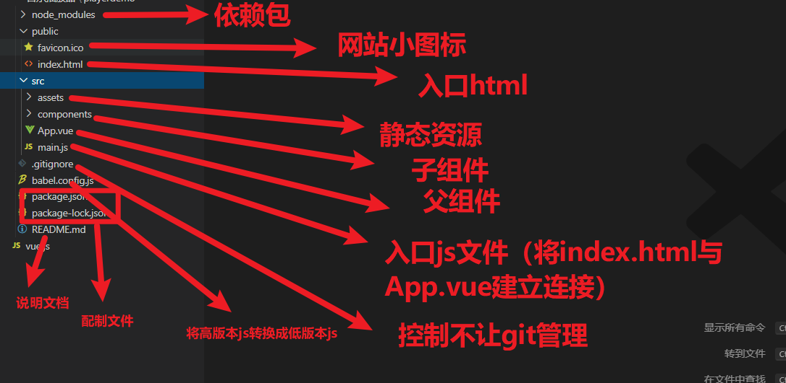

## 反馈

1.	学vue第一天：这是嘛玩意儿啊 学vue第四天：尤雨溪，永远滴神！vue，nb！
1.	棒棒棒!冲冲冲 
1.	害怕掉队
1.	老师很棒！

## 回顾

1. 组件结构
   1. html: html都是放在template,都必须 用一个标签包住
   2. js:
      1. 不需要el,template就是vue使用范围
      2. data是一个function 再return 一个对象
   3. css:  导入   @import url(路径)
2. 组件套用组件
   1. 导入外部组件
   2. 注册组件  components:{ }
   3. 使用：当标签使用
3. 组件中使用外部插件
   1. 装包  npm i 包的名字
   2. 导包   import 名字  from "包的名字"
   3. 用包  
4. 组件传值
   1. 父传子
      1. 在子组件标签上加一个ref属性  ref="值"
      2. 拿到子组件this   ===  this.$refs.值
   2. 子传父
      1. this.$parent====父组件this
5. 脚 手架创建
   1. vue create 名字（不要大写，不要中文）
   2. 

 


## 音乐播放器Demo

>用单文件组件 方式实现音乐播放器，
>
>需求：音乐列表，评论列表都要抽离成单独组件。

接口：

http://www.dongh5.com:9000/

-  http://www.dongh5.com:9000/search?keywords= 神话               搜索歌曲时接口获取音乐列表
-  http://www.dongh5.com:9000/song/url?id=310574                      获取音乐url
-  http://www.dongh5.com:9000/comment/music?id=310574         获取 用户评论列表
-  http://www.dongh5.com:9000/song/detail?ids=310574                获取 音乐详情   如图片，演唱者等


## css作用域控制 

1. scoped处理css,让它作用域只是相对自己当前组件，不包括自己子组件，但同时可控制子组件最外层的标签样式
2. 简单理解 就是加了scoped就是只是作用于当前自己这个vue文件，不包括其它任何文件（但当前自己组件的子组件的最外层还是可以控制到），但不加就会造成在使用该组件时，它里面的样式就变成了全局样式，


## 路由是什么

>路由其实就是一个指向，把路径指向相应的组件地址


## 路由实现原理


## 路由效果演示

>能够实现路由基本跳转，不同地址对应不同组件内容


3. 


## 路由的基本使用

>在vue中要实现路由是vue-router来实现

1. 安装插件（注意在项目所在目录进行安装）

   - ```html
     npm i vue-router
     ```

2. 导入插件

   - 在哪里导入插件呢？vue-router是vue的一个插件，也是一个全局的控制 ，所以最终是要挂载到new Vue上的,new Vue是在main文件中执行的，所以vue-router也就得在main文件中导入

   - ```javascript
     import  VueRouter  from  'vue-router'
     ```

3. 注册插件

   - 在vue中，router在vue中要全局使用，是需要注册才行的

   - ```vue
      Vue.use(VueRouter) 
     ```

4. 实例化router

   - ```javascript
      let router = new VueRouter({  })    //router实例化
     ```

   - ```javascript
     //配制router使用规则 
      let router = new VueRouter({  
       routes:[ // 路由规则配置，我们说了，路由就是一个地址与组件的一个指向，这个规则就是配制在这里的
           {
           path: 地址路径，    //这里配制一个路径地址
           component: 组件名   //这里对应一个.vue组件 ，也就是import一个组件，在这对应上
           }
           ] 
      })
     ```

5.  把实例注入到 new Vue 

   - ```javascript
      new Vue({
      router    //这里的router就是上面所实例化的router
      })
     ```

6. 路由出口，告诉router，需要把组件渲染在哪一个位置

      app.vue中写上一个标签，<router-view></router-view>

      router-view标签将来会被匹配到的路径对应的组件替换掉

   **main.js中加入router写法代码**

   ```javascript
   import Vue from 'vue'
   import App from './App.vue'
   // 1:导入vue-router
   import VueRouter from "vue-router"
   //这里Home是自己components下创建的一个组件 
   import Home from "./components/Home"
   // 2:注册vue-router
   Vue.use(VueRouter)
   // 3:实例化vue-router
   const router = new VueRouter({
     // 配制vue-router
     routes: [
       {
         path: "/home",     //路径地址
         component: Home    //路径地址所对应的组件
       }
     ]
   
   })
   Vue.config.productionTip = false
   
   new Vue({
     render: h => h(App),
     router    //4:注入到new Vue实例里面
   }).$mount('#app')
   
   ```


## 网易云音乐demo

流程：

1. 创建三个页面对应组件
2. 在main中配制路由对应相关组件
3. 完成跳转功能


## router-link的基本使用

用法:

```
<router-link to='/foo(路径)'>跳转至foo</router-link>
//相当于a标签   <a href="#/foo">跳转至foo</a>
//router-link相当于a标签的一种vue写法写法
```


## 编程式导航（js跳转路由写法）

>更灵活的控制路由跳转

**用法**

```javascript
this.$router.push('路径')   //这里的路径就是前面路由routes所配制的path
```


**作用**

让你可以用js代码进行路由的跳转，比如，根据接口获取到不同的值跳转不同的路由地址，这时候用标签模式是无法满足需求的，

用js代码控制 就更灵活，这里this.$router就是相当于整个router实例，也就是控制 整个路由的控制者


-   


## 在vue-cli中使用elementUI

>学习elementUI在vue中的使用，如何快速完成网站搭建
>
>让我们写更少的js代码，更少的css,拿过来就用

[直通车](https://element.eleme.cn/#/zh-CN/component/installation)

1. 装包（安装elementUI）

   - ```html
     npm i element-ui -S
     ```

2. 导包（因为elementui也有css，所以css也需要导入）

   - ```javascript
     //在main.js中导入以便全局使用
     import ElementUI from 'element-ui';
     import 'element-ui/lib/theme-chalk/index.css';
     ```

3. 注册

   - ```javascript
     Vue.use(ElementUI);
     ```

4. 使用。

   - 在需要使用elementui的组件里面按官网用法复制代码进去使用。


## element轮播图

1. 创建vue-cli    vue create 项目名

2. 安装elementui

3. 导入elementui

   1. ```js
      // 导入组件与css
      
      import ElementUI from 'element-ui';
      
      import 'element-ui/lib/theme-chalk/index.css';
      
      // 注册
      
      Vue.use(ElementUI);
      ```

4. 使用组件

   1. 复制粘贴


## 黑云音乐轮播图

>用elementUI与axios完成一个轮播图开发

获取轮播图图片接口地址：https://autumnfish.cn/banner


## 总结

1. css作用域

   1. scoped:加：它的使用范围是当前组件而且包含子组件最外层
   2. ​     不加：全局样式

2. 路由是什么：指向，把当前路径指向了一个组件

3. 路由基本使用

   1. ~~~
      1：安装插件  npm i vue-router
      2:导入  import VueRouter from 'vue-router'
      3:注册  Vue.use(VueRouter)
      4:实例化
         const router=new VueRouter({
         routes:[
         {
         path:"地址",
         component:组件名
         }
         ]
         })
       5:注入到new Vue({router})
       6:路由出口
          router-view
      ~~~

4. router-link

   ~~~
   router-link  to="path"
   
   
   ~~~

5. 编程式导航

   1. this.$router.push(path)

6. 获取当前路由信息  this.$route

7. element

   1. 安装  npm i element-ui

   2. 使用：

      1. ~~~
         import elementUi from 'element-ui'
         导入css
         Vue.use(elementUi)
         ~~~

8. 菜单

   1. ~~~
      el-menu  default-active:默认选中项（$route.path）  :router=true 使用路由模式
      el-menu-item   index:当前项的值
      ~~~

   2. 


## 路由传值

>当我们进行路由跳转时，时常是需要带一些参数过去的。

1. **传参**（在需要跳转路由的页面跳转路由时传递参数）

   - ```javascript
     二种写法：
     1：配制写法
     this.$router.push({
     path:"路径xxx",
     query:{
     //这里的query就好比在url上串了一些参数，类似于接口get请求传参
     name:"xxx"
     }
     })
     2：路径拼接写法，类似于get请求
     this.$router.push("路径?name=xxx")
     ```

2. **接参**（接收参数是在路由跳转到xxx组件后，在xxx组件里面接收）

   - ```javascript
     this.$route.query.name      //这里就可以收到whis.$router.push传递过来的参数了  
     //在相应组件接收参数
     ```

## 过滤器的基本使用

>有的时候，有些数据没法直接拿来用，就需要对这些数据进行过滤处理，过滤器就是用来做这个功能的

- **全局过滤器** （ 全局过滤器定义后，所有组件都可使用）

  - 定义（在main.js中做全局定义）

    - ```javascript
      //value是过滤器的要过滤的值，这里return的值就是最终过滤器的值 
      Vue.filter("过滤器名字",function(value){
        return  返回值        
      })
      ```

  - 使用

    - ```javascript
      //这里的value就是过滤器方法里面的参数，也就是要过滤的值
      <div class="time">{{value | 过滤器名字 }}</div>
      ```

- **局部过滤器**（只能应用于当前组件）

  - 定义（在自己所在组件里面定义）

    - ```javascript
      //上面的value是过滤器的要过滤的值，return的值就是过滤器定义的结果
      filters: {
          过滤器名字(value) {
            return 返回值 
          }
        }
      
      ```

  - ```css
    //这里的value就是过滤器方法里面的参数，也就是要过滤的值
    <div class="time">{{value | 过滤器名字 }}</div>
    ```

  **作用：**平时项目中用的较多的，就是对一些字符串加工之类的，如：接口传了你一个时间戳，你需要转换成相应的正常时间格式等。        

**Demo**

```vue
<template>
  <div>{{time | formatTime}}</div>
</template>
<script>
export default {
  data() {
    return {
      time: "1546275661000"
    };
  },
  filters: {
    formatTime(str) {
      let _date = new Date(+str);
      let _year = _date.getFullYear();
      let _month = ("0" + _date.getMonth() + 1).slice(-2);
      let _day = ("0" + _date.getDate()).slice(-2);
      let _h = ("0" + _date.getHours()).slice(-2);
      let _m = ("0" + _date.getMinutes()).slice(-2);
      let _s = ("0" + _date.getMinutes()).slice(-2);
      return (_year + "-" + _month + "-" + _day + "  " + _h + ":" + _m + ":" + _s
      );
    }
  }
};
</script>
<style>
</style>
```


## 黑云音乐demo

>展示

- https://autumnfish.cn/banner                                                   获取轮播图图片

- https://autumnfish.cn/personalized/newsong                         获取推荐音乐列表

- https://autumnfish.cn/song/url?id=310574                             获取音乐url（需传id）

- https://autumnfish.cn/search?keywords= 神话                      搜索歌曲时接口获取音乐列表(需传参keywords)

- https://autumnfish.cn/song/detail?ids=310574                      获取音乐详情如图片，演唱者等(需传参数ids)

- https://autumnfish.cn/mv/all                                                      获取mv歌曲列表

- https://autumnfish.cn/search?type=1004&keywords=神话    搜索歌曲mv时接口获取mv列表(需传参type=1004(固定)与keywords)

- https://autumnfish.cn/mv/url?id=10930186                   获取某首歌曲mv的视频地址（需传参id）

- https://autumnfish.cn/mv/detail?mvid=10930186          获取歌曲mv图片等详情（需传参mvid）

  

